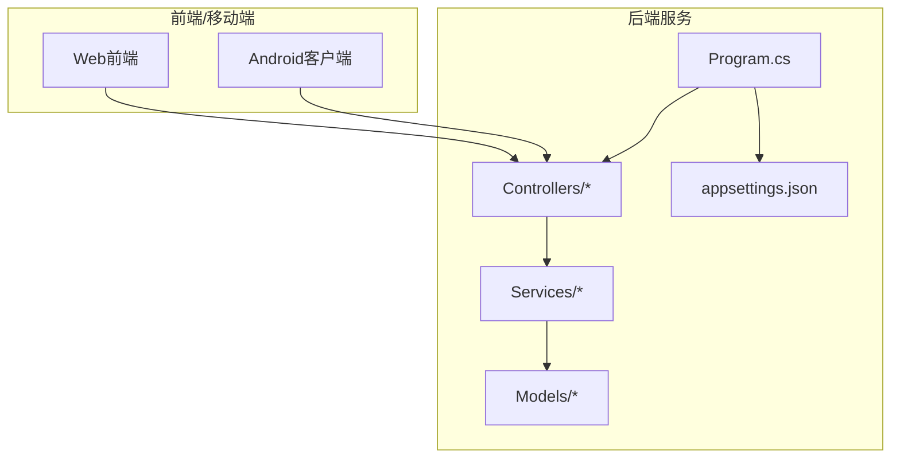
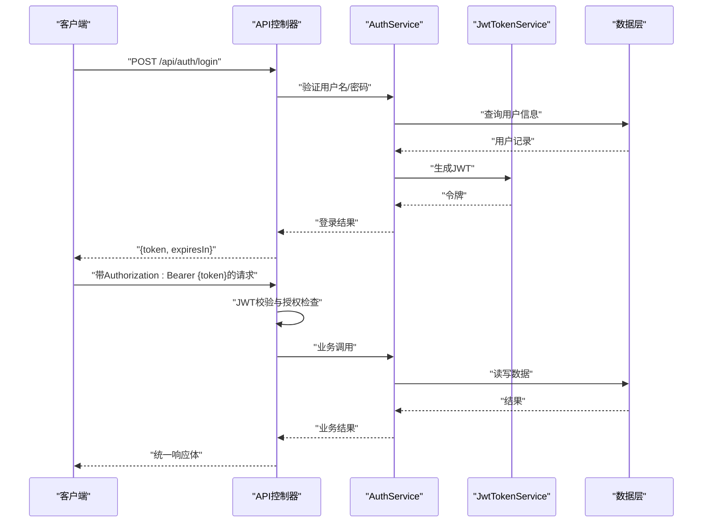
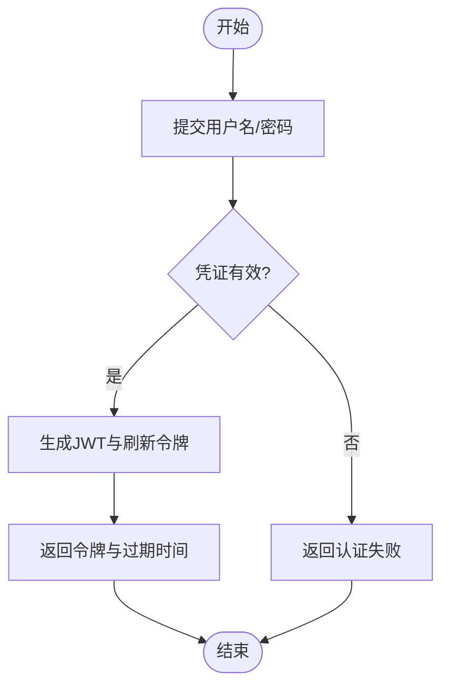
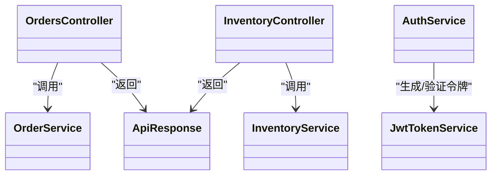

# API接口参考

<cite>
**本文档引用的文件**   
- [Program.cs](file://dip-system/Program.cs)
- [appsettings.json](file://dip-system/appsettings.json)
- [AuthController.cs](file://dip-system/api/Controllers/AuthController.cs)
- [AuthService.cs](file://dip-system/api/Services/AuthService.cs)
- [JwtTokenService.cs](file://dip-system/api/Services/JwtTokenService.cs)
- [ApiResponse.cs](file://dip-system/api/Models/ApiResponse.cs)
- [AppExceptionFilter.cs](file://dip-system/api/Controllers/AppExceptionFilter.cs)
- [RequireManagerFilter.cs](file://dip-system/api/Controllers/RequireManagerFilter.cs)
- [OrdersController.cs](file://dip-system/api/Controllers/OrdersController.cs)
- [OrderService.cs](file://dip-system/api/Services/OrderService.cs)
- [InventoryController.cs](file://dip-system/api/Controllers/InventoryController.cs)
- [InventoryService.cs](file://dip-system/api/Services/InventoryService.cs)
- [UserController.cs](file://dip-system/api/Controllers/UserController.cs)
- [UserService.cs](file://dip-system/api/Services/UserService.cs)
- [SystemController.cs](file://dip-system/api/Controllers/SystemController.cs)
- [DashboardController.cs](file://dip-system/api/Controllers/DashboardController.cs)
- [ReportController.cs](file://dip-system/api/Controllers/ReportController.cs)
- [AbnormalController.cs](file://dip-system/api/Controllers/AbnormalController.cs)
- [ChangeoverController.cs](file://dip-system/api/Controllers/ChangeoverController.cs)
- [LocationsController.cs](file://dip-system/api/Controllers/LocationsController.cs)
- [MaterialRequestController.cs](file://dip-system/api/Controllers/MaterialRequestController.cs)
- [OnlineController.cs](file://dip-system/api/Controllers/OnlineController.cs)
- [OutboundController.cs](file://dip-system/api/Controllers/OutboundController.cs)
- [PartsController.cs](file://dip-system/api/Controllers/PartsController.cs)
- [PrepController.cs](file://dip-system/api/Controllers/PrepController.cs)
- [RefillController.cs](file://dip-system/api/Controllers/RefillController.cs)
- [ReturnController.cs](file://dip-system/api/Controllers/ReturnController.cs)
- [ShelvingController.cs](file://dip-system/api/Controllers/ShelvingController.cs)
- [StockCountController.cs](file://dip-system/api/Controllers/StockCountController.cs)
- [SubstituteController.cs](file://dip-system/api/Controllers/SubstituteController.cs)
- [TransferController.cs](file://dip-system/api/Controllers/TransferController.cs)
- [ApiService.kt](file://mobile-android/app/src/main/java/com/dip/material/data/network/ApiService.kt)
- [RetrofitClient.kt](file://mobile-android/app/src/main/java/com/dip/material/data/network/RetrofitClient.kt)
- [AuthInterceptor.kt](file://mobile-android/app/src/main/java/com/dip/material/data/network/AuthInterceptor.kt)
- [TokenHolder.kt](file://mobile-android/app/src/main/java/com/dip/material/data/network/TokenHolder.kt)
</cite>

## 目录
1. [简介](#简介)
2. [项目结构](#项目结构)
3. [核心组件](#核心组件)
4. [架构总览](#架构总览)
5. [详细组件分析](#详细组件分析)
6. [依赖关系分析](#依赖关系分析)
7. [性能与限流缓存](#性能与限流缓存)
8. [故障排查指南](#故障排查指南)
9. [结论](#结论)
10. [附录](#附录)

## 简介
本文件为DIP系统API接口的全面参考文档，覆盖RESTful端点、身份认证（JWT）、统一响应格式、错误码与异常处理、版本控制、分页排序过滤、批量操作、限流与缓存策略、以及移动端SDK集成示例。读者可据此快速完成前后端或移动端对接与排障。

## 项目结构
后端采用ASP.NET Core Web API，控制器位于api/Controllers，业务逻辑在api/Services，数据模型在api/Models，配置在appsettings.json，入口在Program.cs。前端Web与Android客户端分别通过HTTP调用API。

图表来源
- [Program.cs](file://dip-system/Program.cs)
- [appsettings.json](file://dip-system/appsettings.json)

章节来源
- [Program.cs](file://dip-system/Program.cs)
- [appsettings.json](file://dip-system/appsettings.json)

## 核心组件
- 统一响应体：所有API返回统一的JSON结构，包含状态码、消息和数据体，便于前端一致处理。
- 全局异常过滤器：捕获未处理异常并转换为标准错误响应。
- 鉴权中间件：基于JWT的访问令牌校验与角色/权限拦截。
- 控制器与服务层：控制器负责路由与参数校验，服务层封装业务逻辑与数据访问。

章节来源
- [ApiResponse.cs](file://dip-system/api/Models/ApiResponse.cs)
- [AppExceptionFilter.cs](file://dip-system/api/Controllers/AppExceptionFilter.cs)
- [JwtTokenService.cs](file://dip-system/api/Services/JwtTokenService.cs)
- [AuthService.cs](file://dip-system/api/Services/AuthService.cs)

## 架构总览
整体采用分层架构：客户端 -> ASP.NET Core API -> 服务层 -> 数据模型/数据库。认证流程由AuthService与JwtTokenService协作完成；通用能力（如分页、排序、过滤）在服务层实现并通过控制器暴露。

图表来源
- [AuthController.cs](file://dip-system/api/Controllers/AuthController.cs)
- [AuthService.cs](file://dip-system/api/Services/AuthService.cs)
- [JwtTokenService.cs](file://dip-system/api/Services/JwtTokenService.cs)

## 详细组件分析

### 身份认证（JWT）
- 登录获取令牌：提供登录接口，成功后返回访问令牌与过期时间。
- 刷新令牌：支持使用刷新令牌换取新的访问令牌。
- 令牌校验：请求携带Authorization头，服务端校验签名、有效期与权限。
- 安全建议：令牌最小化存储、HTTPS传输、短过期时间、刷新令牌轮换。

图表来源
- [AuthController.cs](file://dip-system/api/Controllers/AuthController.cs)
- [AuthService.cs](file://dip-system/api/Services/AuthService.cs)
- [JwtTokenService.cs](file://dip-system/api/Services/JwtTokenService.cs)

章节来源
- [AuthController.cs](file://dip-system/api/Controllers/AuthController.cs)
- [AuthService.cs](file://dip-system/api/Services/AuthService.cs)
- [JwtTokenService.cs](file://dip-system/api/Services/JwtTokenService.cs)

### 统一响应格式
- 成功响应：包含状态码、消息、数据对象。
- 错误响应：包含错误码、错误消息、可选详情。
- 分页响应：包含数据列表、总数、页码、每页大小等元信息。

章节来源
- [ApiResponse.cs](file://dip-system/api/Models/ApiResponse.cs)

### 错误处理与异常
- 全局异常过滤器将未捕获异常转换为标准错误响应。
- 业务异常在服务层抛出，控制器统一处理。
- 常见错误码：认证失败、权限不足、参数校验失败、资源不存在、服务器内部错误。

章节来源
- [AppExceptionFilter.cs](file://dip-system/api/Controllers/AppExceptionFilter.cs)

### 权限与角色控制
- 基于角色的访问控制（RBAC），可通过过滤器限制特定角色访问。
- 管理员接口需具备管理员角色。

章节来源
- [RequireManagerFilter.cs](file://dip-system/api/Controllers/RequireManagerFilter.cs)

### 订单管理API
- 典型端点：创建订单、查询订单列表（分页/排序/过滤）、更新订单状态、删除订单、批量操作。
- 请求参数：订单号、产品、数量、优先级、备注等。
- 响应格式：统一响应体，列表接口包含分页元信息。

章节来源
- [OrdersController.cs](file://dip-system/api/Controllers/OrdersController.cs)
- [OrderService.cs](file://dip-system/api/Services/OrderService.cs)

### 库存管理API
- 典型端点：入库、出库、盘点、库存查询（按库位/批次/供应商）。
- 请求参数：物料编码、数量、库位、批次、操作人等。
- 响应格式：统一响应体，支持事务性操作。

章节来源
- [InventoryController.cs](file://dip-system/api/Controllers/InventoryController.cs)
- [InventoryService.cs](file://dip-system/api/Services/InventoryService.cs)

### 用户管理API
- 典型端点：用户列表、新增用户、修改用户、禁用/启用、重置密码。
- 权限要求：管理员角色。
- 响应格式：统一响应体，敏感字段脱敏。

章节来源
- [UserController.cs](file://dip-system/api/Controllers/UserController.cs)
- [UserService.cs](file://dip-system/api/Services/UserService.cs)

### 系统与健康检查API
- 健康检查：/api/system/health
- 配置读取：只读配置项（非敏感）
- 日志与监控：系统指标与运行状态

章节来源
- [SystemController.cs](file://dip-system/api/Controllers/SystemController.cs)

### 看板与报表API
- 看板：关键指标汇总、实时统计
- 报表：导出PDF/Excel、定时任务状态

章节来源
- [DashboardController.cs](file://dip-system/api/Controllers/DashboardController.cs)
- [ReportController.cs](file://dip-system/api/Controllers/ReportController.cs)

### 其他业务模块API
- 异常上报：/api/abnormal
- 换线管理：/api/changeover
- 库位管理：/api/locations
- 物料需求：/api/material-request
- 在线状态：/api/online
- 出库管理：/api/outbound
- 零件管理：/api/parts
- 备料管理：/api/prep
- 补料管理：/api/refill
- 退货管理：/api/return
- 上架管理：/api/shelving
- 盘点管理：/api/stock-count
- 替代料管理：/api/substitute
- 调拨管理：/api/transfer

章节来源
- [AbnormalController.cs](file://dip-system/api/Controllers/AbnormalController.cs)
- [ChangeoverController.cs](file://dip-system/api/Controllers/ChangeoverController.cs)
- [LocationsController.cs](file://dip-system/api/Controllers/LocationsController.cs)
- [MaterialRequestController.cs](file://dip-system/api/Controllers/MaterialRequestController.cs)
- [OnlineController.cs](file://dip-system/api/Controllers/OnlineController.cs)
- [OutboundController.cs](file://dip-system/api/Controllers/OutboundController.cs)
- [PartsController.cs](file://dip-system/api/Controllers/PartsController.cs)
- [PrepController.cs](file://dip-system/api/Controllers/PrepController.cs)
- [RefillController.cs](file://dip-system/api/Controllers/RefillController.cs)
- [ReturnController.cs](file://dip-system/api/Controllers/ReturnController.cs)
- [ShelvingController.cs](file://dip-system/api/Controllers/ShelvingController.cs)
- [StockCountController.cs](file://dip-system/api/Controllers/StockCountController.cs)
- [SubstituteController.cs](file://dip-system/api/Controllers/SubstituteController.cs)
- [TransferController.cs](file://dip-system/api/Controllers/TransferController.cs)

### 分页、排序与过滤
- 分页参数：page、pageSize
- 排序参数：sortBy、sortOrder
- 过滤参数：按业务字段筛选（如日期范围、状态、编码）
- 建议：服务端校验与默认值保护，避免过大pageSize

章节来源
- [OrdersController.cs](file://dip-system/api/Controllers/OrdersController.cs)
- [InventoryController.cs](file://dip-system/api/Controllers/InventoryController.cs)

### 批量操作
- 支持批量创建、更新、删除
- 事务性保证，部分失败回滚
- 建议：限制单次批量大小，异步处理大任务

章节来源
- [OrdersController.cs](file://dip-system/api/Controllers/OrdersController.cs)
- [InventoryController.cs](file://dip-system/api/Controllers/InventoryController.cs)

### API版本控制
- 路径前缀或Header方式区分版本（如/v1）
- 向后兼容策略：新增字段不破坏旧客户端
- 废弃端点标记与迁移指引

章节来源
- [Program.cs](file://dip-system/Program.cs)

## 依赖关系分析
控制器依赖服务层，服务层依赖数据模型与外部系统。认证相关依赖AuthService与JwtTokenService。

图表来源
- [OrdersController.cs](file://dip-system/api/Controllers/OrdersController.cs)
- [OrderService.cs](file://dip-system/api/Services/OrderService.cs)
- [InventoryController.cs](file://dip-system/api/Controllers/InventoryController.cs)
- [InventoryService.cs](file://dip-system/api/Services/InventoryService.cs)
- [AuthService.cs](file://dip-system/api/Services/AuthService.cs)
- [JwtTokenService.cs](file://dip-system/api/Services/JwtTokenService.cs)
- [ApiResponse.cs](file://dip-system/api/Models/ApiResponse.cs)

章节来源
- [OrdersController.cs](file://dip-system/api/Controllers/OrdersController.cs)
- [OrderService.cs](file://dip-system/api/Services/OrderService.cs)
- [InventoryController.cs](file://dip-system/api/Controllers/InventoryController.cs)
- [InventoryService.cs](file://dip-system/api/Services/InventoryService.cs)
- [AuthService.cs](file://dip-system/api/Services/AuthService.cs)
- [JwtTokenService.cs](file://dip-system/api/Services/JwtTokenService.cs)
- [ApiResponse.cs](file://dip-system/api/Models/ApiResponse.cs)

## 性能与限流缓存
- 限流策略：基于IP或用户的请求速率限制，防止滥用。
- 缓存策略：热点数据（字典、配置）使用内存缓存；列表接口可短期缓存。
- 数据库优化：索引设计、分页查询、避免N+1问题。
- 连接池与超时：合理设置数据库与外部服务连接池与超时。
- 压缩与传输：启用Gzip压缩，减少响应体积。

章节来源
- [Program.cs](file://dip-system/Program.cs)
- [appsettings.json](file://dip-system/appsettings.json)

## 故障排查指南
- 认证失败：检查Authorization头、令牌有效期、签名密钥。
- 权限不足：确认用户角色与接口所需角色匹配。
- 参数校验错误：检查必填字段、类型与范围。
- 资源不存在：核对ID或编码是否正确。
- 服务器错误：查看日志与异常堆栈，定位服务层异常。

章节来源
- [AppExceptionFilter.cs](file://dip-system/api/Controllers/AppExceptionFilter.cs)

## 结论
DIP系统API采用清晰的层次结构与统一响应格式，结合JWT认证与全局异常处理，具备良好的可扩展性与可维护性。建议在生产环境启用限流、缓存与监控，确保稳定性与性能。

## 附录

### 请求与响应示例
- 登录请求：POST /api/auth/login，请求体包含用户名与密码。
- 登录响应：返回访问令牌与过期时间。
- 错误示例：认证失败返回统一错误响应体。

章节来源
- [AuthController.cs](file://dip-system/api/Controllers/AuthController.cs)
- [ApiResponse.cs](file://dip-system/api/Models/ApiResponse.cs)

### Postman集合与SDK使用
- Postman集合：导入环境变量与基础URL，预置认证请求。
- Android SDK：使用Retrofit定义接口，AuthInterceptor自动附加Authorization头，TokenHolder管理令牌生命周期。

章节来源
- [ApiService.kt](file://mobile-android/app/src/main/java/com/dip/material/data/network/ApiService.kt)
- [RetrofitClient.kt](file://mobile-android/app/src/main/java/com/dip/material/data/network/RetrofitClient.kt)
- [AuthInterceptor.kt](file://mobile-android/app/src/main/java/com/dip/material/data/network/AuthInterceptor.kt)
- [TokenHolder.kt](file://mobile-android/app/src/main/java/com/dip/material/data/network/TokenHolder.kt)

### 集成示例代码（Android）
- 初始化RetrofitClient，设置Base URL与拦截器。
- 调用ApiService中的登录接口获取令牌。
- 后续请求自动携带Authorization头。

章节来源
- [RetrofitClient.kt](file://mobile-android/app/src/main/java/com/dip/material/data/network/RetrofitClient.kt)
- [ApiService.kt](file://mobile-android/app/src/main/java/com/dip/material/data/network/ApiService.kt)
- [AuthInterceptor.kt](file://mobile-android/app/src/main/java/com/dip/material/data/network/AuthInterceptor.kt)
- [TokenHolder.kt](file://mobile-android/app/src/main/java/com/dip/material/data/network/TokenHolder.kt)