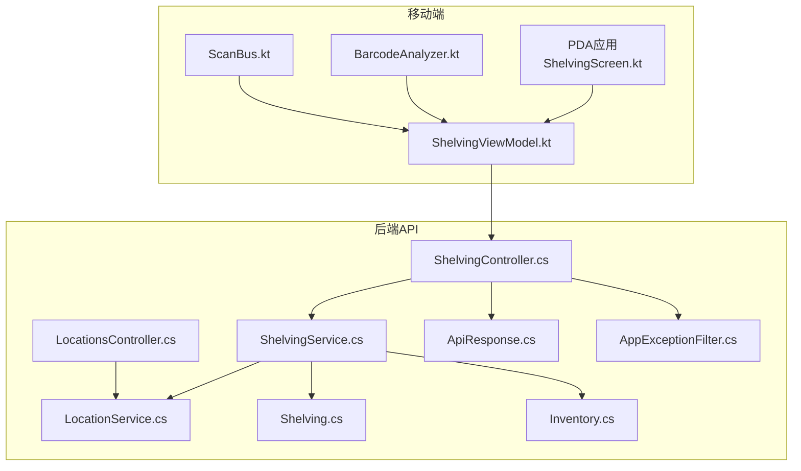
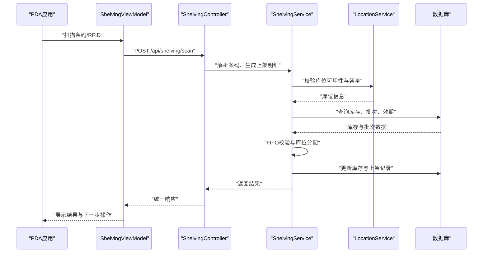
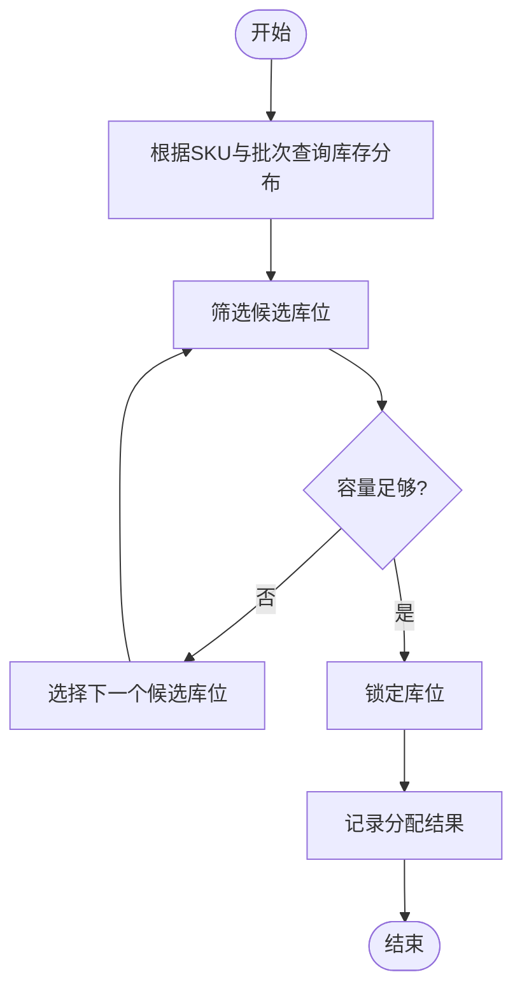
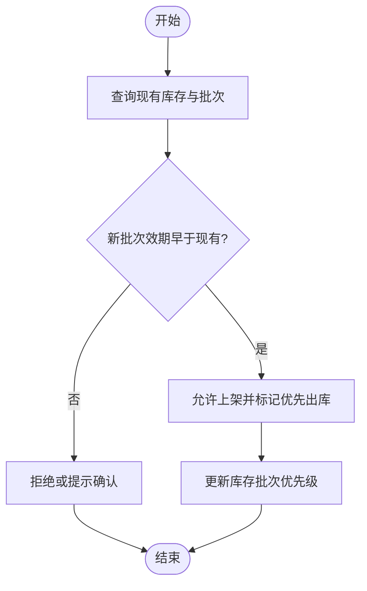
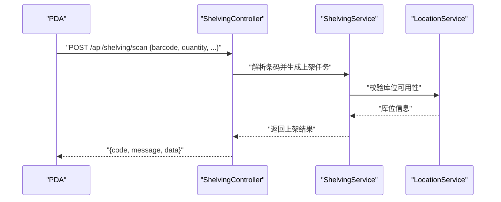
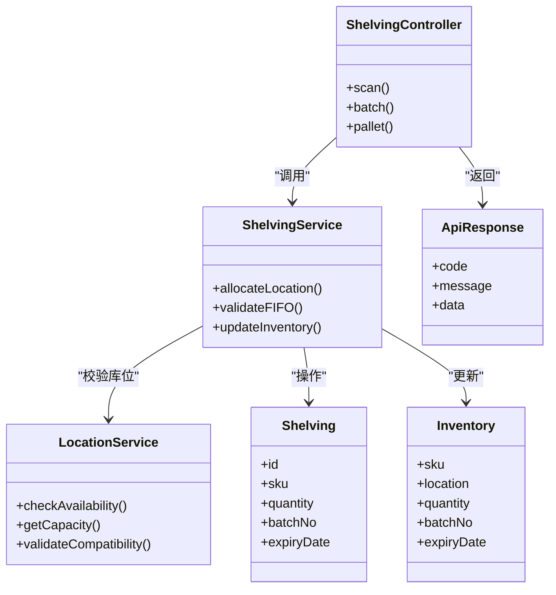

# 上架作业接口

<cite>
**本文引用的文件**   
- [ShelvingController.cs](file://dip-system/api/Controllers/ShelvingController.cs)
- [ShelvingService.cs](file://dip-system/api/Services/ShelvingService.cs)
- [Shelving.cs](file://dip-system/api/Models/Shelving.cs)
- [Inventory.cs](file://dip-system/api/Models/Inventory.cs)
- [LocationsController.cs](file://dip-system/api/Controllers/LocationsController.cs)
- [LocationService.cs](file://dip-system/api/Services/LocationService.cs)
- [AppExceptionFilter.cs](file://dip-system/api/Controllers/AppExceptionFilter.cs)
- [ApiResponse.cs](file://dip-system/api/Models/ApiResponse.cs)
- [ApiService.kt](file://mobile-android/app/src/main/java/com/dip/material/data/network/ApiService.kt)
- [ShelvingScreen.kt](file://mobile-android/app/src/main/java/com/dip/material/ui/shelving/ShelvingScreen.kt)
- [ShelvingViewModel.kt](file://mobile-android/app/src/main/java/com/dip/material/ui/shelving/ShelvingViewModel.kt)
- [BarcodeAnalyzer.kt](file://mobile-android/app/src/main/java/com/dip/material/ui/components/BarcodeAnalyzer.kt)
- [ScanBus.kt](file://mobile-android/app/src/main/java/com/dip/material/utils/ScanBus.kt)
- [Program.cs](file://dip-system/api/Program.cs)
</cite>

## 目录
1. [简介](#简介)
2. [项目结构](#项目结构)
3. [核心组件](#核心组件)
4. [架构总览](#架构总览)
5. [详细组件分析](#详细组件分析)
6. [依赖关系分析](#依赖关系分析)
7. [性能考虑](#性能考虑)
8. [故障排查指南](#故障排查指南)
9. [结论](#结论)
10. [附录](#附录)

## 简介
本文件面向DIP系统的“上架作业”模块，系统化说明库位分配策略、批次与效期管理、先进先出（FIFO）逻辑，以及PDA扫码上架、批量上架、整托上架等接口的HTTP方法、URL路径、请求参数与响应格式。同时覆盖库位校验、库存更新、效期管理的业务规则，并提供完整示例、异常处理与错误码说明，以及与自动化设备、AGV系统的集成要点和条码/RFID识别的特殊处理逻辑。

## 项目结构
- 后端API采用C# ASP.NET Core，控制器位于api/Controllers，服务层位于api/Services，数据模型位于api/Models。
- 前端Web与移动端Android分别提供操作界面与扫码能力，通过REST API与后端交互。
- 上架作业相关的关键文件包括：
  - ShelvingController.cs：上架作业API入口
  - ShelvingService.cs：上架业务逻辑（库位分配、批次/效期、FIFO校验、库存更新）
  - Shelving.cs / Inventory.cs：上架与库存数据模型
  - LocationsController.cs / LocationService.cs：库位查询与校验
  - AppExceptionFilter.cs / ApiResponse.cs：统一异常与响应封装
  - mobile端：ApiService.kt、ShelvingScreen.kt、ShelvingViewModel.kt、BarcodeAnalyzer.kt、ScanBus.kt

**图表来源**
- [ShelvingController.cs](file://dip-system/api/Controllers/ShelvingController.cs)
- [ShelvingService.cs](file://dip-system/api/Services/ShelvingService.cs)
- [LocationsController.cs](file://dip-system/api/Controllers/LocationsController.cs)
- [LocationService.cs](file://dip-system/api/Services/LocationService.cs)
- [Shelving.cs](file://dip-system/api/Models/Shelving.cs)
- [Inventory.cs](file://dip-system/api/Models/Inventory.cs)
- [ApiResponse.cs](file://dip-system/api/Models/ApiResponse.cs)
- [AppExceptionFilter.cs](file://dip-system/api/Controllers/AppExceptionFilter.cs)
- [ApiService.kt](file://mobile-android/app/src/main/java/com/dip/material/data/network/ApiService.kt)
- [ShelvingScreen.kt](file://mobile-android/app/src/main/java/com/dip/material/ui/shelving/ShelvingScreen.kt)
- [ShelvingViewModel.kt](file://mobile-android/app/src/main/java/com/dip/material/ui/shelving/ShelvingViewModel.kt)
- [BarcodeAnalyzer.kt](file://mobile-android/app/src/main/java/com/dip/material/ui/components/BarcodeAnalyzer.kt)
- [ScanBus.kt](file://mobile-android/app/src/main/java/com/dip/material/utils/ScanBus.kt)

**章节来源**
- [Program.cs](file://dip-system/api/Program.cs)

## 核心组件
- 控制器层（ShelvingController）：暴露上架作业的REST接口，负责参数校验、调用服务层、返回统一响应。
- 服务层（ShelvingService）：实现库位分配策略、批次与效期管理、FIFO校验、库存更新、事务控制。
- 库位服务（LocationService）：提供库位可用性、容量、类型、效期策略等校验能力。
- 数据模型（Shelving、Inventory）：定义上架单、明细、库存记录的数据结构与约束。
- 统一响应与异常（ApiResponse、AppExceptionFilter）：标准化返回格式与全局异常处理。

**章节来源**
- [ShelvingController.cs](file://dip-system/api/Controllers/ShelvingController.cs)
- [ShelvingService.cs](file://dip-system/api/Services/ShelvingService.cs)
- [LocationService.cs](file://dip-system/api/Services/LocationService.cs)
- [Shelving.cs](file://dip-system/api/Models/Shelving.cs)
- [Inventory.cs](file://dip-system/api/Models/Inventory.cs)
- [ApiResponse.cs](file://dip-system/api/Models/ApiResponse.cs)
- [AppExceptionFilter.cs](file://dip-system/api/Controllers/AppExceptionFilter.cs)

## 架构总览
上架作业整体流程如下：
- PDA扫码或批量导入触发上架请求
- 控制器接收并校验参数
- 服务层执行库位分配、批次/效期校验、FIFO检查、库存更新
- 库位服务进行库位容量与类型校验
- 统一响应封装并返回结果
- 异常由全局过滤器捕获并转换为标准错误格式

**图表来源**
- [ShelvingController.cs](file://dip-system/api/Controllers/ShelvingController.cs)
- [ShelvingService.cs](file://dip-system/api/Services/ShelvingService.cs)
- [LocationService.cs](file://dip-system/api/Services/LocationService.cs)
- [Shelving.cs](file://dip-system/api/Models/Shelving.cs)
- [Inventory.cs](file://dip-system/api/Models/Inventory.cs)

## 详细组件分析

### 库位分配策略
- 策略原则：优先选择同SKU、同批次、同效期的库位；若不存在则按库位类型（托盘位、箱位、散件位）与容量匹配；支持按区域/通道/层号排序。
- 分配步骤：
  1) 根据物料编码与批次查询现有库存分布
  2) 计算目标库位的剩余容量与兼容性
  3) 选择最优库位并锁定（防止并发冲突）
  4) 记录分配结果与原因（便于审计）

**图表来源**
- [ShelvingService.cs](file://dip-system/api/Services/ShelvingService.cs)
- [LocationService.cs](file://dip-system/api/Services/LocationService.cs)

**章节来源**
- [ShelvingService.cs](file://dip-system/api/Services/ShelvingService.cs)
- [LocationService.cs](file://dip-system/api/Services/LocationService.cs)

### 批次管理与先进先出（FIFO）逻辑
- 批次管理：每个入库批次需记录生产日期、有效期、入库时间；出库时优先使用最早到期批次。
- FIFO校验：
  1) 查询当前库存中最早到期批次
  2) 比较待上架批次的效期与现有批次
  3) 若新批次效期晚于现有批次，需提示或拒绝上架（取决于策略配置）
  4) 记录批次流转日志

**图表来源**
- [ShelvingService.cs](file://dip-system/api/Services/ShelvingService.cs)
- [Inventory.cs](file://dip-system/api/Models/Inventory.cs)

**章节来源**
- [ShelvingService.cs](file://dip-system/api/Services/ShelvingService.cs)
- [Inventory.cs](file://dip-system/api/Models/Inventory.cs)

### PDA扫码上架接口
- HTTP方法：POST
- URL路径：/api/shelving/scan
- 请求参数：
  - barcode: 条码字符串（支持EAN-13、UPC-A、Code128等）
  - quantity: 上架数量
  - batchNo: 批次号（可选，若条码未包含）
  - expiryDate: 有效期（可选，若条码未包含）
  - operatorId: 操作员ID
- 响应格式：
  - code: 状态码（200成功，其他为错误）
  - message: 描述信息
  - data: 上架结果（库位号、批次信息、库存更新详情）

**图表来源**
- [ShelvingController.cs](file://dip-system/api/Controllers/ShelvingController.cs)
- [ShelvingService.cs](file://dip-system/api/Services/ShelvingService.cs)
- [LocationService.cs](file://dip-system/api/Services/LocationService.cs)

**章节来源**
- [ShelvingController.cs](file://dip-system/api/Controllers/ShelvingController.cs)
- [ShelvingService.cs](file://dip-system/api/Services/ShelvingService.cs)
- [ApiService.kt](file://mobile-android/app/src/main/java/com/dip/material/data/network/ApiService.kt)
- [ShelvingScreen.kt](file://mobile-android/app/src/main/java/com/dip/material/ui/shelving/ShelvingScreen.kt)
- [ShelvingViewModel.kt](file://mobile-android/app/src/main/java/com/dip/material/ui/shelving/ShelvingViewModel.kt)
- [BarcodeAnalyzer.kt](file://mobile-android/app/src/main/java/com/dip/material/ui/components/BarcodeAnalyzer.kt)

### 批量上架接口
- HTTP方法：POST
- URL路径：/api/shelving/batch
- 请求参数：
  - items: 数组，每项包含sku、quantity、batchNo、expiryDate、targetLocation（可选）
  - operatorId: 操作员ID
- 响应格式：
  - code: 状态码
  - message: 描述信息
  - data: 批量结果（成功项、失败项、错误详情）

**章节来源**
- [ShelvingController.cs](file://dip-system/api/Controllers/ShelvingController.cs)
- [ShelvingService.cs](file://dip-system/api/Services/ShelvingService.cs)

### 整托上架接口
- HTTP方法：POST
- URL路径：/api/shelving/pallet
- 请求参数：
  - palletId: 托盘ID
  - sku: 物料编码
  - quantity: 总数量
  - batchNo: 批次号
  - expiryDate: 有效期
  - targetLocation: 目标库位（系统可自动分配）
  - operatorId: 操作员ID
- 响应格式：
  - code: 状态码
  - message: 描述信息
  - data: 整托上架结果（库位分配、批次绑定、库存更新）

**章节来源**
- [ShelvingController.cs](file://dip-system/api/Controllers/ShelvingController.cs)
- [ShelvingService.cs](file://dip-system/api/Services/ShelvingService.cs)

### 库位校验与库存更新
- 库位校验：
  - 库位类型匹配（托盘位、箱位、散件位）
  - 容量检查（剩余容量是否足够）
  - 兼容性检查（物料属性与库位环境要求）
- 库存更新：
  - 新增或合并库存记录
  - 更新批次与效期信息
  - 记录操作日志（谁、何时、为何）

**章节来源**
- [LocationService.cs](file://dip-system/api/Services/LocationService.cs)
- [ShelvingService.cs](file://dip-system/api/Services/ShelvingService.cs)
- [Inventory.cs](file://dip-system/api/Models/Inventory.cs)

### 效期管理
- 效期录入：从条码或手动输入获取生产日期与有效期
- 效期校验：禁止过期物料上架，警告临期物料
- 效期优先：FIFO逻辑确保最早到期批次优先出库

**章节来源**
- [ShelvingService.cs](file://dip-system/api/Services/ShelvingService.cs)
- [Inventory.cs](file://dip-system/api/Models/Inventory.cs)

### 条码解析与RFID识别
- 条码解析：
  - 支持多种条码格式（EAN-13、UPC-A、Code128）
  - 解析物料编码、批次号、有效期等字段
- RFID识别：
  - 读取RFID标签唯一ID
  - 映射到物料主数据与批次信息
  - 特殊处理：重复扫描去重、信号干扰重试

**章节来源**
- [BarcodeAnalyzer.kt](file://mobile-android/app/src/main/java/com/dip/material/ui/components/BarcodeAnalyzer.kt)
- [ScanBus.kt](file://mobile-android/app/src/main/java/com/dip/material/utils/ScanBus.kt)
- [ShelvingService.cs](file://dip-system/api/Services/ShelvingService.cs)

### 与自动化设备、AGV系统集成
- 集成方式：
  - REST API回调通知AGV调度系统
  - 事件总线推送上架完成事件
  - 设备状态同步（库位占用、托盘搬运状态）
- 关键接口：
  - POST /api/shelving/complete：通知设备上架完成
  - GET /api/shelving/status：查询上架任务状态
  - POST /api/shelving/cancel：取消进行中任务

**章节来源**
- [ShelvingController.cs](file://dip-system/api/Controllers/ShelvingController.cs)
- [ShelvingService.cs](file://dip-system/api/Services/ShelvingService.cs)

## 依赖关系分析
- 控制器依赖服务层，服务层依赖库位服务与数据模型
- 移动端依赖网络层与UI组件，通过ViewModel协调扫码与API调用
- 异常过滤器拦截所有未处理异常，转换为统一错误格式

**图表来源**
- [ShelvingController.cs](file://dip-system/api/Controllers/ShelvingController.cs)
- [ShelvingService.cs](file://dip-system/api/Services/ShelvingService.cs)
- [LocationService.cs](file://dip-system/api/Services/LocationService.cs)
- [Shelving.cs](file://dip-system/api/Models/Shelving.cs)
- [Inventory.cs](file://dip-system/api/Models/Inventory.cs)
- [ApiResponse.cs](file://dip-system/api/Models/ApiResponse.cs)

**章节来源**
- [ShelvingController.cs](file://dip-system/api/Controllers/ShelvingController.cs)
- [ShelvingService.cs](file://dip-system/api/Services/ShelvingService.cs)
- [LocationService.cs](file://dip-system/api/Services/LocationService.cs)
- [Shelving.cs](file://dip-system/api/Models/Shelving.cs)
- [Inventory.cs](file://dip-system/api/Models/Inventory.cs)
- [ApiResponse.cs](file://dip-system/api/Models/ApiResponse.cs)

## 性能考虑
- 库位分配算法优化：使用索引加速SKU与批次查询，缓存热点库位信息
- 批量操作事务：确保批量上架的原子性，避免部分成功导致数据不一致
- 并发控制：库位锁机制防止多用户同时分配同一库位
- 异步处理：长时间任务（如整托上架）采用异步队列处理，提升响应速度

[本节为通用指导，无需特定文件引用]

## 故障排查指南
- 常见错误：
  - 库位不足：检查库位容量与类型匹配
  - 批次冲突：确认批次号与效期一致性
  - 条码解析失败：验证条码格式与内容完整性
  - 权限不足：检查操作员权限与角色配置
- 调试建议：
  - 启用详细日志记录上架流程
  - 使用测试工具模拟扫码与批量请求
  - 检查数据库事务日志与异常堆栈

**章节来源**
- [AppExceptionFilter.cs](file://dip-system/api/Controllers/AppExceptionFilter.cs)
- [ApiResponse.cs](file://dip-system/api/Models/ApiResponse.cs)

## 结论
上架作业模块通过清晰的职责分离与标准化接口设计，实现了高效的库位分配、批次管理与FIFO逻辑。结合PDA扫码与批量操作，提升了仓库作业效率与准确性。未来可进一步优化算法性能与扩展更多自动化设备集成场景。

[本节为总结性内容，无需特定文件引用]

## 附录
- 错误码说明：
  - 200：成功
  - 400：请求参数错误
  - 401：未授权
  - 403：权限不足
  - 404：资源不存在
  - 500：服务器内部错误
- 集成示例：
  - AGV调度系统回调上架完成事件
  - WMS系统同步库存变更
  - 报表系统采集上架统计数据

[本节为补充信息，无需特定文件引用]