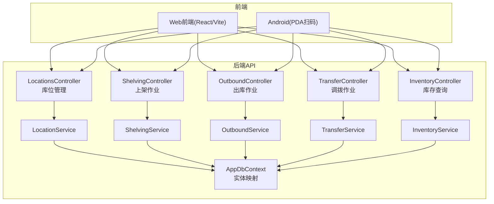
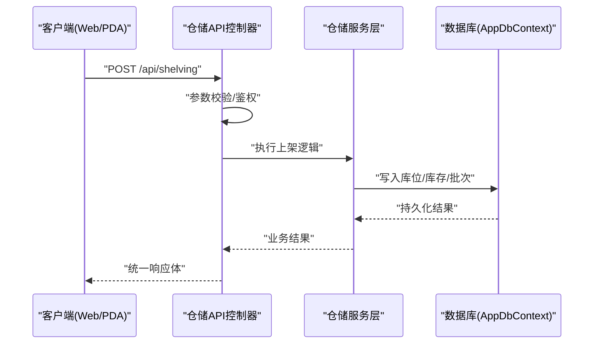
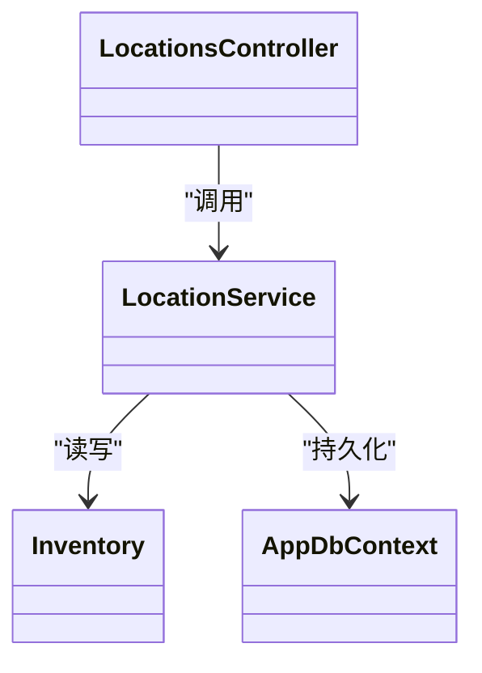

# 仓储作业接口

<cite>
**本文档引用的文件**   
- [Program.cs](file://dip-system/api/Program.cs)
- [appsettings.json](file://dip-system/api/appsettings.json)
- [AppDbContext.cs](file://dip-system/api/Data/AppDbContext.cs)
- [ApiResponse.cs](file://dip-system/api/Models/ApiResponse.cs)
- [BaseEntity.cs](file://dip-system/api/Models/BaseEntity.cs)
- [Inventory.cs](file://dip-system/api/Models/Inventory.cs)
- [Shelving.cs](file://dip-system/api/Models/Shelving.cs)
- [Outbound.cs](file://dip-system/api/Models/Outbound.cs)
- [Transfer.cs](file://dip-system/api/Models/Transfer.cs)
- [LocationsController.cs](file://dip-system/api/Controllers/LocationsController.cs)
- [ShelvingController.cs](file://dip-system/api/Controllers/ShelvingController.cs)
- [OutboundController.cs](file://dip-system/api/Controllers/OutboundController.cs)
- [TransferController.cs](file://dip-system/api/Controllers/TransferController.cs)
- [InventoryController.cs](file://dip-system/api/Controllers/InventoryController.cs)
- [LocationService.cs](file://dip-system/api/Services/LocationService.cs)
- [ShelvingService.cs](file://dip-system/api/Services/ShelvingService.cs)
- [OutboundService.cs](file://dip-system/api/Services/OutboundService.cs)
- [TransferService.cs](file://dip-system/api/Services/TransferService.cs)
- [InventoryService.cs](file://dip-system/api/Services/InventoryService.cs)
- [ApiService.kt](file://mobile-android/app/src/main/java/com/dip/material/data/network/ApiService.kt)
- [RetrofitClient.kt](file://mobile-android/app/src/main/java/com/dip/material/data/network/RetrofitClient.kt)
- [AuthInterceptor.kt](file://mobile-android/app/src/main/java/com/dip/material/data/network/AuthInterceptor.kt)
- [BarcodeAnalyzer.kt](file://mobile-android/app/src/main/java/com/dip/material/ui/components/BarcodeAnalyzer.kt)
- [QrCodeScanner.kt](file://mobile-android/app/src/main/java/com/dip/material/ui/components/QrCodeScanner.kt)
- [ScanBus.kt](file://mobile-android/app/src/main/java/com/dip/material/utils/ScanBus.kt)
- [ScanConfig.kt](file://mobile-android/app/src/main/java/com/dip/material/utils/ScanConfig.kt)
- [ScanSoundManager.kt](file://mobile-android/app/src/main/java/com/dip/material/utils/ScanSoundManager.kt)
- [init-db.sql](file://scripts/init-db.sql)
</cite>

## 目录
1. [简介](#简介)
2. [项目结构](#项目结构)
3. [核心组件](#核心组件)
4. [架构总览](#架构总览)
5. [详细组件分析](#详细组件分析)
6. [依赖关系分析](#依赖关系分析)
7. [性能考虑](#性能考虑)
8. [故障排查指南](#故障排查指南)
9. [结论](#结论)
10. [附录](#附录)

## 简介
本文件面向DIP系统的仓储作业相关API，覆盖上架、出库、调拨、库位管理等核心业务。文档内容包括：
- HTTP方法与URL路径、请求参数与响应格式规范
- 库位管理、批次管理、先进先出策略说明
- 出库拣货、包装、发货流程；调拨审批与在途跟踪
- 库位优化、库存周转、效期管理逻辑
- 完整作业示例、异常处理示例、批量操作示例
- 与自动化设备、AGV系统集成的接口约定
- PDA扫码作业与RFID识别的特殊处理

## 项目结构
后端采用ASP.NET Core Web API，按“控制器-服务-数据模型”分层组织；前端Web与移动端Android分别通过REST调用API。数据库使用EF Core上下文进行持久化。

图表来源
- [Program.cs:1-200](file://dip-system/api/Program.cs#L1-L200)
- [AppDbContext.cs:1-200](file://dip-system/api/Data/AppDbContext.cs#L1-L200)

章节来源
- [Program.cs:1-200](file://dip-system/api/Program.cs#L1-L200)
- [appsettings.json:1-200](file://dip-system/api/appsettings.json#L1-L200)
- [AppDbContext.cs:1-200](file://dip-system/api/Data/AppDbContext.cs#L1-L200)

## 核心组件
- 控制器层：对外暴露REST接口，负责路由、参数校验、鉴权与统一响应封装。
- 服务层：实现仓储业务逻辑（上架、出库、调拨、库位管理、库存查询），协调事务与规则校验。
- 数据模型：库存、库位、上架单、出库单、调拨单等实体定义及基础字段。
- 上下文与配置：EF Core上下文、应用设置（连接串、缓存、认证等）。

章节来源
- [Inventory.cs:1-200](file://dip-system/api/Models/Inventory.cs#L1-L200)
- [Shelving.cs:1-200](file://dip-system/api/Models/Shelving.cs#L1-L200)
- [Outbound.cs:1-200](file://dip-system/api/Models/Outbound.cs#L1-L200)
- [Transfer.cs:1-200](file://dip-system/api/Models/Transfer.cs#L1-L200)
- [ApiResponse.cs:1-200](file://dip-system/api/Models/ApiResponse.cs#L1-L200)
- [BaseEntity.cs:1-200](file://dip-system/api/Models/BaseEntity.cs#L1-L200)

## 架构总览
整体为典型的三层架构：控制器接收HTTP请求，调用服务层执行业务逻辑，服务层通过EF Core上下文访问数据库。移动端与Web端均通过REST调用API，PDA扫码与RFID识别由移动端采集后提交至后端。

图表来源
- [ShelvingController.cs:1-200](file://dip-system/api/Controllers/ShelvingController.cs#L1-L200)
- [ShelvingService.cs:1-200](file://dip-system/api/Services/ShelvingService.cs#L1-L200)
- [AppDbContext.cs:1-200](file://dip-system/api/Data/AppDbContext.cs#L1-L200)

## 详细组件分析

### 库位管理接口
- 功能范围：库位创建、更新、启用/停用、占用状态查询、库位容量与批次信息查看。
- 典型接口
  - 获取库位列表：GET /api/locations?warehouseId=&status=&type=
  - 创建库位：POST /api/locations
  - 更新库位：PUT /api/locations/{id}
  - 启用/停用库位：PATCH /api/locations/{id}/status
  - 查询库位详情：GET /api/locations/{id}
- 请求参数与响应
  - 请求体包含仓库ID、库位编码、类型、容量、状态等字段；响应遵循统一格式。
- 业务要点
  - 库位容量校验、占用冲突检测、批次绑定检查。
  - 支持按库位维度统计库存与批次分布。

章节来源
- [LocationsController.cs:1-200](file://dip-system/api/Controllers/LocationsController.cs#L1-L200)
- [LocationService.cs:1-200](file://dip-system/api/Services/LocationService.cs#L1-L200)
- [Inventory.cs:1-200](file://dip-system/api/Models/Inventory.cs#L1-L200)

### 上架作业接口
- 功能范围：创建上架任务、扫描物料与库位、分配库位、确认上架、回滚与异常上报。
- 典型接口
  - 创建上架任务：POST /api/shelving/tasks
  - 执行上架确认：POST /api/shelving/tasks/{taskId}/confirm
  - 取消/回滚上架：POST /api/shelving/tasks/{taskId}/cancel
  - 查询上架任务：GET /api/shelving/tasks?status=&materialId=
- 请求参数与响应
  - 任务包含物料编码、批次号、数量、目标库位、操作员、时间戳等；响应包含任务状态与明细。
- 业务要点
  - 先进先出（FIFO）策略：优先选择最早入库批次；效期管理：近效期优先或禁止过期批次。
  - 库位容量与兼容性校验（如温湿度、危险品分区）。
  - 批次追溯：记录批次、生产日期、有效期、供应商等信息。

章节来源
- [ShelvingController.cs:1-200](file://dip-system/api/Controllers/ShelvingController.cs#L1-L200)
- [ShelvingService.cs:1-200](file://dip-system/api/Services/ShelvingService.cs#L1-L200)
- [Shelving.cs:1-200](file://dip-system/api/Models/Shelving.cs#L1-L200)

### 出库作业接口
- 功能范围：出库单创建、拣货、复核、包装、发货、退货处理。
- 典型接口
  - 创建出库单：POST /api/outbound/orders
  - 拣货确认：POST /api/outbound/orders/{orderId}/pick
  - 复核与包装：POST /api/outbound/orders/{orderId}/pack
  - 发货确认：POST /api/outbound/orders/{orderId}/ship
  - 查询出库单：GET /api/outbound/orders?status=&customerId=
- 请求参数与响应
  - 出库单包含客户信息、物料清单、数量、优先级、计划发货时间等；响应包含订单状态与节点进度。
- 业务要点
  - 拣货策略：按库位顺序、批次FIFO、效期优先；包装规则：装箱体积与重量限制。
  - 发货对接物流：运单号、承运商、轨迹回调。
  - 异常处理：缺货、批次不符、包装失败、发货失败等。

章节来源
- [OutboundController.cs:1-200](file://dip-system/api/Controllers/OutboundController.cs#L1-L200)
- [OutboundService.cs:1-200](file://dip-system/api/Services/OutboundService.cs#L1-L200)
- [Outbound.cs:1-200](file://dip-system/api/Models/Outbound.cs#L1-L200)

### 调拨作业接口
- 功能范围：调拨单创建、审批、在途跟踪、到货确认、差异处理。
- 典型接口
  - 创建调拨单：POST /api/transfer/orders
  - 审批调拨：POST /api/transfer/orders/{orderId}/approve
  - 在途跟踪：GET /api/transfer/orders/{orderId}/tracking
  - 到货确认：POST /api/transfer/orders/{orderId}/receive
  - 查询调拨单：GET /api/transfer/orders?status=&fromWarehouse=&toWarehouse=
- 请求参数与响应
  - 调拨单包含源仓库、目标仓库、物料与数量、计划调拨时间、审批人等；响应包含审批状态与跟踪节点。
- 业务要点
  - 审批流：多级审批、条件分支（金额、物料类别）。
  - 在途跟踪：节点事件（已发货、运输中、到达、签收）、异常上报（延误、破损）。
  - 差异处理：短装、溢装、质量问题的处理流程。

章节来源
- [TransferController.cs:1-200](file://dip-system/api/Controllers/TransferController.cs#L1-L200)
- [TransferService.cs:1-200](file://dip-system/api/Services/TransferService.cs#L1-L200)
- [Transfer.cs:1-200](file://dip-system/api/Models/Transfer.cs#L1-L200)

### 库存查询接口
- 功能范围：实时库存查询、批次与效期信息、库位占用情况、库存变动流水。
- 典型接口
  - 库存查询：GET /api/inventory?materialId=&warehouseId=&locationId=
  - 批次查询：GET /api/inventory/batches?materialId=&batchNo=
  - 库位占用：GET /api/inventory/location-occupancy?locationId=
  - 库存流水：GET /api/inventory/audit?materialId=&dateFrom=&dateTo=
- 请求参数与响应
  - 查询条件包括物料、仓库、库位、批次、时间范围；响应包含库存数量、批次、效期、库位信息等。
- 业务要点
  - 库存周转率计算：基于出入库流水与平均库存。
  - 效期预警：临期、过期物料的提示与冻结策略。

章节来源
- [InventoryController.cs:1-200](file://dip-system/api/Controllers/InventoryController.cs#L1-L200)
- [InventoryService.cs:1-200](file://dip-system/api/Services/InventoryService.cs#L1-L200)
- [Inventory.cs:1-200](file://dip-system/api/Models/Inventory.cs#L1-L200)

### 统一响应格式
所有接口返回统一响应体，包含状态码、消息、数据对象与追踪ID，便于前端与移动端统一处理。

章节来源
- [ApiResponse.cs:1-200](file://dip-system/api/Models/ApiResponse.cs#L1-L200)

### 数据模型概览
- 库存：物料、仓库、库位、批次、数量、效期、状态。
- 上架单：任务编号、物料、批次、数量、目标库位、状态、时间戳。
- 出库单：订单编号、客户、物料清单、拣货/包装/发货节点、状态。
- 调拨单：订单编号、源/目标仓库、物料与数量、审批与跟踪节点。

章节来源
- [Inventory.cs:1-200](file://dip-system/api/Models/Inventory.cs#L1-L200)
- [Shelving.cs:1-200](file://dip-system/api/Models/Shelving.cs#L1-L200)
- [Outbound.cs:1-200](file://dip-system/api/Models/Outbound.cs#L1-L200)
- [Transfer.cs:1-200](file://dip-system/api/Models/Transfer.cs#L1-L200)

## 依赖关系分析
- 控制器依赖服务层，服务层依赖数据上下文与实体模型。
- 移动端通过Retrofit发起HTTP请求，携带认证拦截器与扫码数据。
- 数据库初始化脚本提供基础表结构与字典数据。

图表来源
- [LocationsController.cs:1-200](file://dip-system/api/Controllers/LocationsController.cs#L1-L200)
- [LocationService.cs:1-200](file://dip-system/api/Services/LocationService.cs#L1-L200)
- [Inventory.cs:1-200](file://dip-system/api/Models/Inventory.cs#L1-L200)
- [AppDbContext.cs:1-200](file://dip-system/api/Data/AppDbContext.cs#L1-L200)

章节来源
- [Program.cs:1-200](file://dip-system/api/Program.cs#L1-L200)
- [ApiService.kt:1-200](file://mobile-android/app/src/main/java/com/dip/material/data/network/ApiService.kt#L1-L200)
- [RetrofitClient.kt:1-200](file://mobile-android/app/src/main/java/com/dip/material/data/network/RetrofitClient.kt#L1-L200)
- [AuthInterceptor.kt:1-200](file://mobile-android/app/src/main/java/com/dip/material/data/network/AuthInterceptor.kt#L1-L200)
- [init-db.sql:1-200](file://scripts/init-db.sql#L1-L200)

## 性能考虑
- 分页与过滤：对列表接口实施分页与条件过滤，减少数据传输量。
- 索引优化：对常用查询字段建立索引（物料、仓库、库位、批次、时间）。
- 缓存策略：热点库位与库存快照可短期缓存，降低数据库压力。
- 事务控制：上架、出库、调拨的关键操作使用事务保证一致性。
- 并发控制：避免同一库位并发修改导致冲突，采用乐观锁或分布式锁。

[本节为通用指导，不直接分析具体文件]

## 故障排查指南
- 常见错误
  - 参数校验失败：检查必填字段、数据类型、枚举值。
  - 库存不足：核对批次可用数量与锁定状态。
  - 库位冲突：检查库位容量与占用状态。
  - 审批失败：检查权限与审批流配置。
- 日志与追踪
  - 统一响应体包含追踪ID，便于定位问题。
  - 服务端日志记录关键步骤与异常堆栈。
- 移动端扫码问题
  - 扫码数据解析失败：检查条码格式与解析逻辑。
  - 网络超时：检查网络环境与重试策略。

章节来源
- [ApiResponse.cs:1-200](file://dip-system/api/Models/ApiResponse.cs#L1-L200)
- [BarcodeAnalyzer.kt:1-200](file://mobile-android/app/src/main/java/com/dip/material/ui/components/BarcodeAnalyzer.kt#L1-L200)
- [QrCodeScanner.kt:1-200](file://mobile-android/app/src/main/java/com/dip/material/ui/components/QrCodeScanner.kt#L1-L200)
- [ScanBus.kt:1-200](file://mobile-android/app/src/main/java/com/dip/material/utils/ScanBus.kt#L1-L200)
- [ScanConfig.kt:1-200](file://mobile-android/app/src/main/java/com/dip/material/utils/ScanConfig.kt#L1-L200)
- [ScanSoundManager.kt:1-200](file://mobile-android/app/src/main/java/com/dip/material/utils/ScanSoundManager.kt#L1-L200)

## 结论
本仓库实现了完整的仓储作业API体系，涵盖库位管理、上架、出库、调拨与库存查询。通过统一的响应格式与完善的异常处理机制，确保前后端交互稳定可靠。结合移动端扫码与RFID能力，可实现高效的现场作业与自动化集成。

[本节为总结性内容，不直接分析具体文件]

## 附录

### 仓储作业示例
- 上架作业示例
  - 创建上架任务并提交物料与库位信息，确认后生成库存与批次记录。
- 出库作业示例
  - 创建出库单，依次完成拣货、复核、包装、发货，并记录各节点状态。
- 调拨作业示例
  - 创建调拨单，经过审批后在途跟踪，到货确认后更新目标仓库库存。

[本节为概念性示例，不直接分析具体文件]

### 异常处理示例
- 参数校验失败：返回统一错误码与消息，前端提示用户修正。
- 库存不足：返回缺货信息与替代建议，支持人工干预。
- 库位冲突：返回冲突详情，提示重新选择库位。

[本节为概念性示例，不直接分析具体文件]

### 批量操作示例
- 批量上架：提交多个物料与库位映射，分批处理并汇总结果。
- 批量出库：提交多行物料清单，按批次与库位顺序拣货。
- 批量调拨：跨仓库批量调拨，支持审批与在途跟踪。

[本节为概念性示例，不直接分析具体文件]

### 与自动化设备、AGV系统集成接口
- 设备指令下发：通过API发送库内移动、拣选、上架指令。
- 状态反馈：设备上报位置、任务完成、异常状态。
- 安全约束：设备权限、区域限制、碰撞规避。

[本节为概念性集成说明，不直接分析具体文件]

### PDA扫码作业与RFID识别特殊处理
- 扫码解析：支持多种条码格式，自动识别物料与批次。
- RFID读取：批量读取标签，去重与校验。
- 离线缓存：网络异常时本地缓存，恢复后同步。

章节来源
- [BarcodeAnalyzer.kt:1-200](file://mobile-android/app/src/main/java/com/dip/material/ui/components/BarcodeAnalyzer.kt#L1-L200)
- [QrCodeScanner.kt:1-200](file://mobile-android/app/src/main/java/com/dip/material/ui/components/QrCodeScanner.kt#L1-L200)
- [ScanBus.kt:1-200](file://mobile-android/app/src/main/java/com/dip/material/utils/ScanBus.kt#L1-L200)
- [ScanConfig.kt:1-200](file://mobile-android/app/src/main/java/com/dip/material/utils/ScanConfig.kt#L1-L200)
- [ScanSoundManager.kt:1-200](file://mobile-android/app/src/main/java/com/dip/material/utils/ScanSoundManager.kt#L1-L200)