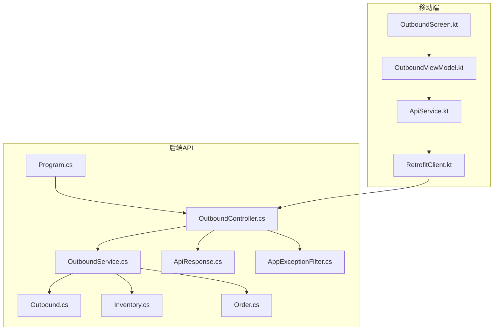
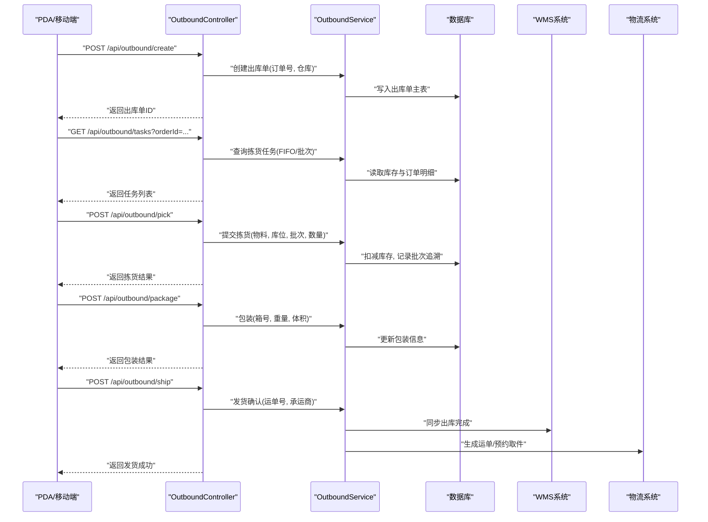
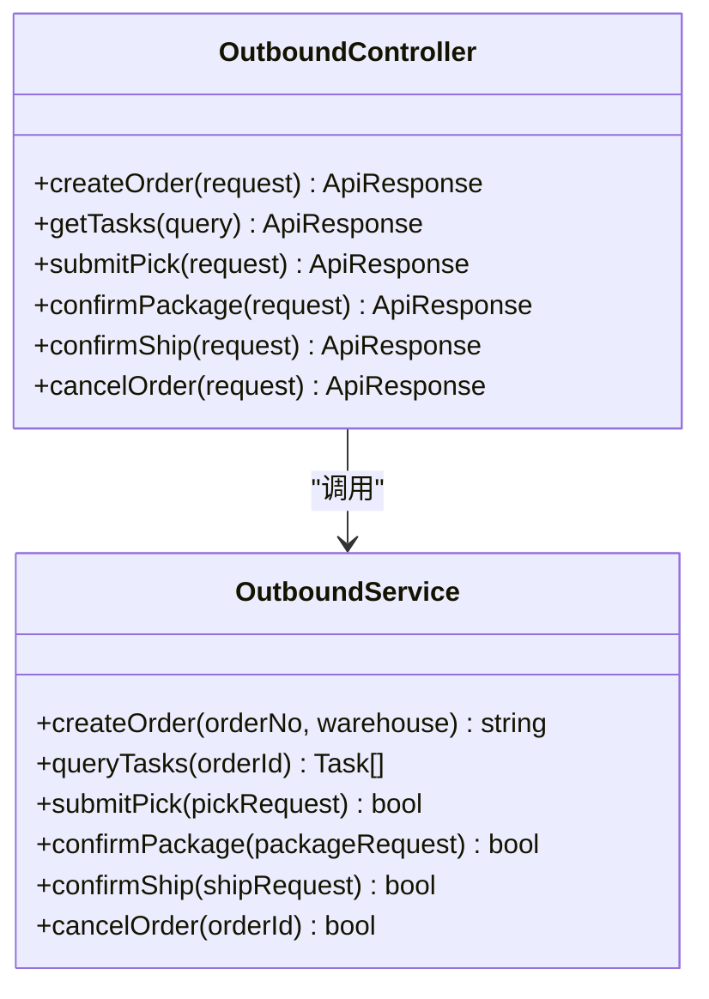
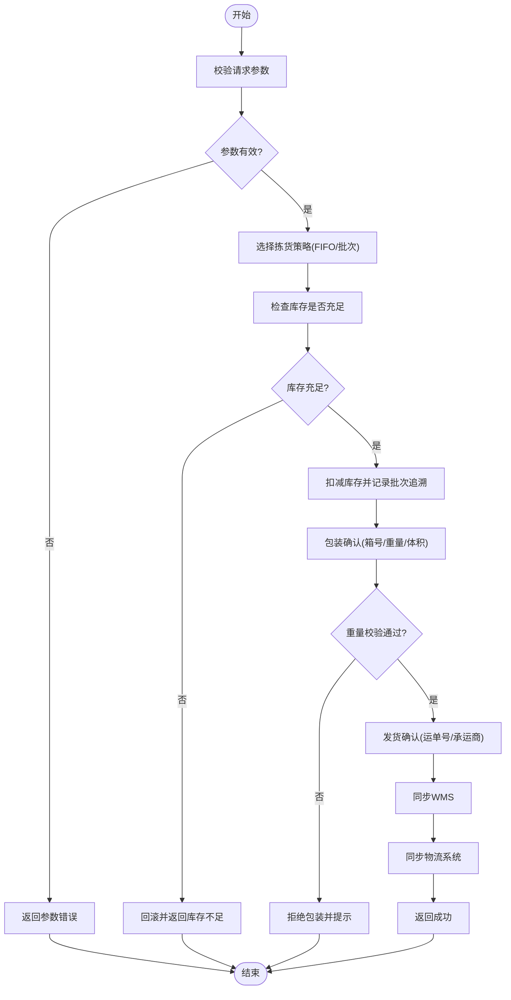
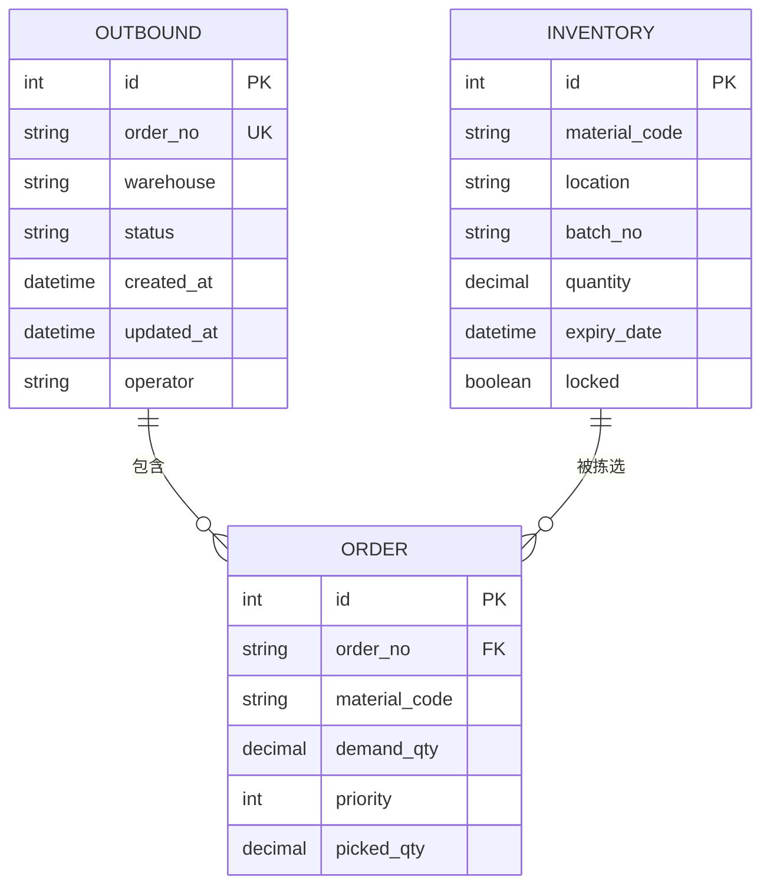
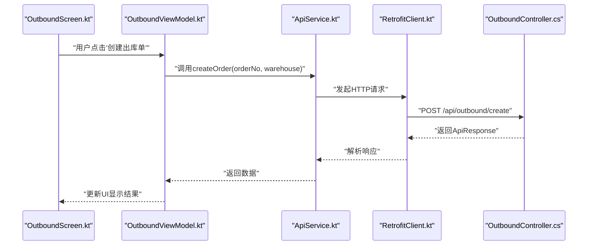
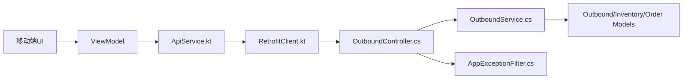

# 出库作业接口

<cite>
**本文引用的文件**   
- [OutboundController.cs](file://dip-system/api/Controllers/OutboundController.cs)
- [OutboundService.cs](file://dip-system/api/Services/OutboundService.cs)
- [Outbound.cs](file://dip-system/api/Models/Outbound.cs)
- [Inventory.cs](file://dip-system/api/Models/Inventory.cs)
- [Order.cs](file://dip-system/api/Models/Order.cs)
- [ApiResponse.cs](file://dip-system/api/Models/ApiResponse.cs)
- [AppExceptionFilter.cs](file://dip-system/api/Controllers/AppExceptionFilter.cs)
- [Program.cs](file://dip-system/api/Program.cs)
- [ApiService.kt](file://mobile-android/app/src/main/java/com/dip/material/data/network/ApiService.kt)
- [RetrofitClient.kt](file://mobile-android/app/src/main/java/com/dip/material/data/network/RetrofitClient.kt)
- [OutboundScreen.kt](file://mobile-android/app/src/main/java/com/dip/material/ui/outbound/OutboundScreen.kt)
- [OutboundViewModel.kt](file://mobile-android/app/src/main/java/com/dip/material/ui/outbound/OutboundViewModel.kt)
</cite>

## 目录
1. [简介](#简介)
2. [项目结构](#项目结构)
3. [核心组件](#核心组件)
4. [架构总览](#架构总览)
5. [详细组件分析](#详细组件分析)
6. [依赖关系分析](#依赖关系分析)
7. [性能考虑](#性能考虑)
8. [故障排查指南](#故障排查指南)
9. [结论](#结论)
10. [附录](#附录)

## 简介
本文件为DIP系统“出库作业”相关API的权威文档，覆盖拣货策略、包装流程、发货确认等接口的HTTP方法、URL路径、请求参数与响应格式；并详细说明先进先出（FIFO）、批次追溯、库存扣减的业务逻辑。同时文档化PDA拣货、批量拣货、边拣边分等特殊场景，提供完整出库作业示例、异常处理示例与库存回滚机制说明，以及与WMS系统、物流系统的对接接口要点。

## 项目结构
- 后端采用ASP.NET Core Web API，控制器位于api/Controllers，业务服务位于api/Services，数据模型位于api/Models。
- 移动端Android应用通过Retrofit调用后端API，界面与视图模型位于ui/outbound包。
- 出库作业主要涉及：
  - 控制器：OutboundController
  - 服务层：OutboundService
  - 数据模型：Outbound、Inventory、Order、ApiResponse
  - 异常过滤：AppExceptionFilter
  - 启动配置：Program.cs
  - 移动端网络层：ApiService.kt、RetrofitClient.kt
  - 移动端界面：OutboundScreen.kt、OutboundViewModel.kt

**图表来源** 
- [Program.cs](file://dip-system/api/Program.cs)
- [OutboundController.cs](file://dip-system/api/Controllers/OutboundController.cs)
- [OutboundService.cs](file://dip-system/api/Services/OutboundService.cs)
- [Outbound.cs](file://dip-system/api/Models/Outbound.cs)
- [Inventory.cs](file://dip-system/api/Models/Inventory.cs)
- [Order.cs](file://dip-system/api/Models/Order.cs)
- [ApiResponse.cs](file://dip-system/api/Models/ApiResponse.cs)
- [AppExceptionFilter.cs](file://dip-system/api/Controllers/AppExceptionFilter.cs)
- [ApiService.kt](file://mobile-android/app/src/main/java/com/dip/material/data/network/ApiService.kt)
- [RetrofitClient.kt](file://mobile-android/app/src/main/java/com/dip/material/data/network/RetrofitClient.kt)

**章节来源**
- [OutboundController.cs](file://dip-system/api/Controllers/OutboundController.cs)
- [OutboundService.cs](file://dip-system/api/Services/OutboundService.cs)
- [Outbound.cs](file://dip-system/api/Models/Outbound.cs)
- [Inventory.cs](file://dip-system/api/Models/Inventory.cs)
- [Order.cs](file://dip-system/api/Models/Order.cs)
- [ApiResponse.cs](file://dip-system/api/Models/ApiResponse.cs)
- [AppExceptionFilter.cs](file://dip-system/api/Controllers/AppExceptionFilter.cs)
- [Program.cs](file://dip-system/api/Program.cs)
- [ApiService.kt](file://mobile-android/app/src/main/java/com/dip/material/data/network/ApiService.kt)
- [RetrofitClient.kt](file://mobile-android/app/src/main/java/com/dip/material/data/network/RetrofitClient.kt)

## 核心组件
- OutboundController：定义出库作业的REST端点，包括创建出库单、查询订单、提交拣货、包装、发货确认、取消出库等。
- OutboundService：实现出库业务逻辑，包含拣货策略（FIFO优先、批次追溯）、库存扣减、事务回滚、异常处理。
- 数据模型：
  - Outbound：出库单主记录（订单号、状态、时间戳、操作人等）
  - Inventory：库存记录（物料编码、库位、批次、数量、有效期等）
  - Order：订单明细（物料、需求数量、优先级等）
  - ApiResponse：统一响应封装（code、message、data）
- 异常过滤器：AppExceptionFilter用于全局异常捕获与标准化错误响应。
- 移动端：
  - ApiService.kt：声明Retrofit接口，映射后端API
  - RetrofitClient.kt：构建客户端、拦截器、超时配置
  - OutboundScreen.kt / OutboundViewModel.kt：UI与状态管理，调用API完成PDA拣货、批量拣货、边拣边分等场景

**章节来源**
- [OutboundController.cs](file://dip-system/api/Controllers/OutboundController.cs)
- [OutboundService.cs](file://dip-system/api/Services/OutboundService.cs)
- [Outbound.cs](file://dip-system/api/Models/Outbound.cs)
- [Inventory.cs](file://dip-system/api/Models/Inventory.cs)
- [Order.cs](file://dip-system/api/Models/Order.cs)
- [ApiResponse.cs](file://dip-system/api/Models/ApiResponse.cs)
- [AppExceptionFilter.cs](file://dip-system/api/Controllers/AppExceptionFilter.cs)
- [ApiService.kt](file://mobile-android/app/src/main/java/com/dip/material/data/network/ApiService.kt)
- [RetrofitClient.kt](file://mobile-android/app/src/main/java/com/dip/material/data/network/RetrofitClient.kt)
- [OutboundScreen.kt](file://mobile-android/app/src/main/java/com/dip/material/ui/outbound/OutboundScreen.kt)
- [OutboundViewModel.kt](file://mobile-android/app/src/main/java/com/dip/material/ui/outbound/OutboundViewModel.kt)

## 架构总览
出库作业端到端流程：
- 移动端扫描条码或输入订单号，调用后端API获取待拣货任务
- 控制器校验请求参数，委托服务层执行拣货策略与库存扣减
- 服务层按FIFO规则选择批次，记录批次追溯信息，更新库存
- 包装完成后进行重量校验与装箱优化建议
- 发货确认后调用物流系统接口，返回运单号并更新出库单状态

**图表来源** 
- [OutboundController.cs](file://dip-system/api/Controllers/OutboundController.cs)
- [OutboundService.cs](file://dip-system/api/Services/OutboundService.cs)
- [Outbound.cs](file://dip-system/api/Models/Outbound.cs)
- [Inventory.cs](file://dip-system/api/Models/Inventory.cs)
- [Order.cs](file://dip-system/api/Models/Order.cs)

## 详细组件分析

### 出库控制器（OutboundController）
- 职责：接收HTTP请求，参数校验，调用OutboundService执行业务，返回统一ApiResponse。
- 关键端点（示例）：
  - POST /api/outbound/create：创建出库单
  - GET /api/outbound/tasks：查询拣货任务
  - POST /api/outbound/pick：提交拣货
  - POST /api/outbound/package：包装确认
  - POST /api/outbound/ship：发货确认
  - POST /api/outbound/cancel：取消出库
- 参数校验：订单号、物料编码、库位、批次、数量、箱号、重量、体积、运单号等必填字段校验。
- 响应格式：统一使用ApiResponse封装code、message、data。

**图表来源** 
- [OutboundController.cs](file://dip-system/api/Controllers/OutboundController.cs)
- [OutboundService.cs](file://dip-system/api/Services/OutboundService.cs)

**章节来源**
- [OutboundController.cs](file://dip-system/api/Controllers/OutboundController.cs)
- [ApiResponse.cs](file://dip-system/api/Models/ApiResponse.cs)

### 出库服务（OutboundService）
- 职责：实现出库核心业务逻辑，包括拣货策略、库存扣减、批次追溯、事务回滚、异常处理。
- 拣货策略：
  - FIFO优先：按入库时间或批次有效期排序，优先选择最早批次
  - 批次追溯：记录每个物料的批次、库位、数量、时间戳，支持正向与反向追溯
  - 边拣边分：在拣货过程中同步进行分拣，减少二次搬运
- 库存扣减：
  - 原子性：在同一事务中扣减库存并记录批次追溯
  - 回滚机制：任何步骤失败均回滚已变更的库存与记录
- 异常处理：
  - 库存不足：抛出业务异常，返回具体原因
  - 条码无效：校验失败，提示重新扫描
  - 重量校验：超出允许误差范围，拒绝包装

**图表来源** 
- [OutboundService.cs](file://dip-system/api/Services/OutboundService.cs)
- [Inventory.cs](file://dip-system/api/Models/Inventory.cs)
- [Outbound.cs](file://dip-system/api/Models/Outbound.cs)
- [Order.cs](file://dip-system/api/Models/Order.cs)

**章节来源**
- [OutboundService.cs](file://dip-system/api/Services/OutboundService.cs)
- [Inventory.cs](file://dip-system/api/Models/Inventory.cs)
- [Outbound.cs](file://dip-system/api/Models/Outbound.cs)
- [Order.cs](file://dip-system/api/Models/Order.cs)

### 数据模型（Outbound、Inventory、Order、ApiResponse）
- Outbound：出库单主记录，包含订单号、仓库、状态、创建时间、更新时间、操作人等。
- Inventory：库存记录，包含物料编码、库位、批次、数量、有效期、锁定状态等。
- Order：订单明细，包含物料编码、需求数量、优先级、已拣数量等。
- ApiResponse：统一响应体，包含code（状态码）、message（消息）、data（数据对象）。

**图表来源** 
- [Outbound.cs](file://dip-system/api/Models/Outbound.cs)
- [Inventory.cs](file://dip-system/api/Models/Inventory.cs)
- [Order.cs](file://dip-system/api/Models/Order.cs)

**章节来源**
- [Outbound.cs](file://dip-system/api/Models/Outbound.cs)
- [Inventory.cs](file://dip-system/api/Models/Inventory.cs)
- [Order.cs](file://dip-system/api/Models/Order.cs)
- [ApiResponse.cs](file://dip-system/api/Models/ApiResponse.cs)

### 移动端集成（ApiService、RetrofitClient、OutboundScreen、OutboundViewModel）
- ApiService.kt：定义Retrofit接口，映射后端API端点，如创建出库单、查询任务、提交拣货、包装、发货确认等。
- RetrofitClient.kt：配置基础URL、超时、拦截器（如鉴权），确保稳定调用后端。
- OutboundScreen.kt：用户界面，展示拣货任务、条码扫描、包装与发货确认流程。
- OutboundViewModel.kt：管理UI状态，调用ApiService执行操作，处理成功与失败反馈。

**图表来源** 
- [ApiService.kt](file://mobile-android/app/src/main/java/com/dip/material/data/network/ApiService.kt)
- [RetrofitClient.kt](file://mobile-android/app/src/main/java/com/dip/material/data/network/RetrofitClient.kt)
- [OutboundScreen.kt](file://mobile-android/app/src/main/java/com/dip/material/ui/outbound/OutboundScreen.kt)
- [OutboundViewModel.kt](file://mobile-android/app/src/main/java/com/dip/material/ui/outbound/OutboundViewModel.kt)
- [OutboundController.cs](file://dip-system/api/Controllers/OutboundController.cs)

**章节来源**
- [ApiService.kt](file://mobile-android/app/src/main/java/com/dip/material/data/network/ApiService.kt)
- [RetrofitClient.kt](file://mobile-android/app/src/main/java/com/dip/material/data/network/RetrofitClient.kt)
- [OutboundScreen.kt](file://mobile-android/app/src/main/java/com/dip/material/ui/outbound/OutboundScreen.kt)
- [OutboundViewModel.kt](file://mobile-android/app/src/main/java/com/dip/material/ui/outbound/OutboundViewModel.kt)

## 依赖关系分析
- 控制器依赖服务层，服务层依赖数据模型与数据库。
- 移动端依赖网络层，网络层依赖后端API。
- 异常过滤器全局生效，统一处理未捕获异常。

**图表来源** 
- [OutboundController.cs](file://dip-system/api/Controllers/OutboundController.cs)
- [OutboundService.cs](file://dip-system/api/Services/OutboundService.cs)
- [Outbound.cs](file://dip-system/api/Models/Outbound.cs)
- [Inventory.cs](file://dip-system/api/Models/Inventory.cs)
- [Order.cs](file://dip-system/api/Models/Order.cs)
- [AppExceptionFilter.cs](file://dip-system/api/Controllers/AppExceptionFilter.cs)
- [ApiService.kt](file://mobile-android/app/src/main/java/com/dip/material/data/network/ApiService.kt)
- [RetrofitClient.kt](file://mobile-android/app/src/main/java/com/dip/material/data/network/RetrofitClient.kt)

**章节来源**
- [OutboundController.cs](file://dip-system/api/Controllers/OutboundController.cs)
- [OutboundService.cs](file://dip-system/api/Services/OutboundService.cs)
- [Outbound.cs](file://dip-system/api/Models/Outbound.cs)
- [Inventory.cs](file://dip-system/api/Models/Inventory.cs)
- [Order.cs](file://dip-system/api/Models/Order.cs)
- [AppExceptionFilter.cs](file://dip-system/api/Controllers/AppExceptionFilter.cs)
- [ApiService.kt](file://mobile-android/app/src/main/java/com/dip/material/data/network/ApiService.kt)
- [RetrofitClient.kt](file://mobile-android/app/src/main/java/com/dip/material/data/network/RetrofitClient.kt)

## 性能考虑
- 拣货策略优化：FIFO排序可结合索引提升查询效率，避免全表扫描。
- 事务粒度：将库存扣减与批次追溯放入同一事务，减少锁竞争。
- 并发控制：对同一库位或批次的操作加行级锁，防止超卖。
- 批量操作：支持批量拣货与边拣边分，减少网络往返与数据库交互次数。
- 缓存策略：热点订单与库存快照可短期缓存，降低数据库压力。

[本节为通用性能指导，不直接分析具体文件]

## 故障排查指南
- 常见异常：
  - 参数校验失败：检查必填字段与格式（订单号、物料编码、数量等）
  - 库存不足：核对库存快照与锁定状态，查看批次追溯记录
  - 条码无效：确认条码格式与物料主数据一致性
  - 重量校验失败：检查称重设备校准与允许误差范围
- 日志定位：
  - 查看AppExceptionFilter记录的异常堆栈与请求上下文
  - 检查OutboundService中的业务异常抛出点
- 回滚验证：
  - 确认事务回滚后库存数量与批次追溯记录一致性
  - 核对出库单状态是否回退至初始状态

**章节来源**
- [AppExceptionFilter.cs](file://dip-system/api/Controllers/AppExceptionFilter.cs)
- [OutboundService.cs](file://dip-system/api/Services/OutboundService.cs)

## 结论
本文件系统化梳理了DIP系统出库作业API的接口规范、业务逻辑与集成方式。通过FIFO拣货策略、批次追溯、库存扣减与回滚机制，确保出库流程的准确性与可追溯性。移动端与后端的良好解耦，使得PDA拣货、批量拣货、边拣边分等场景得以高效实现。建议在生产环境中加强监控与日志采集，持续优化性能与稳定性。

[本节为总结性内容，不直接分析具体文件]

## 附录
- 完整出库作业示例：
  - 创建出库单：POST /api/outbound/create
  - 查询拣货任务：GET /api/outbound/tasks?orderId=...
  - 提交拣货：POST /api/outbound/pick
  - 包装确认：POST /api/outbound/package
  - 发货确认：POST /api/outbound/ship
  - 取消出库：POST /api/outbound/cancel
- 异常处理示例：
  - 库存不足：返回code=400，message="库存不足"
  - 条码无效：返回code=400，message="条码无效"
  - 重量校验失败：返回code=400，message="重量超出允许范围"
- 库存回滚机制：
  - 任何步骤失败均触发事务回滚，恢复库存与批次追溯记录
- 与WMS系统、物流系统对接：
  - 出库完成同步至WMS，生成运单并预约取件
  - 返回运单号与承运商信息，更新出库单状态

[本节为补充信息，不直接分析具体文件]