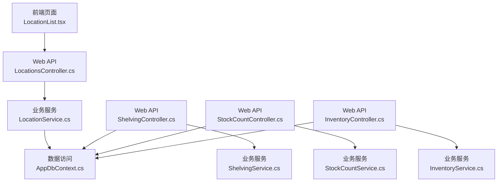
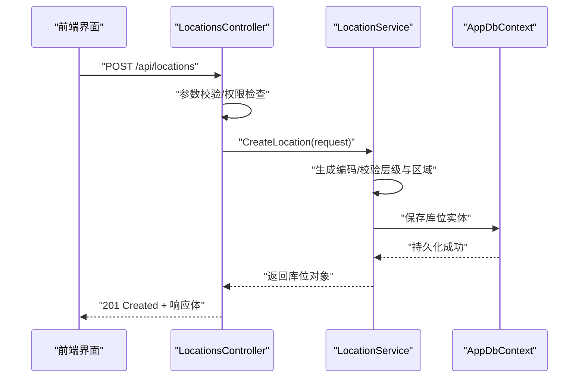
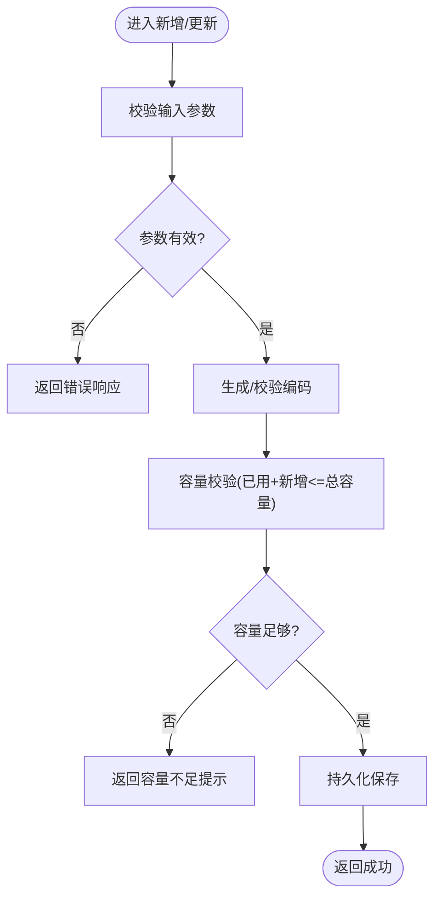
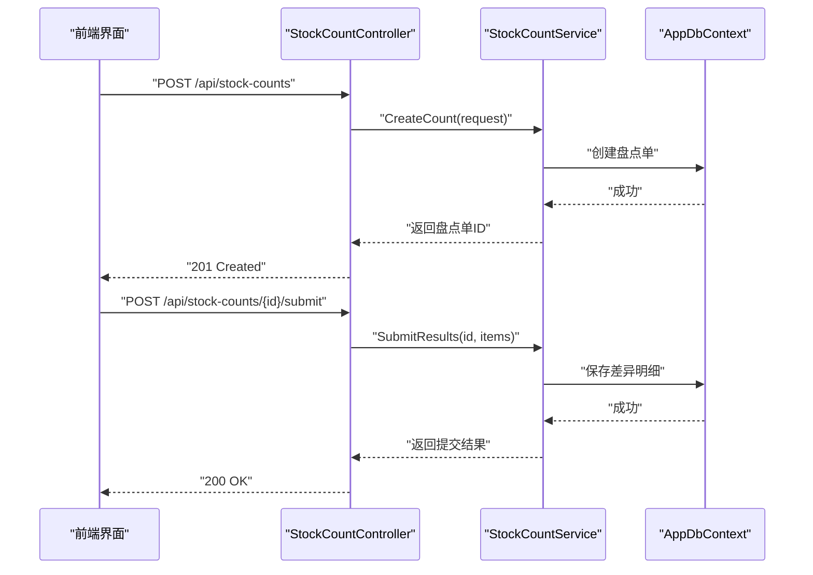
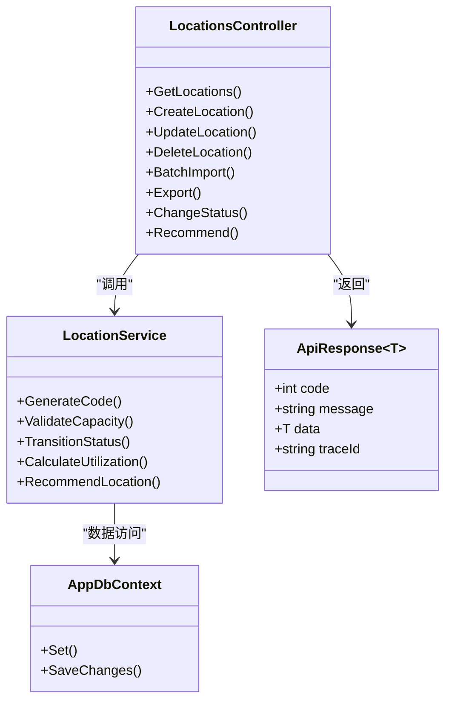

# 库位管理接口

<cite>
**本文引用的文件**   
- [LocationsController.cs](file://dip-system/api/Controllers/LocationsController.cs)
- [LocationService.cs](file://dip-system/api/Services/LocationService.cs)
- [ShelvingController.cs](file://dip-system/api/Controllers/ShelvingController.cs)
- [ShelvingService.cs](file://dip-system/api/Services/ShelvingService.cs)
- [StockCountController.cs](file://dip-system/api/Controllers/StockCountController.cs)
- [StockCountService.cs](file://dip-system/api/Services/StockCountService.cs)
- [InventoryController.cs](file://dip-system/api/Controllers/InventoryController.cs)
- [InventoryService.cs](file://dip-system/api/Services/InventoryService.cs)
- [ApiResponse.cs](file://dip-system/api/Models/ApiResponse.cs)
- [BaseEntity.cs](file://dip-system/api/Models/BaseEntity.cs)
- [AppDbContext.cs](file://dip-system/api/Data/AppDbContext.cs)
- [Program.cs](file://dip-system/api/Program.cs)
- [appsettings.json](file://dip-system/api/appsettings.json)
- [LocationList.tsx](file://dip-system/frontend-web/src/pages/LocationList.tsx)
- [api.ts](file://dip-system/frontend-web/src/lib/api.ts)
</cite>

## 目录
1. [简介](#简介)
2. [项目结构](#项目结构)
3. [核心组件](#核心组件)
4. [架构总览](#架构总览)
5. [详细组件分析](#详细组件分析)
6. [依赖关系分析](#依赖关系分析)
7. [性能考虑](#性能考虑)
8. [故障排查指南](#故障排查指南)
9. [结论](#结论)
10. [附录](#附录)

## 简介
本文件面向DIP系统“库位管理”相关API，覆盖库位定义、库位类型、容量管理、状态管理、优化算法、热力图与利用率统计、编码规则与层级区域配置、批量导入导出、盘点接口，以及与3D可视化/数字孪生系统的集成要点。文档以HTTP方法、URL路径、请求参数与响应格式为核心，辅以流程图与时序图帮助理解业务逻辑与数据流。

## 项目结构
后端采用ASP.NET Core Web API，控制器负责路由与入参校验，服务层封装业务逻辑，数据访问通过EF Core上下文完成。前端为React+Vite应用，页面与API调用集中在lib/api.ts中。

图表来源
- [LocationsController.cs](file://dip-system/api/Controllers/LocationsController.cs)
- [LocationService.cs](file://dip-system/api/Services/LocationService.cs)
- [ShelvingController.cs](file://dip-system/api/Controllers/ShelvingController.cs)
- [ShelvingService.cs](file://dip-system/api/Services/ShelvingService.cs)
- [StockCountController.cs](file://dip-system/api/Controllers/StockCountController.cs)
- [StockCountService.cs](file://dip-system/api/Services/StockCountService.cs)
- [InventoryController.cs](file://dip-system/api/Controllers/InventoryController.cs)
- [InventoryService.cs](file://dip-system/api/Services/InventoryService.cs)
- [AppDbContext.cs](file://dip-system/api/Data/AppDbContext.cs)

章节来源
- [Program.cs](file://dip-system/api/Program.cs)
- [appsettings.json](file://dip-system/api/appsettings.json)

## 核心组件
- LocationsController：提供库位的CRUD、查询、批量操作、状态变更等REST接口。
- LocationService：实现库位编码生成、层级与区域校验、容量计算、状态机流转、预警与推荐策略。
- ShelvingController/ShelvingService：货架维度能力（如多层货架的层级映射、容量聚合）。
- StockCountController/StockCountService：盘点流程（初始化、差异登记、审核、复盘）。
- InventoryController/InventoryService：库存与库位关联、占用率、周转与热力图数据源。
- ApiResponse/BaseEntity：统一响应结构与实体基类字段（如创建时间、更新时间、是否删除等）。
- AppDbContext：EF Core上下文，映射库位、库存、盘点等实体到数据库表。

章节来源
- [LocationsController.cs](file://dip-system/api/Controllers/LocationsController.cs)
- [LocationService.cs](file://dip-system/api/Services/LocationService.cs)
- [ShelvingController.cs](file://dip-system/api/Controllers/ShelvingController.cs)
- [ShelvingService.cs](file://dip-system/api/Services/ShelvingService.cs)
- [StockCountController.cs](file://dip-system/api/Controllers/StockCountController.cs)
- [StockCountService.cs](file://dip-system/api/Services/StockCountService.cs)
- [InventoryController.cs](file://dip-system/api/Controllers/InventoryController.cs)
- [InventoryService.cs](file://dip-system/api/Services/InventoryService.cs)
- [ApiResponse.cs](file://dip-system/api/Models/ApiResponse.cs)
- [BaseEntity.cs](file://dip-system/api/Models/BaseEntity.cs)
- [AppDbContext.cs](file://dip-system/api/Data/AppDbContext.cs)

## 架构总览
库位管理API遵循典型的分层架构：控制器接收HTTP请求并做基础校验，服务层执行业务规则（编码规则、容量与状态机、预警与推荐），数据层通过EF Core进行持久化。前端页面通过统一的API客户端发起请求，展示列表、表单与统计图表。

图表来源
- [LocationsController.cs](file://dip-system/api/Controllers/LocationsController.cs)
- [LocationService.cs](file://dip-system/api/Services/LocationService.cs)
- [AppDbContext.cs](file://dip-system/api/Data/AppDbContext.cs)

## 详细组件分析

### 库位管理接口（Locations）
- 功能范围
  - 库位定义：新增、编辑、删除、详情查询、分页列表。
  - 库位类型：按类型筛选、按类型统计。
  - 容量管理：设置总容量、已用容量、可用容量、超限控制。
  - 状态管理：空闲、占用、锁定、维护、报废等状态流转。
  - 编码规则：支持前缀、层级码、区域码、流水号组合。
  - 层级与区域：父级库位、层级深度、所属区域/仓库。
  - 批量操作：批量导入/导出、批量启用/禁用。
  - 预警与推荐：低可用容量预警、智能推荐入库位置。
- HTTP方法与路径（示例）
  - GET /api/locations：分页查询（支持类型、区域、状态、关键字过滤）
  - POST /api/locations：新增库位
  - PUT /api/locations/{id}：更新库位
  - DELETE /api/locations/{id}：删除库位
  - GET /api/locations/{id}：获取详情
  - POST /api/locations/batch/import：批量导入
  - POST /api/locations/export：批量导出
  - PATCH /api/locations/{id}/status：状态变更
  - POST /api/locations/recommend：智能推荐库位
- 请求参数（摘要）
  - 新增/更新：编码、名称、类型、父级ID、层级、区域、总容量、单位、状态、备注等。
  - 查询：page、pageSize、type、area、status、keyword等。
  - 导入：Excel/CSV二进制或JSON数组，含必填字段校验。
  - 推荐：物料主数据、数量、优先级、约束条件（如温度、危险品）。
- 响应格式
  - 统一包装在ApiResponse<T>中，包含code、message、data、traceId等。
  - 列表返回分页结构（items、total、page、pageSize）。
- 关键业务逻辑
  - 编码生成：基于规则引擎拼接前缀、层级码、区域码与自增流水，确保唯一性。
  - 容量校验：写入时校验已用+新增不超过总容量；支持预留与冻结容量。
  - 状态机：空闲→占用→锁定→维护→报废，禁止非法跳转。
  - 预警阈值：可用容量低于阈值触发告警；支持按区域/类型聚合统计。
  - 智能推荐：根据物料属性、历史出入库频次、距离与通道效率评分排序。

图表来源
- [LocationsController.cs](file://dip-system/api/Controllers/LocationsController.cs)
- [LocationService.cs](file://dip-system/api/Services/LocationService.cs)

章节来源
- [LocationsController.cs](file://dip-system/api/Controllers/LocationsController.cs)
- [LocationService.cs](file://dip-system/api/Services/LocationService.cs)
- [ApiResponse.cs](file://dip-system/api/Models/ApiResponse.cs)

### 货架管理接口（Shelving）
- 功能范围
  - 货架定义：新增、编辑、删除、详情、列表。
  - 层级映射：将库位与货架层绑定，支持多层货架的层级编号与容量聚合。
  - 容量汇总：按货架维度汇总各层库位容量与占用情况。
- HTTP方法与路径（示例）
  - GET /api/shelves：分页查询
  - POST /api/shelves：新增货架
  - PUT /api/shelves/{id}：更新货架
  - DELETE /api/shelves/{id}：删除货架
  - GET /api/shelves/{id}/layers：获取层级与库位映射
- 业务要点
  - 层级编码与库位编码联动，保证一致性。
  - 容量聚合计算避免重复累加，处理循环引用保护。

章节来源
- [ShelvingController.cs](file://dip-system/api/Controllers/ShelvingController.cs)
- [ShelvingService.cs](file://dip-system/api/Services/ShelvingService.cs)

### 盘点接口（StockCount）
- 功能范围
  - 盘点单：创建、提交、审核、复盘、关闭。
  - 差异登记：盘盈/盘亏记录、原因分类、附件上传。
  - 统计报表：差异汇总、准确率、异常定位。
- HTTP方法与路径（示例）
  - POST /api/stock-counts：创建盘点单
  - GET /api/stock-counts/{id}：详情
  - POST /api/stock-counts/{id}/submit：提交盘点结果
  - POST /api/stock-counts/{id}/approve：审核通过
  - POST /api/stock-counts/{id}/review：复盘
  - GET /api/stock-counts：分页查询（状态、仓库、日期范围）
- 业务流程
  - 初始化→执行盘点→登记差异→审核→复盘→归档。
  - 差异超阈自动触发预警与任务派发。

图表来源
- [StockCountController.cs](file://dip-system/api/Controllers/StockCountController.cs)
- [StockCountService.cs](file://dip-system/api/Services/StockCountService.cs)
- [AppDbContext.cs](file://dip-system/api/Data/AppDbContext.cs)

章节来源
- [StockCountController.cs](file://dip-system/api/Controllers/StockCountController.cs)
- [StockCountService.cs](file://dip-system/api/Services/StockCountService.cs)

### 库存与库位关联（Inventory）
- 功能范围
  - 库位占用：查询某库位当前库存明细、占用量、剩余容量。
  - 占用率统计：按库位/区域/类型统计占用率，用于热力图与利用率报表。
  - 周转分析：结合出入库频率评估库位价值，辅助智能推荐。
- HTTP方法与路径（示例）
  - GET /api/inventory/by-location/{locationId}：库位库存明细
  - GET /api/inventory/utilization：利用率统计（支持分组与时间范围）
  - GET /api/inventory/heatmap：热力图数据（区域×层级×库位）
- 业务要点
  - 占用率=已用容量/总容量，支持预留与冻结容量扣除。
  - 热力图数据按空间维度聚合，便于前端渲染3D/2D视图。

章节来源
- [InventoryController.cs](file://dip-system/api/Controllers/InventoryController.cs)
- [InventoryService.cs](file://dip-system/api/Services/InventoryService.cs)

### 前端集成（LocationList与API客户端）
- LocationList页面：展示库位列表、搜索过滤、分页、新增/编辑弹窗、批量操作入口。
- api.ts：封装HTTP请求、鉴权拦截、统一错误处理、分页与转换工具。
- 交互要点
  - 列表加载：GET /api/locations?page=&pageSize=&type=&area=&status=&keyword=
  - 新增/编辑：POST/PUT /api/locations
  - 批量导入：POST /api/locations/batch/import（multipart/form-data或application/json）
  - 批量导出：POST /api/locations/export（返回文件流）

章节来源
- [LocationList.tsx](file://dip-system/frontend-web/src/pages/LocationList.tsx)
- [api.ts](file://dip-system/frontend-web/src/lib/api.ts)

## 依赖关系分析
- 控制器与服务解耦：控制器仅负责路由与入参校验，复杂逻辑下沉至服务层。
- 数据访问集中：所有持久化通过AppDbContext，便于事务与审计。
- 统一响应：ApiResponse<T>保障前后端契约一致。
- 前端API封装：api.ts统一处理鉴权、重试、错误提示，降低页面复杂度。

图表来源
- [LocationsController.cs](file://dip-system/api/Controllers/LocationsController.cs)
- [LocationService.cs](file://dip-system/api/Services/LocationService.cs)
- [AppDbContext.cs](file://dip-system/api/Data/AppDbContext.cs)
- [ApiResponse.cs](file://dip-system/api/Models/ApiResponse.cs)

章节来源
- [LocationsController.cs](file://dip-system/api/Controllers/LocationsController.cs)
- [LocationService.cs](file://dip-system/api/Services/LocationService.cs)
- [AppDbContext.cs](file://dip-system/api/Data/AppDbContext.cs)
- [ApiResponse.cs](file://dip-system/api/Models/ApiResponse.cs)

## 性能考虑
- 分页与索引：对常用查询字段（类型、区域、状态、编码）建立索引，避免全表扫描。
- 容量计算缓存：热点库位的占用率可短期缓存，减少频繁聚合计算。
- 批量导入优化：服务端分批写入、事务边界控制，失败回滚与部分成功报告。
- 导出异步化：大数据量导出建议异步任务+下载链接，避免阻塞请求。
- 热力图数据预聚合：定时任务按区域/层级/库位维度预计算，前端按需拉取。

[本节为通用指导，不直接分析具体文件]

## 故障排查指南
- 常见错误
  - 编码冲突：检查编码规则与唯一性约束，确认并发插入时的锁机制。
  - 容量不足：核对已用容量、预留与冻结容量，确认单位换算。
  - 状态非法：检查状态机允许的路径，避免非法跳转。
  - 导入失败：校验必填字段、数据类型、枚举值，查看错误明细行。
- 日志与追踪
  - 使用ApiResponse.traceId贯穿请求链路，定位问题。
  - 服务层记录关键决策点（编码生成、容量校验、状态变更）。
- 前端提示
  - 统一错误消息映射，区分网络错误、业务校验错误、服务器错误。

章节来源
- [ApiResponse.cs](file://dip-system/api/Models/ApiResponse.cs)
- [LocationService.cs](file://dip-system/api/Services/LocationService.cs)

## 结论
本库位管理API围绕“定义—容量—状态—优化—统计—盘点”形成闭环，配合统一响应与分层架构，满足仓储数字化与可视化的需求。通过编码规则、层级区域配置、容量与状态机、预警与推荐、盘点流程，以及热力图与利用率统计，为3D可视化与数字孪生提供稳定可靠的数据基础。

[本节为总结，不直接分析具体文件]

## 附录

### 库位编码规则与层级区域配置
- 编码组成：前缀（仓库/区域标识）+层级码（固定长度）+区域码（固定长度）+流水号（自增）。
- 层级关系：支持树形结构，父级ID为空表示根节点；层级深度限制防止过深嵌套。
- 区域划分：按仓库、楼层、通道、排、列、层等多维组织，便于空间检索与热力图渲染。
- 配置管理：编码规则与层级区域可在系统配置中维护，支持版本化与灰度发布。

章节来源
- [LocationService.cs](file://dip-system/api/Services/LocationService.cs)
- [AppDbContext.cs](file://dip-system/api/Data/AppDbContext.cs)

### 库位优化算法与热力图分析
- 优化目标：最大化空间利用率、缩短拣货路径、降低拥堵风险。
- 算法要点：基于物料属性（尺寸、重量、温区）、出入库频次、相邻关系评分，选择最优库位。
- 热力图：按区域×层级×库位维度聚合占用率与周转率，前端渲染颜色梯度。

章节来源
- [LocationService.cs](file://dip-system/api/Services/LocationService.cs)
- [InventoryService.cs](file://dip-system/api/Services/InventoryService.cs)

### 库位利用率统计
- 指标定义：占用率=已用容量/总容量；可用率=可用容量/总容量；周转率=出库次数/平均库存。
- 统计维度：库位、区域、类型、时间范围；支持同比/环比对比。
- 输出格式：结构化JSON，包含维度键值与数值指标。

章节来源
- [InventoryService.cs](file://dip-system/api/Services/InventoryService.cs)

### 批量导入导出
- 导入：支持Excel/CSV，模板字段包括编码、名称、类型、父级ID、层级、区域、总容量、单位、状态、备注；服务端校验并返回失败行明细。
- 导出：按查询条件导出，支持分页与异步任务；返回文件流或下载链接。

章节来源
- [LocationsController.cs](file://dip-system/api/Controllers/LocationsController.cs)
- [LocationService.cs](file://dip-system/api/Services/LocationService.cs)

### 盘点接口
- 流程：创建盘点单→执行盘点→登记差异→审核→复盘→归档。
- 差异处理：支持多原因分类、附件上传、审批流；超阈自动预警。
- 报表：差异汇总、准确率、异常定位、趋势分析。

章节来源
- [StockCountController.cs](file://dip-system/api/Controllers/StockCountController.cs)
- [StockCountService.cs](file://dip-system/api/Services/StockCountService.cs)

### 与3D可视化/数字孪生系统集成
- 数据接口：库位坐标、层级、区域、占用率、周转率、状态。
- 实时同步：WebSocket或轮询推送状态变化与容量更新。
- 渲染要求：支持空间拓扑、颜色映射、交互钻取（区域→层级→库位）。

章节来源
- [InventoryService.cs](file://dip-system/api/Services/InventoryService.cs)
- [LocationService.cs](file://dip-system/api/Services/LocationService.cs)

### 预警、容量告警与智能推荐
- 预警阈值：可用容量低于阈值触发告警；支持按区域/类型聚合。
- 容量告警：超限写入拒绝并提示；支持临时扩容与审批流程。
- 智能推荐：综合物料属性、历史数据、空间效率评分，返回Top-N候选库位。

章节来源
- [LocationService.cs](file://dip-system/api/Services/LocationService.cs)