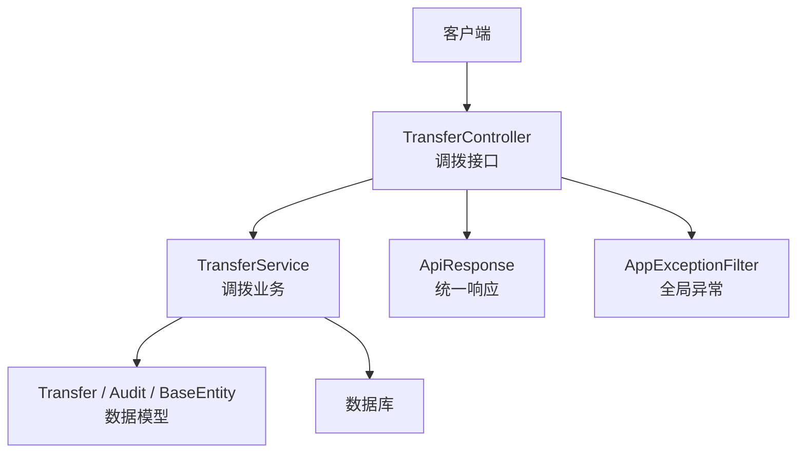
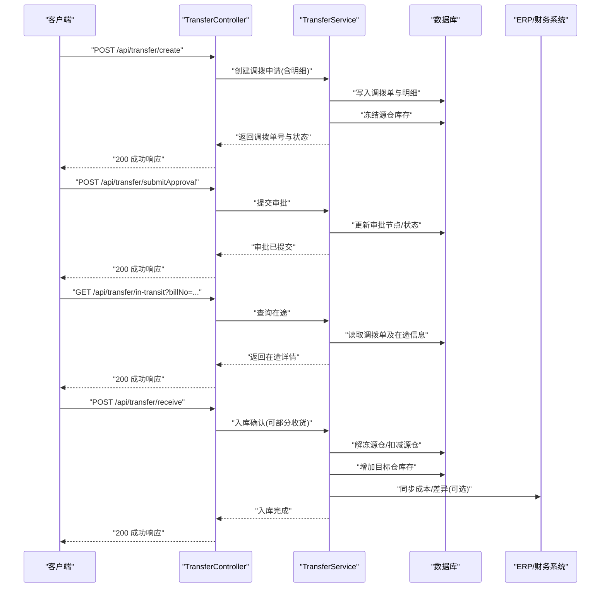
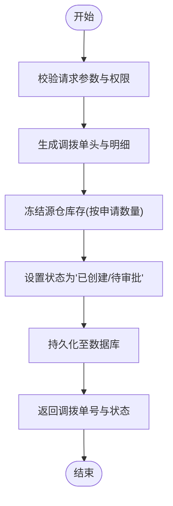
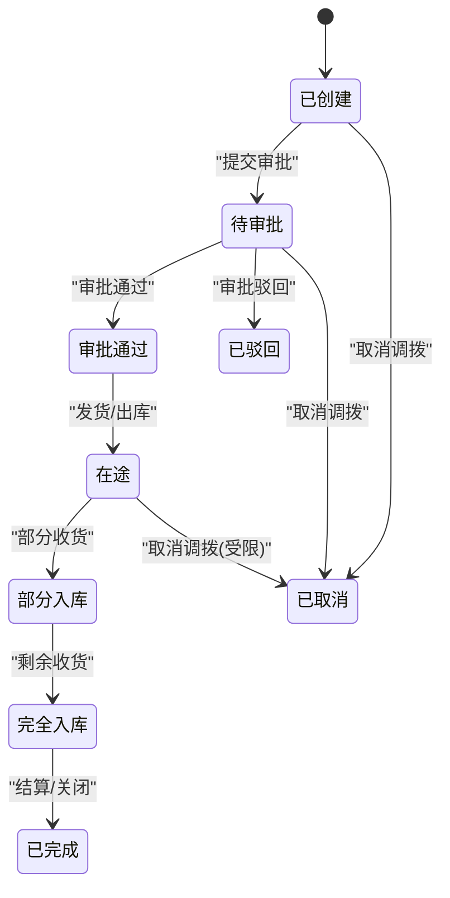
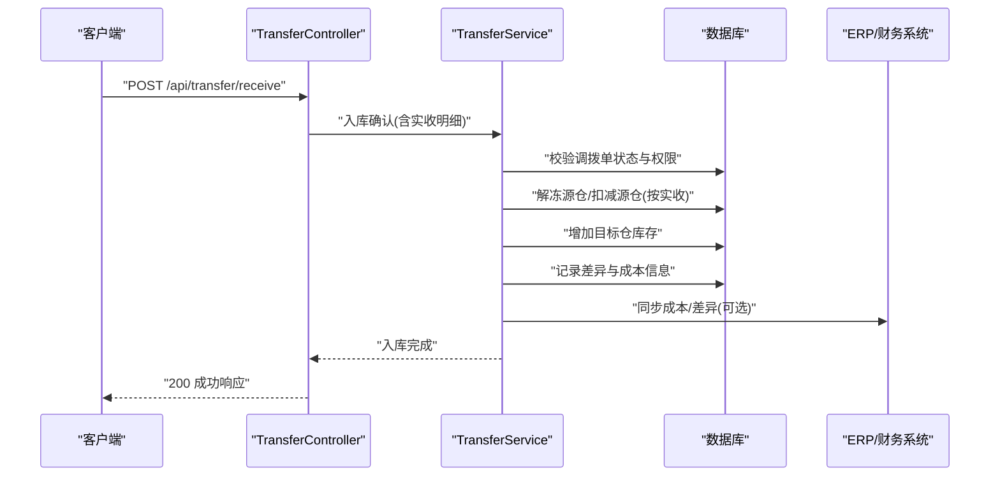
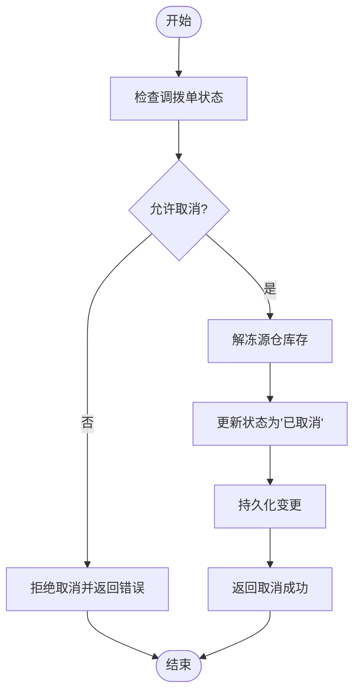
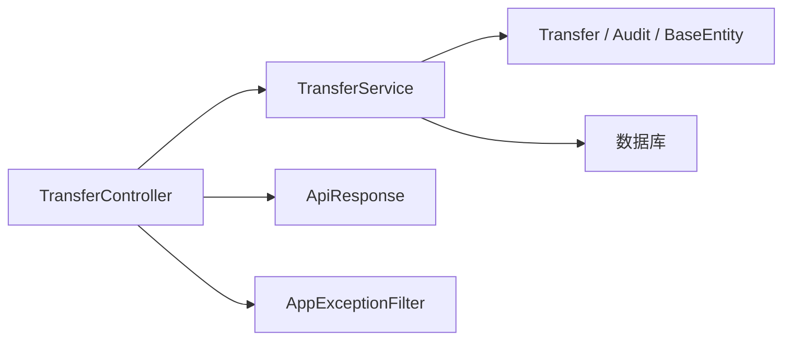

# 调拨作业接口

<cite>
**本文引用的文件**   
- [TransferController.cs](file://dip-system/api/Controllers/TransferController.cs)
- [TransferService.cs](file://dip-system/api/Services/TransferService.cs)
- [Transfer.cs](file://dip-system/api/Models/Transfer.cs)
- [ApiResponse.cs](file://dip-system/api/Models/ApiResponse.cs)
- [AppExceptionFilter.cs](file://dip-system/api/Controllers/AppExceptionFilter.cs)
- [Program.cs](file://dip-system/api/Program.cs)
- [appsettings.json](file://dip-system/api/appsettings.json)
</cite>

## 目录
1. [简介](#简介)
2. [项目结构](#项目结构)
3. [核心组件](#核心组件)
4. [架构总览](#架构总览)
5. [详细组件分析](#详细组件分析)
6. [依赖关系分析](#依赖关系分析)
7. [性能考虑](#性能考虑)
8. [故障排查指南](#故障排查指南)
9. [结论](#结论)
10. [附录](#附录)

## 简介
本文件为DIP系统“调拨作业”模块的API文档，覆盖调拨申请、审批流程、在途跟踪、入库确认等能力，并说明跨仓库调拨、紧急调拨、调拨取消等业务逻辑。文档包含HTTP方法、URL路径、请求参数与响应格式，以及调拨单生成、库存冻结、状态流转的完整流程说明。同时给出典型调用示例、异常处理示例、审批流配置建议，以及与ERP、财务系统的集成要点和成本核算、差异处理的特殊逻辑说明。

## 项目结构
调拨作业相关代码位于后端Web API项目中，主要涉及控制器、服务层、数据模型与统一响应封装：
- 控制器：对外暴露REST接口，负责路由、参数校验与结果封装
- 服务层：实现业务编排（调拨单生成、库存冻结/解冻、状态机流转、审批流、在途跟踪、入库确认）
- 数据模型：定义调拨单、明细、审计等实体
- 统一响应：标准化成功/失败返回结构
- 异常过滤器：全局异常捕获与错误码映射
- 程序入口与配置：中间件注册、认证、日志、数据库连接等

**图示来源** 
- [TransferController.cs](file://dip-system/api/Controllers/TransferController.cs)
- [TransferService.cs](file://dip-system/api/Services/TransferService.cs)
- [Transfer.cs](file://dip-system/api/Models/Transfer.cs)
- [ApiResponse.cs](file://dip-system/api/Models/ApiResponse.cs)
- [AppExceptionFilter.cs](file://dip-system/api/Controllers/AppExceptionFilter.cs)

**章节来源**
- [Program.cs](file://dip-system/api/Program.cs)
- [appsettings.json](file://dip-system/api/appsettings.json)

## 核心组件
- TransferController：提供调拨相关的HTTP端点，包括创建调拨申请、提交审批、查询在途、确认入库、取消调拨等
- TransferService：实现调拨业务编排，涵盖调拨单生成、库存冻结/解冻、状态机推进、审批流驱动、在途跟踪、入库扣减/入账、差异处理与成本核算对接
- Transfer模型：承载调拨单头信息与明细项，支持跨仓库、紧急标记、审批节点、在途数量、实收数量等字段
- ApiResponse：统一包装成功/失败响应体，便于前端一致处理
- AppExceptionFilter：全局异常拦截，将未处理异常转换为标准错误响应

**章节来源**
- [TransferController.cs](file://dip-system/api/Controllers/TransferController.cs)
- [TransferService.cs](file://dip-system/api/Services/TransferService.cs)
- [Transfer.cs](file://dip-system/api/Models/Transfer.cs)
- [ApiResponse.cs](file://dip-system/api/Models/ApiResponse.cs)
- [AppExceptionFilter.cs](file://dip-system/api/Controllers/AppExceptionFilter.cs)

## 架构总览
调拨作业采用典型的三层架构：控制器接收HTTP请求，服务层执行业务逻辑，数据模型持久化到数据库。统一响应与异常过滤器确保一致的交互体验。

**图示来源** 
- [TransferController.cs](file://dip-system/api/Controllers/TransferController.cs)
- [TransferService.cs](file://dip-system/api/Services/TransferService.cs)
- [Transfer.cs](file://dip-system/api/Models/Transfer.cs)

## 详细组件分析

### 接口清单与规范
以下为调拨作业常用接口的HTTP方法与URL路径约定（实际以控制器路由为准）。所有接口均返回统一的ApiResponse结构。

- 创建调拨申请
  - 方法：POST
  - 路径：/api/transfer/create
  - 请求体：调拨单头（源仓库、目标仓库、调拨类型、紧急标记、备注等）+ 明细列表（物料编码、批次、申请数量、单位等）
  - 响应：调拨单号、当前状态、冻结数量、审批节点

- 提交审批
  - 方法：POST
  - 路径：/api/transfer/submitApproval
  - 请求体：调拨单号、审批动作（提交/通过/驳回）、审批意见
  - 响应：审批结果、下一节点、状态变更

- 查询在途
  - 方法：GET
  - 路径：/api/transfer/in-transit
  - 查询参数：调拨单号、状态、时间范围、仓库等
  - 响应：在途明细（物料、在途数量、预计到达时间、承运信息等）

- 入库确认
  - 方法：POST
  - 路径：/api/transfer/receive
  - 请求体：调拨单号、实收明细（物料、批次、实收数量、差异原因等）
  - 响应：入库结果、库存变动、是否触发差异处理

- 取消调拨
  - 方法：POST
  - 路径：/api/transfer/cancel
  - 请求体：调拨单号、取消原因
  - 响应：取消结果、库存解冻、状态回滚

- 查询调拨单详情
  - 方法：GET
  - 路径：/api/transfer/detail
  - 查询参数：调拨单号
  - 响应：调拨单头、明细、审批历史、在途与入库记录

注意：
- 跨仓库调拨：源仓库与目标仓库不同，需校验目标仓可用性与权限
- 紧急调拨：紧急标记为真时，跳过常规排队或缩短审批链
- 调拨取消：仅允许在特定状态下取消（如待审批、在途未完全入库）

**章节来源**
- [TransferController.cs](file://dip-system/api/Controllers/TransferController.cs)
- [TransferService.cs](file://dip-system/api/Services/TransferService.cs)
- [Transfer.cs](file://dip-system/api/Models/Transfer.cs)
- [ApiResponse.cs](file://dip-system/api/Models/ApiResponse.cs)

### 调拨单生成与库存冻结流程
调拨单生成与服务编排的关键步骤如下：

关键点：
- 冻结库存需在事务中执行，保证一致性
- 若目标仓不可用或权限不足，应拒绝创建
- 紧急调拨可调整审批策略或跳过某些校验

**图示来源** 
- [TransferService.cs](file://dip-system/api/Services/TransferService.cs)
- [Transfer.cs](file://dip-system/api/Models/Transfer.cs)

**章节来源**
- [TransferService.cs](file://dip-system/api/Services/TransferService.cs)
- [Transfer.cs](file://dip-system/api/Models/Transfer.cs)

### 审批流与状态机
调拨单状态流转通常包括：已创建 → 待审批 → 审批通过 → 在途 → 部分入库 → 完全入库 → 已完成；也可能出现驳回、取消等分支。

关键规则：
- 紧急调拨可能直接跳过“待审批”进入“在途”
- “在途”状态下取消需满足条件（如未完全入库）
- 审批驳回后允许修改明细重新提交

**图示来源** 
- [TransferService.cs](file://dip-system/api/Services/TransferService.cs)
- [Transfer.cs](file://dip-system/api/Models/Transfer.cs)

**章节来源**
- [TransferService.cs](file://dip-system/api/Services/TransferService.cs)
- [Transfer.cs](file://dip-system/api/Models/Transfer.cs)

### 在途跟踪与入库确认
在途跟踪用于展示调拨单的物流与库存移动情况；入库确认支持部分收货与差异处理。

关键点：
- 支持部分收货，累计实收数量不得超过申请数量
- 差异处理：短少、溢收、损坏等需记录原因并影响成本
- 与ERP/财务系统同步：成本中心、会计科目、差异分摊

**图示来源** 
- [TransferController.cs](file://dip-system/api/Controllers/TransferController.cs)
- [TransferService.cs](file://dip-system/api/Services/TransferService.cs)
- [Transfer.cs](file://dip-system/api/Models/Transfer.cs)

**章节来源**
- [TransferController.cs](file://dip-system/api/Controllers/TransferController.cs)
- [TransferService.cs](file://dip-system/api/Services/TransferService.cs)
- [Transfer.cs](file://dip-system/api/Models/Transfer.cs)

### 调拨取消逻辑
调拨取消需根据当前状态判断是否允许取消，并在成功后执行库存解冻与状态回滚。

**图示来源** 
- [TransferService.cs](file://dip-system/api/Services/TransferService.cs)
- [Transfer.cs](file://dip-system/api/Models/Transfer.cs)

**章节来源**
- [TransferService.cs](file://dip-system/api/Services/TransferService.cs)
- [Transfer.cs](file://dip-system/api/Models/Transfer.cs)

### 与ERP/财务系统集成
- 成本核算：调拨成本可按移动平均、标准成本等方式计算，差异计入相应科目
- 单据同步：调拨单、入库单、差异单同步至ERP，保持账务一致
- 主数据：物料、仓库、成本中心、会计科目等主数据需与ERP对齐

集成要点：
- 异步消息或API调用同步至ERP
- 失败重试与对账机制
- 差异处理规则配置化

**章节来源**
- [TransferService.cs](file://dip-system/api/Services/TransferService.cs)

### 审批流配置建议
- 角色与权限：基于用户角色决定审批节点与权限
- 条件路由：按金额、物料类别、仓库区域等条件动态选择审批人
- 紧急通道：紧急调拨可配置快速审批或自动通过
- 审计留痕：所有审批操作记录审计表，支持追溯

**章节来源**
- [TransferService.cs](file://dip-system/api/Services/TransferService.cs)
- [Transfer.cs](file://dip-system/api/Models/Transfer.cs)

## 依赖关系分析
调拨作业模块内部依赖清晰，控制器依赖服务层，服务层依赖数据模型与数据库。全局异常过滤器与统一响应贯穿整个调用链。

**图示来源** 
- [TransferController.cs](file://dip-system/api/Controllers/TransferController.cs)
- [TransferService.cs](file://dip-system/api/Services/TransferService.cs)
- [Transfer.cs](file://dip-system/api/Models/Transfer.cs)
- [ApiResponse.cs](file://dip-system/api/Models/ApiResponse.cs)
- [AppExceptionFilter.cs](file://dip-system/api/Controllers/AppExceptionFilter.cs)

**章节来源**
- [TransferController.cs](file://dip-system/api/Controllers/TransferController.cs)
- [TransferService.cs](file://dip-system/api/Services/TransferService.cs)
- [Transfer.cs](file://dip-system/api/Models/Transfer.cs)
- [ApiResponse.cs](file://dip-system/api/Models/ApiResponse.cs)
- [AppExceptionFilter.cs](file://dip-system/api/Controllers/AppExceptionFilter.cs)

## 性能考虑
- 批量操作：创建调拨单与入库确认支持批量明细，减少往返次数
- 事务边界：库存冻结/解冻与状态更新应在同一事务中，避免不一致
- 索引优化：调拨单号、物料编码、仓库、状态等字段建立索引提升查询性能
- 缓存策略：热点数据（如仓库可用性、审批规则）可缓存以减少数据库压力
- 异步处理：与ERP/财务系统同步可采用消息队列异步化，提高吞吐

[本节为通用指导，不直接分析具体文件]

## 故障排查指南
常见问题与处理方法：
- 参数校验失败：检查必填字段、数据类型、业务约束（如数量大于零）
- 权限不足：确认用户角色与仓库权限配置
- 库存不足：检查源仓可用库存与冻结占用
- 审批失败：核对审批节点配置与审批人权限
- 入库差异：查看差异原因与成本处理规则
- 系统异常：查看全局异常过滤器日志与错误码映射

定位手段：
- 查看统一响应体的错误码与消息
- 检查服务层日志与数据库事务状态
- 使用在途查询接口验证调拨单状态
- 核对ERP/财务系统同步日志

**章节来源**
- [AppExceptionFilter.cs](file://dip-system/api/Controllers/AppExceptionFilter.cs)
- [ApiResponse.cs](file://dip-system/api/Models/ApiResponse.cs)

## 结论
调拨作业API覆盖了从申请、审批、在途到入库的全生命周期管理，支持跨仓库、紧急调拨与取消等复杂业务。通过统一响应与全局异常处理，确保了稳定的交互体验。与ERP/财务系统的集成提供了成本核算与差异处理能力。建议在部署时关注性能优化与异常监控，确保高可用与数据一致性。

[本节为总结性内容，不直接分析具体文件]

## 附录
- 典型调用示例：参考各接口的请求体结构与响应体字段，结合业务场景构造数据
- 异常处理示例：模拟参数错误、库存不足、审批失败等场景，验证错误响应与日志
- 审批流配置：根据企业流程配置审批节点、条件路由与紧急通道
- 成本核算规则：定义移动平均、标准成本、差异分摊等策略，并与ERP对齐

[本节为补充说明，不直接分析具体文件]