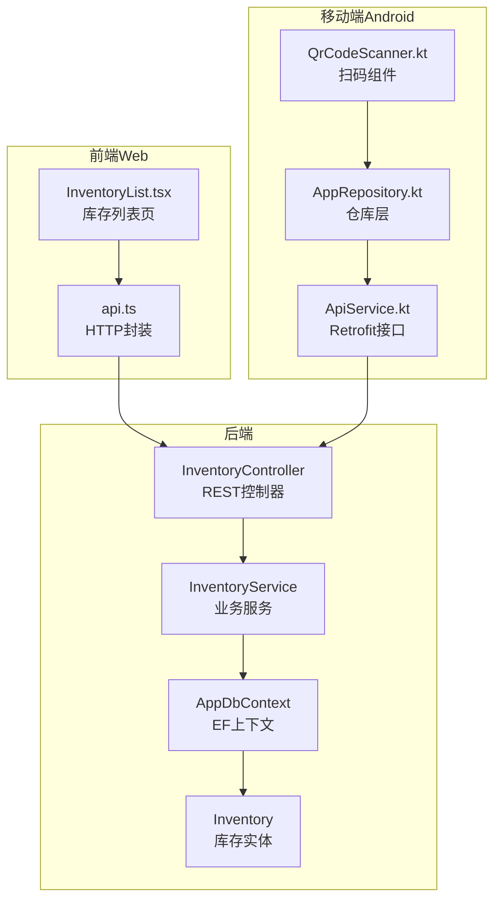
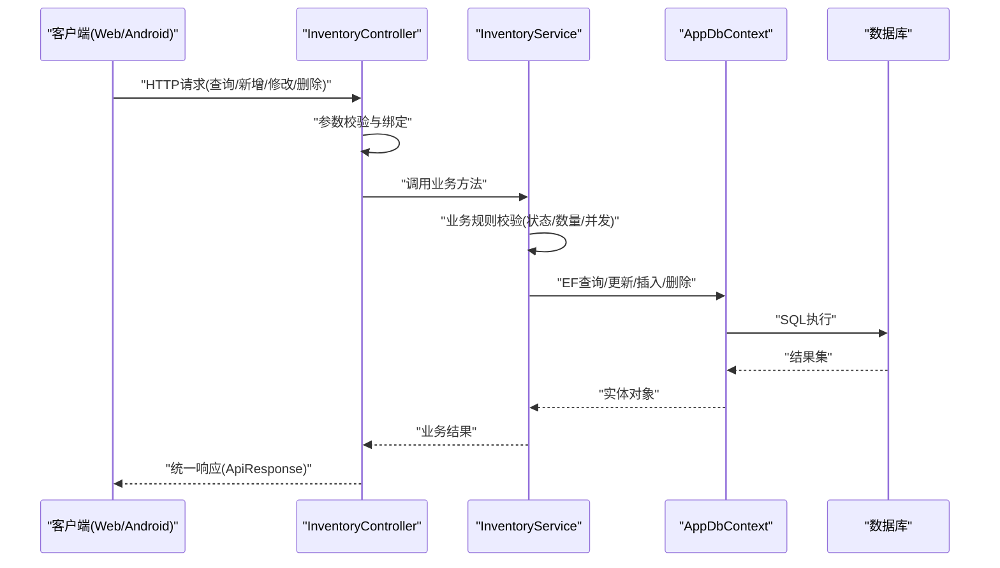
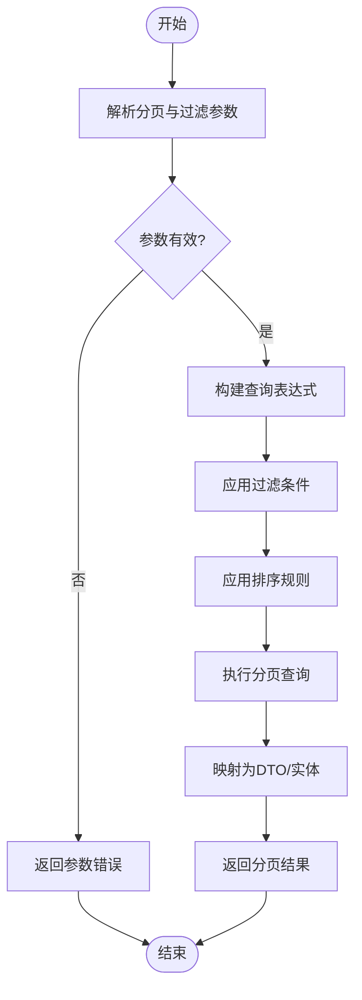
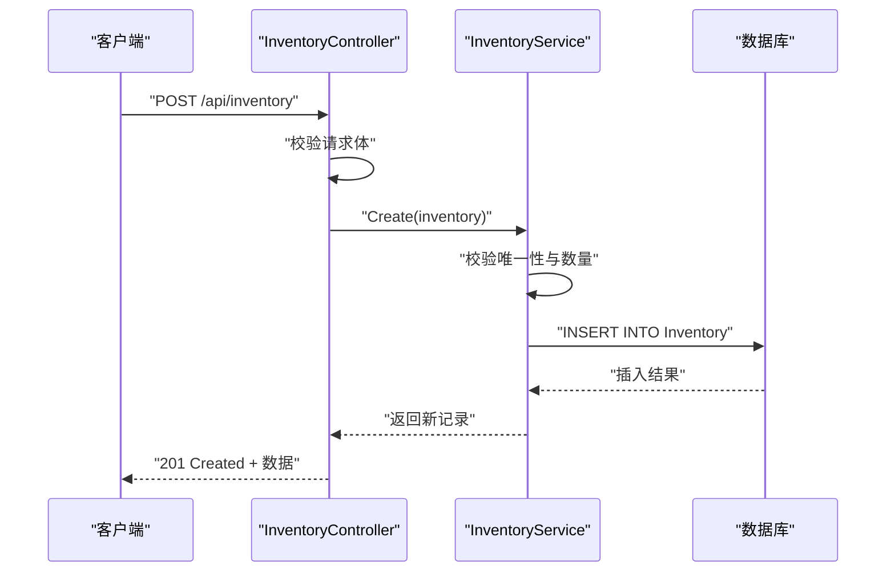
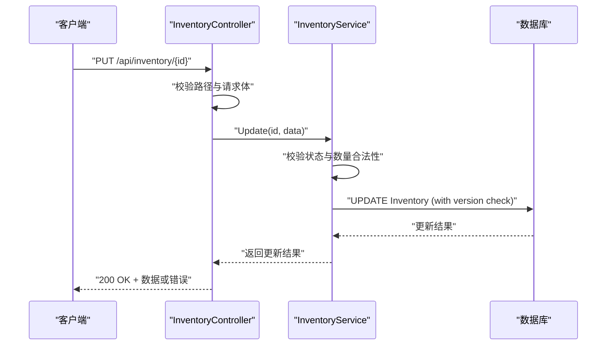
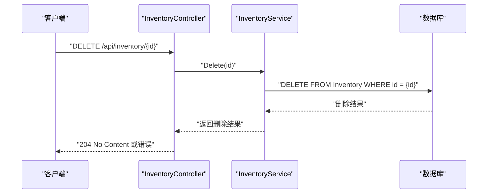
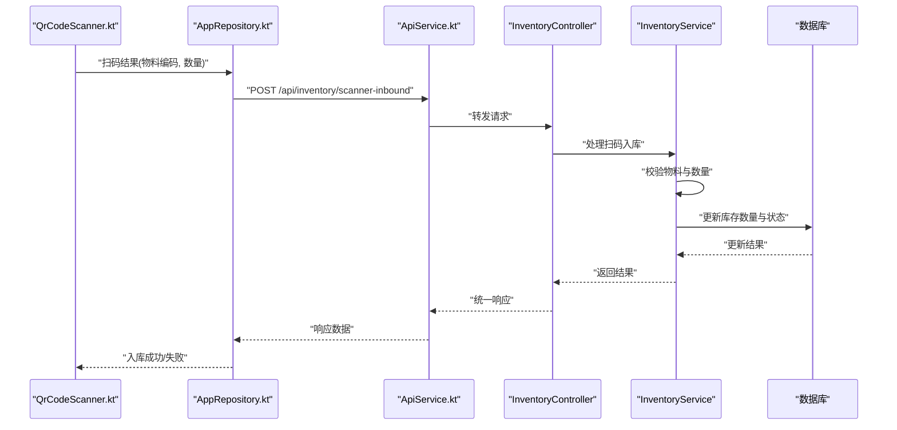
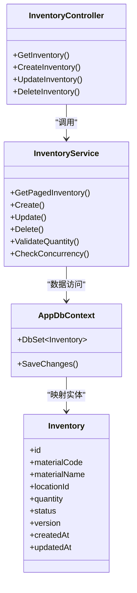

# 基础库存操作

<cite>
**本文档引用的文件**   
- [InventoryController.cs](file://dip-system/api/Controllers/InventoryController.cs)
- [InventoryService.cs](file://dip-system/api/Services/InventoryService.cs)
- [Inventory.cs](file://dip-system/api/Models/Inventory.cs)
- [ApiResponse.cs](file://dip-system/api/Models/ApiResponse.cs)
- [AppDbContext.cs](file://dip-system/api/Data/AppDbContext.cs)
- [Program.cs](file://dip-system/api/Program.cs)
- [api.ts](file://dip-system/frontend-web/src/lib/api.ts)
- [InventoryList.tsx](file://dip-system/frontend-web/src/pages/InventoryList.tsx)
- [ApiService.kt](file://mobile-android/app/src/main/java/com/dip/material/data/network/ApiService.kt)
- [AppRepository.kt](file://mobile-android/app/src/main/java/com/dip/material/data/repository/AppRepository.kt)
- [QrCodeScanner.kt](file://mobile-android/app/src/main/java/com/dip/material/ui/components/QrCodeScanner.kt)
</cite>

## 目录
1. [简介](#简介)
2. [项目结构](#项目结构)
3. [核心组件](#核心组件)
4. [架构总览](#架构总览)
5. [详细组件分析](#详细组件分析)
6. [依赖关系分析](#依赖关系分析)
7. [性能考虑](#性能考虑)
8. [故障排查指南](#故障排查指南)
9. [结论](#结论)
10. [附录](#附录)

## 简介
本文件为DIP系统“基础库存操作”API的权威文档，覆盖库存数据的查询、新增、修改、删除等CRUD能力。内容包含：
- HTTP方法、URL路径、请求参数与响应格式
- 库存数据模型字段定义、数据类型与业务规则
- 分页查询、条件过滤、排序的实现细节
- 完整的请求示例、响应示例与错误处理示例
- 库存状态管理、数量校验、并发控制机制
- 移动端扫码入库的特殊处理逻辑

该API由ASP.NET Core后端提供，前端Web与Android移动端通过HTTP调用接口完成库存相关操作。

## 项目结构
后端采用分层架构：控制器层暴露REST API，服务层封装业务逻辑，数据访问层基于Entity Framework与数据库交互。前端Web使用TypeScript/React，移动端使用Kotlin/Android，均通过HTTP调用后端API。

图表来源
- [InventoryController.cs](file://dip-system/api/Controllers/InventoryController.cs)
- [InventoryService.cs](file://dip-system/api/Services/InventoryService.cs)
- [AppDbContext.cs](file://dip-system/api/Data/AppDbContext.cs)
- [Inventory.cs](file://dip-system/api/Models/Inventory.cs)
- [api.ts](file://dip-system/frontend-web/src/lib/api.ts)
- [InventoryList.tsx](file://dip-system/frontend-web/src/pages/InventoryList.tsx)
- [ApiService.kt](file://mobile-android/app/src/main/java/com/dip/material/data/network/ApiService.kt)
- [AppRepository.kt](file://mobile-android/app/src/main/java/com/dip/material/data/repository/AppRepository.kt)
- [QrCodeScanner.kt](file://mobile-android/app/src/main/java/com/dip/material/ui/components/QrCodeScanner.kt)

章节来源
- [Program.cs](file://dip-system/api/Program.cs)
- [InventoryController.cs](file://dip-system/api/Controllers/InventoryController.cs)
- [InventoryService.cs](file://dip-system/api/Services/InventoryService.cs)
- [AppDbContext.cs](file://dip-system/api/Data/AppDbContext.cs)
- [Inventory.cs](file://dip-system/api/Models/Inventory.cs)

## 核心组件
- 控制器层：InventoryController负责接收HTTP请求、参数校验、调用服务层并返回统一响应。
- 服务层：InventoryService实现库存CRUD、分页、过滤、排序、状态与数量校验、并发控制等核心业务。
- 数据模型：Inventory实体定义库存字段、类型与约束；ApiResponse用于统一响应结构。
- 数据访问：AppDbContext配置EF映射与数据库连接；Inventory实体与数据库表对应。
- 前端集成：Web端通过api.ts封装HTTP调用，InventoryList页面展示与操作库存；移动端通过ApiService.kt与AppRepository.kt调用后端，QrCodeScanner.kt支持扫码入库。

章节来源
- [InventoryController.cs](file://dip-system/api/Controllers/InventoryController.cs)
- [InventoryService.cs](file://dip-system/api/Services/InventoryService.cs)
- [Inventory.cs](file://dip-system/api/Models/Inventory.cs)
- [ApiResponse.cs](file://dip-system/api/Models/ApiResponse.cs)
- [AppDbContext.cs](file://dip-system/api/Data/AppDbContext.cs)
- [api.ts](file://dip-system/frontend-web/src/lib/api.ts)
- [InventoryList.tsx](file://dip-system/frontend-web/src/pages/InventoryList.tsx)
- [ApiService.kt](file://mobile-android/app/src/main/java/com/dip/material/data/network/ApiService.kt)
- [AppRepository.kt](file://mobile-android/app/src/main/java/com/dip/material/data/repository/AppRepository.kt)
- [QrCodeScanner.kt](file://mobile-android/app/src/main/java/com/dip/material/ui/components/QrCodeScanner.kt)

## 架构总览
库存操作的端到端流程如下：客户端发起HTTP请求，控制器进行参数校验后交由服务层处理，服务层执行业务规则（状态、数量、并发），并通过EF上下文访问数据库。响应以统一格式返回给客户端。

图表来源
- [InventoryController.cs](file://dip-system/api/Controllers/InventoryController.cs)
- [InventoryService.cs](file://dip-system/api/Services/InventoryService.cs)
- [AppDbContext.cs](file://dip-system/api/Data/AppDbContext.cs)

## 详细组件分析

### 库存数据模型与业务规则
- 字段定义与类型
  - id：主键标识
  - materialCode：物料编码（唯一）
  - materialName：物料名称
  - locationId：库位ID
  - quantity：当前库存数量（非负整数）
  - status：库存状态（如可用、锁定、报废等）
  - version：并发版本号（乐观锁）
  - createdAt/updatedAt：创建与更新时间戳
- 业务规则
  - 数量必须为非负数，出库扣减时不得小于零
  - 状态变更需符合状态机（如可用→锁定→报废）
  - 并发控制通过version字段实现乐观锁，避免超卖
  - 唯一性约束：materialCode唯一

章节来源
- [Inventory.cs](file://dip-system/api/Models/Inventory.cs)
- [AppDbContext.cs](file://dip-system/api/Data/AppDbContext.cs)

### 分页查询与条件过滤、排序
- 分页参数：page、pageSize
- 过滤参数：materialCode、materialName、locationId、status、quantityRange
- 排序参数：sortBy、sortOrder（asc/desc）
- 响应结构：包含数据列表、总数、页码信息

图表来源
- [InventoryService.cs](file://dip-system/api/Services/InventoryService.cs)

章节来源
- [InventoryService.cs](file://dip-system/api/Services/InventoryService.cs)

### 新增库存
- HTTP方法：POST
- URL路径：/api/inventory
- 请求体字段：materialCode、materialName、locationId、quantity、status
- 响应：成功返回新创建的库存记录，失败返回错误信息

图表来源
- [InventoryController.cs](file://dip-system/api/Controllers/InventoryController.cs)
- [InventoryService.cs](file://dip-system/api/Services/InventoryService.cs)

章节来源
- [InventoryController.cs](file://dip-system/api/Controllers/InventoryController.cs)
- [InventoryService.cs](file://dip-system/api/Services/InventoryService.cs)

### 修改库存
- HTTP方法：PUT/PATCH
- URL路径：/api/inventory/{id}
- 请求体字段：可更新的字段（如quantity、status、locationId）
- 响应：成功返回更新后的记录，失败返回错误信息

图表来源
- [InventoryController.cs](file://dip-system/api/Controllers/InventoryController.cs)
- [InventoryService.cs](file://dip-system/api/Services/InventoryService.cs)

章节来源
- [InventoryController.cs](file://dip-system/api/Controllers/InventoryController.cs)
- [InventoryService.cs](file://dip-system/api/Services/InventoryService.cs)

### 删除库存
- HTTP方法：DELETE
- URL路径：/api/inventory/{id}
- 响应：成功返回删除确认，失败返回错误信息

图表来源
- [InventoryController.cs](file://dip-system/api/Controllers/InventoryController.cs)
- [InventoryService.cs](file://dip-system/api/Services/InventoryService.cs)

章节来源
- [InventoryController.cs](file://dip-system/api/Controllers/InventoryController.cs)
- [InventoryService.cs](file://dip-system/api/Services/InventoryService.cs)

### 移动端扫码入库特殊处理
- 扫码输入：通过QrCodeScanner.kt捕获二维码/条形码内容
- 数据处理：解析物料编码与数量，调用AppRepository.kt中的入库接口
- 后端处理：InventoryService校验物料存在性、数量合法性，更新库存状态与数量
- 反馈：返回成功或错误提示，前端显示结果

图表来源
- [QrCodeScanner.kt](file://mobile-android/app/src/main/java/com/dip/material/ui/components/QrCodeScanner.kt)
- [AppRepository.kt](file://mobile-android/app/src/main/java/com/dip/material/data/repository/AppRepository.kt)
- [ApiService.kt](file://mobile-android/app/src/main/java/com/dip/material/data/network/ApiService.kt)
- [InventoryController.cs](file://dip-system/api/Controllers/InventoryController.cs)
- [InventoryService.cs](file://dip-system/api/Services/InventoryService.cs)

章节来源
- [QrCodeScanner.kt](file://mobile-android/app/src/main/java/com/dip/material/ui/components/QrCodeScanner.kt)
- [AppRepository.kt](file://mobile-android/app/src/main/java/com/dip/material/data/repository/AppRepository.kt)
- [ApiService.kt](file://mobile-android/app/src/main/java/com/dip/material/data/network/ApiService.kt)
- [InventoryController.cs](file://dip-system/api/Controllers/InventoryController.cs)
- [InventoryService.cs](file://dip-system/api/Services/InventoryService.cs)

## 依赖关系分析
- 控制器依赖服务层，服务层依赖数据上下文，形成清晰的单向依赖链
- 前端Web与移动端分别通过各自的HTTP封装调用后端API
- 实体模型与数据库表通过EF上下文映射

图表来源
- [InventoryController.cs](file://dip-system/api/Controllers/InventoryController.cs)
- [InventoryService.cs](file://dip-system/api/Services/InventoryService.cs)
- [AppDbContext.cs](file://dip-system/api/Data/AppDbContext.cs)
- [Inventory.cs](file://dip-system/api/Models/Inventory.cs)

章节来源
- [InventoryController.cs](file://dip-system/api/Controllers/InventoryController.cs)
- [InventoryService.cs](file://dip-system/api/Services/InventoryService.cs)
- [AppDbContext.cs](file://dip-system/api/Data/AppDbContext.cs)
- [Inventory.cs](file://dip-system/api/Models/Inventory.cs)

## 性能考虑
- 分页查询：合理设置pageSize，避免一次性加载过多数据
- 索引优化：对常用过滤字段（materialCode、locationId、status）建立索引
- 并发控制：使用乐观锁减少锁竞争，提高吞吐量
- 缓存策略：对热点数据（如物料主数据）可引入缓存层
- 批量操作：对于大量更新场景，建议使用批量更新接口

## 故障排查指南
- 参数错误：检查请求体字段是否完整、类型是否正确
- 业务规则错误：验证库存状态与数量是否符合规则
- 并发冲突：version不一致导致更新失败，需重新获取最新数据
- 数据库异常：检查连接字符串、表结构与权限
- 前端问题：确认API调用路径、认证令牌与网络状态

章节来源
- [InventoryService.cs](file://dip-system/api/Services/InventoryService.cs)
- [ApiResponse.cs](file://dip-system/api/Models/ApiResponse.cs)

## 结论
本API提供了完整的库存CRUD能力，支持分页、过滤、排序与并发控制，满足DIP系统的库存管理需求。移动端扫码入库功能简化了操作流程，提升了作业效率。建议在生产环境中加强监控与日志记录，确保系统稳定运行。

## 附录
- 统一响应格式：ApiResponse包含code、message、data等字段
- 错误码规范：定义常见错误码与含义
- 前端集成示例：参考api.ts与InventoryList.tsx中的调用方式
- 移动端集成示例：参考ApiService.kt与AppRepository.kt中的接口定义

章节来源
- [ApiResponse.cs](file://dip-system/api/Models/ApiResponse.cs)
- [api.ts](file://dip-system/frontend-web/src/lib/api.ts)
- [InventoryList.tsx](file://dip-system/frontend-web/src/pages/InventoryList.tsx)
- [ApiService.kt](file://mobile-android/app/src/main/java/com/dip/material/data/network/ApiService.kt)
- [AppRepository.kt](file://mobile-android/app/src/main/java/com/dip/material/data/repository/AppRepository.kt)