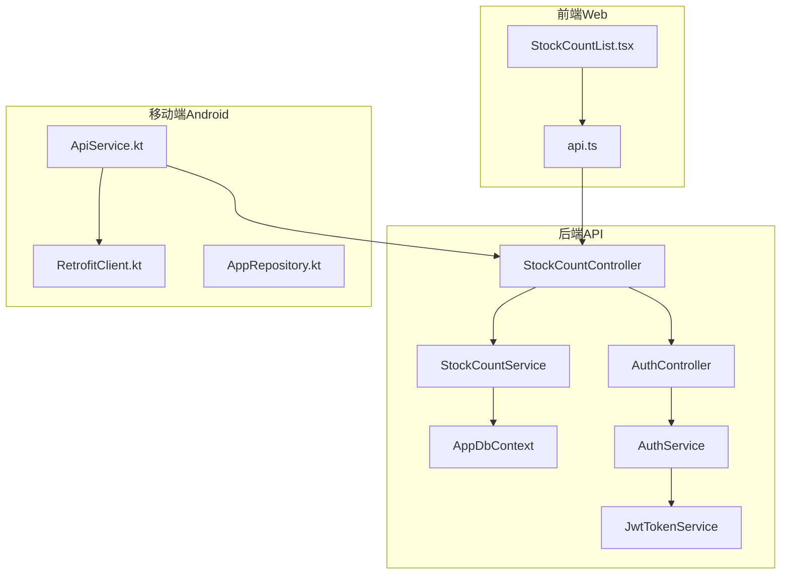
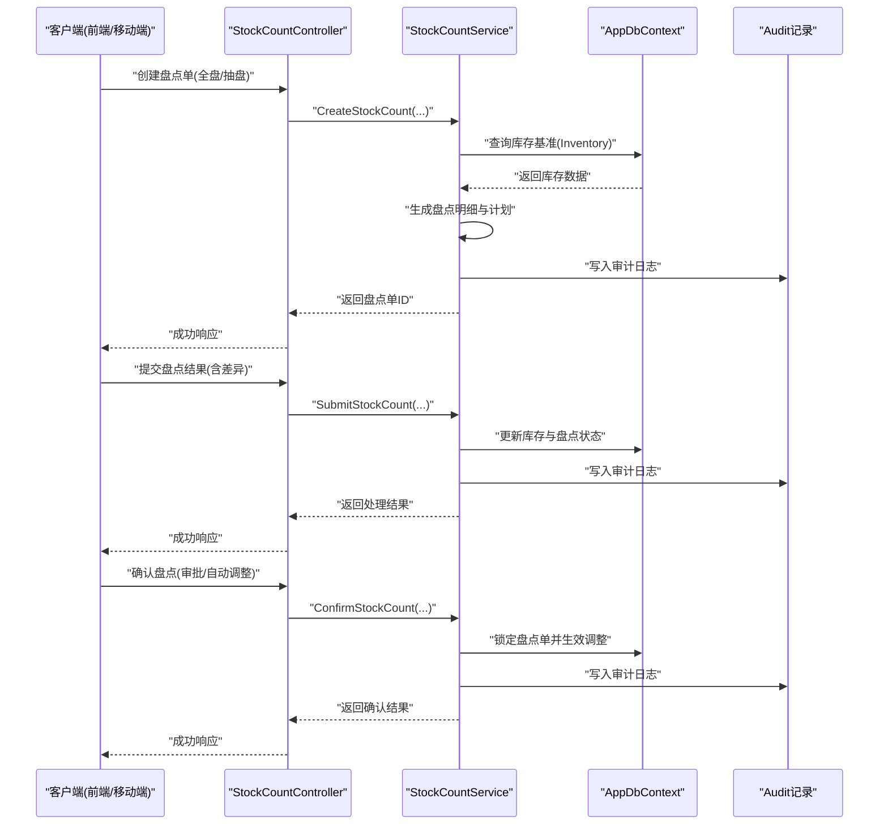
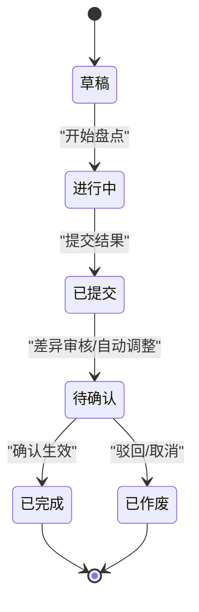
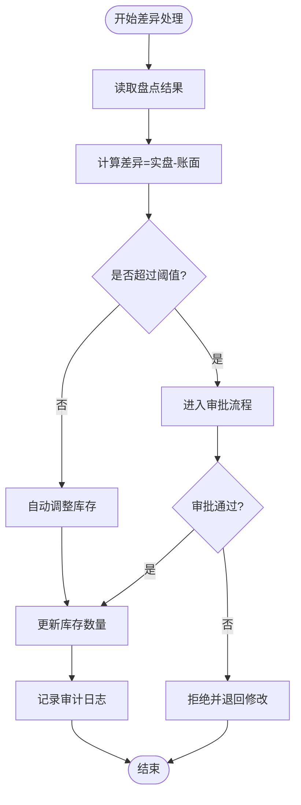
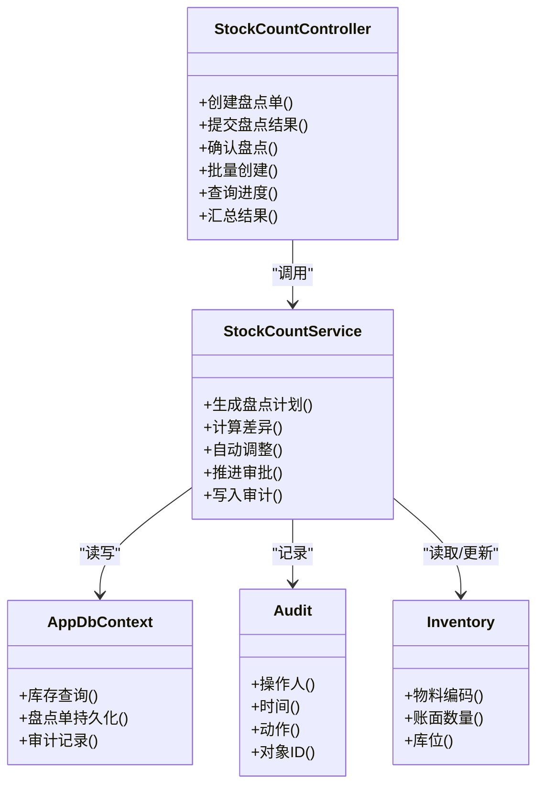

# 库存盘点接口

<cite>
**本文引用的文件**   
- [StockCountController.cs](file://dip-system/api/Controllers/StockCountController.cs)
- [StockCountService.cs](file://dip-system/api/Services/StockCountService.cs)
- [StockCount.cs](file://dip-system/api/Models/StockCount.cs)
- [Inventory.cs](file://dip-system/api/Models/Inventory.cs)
- [Audit.cs](file://dip-system/api/Models/Audit.cs)
- [ApiResponse.cs](file://dip-system/api/Models/ApiResponse.cs)
- [AppDbContext.cs](file://dip-system/api/Data/AppDbContext.cs)
- [AuthController.cs](file://dip-system/api/Controllers/AuthController.cs)
- [AuthService.cs](file://dip-system/api/Services/AuthService.cs)
- [JwtTokenService.cs](file://dip-system/api/Services/JwtTokenService.cs)
- [StockCountList.tsx](file://dip-system/frontend-web/src/pages/StockCountList.tsx)
- [api.ts](file://dip-system/frontend-web/src/lib/api.ts)
- [ApiService.kt](file://mobile-android/app/src/main/java/com/dip/material/data/network/ApiService.kt)
- [RetrofitClient.kt](file://mobile-android/app/src/main/java/com/dip/material/data/network/RetrofitClient.kt)
- [AppRepository.kt](file://mobile-android/app/src/main/java/com/dip/material/data/repository/AppRepository.kt)
</cite>

## 目录
1. [简介](#简介)
2. [项目结构](#项目结构)
3. [核心组件](#核心组件)
4. [架构总览](#架构总览)
5. [详细组件分析](#详细组件分析)
6. [依赖关系分析](#依赖关系分析)
7. [性能考虑](#性能考虑)
8. [故障排查指南](#故障排查指南)
9. [结论](#结论)
10. [附录](#附录)

## 简介
本文件为DIP系统库存盘点API的完整技术文档，覆盖盘点任务创建、执行、确认的全流程接口；盘点单数据结构与状态流转；盘点类型（全盘、抽盘）与差异处理逻辑；权限控制与审计记录；批量创建、进度跟踪与结果汇总；差异分析与自动调整、审批流程；以及PDA设备盘点作业、离线数据处理与数据同步机制。读者可据此完成前后端集成、移动端PDA作业与后台管理对接。

## 项目结构
后端采用ASP.NET Core Web API，按控制器-服务-模型分层组织；前端Web使用React+TypeScript；移动端Android使用Kotlin+Retrofit。盘点相关代码主要位于：
- 控制器层：StockCountController.cs
- 服务层：StockCountService.cs
- 数据模型：StockCount.cs、Inventory.cs、Audit.cs、ApiResponse.cs
- 数据访问：AppDbContext.cs
- 认证与鉴权：AuthController.cs、AuthService.cs、JwtTokenService.cs
- 前端页面与API封装：StockCountList.tsx、api.ts
- 移动端网络与仓库：ApiService.kt、RetrofitClient.kt、AppRepository.kt

图表来源
- [StockCountController.cs](file://dip-system/api/Controllers/StockCountController.cs)
- [StockCountService.cs](file://dip-system/api/Services/StockCountService.cs)
- [AppDbContext.cs](file://dip-system/api/Data/AppDbContext.cs)
- [AuthController.cs](file://dip-system/api/Controllers/AuthController.cs)
- [AuthService.cs](file://dip-system/api/Services/AuthService.cs)
- [JwtTokenService.cs](file://dip-system/api/Services/JwtTokenService.cs)
- [StockCountList.tsx](file://dip-system/frontend-web/src/pages/StockCountList.tsx)
- [api.ts](file://dip-system/frontend-web/src/lib/api.ts)
- [ApiService.kt](file://mobile-android/app/src/main/java/com/dip/material/data/network/ApiService.kt)
- [RetrofitClient.kt](file://mobile-android/app/src/main/java/com/dip/material/data/network/RetrofitClient.kt)
- [AppRepository.kt](file://mobile-android/app/src/main/java/com/dip/material/data/repository/AppRepository.kt)

章节来源
- [StockCountController.cs](file://dip-system/api/Controllers/StockCountController.cs)
- [StockCountService.cs](file://dip-system/api/Services/StockCountService.cs)
- [StockCount.cs](file://dip-system/api/Models/StockCount.cs)
- [Inventory.cs](file://dip-system/api/Models/Inventory.cs)
- [Audit.cs](file://dip-system/api/Models/Audit.cs)
- [ApiResponse.cs](file://dip-system/api/Models/ApiResponse.cs)
- [AppDbContext.cs](file://dip-system/api/Data/AppDbContext.cs)
- [AuthController.cs](file://dip-system/api/Controllers/AuthController.cs)
- [AuthService.cs](file://dip-system/api/Services/AuthService.cs)
- [JwtTokenService.cs](file://dip-system/api/Services/JwtTokenService.cs)
- [StockCountList.tsx](file://dip-system/frontend-web/src/pages/StockCountList.tsx)
- [api.ts](file://dip-system/frontend-web/src/lib/api.ts)
- [ApiService.kt](file://mobile-android/app/src/main/java/com/dip/material/data/network/ApiService.kt)
- [RetrofitClient.kt](file://mobile-android/app/src/main/java/com/dip/material/data/network/RetrofitClient.kt)
- [AppRepository.kt](file://mobile-android/app/src/main/java/com/dip/material/data/repository/AppRepository.kt)

## 核心组件
- StockCountController：暴露盘点相关的REST接口，包括盘点单创建、查询、提交、确认、差异处理、批量操作等。
- StockCountService：实现盘点业务逻辑，包含盘点计划生成、差异计算、自动调整策略、审批流推进、审计记录写入。
- StockCount模型：定义盘点单主表字段、状态枚举、盘点类型（全盘/抽盘）、关联物料与库位信息。
- Inventory模型：定义库存实体，用于盘点前基准值读取与盘点后更新。
- Audit模型：记录关键操作的审计日志，支持追溯。
- ApiResponse：统一响应包装，便于前后端一致交互。
- AppDbContext：EF Core上下文，映射数据库表与实体关系。
- 认证与授权：通过AuthController、AuthService、JwtTokenService实现登录鉴权与令牌校验。

章节来源
- [StockCountController.cs](file://dip-system/api/Controllers/StockCountController.cs)
- [StockCountService.cs](file://dip-system/api/Services/StockCountService.cs)
- [StockCount.cs](file://dip-system/api/Models/StockCount.cs)
- [Inventory.cs](file://dip-system/api/Models/Inventory.cs)
- [Audit.cs](file://dip-system/api/Models/Audit.cs)
- [ApiResponse.cs](file://dip-system/api/Models/ApiResponse.cs)
- [AppDbContext.cs](file://dip-system/api/Data/AppDbContext.cs)
- [AuthController.cs](file://dip-system/api/Controllers/AuthController.cs)
- [AuthService.cs](file://dip-system/api/Services/AuthService.cs)
- [JwtTokenService.cs](file://dip-system/api/Services/JwtTokenService.cs)

## 架构总览
盘点业务流程从前端或移动端发起请求，经控制器路由到服务层进行业务处理，最终通过数据上下文持久化。认证拦截确保只有具备权限的用户才能执行盘点操作。

图表来源
- [StockCountController.cs](file://dip-system/api/Controllers/StockCountController.cs)
- [StockCountService.cs](file://dip-system/api/Services/StockCountService.cs)
- [AppDbContext.cs](file://dip-system/api/Data/AppDbContext.cs)
- [Audit.cs](file://dip-system/api/Models/Audit.cs)

## 详细组件分析

### 盘点单数据模型与状态流转
- 盘点单主键、编号、仓库/库区、盘点类型（全盘/抽盘）、状态（草稿、进行中、已提交、待确认、已完成、已作废）、创建人、时间戳等。
- 盘点明细包含物料编码、批次、单位、账面数量、实盘数量、差异数量、差异原因、备注等。
- 状态流转：
  - 草稿：创建后未提交
  - 进行中：开始盘点作业
  - 已提交：提交差异与结果
  - 待确认：等待审批或自动调整
  - 已完成：确认生效，库存更新
  - 已作废：取消盘点

图表来源
- [StockCount.cs](file://dip-system/api/Models/StockCount.cs)

章节来源
- [StockCount.cs](file://dip-system/api/Models/StockCount.cs)
- [Inventory.cs](file://dip-system/api/Models/Inventory.cs)

### 盘点类型与差异处理逻辑
- 全盘：对指定仓库/库区所有物料进行清点，适合周期性全面核对。
- 抽盘：针对部分物料或库位抽样盘点，适合日常快速核对。
- 差异处理：
  - 自动调整：在阈值范围内自动修正库存，减少人工干预。
  - 审批流程：超出阈值的差异需人工审批，通过后生效。
  - 差异原因：支持录入原因分类（损耗、错发、漏记等），便于后续分析。

图表来源
- [StockCountService.cs](file://dip-system/api/Services/StockCountService.cs)
- [Audit.cs](file://dip-system/api/Models/Audit.cs)

章节来源
- [StockCountService.cs](file://dip-system/api/Services/StockCountService.cs)
- [Audit.cs](file://dip-system/api/Models/Audit.cs)

### 权限控制与审计记录
- 权限控制：
  - 盘点创建：需具备“盘点”权限角色。
  - 盘点提交：仅允许当前盘点执行人或负责人提交。
  - 盘点确认：需具备“审批”权限角色。
- 审计记录：
  - 关键操作均写入审计表，包含操作人、时间、动作、对象ID、变更摘要。
  - 支持按盘点单号、操作人、时间范围检索审计日志。

章节来源
- [AuthController.cs](file://dip-system/api/Controllers/AuthController.cs)
- [AuthService.cs](file://dip-system/api/Services/AuthService.cs)
- [JwtTokenService.cs](file://dip-system/api/Services/JwtTokenService.cs)
- [Audit.cs](file://dip-system/api/Models/Audit.cs)

### PDA设备盘点作业与离线数据处理
- PDA作业：
  - 扫码识别物料/库位，本地缓存扫描结果。
  - 支持断网状态下继续作业，网络恢复后批量同步。
- 离线数据：
  - 本地SQLite存储盘点草稿与明细。
  - 同步时去重、冲突检测（以服务端为准）。
- 数据同步：
  - 增量同步：仅上传新增/变更的盘点明细。
  - 幂等性：通过唯一流水号避免重复提交。

章节来源
- [ApiService.kt](file://mobile-android/app/src/main/java/com/dip/material/data/network/ApiService.kt)
- [RetrofitClient.kt](file://mobile-android/app/src/main/java/com/dip/material/data/network/RetrofitClient.kt)
- [AppRepository.kt](file://mobile-android/app/src/main/java/com/dip/material/data/repository/AppRepository.kt)

### 前端Web盘点列表与操作
- 盘点列表：展示盘点单号、类型、状态、创建时间、操作按钮。
- 操作入口：创建、开始、提交、确认、查看差异、导出报表。
- 交互流程：调用api.ts封装的HTTP方法，转发至后端控制器。

章节来源
- [StockCountList.tsx](file://dip-system/frontend-web/src/pages/StockCountList.tsx)
- [api.ts](file://dip-system/frontend-web/src/lib/api.ts)

## 依赖关系分析
- 控制器依赖服务层，服务层依赖数据上下文与审计模型。
- 认证模块独立于盘点模块，通过JWT令牌传递用户身份与权限。
- 前端与移动端通过统一的API契约与后端交互。

图表来源
- [StockCountController.cs](file://dip-system/api/Controllers/StockCountController.cs)
- [StockCountService.cs](file://dip-system/api/Services/StockCountService.cs)
- [AppDbContext.cs](file://dip-system/api/Data/AppDbContext.cs)
- [Audit.cs](file://dip-system/api/Models/Audit.cs)
- [Inventory.cs](file://dip-system/api/Models/Inventory.cs)

章节来源
- [StockCountController.cs](file://dip-system/api/Controllers/StockCountController.cs)
- [StockCountService.cs](file://dip-system/api/Services/StockCountService.cs)
- [AppDbContext.cs](file://dip-system/api/Data/AppDbContext.cs)
- [Audit.cs](file://dip-system/api/Models/Audit.cs)
- [Inventory.cs](file://dip-system/api/Models/Inventory.cs)

## 性能考虑
- 批量创建：支持分批提交，避免单次请求过大导致超时。
- 分页查询：盘点列表与审计日志采用分页，减少数据传输量。
- 并发控制：盘点提交与确认需加锁，防止重复提交与竞态条件。
- 缓存策略：库存基准数据可短期缓存，降低数据库压力。
- 异步处理：差异分析与审批通知可采用消息队列异步执行。

[本节为通用指导，不直接分析具体文件]

## 故障排查指南
- 常见错误：
  - 权限不足：检查JWT令牌与角色配置。
  - 数据不一致：核对库存基准与盘点明细一致性。
  - 同步失败：检查离线流水号唯一性与网络连通性。
- 调试建议：
  - 启用详细日志，记录关键步骤输入输出。
  - 使用审计日志定位问题操作人与时间。
  - 前端/移动端打印请求/响应报文。

章节来源
- [AuthController.cs](file://dip-system/api/Controllers/AuthController.cs)
- [AuthService.cs](file://dip-system/api/Services/AuthService.cs)
- [JwtTokenService.cs](file://dip-system/api/Services/JwtTokenService.cs)
- [Audit.cs](file://dip-system/api/Models/Audit.cs)

## 结论
本文件系统化梳理了DIP系统库存盘点API的架构、数据模型、业务流程与接口规范，覆盖全盘/抽盘、差异处理、权限与审计、PDA离线同步等关键能力。基于此文档，开发团队可高效完成前后端与移动端的集成与优化。

[本节为总结性内容，不直接分析具体文件]

## 附录
- API示例（概念性描述）：
  - 创建盘点单：POST /api/stockcount/create，参数包含仓库、类型、范围。
  - 提交盘点结果：POST /api/stockcount/submit，参数包含盘点单ID、明细列表。
  - 确认盘点：POST /api/stockcount/confirm，参数包含盘点单ID、审批意见。
  - 批量创建：POST /api/stockcount/batch-create，参数包含多个盘点单模板。
  - 进度跟踪：GET /api/stockcount/progress?stockCountId=...
  - 结果汇总：GET /api/stockcount/summary?stockCountId=...
- 数据模型字段说明：
  - 盘点单：编号、类型、状态、仓库、创建人、时间戳。
  - 盘点明细：物料编码、批次、单位、账面数量、实盘数量、差异数量、原因、备注。
  - 审计记录：操作人、时间、动作、对象ID、变更摘要。

[本节为补充说明，不直接分析具体文件]