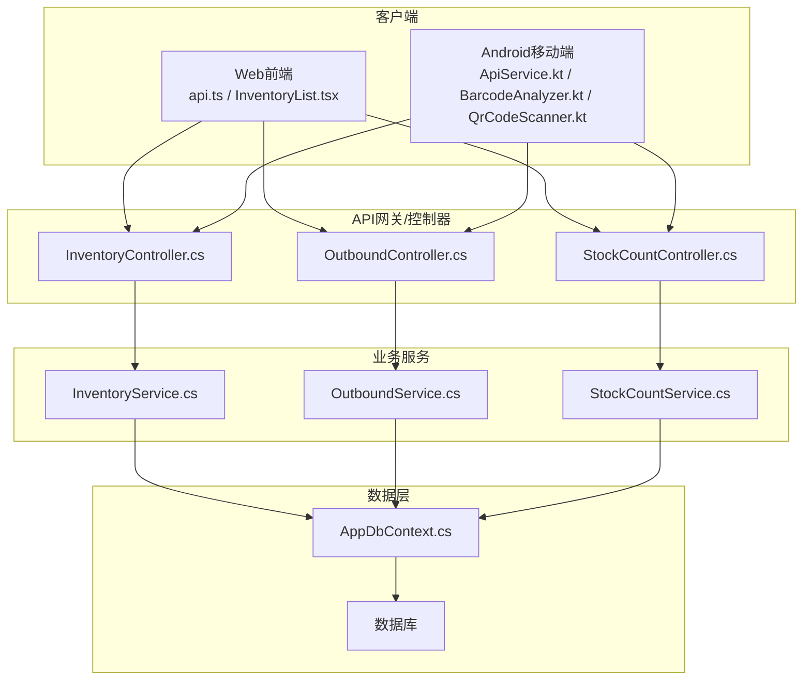
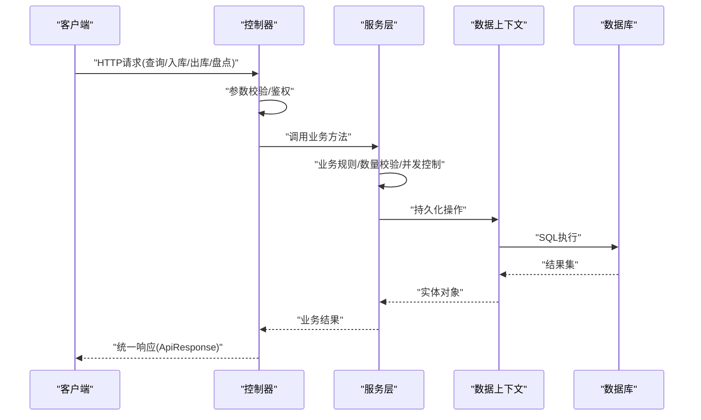
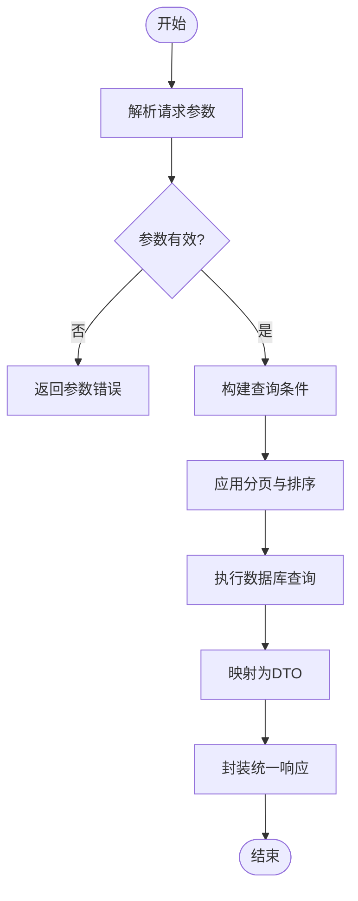
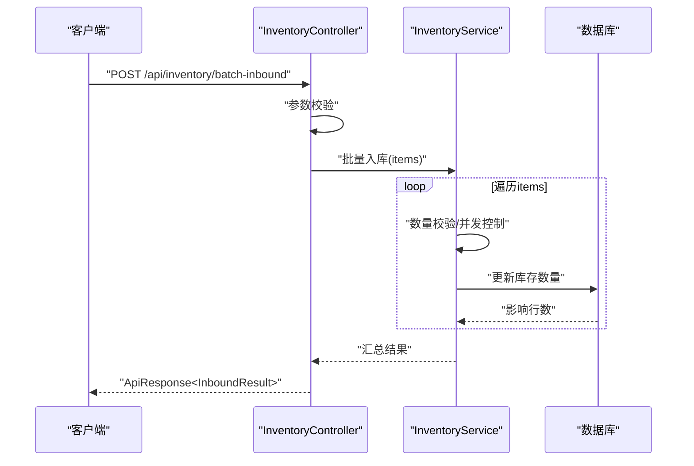
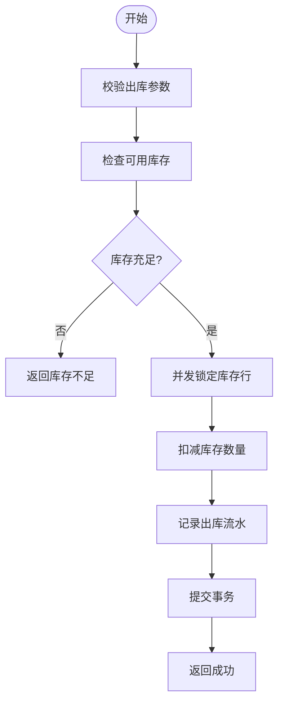
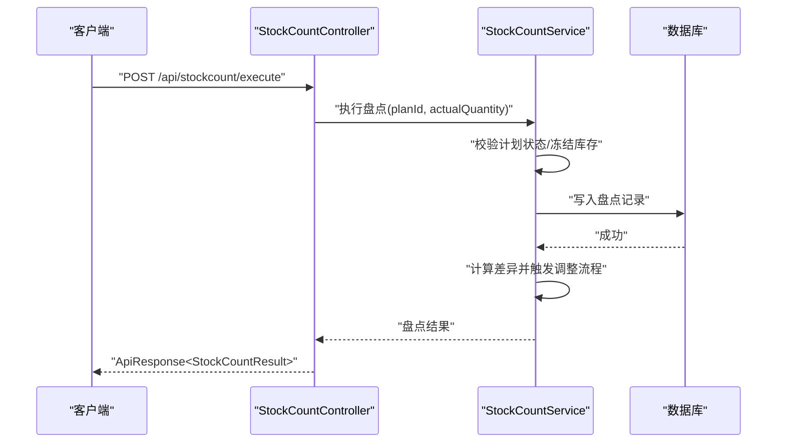
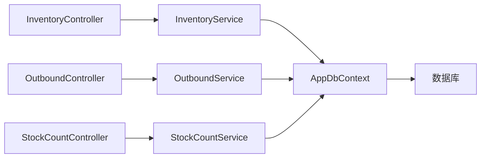

# 库存管理接口

<cite>
**本文引用的文件**   
- [InventoryController.cs](file://dip-system/api/Controllers/InventoryController.cs)
- [InventoryService.cs](file://dip-system/api/Services/InventoryService.cs)
- [Inventory.cs](file://dip-system/api/Models/Inventory.cs)
- [StockCountController.cs](file://dip-system/api/Controllers/StockCountController.cs)
- [StockCountService.cs](file://dip-system/api/Services/StockCountService.cs)
- [StockCount.cs](file://dip-system/api/Models/StockCount.cs)
- [OutboundController.cs](file://dip-system/api/Controllers/OutboundController.cs)
- [OutboundService.cs](file://dip-system/api/Services/OutboundService.cs)
- [Outbound.cs](file://dip-system/api/Models/Outbound.cs)
- [ApiResponse.cs](file://dip-system/api/Models/ApiResponse.cs)
- [AppDbContext.cs](file://dip-system/api/Data/AppDbContext.cs)
- [Program.cs](file://dip-system/api/Program.cs)
- [api.ts](file://dip-system/frontend-web/src/lib/api.ts)
- [InventoryList.tsx](file://dip-system/frontend-web/src/pages/InventoryList.tsx)
- [StockCountList.tsx](file://dip-system/frontend-web/src/pages/StockCountList.tsx)
- [ApiService.kt](file://mobile-android/app/src/main/java/com/dip/material/data/network/ApiService.kt)
- [BarcodeAnalyzer.kt](file://mobile-android/app/src/main/java/com/dip/material/ui/components/BarcodeAnalyzer.kt)
- [QrCodeScanner.kt](file://mobile-android/app/src/main/java/com/dip/material/ui/components/QrCodeScanner.kt)
</cite>

## 目录
1. [简介](#简介)
2. [项目结构](#项目结构)
3. [核心组件](#核心组件)
4. [架构总览](#架构总览)
5. [详细组件分析](#详细组件分析)
6. [依赖关系分析](#依赖关系分析)
7. [性能考虑](#性能考虑)
8. [故障排查指南](#故障排查指南)
9. [结论](#结论)
10. [附录](#附录)

## 简介
本文件为DIP系统库存管理API的权威文档，覆盖库存查询、入库、出库、盘点等接口的HTTP方法、URL路径、请求参数与响应格式；详细说明库存数据模型、字段定义与业务规则；提供批量操作、分页查询、条件过滤的实现说明；阐述库存状态管理、数量校验、并发控制机制；给出完整的CRUD示例、批量处理示例、错误处理示例；并提供性能优化建议、缓存策略、数据一致性保证方案；最后补充移动端扫码入库与PDA设备集成的特殊处理。

## 项目结构
后端采用ASP.NET Core Web API，分层清晰：
- Controllers层：对外暴露RESTful接口，负责参数校验、路由映射、统一响应封装。
- Services层：承载核心业务逻辑，包括事务、并发控制、数量校验、状态流转。
- Models层：实体模型与DTO，用于数据库映射与接口契约。
- Data层：EF Core上下文与数据库访问。
- Program.cs：应用启动配置（中间件、服务注册、认证等）。

前端Web使用React+TypeScript，通过api.ts调用后端接口，页面包含库存列表、盘点列表等。

移动端Android使用Kotlin+Retrofit，提供扫码入库、PDA集成能力。

图表来源
- [Program.cs](file://dip-system/api/Program.cs)
- [InventoryController.cs](file://dip-system/api/Controllers/InventoryController.cs)
- [InventoryService.cs](file://dip-system/api/Services/InventoryService.cs)
- [OutboundController.cs](file://dip-system/api/Controllers/OutboundController.cs)
- [OutboundService.cs](file://dip-system/api/Services/OutboundService.cs)
- [StockCountController.cs](file://dip-system/api/Controllers/StockCountController.cs)
- [StockCountService.cs](file://dip-system/api/Services/StockCountService.cs)
- [AppDbContext.cs](file://dip-system/api/Data/AppDbContext.cs)

章节来源
- [Program.cs](file://dip-system/api/Program.cs)
- [InventoryController.cs](file://dip-system/api/Controllers/InventoryController.cs)
- [InventoryService.cs](file://dip-system/api/Services/InventoryService.cs)
- [OutboundController.cs](file://dip-system/api/Controllers/OutboundController.cs)
- [OutboundService.cs](file://dip-system/api/Services/OutboundService.cs)
- [StockCountController.cs](file://dip-system/api/Controllers/StockCountController.cs)
- [StockCountService.cs](file://dip-system/api/Services/StockCountService.cs)
- [AppDbContext.cs](file://dip-system/api/Data/AppDbContext.cs)

## 核心组件
- 库存控制器与服务：提供库存查询、入库、出库、调整、批量导入导出等能力。
- 出库控制器与服务：处理生产领料、调拨出库等业务场景。
- 盘点控制器与服务：支持盘点计划、盘点执行、差异调整。
- 数据模型：Inventory、Outbound、StockCount等实体定义字段与约束。
- 统一响应：ApiResponse封装标准返回结构。

章节来源
- [InventoryController.cs](file://dip-system/api/Controllers/InventoryController.cs)
- [InventoryService.cs](file://dip-system/api/Services/InventoryService.cs)
- [Inventory.cs](file://dip-system/api/Models/Inventory.cs)
- [OutboundController.cs](file://dip-system/api/Controllers/OutboundController.cs)
- [OutboundService.cs](file://dip-system/api/Services/OutboundService.cs)
- [Outbound.cs](file://dip-system/api/Models/Outbound.cs)
- [StockCountController.cs](file://dip-system/api/Controllers/StockCountController.cs)
- [StockCountService.cs](file://dip-system/api/Services/StockCountService.cs)
- [StockCount.cs](file://dip-system/api/Models/StockCount.cs)
- [ApiResponse.cs](file://dip-system/api/Models/ApiResponse.cs)

## 架构总览
整体采用“控制器-服务-仓储”的分层架构，结合EF Core进行数据持久化。关键流程如下：
- 请求进入控制器，完成参数校验与权限检查。
- 控制器调用对应Service执行业务逻辑（含事务、并发锁、数量校验）。
- Service通过DbContext访问数据库，确保数据一致性与完整性。
- 统一响应封装后返回客户端。

图表来源
- [InventoryController.cs](file://dip-system/api/Controllers/InventoryController.cs)
- [InventoryService.cs](file://dip-system/api/Services/InventoryService.cs)
- [OutboundController.cs](file://dip-system/api/Controllers/OutboundController.cs)
- [OutboundService.cs](file://dip-system/api/Services/OutboundService.cs)
- [StockCountController.cs](file://dip-system/api/Controllers/StockCountController.cs)
- [StockCountService.cs](file://dip-system/api/Services/StockCountService.cs)
- [AppDbContext.cs](file://dip-system/api/Data/AppDbContext.cs)

## 详细组件分析

### 库存查询接口
- HTTP方法与路径
  - GET /api/inventory：分页查询库存
  - GET /api/inventory/{id}：按ID查询
  - POST /api/inventory/search：条件过滤查询
- 请求参数
  - 分页：page, pageSize
  - 过滤：materialCode, warehouseId, locationId, status, batchNo, minQty, maxQty
  - 排序：orderBy, sortOrder
- 响应格式
  - ApiResponse<List<Inventory>>，包含数据列表、总数、页码信息
- 业务规则
  - 仅返回可用状态或指定状态的库存记录
  - 支持多条件组合过滤与模糊匹配
  - 分页默认上限限制，防止大结果集

图表来源
- [InventoryController.cs](file://dip-system/api/Controllers/InventoryController.cs)
- [InventoryService.cs](file://dip-system/api/Services/InventoryService.cs)

章节来源
- [InventoryController.cs](file://dip-system/api/Controllers/InventoryController.cs)
- [InventoryService.cs](file://dip-system/api/Services/InventoryService.cs)
- [Inventory.cs](file://dip-system/api/Models/Inventory.cs)

### 入库接口
- HTTP方法与路径
  - POST /api/inventory/inbound：单条入库
  - POST /api/inventory/batch-inbound：批量入库
- 请求参数
  - 单条：materialCode, quantity, warehouseId, locationId, batchNo, supplier, remark
  - 批量：items数组，每项包含上述字段
- 业务规则
  - 数量必须大于0
  - 批次号唯一性校验（可选）
  - 仓库与库位有效性校验
  - 并发入库需加行级锁或乐观锁避免超卖
- 响应格式
  - ApiResponse<InboundResult>，包含成功条目数、失败明细

图表来源
- [InventoryController.cs](file://dip-system/api/Controllers/InventoryController.cs)
- [InventoryService.cs](file://dip-system/api/Services/InventoryService.cs)

章节来源
- [InventoryController.cs](file://dip-system/api/Controllers/InventoryController.cs)
- [InventoryService.cs](file://dip-system/api/Services/InventoryService.cs)
- [Inventory.cs](file://dip-system/api/Models/Inventory.cs)

### 出库接口
- HTTP方法与路径
  - POST /api/outbound：生产领料出库
  - POST /api/outbound/batch：批量出库
- 请求参数
  - 出库类型：production、transfer、scrap
  - 物料编码、数量、目标库位、批次号、关联单据号
- 业务规则
  - 出库数量不得超过可用库存
  - 先进先出（FIFO）或批次优先策略
  - 出库后生成出库流水记录
- 响应格式
  - ApiResponse<OutboundResult>

图表来源
- [OutboundController.cs](file://dip-system/api/Controllers/OutboundController.cs)
- [OutboundService.cs](file://dip-system/api/Services/OutboundService.cs)
- [Outbound.cs](file://dip-system/api/Models/Outbound.cs)

章节来源
- [OutboundController.cs](file://dip-system/api/Controllers/OutboundController.cs)
- [OutboundService.cs](file://dip-system/api/Services/OutboundService.cs)
- [Outbound.cs](file://dip-system/api/Models/Outbound.cs)

### 盘点接口
- HTTP方法与路径
  - POST /api/stockcount/plan：创建盘点计划
  - POST /api/stockcount/execute：执行盘点
  - POST /api/stockcount/adjust：差异调整
- 请求参数
  - 计划：warehouseId, locationId, materialCode, planDate
  - 执行：planId, actualQuantity, remark
  - 调整：planId, diffQuantity, reason
- 业务规则
  - 盘点前冻结相关库存变动
  - 差异超过阈值需审批
  - 调整后生成调整流水
- 响应格式
  - ApiResponse<StockCountResult>

图表来源
- [StockCountController.cs](file://dip-system/api/Controllers/StockCountController.cs)
- [StockCountService.cs](file://dip-system/api/Services/StockCountService.cs)
- [StockCount.cs](file://dip-system/api/Models/StockCount.cs)

章节来源
- [StockCountController.cs](file://dip-system/api/Controllers/StockCountController.cs)
- [StockCountService.cs](file://dip-system/api/Services/StockCountService.cs)
- [StockCount.cs](file://dip-system/api/Models/StockCount.cs)

### 数据模型与字段定义
- 库存模型（Inventory）
  - 关键字段：id, materialCode, warehouseId, locationId, quantity, availableQty, reservedQty, status, batchNo, expireDate, createdAt, updatedAt
  - 业务规则：availableQty = quantity - reservedQty；status枚举：正常、冻结、报废
- 出库模型（Outbound）
  - 关键字段：id, materialCode, quantity, outboundType, sourceLocationId, targetLocationId, batchNo, relatedDocNo, createdAt
- 盘点模型（StockCount）
  - 关键字段：id, planId, materialCode, plannedQty, actualQty, diffQty, status, createdAt

章节来源
- [Inventory.cs](file://dip-system/api/Models/Inventory.cs)
- [Outbound.cs](file://dip-system/api/Models/Outbound.cs)
- [StockCount.cs](file://dip-system/api/Models/StockCount.cs)

### 统一响应格式
- 结构：ApiResponse<T>
  - code：状态码（200成功，非200失败）
  - message：提示信息
  - data：业务数据
  - timestamp：时间戳
- 错误处理
  - 参数错误：code=400
  - 业务异常：code=422
  - 系统异常：code=500

章节来源
- [ApiResponse.cs](file://dip-system/api/Models/ApiResponse.cs)

## 依赖关系分析
- 控制器依赖服务层，服务层依赖数据上下文，形成单向依赖。
- 外部依赖：JWT认证、EF Core、数据库驱动。
- 潜在循环依赖：无，服务层不反向依赖控制器。

图表来源
- [InventoryController.cs](file://dip-system/api/Controllers/InventoryController.cs)
- [InventoryService.cs](file://dip-system/api/Services/InventoryService.cs)
- [OutboundController.cs](file://dip-system/api/Controllers/OutboundController.cs)
- [OutboundService.cs](file://dip-system/api/Services/OutboundService.cs)
- [StockCountController.cs](file://dip-system/api/Controllers/StockCountController.cs)
- [StockCountService.cs](file://dip-system/api/Services/StockCountService.cs)
- [AppDbContext.cs](file://dip-system/api/Data/AppDbContext.cs)

章节来源
- [InventoryController.cs](file://dip-system/api/Controllers/InventoryController.cs)
- [InventoryService.cs](file://dip-system/api/Services/InventoryService.cs)
- [OutboundController.cs](file://dip-system/api/Controllers/OutboundController.cs)
- [OutboundService.cs](file://dip-system/api/Services/OutboundService.cs)
- [StockCountController.cs](file://dip-system/api/Controllers/StockCountController.cs)
- [StockCountService.cs](file://dip-system/api/Services/StockCountService.cs)
- [AppDbContext.cs](file://dip-system/api/Data/AppDbContext.cs)

## 性能考虑
- 分页查询：默认pageSize上限，避免全表扫描。
- 索引优化：对materialCode、warehouseId、locationId、batchNo建立复合索引。
- 缓存策略：热点库存数据可加入内存缓存（如IMemoryCache），设置合理过期时间。
- 并发控制：使用行级锁或乐观锁版本号避免超卖。
- 批量操作：使用批量插入/更新减少往返次数。
- 异步处理：耗时操作（如报表生成）采用异步任务队列。

[本节为通用性能建议，不直接分析具体文件]

## 故障排查指南
- 常见问题
  - 参数校验失败：检查请求体字段类型与必填项
  - 库存不足：核对可用库存与预留库存
  - 并发冲突：重试机制或查看锁等待日志
  - 数据库连接失败：检查连接字符串与网络
- 调试建议
  - 启用详细日志输出
  - 使用数据库慢查询分析
  - 前端打印请求与响应

章节来源
- [ApiResponse.cs](file://dip-system/api/Models/ApiResponse.cs)
- [AppDbContext.cs](file://dip-system/api/Data/AppDbContext.cs)

## 结论
本档全面覆盖了DIP系统库存管理API的接口规范、数据模型、业务流程与性能优化建议。通过分层架构与统一响应设计，确保了系统的可维护性与扩展性。移动端扫码入库与PDA集成进一步提升了现场作业效率。

[本节为总结性内容，不直接分析具体文件]

## 附录

### CRUD操作示例
- 查询库存
  - GET /api/inventory?page=1&pageSize=20&materialCode=ABC123
- 新增入库
  - POST /api/inventory/inbound
  - 请求体：{materialCode, quantity, warehouseId, locationId, batchNo}
- 修改库存
  - PUT /api/inventory/{id}
  - 请求体：{quantity, status}
- 删除库存
  - DELETE /api/inventory/{id}

章节来源
- [InventoryController.cs](file://dip-system/api/Controllers/InventoryController.cs)
- [InventoryService.cs](file://dip-system/api/Services/InventoryService.cs)

### 批量处理示例
- 批量入库
  - POST /api/inventory/batch-inbound
  - 请求体：{items: [{materialCode, quantity, ...}, ...]}
- 批量出库
  - POST /api/outbound/batch
  - 请求体：{items: [{materialCode, quantity, outboundType, ...}, ...]}

章节来源
- [InventoryController.cs](file://dip-system/api/Controllers/InventoryController.cs)
- [OutboundController.cs](file://dip-system/api/Controllers/OutboundController.cs)

### 错误处理示例
- 参数错误
  - 响应：{code: 400, message: "参数无效", data: null}
- 业务异常
  - 响应：{code: 422, message: "库存不足", data: null}
- 系统异常
  - 响应：{code: 500, message: "服务器内部错误", data: null}

章节来源
- [ApiResponse.cs](file://dip-system/api/Models/ApiResponse.cs)

### 移动端扫码入库与PDA集成
- 扫码入库流程
  - Android端使用BarcodeAnalyzer与QrCodeScanner捕获条码
  - 调用ApiService.kt中的入库接口
  - 后端InventoryController接收并处理入库请求
- PDA设备集成
  - 支持硬件扫码枪广播事件
  - 本地缓存待入库数据，网络恢复后同步
  - 离线模式下的数据一致性保证

章节来源
- [ApiService.kt](file://mobile-android/app/src/main/java/com/dip/material/data/network/ApiService.kt)
- [BarcodeAnalyzer.kt](file://mobile-android/app/src/main/java/com/dip/material/ui/components/BarcodeAnalyzer.kt)
- [QrCodeScanner.kt](file://mobile-android/app/src/main/java/com/dip/material/ui/components/QrCodeScanner.kt)
- [InventoryController.cs](file://dip-system/api/Controllers/InventoryController.cs)

### 前端调用示例
- Web前端通过api.ts调用库存接口
- InventoryList.tsx展示库存列表与分页功能

章节来源
- [api.ts](file://dip-system/frontend-web/src/lib/api.ts)
- [InventoryList.tsx](file://dip-system/frontend-web/src/pages/InventoryList.tsx)
- [StockCountList.tsx](file://dip-system/frontend-web/src/pages/StockCountList.tsx)