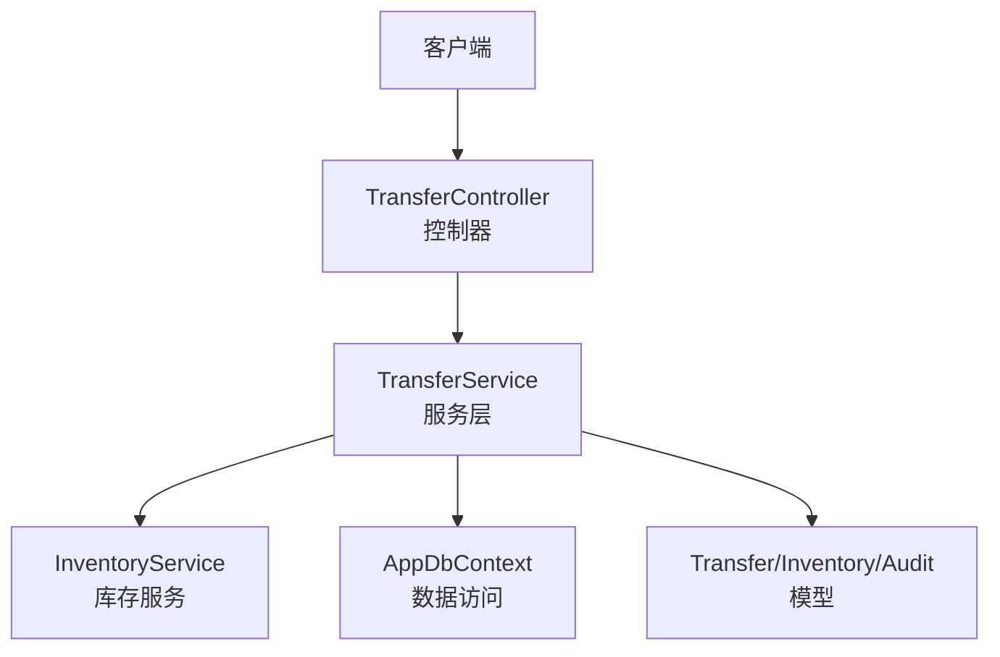
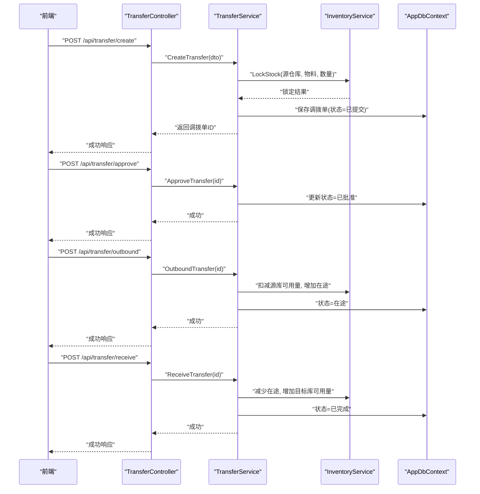
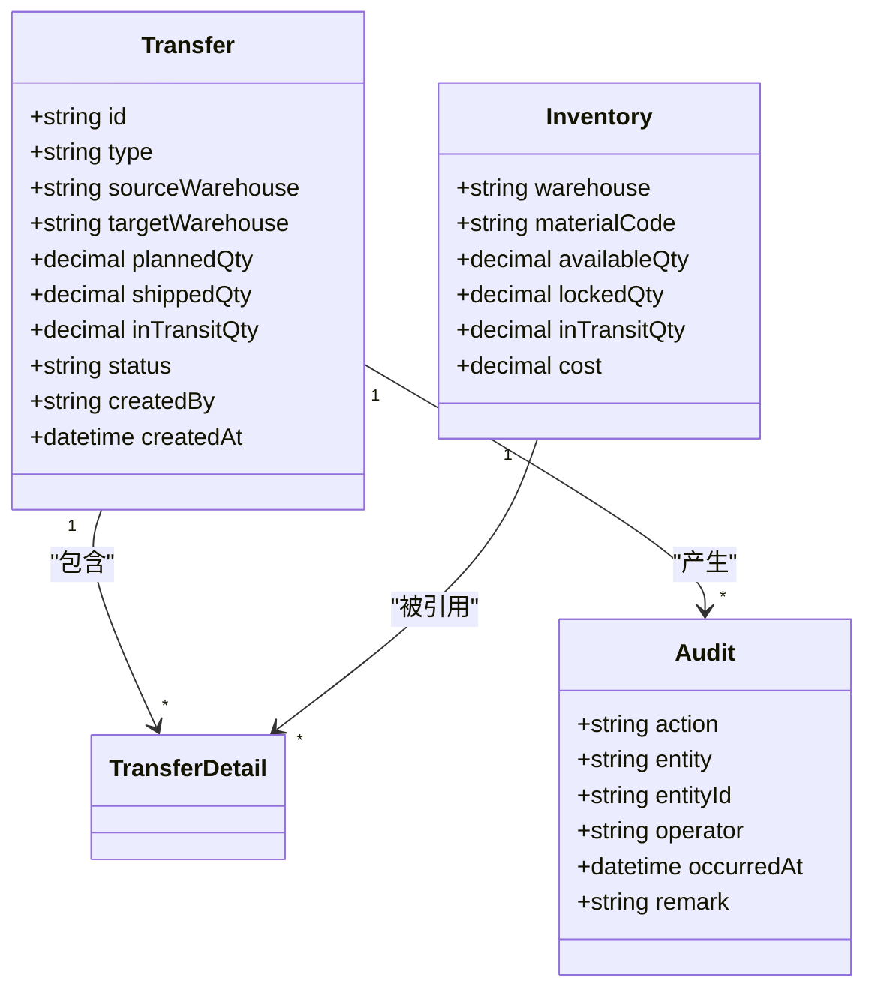
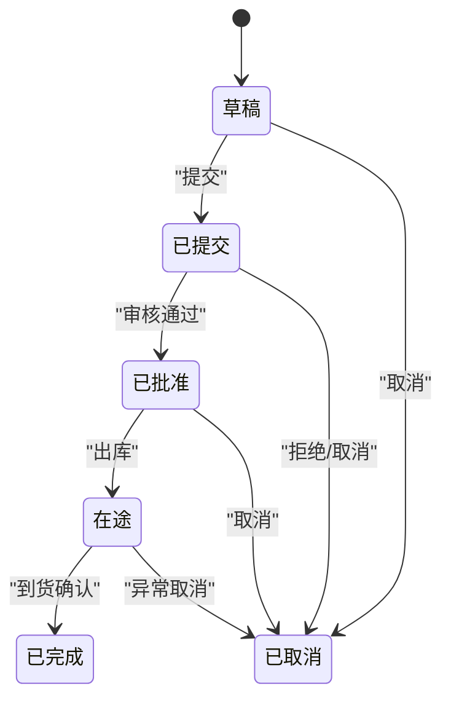
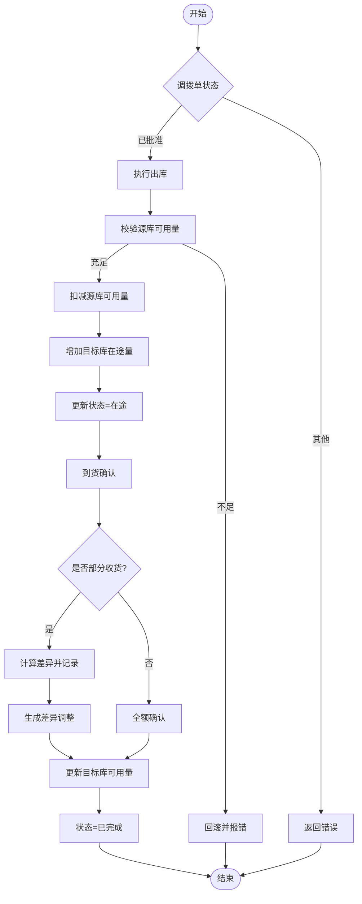
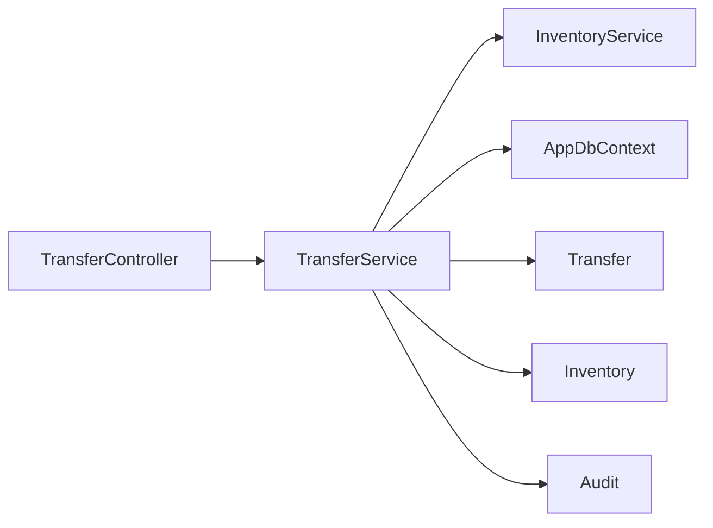

# 库存调拨接口

<cite>
**本文档引用的文件**   
- [TransferController.cs](file://dip-system/api/Controllers/TransferController.cs)
- [TransferService.cs](file://dip-system/api/Services/TransferService.cs)
- [Transfer.cs](file://dip-system/api/Models/Transfer.cs)
- [InventoryService.cs](file://dip-system/api/Services/InventoryService.cs)
- [Inventory.cs](file://dip-system/api/Models/Inventory.cs)
- [AppDbContext.cs](file://dip-system/api/Data/AppDbContext.cs)
- [ApiResponse.cs](file://dip-system/api/Models/ApiResponse.cs)
- [Audit.cs](file://dip-system/api/Models/Audit.cs)
</cite>

## 目录
1. [简介](#简介)
2. [项目结构](#项目结构)
3. [核心组件](#核心组件)
4. [架构总览](#架构总览)
5. [详细组件分析](#详细组件分析)
6. [依赖关系分析](#依赖关系分析)
7. [性能考虑](#性能考虑)
8. [故障排查指南](#故障排查指南)
9. [结论](#结论)
10. [附录](#附录)

## 简介
本文件为DIP系统“库存调拨”模块的API与实现文档，覆盖调拨申请、审核、执行的全流程接口说明。内容包含：
- 调拨单数据结构与字段含义
- 调拨类型（仓间调拨、批次调拨）及数量限制规则
- 调拨状态管理与审批流程
- 调拨库存锁定、在途库存管理、到货确认机制
- 调拨成本核算、差异处理与审计追踪
- API示例（创建、查询、执行）

## 项目结构
DIP系统的后端采用ASP.NET Core分层架构：
- Controllers层：对外暴露RESTful接口
- Services层：业务逻辑编排与事务控制
- Models层：数据模型定义（含实体与DTO）
- Data层：EF Core上下文与数据库映射

图表来源
- [TransferController.cs](file://dip-system/api/Controllers/TransferController.cs)
- [TransferService.cs](file://dip-system/api/Services/TransferService.cs)
- [InventoryService.cs](file://dip-system/api/Services/InventoryService.cs)
- [AppDbContext.cs](file://dip-system/api/Data/AppDbContext.cs)
- [Transfer.cs](file://dip-system/api/Models/Transfer.cs)
- [Inventory.cs](file://dip-system/api/Models/Inventory.cs)
- [Audit.cs](file://dip-system/api/Models/Audit.cs)

章节来源
- [TransferController.cs](file://dip-system/api/Controllers/TransferController.cs)
- [TransferService.cs](file://dip-system/api/Services/TransferService.cs)
- [InventoryService.cs](file://dip-system/api/Services/InventoryService.cs)
- [AppDbContext.cs](file://dip-system/api/Data/AppDbContext.cs)

## 核心组件
- TransferController：提供调拨相关HTTP端点，负责参数校验、权限检查、调用服务层并返回统一响应。
- TransferService：实现调拨业务编排，包括创建调拨单、审核、出库、在途、到货确认、关闭等状态流转；协调库存锁定与释放、在途库存更新、成本核算与差异处理、审计记录。
- InventoryService：封装库存读写、可用量计算、锁定/解锁、在途增减等原子操作。
- 数据模型：
  - Transfer：调拨单主表与明细项
  - Inventory：库存快照与在途库存
  - Audit：审计日志

章节来源
- [TransferController.cs](file://dip-system/api/Controllers/TransferController.cs)
- [TransferService.cs](file://dip-system/api/Services/TransferService.cs)
- [InventoryService.cs](file://dip-system/api/Services/InventoryService.cs)
- [Transfer.cs](file://dip-system/api/Models/Transfer.cs)
- [Inventory.cs](file://dip-system/api/Models/Inventory.cs)
- [Audit.cs](file://dip-system/api/Models/Audit.cs)

## 架构总览
调拨流程从前端发起请求到控制器，控制器委托服务层完成业务编排，服务层通过库存服务与数据上下文完成数据一致性操作，并写入审计日志。

图表来源
- [TransferController.cs](file://dip-system/api/Controllers/TransferController.cs)
- [TransferService.cs](file://dip-system/api/Services/TransferService.cs)
- [InventoryService.cs](file://dip-system/api/Services/InventoryService.cs)
- [AppDbContext.cs](file://dip-system/api/Data/AppDbContext.cs)

## 详细组件分析

### 数据模型与关系
- 调拨单（Transfer）
  - 主键：调拨单号
  - 关键字段：调拨类型（仓间调拨/批次调拨）、来源仓库、目标仓库、物料编码、计划数量、实发数量、在途数量、状态、创建人、时间戳
  - 明细：物料行（批次、单位、单价、金额等）
- 库存（Inventory）
  - 仓库+物料维度
  - 字段：可用量、锁定量、在途量、批次信息、成本
- 审计（Audit）
  - 记录关键操作：创建、审核、出库、到货、关闭、异常处理

图表来源
- [Transfer.cs](file://dip-system/api/Models/Transfer.cs)
- [Inventory.cs](file://dip-system/api/Models/Inventory.cs)
- [Audit.cs](file://dip-system/api/Models/Audit.cs)

章节来源
- [Transfer.cs](file://dip-system/api/Models/Transfer.cs)
- [Inventory.cs](file://dip-system/api/Models/Inventory.cs)
- [Audit.cs](file://dip-system/api/Models/Audit.cs)

### 调拨类型与数量限制
- 调拨类型
  - 仓间调拨：同一物料在不同仓库间的转移
  - 批次调拨：指定批次的物料转移，用于批次追溯
- 数量限制
  - 计划数量不得超过源仓库可用量（扣除锁定量后）
  - 批次调拨时，计划数量不得超过该批次可用量
  - 实发数量不得大于计划数量，且需满足最小包装/整箱规则（如适用）
  - 在途数量累计不得超过计划数量

章节来源
- [TransferService.cs](file://dip-system/api/Services/TransferService.cs)
- [InventoryService.cs](file://dip-system/api/Services/InventoryService.cs)

### 状态管理与审批流程
- 状态机
  - 草稿：创建后未提交
  - 已提交：等待审核
  - 已批准：允许出库
  - 在途：已出库，目标库尚未收货
  - 已完成：目标库已收货确认
  - 已取消：流程终止
- 审批流程
  - 创建→提交→审核→出库→到货确认→完成
  - 任一环节失败回滚并记录审计

图表来源
- [TransferService.cs](file://dip-system/api/Services/TransferService.cs)

章节来源
- [TransferService.cs](file://dip-system/api/Services/TransferService.cs)

### 库存锁定、在途库存与到货确认
- 库存锁定
  - 创建调拨单并提交后，对源仓库相应物料的可用量进行锁定，防止并发超卖
  - 锁定量随调拨单生命周期管理（批准后生效，取消则释放）
- 在途库存
  - 出库成功后，源库可用量扣减，目标库在途量增加
  - 到货确认后，目标库在途量扣减，可用量增加
- 到货确认
  - 支持部分收货与差异处理（短装、破损、溢装）
  - 差异生成调整单或备注，影响成本与库存

图表来源
- [TransferService.cs](file://dip-system/api/Services/TransferService.cs)
- [InventoryService.cs](file://dip-system/api/Services/InventoryService.cs)

章节来源
- [TransferService.cs](file://dip-system/api/Services/TransferService.cs)
- [InventoryService.cs](file://dip-system/api/Services/InventoryService.cs)

### 成本核算与差异处理
- 成本核算
  - 出库按移动加权平均或批次成本计价
  - 到货确认时根据实际数量与单价重新计算入库成本
- 差异处理
  - 短装：目标库按实收数量入账，差额计入损耗或差异科目
  - 溢装：超出计划数量的部分按采购价或标准价入账，并记录差异
  - 破损：单独记录报废或退货流程

章节来源
- [TransferService.cs](file://dip-system/api/Services/TransferService.cs)

### 审计追踪
- 审计事件
  - 创建、提交、审核、出库、到货、关闭、取消、异常
- 审计内容
  - 操作人、时间、实体ID、动作、备注
- 用途
  - 合规性、可追溯、问题定位

章节来源
- [Audit.cs](file://dip-system/api/Models/Audit.cs)
- [TransferService.cs](file://dip-system/api/Services/TransferService.cs)

### API接口规范与示例
- 通用响应格式
  - 使用统一响应体封装成功/失败信息与数据
- 主要端点
  - 创建调拨单：POST /api/transfer/create
    - 输入：调拨类型、源仓库、目标仓库、物料明细（编码、计划数量、批次等）
    - 输出：调拨单ID、状态
  - 提交调拨单：POST /api/transfer/submit
    - 输入：调拨单ID
    - 输出：状态=已提交
  - 审核调拨单：POST /api/transfer/approve
    - 输入：调拨单ID、审核意见
    - 输出：状态=已批准
  - 执行出库：POST /api/transfer/outbound
    - 输入：调拨单ID、实发数量（支持分批）
    - 输出：状态=在途
  - 到货确认：POST /api/transfer/receive
    - 输入：调拨单ID、实收数量、差异说明
    - 输出：状态=已完成
  - 查询调拨单：GET /api/transfer/{id}
    - 输出：调拨单详情、明细、状态历史
  - 列表查询：GET /api/transfer/list
    - 参数：仓库、物料、状态、时间范围、分页
- 错误码与异常
  - 参数校验失败、库存不足、状态非法、并发冲突、网络超时等

章节来源
- [TransferController.cs](file://dip-system/api/Controllers/TransferController.cs)
- [ApiResponse.cs](file://dip-system/api/Models/ApiResponse.cs)

## 依赖关系分析
- 控制器与服务层解耦，便于扩展与维护
- 服务层依赖库存服务与数据上下文，保证事务一致性与业务规则
- 模型之间通过外键与业务约束关联，确保数据完整性

图表来源
- [TransferController.cs](file://dip-system/api/Controllers/TransferController.cs)
- [TransferService.cs](file://dip-system/api/Services/TransferService.cs)
- [InventoryService.cs](file://dip-system/api/Services/InventoryService.cs)
- [AppDbContext.cs](file://dip-system/api/Data/AppDbContext.cs)
- [Transfer.cs](file://dip-system/api/Models/Transfer.cs)
- [Inventory.cs](file://dip-system/api/Models/Inventory.cs)
- [Audit.cs](file://dip-system/api/Models/Audit.cs)

章节来源
- [TransferController.cs](file://dip-system/api/Controllers/TransferController.cs)
- [TransferService.cs](file://dip-system/api/Services/TransferService.cs)
- [InventoryService.cs](file://dip-system/api/Services/InventoryService.cs)
- [AppDbContext.cs](file://dip-system/api/Data/AppDbContext.cs)

## 性能考虑
- 并发控制
  - 使用乐观锁或分布式锁避免超卖与重复提交
- 批量操作
  - 大批量调拨明细建议分批提交，降低事务长度
- 索引优化
  - 对仓库、物料、状态、时间戳建立合适索引
- 缓存策略
  - 对常用查询（如物料主数据、仓库字典）进行缓存
- 异步处理
  - 审计记录、报表统计可异步落库

[本节为通用指导，不直接分析具体文件]

## 故障排查指南
- 常见问题
  - 库存不足：检查可用量与锁定量，确认是否有未完成的调拨单占用
  - 状态非法：核对当前状态与期望操作的合法性
  - 批次不一致：批次调拨时需确保批次存在且可用量足够
  - 差异过大：检查实发/实收数量与计划数量差异原因
- 排查步骤
  - 查看调拨单状态历史与审计日志
  - 核对库存快照与在途库存变化
  - 检查并发冲突与事务回滚日志
- 恢复措施
  - 取消异常调拨单并释放锁定
  - 生成差异调整单修正库存与成本

章节来源
- [TransferService.cs](file://dip-system/api/Services/TransferService.cs)
- [Audit.cs](file://dip-system/api/Models/Audit.cs)

## 结论
本模块通过清晰的职责划分与严谨的状态机设计，实现了库存调拨的全流程闭环管理。结合库存锁定、在途库存、差异处理与审计追踪，保障了业务的准确性与可追溯性。建议在后续迭代中加强并发控制、性能优化与监控告警能力。

[本节为总结，不直接分析具体文件]

## 附录
- 术语
  - 仓间调拨：不同仓库之间的物料转移
  - 批次调拨：指定批次的物料转移
  - 在途库存：已出库但尚未到货的库存
  - 差异处理：实发/实收与计划数量的偏差处理
- 最佳实践
  - 严格校验输入参数与业务规则
  - 保持事务边界清晰，避免长事务
  - 完善审计日志，便于问题定位与合规审计

[本节为补充说明，不直接分析具体文件]