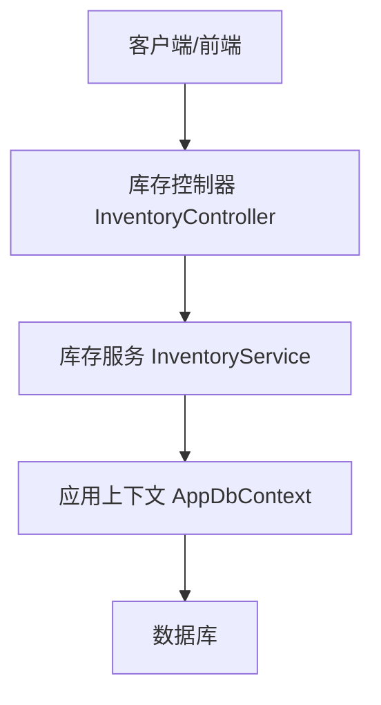
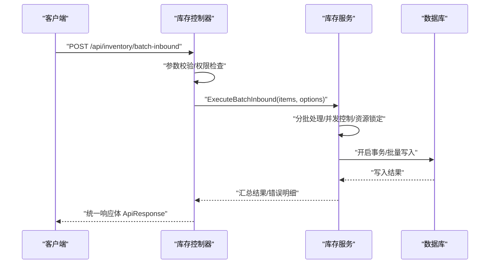
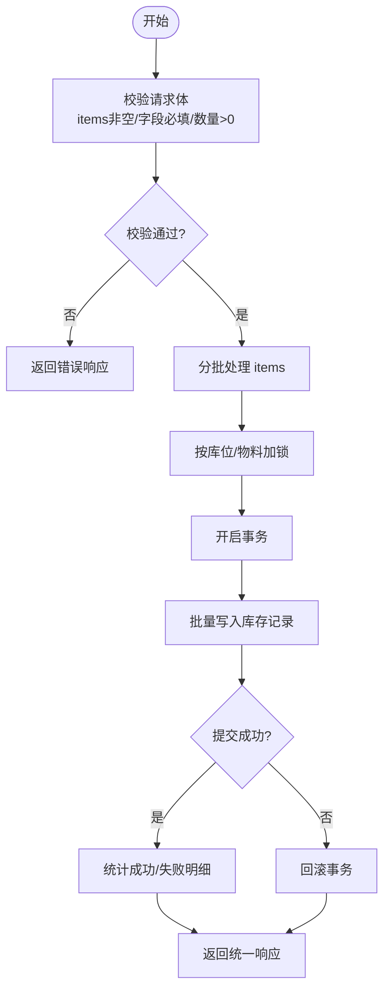
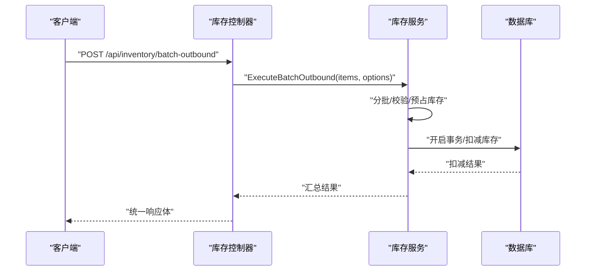
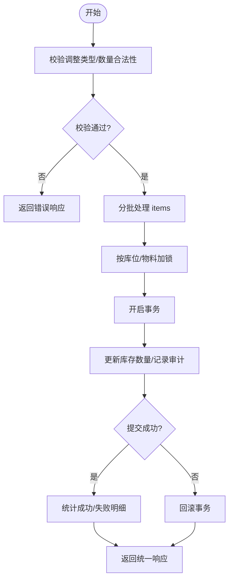
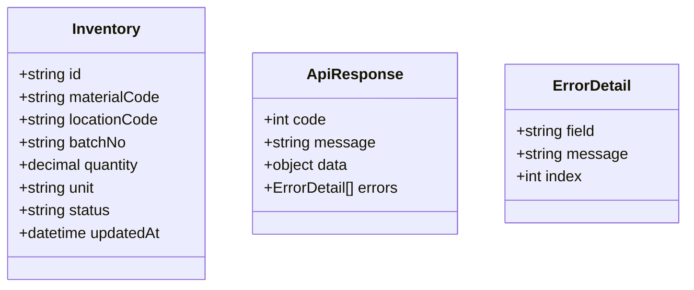
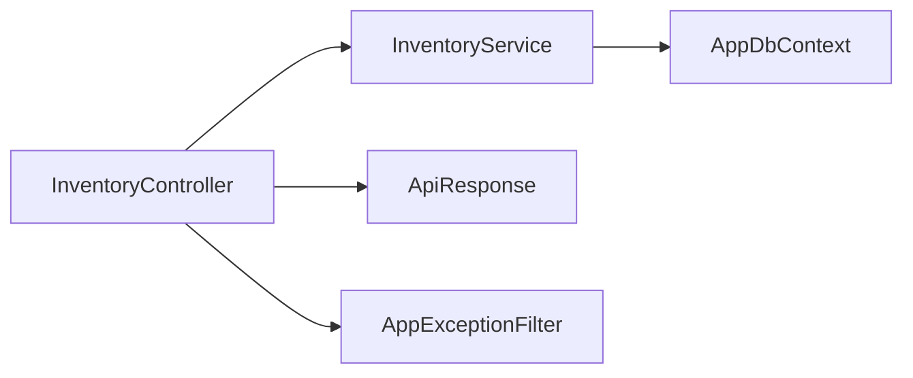

# 批量操作接口

<cite>
**本文引用的文件**   
- [InventoryController.cs](file://dip-system/api/Controllers/InventoryController.cs)
- [InventoryService.cs](file://dip-system/api/Services/InventoryService.cs)
- [Inventory.cs](file://dip-system/api/Models/Inventory.cs)
- [ApiResponse.cs](file://dip-system/api/Models/ApiResponse.cs)
- [AppExceptionFilter.cs](file://dip-system/api/Controllers/AppExceptionFilter.cs)
- [AppDbContext.cs](file://dip-system/api/Data/AppDbContext.cs)
</cite>

## 目录
1. [简介](#简介)
2. [项目结构](#项目结构)
3. [核心组件](#核心组件)
4. [架构总览](#架构总览)
5. [详细组件分析](#详细组件分析)
6. [依赖关系分析](#依赖关系分析)
7. [性能考虑](#性能考虑)
8. [故障排查指南](#故障排查指南)
9. [结论](#结论)
10. [附录](#附录)

## 简介
本文件为 DIP 系统库存模块的“批量操作”API 提供完整文档，覆盖批量入库、批量出库、批量调整三类能力。内容包含：
- 接口规范与数据格式（请求/响应）
- 事务处理与错误回滚机制
- 并发控制与资源锁定策略
- 分批处理、进度反馈与超时设计
- 批量导入导出与 Excel 模板建议
- 大数据量处理最佳实践、性能监控与重试机制

说明：本文档基于仓库中库存相关控制器与服务实现进行归纳总结，并结合通用企业级后端实践给出可落地的设计与优化建议。

## 项目结构
DIP 系统采用典型的分层架构：
- API 层：Controllers 暴露 HTTP 接口
- 服务层：Services 封装业务逻辑与事务边界
- 数据访问层：通过 EF Core DbContext 访问数据库
- 模型层：实体与统一响应体定义

图表来源
- [InventoryController.cs](file://dip-system/api/Controllers/InventoryController.cs)
- [InventoryService.cs](file://dip-system/api/Services/InventoryService.cs)
- [AppDbContext.cs](file://dip-system/api/Data/AppDbContext.cs)

章节来源
- [InventoryController.cs](file://dip-system/api/Controllers/InventoryController.cs)
- [InventoryService.cs](file://dip-system/api/Services/InventoryService.cs)
- [AppDbContext.cs](file://dip-system/api/Data/AppDbContext.cs)

## 核心组件
- 库存控制器：负责接收批量请求、参数校验、调用服务并返回统一响应
- 库存服务：封装批量入库、批量出库、批量调整的业务流程，管理事务与并发锁
- 库存实体：描述库存主数据及数量字段
- 统一响应体：标准化成功/失败响应结构
- 异常过滤器：全局异常捕获与错误码映射

章节来源
- [InventoryController.cs](file://dip-system/api/Controllers/InventoryController.cs)
- [InventoryService.cs](file://dip-system/api/Services/InventoryService.cs)
- [Inventory.cs](file://dip-system/api/Models/Inventory.cs)
- [ApiResponse.cs](file://dip-system/api/Models/ApiResponse.cs)
- [AppExceptionFilter.cs](file://dip-system/api/Controllers/AppExceptionFilter.cs)

## 架构总览
批量操作的典型调用链如下：
- 客户端提交批量请求（JSON 或文件上传）
- 控制器完成基础校验后进入服务层
- 服务层执行分批处理、加锁、事务提交/回滚
- 数据库持久化变更并返回结果

图表来源
- [InventoryController.cs](file://dip-system/api/Controllers/InventoryController.cs)
- [InventoryService.cs](file://dip-system/api/Services/InventoryService.cs)
- [AppDbContext.cs](file://dip-system/api/Data/AppDbContext.cs)

## 详细组件分析

### 批量入库接口
- 接口路径：POST /api/inventory/batch-inbound
- 功能：一次性将多条物料入库到指定库位/批次
- 请求体要点：
  - items：数组，每项包含物料编码、库位、批次、数量、单位等
  - options：批次大小、是否幂等、是否跳过校验等
- 响应体：统一 ApiResponse，包含成功数、失败数、失败明细列表

图表来源
- [InventoryController.cs](file://dip-system/api/Controllers/InventoryController.cs)
- [InventoryService.cs](file://dip-system/api/Services/InventoryService.cs)
- [AppDbContext.cs](file://dip-system/api/Data/AppDbContext.cs)

章节来源
- [InventoryController.cs](file://dip-system/api/Controllers/InventoryController.cs)
- [InventoryService.cs](file://dip-system/api/Services/InventoryService.cs)

### 批量出库接口
- 接口路径：POST /api/inventory/batch-outbound
- 功能：一次性从库存扣减多条物料的出库数量
- 请求体要点：
  - items：物料编码、库位、批次、出库数量、出库单号等
  - options：批次大小、是否预占库存、是否允许负库存等
- 响应体：统一 ApiResponse，含成功/失败明细

图表来源
- [InventoryController.cs](file://dip-system/api/Controllers/InventoryController.cs)
- [InventoryService.cs](file://dip-system/api/Services/InventoryService.cs)
- [AppDbContext.cs](file://dip-system/api/Data/AppDbContext.cs)

章节来源
- [InventoryController.cs](file://dip-system/api/Controllers/InventoryController.cs)
- [InventoryService.cs](file://dip-system/api/Services/InventoryService.cs)

### 批量调整接口
- 接口路径：POST /api/inventory/batch-adjust
- 功能：对多条库存记录进行数量调整（盘盈/盘亏/调拨等）
- 请求体要点：
  - items：物料编码、库位、批次、调整类型、调整数量、原因等
  - options：批次大小、是否强制调整、审计标记等
- 响应体：统一 ApiResponse，含成功/失败明细

图表来源
- [InventoryController.cs](file://dip-system/api/Controllers/InventoryController.cs)
- [InventoryService.cs](file://dip-system/api/Services/InventoryService.cs)
- [AppDbContext.cs](file://dip-system/api/Data/AppDbContext.cs)

章节来源
- [InventoryController.cs](file://dip-system/api/Controllers/InventoryController.cs)
- [InventoryService.cs](file://dip-system/api/Services/InventoryService.cs)

### 数据模型与统一响应
- 库存实体：包含物料、库位、批次、数量、状态等字段
- 统一响应体：包含 code、message、data、errors 等字段，用于标准化返回

图表来源
- [Inventory.cs](file://dip-system/api/Models/Inventory.cs)
- [ApiResponse.cs](file://dip-system/api/Models/ApiResponse.cs)

章节来源
- [Inventory.cs](file://dip-system/api/Models/Inventory.cs)
- [ApiResponse.cs](file://dip-system/api/Models/ApiResponse.cs)

## 依赖关系分析
- 控制器依赖服务：参数校验、权限检查后委托服务处理
- 服务依赖数据上下文：使用 EF Core 进行事务与批量操作
- 异常过滤器：捕获未处理异常并转换为统一错误响应

图表来源
- [InventoryController.cs](file://dip-system/api/Controllers/InventoryController.cs)
- [InventoryService.cs](file://dip-system/api/Services/InventoryService.cs)
- [AppDbContext.cs](file://dip-system/api/Data/AppDbContext.cs)
- [ApiResponse.cs](file://dip-system/api/Models/ApiResponse.cs)
- [AppExceptionFilter.cs](file://dip-system/api/Controllers/AppExceptionFilter.cs)

章节来源
- [InventoryController.cs](file://dip-system/api/Controllers/InventoryController.cs)
- [InventoryService.cs](file://dip-system/api/Services/InventoryService.cs)
- [AppDbContext.cs](file://dip-system/api/Data/AppDbContext.cs)
- [ApiResponse.cs](file://dip-system/api/Models/ApiResponse.cs)
- [AppExceptionFilter.cs](file://dip-system/api/Controllers/AppExceptionFilter.cs)

## 性能考虑
- 分批处理
  - 合理设置批次大小（如 500~2000），避免单次事务过大导致锁竞争与内存压力
  - 使用批量插入/更新（EF Core 批量扩展或原生 SQL）减少往返开销
- 并发控制与资源锁定
  - 按库位/物料维度加锁，避免热点行冲突
  - 使用乐观锁（版本号）或悲观锁（SELECT FOR UPDATE）保障一致性
- 进度反馈
  - 长耗时任务采用异步处理（后台作业队列），返回任务 ID 供前端轮询进度
  - 支持分片回调或 SSE/WebSocket 推送进度
- 大数据量处理
  - 流式读取/写入，避免一次性加载全部数据到内存
  - 使用只读索引与合适的查询条件，减少全表扫描
- 性能监控
  - 记录关键指标：批次大小、处理时长、成功率、失败率、锁等待时间
  - 使用 APM 工具追踪慢查询与热点路径

[本节为通用指导，不直接分析具体文件]

## 故障排查指南
- 常见错误
  - 参数校验失败：检查必填字段、数据类型、范围约束
  - 库存不足：核对可用库存、预占状态、并发扣减
  - 锁超时：检查热点库位/物料，优化批次大小与并发度
  - 事务回滚：查看数据库日志与异常堆栈，定位约束冲突或死锁
- 调试步骤
  - 启用详细日志，记录每批处理的输入输出
  - 使用数据库 EXPLAIN 分析慢查询
  - 通过统一响应体的 errors 字段定位失败项索引与原因
- 重试机制
  - 对幂等操作（如入库）支持自动重试，限制最大重试次数与退避策略
  - 对非幂等操作（如出库）需由客户端控制重试，避免重复扣减

章节来源
- [AppExceptionFilter.cs](file://dip-system/api/Controllers/AppExceptionFilter.cs)
- [ApiResponse.cs](file://dip-system/api/Models/ApiResponse.cs)

## 结论
本文件系统化梳理了 DIP 系统库存批量操作的接口规范、事务与回滚、并发与锁、分批与进度、导入导出与验证、以及大数据量处理与监控。建议在实施时结合业务规模选择合适的批次大小与并发策略，并通过完善的日志与监控保障稳定性与可观测性。

[本节为总结性内容，不直接分析具体文件]

## 附录

### 接口规范示例（文本描述）
- 批量入库
  - 方法：POST
  - 路径：/api/inventory/batch-inbound
  - 请求体：{ items:[...], options:{ batchSize, idempotentKey, skipValidation } }
  - 响应体：ApiResponse{ code, message, data:{ successCount, failCount, details:[...] }, errors:[...] }
- 批量出库
  - 方法：POST
  - 路径：/api/inventory/batch-outbound
  - 请求体：{ items:[...], options:{ batchSize, preReserve, allowNegative } }
  - 响应体：同统一响应体
- 批量调整
  - 方法：POST
  - 路径：/api/inventory/batch-adjust
  - 请求体：{ items:[...], options:{ batchSize, forceAdjust, auditReason } }
  - 响应体：同统一响应体

[本节为概念性说明，不直接分析具体文件]

### 批量导入导出与 Excel 模板建议
- 导入
  - 支持 multipart/form-data 上传 Excel
  - 服务端解析为结构化数据，进行字段校验与业务规则校验
  - 失败行返回明细（行号、字段、错误信息）
- 导出
  - 根据筛选条件生成 Excel，支持分页下载
  - 大文件采用流式生成，避免内存溢出
- 模板
  - 提供标准模板（含必填字段、枚举值、格式提示）
  - 模板版本化管理，兼容历史数据

[本节为概念性说明，不直接分析具体文件]

### 事务一致性与并发控制
- 事务边界
  - 每个批次一个事务，保证原子性
  - 失败批次整体回滚，不影响其他批次
- 并发控制
  - 热点行加锁（库位+物料）
  - 使用唯一键与约束防止重复入库
- 幂等性
  - 通过幂等键（idempotentKey）去重，避免重复提交

[本节为概念性说明，不直接分析具体文件]

### 性能监控与错误重试
- 监控指标
  - 批次处理时长、吞吐量、错误率、锁等待时间
  - 数据库连接池、CPU/内存使用率
- 重试策略
  - 指数退避 + 最大重试次数
  - 区分可重试与不可重试错误

[本节为概念性说明，不直接分析具体文件]