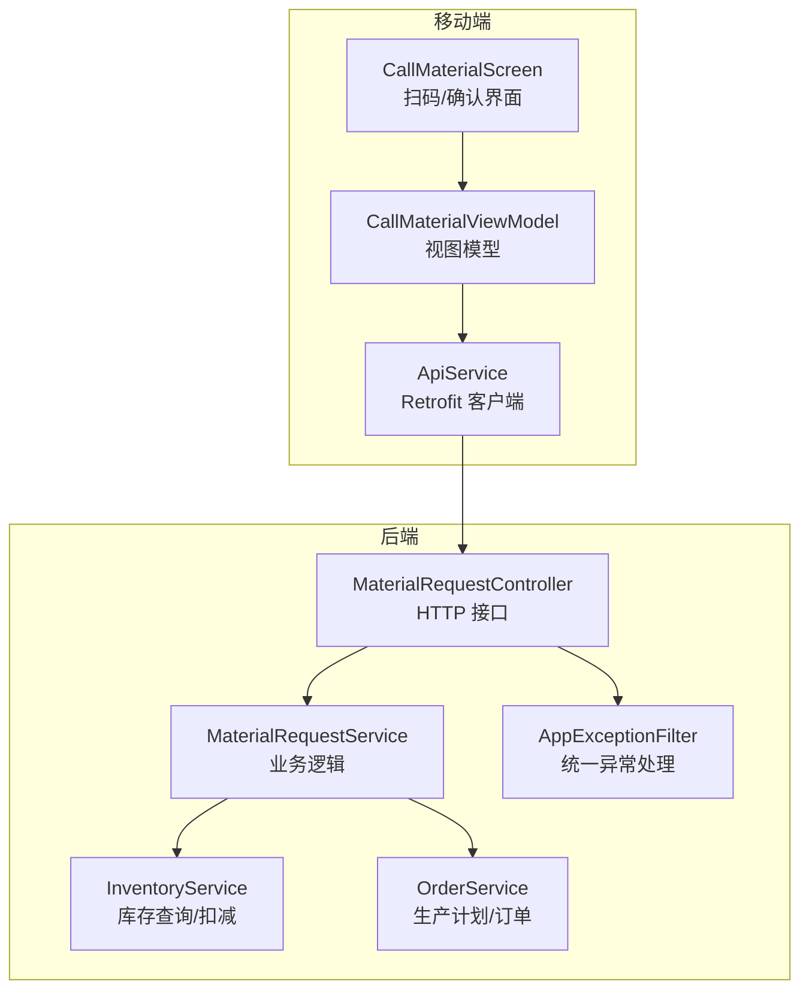
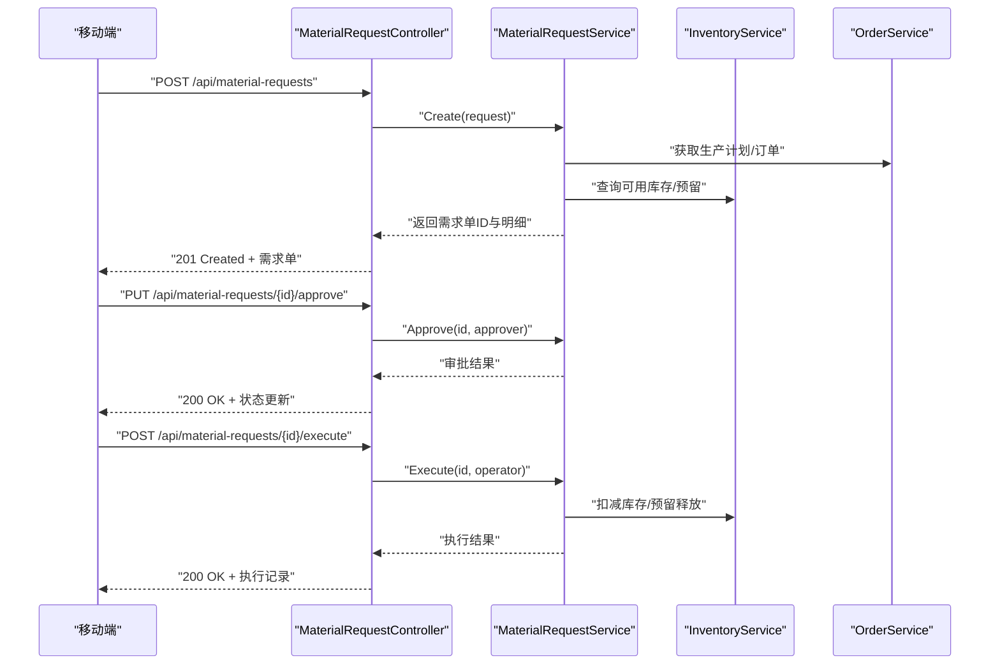
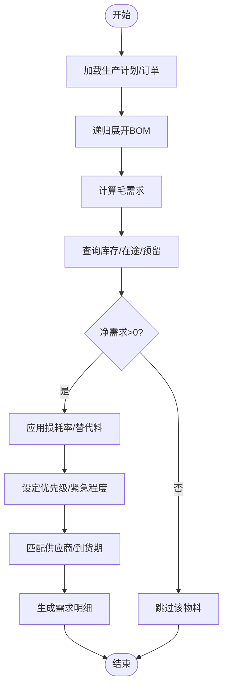
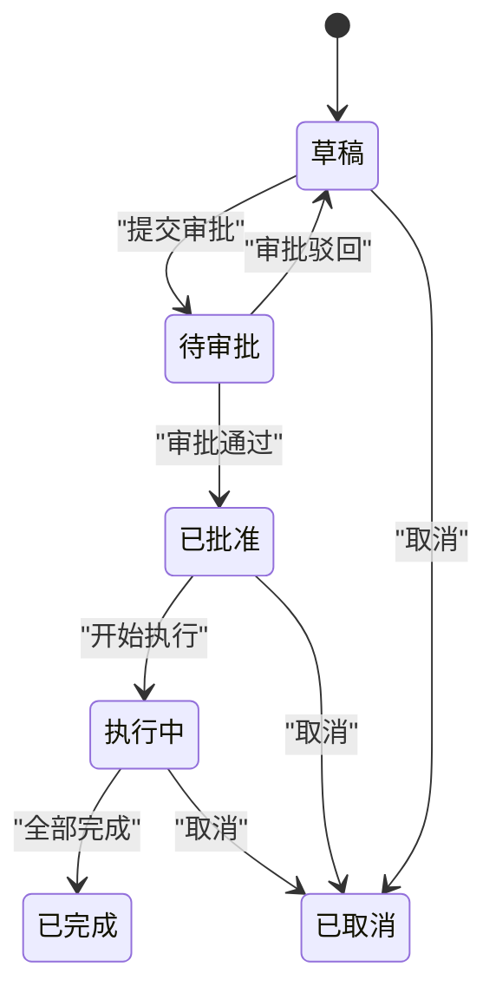
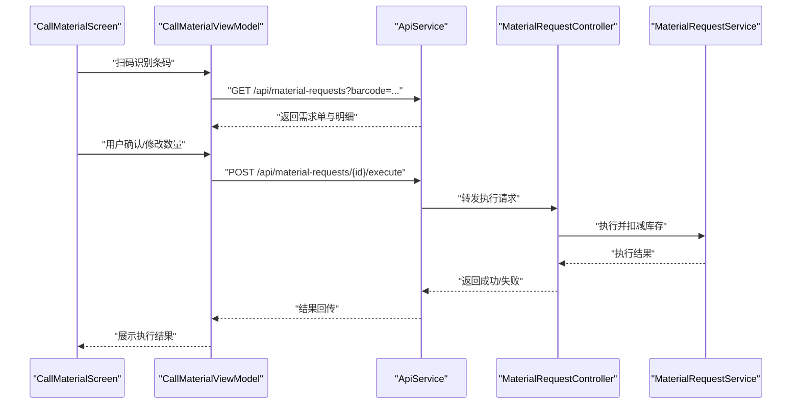
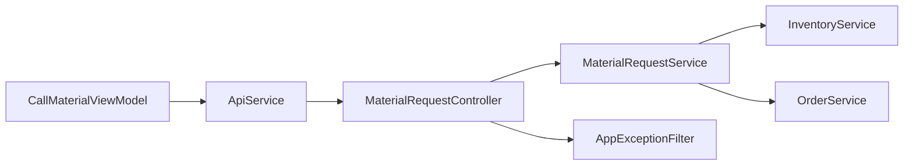

# 物料需求接口

<cite>
**本文引用的文件**   
- [MaterialRequestController.cs](file://dip-system/api/Controllers/MaterialRequestController.cs)
- [MaterialRequestService.cs](file://dip-system/api/Services/MaterialRequestService.cs)
- [MaterialRequest.cs](file://dip-system/api/Models/MaterialRequest.cs)
- [InventoryService.cs](file://dip-system/api/Services/InventoryService.cs)
- [OrderService.cs](file://dip-system/api/Services/OrderService.cs)
- [AppExceptionFilter.cs](file://dip-system/api/Controllers/AppExceptionFilter.cs)
- [ApiService.kt](file://mobile-android/app/src/main/java/com/dip/material/data/network/ApiService.kt)
- [CallMaterialViewModel.kt](file://mobile-android/app/src/main/java/com/dip/material/ui/callmaterial/CallMaterialViewModel.kt)
- [CallMaterialScreen.kt](file://mobile-android/app/src/main/java/com/dip/material/ui/callmaterial/CallMaterialScreen.kt)
</cite>

## 目录
1. [简介](#简介)
2. [项目结构](#项目结构)
3. [核心组件](#核心组件)
4. [架构总览](#架构总览)
5. [详细组件分析](#详细组件分析)
6. [依赖关系分析](#依赖关系分析)
7. [性能考虑](#性能考虑)
8. [故障排查指南](#故障排查指南)
9. [结论](#结论)
10. [附录](#附录)

## 简介
本文件为DIP系统“物料需求”模块的API与业务文档，覆盖物料需求的创建、查询、审批、执行等接口；详细说明数据模型、状态流转、审批流程；阐述需求计算逻辑、BOM解析、缺料分析；说明优先级、紧急程度、供应商匹配机制；提供业务流程示例、异常处理示例、批量操作示例；并给出与生产计划、库存系统的集成方式及移动端需求确认、扫码执行的特殊接口。

## 项目结构
- 后端（C#）：控制器层暴露HTTP API，服务层实现业务逻辑，模型层定义数据实体，异常过滤器统一错误响应。
- 移动端（Android/Kotlin）：封装网络请求、视图模型与界面交互，支持扫码执行与需求确认。

图表来源
- [MaterialRequestController.cs](file://dip-system/api/Controllers/MaterialRequestController.cs)
- [MaterialRequestService.cs](file://dip-system/api/Services/MaterialRequestService.cs)
- [InventoryService.cs](file://dip-system/api/Services/InventoryService.cs)
- [OrderService.cs](file://dip-system/api/Services/OrderService.cs)
- [AppExceptionFilter.cs](file://dip-system/api/Controllers/AppExceptionFilter.cs)
- [ApiService.kt](file://mobile-android/app/src/main/java/com/dip/material/data/network/ApiService.kt)
- [CallMaterialViewModel.kt](file://mobile-android/app/src/main/java/com/dip/material/ui/callmaterial/CallMaterialViewModel.kt)
- [CallMaterialScreen.kt](file://mobile-android/app/src/main/java/com/dip/material/ui/callmaterial/CallMaterialScreen.kt)

章节来源
- [MaterialRequestController.cs](file://dip-system/api/Controllers/MaterialRequestController.cs)
- [MaterialRequestService.cs](file://dip-system/api/Services/MaterialRequestService.cs)
- [MaterialRequest.cs](file://dip-system/api/Models/MaterialRequest.cs)
- [InventoryService.cs](file://dip-system/api/Services/InventoryService.cs)
- [OrderService.cs](file://dip-system/api/Services/OrderService.cs)
- [AppExceptionFilter.cs](file://dip-system/api/Controllers/AppExceptionFilter.cs)
- [ApiService.kt](file://mobile-android/app/src/main/java/com/dip/material/data/network/ApiService.kt)
- [CallMaterialViewModel.kt](file://mobile-android/app/src/main/java/com/dip/material/ui/callmaterial/CallMaterialViewModel.kt)
- [CallMaterialScreen.kt](file://mobile-android/app/src/main/java/com/dip/material/ui/callmaterial/CallMaterialScreen.kt)

## 核心组件
- 控制器（MaterialRequestController）：对外暴露RESTful接口，负责参数校验、路由分发、返回统一响应。
- 服务（MaterialRequestService）：实现物料需求的核心业务，包括需求计算、BOM展开、缺料分析、审批流、执行闭环。
- 模型（MaterialRequest）：定义物料需求单及其明细的数据结构与约束。
- 库存服务（InventoryService）：提供库存查询、可用量计算、预留与扣减能力。
- 订单服务（OrderService）：对接生产计划与订单，驱动需求生成与执行。
- 异常过滤器（AppExceptionFilter）：统一捕获异常并返回标准错误格式。

章节来源
- [MaterialRequestController.cs](file://dip-system/api/Controllers/MaterialRequestController.cs)
- [MaterialRequestService.cs](file://dip-system/api/Services/MaterialRequestService.cs)
- [MaterialRequest.cs](file://dip-system/api/Models/MaterialRequest.cs)
- [InventoryService.cs](file://dip-system/api/Services/InventoryService.cs)
- [OrderService.cs](file://dip-system/api/Services/OrderService.cs)
- [AppExceptionFilter.cs](file://dip-system/api/Controllers/AppExceptionFilter.cs)

## 架构总览
整体采用分层架构：控制器层仅做请求转发与校验，服务层承载业务编排，领域模型与外部系统通过服务解耦。移动端通过统一的API服务访问后端，支持扫码执行与需求确认。

图表来源
- [MaterialRequestController.cs](file://dip-system/api/Controllers/MaterialRequestController.cs)
- [MaterialRequestService.cs](file://dip-system/api/Services/MaterialRequestService.cs)
- [InventoryService.cs](file://dip-system/api/Services/InventoryService.cs)
- [OrderService.cs](file://dip-system/api/Services/OrderService.cs)

## 详细组件分析

### 数据模型与字段说明
- 物料需求单（MaterialRequest）
  - 主键：需求单号（唯一）
  - 关联：生产订单号、产品编码、批次号
  - 时间：创建时间、计划开始时间、计划结束时间、实际开始时间、实际结束时间
  - 状态：草稿、待审批、已批准、执行中、已完成、已取消
  - 优先级：低、中、高、紧急
  - 紧急程度：普通、加急、特急
  - 供应商：首选供应商、备选供应商列表
  - 备注：需求原因、变更说明
- 需求明细（MaterialRequestItem）
  - 物料编码、名称、规格
  - 需求量、已发数量、未发数量
  - BOM层级、父项物料编码
  - 单位、损耗率、替代料标识
  - 仓库/库位、到货期望时间

章节来源
- [MaterialRequest.cs](file://dip-system/api/Models/MaterialRequest.cs)

### 接口清单与规范
- 基础路径：/api/material-requests
- 通用请求头：Authorization（Bearer Token）、Content-Type（application/json）
- 通用响应体：包含code、message、data、traceId等字段

| 方法 | URL | 功能 | 主要请求参数 | 主要响应字段 |
|---|---|---|---|---|
| POST | /api/material-requests | 创建需求单 | 生产订单号、产品编码、计划时间、优先级、紧急程度、需求明细数组 | 需求单号、状态、明细列表、traceId |
| GET | /api/material-requests | 分页查询 | page、size、status、priority、productCode、dateRange | 列表、总数、页码信息 |
| GET | /api/material-requests/{id} | 详情查询 | 无 | 需求单、明细、审批记录、执行记录 |
| PUT | /api/material-requests/{id} | 更新需求单 | 可编辑字段（如计划时间、优先级、备注） | 更新后的需求单 |
| PUT | /api/material-requests/{id}/approve | 审批通过 | approver、comment | 新状态、审批记录 |
| PUT | /api/material-requests/{id}/reject | 审批驳回 | approver、comment | 新状态、审批记录 |
| POST | /api/material-requests/{id}/execute | 执行需求 | operator、warehouse、batchNo | 执行结果、库存变动 |
| POST | /api/material-requests/batch | 批量创建 | 多个需求单对象数组 | 成功/失败统计、错误明细 |
| POST | /api/material-requests/{id}/cancel | 取消需求单 | reason | 新状态、取消记录 |

章节来源
- [MaterialRequestController.cs](file://dip-system/api/Controllers/MaterialRequestController.cs)

### 需求计算逻辑与BOM解析
- 输入：生产订单、产品结构（BOM）、在制/在途库存、安全库存策略
- 步骤：
  1) 根据订单与工艺路线确定主件需求
  2) 递归展开BOM，计算各层级毛需求
  3) 结合现有库存、在途、预留量计算净需求
  4) 应用损耗率与替代料规则，生成需求明细
  5) 标记优先级与紧急程度（基于交期、库存缺口、订单等级）
- 输出：需求单及明细，含建议供应商与到货时间

图表来源
- [MaterialRequestService.cs](file://dip-system/api/Services/MaterialRequestService.cs)
- [OrderService.cs](file://dip-system/api/Services/OrderService.cs)
- [InventoryService.cs](file://dip-system/api/Services/InventoryService.cs)

章节来源
- [MaterialRequestService.cs](file://dip-system/api/Services/MaterialRequestService.cs)
- [OrderService.cs](file://dip-system/api/Services/OrderService.cs)
- [InventoryService.cs](file://dip-system/api/Services/InventoryService.cs)

### 缺料分析与预警
- 维度：按物料、按需求单、按产线/工站
- 指标：缺口数量、预计到货时间、影响订单、风险等级
- 动作：自动建议替代料、触发采购建议、推送预警消息

章节来源
- [MaterialRequestService.cs](file://dip-system/api/Services/MaterialRequestService.cs)
- [InventoryService.cs](file://dip-system/api/Services/InventoryService.cs)

### 审批流程与状态机
- 状态：草稿 → 待审批 → 已批准 → 执行中 → 已完成 / 已取消
- 角色：申请人、审批人、执行人
- 规则：
  - 金额/优先级阈值触发多级审批
  - 驳回需填写原因，退回修改后重新提交
  - 执行前校验库存与前置任务完成

图表来源
- [MaterialRequestService.cs](file://dip-system/api/Services/MaterialRequestService.cs)

章节来源
- [MaterialRequestService.cs](file://dip-system/api/Services/MaterialRequestService.cs)

### 供应商匹配机制
- 匹配依据：历史交期、质量评分、价格、距离、产能、协议条款
- 策略：首选供应商优先，备选按综合得分排序
- 输出：建议供应商、承诺到货时间、风险提示

章节来源
- [MaterialRequestService.cs](file://dip-system/api/Services/MaterialRequestService.cs)

### 移动端需求确认与扫码执行
- 需求确认：移动端拉取待确认需求，扫码核对物料与数量，提交确认
- 扫码执行：扫描条码或二维码，直接调用执行接口，记录操作人与时间戳
- 离线缓存：弱网环境下本地缓存，恢复后同步

图表来源
- [CallMaterialScreen.kt](file://mobile-android/app/src/main/java/com/dip/material/ui/callmaterial/CallMaterialScreen.kt)
- [CallMaterialViewModel.kt](file://mobile-android/app/src/main/java/com/dip/material/ui/callmaterial/CallMaterialViewModel.kt)
- [ApiService.kt](file://mobile-android/app/src/main/java/com/dip/material/data/network/ApiService.kt)
- [MaterialRequestController.cs](file://dip-system/api/Controllers/MaterialRequestController.cs)
- [MaterialRequestService.cs](file://dip-system/api/Services/MaterialRequestService.cs)

章节来源
- [CallMaterialScreen.kt](file://mobile-android/app/src/main/java/com/dip/material/ui/callmaterial/CallMaterialScreen.kt)
- [CallMaterialViewModel.kt](file://mobile-android/app/src/main/java/com/dip/material/ui/callmaterial/CallMaterialViewModel.kt)
- [ApiService.kt](file://mobile-android/app/src/main/java/com/dip/material/data/network/ApiService.kt)

### 业务流程示例
- 创建需求单：从生产计划自动生成需求，校验BOM与库存，生成需求单并进入待审批
- 审批通过：审批人审核优先级与紧急程度，通过后进入执行阶段
- 执行与扣减：现场扫码执行，系统扣减库存并记录执行轨迹
- 完成与归档：全部明细完成后归档，生成报表与分析

章节来源
- [MaterialRequestController.cs](file://dip-system/api/Controllers/MaterialRequestController.cs)
- [MaterialRequestService.cs](file://dip-system/api/Services/MaterialRequestService.cs)

### 异常处理示例
- 参数校验失败：返回400，包含字段级错误信息
- 权限不足：返回403，提示角色或资源权限缺失
- 库存不足：返回422，列出缺口物料与建议措施
- 并发冲突：返回409，提示重试或刷新数据
- 系统异常：返回500，附带traceId便于追踪

章节来源
- [AppExceptionFilter.cs](file://dip-system/api/Controllers/AppExceptionFilter.cs)

### 批量操作示例
- 批量创建：传入多个需求单对象，服务端逐条处理并汇总成功/失败统计
- 批量审批：对多张需求单进行统一审批，返回每条的处理结果
- 批量执行：按仓库/批次批量执行，支持事务回滚与部分成功

章节来源
- [MaterialRequestController.cs](file://dip-system/api/Controllers/MaterialRequestController.cs)
- [MaterialRequestService.cs](file://dip-system/api/Services/MaterialRequestService.cs)

### 与生产计划、库存系统的集成
- 生产计划：通过订单服务读取计划与排程，驱动需求生成与优先级调整
- 库存系统：实时查询可用量、在途、预留，执行时扣减并生成出入库记录
- 事件订阅：需求状态变更、执行完成等事件通知下游系统（WMS/ERP）

章节来源
- [OrderService.cs](file://dip-system/api/Services/OrderService.cs)
- [InventoryService.cs](file://dip-system/api/Services/InventoryService.cs)
- [MaterialRequestService.cs](file://dip-system/api/Services/MaterialRequestService.cs)

## 依赖关系分析
- 控制器依赖服务层，服务层依赖库存与订单服务
- 移动端依赖API服务，通过Retrofit发起HTTP请求
- 异常过滤器拦截所有控制器异常，统一格式化响应

图表来源
- [CallMaterialViewModel.kt](file://mobile-android/app/src/main/java/com/dip/material/ui/callmaterial/CallMaterialViewModel.kt)
- [ApiService.kt](file://mobile-android/app/src/main/java/com/dip/material/data/network/ApiService.kt)
- [MaterialRequestController.cs](file://dip-system/api/Controllers/MaterialRequestController.cs)
- [MaterialRequestService.cs](file://dip-system/api/Services/MaterialRequestService.cs)
- [InventoryService.cs](file://dip-system/api/Services/InventoryService.cs)
- [OrderService.cs](file://dip-system/api/Services/OrderService.cs)
- [AppExceptionFilter.cs](file://dip-system/api/Controllers/AppExceptionFilter.cs)

章节来源
- [MaterialRequestController.cs](file://dip-system/api/Controllers/MaterialRequestController.cs)
- [MaterialRequestService.cs](file://dip-system/api/Services/MaterialRequestService.cs)
- [InventoryService.cs](file://dip-system/api/Services/InventoryService.cs)
- [OrderService.cs](file://dip-system/api/Services/OrderService.cs)
- [ApiService.kt](file://mobile-android/app/src/main/java/com/dip/material/data/network/ApiService.kt)
- [CallMaterialViewModel.kt](file://mobile-android/app/src/main/java/com/dip/material/ui/callmaterial/CallMaterialViewModel.kt)
- [AppExceptionFilter.cs](file://dip-system/api/Controllers/AppExceptionFilter.cs)

## 性能考虑
- 分页与过滤：查询接口支持分页与多维度过滤，避免全表扫描
- 缓存策略：常用BOM与库存快照可短期缓存，减少重复计算
- 异步处理：大批量创建/执行采用异步队列，提升吞吐
- 数据库索引：对需求单号、物料编码、状态、时间范围建立索引
- 限流与熔断：对高频接口实施限流，保护后端稳定性

[本节为通用指导，不直接分析具体文件]

## 故障排查指南
- 常见问题定位：
  - 参数校验失败：检查必填字段、类型与格式
  - 库存不足：查看缺口明细与在途计划
  - 审批失败：确认审批人权限与流程规则
  - 执行失败：核查仓库权限、批次有效性、并发冲突
- 日志与追踪：
  - 使用traceId串联请求链路
  - 关键节点打印入参与出参摘要
  - 异常堆栈与上下文信息完整保留

章节来源
- [AppExceptionFilter.cs](file://dip-system/api/Controllers/AppExceptionFilter.cs)
- [MaterialRequestService.cs](file://dip-system/api/Services/MaterialRequestService.cs)

## 结论
本方案以清晰的分层架构与标准化接口，实现了物料需求的全生命周期管理。通过严谨的需求计算、BOM解析与缺料分析，结合移动端扫码执行，提升了现场效率与准确性。建议在后续迭代中加强缓存与异步处理能力，完善监控与告警体系，进一步提升系统稳定性与可扩展性。

[本节为总结性内容，不直接分析具体文件]

## 附录
- 术语表：
  - 毛需求：不考虑库存时的理论需求量
  - 净需求：扣除库存、在途、预留后的实际需求
  - 预留：为特定需求占用的库存数量
  - 替代料：在主料不可用时的备选物料
- 最佳实践：
  - 明确优先级与紧急程度的判定规则
  - 合理设置安全库存与损耗率
  - 严格审批与执行权限控制
  - 完善异常处理与重试机制

[本节为补充信息，不直接分析具体文件]