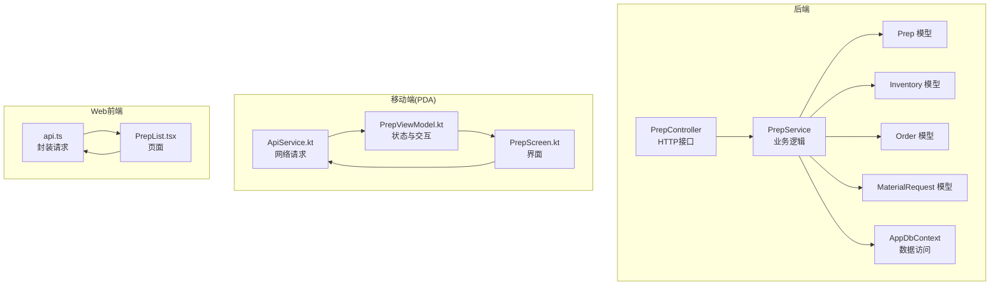
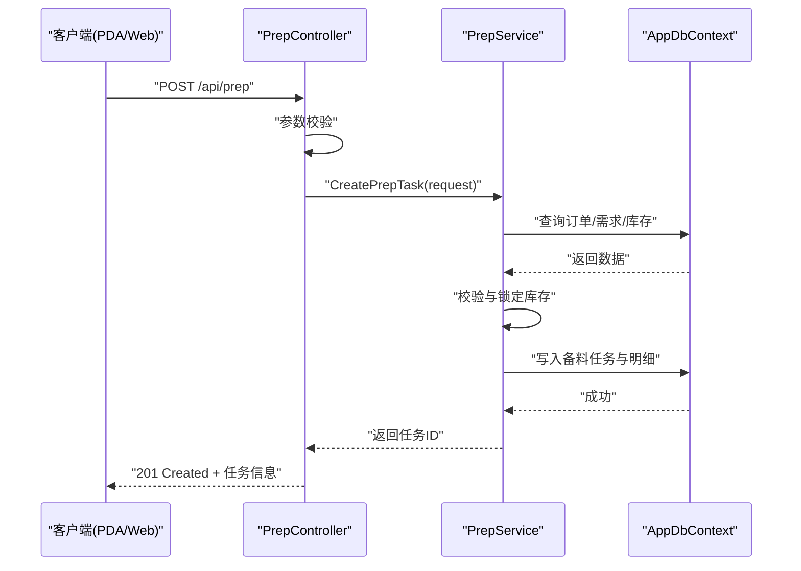
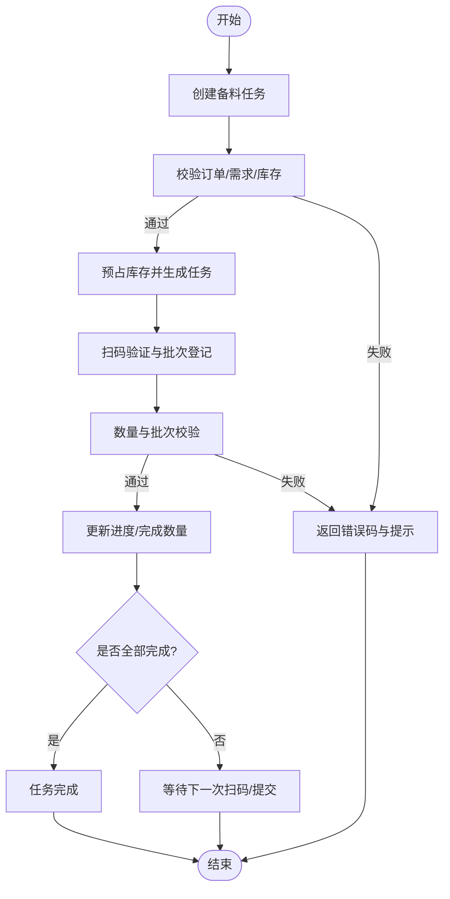
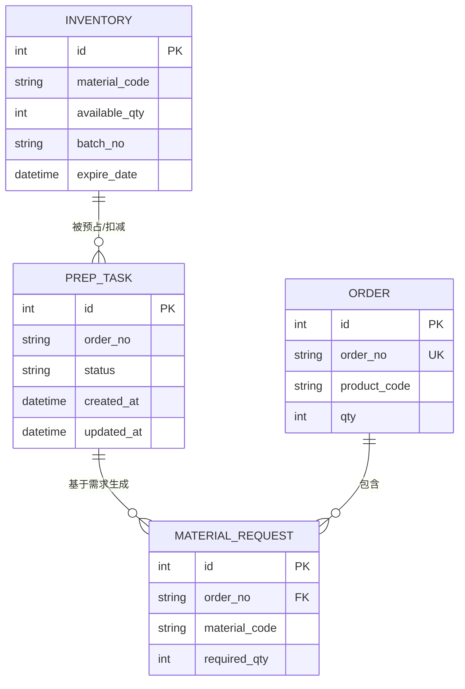
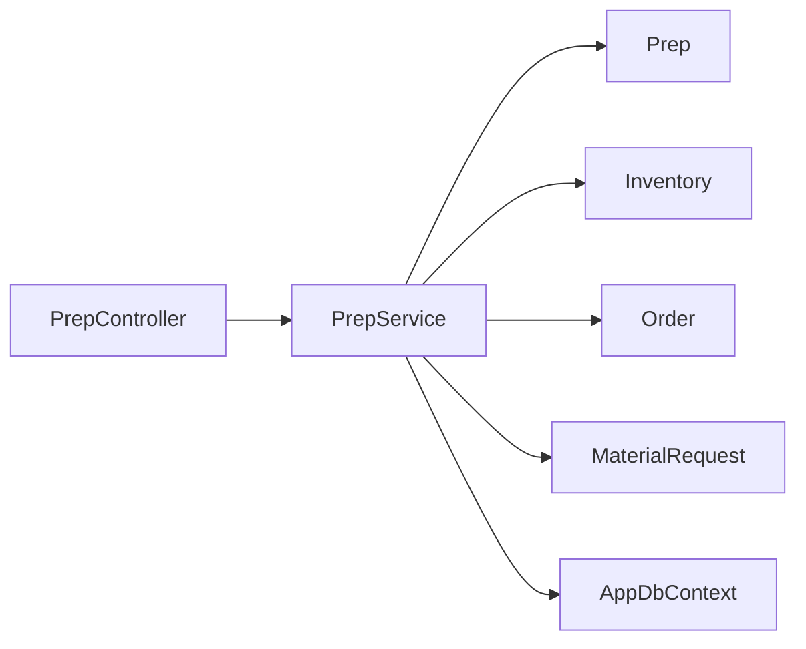

# 备料作业接口

<cite>
**本文引用的文件**   
- [PrepController.cs](file://dip-system/api/Controllers/PrepController.cs)
- [PrepService.cs](file://dip-system/api/Services/PrepService.cs)
- [Prep.cs](file://dip-system/api/Models/Prep.cs)
- [Inventory.cs](file://dip-system/api/Models/Inventory.cs)
- [Order.cs](file://dip-system/api/Models/Order.cs)
- [MaterialRequest.cs](file://dip-system/api/Models/MaterialRequest.cs)
- [AppDbContext.cs](file://dip-system/api/Data/AppDbContext.cs)
- [ApiService.kt](file://mobile-android/app/src/main/java/com/dip/material/data/network/ApiService.kt)
- [PrepScreen.kt](file://mobile-android/app/src/main/java/com/dip/material/ui/prep/PrepScreen.kt)
- [PrepViewModel.kt](file://mobile-android/app/src/main/java/com/dip/material/ui/prep/PrepViewModel.kt)
- [api.ts](file://dip-system/frontend-web/src/lib/api.ts)
- [PrepList.tsx](file://dip-system/frontend-web/src/pages/PrepList.tsx)
</cite>

## 目录
1. [简介](#简介)
2. [项目结构](#项目结构)
3. [核心组件](#核心组件)
4. [架构总览](#架构总览)
5. [详细组件分析](#详细组件分析)
6. [依赖关系分析](#依赖关系分析)
7. [性能考虑](#性能考虑)
8. [故障排查指南](#故障排查指南)
9. [结论](#结论)
10. [附录](#附录)

## 简介
本文件为DIP系统“备料作业”模块的API与业务流程文档，覆盖从备料任务创建、物料准备、扫码验证、批次管理到进度更新的全链路。重点说明以下HTTP接口：
- POST /api/prep：创建备料任务
- GET /api/prep/query：查询备料状态
- PUT /api/prep/update：更新备料进度

同时涵盖校验规则、库存检查、物料追溯、与MES订单同步机制及异常处理策略，并提供PDA设备调用方式与Web端集成示例路径。

## 项目结构
备料作业相关代码主要分布在后端控制器、服务层、数据模型与数据库上下文，以及移动端与Web前端调用侧。

图表来源
- [PrepController.cs](file://dip-system/api/Controllers/PrepController.cs)
- [PrepService.cs](file://dip-system/api/Services/PrepService.cs)
- [Prep.cs](file://dip-system/api/Models/Prep.cs)
- [Inventory.cs](file://dip-system/api/Models/Inventory.cs)
- [Order.cs](file://dip-system/api/Models/Order.cs)
- [MaterialRequest.cs](file://dip-system/api/Models/MaterialRequest.cs)
- [AppDbContext.cs](file://dip-system/api/Data/AppDbContext.cs)
- [ApiService.kt](file://mobile-android/app/src/main/java/com/dip/material/data/network/ApiService.kt)
- [PrepScreen.kt](file://mobile-android/app/src/main/java/com/dip/material/ui/prep/PrepScreen.kt)
- [PrepViewModel.kt](file://mobile-android/app/src/main/java/com/dip/material/ui/prep/PrepViewModel.kt)
- [api.ts](file://dip-system/frontend-web/src/lib/api.ts)
- [PrepList.tsx](file://dip-system/frontend-web/src/pages/PrepList.tsx)

章节来源
- [PrepController.cs](file://dip-system/api/Controllers/PrepController.cs)
- [PrepService.cs](file://dip-system/api/Services/PrepService.cs)
- [Prep.cs](file://dip-system/api/Models/Prep.cs)
- [Inventory.cs](file://dip-system/api/Models/Inventory.cs)
- [Order.cs](file://dip-system/api/Models/Order.cs)
- [MaterialRequest.cs](file://dip-system/api/Models/MaterialRequest.cs)
- [AppDbContext.cs](file://dip-system/api/Data/AppDbContext.cs)
- [ApiService.kt](file://mobile-android/app/src/main/java/com/dip/material/data/network/ApiService.kt)
- [PrepScreen.kt](file://mobile-android/app/src/main/java/com/dip/material/ui/prep/PrepScreen.kt)
- [PrepViewModel.kt](file://mobile-android/app/src/main/java/com/dip/material/ui/prep/PrepViewModel.kt)
- [api.ts](file://dip-system/frontend-web/src/lib/api.ts)
- [PrepList.tsx](file://dip-system/frontend-web/src/pages/PrepList.tsx)

## 核心组件
- 控制器层（PrepController）：暴露RESTful接口，负责参数校验、路由分发与响应封装。
- 服务层（PrepService）：实现备料业务逻辑，包括任务创建、库存校验、扫码验证、批次管理与进度更新。
- 数据模型（Prep、Inventory、Order、MaterialRequest）：描述领域实体与关联关系。
- 数据访问（AppDbContext）：提供EF Core上下文，用于持久化与查询。
- 客户端调用：
  - PDA端（ApiService.kt、PrepViewModel.kt、PrepScreen.kt）：通过Retrofit发起HTTP请求，驱动UI状态。
  - Web端（api.ts、PrepList.tsx）：封装Axios/Fetch调用，渲染列表与操作按钮。

章节来源
- [PrepController.cs](file://dip-system/api/Controllers/PrepController.cs)
- [PrepService.cs](file://dip-system/api/Services/PrepService.cs)
- [Prep.cs](file://dip-system/api/Models/Prep.cs)
- [Inventory.cs](file://dip-system/api/Models/Inventory.cs)
- [Order.cs](file://dip-system/api/Models/Order.cs)
- [MaterialRequest.cs](file://dip-system/api/Models/MaterialRequest.cs)
- [AppDbContext.cs](file://dip-system/api/Data/AppDbContext.cs)
- [ApiService.kt](file://mobile-android/app/src/main/java/com/dip/material/data/network/ApiService.kt)
- [PrepViewModel.kt](file://mobile-android/app/src/main/java/com/dip/material/ui/prep/PrepViewModel.kt)
- [PrepScreen.kt](file://mobile-android/app/src/main/java/com/dip/material/ui/prep/PrepScreen.kt)
- [api.ts](file://dip-system/frontend-web/src/lib/api.ts)
- [PrepList.tsx](file://dip-system/frontend-web/src/pages/PrepList.tsx)

## 架构总览
备料作业采用分层架构：控制器接收HTTP请求，服务层执行业务规则与事务控制，数据层通过EF Core进行CRUD操作。移动端与Web端分别通过各自的网络库调用统一API。

图表来源
- [PrepController.cs](file://dip-system/api/Controllers/PrepController.cs)
- [PrepService.cs](file://dip-system/api/Services/PrepService.cs)
- [AppDbContext.cs](file://dip-system/api/Data/AppDbContext.cs)

## 详细组件分析

### 接口规范与流程
- 创建备料任务
  - 方法：POST /api/prep
  - 用途：根据订单或物料需求创建备料任务，并预占库存。
  - 关键校验：订单存在性、物料BOM/需求清单完整性、库存可用量、批次约束。
  - 响应：返回任务ID与初始状态。

- 查询备料状态
  - 方法：GET /api/prep/query
  - 用途：按任务ID、订单号、物料编码等条件查询备料任务及明细状态。
  - 响应：任务基本信息、明细项、当前进度、异常信息。

- 更新备料进度
  - 方法：PUT /api/prep/update
  - 用途：提交扫码结果、确认物料批次、标记完成数量，推进任务状态。
  - 关键校验：扫码唯一性、批次一致性、数量合理性、并发锁。
  - 响应：更新后的任务状态与剩余待备数量。

图表来源
- [PrepService.cs](file://dip-system/api/Services/PrepService.cs)
- [Prep.cs](file://dip-system/api/Models/Prep.cs)
- [Inventory.cs](file://dip-system/api/Models/Inventory.cs)

章节来源
- [PrepController.cs](file://dip-system/api/Controllers/PrepController.cs)
- [PrepService.cs](file://dip-system/api/Services/PrepService.cs)
- [Prep.cs](file://dip-system/api/Models/Prep.cs)
- [Inventory.cs](file://dip-system/api/Models/Inventory.cs)

### 数据模型与关系
备料作业涉及的核心实体包括备料任务、库存、订单与物料需求，它们之间的关系如下：

图表来源
- [Prep.cs](file://dip-system/api/Models/Prep.cs)
- [Inventory.cs](file://dip-system/api/Models/Inventory.cs)
- [Order.cs](file://dip-system/api/Models/Order.cs)
- [MaterialRequest.cs](file://dip-system/api/Models/MaterialRequest.cs)

章节来源
- [Prep.cs](file://dip-system/api/Models/Prep.cs)
- [Inventory.cs](file://dip-system/api/Models/Inventory.cs)
- [Order.cs](file://dip-system/api/Models/Order.cs)
- [MaterialRequest.cs](file://dip-system/api/Models/MaterialRequest.cs)

### 服务端实现要点
- 参数校验与错误处理：在控制器层对输入进行非空、格式与范围校验；在服务层进行业务规则校验（如库存不足、批次过期）。
- 事务与并发：创建与更新操作使用事务保证一致性；对库存预占与扣减加锁避免超卖。
- 扫码验证：校验条码唯一性与物料匹配，记录批次与时间戳，支持追溯。
- 批次管理：绑定生产批次、有效期与供应商信息，确保先进先出与批次可追踪。
- 与MES订单同步：从订单表读取订单信息，必要时通过外部接口同步状态变更。

章节来源
- [PrepController.cs](file://dip-system/api/Controllers/PrepController.cs)
- [PrepService.cs](file://dip-system/api/Services/PrepService.cs)
- [AppDbContext.cs](file://dip-system/api/Data/AppDbContext.cs)

### 客户端调用示例（路径引用）
- PDA设备调用方式
  - 网络层：[ApiService.kt](file://mobile-android/app/src/main/java/com/dip/material/data/network/ApiService.kt)
  - 视图模型：[PrepViewModel.kt](file://mobile-android/app/src/main/java/com/dip/material/ui/prep/PrepViewModel.kt)
  - 界面入口：[PrepScreen.kt](file://mobile-android/app/src/main/java/com/dip/material/ui/prep/PrepScreen.kt)
  - 典型流程：扫描条码 -> 调用创建/更新接口 -> 刷新任务状态 -> 提示结果

- Web端集成方式
  - API封装：[api.ts](file://dip-system/frontend-web/src/lib/api.ts)
  - 页面组件：[PrepList.tsx](file://dip-system/frontend-web/src/pages/PrepList.tsx)
  - 典型流程：加载任务列表 -> 点击创建/更新 -> 显示进度与结果

章节来源
- [ApiService.kt](file://mobile-android/app/src/main/java/com/dip/material/data/network/ApiService.kt)
- [PrepViewModel.kt](file://mobile-android/app/src/main/java/com/dip/material/ui/prep/PrepViewModel.kt)
- [PrepScreen.kt](file://mobile-android/app/src/main/java/com/dip/material/ui/prep/PrepScreen.kt)
- [api.ts](file://dip-system/frontend-web/src/lib/api.ts)
- [PrepList.tsx](file://dip-system/frontend-web/src/pages/PrepList.tsx)

## 依赖关系分析
备料作业模块依赖订单、物料需求与库存模块，控制器与服务层之间职责清晰，数据访问通过统一的DbContext。

图表来源
- [PrepController.cs](file://dip-system/api/Controllers/PrepController.cs)
- [PrepService.cs](file://dip-system/api/Services/PrepService.cs)
- [Prep.cs](file://dip-system/api/Models/Prep.cs)
- [Inventory.cs](file://dip-system/api/Models/Inventory.cs)
- [Order.cs](file://dip-system/api/Models/Order.cs)
- [MaterialRequest.cs](file://dip-system/api/Models/MaterialRequest.cs)
- [AppDbContext.cs](file://dip-system/api/Data/AppDbContext.cs)

章节来源
- [PrepController.cs](file://dip-system/api/Controllers/PrepController.cs)
- [PrepService.cs](file://dip-system/api/Services/PrepService.cs)
- [Prep.cs](file://dip-system/api/Models/Prep.cs)
- [Inventory.cs](file://dip-system/api/Models/Inventory.cs)
- [Order.cs](file://dip-system/api/Models/Order.cs)
- [MaterialRequest.cs](file://dip-system/api/Models/MaterialRequest.cs)
- [AppDbContext.cs](file://dip-system/api/Data/AppDbContext.cs)

## 性能考虑
- 批量操作：创建与更新时尽量批量写入，减少数据库往返。
- 索引优化：对订单号、物料编码、批次号建立索引，提升查询效率。
- 缓存策略：对热点物料库存信息进行短期缓存，降低锁竞争。
- 分页与过滤：查询接口支持分页与多条件过滤，避免全表扫描。
- 异步处理：耗时操作（如MES同步）采用异步队列，避免阻塞主流程。

## 故障排查指南
- 常见错误码
  - 400：参数校验失败（必填字段缺失、格式错误、数量不合法）
  - 404：资源不存在（订单/物料/任务未找到）
  - 409：冲突（库存不足、批次不一致、重复扫码）
  - 500：服务器内部错误（数据库异常、外部服务不可用）

- 排查步骤
  - 检查请求参数是否符合接口规范
  - 查看日志中的业务校验失败原因（库存、批次、数量）
  - 确认数据库事务是否回滚，是否存在死锁
  - 核对MES同步接口状态与重试策略

章节来源
- [PrepController.cs](file://dip-system/api/Controllers/PrepController.cs)
- [PrepService.cs](file://dip-system/api/Services/PrepService.cs)

## 结论
备料作业API以清晰的层次结构与严谨的业务校验保障生产现场的物料准备过程。通过统一的接口规范、完善的错误处理与追溯能力，能够有效支撑PDA与Web端的协同作业，并与MES系统保持订单同步。建议在生产环境中加强监控与告警，持续优化性能与稳定性。

## 附录
- 接口定义参考路径
  - 控制器接口：[PrepController.cs](file://dip-system/api/Controllers/PrepController.cs)
  - 服务实现：[PrepService.cs](file://dip-system/api/Services/PrepService.cs)
  - 数据模型：[Prep.cs](file://dip-system/api/Models/Prep.cs)、[Inventory.cs](file://dip-system/api/Models/Inventory.cs)、[Order.cs](file://dip-system/api/Models/Order.cs)、[MaterialRequest.cs](file://dip-system/api/Models/MaterialRequest.cs)
  - 数据访问：[AppDbContext.cs](file://dip-system/api/Data/AppDbContext.cs)
  - PDA调用：[ApiService.kt](file://mobile-android/app/src/main/java/com/dip/material/data/network/ApiService.kt)、[PrepViewModel.kt](file://mobile-android/app/src/main/java/com/dip/material/ui/prep/PrepViewModel.kt)、[PrepScreen.kt](file://mobile-android/app/src/main/java/com/dip/material/ui/prep/PrepScreen.kt)
  - Web调用：[api.ts](file://dip-system/frontend-web/src/lib/api.ts)、[PrepList.tsx](file://dip-system/frontend-web/src/pages/PrepList.tsx)