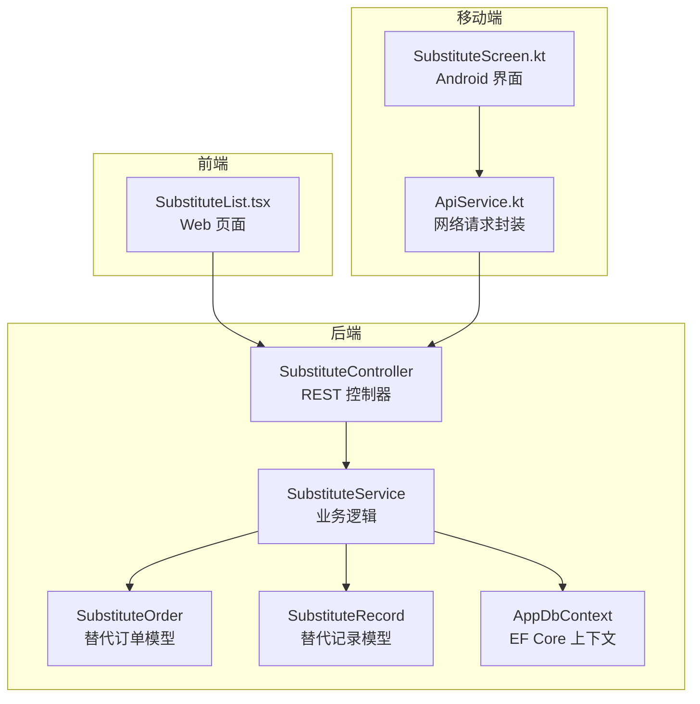
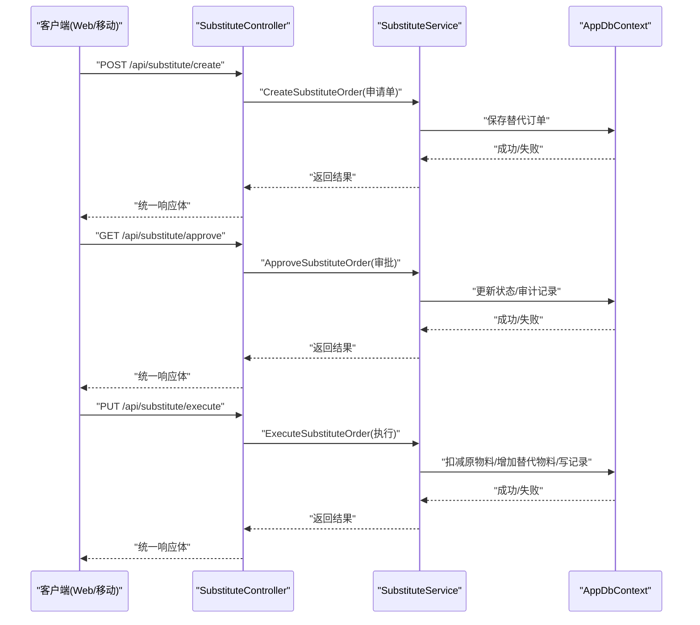
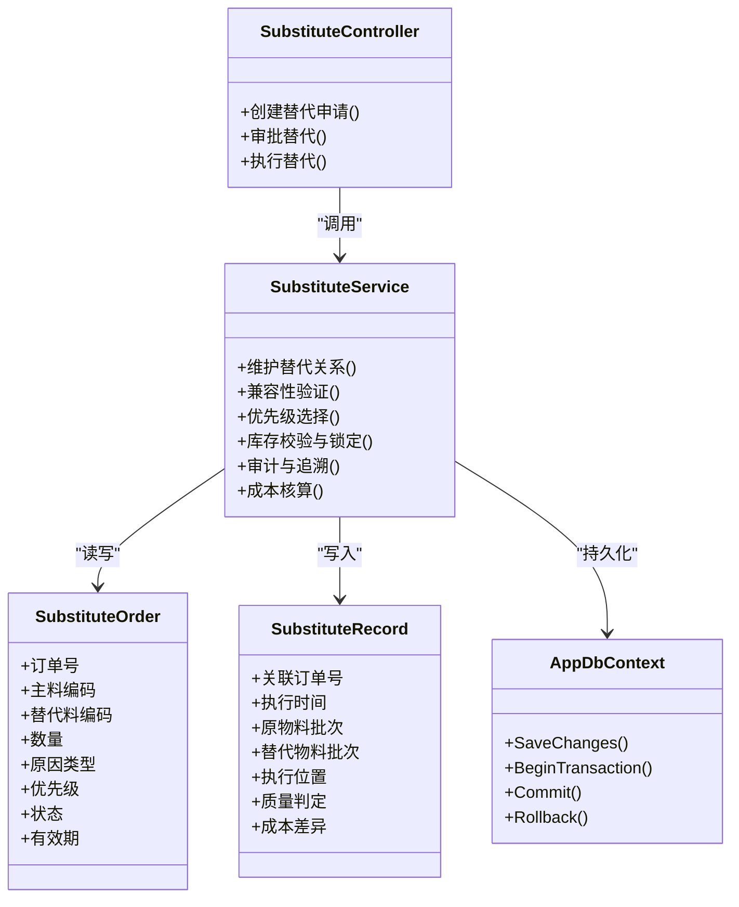

# 替代料作业接口

<cite>
**本文引用的文件**   
- [SubstituteController.cs](file://dip-system/api/Controllers/SubstituteController.cs)
- [SubstituteService.cs](file://dip-system/api/Services/SubstituteService.cs)
- [SubstituteOrder.cs](file://dip-system/api/Models/SubstituteOrder.cs)
- [SubstituteRecord.cs](file://dip-system/api/Models/SubstituteRecord.cs)
- [AppDbContext.cs](file://dip-system/api/Data/AppDbContext.cs)
- [SubstituteList.tsx](file://dip-system/frontend-web/src/pages/SubstituteList.tsx)
- [SubstituteScreen.kt](file://mobile-android/app/src/main/java/com/dip/material/ui/substitute/SubstituteScreen.kt)
- [ApiService.kt](file://mobile-android/app/src/main/java/com/dip/material/data/network/ApiService.kt)
</cite>

## 目录
1. [简介](#简介)
2. [项目结构](#项目结构)
3. [核心组件](#核心组件)
4. [架构总览](#架构总览)
5. [详细组件分析](#详细组件分析)
6. [依赖关系分析](#依赖关系分析)
7. [性能考虑](#性能考虑)
8. [故障排查指南](#故障排查指南)
9. [结论](#结论)
10. [附录](#附录)

## 简介
本文件为DIP系统“替代料作业”的API与业务文档，覆盖以下目标：
- 业务场景：物料缺货时的替代品使用、工程变更导致的物料替换、供应商变更引起的材料替换。
- 接口规范：创建替代申请、审批替代、执行替代等关键操作。
- 业务规则：替代关系配置、优先级规则、兼容性验证。
- 管理维度：追溯管理、质量管控、成本核算。
- 集成方式：与BOM管理系统、供应商管理系统的对接建议。
- 实践方案：配置示例与批量处理方案。

## 项目结构
替代料功能在后端由控制器、服务层、数据模型与数据库上下文组成；前端Web与移动端提供界面与调用封装。

**图表来源** 
- [SubstituteController.cs](file://dip-system/api/Controllers/SubstituteController.cs)
- [SubstituteService.cs](file://dip-system/api/Services/SubstituteService.cs)
- [SubstituteOrder.cs](file://dip-system/api/Models/SubstituteOrder.cs)
- [SubstituteRecord.cs](file://dip-system/api/Models/SubstituteRecord.cs)
- [AppDbContext.cs](file://dip-system/api/Data/AppDbContext.cs)
- [SubstituteList.tsx](file://dip-system/frontend-web/src/pages/SubstituteList.tsx)
- [SubstituteScreen.kt](file://mobile-android/app/src/main/java/com/dip/material/ui/substitute/SubstituteScreen.kt)
- [ApiService.kt](file://mobile-android/app/src/main/java/com/dip/material/data/network/ApiService.kt)

**章节来源**
- [SubstituteController.cs](file://dip-system/api/Controllers/SubstituteController.cs)
- [SubstituteService.cs](file://dip-system/api/Services/SubstituteService.cs)
- [SubstituteOrder.cs](file://dip-system/api/Models/SubstituteOrder.cs)
- [SubstituteRecord.cs](file://dip-system/api/Models/SubstituteRecord.cs)
- [AppDbContext.cs](file://dip-system/api/Data/AppDbContext.cs)
- [SubstituteList.tsx](file://dip-system/frontend-web/src/pages/SubstituteList.tsx)
- [SubstituteScreen.kt](file://mobile-android/app/src/main/java/com/dip/material/ui/substitute/SubstituteScreen.kt)
- [ApiService.kt](file://mobile-android/app/src/main/java/com/dip/material/data/network/ApiService.kt)

## 核心组件
- 控制器（SubstituteController）：暴露REST接口，负责参数校验、权限控制、调用服务层并返回统一响应。
- 服务层（SubstituteService）：实现替代申请、审批、执行的完整业务流程，包括库存检查、兼容性校验、优先级选择、记录与审计。
- 数据模型（SubstituteOrder、SubstituteRecord）：定义替代订单与执行记录的字段、状态与约束。
- 数据访问（AppDbContext）：通过EF Core映射实体到数据库表，支持事务与并发控制。
- 前端与移动端：提供替代料作业的录入、审批、执行界面，以及API调用封装。

**章节来源**
- [SubstituteController.cs](file://dip-system/api/Controllers/SubstituteController.cs)
- [SubstituteService.cs](file://dip-system/api/Services/SubstituteService.cs)
- [SubstituteOrder.cs](file://dip-system/api/Models/SubstituteOrder.cs)
- [SubstituteRecord.cs](file://dip-system/api/Models/SubstituteRecord.cs)
- [AppDbContext.cs](file://dip-system/api/Data/AppDbContext.cs)
- [SubstituteList.tsx](file://dip-system/frontend-web/src/pages/SubstituteList.tsx)
- [SubstituteScreen.kt](file://mobile-android/app/src/main/java/com/dip/material/ui/substitute/SubstituteScreen.kt)
- [ApiService.kt](file://mobile-android/app/src/main/java/com/dip/material/data/network/ApiService.kt)

## 架构总览
替代料作业采用分层架构：控制器接收HTTP请求，服务层执行业务规则，数据层持久化实体。前后端通过REST交互，移动端通过统一的ApiService进行网络调用。

**图表来源** 
- [SubstituteController.cs](file://dip-system/api/Controllers/SubstituteController.cs)
- [SubstituteService.cs](file://dip-system/api/Services/SubstituteService.cs)
- [AppDbContext.cs](file://dip-system/api/Data/AppDbContext.cs)

## 详细组件分析

### 控制器：SubstituteController
- 职责：定义REST端点，处理请求参数、鉴权、调用服务层，返回统一ApiResponse。
- 关键端点：
  - POST /api/substitute/create：创建替代申请
  - GET /api/substitute/approve：查询待审批或提交审批
  - PUT /api/substitute/execute：执行替代（扣原发替）
- 错误处理：参数校验失败、权限不足、业务异常均返回统一错误码与消息。

**章节来源**
- [SubstituteController.cs](file://dip-system/api/Controllers/SubstituteController.cs)

### 服务层：SubstituteService
- 职责：实现替代料全生命周期管理，包括：
  - 替代关系配置维护（主料-替代料映射、优先级、有效期、适用范围）
  - 兼容性验证（规格、封装、电气特性、认证要求）
  - 优先级规则（按配置优先级、库存可用度、成本、供应商等级综合排序）
  - 库存校验与锁定（执行前预占库存，避免超卖）
  - 审计与追溯（记录操作人、时间、原因、批次、SN）
  - 成本核算（记录替代前后的成本差异，便于报表）
- 事务性：创建、审批、执行均在事务中完成，保证一致性。

**章节来源**
- [SubstituteService.cs](file://dip-system/api/Services/SubstituteService.cs)

### 数据模型：SubstituteOrder、SubstituteRecord
- SubstituteOrder（替代订单）：
  - 关键字段：订单号、主料编码、替代料编码、数量、原因类型（缺货/ECN/供应商变更）、优先级、状态、有效期、申请人、审批人、备注。
  - 状态机：草稿→待审批→已批准→执行中→已完成/已取消。
- SubstituteRecord（替代记录）：
  - 关键字段：关联订单号、执行时间、原物料批次、替代物料批次、执行位置、操作员、质量判定、成本差异、追溯信息（工单/产品SN）。

**章节来源**
- [SubstituteOrder.cs](file://dip-system/api/Models/SubstituteOrder.cs)
- [SubstituteRecord.cs](file://dip-system/api/Models/SubstituteRecord.cs)

### 数据访问：AppDbContext
- 作用：EF Core上下文，映射实体到数据库表，提供仓储式CRUD与事务能力。
- 关注点：索引设计（订单号、物料编码、状态）、并发控制（行版本）、外键约束（物料主数据、供应商、仓库）。

**章节来源**
- [AppDbContext.cs](file://dip-system/api/Data/AppDbContext.cs)

### 前端与移动端
- Web页面（SubstituteList.tsx）：展示替代订单列表、筛选、分页、详情查看、审批与执行入口。
- 移动端（SubstituteScreen.kt + ApiService.kt）：扫码快速发起替代申请、查看审批状态、执行替代并回传结果。

**章节来源**
- [SubstituteList.tsx](file://dip-system/frontend-web/src/pages/SubstituteList.tsx)
- [SubstituteScreen.kt](file://mobile-android/app/src/main/java/com/dip/material/ui/substitute/SubstituteScreen.kt)
- [ApiService.kt](file://mobile-android/app/src/main/java/com/dip/material/data/network/ApiService.kt)

## 依赖关系分析
- 控制器依赖服务层，服务层依赖数据模型与上下文。
- 前端与移动端依赖控制器提供的REST接口。
- 外部系统集成点：
  - BOM管理系统：读取主料-替代料关系、工程变更影响范围。
  - 供应商管理系统：获取供应商等级、交期、替代料可用性。
  - 质量管理系统：记录质量判定、不合格处理。
  - 成本系统：采集替代成本差异用于核算。

**图表来源** 
- [SubstituteController.cs](file://dip-system/api/Controllers/SubstituteController.cs)
- [SubstituteService.cs](file://dip-system/api/Services/SubstituteService.cs)
- [SubstituteOrder.cs](file://dip-system/api/Models/SubstituteOrder.cs)
- [SubstituteRecord.cs](file://dip-system/api/Models/SubstituteRecord.cs)
- [AppDbContext.cs](file://dip-system/api/Data/AppDbContext.cs)

**章节来源**
- [SubstituteController.cs](file://dip-system/api/Controllers/SubstituteController.cs)
- [SubstituteService.cs](file://dip-system/api/Services/SubstituteService.cs)
- [SubstituteOrder.cs](file://dip-system/api/Models/SubstituteOrder.cs)
- [SubstituteRecord.cs](file://dip-system/api/Models/SubstituteRecord.cs)
- [AppDbContext.cs](file://dip-system/api/Data/AppDbContext.cs)

## 性能考虑
- 索引优化：对订单号、物料编码、状态、时间戳建立索引，提升查询与分页效率。
- 事务粒度：尽量缩小事务范围，减少锁竞争；批量执行时使用分批提交。
- 缓存策略：替代关系与优先级可短期缓存，降低频繁查询主数据的压力。
- 异步处理：审批通知、成本核算、报表生成可采用异步任务，避免阻塞主流程。
- 并发控制：使用乐观锁（行版本）防止重复执行与数据覆盖。

[本节为通用指导，不直接分析具体文件]

## 故障排查指南
- 常见错误：
  - 参数校验失败：检查必填字段、格式、范围。
  - 权限不足：确认用户角色与操作权限。
  - 库存不足：检查在库量、在途量、预留量。
  - 兼容性不通过：核对规格、封装、认证要求。
  - 审批未通过：查看审批意见与退回原因。
- 定位方法：
  - 查看审计日志与操作记录。
  - 检查替代订单状态流转。
  - 核对替代关系配置与优先级。
  - 查看库存快照与批次信息。
- 恢复建议：
  - 修正配置后重试。
  - 调整优先级或更换替代料。
  - 补充库存或延长有效期。

**章节来源**
- [SubstituteService.cs](file://dip-system/api/Services/SubstituteService.cs)
- [SubstituteOrder.cs](file://dip-system/api/Models/SubstituteOrder.cs)
- [SubstituteRecord.cs](file://dip-system/api/Models/SubstituteRecord.cs)

## 结论
替代料作业是DIP系统在物料保障与生产连续性中的关键环节。通过清晰的接口规范、严格的业务规则与完善的追溯机制，系统能够有效应对缺货、工程变更与供应商变更等复杂场景，同时兼顾质量与成本管控。建议在生产环境中结合缓存、异步与索引优化，确保高并发下的稳定与高效。

[本节为总结，不直接分析具体文件]

## 附录

### 接口规范（建议）
- POST /api/substitute/create
  - 用途：创建替代申请
  - 输入：主料编码、替代料编码、数量、原因类型、优先级、有效期、备注
  - 输出：统一响应体（包含订单号、状态、消息）
- GET /api/substitute/approve
  - 用途：查询待审批或提交审批
  - 输入：订单号或筛选条件（状态、物料、时间）
  - 输出：统一响应体（包含审批结果、审计信息）
- PUT /api/substitute/execute
  - 用途：执行替代
  - 输入：订单号、执行位置、批次信息、操作员、质量判定
  - 输出：统一响应体（包含执行结果、成本差异、追溯信息）

[本节为概念性说明，不直接分析具体文件]

### 业务规则与优先级
- 替代关系配置：主料-替代料映射、适用范围（产品/工单/仓库）、有效期、启用状态。
- 优先级规则：按配置优先级、库存可用度、成本、供应商等级综合排序；冲突时以最高优先级为准。
- 兼容性验证：规格、封装、电气特性、认证要求必须满足；必要时需质量部门复核。
- 库存校验：执行前预占库存，避免超卖；支持部分执行与分批执行。
- 审计与追溯：记录操作人、时间、原因、批次、SN；支持回溯与报表导出。
- 成本核算：记录替代前后的成本差异，支持按订单/产品/供应商维度汇总。

[本节为概念性说明，不直接分析具体文件]

### 配置示例（概念）
- 替代关系：主料A → 替代料B（优先级1，有效期2026-01-01至2026-12-31，适用于产品X）
- 优先级：B > C > D（按可用度与成本动态调整）
- 兼容性：封装相同、电压范围一致、认证齐全
- 库存阈值：低于安全库存触发替代建议

[本节为概念性说明，不直接分析具体文件]

### 批量处理方案（概念）
- 批量导入：Excel/CSV导入替代关系与优先级
- 批量审批：按原因类型或供应商批量审批
- 批量执行：按工单或产品批量执行替代，分批提交
- 异常处理：失败项单独记录并支持重试

[本节为概念性说明，不直接分析具体文件]

### 与外部系统集成（概念）
- BOM管理系统：同步主料-替代料关系、工程变更影响范围
- 供应商管理系统：获取供应商等级、交期、替代料可用性
- 质量管理系统：记录质量判定、不合格处理、召回追踪
- 成本系统：采集替代成本差异，生成成本报表

[本节为概念性说明，不直接分析具体文件]