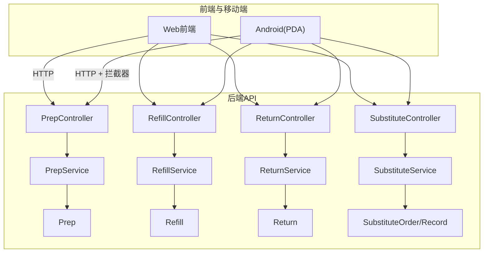
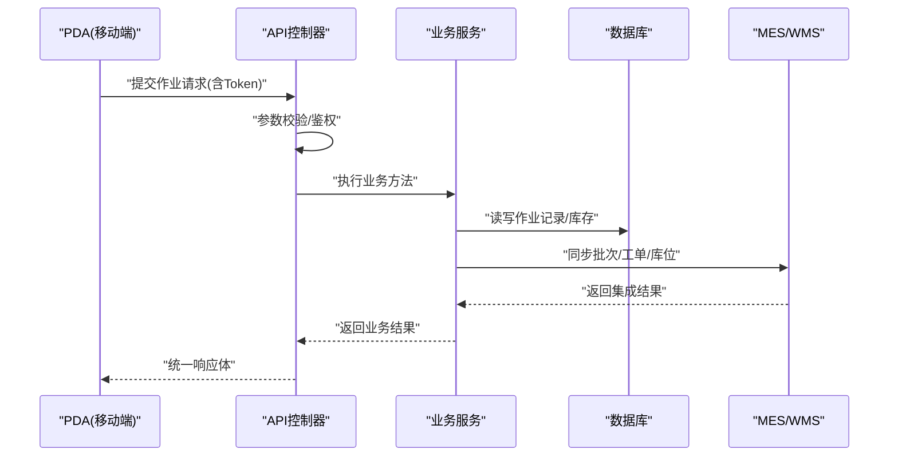
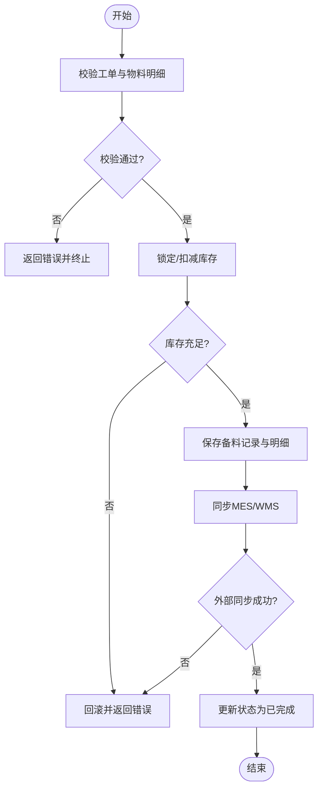
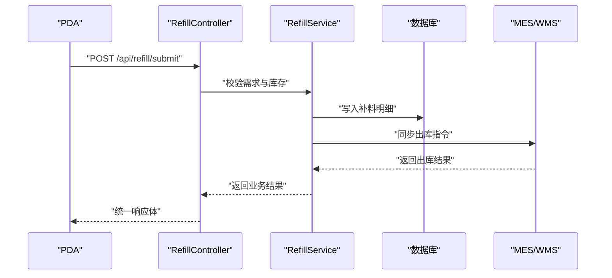
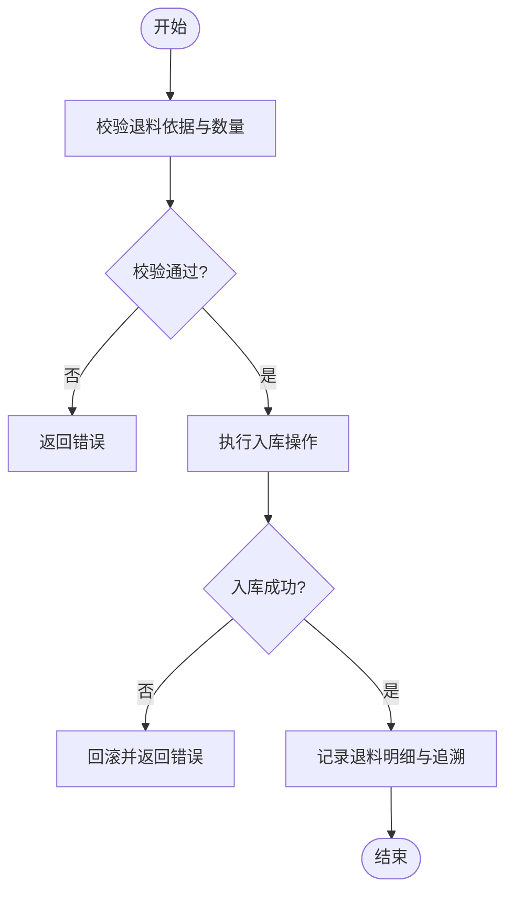
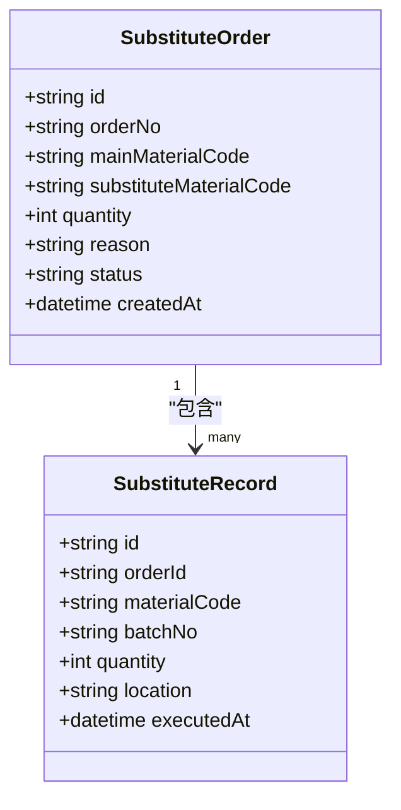
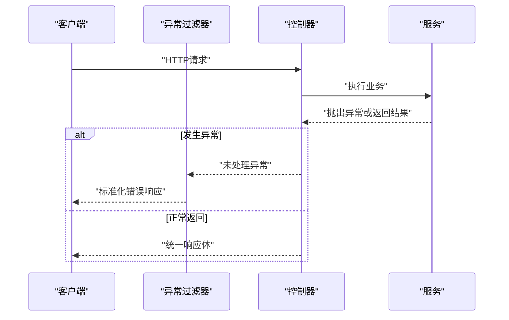
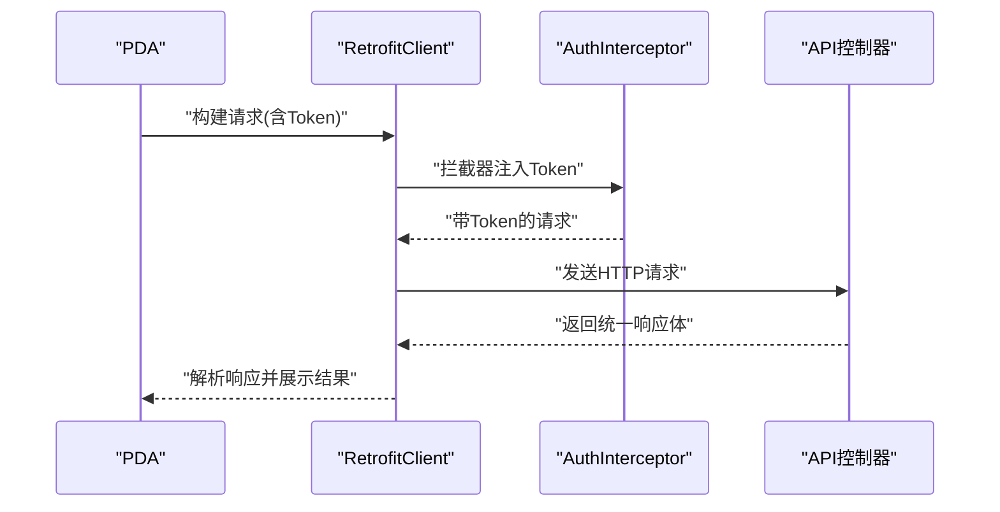
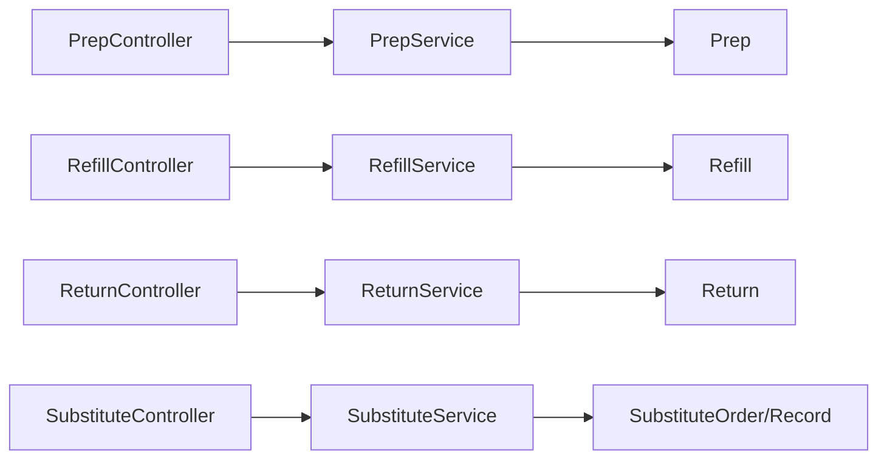

# 生产作业接口

<cite>
**本文档引用的文件**   
- [PrepController.cs](file://dip-system/api/Controllers/PrepController.cs)
- [RefillController.cs](file://dip-system/api/Controllers/RefillController.cs)
- [ReturnController.cs](file://dip-system/api/Controllers/ReturnController.cs)
- [SubstituteController.cs](file://dip-system/api/Controllers/SubstituteController.cs)
- [PrepService.cs](file://dip-system/api/Services/PrepService.cs)
- [RefillService.cs](file://dip-system/api/Services/RefillService.cs)
- [ReturnService.cs](file://dip-system/api/Services/ReturnService.cs)
- [SubstituteService.cs](file://dip-system/api/Services/SubstituteService.cs)
- [Prep.cs](file://dip-system/api/Models/Prep.cs)
- [Refill.cs](file://dip-system/api/Models/Refill.cs)
- [Return.cs](file://dip-system/api/Models/Return.cs)
- [SubstituteOrder.cs](file://dip-system/api/Models/SubstituteOrder.cs)
- [SubstituteRecord.cs](file://dip-system/api/Models/SubstituteRecord.cs)
- [ApiResponse.cs](file://dip-system/api/Models/ApiResponse.cs)
- [AppExceptionFilter.cs](file://dip-system/api/Controllers/AppExceptionFilter.cs)
- [RetrofitClient.kt](file://mobile-android/app/src/main/java/com/dip/material/data/network/RetrofitClient.kt)
- [ApiService.kt](file://mobile-android/app/src/main/java/com/dip/material/data/network/ApiService.kt)
- [AuthInterceptor.kt](file://mobile-android/app/src/main/java/com/dip/material/data/network/AuthInterceptor.kt)
- [CallMaterialScreen.kt](file://mobile-android/app/src/main/java/com/dip/material/ui/callmaterial/CallMaterialScreen.kt)
- [PrepScreen.kt](file://mobile-android/app/src/main/java/com/dip/material/ui/prep/PrepScreen.kt)
- [RefillScreen.kt](file://mobile-android/app/src/main/java/com/dip/material/ui/refill/RefillScreen.kt)
- [ReturnScreen.kt](file://mobile-android/app/src/main/java/com/dip/material/ui/return_/ReturnScreen.kt)
- [SubstituteScreen.kt](file://mobile-android/app/src/main/java/com/dip/material/ui/substitute/SubstituteScreen.kt)
</cite>

## 目录
1. [简介](#简介)
2. [项目结构](#项目结构)
3. [核心组件](#核心组件)
4. [架构总览](#架构总览)
5. [详细组件分析](#详细组件分析)
6. [依赖分析](#依赖分析)
7. [性能考虑](#性能考虑)
8. [故障排查指南](#故障排查指南)
9. [结论](#结论)
10. [附录](#附录)

## 简介
本文件面向DIP系统“生产作业”相关API，覆盖备料、补料、退料、替代料等作业类型的接口规范与业务说明。内容包含：
- HTTP方法与URL路径、请求参数与响应格式
- 各作业类型业务逻辑、状态管理、数据校验规则
- 完整性检查、异常处理与回滚机制
- 作业记录、追溯信息、质量管控要点
- 完整流程示例、异常场景处理、批量作业示例
- 与MES/WMS集成方式
- PDA设备专用接口与离线数据处理机制

## 项目结构
后端采用ASP.NET Core Web API，按控制器-服务-模型分层组织；前端Web与移动端Android（PDA）通过REST调用后端接口。关键目录：
- api/Controllers：HTTP接口层（备料、补料、退料、替代料等）
- api/Services：业务逻辑与服务编排
- api/Models：领域模型与统一响应封装
- mobile-android：PDA端网络层、UI与扫码集成

**图示来源** 
- [PrepController.cs](file://dip-system/api/Controllers/PrepController.cs)
- [RefillController.cs](file://dip-system/api/Controllers/RefillController.cs)
- [ReturnController.cs](file://dip-system/api/Controllers/ReturnController.cs)
- [SubstituteController.cs](file://dip-system/api/Controllers/SubstituteController.cs)
- [PrepService.cs](file://dip-system/api/Services/PrepService.cs)
- [RefillService.cs](file://dip-system/api/Services/RefillService.cs)
- [ReturnService.cs](file://dip-system/api/Services/ReturnService.cs)
- [SubstituteService.cs](file://dip-system/api/Services/SubstituteService.cs)
- [Prep.cs](file://dip-system/api/Models/Prep.cs)
- [Refill.cs](file://dip-system/api/Models/Refill.cs)
- [Return.cs](file://dip-system/api/Models/Return.cs)
- [SubstituteOrder.cs](file://dip-system/api/Models/SubstituteOrder.cs)
- [SubstituteRecord.cs](file://dip-system/api/Models/SubstituteRecord.cs)
- [RetrofitClient.kt](file://mobile-android/app/src/main/java/com/dip/material/data/network/RetrofitClient.kt)
- [ApiService.kt](file://mobile-android/app/src/main/java/com/dip/material/data/network/ApiService.kt)
- [AuthInterceptor.kt](file://mobile-android/app/src/main/java/com/dip/material/data/network/AuthInterceptor.kt)

**章节来源**
- [PrepController.cs](file://dip-system/api/Controllers/PrepController.cs)
- [RefillController.cs](file://dip-system/api/Controllers/RefillController.cs)
- [ReturnController.cs](file://dip-system/api/Controllers/ReturnController.cs)
- [SubstituteController.cs](file://dip-system/api/Controllers/SubstituteController.cs)
- [PrepService.cs](file://dip-system/api/Services/PrepService.cs)
- [RefillService.cs](file://dip-system/api/Services/RefillService.cs)
- [ReturnService.cs](file://dip-system/api/Services/ReturnService.cs)
- [SubstituteService.cs](file://dip-system/api/Services/SubstituteService.cs)
- [Prep.cs](file://dip-system/api/Models/Prep.cs)
- [Refill.cs](file://dip-system/api/Models/Refill.cs)
- [Return.cs](file://dip-system/api/Models/Return.cs)
- [SubstituteOrder.cs](file://dip-system/api/Models/SubstituteOrder.cs)
- [SubstituteRecord.cs](file://dip-system/api/Models/SubstituteRecord.cs)
- [RetrofitClient.kt](file://mobile-android/app/src/main/java/com/dip/material/data/network/RetrofitClient.kt)
- [ApiService.kt](file://mobile-android/app/src/main/java/com/dip/material/data/network/ApiService.kt)
- [AuthInterceptor.kt](file://mobile-android/app/src/main/java/com/dip/material/data/network/AuthInterceptor.kt)

## 核心组件
- 控制器层：暴露HTTP接口，负责路由、参数绑定、基础校验与结果包装
- 服务层：实现业务编排、事务控制、完整性校验、状态流转、与外部系统集成
- 模型层：定义作业实体、审计字段、统一响应体
- 异常过滤器：全局异常捕获与标准化错误响应

**章节来源**
- [ApiResponse.cs](file://dip-system/api/Models/ApiResponse.cs)
- [AppExceptionFilter.cs](file://dip-system/api/Controllers/AppExceptionFilter.cs)

## 架构总览
整体为典型的三层架构：控制器→服务→数据模型。移动端通过Retrofit发起HTTP请求，使用认证拦截器注入Token；服务端统一异常过滤并返回标准响应体。

**图示来源** 
- [PrepController.cs](file://dip-system/api/Controllers/PrepController.cs)
- [RefillController.cs](file://dip-system/api/Controllers/RefillController.cs)
- [ReturnController.cs](file://dip-system/api/Controllers/ReturnController.cs)
- [SubstituteController.cs](file://dip-system/api/Controllers/SubstituteController.cs)
- [PrepService.cs](file://dip-system/api/Services/PrepService.cs)
- [RefillService.cs](file://dip-system/api/Services/RefillService.cs)
- [ReturnService.cs](file://dip-system/api/Services/ReturnService.cs)
- [SubstituteService.cs](file://dip-system/api/Services/SubstituteService.cs)
- [RetrofitClient.kt](file://mobile-android/app/src/main/java/com/dip/material/data/network/RetrofitClient.kt)
- [ApiService.kt](file://mobile-android/app/src/main/java/com/dip/material/data/network/ApiService.kt)
- [AuthInterceptor.kt](file://mobile-android/app/src/main/java/com/dip/material/data/network/AuthInterceptor.kt)

## 详细组件分析

### 备料作业（Prep）
- 职责：根据工单/BOM生成备料任务，校验物料可用性，锁定或扣减库存，记录备料明细与追溯信息
- 典型接口
  - 创建备料单：POST /api/prep
  - 提交备料：POST /api/prep/submit
  - 查询备料单：GET /api/prep/{id}
  - 列表查询：GET /api/prep?orderNo=&status=
- 请求参数要点
  - 工单号、产品编码、计划数量、站点/线体、时间戳、操作人
  - 物料明细：物料编码、批次、序列号、数量、库位
- 响应格式
  - 统一响应体包含：状态码、消息、数据对象（如备料单ID、明细清单）
- 业务规则与校验
  - 工单有效性、BOM展开、物料可用量校验、批次/序列号唯一性
  - 状态机：草稿→已提交→已完成/已取消
- 完整性检查
  - 必填字段、数量非负、批次在有效期、库位存在且可拣选
- 异常与回滚
  - 库存不足、批次冲突、外部系统失败时回滚事务，返回标准化错误
- 追溯与质检
  - 记录操作人、时间、设备、扫描条码、关联工单/批次/库位

**图示来源** 
- [PrepController.cs](file://dip-system/api/Controllers/PrepController.cs)
- [PrepService.cs](file://dip-system/api/Services/PrepService.cs)
- [Prep.cs](file://dip-system/api/Models/Prep.cs)

**章节来源**
- [PrepController.cs](file://dip-system/api/Controllers/PrepController.cs)
- [PrepService.cs](file://dip-system/api/Services/PrepService.cs)
- [Prep.cs](file://dip-system/api/Models/Prep.cs)

### 补料作业（Refill）
- 职责：生产线缺料时触发补料，校验需求与库存，执行出库与上线确认，记录补料轨迹
- 典型接口
  - 创建补料单：POST /api/refill
  - 提交补料：POST /api/refill/submit
  - 查询补料单：GET /api/refill/{id}
  - 列表查询：GET /api/refill?orderNo=&line=
- 请求参数要点
  - 工单号、线体/站点、需求数量、原因代码、紧急程度
  - 物料明细：物料编码、批次、数量、目标库位
- 响应格式
  - 统一响应体包含：补料单ID、明细、状态
- 业务规则与校验
  - 需求合理性、批次先进先出策略、库位容量限制
- 完整性检查
  - 必填项、数量正数、批次有效、库位匹配
- 异常与回滚
  - 库存不足、库位不可用、外部系统失败时回滚
- 追溯与质检
  - 记录补料原因、操作人、时间、设备、扫描条码

**图示来源** 
- [RefillController.cs](file://dip-system/api/Controllers/RefillController.cs)
- [RefillService.cs](file://dip-system/api/Services/RefillService.cs)
- [Refill.cs](file://dip-system/api/Models/Refill.cs)
- [RetrofitClient.kt](file://mobile-android/app/src/main/java/com/dip/material/data/network/RetrofitClient.kt)
- [ApiService.kt](file://mobile-android/app/src/main/java/com/dip/material/data/network/ApiService.kt)
- [AuthInterceptor.kt](file://mobile-android/app/src/main/java/com/dip/material/data/network/AuthInterceptor.kt)

**章节来源**
- [RefillController.cs](file://dip-system/api/Controllers/RefillController.cs)
- [RefillService.cs](file://dip-system/api/Services/RefillService.cs)
- [Refill.cs](file://dip-system/api/Models/Refill.cs)

### 退料作业（Return）
- 职责：将线上剩余物料退回仓库，校验退料依据与数量，执行入库与差异处理
- 典型接口
  - 创建退料单：POST /api/return
  - 提交退料：POST /api/return/submit
  - 查询退料单：GET /api/return/{id}
  - 列表查询：GET /api/return?orderNo=&line=
- 请求参数要点
  - 工单号、线体/站点、退料原因、数量、物料明细（编码、批次、数量、库位）
- 响应格式
  - 统一响应体包含：退料单ID、明细、状态
- 业务规则与校验
  - 退料依据（工单结单/变更）、数量不超过在线用量、批次一致性
- 完整性检查
  - 必填项、数量非负、批次有效、库位可入库
- 异常与回滚
  - 超退、批次不匹配、外部系统失败时回滚
- 追溯与质检
  - 记录退料原因、操作人、时间、设备、扫描条码

**图示来源** 
- [ReturnController.cs](file://dip-system/api/Controllers/ReturnController.cs)
- [ReturnService.cs](file://dip-system/api/Services/ReturnService.cs)
- [Return.cs](file://dip-system/api/Models/Return.cs)

**章节来源**
- [ReturnController.cs](file://dip-system/api/Controllers/ReturnController.cs)
- [ReturnService.cs](file://dip-system/api/Services/ReturnService.cs)
- [Return.cs](file://dip-system/api/Models/Return.cs)

### 替代料作业（Substitute）
- 职责：当主料不可用时启用替代料，校验替代关系与质量要求，记录替代订单与执行记录
- 典型接口
  - 创建替代订单：POST /api/substitute
  - 提交替代执行：POST /api/substitute/execute
  - 查询替代订单：GET /api/substitute/{id}
  - 列表查询：GET /api/substitute?orderNo=&status=
- 请求参数要点
  - 工单号、主料编码、替代料编码、数量、原因、质量批准信息
  - 替代明细：替代关系、生效范围、批次约束
- 响应格式
  - 统一响应体包含：替代订单ID、执行记录、状态
- 业务规则与校验
  - 替代关系有效性、质量审批通过、批次有效期与兼容性
- 完整性检查
  - 必填项、数量合理、替代关系存在、质量标志正确
- 异常与回滚
  - 替代关系无效、质量未批准、外部系统失败时回滚
- 追溯与质检
  - 记录替代原因、批准人、时间、设备、扫描条码、质量批号

**图示来源** 
- [SubstituteOrder.cs](file://dip-system/api/Models/SubstituteOrder.cs)
- [SubstituteRecord.cs](file://dip-system/api/Models/SubstituteRecord.cs)
- [SubstituteController.cs](file://dip-system/api/Controllers/SubstituteController.cs)
- [SubstituteService.cs](file://dip-system/api/Services/SubstituteService.cs)

**章节来源**
- [SubstituteController.cs](file://dip-system/api/Controllers/SubstituteController.cs)
- [SubstituteService.cs](file://dip-system/api/Services/SubstituteService.cs)
- [SubstituteOrder.cs](file://dip-system/api/Models/SubstituteOrder.cs)
- [SubstituteRecord.cs](file://dip-system/api/Models/SubstituteRecord.cs)

### 统一响应与异常处理
- 统一响应体：所有接口返回统一的JSON结构，包含状态码、消息、数据对象
- 异常过滤器：全局捕获未处理异常，转换为标准错误响应，避免泄露内部细节

**图示来源** 
- [ApiResponse.cs](file://dip-system/api/Models/ApiResponse.cs)
- [AppExceptionFilter.cs](file://dip-system/api/Controllers/AppExceptionFilter.cs)

**章节来源**
- [ApiResponse.cs](file://dip-system/api/Models/ApiResponse.cs)
- [AppExceptionFilter.cs](file://dip-system/api/Controllers/AppExceptionFilter.cs)

### PDA设备专用接口与离线处理
- 网络层：RetrofitClient配置基础URL、超时、重试；AuthInterceptor自动注入Token
- UI交互：CallMaterial/Prep/Refill/Return/Substitute屏幕提供扫码输入、表单校验、提交反馈
- 离线机制：本地缓存待提交作业，网络恢复后批量上传，冲突检测与合并策略

**图示来源** 
- [RetrofitClient.kt](file://mobile-android/app/src/main/java/com/dip/material/data/network/RetrofitClient.kt)
- [ApiService.kt](file://mobile-android/app/src/main/java/com/dip/material/data/network/ApiService.kt)
- [AuthInterceptor.kt](file://mobile-android/app/src/main/java/com/dip/material/data/network/AuthInterceptor.kt)
- [CallMaterialScreen.kt](file://mobile-android/app/src/main/java/com/dip/material/ui/callmaterial/CallMaterialScreen.kt)
- [PrepScreen.kt](file://mobile-android/app/src/main/java/com/dip/material/ui/prep/PrepScreen.kt)
- [RefillScreen.kt](file://mobile-android/app/src/main/java/com/dip/material/ui/refill/RefillScreen.kt)
- [ReturnScreen.kt](file://mobile-android/app/src/main/java/com/dip/material/ui/return_/ReturnScreen.kt)
- [SubstituteScreen.kt](file://mobile-android/app/src/main/java/com/dip/material/ui/substitute/SubstituteScreen.kt)

**章节来源**
- [RetrofitClient.kt](file://mobile-android/app/src/main/java/com/dip/material/data/network/RetrofitClient.kt)
- [ApiService.kt](file://mobile-android/app/src/main/java/com/dip/material/data/network/ApiService.kt)
- [AuthInterceptor.kt](file://mobile-android/app/src/main/java/com/dip/material/data/network/AuthInterceptor.kt)
- [CallMaterialScreen.kt](file://mobile-android/app/src/main/java/com/dip/material/ui/callmaterial/CallMaterialScreen.kt)
- [PrepScreen.kt](file://mobile-android/app/src/main/java/com/dip/material/ui/prep/PrepScreen.kt)
- [RefillScreen.kt](file://mobile-android/app/src/main/java/com/dip/material/ui/refill/RefillScreen.kt)
- [ReturnScreen.kt](file://mobile-android/app/src/main/java/com/dip/material/ui/return_/ReturnScreen.kt)
- [SubstituteScreen.kt](file://mobile-android/app/src/main/java/com/dip/material/ui/substitute/SubstituteScreen.kt)

## 依赖分析
- 控制器依赖服务：每个控制器仅做参数绑定与调用服务，保持低耦合
- 服务依赖模型：服务层对领域模型进行组合与转换
- 移动端依赖网络层：Retrofit与拦截器解耦认证与重试逻辑
- 外部系统集成：服务层通过HTTP或消息队列与MES/WMS交互

**图示来源** 
- [PrepController.cs](file://dip-system/api/Controllers/PrepController.cs)
- [RefillController.cs](file://dip-system/api/Controllers/RefillController.cs)
- [ReturnController.cs](file://dip-system/api/Controllers/ReturnController.cs)
- [SubstituteController.cs](file://dip-system/api/Controllers/SubstituteController.cs)
- [PrepService.cs](file://dip-system/api/Services/PrepService.cs)
- [RefillService.cs](file://dip-system/api/Services/RefillService.cs)
- [ReturnService.cs](file://dip-system/api/Services/ReturnService.cs)
- [SubstituteService.cs](file://dip-system/api/Services/SubstituteService.cs)
- [Prep.cs](file://dip-system/api/Models/Prep.cs)
- [Refill.cs](file://dip-system/api/Models/Refill.cs)
- [Return.cs](file://dip-system/api/Models/Return.cs)
- [SubstituteOrder.cs](file://dip-system/api/Models/SubstituteOrder.cs)
- [SubstituteRecord.cs](file://dip-system/api/Models/SubstituteRecord.cs)

**章节来源**
- [PrepController.cs](file://dip-system/api/Controllers/PrepController.cs)
- [RefillController.cs](file://dip-system/api/Controllers/RefillController.cs)
- [ReturnController.cs](file://dip-system/api/Controllers/ReturnController.cs)
- [SubstituteController.cs](file://dip-system/api/Controllers/SubstituteController.cs)
- [PrepService.cs](file://dip-system/api/Services/PrepService.cs)
- [RefillService.cs](file://dip-system/api/Services/RefillService.cs)
- [ReturnService.cs](file://dip-system/api/Services/ReturnService.cs)
- [SubstituteService.cs](file://dip-system/api/Services/SubstituteService.cs)
- [Prep.cs](file://dip-system/api/Models/Prep.cs)
- [Refill.cs](file://dip-system/api/Models/Refill.cs)
- [Return.cs](file://dip-system/api/Models/Return.cs)
- [SubstituteOrder.cs](file://dip-system/api/Models/SubstituteOrder.cs)
- [SubstituteRecord.cs](file://dip-system/api/Models/SubstituteRecord.cs)

## 性能考虑
- 批量作业：支持批量提交以减少网络往返，服务端需保证原子性与幂等
- 并发控制：对库存锁定与批次分配加锁，避免超卖与重复出库
- 缓存策略：热点物料与库位信息可缓存，降低数据库压力
- 异步集成：与MES/WMS的同步调用改为异步消息，提升吞吐
- 分页与筛选：列表接口支持分页与条件筛选，减少数据传输

[本节为通用指导，无需特定文件引用]

## 故障排查指南
- 常见错误
  - 参数缺失或格式错误：检查必填字段与数据类型
  - 库存不足：核对可用量与锁定状态
  - 批次冲突：检查批次有效期与唯一性
  - 外部系统失败：查看MES/WMS返回码与日志
- 排查步骤
  - 查看统一响应体的消息与状态码
  - 检查异常过滤器记录的堆栈与上下文
  - 核对作业记录与明细是否一致
  - 验证PDA网络与Token有效性

**章节来源**
- [ApiResponse.cs](file://dip-system/api/Models/ApiResponse.cs)
- [AppExceptionFilter.cs](file://dip-system/api/Controllers/AppExceptionFilter.cs)

## 结论
本文件系统化梳理了DIP系统生产作业相关API的接口规范与业务流程，涵盖备料、补料、退料、替代料四大作业类型。通过统一响应与异常处理、完整性校验与回滚机制、追溯与质量管控，以及PDA离线与集成能力，确保生产作业的稳定性与可追溯性。建议在生产环境中加强监控与告警，持续优化性能与用户体验。

[本节为总结，无需特定文件引用]

## 附录
- 接口清单（示例）
  - 备料：POST /api/prep, POST /api/prep/submit, GET /api/prep/{id}, GET /api/prep
  - 补料：POST /api/refill, POST /api/refill/submit, GET /api/refill/{id}, GET /api/refill
  - 退料：POST /api/return, POST /api/return/submit, GET /api/return/{id}, GET /api/return
  - 替代料：POST /api/substitute, POST /api/substitute/execute, GET /api/substitute/{id}, GET /api/substitute
- 请求参数模板
  - 工单号、产品编码、站点/线体、操作人、时间戳
  - 物料明细：编码、批次、序列号、数量、库位
- 响应格式模板
  - 状态码、消息、数据对象（作业单ID、明细、状态）
- 异常场景示例
  - 库存不足、批次过期、替代关系无效、外部系统超时
- 批量作业示例
  - 批量提交备料/补料/退料/替代料，服务端保证原子性

[本节为补充信息，无需特定文件引用]