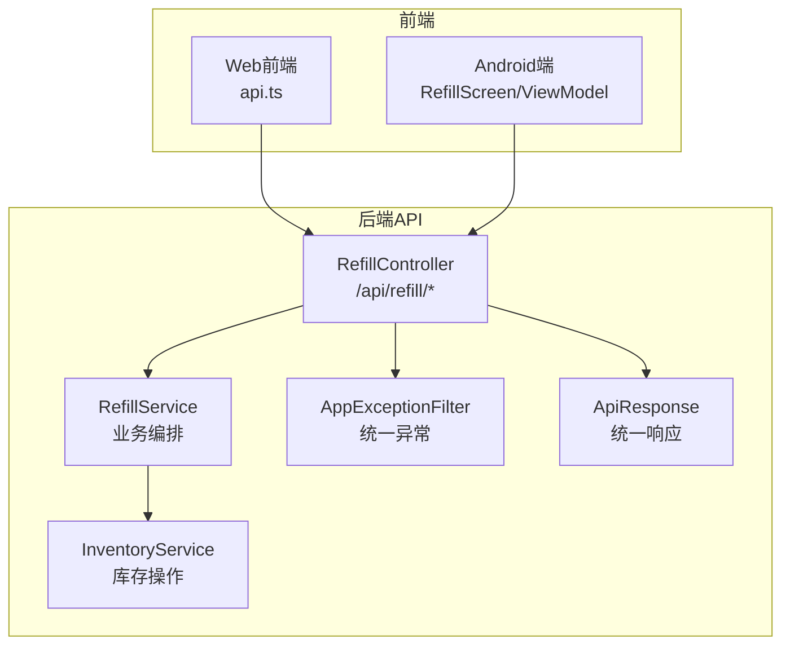
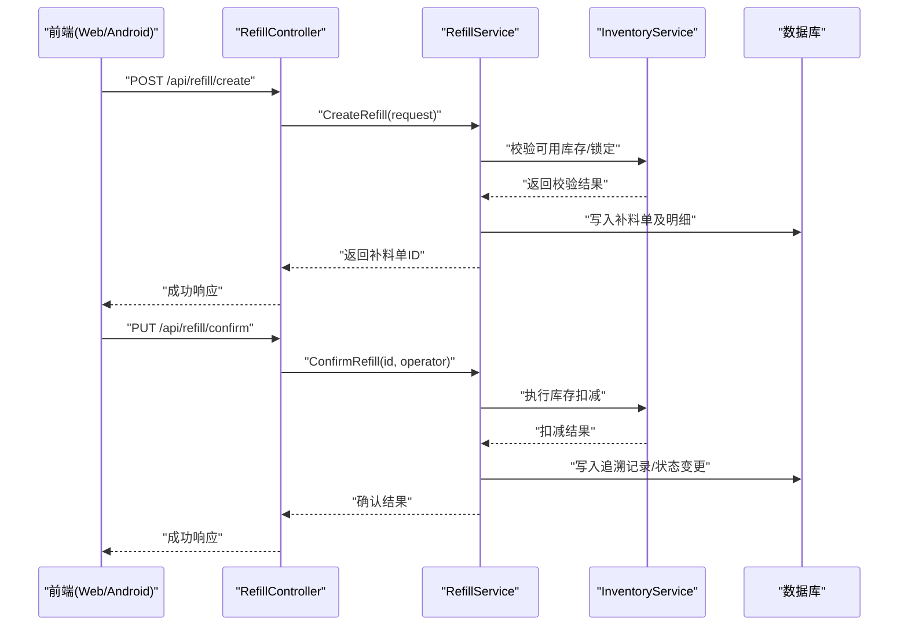
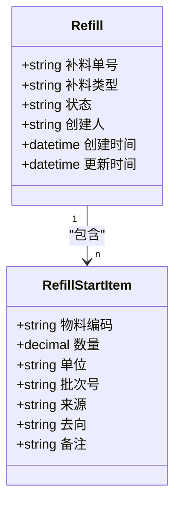
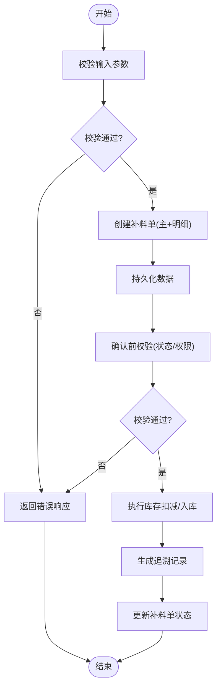
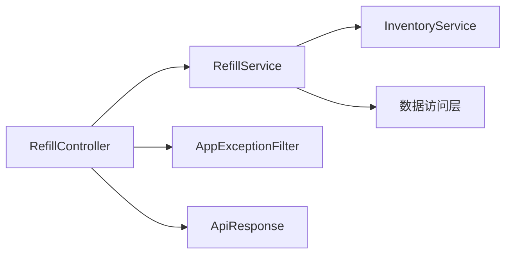

# 补料作业接口

<cite>
**本文引用的文件**   
- [RefillController.cs](file://dip-system/api/Controllers/RefillController.cs)
- [RefillService.cs](file://dip-system/api/Services/RefillService.cs)
- [Refill.cs](file://dip-system/api/Models/Refill.cs)
- [RefillStartItem.cs](file://dip-system/api/Models/RefillStartItem.cs)
- [InventoryService.cs](file://dip-system/api/Services/InventoryService.cs)
- [AppExceptionFilter.cs](file://dip-system/api/Controllers/AppExceptionFilter.cs)
- [ApiResponse.cs](file://dip-system/api/Models/ApiResponse.cs)
- [Program.cs](file://dip-system/api/Program.cs)
- [api.ts](file://dip-system/frontend-web/src/lib/api.ts)
- [RefillScreen.kt](file://mobile-android/app/src/main/java/com/dip/material/ui/refill/RefillScreen.kt)
- [RefillViewModel.kt](file://mobile-android/app/src/main/java/com/dip/material/ui/refill/RefillViewModel.kt)
</cite>

## 目录
1. [简介](#简介)
2. [项目结构](#项目结构)
3. [核心组件](#核心组件)
4. [架构总览](#架构总览)
5. [详细组件分析](#详细组件分析)
6. [依赖关系分析](#依赖关系分析)
7. [性能考虑](#性能考虑)
8. [故障排查指南](#故障排查指南)
9. [结论](#结论)
10. [附录](#附录)

## 简介
本文件为DIP系统“补料作业”相关API的权威文档，覆盖生产过程中的物料补充、余料回收、批次切换等典型业务场景。文档详细说明以下接口与流程：
- POST /api/refill/create：创建补料单
- GET /api/refill/list：查询补料记录
- PUT /api/refill/confirm：确认补料（触发库存扣减与追溯）

同时定义关键字段规范（补料类型、物料编码、数量单位、批次号等），并说明库存扣减、质量检验、追溯记录的实现要点，以及与WMS系统的库存同步机制和实时数据更新策略。

## 项目结构
补料作业功能在后端采用控制器-服务-模型的分层设计，前端提供Web与移动端界面调用同一套API。关键路径如下：
- 控制器：处理HTTP请求与参数校验
- 服务层：封装业务逻辑（创建、查询、确认、库存联动）
- 模型层：定义实体与DTO
- 异常过滤器：统一错误响应格式
- 前端：Web与移动端通过REST API调用

图表来源
- [RefillController.cs](file://dip-system/api/Controllers/RefillController.cs)
- [RefillService.cs](file://dip-system/api/Services/RefillService.cs)
- [InventoryService.cs](file://dip-system/api/Services/InventoryService.cs)
- [AppExceptionFilter.cs](file://dip-system/api/Controllers/AppExceptionFilter.cs)
- [ApiResponse.cs](file://dip-system/api/Models/ApiResponse.cs)
- [api.ts](file://dip-system/frontend-web/src/lib/api.ts)
- [RefillScreen.kt](file://mobile-android/app/src/main/java/com/dip/material/ui/refill/RefillScreen.kt)
- [RefillViewModel.kt](file://mobile-android/app/src/main/java/com/dip/material/ui/refill/RefillViewModel.kt)

章节来源
- [Program.cs](file://dip-system/api/Program.cs)

## 核心组件
- 控制器 RefillController：暴露补料作业的REST接口，负责入参校验、路由分发与结果返回。
- 服务 RefillService：实现补料单创建、查询、确认等业务编排；协调库存服务完成扣减与追溯。
- 模型 Refill/RefillStartItem：定义补料主表与明细项的数据结构与约束。
- 库存服务 InventoryService：提供库存查询、扣减、回滚等操作，保障事务一致性。
- 异常过滤器 AppExceptionFilter：捕获未处理异常，转换为统一 ApiResponse。
- 统一响应 ApiResponse：标准化成功/失败响应体，便于前后端一致消费。

章节来源
- [RefillController.cs](file://dip-system/api/Controllers/RefillController.cs)
- [RefillService.cs](file://dip-system/api/Services/RefillService.cs)
- [Refill.cs](file://dip-system/api/Models/Refill.cs)
- [RefillStartItem.cs](file://dip-system/api/Models/RefillStartItem.cs)
- [InventoryService.cs](file://dip-system/api/Services/InventoryService.cs)
- [AppExceptionFilter.cs](file://dip-system/api/Controllers/AppExceptionFilter.cs)
- [ApiResponse.cs](file://dip-system/api/Models/ApiResponse.cs)

## 架构总览
补料作业的核心调用链从控制器到服务再到库存服务，最终落库并生成追溯记录。异常由全局过滤器统一拦截并返回标准错误体。

图表来源
- [RefillController.cs](file://dip-system/api/Controllers/RefillController.cs)
- [RefillService.cs](file://dip-system/api/Services/RefillService.cs)
- [InventoryService.cs](file://dip-system/api/Services/InventoryService.cs)

## 详细组件分析

### 接口规范
- 创建补料单
  - 方法：POST
  - 路径：/api/refill/create
  - 用途：新建补料单，支持多行明细（物料、数量、单位、批次、来源/去向等）
  - 输入字段（示例）：
    - 补料类型：生产补料、余料回收、批次切换
    - 物料编码：唯一标识
    - 数量：数值
    - 单位：如PCS、KG、M等
    - 批次号：用于追溯
    - 关联工单/订单号：可选
    - 备注：可选
  - 输出：补料单ID、状态、时间戳等

- 查询补料记录
  - 方法：GET
  - 路径：/api/refill/list
  - 用途：按条件分页查询补料单列表（物料、时间范围、状态、批次等）
  - 输入参数：页码、每页大小、筛选条件
  - 输出：补料单集合、总数、分页信息

- 确认补料
  - 方法：PUT
  - 路径：/api/refill/confirm
  - 用途：对已创建的补料单进行确认，触发库存扣减与追溯记录
  - 输入：补料单ID、操作员、确认原因（可选）
  - 输出：确认结果、受影响库存条目、追溯记录ID

章节来源
- [RefillController.cs](file://dip-system/api/Controllers/RefillController.cs)
- [RefillService.cs](file://dip-system/api/Services/RefillService.cs)
- [ApiResponse.cs](file://dip-system/api/Models/ApiResponse.cs)

### 数据模型
- 补料主表 Refill
  - 关键字段：补料单号、补料类型、状态、创建人、创建时间、更新时间
- 补料明细 RefillStartItem
  - 关键字段：物料编码、数量、单位、批次号、来源/去向、备注

图表来源
- [Refill.cs](file://dip-system/api/Models/Refill.cs)
- [RefillStartItem.cs](file://dip-system/api/Models/RefillStartItem.cs)

### 业务流程
- 创建补料单
  - 校验必填字段与数据类型
  - 校验物料编码有效性、单位合法性
  - 预检查库存可用性（可选）
  - 持久化主表与明细
  - 返回补料单ID

- 确认补料
  - 校验补料单存在且处于可确认状态
  - 执行库存扣减（或根据业务规则扣减/入库）
  - 生成追溯记录（含物料、批次、数量、操作人、时间）
  - 更新补料单状态为已确认
  - 返回确认结果与影响统计

图表来源
- [RefillService.cs](file://dip-system/api/Services/RefillService.cs)
- [InventoryService.cs](file://dip-system/api/Services/InventoryService.cs)

### 与WMS系统的库存同步机制与实时数据更新策略
- 库存扣减时机：在确认补料时执行，确保业务原子性
- 同步策略：
  - 本地优先：先落库再同步WMS，保证数据不丢失
  - 重试机制：对WMS同步失败进行指数退避重试
  - 补偿任务：定时扫描未同步成功的记录进行补偿
- 实时性：
  - 使用事件或消息队列通知WMS（若集成）
  - 若无消息中间件，采用短轮询或增量拉取方式
- 一致性：
  - 对库存操作加锁，避免并发冲突
  - 记录操作流水，便于对账与审计

章节来源
- [InventoryService.cs](file://dip-system/api/Services/InventoryService.cs)
- [RefillService.cs](file://dip-system/api/Services/RefillService.cs)

### 质量检验与追溯记录
- 质量检验：可在确认前或确认后触发，依据企业流程配置
- 追溯记录：包含物料、批次、数量、操作人、时间、关联工单/订单等
- 追溯查询：通过补料单号、物料编码、批次号等多维度检索

章节来源
- [RefillService.cs](file://dip-system/api/Services/RefillService.cs)
- [Refill.cs](file://dip-system/api/Models/Refill.cs)
- [RefillStartItem.cs](file://dip-system/api/Models/RefillStartItem.cs)

### 前端调用示例（概念性）
- Web端通过api.ts封装REST调用，发起创建、查询、确认请求
- Android端通过RefillScreen与RefillViewModel组织UI与网络请求

章节来源
- [api.ts](file://dip-system/frontend-web/src/lib/api.ts)
- [RefillScreen.kt](file://mobile-android/app/src/main/java/com/dip/material/ui/refill/RefillScreen.kt)
- [RefillViewModel.kt](file://mobile-android/app/src/main/java/com/dip/material/ui/refill/RefillViewModel.kt)

## 依赖关系分析
- 控制器依赖服务层，服务层依赖库存服务与数据访问层
- 异常过滤器全局生效，统一错误响应格式
- 前端依赖后端API契约，保持字段与状态一致

图表来源
- [RefillController.cs](file://dip-system/api/Controllers/RefillController.cs)
- [RefillService.cs](file://dip-system/api/Services/RefillService.cs)
- [InventoryService.cs](file://dip-system/api/Services/InventoryService.cs)
- [AppExceptionFilter.cs](file://dip-system/api/Controllers/AppExceptionFilter.cs)
- [ApiResponse.cs](file://dip-system/api/Models/ApiResponse.cs)

## 性能考虑
- 批量操作：创建补料单时尽量合并明细，减少往返次数
- 索引优化：对物料编码、批次号、补料单号建立索引，提升查询效率
- 事务边界：确认补料涉及库存扣减与追溯记录，需在同一事务中提交
- 缓存策略：对字典数据（单位、补料类型）进行缓存，降低重复查询开销
- 异步处理：对非关键路径（如WMS同步）采用异步或消息队列，避免阻塞主流程

[本节为通用指导，无需特定文件引用]

## 故障排查指南
- 常见错误
  - 参数缺失或类型错误：检查请求体字段与类型
  - 物料编码不存在：核对基础数据是否维护完整
  - 库存不足：检查可用库存与锁定情况
  - 状态不一致：确认补料单当前状态是否允许确认
- 定位步骤
  - 查看统一错误响应体，获取错误码与描述
  - 检查日志中的异常堆栈与上下文信息
  - 核对数据库记录与WMS同步状态
- 恢复建议
  - 修正参数后重试
  - 补齐基础数据或调整库存
  - 对失败的WMS同步进行补偿

章节来源
- [AppExceptionFilter.cs](file://dip-system/api/Controllers/AppExceptionFilter.cs)
- [ApiResponse.cs](file://dip-system/api/Models/ApiResponse.cs)

## 结论
补料作业API围绕“创建-查询-确认”的主流程，结合库存扣减、质量检验与追溯记录，形成完整的闭环管理。通过统一的异常处理与响应格式，确保前后端交互稳定可靠。与WMS的同步机制采用本地优先、重试与补偿策略，保障数据一致性与实时性。建议在实施中关注索引优化、事务边界与异步处理，以提升系统性能与稳定性。

[本节为总结性内容，无需特定文件引用]

## 附录
- 字段字典
  - 补料类型：生产补料、余料回收、批次切换
  - 单位：PCS、KG、M等（以基础数据为准）
  - 状态：草稿、已确认、已取消等（以枚举定义为准）
- 参考实现
  - 控制器与服务层实现路径见“核心组件”章节
  - 前端调用封装见“前端调用示例（概念性）”章节

[本节为补充信息，无需特定文件引用]