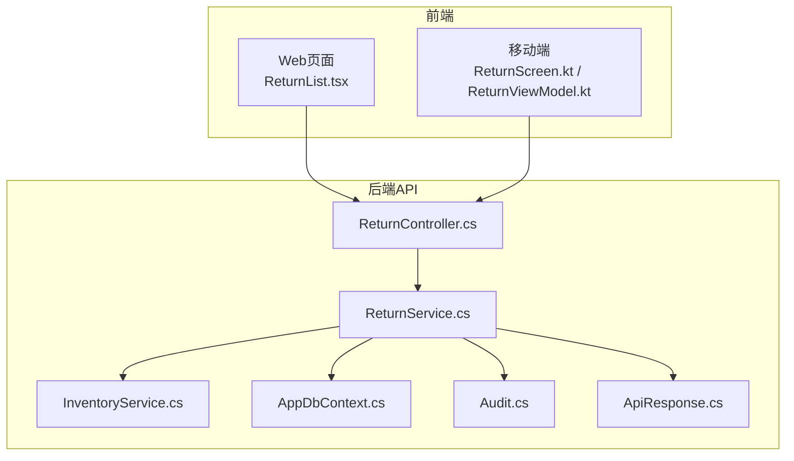
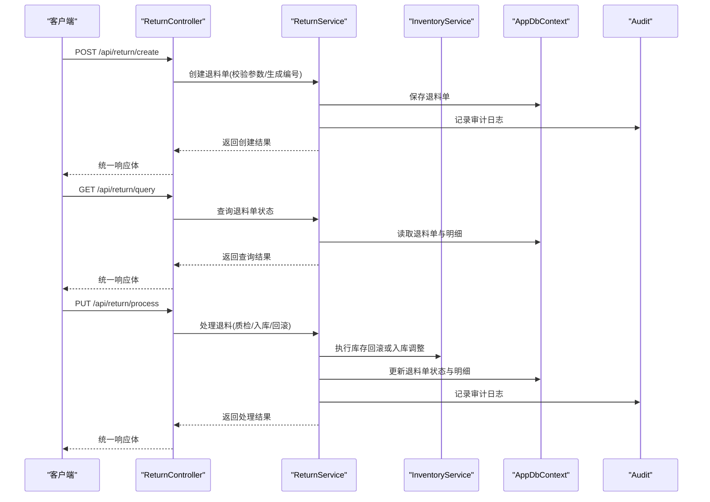
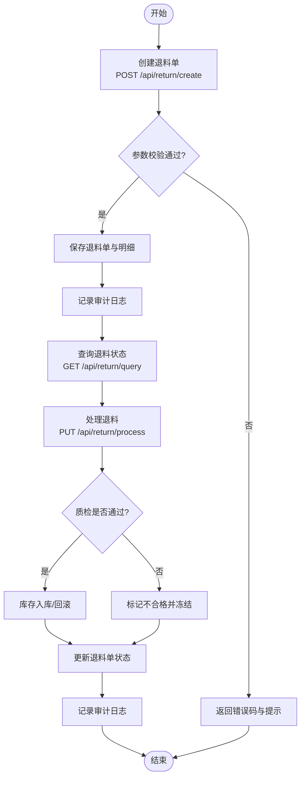
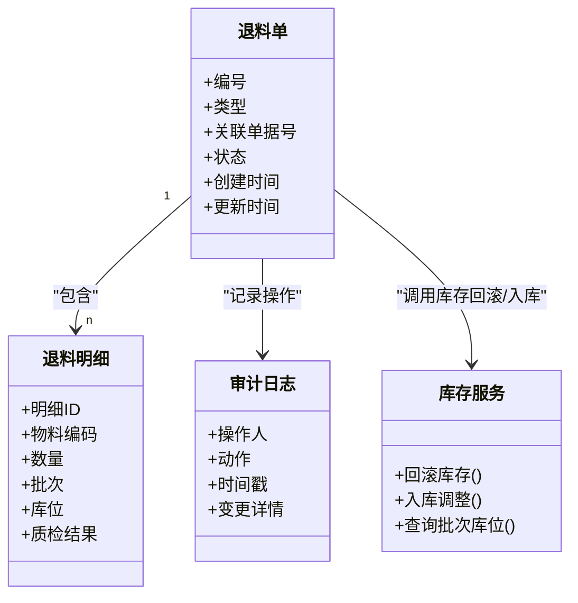
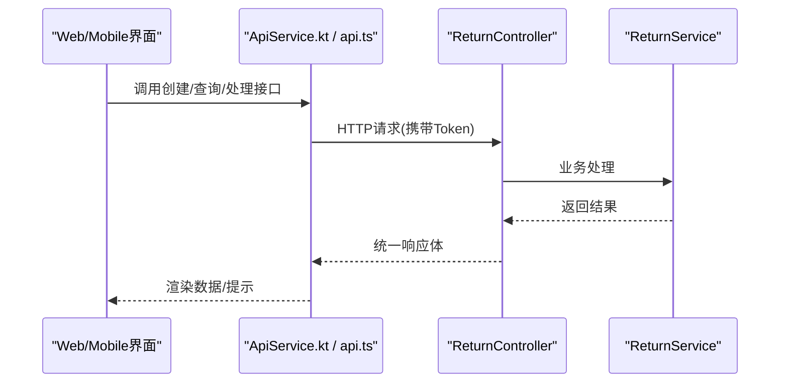
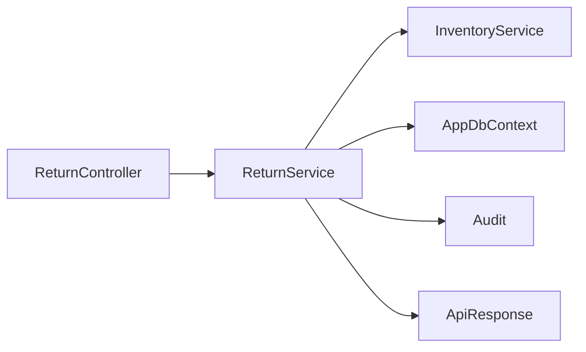

# 退料作业接口

<cite>
**本文引用的文件**   
- [ReturnController.cs](file://dip-system/api/Controllers/ReturnController.cs)
- [ReturnService.cs](file://dip-system/api/Services/ReturnService.cs)
- [Return.cs](file://dip-system/api/Models/Return.cs)
- [InventoryService.cs](file://dip-system/api/Services/InventoryService.cs)
- [Audit.cs](file://dip-system/api/Models/Audit.cs)
- [AppDbContext.cs](file://dip-system/api/Data/AppDbContext.cs)
- [ApiResponse.cs](file://dip-system/api/Models/ApiResponse.cs)
- [Program.cs](file://dip-system/api/Program.cs)
- [ReturnList.tsx](file://dip-system/frontend-web/src/pages/ReturnList.tsx)
- [api.ts](file://dip-system/frontend-web/src/lib/api.ts)
- [ReturnScreen.kt](file://mobile-android/app/src/main/java/com/dip/material/ui/return_/ReturnScreen.kt)
- [ReturnViewModel.kt](file://mobile-android/app/src/main/java/com/dip/material/ui/return_/ReturnViewModel.kt)
- [ApiService.kt](file://mobile-android/app/src/main/java/com/dip/material/data/network/ApiService.kt)
</cite>

## 目录
1. [简介](#简介)
2. [项目结构](#项目结构)
3. [核心组件](#核心组件)
4. [架构总览](#架构总览)
5. [详细组件分析](#详细组件分析)
6. [依赖关系分析](#依赖关系分析)
7. [性能考虑](#性能考虑)
8. [故障排查指南](#故障排查指南)
9. [结论](#结论)
10. [附录](#附录)

## 简介
本文件面向DIP系统的“退料作业”能力，围绕生产剩余物料退回、不良品退货、订单取消退料等典型场景，系统化文档化API设计、业务规则与操作流程。重点覆盖：
- 接口定义：POST /api/return/create（创建退料单）、GET /api/return/query（查询退料状态）、PUT /api/return/process（处理退料）
- 业务规则：退料原因分类、物料状态判定、质检要求
- 库存与财务：库存回滚策略、财务影响与ERP对接要点
- 审计追踪：操作留痕、数据一致性保障
- 标准操作流程与异常处理方案

## 项目结构
退料作业在DIP系统中采用前后端分离的架构：
- 后端：ASP.NET Core API，控制器层负责路由与参数校验，服务层封装业务逻辑，模型层定义实体与响应结构，数据访问通过EF Core上下文完成
- 前端Web：React + TypeScript页面调用API，提供退料单列表与操作入口
- 移动端Android：Kotlin界面与ViewModel调用统一API服务，支持扫码与表单录入

图表来源
- [ReturnController.cs](file://dip-system/api/Controllers/ReturnController.cs)
- [ReturnService.cs](file://dip-system/api/Services/ReturnService.cs)
- [InventoryService.cs](file://dip-system/api/Services/InventoryService.cs)
- [AppDbContext.cs](file://dip-system/api/Data/AppDbContext.cs)
- [Audit.cs](file://dip-system/api/Models/Audit.cs)
- [ApiResponse.cs](file://dip-system/api/Models/ApiResponse.cs)
- [ReturnList.tsx](file://dip-system/frontend-web/src/pages/ReturnList.tsx)
- [ReturnScreen.kt](file://mobile-android/app/src/main/java/com/dip/material/ui/return_/ReturnScreen.kt)
- [ReturnViewModel.kt](file://mobile-android/app/src/main/java/com/dip/material/ui/return_/ReturnViewModel.kt)

章节来源
- [Program.cs](file://dip-system/api/Program.cs)
- [ReturnController.cs](file://dip-system/api/Controllers/ReturnController.cs)
- [ReturnService.cs](file://dip-system/api/Services/ReturnService.cs)
- [Return.cs](file://dip-system/api/Models/Return.cs)
- [ApiResponse.cs](file://dip-system/api/Models/ApiResponse.cs)

## 核心组件
- 控制器层（ReturnController）：暴露RESTful接口，接收请求参数并委托服务层处理，返回统一响应体
- 服务层（ReturnService）：实现退料单生命周期管理、业务规则校验、库存回滚、质检流程触发、审计记录写入
- 模型层（Return、Audit、ApiResponse）：定义退料单实体、审计日志结构与统一响应格式
- 库存服务（InventoryService）：提供库存扣减/回滚、批次与库位信息维护
- 数据访问（AppDbContext）：基于EF Core的数据持久化与事务边界控制

章节来源
- [ReturnController.cs](file://dip-system/api/Controllers/ReturnController.cs)
- [ReturnService.cs](file://dip-system/api/Services/ReturnService.cs)
- [Return.cs](file://dip-system/api/Models/Return.cs)
- [Audit.cs](file://dip-system/api/Models/Audit.cs)
- [ApiResponse.cs](file://dip-system/api/Models/ApiResponse.cs)
- [InventoryService.cs](file://dip-system/api/Services/InventoryService.cs)
- [AppDbContext.cs](file://dip-system/api/Data/AppDbContext.cs)

## 架构总览
退料作业的关键交互包括创建、查询、处理三大动作，贯穿控制器、服务、库存与审计模块。

图表来源
- [ReturnController.cs](file://dip-system/api/Controllers/ReturnController.cs)
- [ReturnService.cs](file://dip-system/api/Services/ReturnService.cs)
- [InventoryService.cs](file://dip-system/api/Services/InventoryService.cs)
- [AppDbContext.cs](file://dip-system/api/Data/AppDbContext.cs)
- [Audit.cs](file://dip-system/api/Models/Audit.cs)

## 详细组件分析

### 接口设计与调用流程
- POST /api/return/create
  - 用途：创建退料单，支持生产剩余物料退回、不良品退货、订单取消退料等场景
  - 输入：退料类型、关联单据号（如工单/采购单/销售单）、物料清单（物料编码、数量、批次、库位）、退料原因、备注
  - 输出：统一响应体，包含退料单号、状态、明细ID集合
  - 校验：必填字段、数量合法性、关联单据存在性、退料原因有效性
- GET /api/return/query
  - 用途：按条件查询退料单及明细状态
  - 输入：退料单号、物料编码、时间范围、状态筛选
  - 输出：分页列表与统计摘要
- PUT /api/return/process
  - 用途：处理退料，触发质检、入库、库存回滚与财务影响
  - 输入：退料单号、处理动作（质检通过/不通过、确认入库、撤销处理）、质检结果与附件
  - 输出：统一响应体，包含处理结果与后续建议

图表来源
- [ReturnController.cs](file://dip-system/api/Controllers/ReturnController.cs)
- [ReturnService.cs](file://dip-system/api/Services/ReturnService.cs)
- [InventoryService.cs](file://dip-system/api/Services/InventoryService.cs)
- [Audit.cs](file://dip-system/api/Models/Audit.cs)

章节来源
- [ReturnController.cs](file://dip-system/api/Controllers/ReturnController.cs)
- [ReturnService.cs](file://dip-system/api/Services/ReturnService.cs)
- [ApiResponse.cs](file://dip-system/api/Models/ApiResponse.cs)

### 业务规则与数据模型
- 退料原因分类
  - 生产剩余物料退回：工单完工后余料退回仓库
  - 不良品退货：来料或制程不良导致的退货
  - 订单取消退料：销售或采购订单取消引发的退料
- 物料状态判定
  - 可用/待检/冻结/报废等状态流转，受质检结果与业务规则约束
- 质检要求
  - 关键物料需强制质检；质检通过方可入库，不通过则冻结并触发返工或报废流程
- 数据模型关系
  - 退料单主表与明细表一对多；审计日志独立记录操作轨迹；库存服务提供批次与库位信息

图表来源
- [Return.cs](file://dip-system/api/Models/Return.cs)
- [Audit.cs](file://dip-system/api/Models/Audit.cs)
- [InventoryService.cs](file://dip-system/api/Services/InventoryService.cs)

章节来源
- [Return.cs](file://dip-system/api/Models/Return.cs)
- [Audit.cs](file://dip-system/api/Models/Audit.cs)
- [InventoryService.cs](file://dip-system/api/Services/InventoryService.cs)

### 前端与移动端集成
- Web端（ReturnList.tsx）
  - 提供退料单列表展示、状态筛选、创建与处理入口
  - 调用统一API封装方法，处理分页与错误提示
- 移动端（ReturnScreen.kt / ReturnViewModel.kt）
  - 支持扫码录入物料、表单提交、状态刷新
  - 通过ApiService.kt发起HTTP请求，统一鉴权与重试

图表来源
- [ReturnList.tsx](file://dip-system/frontend-web/src/pages/ReturnList.tsx)
- [api.ts](file://dip-system/frontend-web/src/lib/api.ts)
- [ReturnScreen.kt](file://mobile-android/app/src/main/java/com/dip/material/ui/return_/ReturnScreen.kt)
- [ReturnViewModel.kt](file://mobile-android/app/src/main/java/com/dip/material/ui/return_/ReturnViewModel.kt)
- [ApiService.kt](file://mobile-android/app/src/main/java/com/dip/material/data/network/ApiService.kt)
- [ReturnController.cs](file://dip-system/api/Controllers/ReturnController.cs)
- [ReturnService.cs](file://dip-system/api/Services/ReturnService.cs)

章节来源
- [ReturnList.tsx](file://dip-system/frontend-web/src/pages/ReturnList.tsx)
- [api.ts](file://dip-system/frontend-web/src/lib/api.ts)
- [ReturnScreen.kt](file://mobile-android/app/src/main/java/com/dip/material/ui/return_/ReturnScreen.kt)
- [ReturnViewModel.kt](file://mobile-android/app/src/main/java/com/dip/material/ui/return_/ReturnViewModel.kt)
- [ApiService.kt](file://mobile-android/app/src/main/java/com/dip/material/data/network/ApiService.kt)

## 依赖关系分析
- 控制器依赖服务层，服务层依赖库存服务、数据上下文与审计模块
- 统一响应体贯穿所有接口，便于前端一致化处理
- 数据库上下文提供事务边界，确保退料单、库存与审计的一致性

图表来源
- [ReturnController.cs](file://dip-system/api/Controllers/ReturnController.cs)
- [ReturnService.cs](file://dip-system/api/Services/ReturnService.cs)
- [InventoryService.cs](file://dip-system/api/Services/InventoryService.cs)
- [AppDbContext.cs](file://dip-system/api/Data/AppDbContext.cs)
- [Audit.cs](file://dip-system/api/Models/Audit.cs)
- [ApiResponse.cs](file://dip-system/api/Models/ApiResponse.cs)

章节来源
- [ReturnController.cs](file://dip-system/api/Controllers/ReturnController.cs)
- [ReturnService.cs](file://dip-system/api/Services/ReturnService.cs)
- [InventoryService.cs](file://dip-system/api/Services/InventoryService.cs)
- [AppDbContext.cs](file://dip-system/api/Data/AppDbContext.cs)
- [Audit.cs](file://dip-system/api/Models/Audit.cs)
- [ApiResponse.cs](file://dip-system/api/Models/ApiResponse.cs)

## 性能考虑
- 查询接口支持分页与索引优化，避免全表扫描
- 批量处理时采用事务合并，减少数据库往返
- 库存回滚与入库调整使用批处理更新，降低锁竞争
- 审计日志异步写入，避免阻塞主流程

[本节为通用指导，无需特定文件引用]

## 故障排查指南
- 常见错误
  - 参数校验失败：检查必填字段、数量合法性、关联单据是否存在
  - 库存不足：核对批次与库位信息，确认可用库存
  - 质检未通过：查看质检结果与冻结状态，触发返工或报废流程
- 审计追踪
  - 通过审计日志定位操作人与时间戳，回溯变更详情
- 数据一致性
  - 检查事务边界与回滚点，确保退料单、库存与审计同步

章节来源
- [ReturnService.cs](file://dip-system/api/Services/ReturnService.cs)
- [Audit.cs](file://dip-system/api/Models/Audit.cs)
- [InventoryService.cs](file://dip-system/api/Services/InventoryService.cs)

## 结论
退料作业API以清晰的职责分层与统一的响应体设计，支撑生产剩余物料退回、不良品退货、订单取消退料等核心场景。通过严格的业务规则、质检流程、库存回滚与审计追踪，保障数据一致性与可追溯性。结合前后端一体化集成，形成完整的退料作业闭环。

[本节为总结性内容，无需特定文件引用]

## 附录
- 标准操作流程
  - 创建退料单：选择退料类型、填写物料与数量、选择退料原因
  - 质检与处理：根据质检结果决定入库或冻结，必要时触发返工/报废
  - 库存与财务：执行库存回滚与入库调整，记录财务影响
  - 审计与对账：审计日志完整记录，支持对账与追溯
- ERP对接要点
  - 财务凭证生成：退料入库/回滚触发财务分录
  - 数据一致性：通过事务与补偿机制保证跨系统一致性
  - 接口幂等：确保重复调用不会产生副作用

[本节为补充说明，无需特定文件引用]