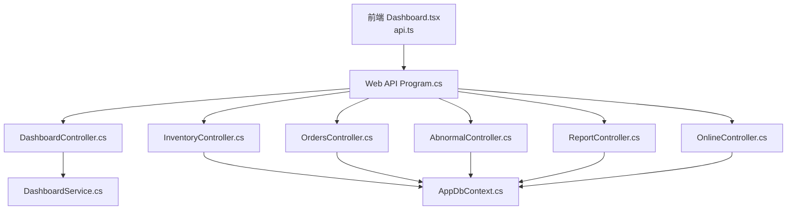
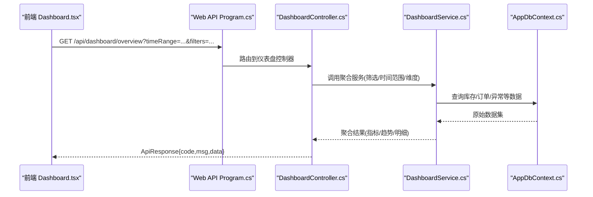
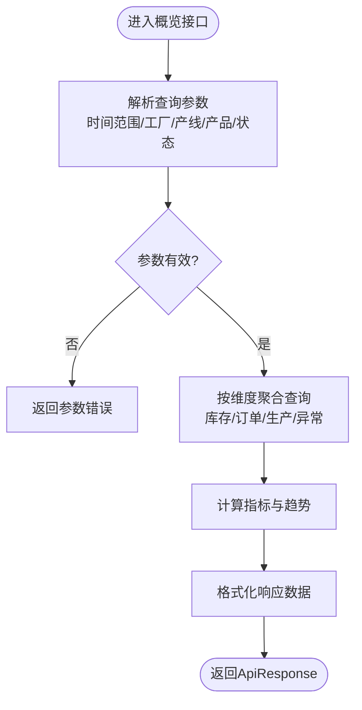
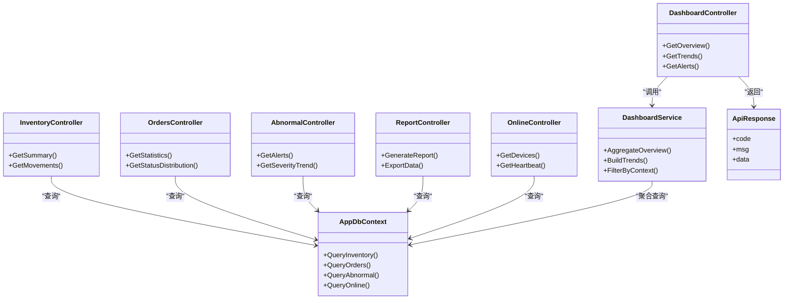

# 仪表盘接口

<cite>
**本文引用的文件**   
- [DashboardController.cs](file://dip-system/api/Controllers/DashboardController.cs)
- [DashboardService.cs](file://dip-system/api/Services/DashboardService.cs)
- [InventoryController.cs](file://dip-system/api/Controllers/InventoryController.cs)
- [OrdersController.cs](file://dip-system/api/Controllers/OrdersController.cs)
- [AbnormalController.cs](file://dip-system/api/Controllers/AbnormalController.cs)
- [ReportController.cs](file://dip-system/api/Controllers/ReportController.cs)
- [OnlineController.cs](file://dip-system/api/Controllers/OnlineController.cs)
- [AuthController.cs](file://dip-system/api/Controllers/AuthController.cs)
- [ApiResponse.cs](file://dip-system/api/Models/ApiResponse.cs)
- [AppDbContext.cs](file://dip-system/api/Data/AppDbContext.cs)
- [Program.cs](file://dip-system/api/Program.cs)
- [appsettings.json](file://dip-system/api/appsettings.json)
- [Dashboard.tsx](file://dip-system/frontend-web/src/pages/Dashboard.tsx)
- [api.ts](file://dip-system/frontend-web/src/lib/api.ts)
</cite>

## 目录
1. [简介](#简介)
2. [项目结构](#项目结构)
3. [核心组件](#核心组件)
4. [架构总览](#架构总览)
5. [详细组件分析](#详细组件分析)
6. [依赖关系分析](#依赖关系分析)
7. [性能考虑](#性能考虑)
8. [故障排查指南](#故障排查指南)
9. [结论](#结论)
10. [附录](#附录)

## 简介
本文件为DIP系统“仪表盘”功能的API文档，覆盖实时数据展示、统计图表生成与关键指标监控的HTTP接口。重点说明库存概览、订单统计、生产进度、异常预警等数据聚合接口的实现方式，包含数据筛选、时间范围查询、多维度分析的接口规范；提供图表数据格式化、自定义报表生成、数据导出的示例路径；并说明实时数据推送、WebSocket连接与刷新机制的设计建议。同时给出权限过滤、数据隔离与性能优化策略，帮助前后端开发者快速集成与扩展。

## 项目结构
后端采用ASP.NET Core Web API，控制器层负责HTTP路由与参数校验，服务层封装业务逻辑与数据访问，模型层定义统一响应格式与实体。前端使用React + TypeScript，通过统一的API客户端调用后端接口，并在仪表盘页面进行数据渲染与交互。

**图示来源** 
- [Program.cs](file://dip-system/api/Program.cs)
- [DashboardController.cs](file://dip-system/api/Controllers/DashboardController.cs)
- [DashboardService.cs](file://dip-system/api/Services/DashboardService.cs)
- [InventoryController.cs](file://dip-system/api/Controllers/InventoryController.cs)
- [OrdersController.cs](file://dip-system/api/Controllers/OrdersController.cs)
- [AbnormalController.cs](file://dip-system/api/Controllers/AbnormalController.cs)
- [ReportController.cs](file://dip-system/api/Controllers/ReportController.cs)
- [OnlineController.cs](file://dip-system/api/Controllers/OnlineController.cs)
- [AppDbContext.cs](file://dip-system/api/Data/AppDbContext.cs)

**章节来源**
- [Program.cs](file://dip-system/api/Program.cs)
- [DashboardController.cs](file://dip-system/api/Controllers/DashboardController.cs)
- [DashboardService.cs](file://dip-system/api/Services/DashboardService.cs)
- [InventoryController.cs](file://dip-system/api/Controllers/InventoryController.cs)
- [OrdersController.cs](file://dip-system/api/Controllers/OrdersController.cs)
- [AbnormalController.cs](file://dip-system/api/Controllers/AbnormalController.cs)
- [ReportController.cs](file://dip-system/api/Controllers/ReportController.cs)
- [OnlineController.cs](file://dip-system/api/Controllers/OnlineController.cs)
- [AppDbContext.cs](file://dip-system/api/Data/AppDbContext.cs)
- [Dashboard.tsx](file://dip-system/frontend-web/src/pages/Dashboard.tsx)
- [api.ts](file://dip-system/frontend-web/src/lib/api.ts)

## 核心组件
- 控制器层：DashboardController、InventoryController、OrdersController、AbnormalController、ReportController、OnlineController 暴露REST接口，处理请求参数、鉴权与返回统一响应。
- 服务层：DashboardService 聚合多源数据，计算关键指标（库存、订单、生产、异常），并提供筛选与分页能力。
- 数据访问：AppDbContext 作为EF Core上下文，提供仓储式查询与事务支持。
- 统一响应：ApiResponse 封装成功/失败结构与错误信息。
- 前端：Dashboard.tsx 与 api.ts 负责调用接口、数据转换与图表渲染。

**章节来源**
- [DashboardController.cs](file://dip-system/api/Controllers/DashboardController.cs)
- [DashboardService.cs](file://dip-system/api/Services/DashboardService.cs)
- [InventoryController.cs](file://dip-system/api/Controllers/InventoryController.cs)
- [OrdersController.cs](file://dip-system/api/Controllers/OrdersController.cs)
- [AbnormalController.cs](file://dip-system/api/Controllers/AbnormalController.cs)
- [ReportController.cs](file://dip-system/api/Controllers/ReportController.cs)
- [OnlineController.cs](file://dip-system/api/Controllers/OnlineController.cs)
- [AppDbContext.cs](file://dip-system/api/Data/AppDbContext.cs)
- [ApiResponse.cs](file://dip-system/api/Models/ApiResponse.cs)
- [Dashboard.tsx](file://dip-system/frontend-web/src/pages/Dashboard.tsx)
- [api.ts](file://dip-system/frontend-web/src/lib/api.ts)

## 架构总览
仪表盘API遵循分层架构：控制器接收HTTP请求，服务层聚合业务逻辑与数据访问，数据库通过EF Core访问。统一响应体确保前后端契约一致。鉴权由认证中间件与控制器级过滤器保障，必要时结合用户角色与租户ID做数据隔离。

**图示来源** 
- [Program.cs](file://dip-system/api/Program.cs)
- [DashboardController.cs](file://dip-system/api/Controllers/DashboardController.cs)
- [DashboardService.cs](file://dip-system/api/Services/DashboardService.cs)
- [AppDbContext.cs](file://dip-system/api/Data/AppDbContext.cs)

## 详细组件分析

### 仪表盘概览接口（库存、订单、生产、异常）
- 功能：汇总库存概览、订单统计、生产进度、异常预警等关键指标，支持时间范围与多维筛选。
- 典型请求：GET /api/dashboard/overview?startDate=&endDate=&plantId=&lineId=&productCode=&status=...
- 返回：统一响应体，包含指标数值、趋势数组、明细列表与分页信息。
- 数据流：控制器解析参数 -> 服务层聚合查询 -> EF Core执行SQL -> 返回聚合结果。

**图示来源** 
- [DashboardController.cs](file://dip-system/api/Controllers/DashboardController.cs)
- [DashboardService.cs](file://dip-system/api/Services/DashboardService.cs)

**章节来源**
- [DashboardController.cs](file://dip-system/api/Controllers/DashboardController.cs)
- [DashboardService.cs](file://dip-system/api/Services/DashboardService.cs)

### 库存概览接口
- 功能：按仓库/库位/物料维度统计当前库存、在途、预留、可用量等。
- 典型请求：GET /api/inventory/summary?warehouseId=&locationId=&materialCode=&dateFrom=&dateTo=
- 返回：库存总量、分类占比、变动趋势与明细分页。

**章节来源**
- [InventoryController.cs](file://dip-system/api/Controllers/InventoryController.cs)

### 订单统计接口
- 功能：统计订单数量、完成率、延期率、按产品/客户/状态的分布。
- 典型请求：GET /api/orders/statistics?plantId=&customerId=&productCode=&status=&dateFrom=&dateTo=
- 返回：指标汇总、趋势图数据、明细列表与分页。

**章节来源**
- [OrdersController.cs](file://dip-system/api/Controllers/OrdersController.cs)

### 异常预警接口
- 功能：汇总设备异常、质量异常、缺料异常等事件，支持级别、类型、区域筛选。
- 典型请求：GET /api/abnormal/alerts?level=&type=&areaId=&dateFrom=&dateTo=&page=&size=
- 返回：预警计数、严重度分布、时间序列与事件明细。

**章节来源**
- [AbnormalController.cs](file://dip-system/api/Controllers/AbnormalController.cs)

### 在线设备与实时数据
- 功能：获取在线设备清单、心跳状态、实时采集点值。
- 典型请求：GET /api/online/devices?status=&areaId=
- 返回：设备列表、状态、最近心跳时间与采样数据快照。

**章节来源**
- [OnlineController.cs](file://dip-system/api/Controllers/OnlineController.cs)

### 报表导出与自定义报表
- 功能：生成自定义报表（Excel/PDF），支持筛选条件与模板选择。
- 典型请求：POST /api/report/generate {template, filters, format}
- 返回：下载链接或二进制流（根据format）。

**章节来源**
- [ReportController.cs](file://dip-system/api/Controllers/ReportController.cs)

### 鉴权与权限过滤
- 功能：JWT鉴权、角色/租户过滤、数据隔离（按工厂/产线/仓库）。
- 典型流程：登录获取Token -> 请求携带Authorization -> 控制器验证 -> 服务层按用户上下文过滤数据。

**章节来源**
- [AuthController.cs](file://dip-system/api/Controllers/AuthController.cs)
- [Program.cs](file://dip-system/api/Program.cs)

## 依赖关系分析
- 控制器依赖服务层，服务层依赖数据上下文。
- 统一响应体贯穿所有接口，保证前后端契约一致性。
- 鉴权中间件与过滤器在控制器前拦截，确保权限与数据隔离。

**图示来源** 
- [DashboardController.cs](file://dip-system/api/Controllers/DashboardController.cs)
- [DashboardService.cs](file://dip-system/api/Services/DashboardService.cs)
- [InventoryController.cs](file://dip-system/api/Controllers/InventoryController.cs)
- [OrdersController.cs](file://dip-system/api/Controllers/OrdersController.cs)
- [AbnormalController.cs](file://dip-system/api/Controllers/AbnormalController.cs)
- [ReportController.cs](file://dip-system/api/Controllers/ReportController.cs)
- [OnlineController.cs](file://dip-system/api/Controllers/OnlineController.cs)
- [AppDbContext.cs](file://dip-system/api/Data/AppDbContext.cs)
- [ApiResponse.cs](file://dip-system/api/Models/ApiResponse.cs)

**章节来源**
- [DashboardController.cs](file://dip-system/api/Controllers/DashboardController.cs)
- [DashboardService.cs](file://dip-system/api/Services/DashboardService.cs)
- [InventoryController.cs](file://dip-system/api/Controllers/InventoryController.cs)
- [OrdersController.cs](file://dip-system/api/Controllers/OrdersController.cs)
- [AbnormalController.cs](file://dip-system/api/Controllers/AbnormalController.cs)
- [ReportController.cs](file://dip-system/api/Controllers/ReportController.cs)
- [OnlineController.cs](file://dip-system/api/Controllers/OnlineController.cs)
- [AppDbContext.cs](file://dip-system/api/Data/AppDbContext.cs)
- [ApiResponse.cs](file://dip-system/api/Models/ApiResponse.cs)

## 性能考虑
- 查询优化：对常用筛选字段建立索引（时间、工厂、产线、产品、状态），避免全表扫描。
- 分页与限流：默认分页大小限制，防止大数据集拖垮接口；服务端可加限流保护。
- 缓存策略：热点指标（如库存总量、订单完成率）可使用内存缓存（IMemoryCache）降低DB压力。
- 异步处理：报表生成与导出采用异步任务，避免阻塞请求线程。
- 连接池：合理配置EF Core连接池与超时，避免连接耗尽。

[本节为通用指导，不直接分析具体文件]

## 故障排查指南
- 鉴权失败：检查Authorization头是否携带有效JWT，确认角色与租户上下文是否正确。
- 参数错误：核对时间范围、筛选条件是否符合约束，注意日期格式与时区。
- 数据为空：确认筛选维度是否存在数据，检查权限过滤是否过严导致无结果。
- 性能问题：查看慢查询日志，优化SQL与索引；评估是否需要引入缓存或分片。
- 实时推送：若使用WebSocket，检查连接建立、心跳保活与消息序列化。

**章节来源**
- [ApiResponse.cs](file://dip-system/api/Models/ApiResponse.cs)
- [Program.cs](file://dip-system/api/Program.cs)

## 结论
本文件系统化梳理了DIP系统仪表盘相关API的职责、数据流与实现要点，涵盖库存、订单、生产、异常等关键指标的聚合接口，以及报表导出与实时数据推送的设计建议。通过统一响应体、鉴权与数据隔离、性能优化策略，确保接口稳定、安全、高效。前端可按本文规范对接，快速构建可视化仪表盘。

[本节为总结性内容，不直接分析具体文件]

## 附录
- 前端调用示例路径：
  - 仪表盘页面：[Dashboard.tsx](file://dip-system/frontend-web/src/pages/Dashboard.tsx)
  - API客户端：[api.ts](file://dip-system/frontend-web/src/lib/api.ts)
- 配置文件：
  - 应用设置：[appsettings.json](file://dip-system/api/appsettings.json)
- 数据模型：
  - 统一响应：[ApiResponse.cs](file://dip-system/api/Models/ApiResponse.cs)
  - 数据库上下文：[AppDbContext.cs](file://dip-system/api/Data/AppDbContext.cs)

**章节来源**
- [Dashboard.tsx](file://dip-system/frontend-web/src/pages/Dashboard.tsx)
- [api.ts](file://dip-system/frontend-web/src/lib/api.ts)
- [appsettings.json](file://dip-system/api/appsettings.json)
- [ApiResponse.cs](file://dip-system/api/Models/ApiResponse.cs)
- [AppDbContext.cs](file://dip-system/api/Data/AppDbContext.cs)