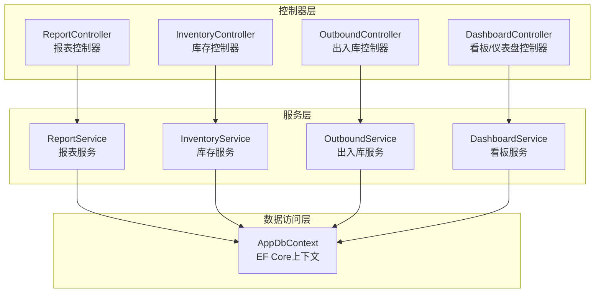
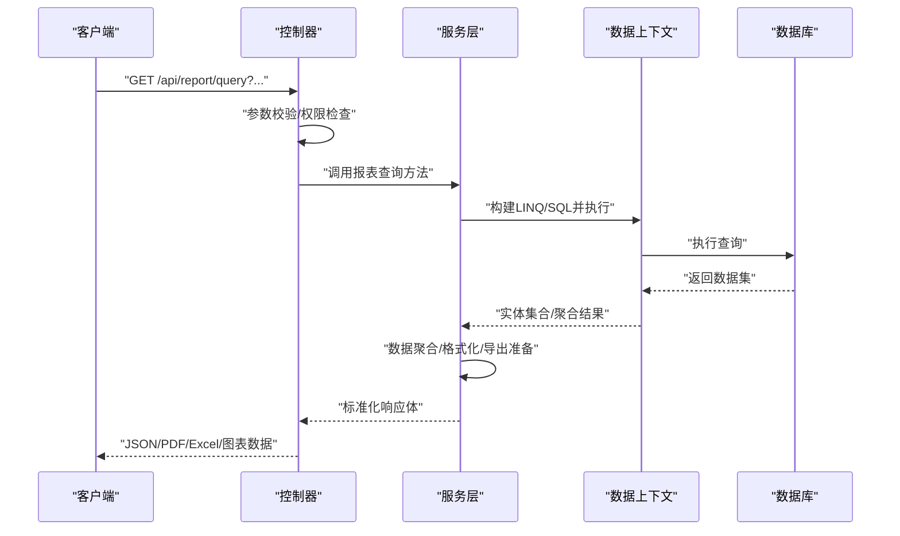
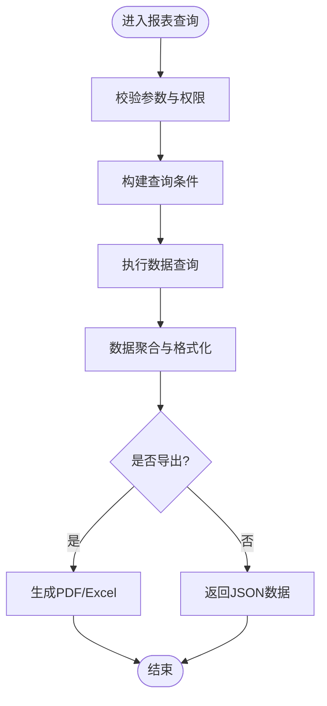
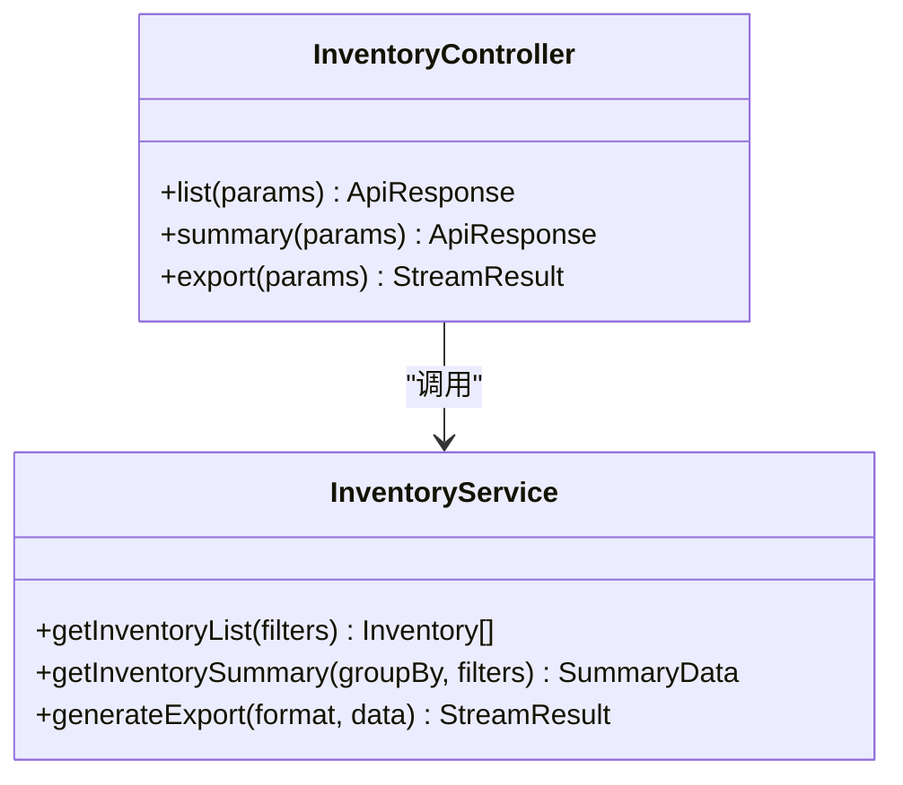
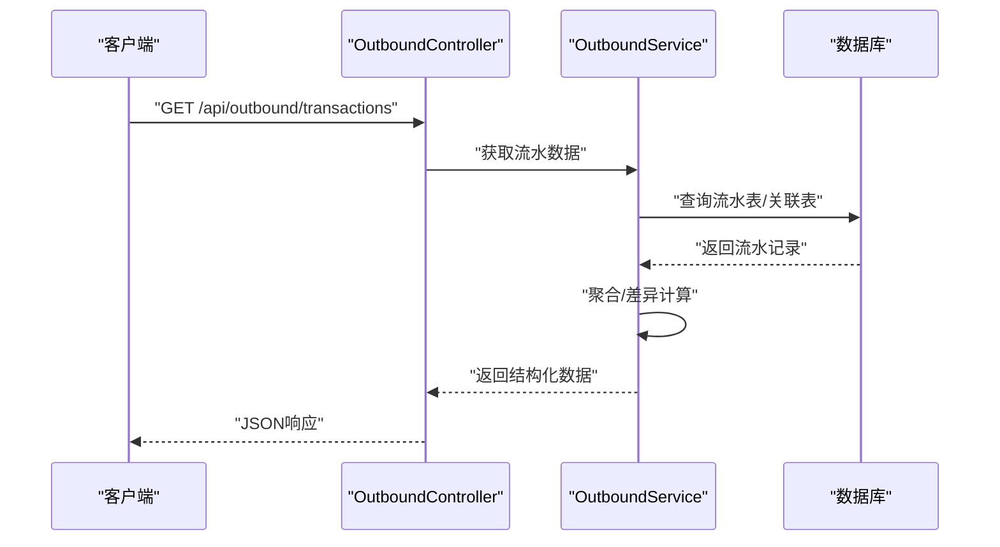
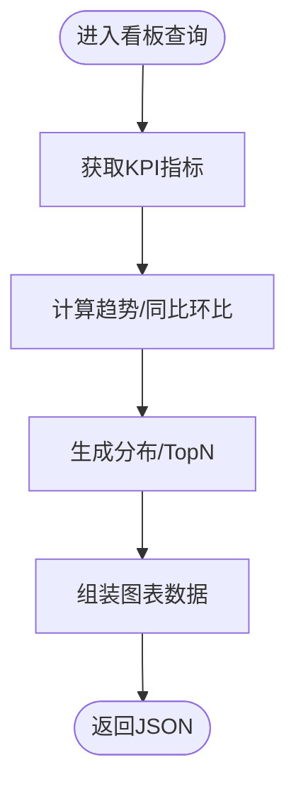
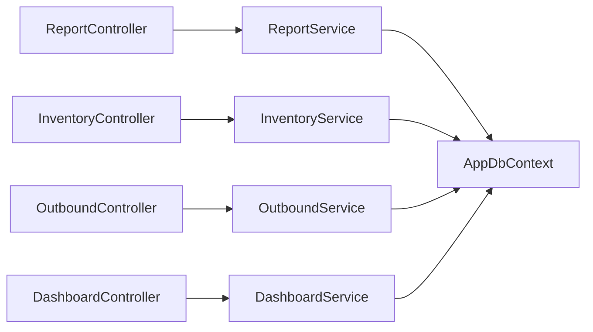

# 报表统计接口

<cite>
**本文引用的文件**   
- [ReportController.cs](file://dip-system/api/Controllers/ReportController.cs)
- [ReportService.cs](file://dip-system/api/Services/ReportService.cs)
- [InventoryController.cs](file://dip-system/api/Controllers/InventoryController.cs)
- [OutboundController.cs](file://dip-system/api/Controllers/OutboundController.cs)
- [DashboardController.cs](file://dip-system/api/Controllers/DashboardController.cs)
- [InventoryService.cs](file://dip-system/api/Services/InventoryService.cs)
- [OutboundService.cs](file://dip-system/api/Services/OutboundService.cs)
- [DashboardService.cs](file://dip-system/api/Services/DashboardService.cs)
- [AppDbContext.cs](file://dip-system/api/Data/AppDbContext.cs)
- [ApiResponse.cs](file://dip-system/api/Models/ApiResponse.cs)
- [Program.cs](file://dip-system/api/Program.cs)
</cite>

## 目录
1. [简介](#简介)
2. [项目结构](#项目结构)
3. [核心组件](#核心组件)
4. [架构总览](#架构总览)
5. [详细组件分析](#详细组件分析)
6. [依赖关系分析](#依赖关系分析)
7. [性能考虑](#性能考虑)
8. [故障排查指南](#故障排查指南)
9. [结论](#结论)
10. [附录](#附录)

## 简介
本文件为DIP系统“报表统计功能API”的全面技术文档，覆盖库存报表、出入库统计、生产与质量相关数据查询接口的实现说明。重点包括：
- HTTP接口规范（请求参数、响应结构、分页、排序、过滤）
- 复杂查询条件、多表关联与数据聚合的接口设计
- PDF/Excel导出、图表生成、定时报表任务的示例与最佳实践
- 报表模板管理、自定义字段、数据权限控制策略
- 大数据量处理、分页查询与性能优化策略

本说明面向后端开发者、前端集成人员与运维人员，力求以循序渐进的方式呈现从概念到实现的完整知识体系。

## 项目结构
DIP系统的报表能力主要位于后端API项目中，采用控制器-服务-数据访问的分层架构：
- 控制器层：对外暴露HTTP接口，负责参数校验、权限检查、结果封装
- 服务层：业务逻辑编排、数据聚合、跨表查询、导出与图表生成
- 数据访问层：通过EF Core上下文进行数据库操作，支持复杂查询与分页

**图示来源** 
- [ReportController.cs](file://dip-system/api/Controllers/ReportController.cs)
- [ReportService.cs](file://dip-system/api/Services/ReportService.cs)
- [InventoryController.cs](file://dip-system/api/Controllers/InventoryController.cs)
- [InventoryService.cs](file://dip-system/api/Services/InventoryService.cs)
- [OutboundController.cs](file://dip-system/api/Controllers/OutboundController.cs)
- [OutboundService.cs](file://dip-system/api/Services/OutboundService.cs)
- [DashboardController.cs](file://dip-system/api/Controllers/DashboardController.cs)
- [DashboardService.cs](file://dip-system/api/Services/DashboardService.cs)
- [AppDbContext.cs](file://dip-system/api/Data/AppDbContext.cs)

**章节来源**
- [Program.cs](file://dip-system/api/Program.cs)

## 核心组件
- 报表控制器（ReportController）：提供统一的报表查询入口，支持按类型筛选、时间范围、组织维度等条件聚合；可触发PDF/Excel导出与图表数据返回。
- 库存控制器（InventoryController）：提供库存快照、在途、可用、锁定等维度的统计接口，支持仓库/库位/物料/批次等多条件组合查询。
- 出入库控制器（OutboundController）：提供入库/出库流水、汇总、差异分析接口，支持按单号、时间、供应商/客户、工单等维度聚合。
- 看板控制器（DashboardController）：提供关键指标KPI、趋势图、分布图等数据接口，用于首页或大屏展示。
- 报表服务（ReportService）：实现复杂SQL/LINQ聚合、多表关联、分组统计、导出格式转换、图表数据结构组装。
- 库存服务（InventoryService）：实现库存计算、在途与可用量推导、批次追溯、安全库存预警等。
- 出入库服务（OutboundService）：实现出入库流水聚合、差异对比、异常标记、对账数据输出。
- 看板服务（DashboardService）：实现KPI计算、趋势聚合、TopN排行、同比环比计算。
- 数据上下文（AppDbContext）：定义实体映射、索引、查询优化配置，支撑高效分页与复杂查询。

**章节来源**
- [ReportController.cs](file://dip-system/api/Controllers/ReportController.cs)
- [ReportService.cs](file://dip-system/api/Services/ReportService.cs)
- [InventoryController.cs](file://dip-system/api/Controllers/InventoryController.cs)
- [InventoryService.cs](file://dip-system/api/Services/InventoryService.cs)
- [OutboundController.cs](file://dip-system/api/Controllers/OutboundController.cs)
- [OutboundService.cs](file://dip-system/api/Services/OutboundService.cs)
- [DashboardController.cs](file://dip-system/api/Controllers/DashboardController.cs)
- [DashboardService.cs](file://dip-system/api/Services/DashboardService.cs)
- [AppDbContext.cs](file://dip-system/api/Data/AppDbContext.cs)

## 架构总览
报表统计API遵循典型的分层架构，控制器仅做参数解析与结果包装，核心业务逻辑下沉至服务层，数据访问由EF Core统一管控。

**图示来源** 
- [ReportController.cs](file://dip-system/api/Controllers/ReportController.cs)
- [ReportService.cs](file://dip-system/api/Services/ReportService.cs)
- [AppDbContext.cs](file://dip-system/api/Data/AppDbContext.cs)

## 详细组件分析

### 报表控制器（ReportController）
- 职责：统一报表查询入口，支持按报表类型、时间范围、组织、仓库、物料、批次等条件查询；支持导出PDF/Excel；返回图表所需的数据结构。
- 典型接口
  - 报表查询：GET /api/report/query
    - 参数：reportType、startDate、endDate、warehouseId、materialId、batchNo、orgId、page、pageSize、orderBy、orderDirection
    - 响应：统一响应体，包含数据列表、分页信息、总计、图表数据
  - 导出PDF：GET /api/report/export/pdf
    - 参数：同查询接口，附加format=pdf
    - 响应：二进制流（application/pdf）
  - 导出Excel：GET /api/report/export/excel
    - 参数：同查询接口，附加format=excel
    - 响应：二进制流（application/vnd.openxmlformats-officedocument.spreadsheetml.sheet）
  - 图表数据：GET /api/report/chart
    - 参数：reportType、groupBy、timeGranularity、filters...
    - 响应：图表数据数组（类别、数值、颜色等）

**图示来源** 
- [ReportController.cs](file://dip-system/api/Controllers/ReportController.cs)
- [ReportService.cs](file://dip-system/api/Services/ReportService.cs)

**章节来源**
- [ReportController.cs](file://dip-system/api/Controllers/ReportController.cs)
- [ReportService.cs](file://dip-system/api/Services/ReportService.cs)

### 库存控制器与服务（InventoryController/InventoryService）
- 职责：提供库存快照、在途、可用、锁定等统计；支持仓库/库位/物料/批次/供应商等多条件组合；支持安全库存预警与差异分析。
- 典型接口
  - 库存查询：GET /api/inventory/list
    - 参数：warehouseId、locationId、materialId、batchNo、supplierId、status、page、pageSize
    - 响应：库存明细列表、汇总统计、预警项
  - 库存汇总：GET /api/inventory/summary
    - 参数：groupBy=warehouse/material/batch/supplier、dateRange、filters
    - 响应：分组汇总数据、趋势指标
  - 库存导出：GET /api/inventory/export
    - 参数：同查询，附加format=pdf/excel
    - 响应：二进制流

**图示来源** 
- [InventoryController.cs](file://dip-system/api/Controllers/InventoryController.cs)
- [InventoryService.cs](file://dip-system/api/Services/InventoryService.cs)

**章节来源**
- [InventoryController.cs](file://dip-system/api/Controllers/InventoryController.cs)
- [InventoryService.cs](file://dip-system/api/Services/InventoryService.cs)

### 出入库控制器与服务（OutboundController/OutboundService）
- 职责：提供出入库流水、汇总、差异分析；支持按单号、时间、供应商/客户、工单等维度聚合；支持异常标记与对账数据输出。
- 典型接口
  - 出入库流水：GET /api/outbound/transactions
    - 参数：transactionType、documentNo、dateRange、supplierId、customerId、workOrderId、page、pageSize
    - 响应：流水明细、分页信息
  - 出入库汇总：GET /api/outbound/summary
    - 参数：groupBy=document/type/date、dateRange、filters
    - 响应：分组汇总、差异统计
  - 差异分析：GET /api/outbound/differences
    - 参数：compareDateRange、entityType、entityId
    - 响应：差异明细、原因分类、建议措施
  - 导出：GET /api/outbound/export

**图示来源** 
- [OutboundController.cs](file://dip-system/api/Controllers/OutboundController.cs)
- [OutboundService.cs](file://dip-system/api/Services/OutboundService.cs)

**章节来源**
- [OutboundController.cs](file://dip-system/api/Controllers/OutboundController.cs)
- [OutboundService.cs](file://dip-system/api/Services/OutboundService.cs)

### 看板控制器与服务（DashboardController/DashboardService）
- 职责：提供KPI指标、趋势图、分布图、TopN排行等数据，用于首页或大屏展示。
- 典型接口
  - KPI概览：GET /api/dashboard/kpi
    - 参数：dateRange、orgId、warehouseId
    - 响应：关键指标值、同比环比、阈值状态
  - 趋势数据：GET /api/dashboard/trend
    - 参数：metric、timeGranularity、filters
    - 响应：时间序列数据点
  - 分布数据：GET /api/dashboard/distribution
    - 参数：dimension、topN、filters
    - 响应：类别与占比数据

**图示来源** 
- [DashboardController.cs](file://dip-system/api/Controllers/DashboardController.cs)
- [DashboardService.cs](file://dip-system/api/Services/DashboardService.cs)

**章节来源**
- [DashboardController.cs](file://dip-system/api/Controllers/DashboardController.cs)
- [DashboardService.cs](file://dip-system/api/Services/DashboardService.cs)

### 数据模型与统一响应（ApiResponse）
- 统一响应体：所有接口返回标准结构，包含code、message、data、pagination等字段，便于前端统一处理。
- 分页结构：包含当前页、每页大小、总数、总页数、是否有下一页等。
- 错误码：区分业务错误与系统错误，便于前端提示与日志追踪。

**章节来源**
- [ApiResponse.cs](file://dip-system/api/Models/ApiResponse.cs)

## 依赖关系分析
- 控制器依赖服务：各控制器仅依赖对应服务，避免直接访问数据层，保证职责单一。
- 服务依赖数据上下文：服务层通过AppDbContext进行数据访问，支持LINQ与存储过程混合使用。
- 外部依赖：PDF/Excel导出可能依赖第三方库（如QuestPDF、ClosedXML），图表数据由服务层组装后返回给前端渲染。

**图示来源** 
- [ReportController.cs](file://dip-system/api/Controllers/ReportController.cs)
- [ReportService.cs](file://dip-system/api/Services/ReportService.cs)
- [InventoryController.cs](file://dip-system/api/Controllers/InventoryController.cs)
- [InventoryService.cs](file://dip-system/api/Services/InventoryService.cs)
- [OutboundController.cs](file://dip-system/api/Controllers/OutboundController.cs)
- [OutboundService.cs](file://dip-system/api/Services/OutboundService.cs)
- [DashboardController.cs](file://dip-system/api/Controllers/DashboardController.cs)
- [DashboardService.cs](file://dip-system/api/Services/DashboardService.cs)
- [AppDbContext.cs](file://dip-system/api/Data/AppDbContext.cs)

**章节来源**
- [AppDbContext.cs](file://dip-system/api/Data/AppDbContext.cs)

## 性能考虑
- 分页查询：所有列表接口必须支持分页，默认pageSize建议不超过200，避免一次性返回大量数据。
- 索引优化：对常用过滤字段（日期、仓库ID、物料ID、批次号、单号）建立复合索引，提升查询效率。
- 查询拆分：复杂聚合尽量拆分为多次轻量查询，减少单次SQL复杂度。
- 缓存策略：对热点KPI与趋势数据使用内存缓存（如IMemoryCache），设置合理过期时间。
- 异步处理：导出任务与大数据量计算应异步执行，返回任务ID供前端轮询进度。
- 连接池：合理配置EF Core连接池大小，避免高并发下连接耗尽。
- 批量写入：定时报表任务涉及批量更新时，使用批量插入/更新以减少往返次数。

[本节为通用性能指导，不直接分析具体文件]

## 故障排查指南
- 常见错误
  - 参数缺失或格式错误：检查必填参数与数据类型，确保日期范围合法、分页参数为正整数。
  - 权限不足：确认用户角色与数据权限，确保只能访问授权范围内的仓库/组织数据。
  - 超时：复杂查询需添加索引或拆分查询；导出任务改为异步。
  - 内存溢出：大数据集导出时启用流式处理，避免一次性加载全部数据到内存。
- 调试建议
  - 启用EF Core SQL日志，查看实际执行的SQL语句。
  - 使用性能分析工具定位慢查询与热点代码。
  - 增加关键路径的日志记录，便于问题回溯。

**章节来源**
- [ApiResponse.cs](file://dip-system/api/Models/ApiResponse.cs)

## 结论
DIP系统报表统计API采用清晰的分层架构，控制器负责接口暴露，服务层实现业务逻辑与数据聚合，数据访问由EF Core统一管理。通过标准化的响应体、分页机制与导出能力，满足库存、出入库、看板等多类报表需求。结合索引优化、缓存与异步处理，可有效应对大数据量场景。建议在后续迭代中完善模板管理与自定义字段能力，进一步提升报表灵活性。

[本节为总结性内容，不直接分析具体文件]

## 附录
- 接口命名规范：RESTful风格，资源名词复数形式，动词使用GET/POST/PUT/DELETE。
- 参数命名：小写蛇形命名，日期使用ISO 8601格式，分页使用page/pageSize。
- 响应结构：统一ApiResponse，包含code/message/data/pagination。
- 导出格式：PDF与Excel分别返回二进制流，前端根据Content-Type处理下载。
- 图表数据：返回类别与数值数组，前端使用ECharts/AntV等库渲染。

[本节为补充说明，不直接分析具体文件]