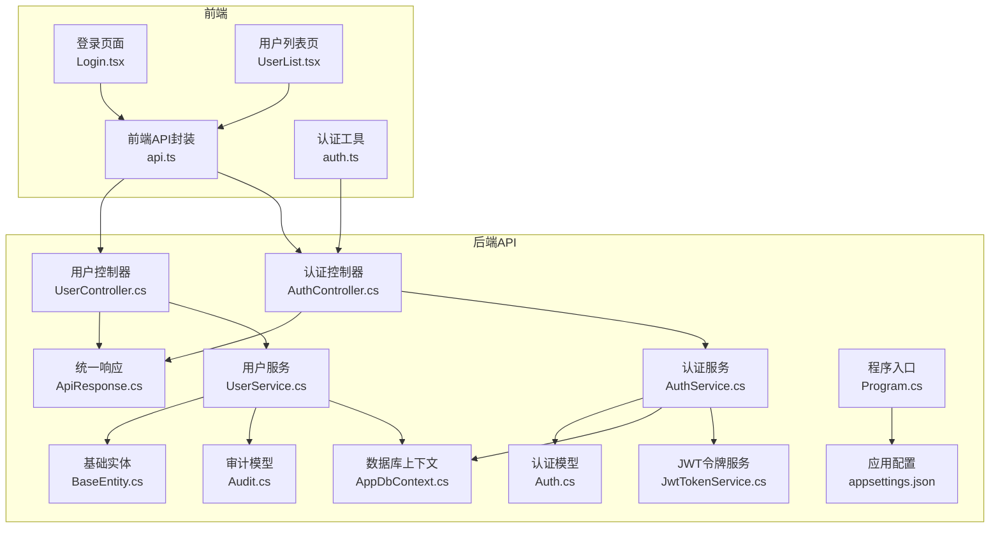
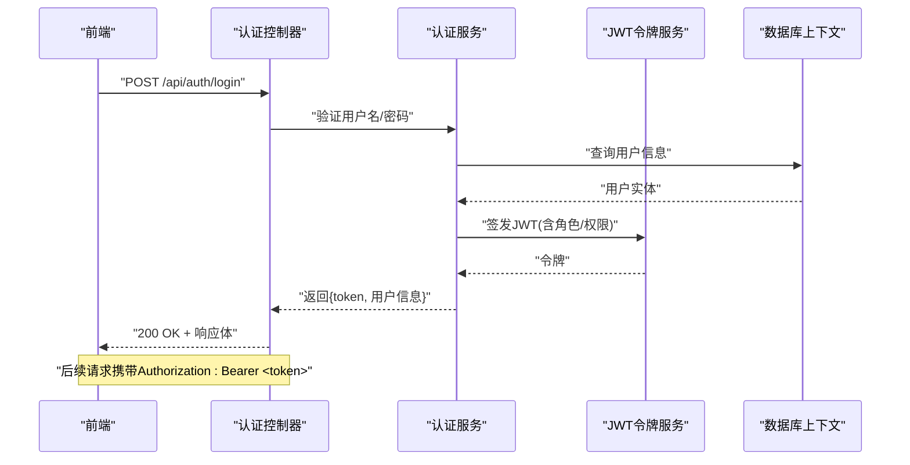
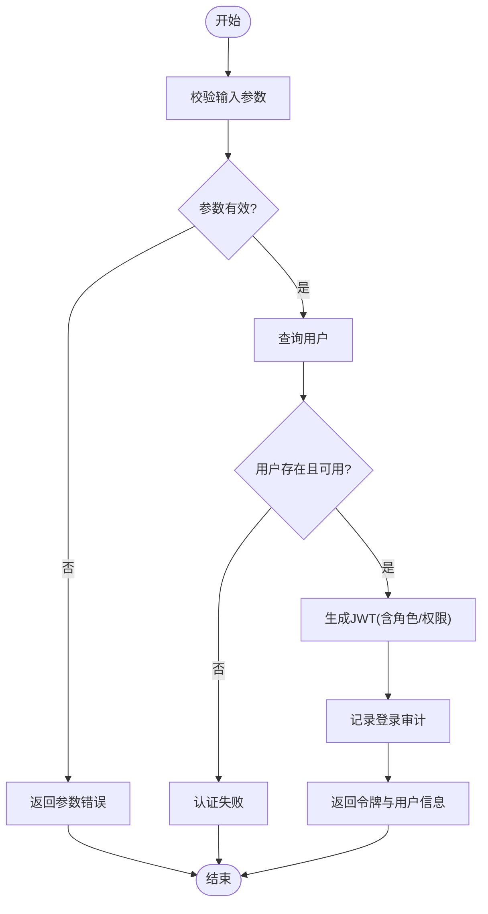
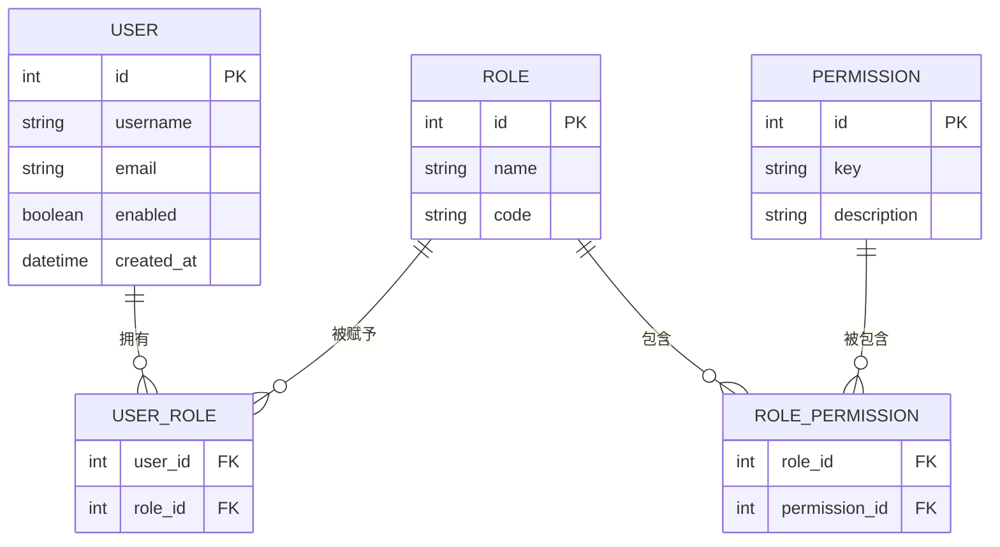
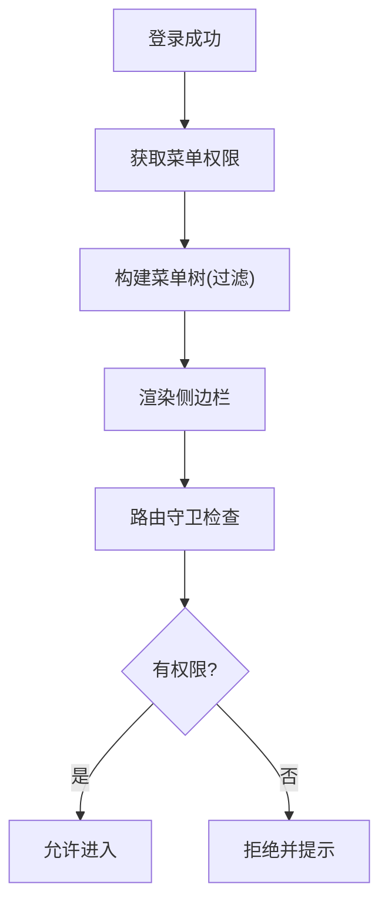
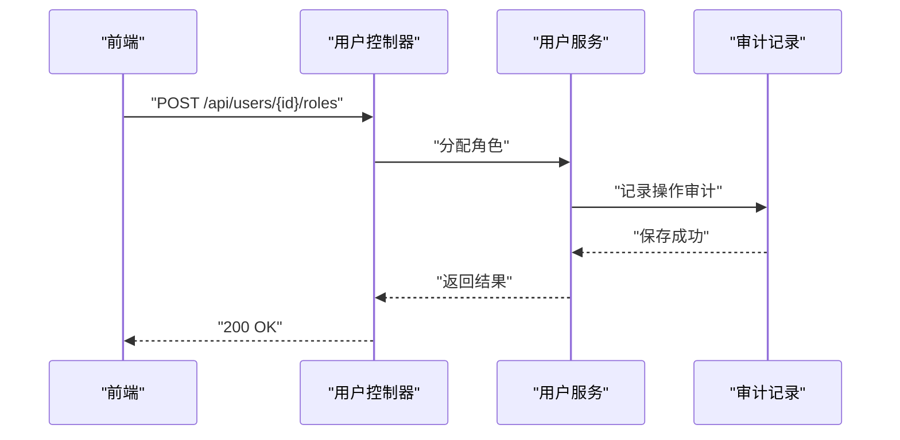
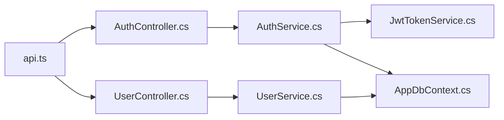

# 用户管理接口

<cite>
**本文引用的文件**   
- [UserController.cs](file://dip-system/api/Controllers/UserController.cs)
- [UserService.cs](file://dip-system/api/Services/UserService.cs)
- [AuthController.cs](file://dip-system/api/Controllers/AuthController.cs)
- [AuthService.cs](file://dip-system/api/Services/AuthService.cs)
- [JwtTokenService.cs](file://dip-system/api/Services/JwtTokenService.cs)
- [ApiResponse.cs](file://dip-system/api/Models/ApiResponse.cs)
- [Auth.cs](file://dip-system/api/Models/Auth.cs)
- [Audit.cs](file://dip-system/api/Models/Audit.cs)
- [BaseEntity.cs](file://dip-system/api/Models/BaseEntity.cs)
- [AppDbContext.cs](file://dip-system/api/Data/AppDbContext.cs)
- [Program.cs](file://dip-system/api/Program.cs)
- [appsettings.json](file://dip-system/api/appsettings.json)
- [api.ts](file://dip-system/frontend-web/src/lib/api.ts)
- [auth.ts](file://dip-system/frontend-web/src/lib/auth.ts)
- [Login.tsx](file://dip-system/frontend-web/src/pages/Login.tsx)
- [UserList.tsx](file://dip-system/frontend-web/src/pages/UserList.tsx)
</cite>

## 目录
1. [简介](#简介)
2. [项目结构](#项目结构)
3. [核心组件](#核心组件)
4. [架构总览](#架构总览)
5. [详细组件分析](#详细组件分析)
6. [依赖关系分析](#依赖关系分析)
7. [性能考虑](#性能考虑)
8. [故障排查指南](#故障排查指南)
9. [结论](#结论)
10. [附录](#附录)

## 简介
本文件为DIP系统“用户管理”相关API的权威文档，覆盖以下能力：
- 用户CRUD（创建、查询、更新、删除）
- 角色与权限管理（RBAC）
- 菜单权限控制
- 认证与授权（注册、登录、密码重置、令牌刷新、会话管理）
- 请求参数校验规则、响应数据格式、错误码定义
- 批量操作、权限分配、用户组管理等高级用法
- JWT令牌机制与安全策略配置
- 审计日志与操作记录查询

本说明面向后端开发者、前端集成人员与运维人员，力求以循序渐进的方式帮助读者快速理解并正确调用接口。

## 项目结构
DIP系统采用前后端分离架构，后端基于ASP.NET Core Web API，前端使用React/Vite。用户管理相关代码主要位于后端api层（控制器、服务、模型、数据访问）以及前端lib与pages模块中。



图表来源
- [Program.cs](file://dip-system/api/Program.cs)
- [appsettings.json](file://dip-system/api/appsettings.json)
- [AuthController.cs](file://dip-system/api/Controllers/AuthController.cs)
- [UserController.cs](file://dip-system/api/Controllers/UserController.cs)
- [AuthService.cs](file://dip-system/api/Services/AuthService.cs)
- [UserService.cs](file://dip-system/api/Services/UserService.cs)
- [JwtTokenService.cs](file://dip-system/api/Services/JwtTokenService.cs)
- [ApiResponse.cs](file://dip-system/api/Models/ApiResponse.cs)
- [Auth.cs](file://dip-system/api/Models/Auth.cs)
- [Audit.cs](file://dip-system/api/Models/Audit.cs)
- [BaseEntity.cs](file://dip-system/api/Models/BaseEntity.cs)
- [AppDbContext.cs](file://dip-system/api/Data/AppDbContext.cs)
- [api.ts](file://dip-system/frontend-web/src/lib/api.ts)
- [auth.ts](file://dip-system/frontend-web/src/lib/auth.ts)
- [Login.tsx](file://dip-system/frontend-web/src/pages/Login.tsx)
- [UserList.tsx](file://dip-system/frontend-web/src/pages/UserList.tsx)

章节来源
- [Program.cs](file://dip-system/api/Program.cs)
- [appsettings.json](file://dip-system/api/appsettings.json)

## 核心组件
- 认证控制器与服务：负责注册、登录、密码重置、令牌签发与验证、会话管理。
- 用户控制器与服务：负责用户CRUD、角色/权限分配、用户组管理、状态管理、批量操作。
- JWT令牌服务：负责JWT生成、校验、刷新与过期策略。
- 统一响应模型：标准化HTTP响应结构。
- 审计模型：记录关键操作审计日志。
- 数据访问：通过EF Core上下文访问数据库。

章节来源
- [AuthController.cs](file://dip-system/api/Controllers/AuthController.cs)
- [AuthService.cs](file://dip-system/api/Services/AuthService.cs)
- [UserController.cs](file://dip-system/api/Controllers/UserController.cs)
- [UserService.cs](file://dip-system/api/Services/UserService.cs)
- [JwtTokenService.cs](file://dip-system/api/Services/JwtTokenService.cs)
- [ApiResponse.cs](file://dip-system/api/Models/ApiResponse.cs)
- [Audit.cs](file://dip-system/api/Models/Audit.cs)
- [AppDbContext.cs](file://dip-system/api/Data/AppDbContext.cs)

## 架构总览
下图展示从前端到后端的典型认证与用户管理流程，包括JWT签发、鉴权中间件、服务层处理与数据持久化。



图表来源
- [AuthController.cs](file://dip-system/api/Controllers/AuthController.cs)
- [AuthService.cs](file://dip-system/api/Services/AuthService.cs)
- [JwtTokenService.cs](file://dip-system/api/Services/JwtTokenService.cs)
- [AppDbContext.cs](file://dip-system/api/Data/AppDbContext.cs)

## 详细组件分析

### 认证与授权（注册、登录、密码重置、令牌刷新）
- 注册：提交用户名、邮箱、密码等；服务端校验唯一性与复杂度，写入用户表，默认禁用或待激活。
- 登录：提交用户名与密码；校验通过后签发JWT，包含用户标识、角色、权限集合；支持多端并发与会话限制。
- 密码重置：支持按邮箱验证码或管理员重置；需校验旧密码与新密码强度。
- 令牌刷新：提供刷新接口，基于安全策略（如滑动窗口、设备指纹）签发新令牌。
- 鉴权：通过中间件校验JWT签名、有效期与撤销列表；基于角色的访问控制（RBAC）与菜单权限控制。



图表来源
- [AuthController.cs](file://dip-system/api/Controllers/AuthController.cs)
- [AuthService.cs](file://dip-system/api/Services/AuthService.cs)
- [JwtTokenService.cs](file://dip-system/api/Services/JwtTokenService.cs)
- [Audit.cs](file://dip-system/api/Models/Audit.cs)

章节来源
- [AuthController.cs](file://dip-system/api/Controllers/AuthController.cs)
- [AuthService.cs](file://dip-system/api/Services/AuthService.cs)
- [JwtTokenService.cs](file://dip-system/api/Services/JwtTokenService.cs)
- [Audit.cs](file://dip-system/api/Models/Audit.cs)

### 用户CRUD与状态管理
- 创建用户：支持单条与批量导入；必填字段校验（用户名、邮箱、手机号等），重复性检查。
- 查询用户：分页、筛选（角色、状态、部门）、排序、导出。
- 更新用户：编辑基本信息、重置密码、启用/禁用、锁定/解锁。
- 删除用户：软删除为主，保留审计轨迹；硬删除需二次确认。
- 状态管理：启用/禁用、锁定/解锁、激活/未激活、离职归档等。

```mermaid
classDiagram
class UserService {
+创建用户(用户DTO) 用户
+批量创建用户(用户DTO[]) 结果
+获取用户(条件) 分页结果
+更新用户(用户ID, 用户DTO) 布尔
+删除用户(用户ID) 布尔
+设置用户状态(用户ID, 状态) 布尔
+分配角色(用户ID, 角色ID[]) 布尔
+分配权限(用户ID, 权限键[]) 布尔
+分配用户组(用户ID, 组ID[]) 布尔
}
class UserController {
+POST /api/users
+GET /api/users
+PUT /api/users/{id}
+DELETE /api/users/{id}
+PATCH /api/users/{id}/status
+POST /api/users/batch
+POST /api/users/{id}/roles
+POST /api/users/{id}/permissions
+POST /api/users/{id}/groups
}
UserService --> UserController : "被调用"
```

图表来源
- [UserService.cs](file://dip-system/api/Services/UserService.cs)
- [UserController.cs](file://dip-system/api/Controllers/UserController.cs)

章节来源
- [UserService.cs](file://dip-system/api/Services/UserService.cs)
- [UserController.cs](file://dip-system/api/Controllers/UserController.cs)

### 角色与权限管理（RBAC）
- 角色：定义一组权限集合，支持层级与继承（可选）。
- 权限：细粒度资源与操作键（如 user:create、user:delete、menu:view）。
- 用户-角色-权限：用户可拥有多个角色，角色聚合权限；菜单权限由权限键驱动。
- 分配与回收：支持批量分配/回收角色与权限；变更即时生效或缓存刷新。



图表来源
- [Auth.cs](file://dip-system/api/Models/Auth.cs)
- [Audit.cs](file://dip-system/api/Models/Audit.cs)
- [BaseEntity.cs](file://dip-system/api/Models/BaseEntity.cs)
- [AppDbContext.cs](file://dip-system/api/Data/AppDbContext.cs)

章节来源
- [Auth.cs](file://dip-system/api/Models/Auth.cs)
- [BaseEntity.cs](file://dip-system/api/Models/BaseEntity.cs)
- [AppDbContext.cs](file://dip-system/api/Data/AppDbContext.cs)

### 菜单权限控制
- 菜单项：描述导航结构与可见性，受权限键控制。
- 动态渲染：登录后根据用户权限过滤菜单树。
- 路由守卫：前端基于权限键控制页面访问。



图表来源
- [AuthController.cs](file://dip-system/api/Controllers/AuthController.cs)
- [AuthService.cs](file://dip-system/api/Services/AuthService.cs)
- [api.ts](file://dip-system/frontend-web/src/lib/api.ts)
- [auth.ts](file://dip-system/frontend-web/src/lib/auth.ts)
- [Login.tsx](file://dip-system/frontend-web/src/pages/Login.tsx)

章节来源
- [api.ts](file://dip-system/frontend-web/src/lib/api.ts)
- [auth.ts](file://dip-system/frontend-web/src/lib/auth.ts)
- [Login.tsx](file://dip-system/frontend-web/src/pages/Login.tsx)

### 审计日志与操作记录查询
- 审计事件：登录、登出、密码修改、用户增删改、角色/权限分配、状态变更等。
- 查询接口：支持按时间范围、操作类型、用户、IP等筛选。
- 存储：建议独立表或索引优化，避免影响主业务。



图表来源
- [UserController.cs](file://dip-system/api/Controllers/UserController.cs)
- [UserService.cs](file://dip-system/api/Services/UserService.cs)
- [Audit.cs](file://dip-system/api/Models/Audit.cs)

章节来源
- [Audit.cs](file://dip-system/api/Models/Audit.cs)
- [UserService.cs](file://dip-system/api/Services/UserService.cs)
- [UserController.cs](file://dip-system/api/Controllers/UserController.cs)

## 依赖关系分析
- 控制器依赖服务：控制器仅做参数校验与响应包装，业务逻辑下沉至服务层。
- 服务依赖数据访问：通过EF Core上下文进行CRUD与事务处理。
- 认证依赖JWT服务：统一令牌签发与校验，确保跨服务一致性。
- 前端依赖API封装：统一拦截器处理令牌注入与错误提示。



图表来源
- [api.ts](file://dip-system/frontend-web/src/lib/api.ts)
- [AuthController.cs](file://dip-system/api/Controllers/AuthController.cs)
- [UserController.cs](file://dip-system/api/Controllers/UserController.cs)
- [AuthService.cs](file://dip-system/api/Services/AuthService.cs)
- [UserService.cs](file://dip-system/api/Services/UserService.cs)
- [JwtTokenService.cs](file://dip-system/api/Services/JwtTokenService.cs)
- [AppDbContext.cs](file://dip-system/api/Data/AppDbContext.cs)

章节来源
- [api.ts](file://dip-system/frontend-web/src/lib/api.ts)
- [AppDbContext.cs](file://dip-system/api/Data/AppDbContext.cs)

## 性能考虑
- 分页与筛选：用户列表必须分页，避免全量加载；常用筛选字段建立索引。
- 缓存策略：角色与权限集合可短期缓存，减少频繁查询。
- 批量操作：使用批量插入/更新，降低往返次数。
- 异步IO：所有数据库与外部调用使用异步，提高吞吐。
- 令牌刷新：合理设置过期时间与刷新窗口，避免频繁重签。

[本节为通用指导，不直接分析具体文件]

## 故障排查指南
- 常见错误码
  - 400：参数校验失败（缺失必填、格式错误）
  - 401：未认证或令牌无效/过期
  - 403：无权限访问
  - 404：资源不存在
  - 409：冲突（如用户名已存在）
  - 500：服务器内部错误
- 定位步骤
  - 检查请求头Authorization是否携带有效Bearer令牌
  - 查看统一响应体中的code/message/data字段
  - 核对审计日志与错误日志
  - 验证角色与权限分配是否正确
- 常见问题
  - 登录成功但菜单为空：检查权限键与菜单映射
  - 批量导入失败：检查模板字段与数据类型
  - 令牌刷新失败：检查刷新令牌有效期与撤销列表

章节来源
- [ApiResponse.cs](file://dip-system/api/Models/ApiResponse.cs)
- [AuthController.cs](file://dip-system/api/Controllers/AuthController.cs)
- [UserController.cs](file://dip-system/api/Controllers/UserController.cs)

## 结论
本文件系统化梳理了DIP系统用户管理API的设计与实现要点，涵盖认证授权、用户CRUD、角色权限、菜单控制、审计日志与安全策略。遵循本文档规范可实现稳定、可扩展的用户管理能力，并为前后端协作提供清晰契约。

[本节为总结性内容，不直接分析具体文件]

## 附录

### 接口清单与示例（路径参考）
- 认证
  - POST /api/auth/register
  - POST /api/auth/login
  - POST /api/auth/reset-password
  - POST /api/auth/refresh-token
- 用户管理
  - POST /api/users
  - GET /api/users
  - PUT /api/users/{id}
  - DELETE /api/users/{id}
  - PATCH /api/users/{id}/status
  - POST /api/users/batch
  - POST /api/users/{id}/roles
  - POST /api/users/{id}/permissions
  - POST /api/users/{id}/groups
- 审计日志
  - GET /api/audit/logs

章节来源
- [AuthController.cs](file://dip-system/api/Controllers/AuthController.cs)
- [UserController.cs](file://dip-system/api/Controllers/UserController.cs)

### 请求参数校验规则（摘要）
- 用户名：非空、长度范围、字符集限制
- 邮箱：非空、合法邮箱格式、唯一性
- 手机号：非空、格式校验、唯一性（可选）
- 密码：最小长度、复杂度要求（大小写、数字、特殊字符）
- 角色/权限：非空数组、键值合法性、去重
- 分页：page、size、sort、filter等

章节来源
- [AuthController.cs](file://dip-system/api/Controllers/AuthController.cs)
- [UserController.cs](file://dip-system/api/Controllers/UserController.cs)

### 响应数据格式（摘要）
- 统一响应体包含：
  - code：业务状态码
  - message：提示信息
  - data：业务数据（对象或数组）
- 错误响应：
  - 4xx：客户端错误，message给出明确原因
  - 5xx：服务端错误，message与日志关联ID

章节来源
- [ApiResponse.cs](file://dip-system/api/Models/ApiResponse.cs)

### 前端集成示例（路径参考）
- 登录流程：在登录页调用认证接口，保存令牌并在后续请求头注入
- 用户列表：分页查询、筛选、导出
- 权限控制：根据权限键控制按钮显示与路由访问

章节来源
- [api.ts](file://dip-system/frontend-web/src/lib/api.ts)
- [auth.ts](file://dip-system/frontend-web/src/lib/auth.ts)
- [Login.tsx](file://dip-system/frontend-web/src/pages/Login.tsx)
- [UserList.tsx](file://dip-system/frontend-web/src/pages/UserList.tsx)

### JWT令牌机制与安全策略（摘要）
- 签发：包含用户ID、角色、权限集合、过期时间
- 校验：签名验证、过期检查、黑名单/撤销列表
- 刷新：基于刷新令牌与设备指纹，限制并发与频率
- 安全：HTTPS强制、CORS配置、最小权限原则

章节来源
- [JwtTokenService.cs](file://dip-system/api/Services/JwtTokenService.cs)
- [Program.cs](file://dip-system/api/Program.cs)
- [appsettings.json](file://dip-system/api/appsettings.json)