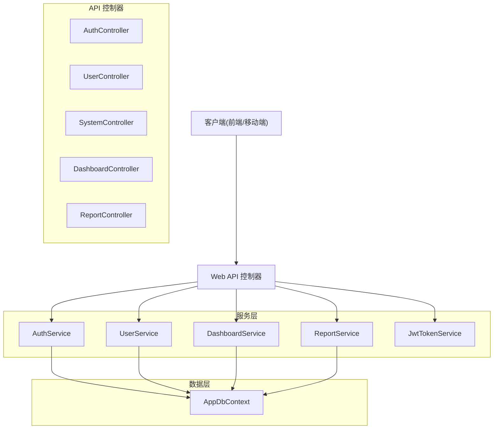
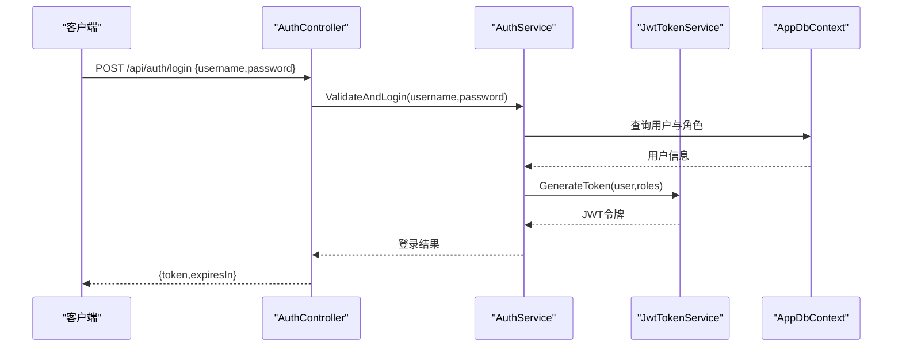
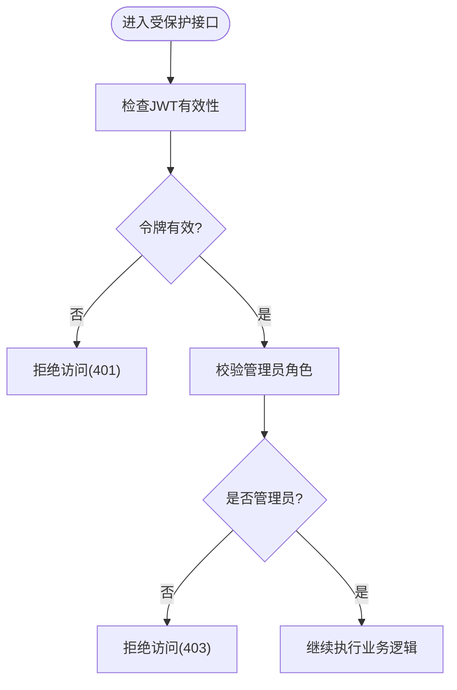
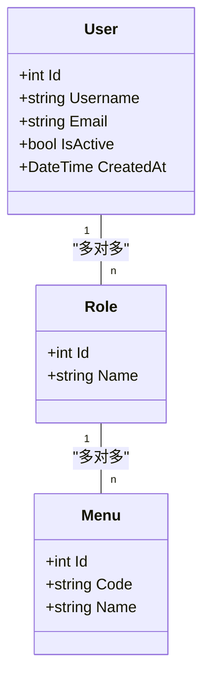
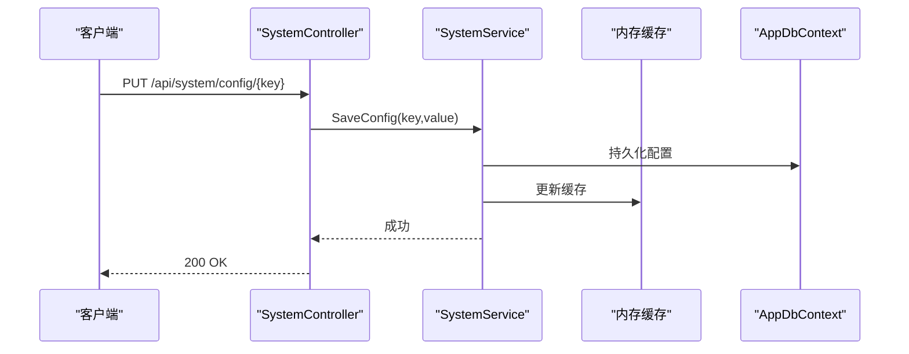
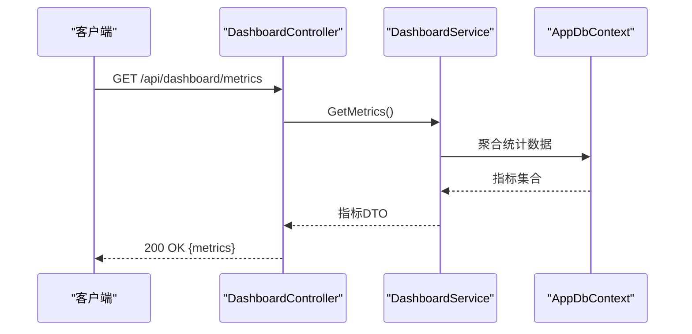
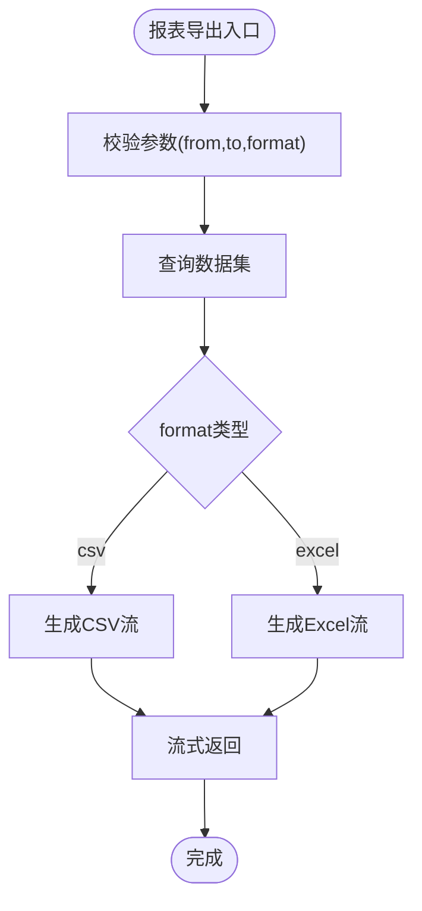
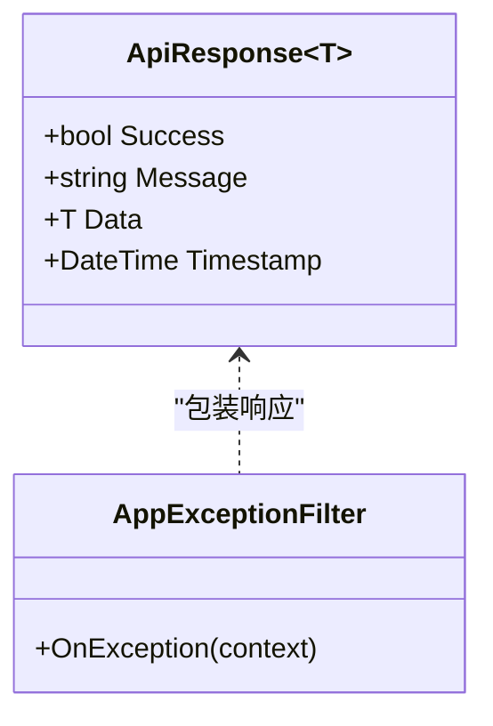
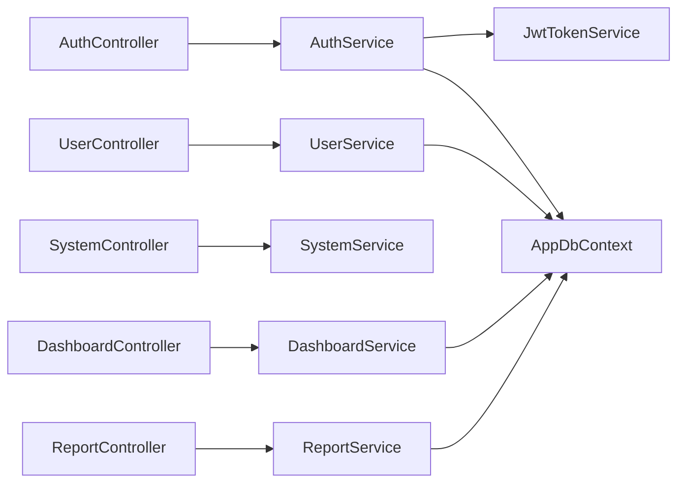

# 系统管理接口

<cite>
**本文引用的文件**   
- [Program.cs](file://dip-system/api/Program.cs)
- [appsettings.json](file://dip-system/api/appsettings.json)
- [AuthController.cs](file://dip-system/api/Controllers/AuthController.cs)
- [UserController.cs](file://dip-system/api/Controllers/UserController.cs)
- [SystemController.cs](file://dip-system/api/Controllers/SystemController.cs)
- [DashboardController.cs](file://dip-system/api/Controllers/DashboardController.cs)
- [ReportController.cs](file://dip-system/api/Controllers/ReportController.cs)
- [AuthService.cs](file://dip-system/api/Services/AuthService.cs)
- [UserService.cs](file://dip-system/api/Services/UserService.cs)
- [DashboardService.cs](file://dip-system/api/Services/DashboardService.cs)
- [ReportService.cs](file://dip-system/api/Services/ReportService.cs)
- [JwtTokenService.cs](file://dip-system/api/Services/JwtTokenService.cs)
- [AppExceptionFilter.cs](file://dip-system/api/Controllers/AppExceptionFilter.cs)
- [RequireManagerFilter.cs](file://dip-system/api/Controllers/RequireManagerFilter.cs)
- [ApiResponse.cs](file://dip-system/api/Models/ApiResponse.cs)
- [Auth.cs](file://dip-system/api/Models/Auth.cs)
- [BaseEntity.cs](file://dip-system/api/Models/BaseEntity.cs)
- [Audit.cs](file://dip-system/api/Models/Audit.cs)
- [AppDbContext.cs](file://dip-system/api/Data/AppDbContext.cs)
</cite>

## 目录
1. [简介](#简介)
2. [项目结构](#项目结构)
3. [核心组件](#核心组件)
4. [架构总览](#架构总览)
5. [详细组件分析](#详细组件分析)
6. [依赖关系分析](#依赖关系分析)
7. [性能考虑](#性能考虑)
8. [故障排查指南](#故障排查指南)
9. [结论](#结论)
10. [附录](#附录)

## 简介
本文件为DIP系统“系统管理”相关API的全面文档，覆盖用户管理、系统配置、仪表盘、报表统计等接口的HTTP方法、URL路径、请求参数与响应格式；详细说明用户权限控制、角色管理、菜单权限机制；并包含系统监控、日志管理、配置热更新、数据统计与图表生成、数据导出等实现细节。同时提供完整的CRUD操作示例、权限控制示例、数据导出示例，以及系统扩展点、插件机制、第三方集成方式，以及管理员操作审计与安全策略配置说明。

## 项目结构
后端采用ASP.NET Core Web API，按功能域划分控制器与服务：
- 控制器层：AuthController（认证）、UserController（用户管理）、SystemController（系统配置）、DashboardController（仪表盘）、ReportController（报表）
- 服务层：AuthService、UserService、DashboardService、ReportService、JwtTokenService
- 数据访问：AppDbContext（EF Core上下文）
- 通用模型：ApiResponse、Auth、BaseEntity、Audit
- 中间件与过滤器：AppExceptionFilter（全局异常处理）、RequireManagerFilter（管理员权限校验）
- 配置：appsettings.json（含JWT、数据库连接串、缓存、日志等）

**图示来源**
- [Program.cs:1-100](file://dip-system/api/Program.cs#L1-L100)
- [AuthController.cs:1-200](file://dip-system/api/Controllers/AuthController.cs#L1-L200)
- [UserController.cs:1-200](file://dip-system/api/Controllers/UserController.cs#L1-L200)
- [SystemController.cs:1-200](file://dip-system/api/Controllers/SystemController.cs#L1-L200)
- [DashboardController.cs:1-200](file://dip-system/api/Controllers/DashboardController.cs#L1-L200)
- [ReportController.cs:1-200](file://dip-system/api/Controllers/ReportController.cs#L1-L200)
- [AuthService.cs:1-200](file://dip-system/api/Services/AuthService.cs#L1-L200)
- [UserService.cs:1-200](file://dip-system/api/Services/UserService.cs#L1-L200)
- [DashboardService.cs:1-200](file://dip-system/api/Services/DashboardService.cs#L1-L200)
- [ReportService.cs:1-200](file://dip-system/api/Services/ReportService.cs#L1-L200)
- [AppDbContext.cs:1-200](file://dip-system/api/Data/AppDbContext.cs#L1-L200)

**章节来源**
- [Program.cs:1-120](file://dip-system/api/Program.cs#L1-L120)
- [appsettings.json:1-200](file://dip-system/api/appsettings.json#L1-L200)

## 核心组件
- 认证与授权
  - 登录与令牌签发：POST /api/auth/login，返回JWT令牌
  - 令牌刷新：POST /api/auth/refresh
  - 鉴权过滤器：RequireManagerFilter用于管理员权限校验
- 用户管理
  - CRUD接口：/api/users，支持分页、搜索、状态切换、密码重置
  - 角色与菜单权限：基于角色的访问控制（RBAC），菜单可见性由角色决定
- 系统配置
  - 键值配置：GET/PUT /api/system/config/{key}
  - 批量配置：GET/PUT /api/system/config/batch
  - 配置热更新：通过内存缓存或配置中心监听变更
- 仪表盘
  - 关键指标：GET /api/dashboard/metrics
  - 实时在线：GET /api/dashboard/online
- 报表统计
  - 列表查询：GET /api/reports/{type}
  - 图表数据：GET /api/reports/{type}/chart
  - 导出：GET/POST /api/reports/{type}/export?format=csv|excel

**章节来源**
- [AuthController.cs:1-200](file://dip-system/api/Controllers/AuthController.cs#L1-L200)
- [UserController.cs:1-200](file://dip-system/api/Controllers/UserController.cs#L1-L200)
- [SystemController.cs:1-200](file://dip-system/api/Controllers/SystemController.cs#L1-L200)
- [DashboardController.cs:1-200](file://dip-system/api/Controllers/DashboardController.cs#L1-L200)
- [ReportController.cs:1-200](file://dip-system/api/Controllers/ReportController.cs#L1-L200)
- [AuthService.cs:1-200](file://dip-system/api/Services/AuthService.cs#L1-L200)
- [UserService.cs:1-200](file://dip-system/api/Services/UserService.cs#L1-L200)
- [DashboardService.cs:1-200](file://dip-system/api/Services/DashboardService.cs#L1-L200)
- [ReportService.cs:1-200](file://dip-system/api/Services/ReportService.cs#L1-L200)

## 架构总览
系统采用分层架构：控制器负责HTTP路由与入参校验，服务层封装业务逻辑，数据访问通过EF Core上下文完成。统一异常处理与管理员权限校验通过中间件/过滤器注入。JWT令牌贯穿认证流程，配置项集中管理并通过缓存提升读取性能。

**图示来源**
- [AuthController.cs:1-200](file://dip-system/api/Controllers/AuthController.cs#L1-L200)
- [AuthService.cs:1-200](file://dip-system/api/Services/AuthService.cs#L1-L200)
- [JwtTokenService.cs:1-200](file://dip-system/api/Services/JwtTokenService.cs#L1-L200)
- [AppDbContext.cs:1-200](file://dip-system/api/Data/AppDbContext.cs#L1-L200)

## 详细组件分析

### 认证与授权
- 登录接口
  - 方法：POST
  - 路径：/api/auth/login
  - 请求体：用户名、密码
  - 响应：JWT令牌、过期时间
- 刷新令牌
  - 方法：POST
  - 路径：/api/auth/refresh
  - 请求体：旧令牌
  - 响应：新令牌
- 管理员权限校验
  - 过滤器：RequireManagerFilter
  - 作用：在需要管理员操作的接口前进行角色校验

**图示来源**
- [RequireManagerFilter.cs:1-200](file://dip-system/api/Controllers/RequireManagerFilter.cs#L1-L200)
- [AuthController.cs:1-200](file://dip-system/api/Controllers/AuthController.cs#L1-L200)

**章节来源**
- [AuthController.cs:1-200](file://dip-system/api/Controllers/AuthController.cs#L1-L200)
- [AuthService.cs:1-200](file://dip-system/api/Services/AuthService.cs#L1-L200)
- [JwtTokenService.cs:1-200](file://dip-system/api/Services/JwtTokenService.cs#L1-L200)
- [RequireManagerFilter.cs:1-200](file://dip-system/api/Controllers/RequireManagerFilter.cs#L1-L200)

### 用户管理
- 用户CRUD
  - 列表：GET /api/users?page=1&size=20&keyword=...
  - 详情：GET /api/users/{id}
  - 新增：POST /api/users
  - 更新：PUT /api/users/{id}
  - 删除：DELETE /api/users/{id}
  - 状态切换：PATCH /api/users/{id}/status
  - 密码重置：POST /api/users/{id}/reset-password
- 角色与菜单权限
  - 角色分配：PUT /api/users/{id}/roles
  - 菜单可见性：根据用户角色动态渲染

**图示来源**
- [UserService.cs:1-200](file://dip-system/api/Services/UserService.cs#L1-L200)
- [Auth.cs:1-200](file://dip-system/api/Models/Auth.cs#L1-L200)
- [BaseEntity.cs:1-200](file://dip-system/api/Models/BaseEntity.cs#L1-L200)

**章节来源**
- [UserController.cs:1-200](file://dip-system/api/Controllers/UserController.cs#L1-L200)
- [UserService.cs:1-200](file://dip-system/api/Services/UserService.cs#L1-L200)
- [Auth.cs:1-200](file://dip-system/api/Models/Auth.cs#L1-L200)
- [BaseEntity.cs:1-200](file://dip-system/api/Models/BaseEntity.cs#L1-L200)

### 系统配置
- 单键配置
  - GET /api/system/config/{key}
  - PUT /api/system/config/{key}
- 批量配置
  - GET /api/system/config/batch
  - PUT /api/system/config/batch
- 配置热更新
  - 通过内存缓存或配置中心监听，变更后自动刷新

**图示来源**
- [SystemController.cs:1-200](file://dip-system/api/Controllers/SystemController.cs#L1-L200)
- [AppDbContext.cs:1-200](file://dip-system/api/Data/AppDbContext.cs#L1-L200)

**章节来源**
- [SystemController.cs:1-200](file://dip-system/api/Controllers/SystemController.cs#L1-L200)

### 仪表盘
- 指标查询
  - GET /api/dashboard/metrics
- 在线用户
  - GET /api/dashboard/online
- 实时刷新
  - 支持轮询或WebSocket推送（视实现而定）

**图示来源**
- [DashboardController.cs:1-200](file://dip-system/api/Controllers/DashboardController.cs#L1-L200)
- [DashboardService.cs:1-200](file://dip-system/api/Services/DashboardService.cs#L1-L200)
- [AppDbContext.cs:1-200](file://dip-system/api/Data/AppDbContext.cs#L1-L200)

**章节来源**
- [DashboardController.cs:1-200](file://dip-system/api/Controllers/DashboardController.cs#L1-L200)
- [DashboardService.cs:1-200](file://dip-system/api/Services/DashboardService.cs#L1-L200)

### 报表统计
- 列表查询
  - GET /api/reports/{type}?from=&to=&page=&size=
- 图表数据
  - GET /api/reports/{type}/chart?from=&to=
- 导出
  - GET /api/reports/{type}/export?format=csv|excel
  - 支持大文件流式输出

**图示来源**
- [ReportController.cs:1-200](file://dip-system/api/Controllers/ReportController.cs#L1-L200)
- [ReportService.cs:1-200](file://dip-system/api/Services/ReportService.cs#L1-L200)

**章节来源**
- [ReportController.cs:1-200](file://dip-system/api/Controllers/ReportController.cs#L1-L200)
- [ReportService.cs:1-200](file://dip-system/api/Services/ReportService.cs#L1-L200)

### 统一响应与错误处理
- 统一响应体：ApiResponse<T>
- 全局异常处理：AppExceptionFilter
- 常见状态码：200成功、400参数错误、401未认证、403无权限、500服务器错误

**图示来源**
- [ApiResponse.cs:1-200](file://dip-system/api/Models/ApiResponse.cs#L1-L200)
- [AppExceptionFilter.cs:1-200](file://dip-system/api/Controllers/AppExceptionFilter.cs#L1-L200)

**章节来源**
- [ApiResponse.cs:1-200](file://dip-system/api/Models/ApiResponse.cs#L1-L200)
- [AppExceptionFilter.cs:1-200](file://dip-system/api/Controllers/AppExceptionFilter.cs#L1-L200)

## 依赖关系分析
- 控制器依赖服务层，服务层依赖数据上下文
- JWT令牌服务独立于业务，提供令牌签发与验证
- 过滤器与中间件横切关注点：异常处理、权限校验
- 配置集中管理，支持热更新

**图示来源**
- [Program.cs:1-120](file://dip-system/api/Program.cs#L1-L120)
- [AuthController.cs:1-200](file://dip-system/api/Controllers/AuthController.cs#L1-L200)
- [UserController.cs:1-200](file://dip-system/api/Controllers/UserController.cs#L1-L200)
- [SystemController.cs:1-200](file://dip-system/api/Controllers/SystemController.cs#L1-L200)
- [DashboardController.cs:1-200](file://dip-system/api/Controllers/DashboardController.cs#L1-L200)
- [ReportController.cs:1-200](file://dip-system/api/Controllers/ReportController.cs#L1-L200)
- [AuthService.cs:1-200](file://dip-system/api/Services/AuthService.cs#L1-L200)
- [UserService.cs:1-200](file://dip-system/api/Services/UserService.cs#L1-L200)
- [DashboardService.cs:1-200](file://dip-system/api/Services/DashboardService.cs#L1-L200)
- [ReportService.cs:1-200](file://dip-system/api/Services/ReportService.cs#L1-L200)
- [JwtTokenService.cs:1-200](file://dip-system/api/Services/JwtTokenService.cs#L1-L200)
- [AppDbContext.cs:1-200](file://dip-system/api/Data/AppDbContext.cs#L1-L200)

**章节来源**
- [Program.cs:1-120](file://dip-system/api/Program.cs#L1-L120)

## 性能考虑
- 使用内存缓存缓存热点配置与指标数据，降低数据库压力
- 报表导出采用流式输出，避免大对象驻留内存
- 分页查询限制每页大小，防止大数据量传输
- 数据库索引优化：用户表、报表查询常用字段建立索引
- 异步I/O：所有IO操作使用异步方法，提高吞吐

[本节为通用指导，不直接分析具体文件]

## 故障排查指南
- 全局异常捕获：AppExceptionFilter统一包装异常为ApiResponse
- 常见错误
  - 401：JWT缺失或过期，检查Authorization头
  - 403：非管理员访问受限接口，检查角色
  - 400：参数校验失败，检查必填字段与格式
  - 500：服务端异常，查看日志与堆栈
- 调试建议
  - 启用详细日志
  - 使用Swagger或Postman测试接口
  - 检查数据库连接与配置项

**章节来源**
- [AppExceptionFilter.cs:1-200](file://dip-system/api/Controllers/AppExceptionFilter.cs#L1-L200)
- [appsettings.json:1-200](file://dip-system/api/appsettings.json#L1-L200)

## 结论
DIP系统管理API采用清晰的分层架构与统一的响应格式，结合JWT与角色权限控制，提供了完善的用户管理、系统配置、仪表盘与报表能力。通过过滤器与中间件实现横切关注点，确保一致性与可维护性。建议在后续迭代中持续优化性能与安全性，完善审计与监控能力。

[本节为总结，不直接分析具体文件]

## 附录

### API清单与示例
- 认证
  - POST /api/auth/login
  - POST /api/auth/refresh
- 用户管理
  - GET /api/users
  - GET /api/users/{id}
  - POST /api/users
  - PUT /api/users/{id}
  - DELETE /api/users/{id}
  - PATCH /api/users/{id}/status
  - POST /api/users/{id}/reset-password
  - PUT /api/users/{id}/roles
- 系统配置
  - GET /api/system/config/{key}
  - PUT /api/system/config/{key}
  - GET /api/system/config/batch
  - PUT /api/system/config/batch
- 仪表盘
  - GET /api/dashboard/metrics
  - GET /api/dashboard/online
- 报表统计
  - GET /api/reports/{type}
  - GET /api/reports/{type}/chart
  - GET /api/reports/{type}/export?format=csv|excel

### 权限控制示例
- 管理员接口需携带有效JWT且具备管理员角色
- 前端根据用户角色动态渲染菜单

### 数据导出示例
- 选择导出格式（CSV/Excel）
- 调用导出接口获取流式文件
- 前端下载保存

### 系统扩展点与插件机制
- 新增控制器与服务即可扩展功能
- 通过配置中心注入新模块
- 第三方集成可通过REST或消息队列对接

### 管理员操作审计与安全策略
- 审计记录：Audit实体记录关键操作
- 安全策略：密码复杂度、会话超时、IP白名单等

**章节来源**
- [Audit.cs:1-200](file://dip-system/api/Models/Audit.cs#L1-L200)
- [appsettings.json:1-200](file://dip-system/api/appsettings.json#L1-L200)