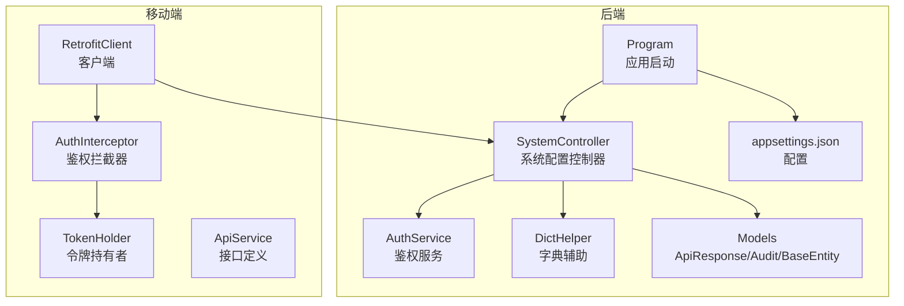
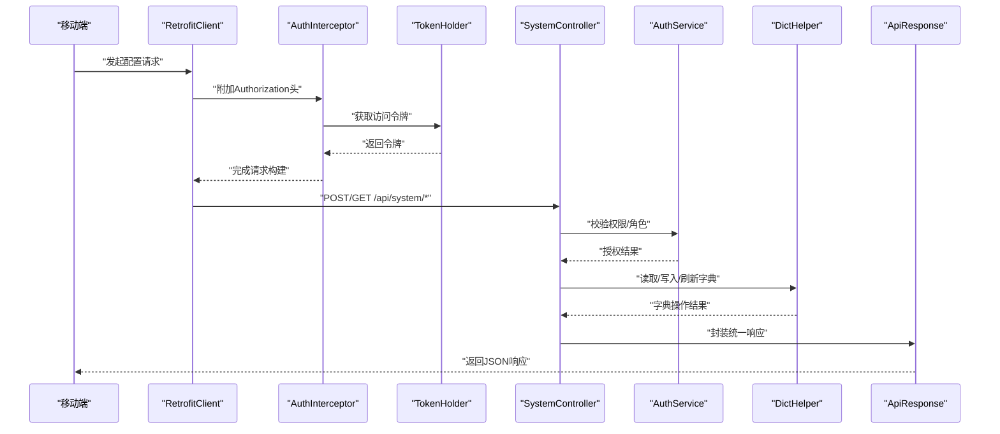
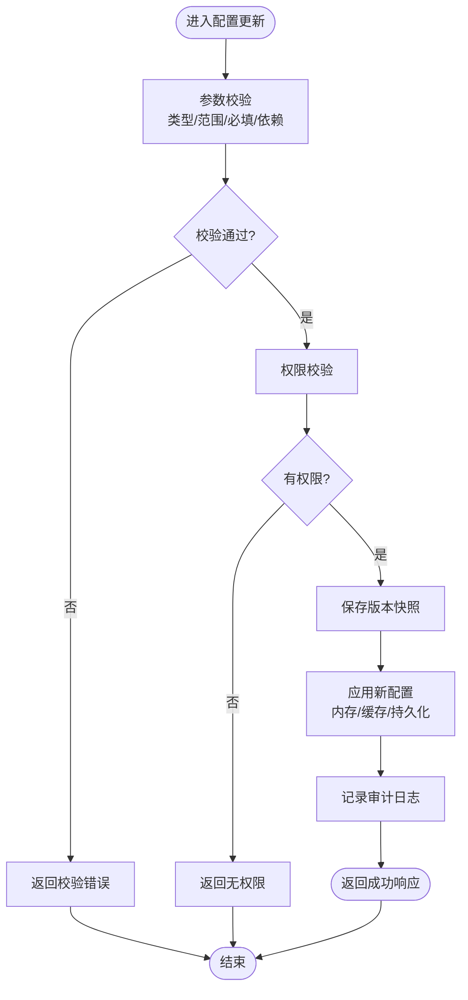
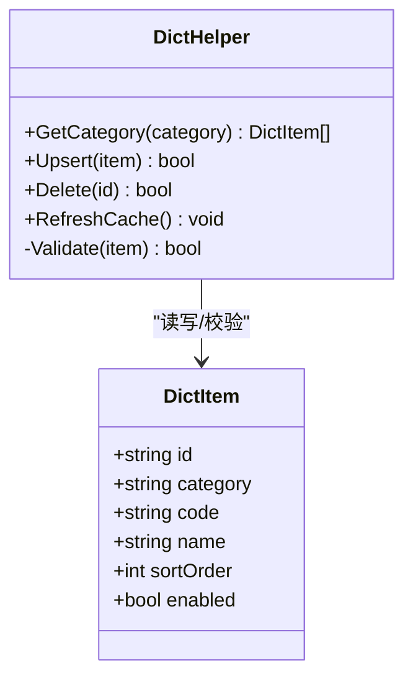
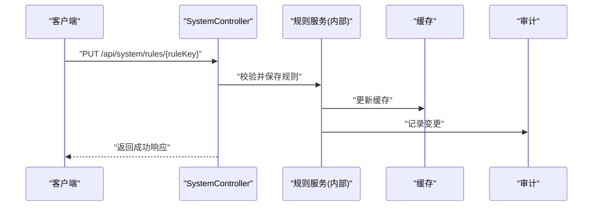
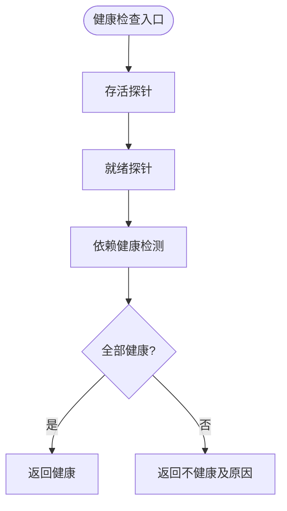
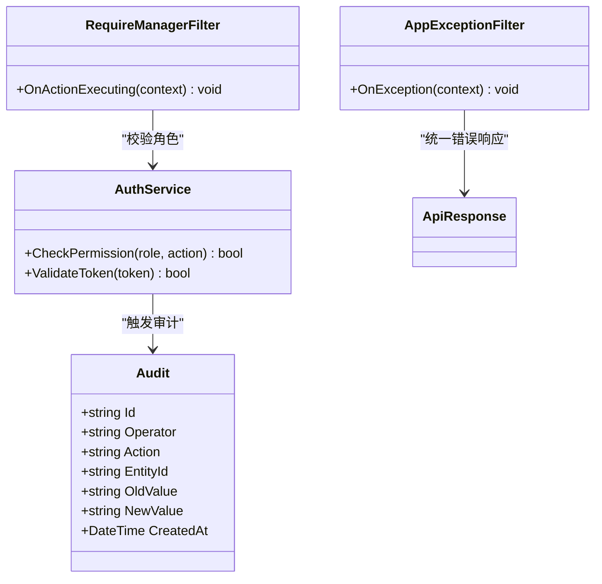
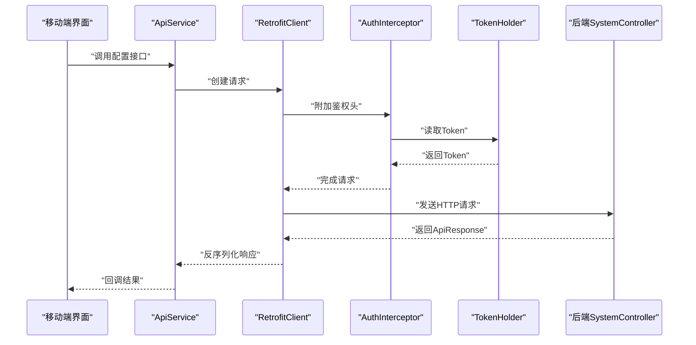
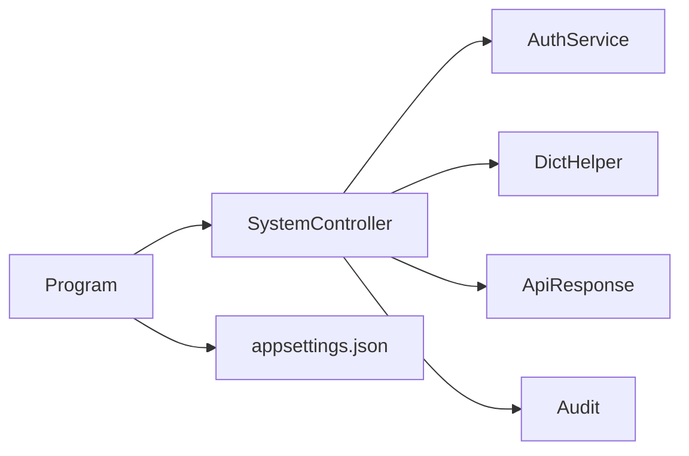

# 系统配置接口

<cite>
**本文档引用的文件**   
- [SystemController.cs](file://dip-system/api/Controllers/SystemController.cs)
- [AppExceptionFilter.cs](file://dip-system/api/Controllers/AppExceptionFilter.cs)
- [RequireManagerFilter.cs](file://dip-system/api/Controllers/RequireManagerFilter.cs)
- [AuthService.cs](file://dip-system/api/Services/AuthService.cs)
- [DictHelper.cs](file://dip-system/api/Services/DictHelper.cs)
- [ApiResponse.cs](file://dip-system/api/Models/ApiResponse.cs)
- [Audit.cs](file://dip-system/api/Models/Audit.cs)
- [BaseEntity.cs](file://dip-system/api/Models/BaseEntity.cs)
- [Program.cs](file://dip-system/api/Program.cs)
- [appsettings.json](file://dip-system/api/appsettings.json)
- [ApiService.kt](file://mobile-android/app/src/main/java/com/dip/material/data/network/ApiService.kt)
- [AuthInterceptor.kt](file://mobile-android/app/src/main/java/com/dip/material/data/network/AuthInterceptor.kt)
- [RetrofitClient.kt](file://mobile-android/app/src/main/java/com/dip/material/data/network/RetrofitClient.kt)
- [TokenHolder.kt](file://mobile-android/app/src/main/java/com/dip/material/data/network/TokenHolder.kt)
</cite>

## 目录
1. [简介](#简介)
2. [项目结构](#项目结构)
3. [核心组件](#核心组件)
4. [架构总览](#架构总览)
5. [详细组件分析](#详细组件分析)
6. [依赖关系分析](#依赖关系分析)
7. [性能考虑](#性能考虑)
8. [故障排查指南](#故障排查指南)
9. [结论](#结论)
10. [附录](#附录)

## 简介
本文件面向DIP系统的“配置管理”能力，聚焦以下HTTP接口与机制：
- 系统参数配置（增删改查、批量更新、校验）
- 字典数据管理（字典项的CRUD与缓存同步）
- 业务规则设置（规则开关、阈值、策略等）
- 监控指标与健康检查（系统健康、状态查询、诊断）
- 权限控制、变更审计与回滚
- 热更新、动态加载与版本管理

文档以后端API控制器与服务层为核心，结合前端与移动端调用示例，给出端到端接口规范与最佳实践。

## 项目结构
后端采用ASP.NET Core Web API，按功能划分Controllers、Services、Models；配置与启动由Program.cs与appsettings.json管理。移动端通过Kotlin Retrofit封装网络请求，统一鉴权拦截。

图表来源
- [SystemController.cs](file://dip-system/api/Controllers/SystemController.cs)
- [AuthService.cs](file://dip-system/api/Services/AuthService.cs)
- [DictHelper.cs](file://dip-system/api/Services/DictHelper.cs)
- [ApiResponse.cs](file://dip-system/api/Models/ApiResponse.cs)
- [Audit.cs](file://dip-system/api/Models/Audit.cs)
- [BaseEntity.cs](file://dip-system/api/Models/BaseEntity.cs)
- [Program.cs](file://dip-system/api/Program.cs)
- [appsettings.json](file://dip-system/api/appsettings.json)
- [ApiService.kt](file://mobile-android/app/src/main/java/com/dip/material/data/network/ApiService.kt)
- [AuthInterceptor.kt](file://mobile-android/app/src/main/java/com/dip/material/data/network/AuthInterceptor.kt)
- [RetrofitClient.kt](file://mobile-android/app/src/main/java/com/dip/material/data/network/RetrofitClient.kt)
- [TokenHolder.kt](file://mobile-android/app/src/main/java/com/dip/material/data/network/TokenHolder.kt)

章节来源
- [Program.cs](file://dip-system/api/Program.cs)
- [appsettings.json](file://dip-system/api/appsettings.json)

## 核心组件
- SystemController：提供系统配置、字典、规则、健康检查等HTTP端点，统一返回 ApiResponse。
- AuthService：负责JWT签发、校验、角色/权限判断，为配置类接口提供鉴权。
- DictHelper：字典数据的读取、缓存与刷新，保证字典一致性。
- Models：统一的响应体、审计记录与基础实体字段。
- Program/appsettings：中间件注册、认证配置、缓存与日志等全局设置。

章节来源
- [SystemController.cs](file://dip-system/api/Controllers/SystemController.cs)
- [AuthService.cs](file://dip-system/api/Services/AuthService.cs)
- [DictHelper.cs](file://dip-system/api/Services/DictHelper.cs)
- [ApiResponse.cs](file://dip-system/api/Models/ApiResponse.cs)
- [Audit.cs](file://dip-system/api/Models/Audit.cs)
- [BaseEntity.cs](file://dip-system/api/Models/BaseEntity.cs)

## 架构总览
下图展示从移动端到后端配置接口的完整调用链，包括鉴权、业务处理、缓存与审计。

图表来源
- [ApiService.kt](file://mobile-android/app/src/main/java/com/dip/material/data/network/ApiService.kt)
- [AuthInterceptor.kt](file://mobile-android/app/src/main/java/com/dip/material/data/network/AuthInterceptor.kt)
- [RetrofitClient.kt](file://mobile-android/app/src/main/java/com/dip/material/data/network/RetrofitClient.kt)
- [TokenHolder.kt](file://mobile-android/app/src/main/java/com/dip/material/data/network/TokenHolder.kt)
- [SystemController.cs](file://dip-system/api/Controllers/SystemController.cs)
- [AuthService.cs](file://dip-system/api/Services/AuthService.cs)
- [DictHelper.cs](file://dip-system/api/Services/DictHelper.cs)
- [ApiResponse.cs](file://dip-system/api/Models/ApiResponse.cs)

## 详细组件分析

### 系统参数配置接口
- 功能范围
  - 参数项CRUD：新增、修改、删除、查询单个或分页列表
  - 批量更新：支持一次性提交多条参数变更
  - 配置校验：类型、范围、必填、依赖关系校验
  - 版本管理：每次提交生成新版本，支持对比与回滚
  - 热更新：变更后即时生效或按策略延迟生效
- 典型端点
  - GET /api/system/configs/{id}：获取参数详情
  - POST /api/system/configs：新增参数
  - PUT /api/system/configs/{id}：更新参数
  - DELETE /api/system/configs/{id}：删除参数
  - POST /api/system/configs/batch：批量更新
  - GET /api/system/configs/version/{versionId}：查看某版本快照
  - POST /api/system/configs/rollback/{versionId}：回滚至指定版本
- 请求/响应要点
  - 请求体包含键、值、类型、描述、是否敏感、生效策略等
  - 响应统一使用 ApiResponse<T>
  - 错误码与消息遵循统一规范
- 权限与审计
  - 需要管理员或配置编辑角色
  - 所有变更写入审计表，记录操作人、时间、旧值与新值

图表来源
- [SystemController.cs](file://dip-system/api/Controllers/SystemController.cs)
- [ApiResponse.cs](file://dip-system/api/Models/ApiResponse.cs)
- [Audit.cs](file://dip-system/api/Models/Audit.cs)
- [BaseEntity.cs](file://dip-system/api/Models/BaseEntity.cs)

章节来源
- [SystemController.cs](file://dip-system/api/Controllers/SystemController.cs)
- [ApiResponse.cs](file://dip-system/api/Models/ApiResponse.cs)
- [Audit.cs](file://dip-system/api/Models/Audit.cs)
- [BaseEntity.cs](file://dip-system/api/Models/BaseEntity.cs)

### 字典数据管理接口
- 功能范围
  - 字典分类与字典项CRUD
  - 字典缓存：本地缓存+失效策略
  - 字典刷新：按需刷新或定时刷新
  - 字典校验：编码唯一性、层级约束
- 典型端点
  - GET /api/system/dicts/{category}：获取分类下字典项
  - POST /api/system/dicts：新增字典项
  - PUT /api/system/dicts/{id}：更新字典项
  - DELETE /api/system/dicts/{id}：删除字典项
  - POST /api/system/dicts/cache/refresh：刷新字典缓存
- 权限与审计
  - 需要字典管理角色
  - 变更写入审计日志

图表来源
- [DictHelper.cs](file://dip-system/api/Services/DictHelper.cs)

章节来源
- [DictHelper.cs](file://dip-system/api/Services/DictHelper.cs)

### 业务规则设置接口
- 功能范围
  - 规则开关、阈值、策略参数的CRUD
  - 规则校验：互斥、依赖、范围
  - 动态加载：运行时重载规则
- 典型端点
  - GET /api/system/rules/{ruleKey}：获取规则
  - PUT /api/system/rules/{ruleKey}：更新规则
  - POST /api/system/rules/reload：重载规则
- 权限与审计
  - 需要规则管理角色
  - 变更写入审计日志

图表来源
- [SystemController.cs](file://dip-system/api/Controllers/SystemController.cs)
- [ApiResponse.cs](file://dip-system/api/Models/ApiResponse.cs)
- [Audit.cs](file://dip-system/api/Models/Audit.cs)

章节来源
- [SystemController.cs](file://dip-system/api/Controllers/SystemController.cs)
- [ApiResponse.cs](file://dip-system/api/Models/ApiResponse.cs)
- [Audit.cs](file://dip-system/api/Models/Audit.cs)

### 监控指标与健康检查接口
- 功能范围
  - 健康检查：存活、就绪、依赖健康（数据库、缓存等）
  - 状态查询：运行状态、负载、线程池、GC统计
  - 诊断信息：最近错误、慢请求、配置差异
- 典型端点
  - GET /api/system/health：健康检查
  - GET /api/system/status：运行状态
  - GET /api/system/metrics：监控指标
  - GET /api/system/diagnostics：诊断信息
- 权限与审计
  - 健康检查可匿名访问
  - 状态与诊断需运维角色

图表来源
- [SystemController.cs](file://dip-system/api/Controllers/SystemController.cs)
- [ApiResponse.cs](file://dip-system/api/Models/ApiResponse.cs)

章节来源
- [SystemController.cs](file://dip-system/api/Controllers/SystemController.cs)
- [ApiResponse.cs](file://dip-system/api/Models/ApiResponse.cs)

### 权限控制与审计
- 权限模型
  - 基于角色的访问控制（RBAC），通过AuthService进行校验
  - 配置相关接口要求管理员或特定角色
- 审计记录
  - 所有写操作记录审计表，包含操作人、时间、实体ID、动作、新旧值摘要
- 过滤器
  - RequireManagerFilter：用于强管控的管理员级操作
  - AppExceptionFilter：统一异常捕获与错误响应

图表来源
- [AuthService.cs](file://dip-system/api/Services/AuthService.cs)
- [RequireManagerFilter.cs](file://dip-system/api/Controllers/RequireManagerFilter.cs)
- [AppExceptionFilter.cs](file://dip-system/api/Controllers/AppExceptionFilter.cs)
- [Audit.cs](file://dip-system/api/Models/Audit.cs)
- [ApiResponse.cs](file://dip-system/api/Models/ApiResponse.cs)

章节来源
- [AuthService.cs](file://dip-system/api/Services/AuthService.cs)
- [RequireManagerFilter.cs](file://dip-system/api/Controllers/RequireManagerFilter.cs)
- [AppExceptionFilter.cs](file://dip-system/api/Controllers/AppExceptionFilter.cs)
- [Audit.cs](file://dip-system/api/Models/Audit.cs)
- [ApiResponse.cs](file://dip-system/api/Models/ApiResponse.cs)

### 移动端调用示例
- 网络层
  - ApiService：声明配置相关接口方法
  - RetrofitClient：初始化OkHttp与BaseUrl
  - AuthInterceptor：自动附加Authorization头
  - TokenHolder：维护当前访问令牌
- 调用流程
  - 登录成功后保存Token
  - 后续请求通过拦截器自动携带Token
  - 解析统一响应体

图表来源
- [ApiService.kt](file://mobile-android/app/src/main/java/com/dip/material/data/network/ApiService.kt)
- [RetrofitClient.kt](file://mobile-android/app/src/main/java/com/dip/material/data/network/RetrofitClient.kt)
- [AuthInterceptor.kt](file://mobile-android/app/src/main/java/com/dip/material/data/network/AuthInterceptor.kt)
- [TokenHolder.kt](file://mobile-android/app/src/main/java/com/dip/material/data/network/TokenHolder.kt)
- [SystemController.cs](file://dip-system/api/Controllers/SystemController.cs)

章节来源
- [ApiService.kt](file://mobile-android/app/src/main/java/com/dip/material/data/network/ApiService.kt)
- [RetrofitClient.kt](file://mobile-android/app/src/main/java/com/dip/material/data/network/RetrofitClient.kt)
- [AuthInterceptor.kt](file://mobile-android/app/src/main/java/com/dip/material/data/network/AuthInterceptor.kt)
- [TokenHolder.kt](file://mobile-android/app/src/main/java/com/dip/material/data/network/TokenHolder.kt)

## 依赖关系分析
- 控制器依赖服务层：SystemController依赖AuthService与DictHelper
- 服务层依赖模型：统一响应与审计记录
- 启动与配置：Program注册中间件与依赖注入，appsettings提供运行时配置
- 移动端依赖网络库：Retrofit、OkHttp、自定义拦截器

图表来源
- [SystemController.cs](file://dip-system/api/Controllers/SystemController.cs)
- [AuthService.cs](file://dip-system/api/Services/AuthService.cs)
- [DictHelper.cs](file://dip-system/api/Services/DictHelper.cs)
- [ApiResponse.cs](file://dip-system/api/Models/ApiResponse.cs)
- [Audit.cs](file://dip-system/api/Models/Audit.cs)
- [Program.cs](file://dip-system/api/Program.cs)
- [appsettings.json](file://dip-system/api/appsettings.json)

章节来源
- [SystemController.cs](file://dip-system/api/Controllers/SystemController.cs)
- [AuthService.cs](file://dip-system/api/Services/AuthService.cs)
- [DictHelper.cs](file://dip-system/api/Services/DictHelper.cs)
- [ApiResponse.cs](file://dip-system/api/Models/ApiResponse.cs)
- [Audit.cs](file://dip-system/api/Models/Audit.cs)
- [Program.cs](file://dip-system/api/Program.cs)
- [appsettings.json](file://dip-system/api/appsettings.json)

## 性能考虑
- 缓存策略
  - 字典数据采用本地缓存，避免频繁IO
  - 配置项可按热点分级缓存，设置过期与刷新策略
- 并发与锁
  - 批量更新使用分布式锁或乐观锁防止冲突
  - 热更新时采用原子替换，避免脏读
- 异步处理
  - 耗时操作（如规则重载、缓存预热）异步执行
- 监控与限流
  - 对配置写入接口限流，防止滥用
  - 暴露关键指标（QPS、延迟、错误率）

[本节为通用指导，不直接分析具体文件]

## 故障排查指南
- 常见错误
  - 权限不足：检查角色与权限分配
  - 校验失败：检查参数类型、范围与依赖关系
  - 缓存不一致：手动刷新字典缓存或重启服务
- 定位步骤
  - 查看统一错误响应中的message与code
  - 检查审计日志确认变更轨迹
  - 使用健康检查与诊断接口定位依赖问题
- 恢复措施
  - 使用版本回滚恢复到稳定版本
  - 清理异常缓存后重试

章节来源
- [AppExceptionFilter.cs](file://dip-system/api/Controllers/AppExceptionFilter.cs)
- [Audit.cs](file://dip-system/api/Models/Audit.cs)
- [ApiResponse.cs](file://dip-system/api/Models/ApiResponse.cs)

## 结论
本文件系统化梳理了DIP系统配置管理的HTTP接口与实现要点，涵盖参数配置、字典管理、业务规则、健康检查、权限审计、热更新与版本回滚等关键能力。建议在生产环境启用严格的权限控制、完善的审计与监控，并结合缓存与限流策略保障稳定性与性能。

[本节为总结性内容，不直接分析具体文件]

## 附录
- 统一响应体字段说明
  - code：业务状态码
  - message：提示信息
  - data：业务数据
  - timestamp：响应时间戳
- 审计记录关键字段
  - operator：操作人
  - action：动作类型
  - entityId：实体标识
  - oldValue/newValue：变更前后值
  - createdAt：创建时间

章节来源
- [ApiResponse.cs](file://dip-system/api/Models/ApiResponse.cs)
- [Audit.cs](file://dip-system/api/Models/Audit.cs)
- [BaseEntity.cs](file://dip-system/api/Models/BaseEntity.cs)