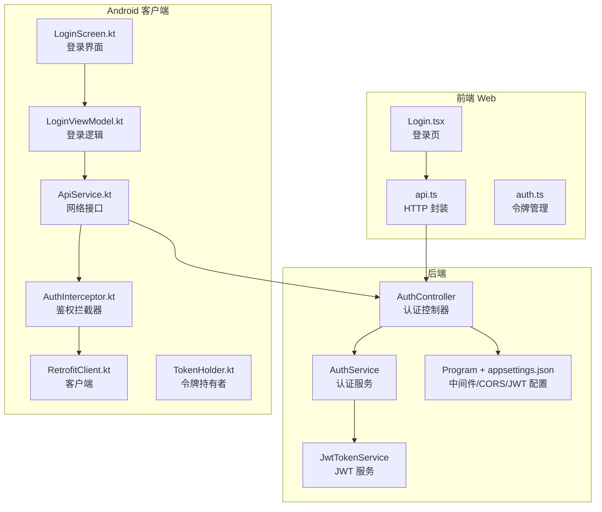
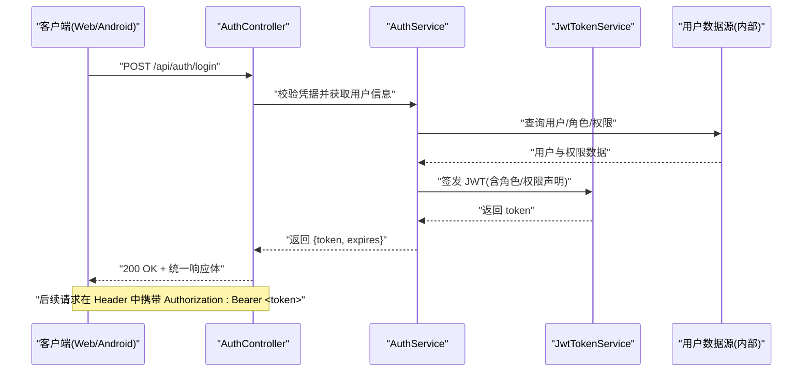
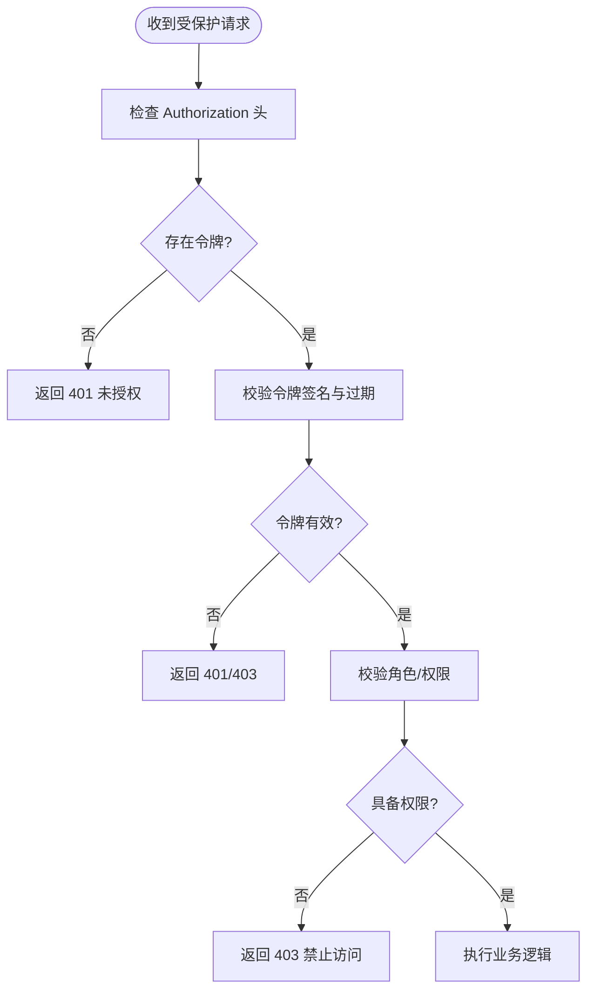
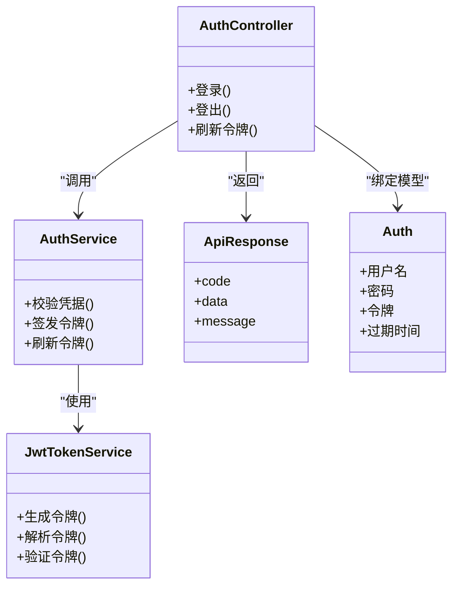

# 认证授权接口

<cite>
**本文引用的文件**   
- [AuthController.cs](file://dip-system/api/Controllers/AuthController.cs)
- [AuthService.cs](file://dip-system/api/Services/AuthService.cs)
- [JwtTokenService.cs](file://dip-system/api/Services/JwtTokenService.cs)
- [Auth.cs](file://dip-system/api/Models/Auth.cs)
- [ApiResponse.cs](file://dip-system/api/Models/ApiResponse.cs)
- [Program.cs](file://dip-system/api/Program.cs)
- [appsettings.json](file://dip-system/api/appsettings.json)
- [api.ts](file://dip-system/frontend-web/src/lib/api.ts)
- [auth.ts](file://dip-system/frontend-web/src/lib/auth.ts)
- [Login.tsx](file://dip-system/frontend-web/src/pages/Login.tsx)
- [ApiService.kt](file://mobile-android/app/src/main/java/com/dip/material/data/network/ApiService.kt)
- [AuthInterceptor.kt](file://mobile-android/app/src/main/java/com/dip/material/data/network/AuthInterceptor.kt)
- [RetrofitClient.kt](file://mobile-android/app/src/main/java/com/dip/material/data/network/RetrofitClient.kt)
- [TokenHolder.kt](file://mobile-android/app/src/main/java/com/dip/material/data/network/TokenHolder.kt)
- [LoginScreen.kt](file://mobile-android/app/src/main/java/com/dip/material/ui/login/LoginScreen.kt)
- [LoginViewModel.kt](file://mobile-android/app/src/main/java/com/dip/material/ui/login/LoginViewModel.kt)
</cite>

## 目录
1. [简介](#简介)
2. [项目结构](#项目结构)
3. [核心组件](#核心组件)
4. [架构总览](#架构总览)
5. [详细组件分析](#详细组件分析)
6. [依赖关系分析](#依赖关系分析)
7. [性能考虑](#性能考虑)
8. [故障排查指南](#故障排查指南)
9. [结论](#结论)
10. [附录](#附录)

## 简介
本文件为 DIP 系统的认证与授权 API 提供完整、可操作的文档，覆盖用户登录、登出、令牌刷新等接口的 HTTP 方法、URL 路径、请求参数与响应格式；详细说明 JWT 令牌的获取、验证、刷新机制（含令牌结构、过期时间与安全策略）；阐述身份验证流程、权限检查机制与角色管理；并提供完整的请求/响应示例、错误处理示例、安全最佳实践、令牌存储建议、跨域配置以及客户端集成代码示例与常见问题解决方案。

## 项目结构
认证授权相关能力主要分布在后端 API 控制器与服务层、前端 Web 与 Android 客户端的认证模块中：
- 后端 API
  - 控制器：AuthController 暴露认证相关 HTTP 端点
  - 服务层：AuthService 负责业务逻辑（如校验凭据、会话管理等），JwtTokenService 负责 JWT 生成与校验
  - 模型：Auth 定义登录/注册/令牌相关的数据结构，ApiResponse 统一返回格式
  - 配置：Program 与 appsettings.json 用于注册中间件、CORS、JWT 设置等
- 前端 Web
  - api.ts 封装 HTTP 调用与拦截器
  - auth.ts 管理本地令牌与鉴权状态
  - Login.tsx 登录页面与交互
- 移动端 Android
  - ApiService.kt 定义网络接口
  - AuthInterceptor.kt 自动附加 Authorization 头
  - RetrofitClient.kt 构建网络客户端
  - TokenHolder.kt 持有并持久化令牌
  - LoginScreen.kt / LoginViewModel.kt 登录界面与逻辑

图表来源
- [AuthController.cs](file://dip-system/api/Controllers/AuthController.cs)
- [AuthService.cs](file://dip-system/api/Services/AuthService.cs)
- [JwtTokenService.cs](file://dip-system/api/Services/JwtTokenService.cs)
- [Program.cs](file://dip-system/api/Program.cs)
- [appsettings.json](file://dip-system/api/appsettings.json)
- [api.ts](file://dip-system/frontend-web/src/lib/api.ts)
- [auth.ts](file://dip-system/frontend-web/src/lib/auth.ts)
- [Login.tsx](file://dip-system/frontend-web/src/pages/Login.tsx)
- [ApiService.kt](file://mobile-android/app/src/main/java/com/dip/material/data/network/ApiService.kt)
- [AuthInterceptor.kt](file://mobile-android/app/src/main/java/com/dip/material/data/network/AuthInterceptor.kt)
- [RetrofitClient.kt](file://mobile-android/app/src/main/java/com/dip/material/data/network/RetrofitClient.kt)
- [TokenHolder.kt](file://mobile-android/app/src/main/java/com/dip/material/data/network/TokenHolder.kt)
- [LoginScreen.kt](file://mobile-android/app/src/main/java/com/dip/material/ui/login/LoginScreen.kt)
- [LoginViewModel.kt](file://mobile-android/app/src/main/java/com/dip/material/ui/login/LoginViewModel.kt)

章节来源
- [AuthController.cs](file://dip-system/api/Controllers/AuthController.cs)
- [AuthService.cs](file://dip-system/api/Services/AuthService.cs)
- [JwtTokenService.cs](file://dip-system/api/Services/JwtTokenService.cs)
- [Auth.cs](file://dip-system/api/Models/Auth.cs)
- [ApiResponse.cs](file://dip-system/api/Models/ApiResponse.cs)
- [Program.cs](file://dip-system/api/Program.cs)
- [appsettings.json](file://dip-system/api/appsettings.json)
- [api.ts](file://dip-system/frontend-web/src/lib/api.ts)
- [auth.ts](file://dip-system/frontend-web/src/lib/auth.ts)
- [Login.tsx](file://dip-system/frontend-web/src/pages/Login.tsx)
- [ApiService.kt](file://mobile-android/app/src/main/java/com/dip/material/data/network/ApiService.kt)
- [AuthInterceptor.kt](file://mobile-android/app/src/main/java/com/dip/material/data/network/AuthInterceptor.kt)
- [RetrofitClient.kt](file://mobile-android/app/src/main/java/com/dip/material/data/network/RetrofitClient.kt)
- [TokenHolder.kt](file://mobile-android/app/src/main/java/com/dip/material/data/network/TokenHolder.kt)
- [LoginScreen.kt](file://mobile-android/app/src/main/java/com/dip/material/ui/login/LoginScreen.kt)
- [LoginViewModel.kt](file://mobile-android/app/src/main/java/com/dip/material/ui/login/LoginViewModel.kt)

## 核心组件
- 认证控制器（AuthController）
  - 职责：接收登录、登出、刷新令牌等 HTTP 请求，调用服务层完成业务处理，返回统一响应体
  - 关键端点：登录、登出、刷新令牌（具体方法与路径见“接口定义”）
- 认证服务（AuthService）
  - 职责：校验用户名/密码、查询用户信息、签发/刷新令牌、维护会话或黑名单（如有）
- JWT 令牌服务（JwtTokenService）
  - 职责：生成、解析、验证 JWT；设置签名算法、有效期、受众/签发方等声明
- 数据模型（Auth、ApiResponse）
  - 职责：定义登录请求/响应、令牌数据结构与统一返回格式
- 前端与移动端
  - 职责：发起认证请求、保存与注入令牌、处理鉴权失败与重试

章节来源
- [AuthController.cs](file://dip-system/api/Controllers/AuthController.cs)
- [AuthService.cs](file://dip-system/api/Services/AuthService.cs)
- [JwtTokenService.cs](file://dip-system/api/Services/JwtTokenService.cs)
- [Auth.cs](file://dip-system/api/Models/Auth.cs)
- [ApiResponse.cs](file://dip-system/api/Models/ApiResponse.cs)

## 架构总览
下图展示了从客户端到后端的认证授权主流程：客户端通过登录接口获取 JWT，后续请求携带 Authorization: Bearer <token>，服务端通过中间件或服务层校验令牌与权限。

图表来源
- [AuthController.cs](file://dip-system/api/Controllers/AuthController.cs)
- [AuthService.cs](file://dip-system/api/Services/AuthService.cs)
- [JwtTokenService.cs](file://dip-system/api/Services/JwtTokenService.cs)

## 详细组件分析

### 接口定义与示例
- 登录
  - 方法：POST
  - 路径：/api/auth/login
  - 请求体字段：用户名、密码（具体字段名以模型为准）
  - 成功响应：包含访问令牌、令牌类型、过期时间戳等
  - 失败响应：统一错误码与消息
- 登出
  - 方法：POST
  - 路径：/api/auth/logout
  - 说明：清除服务端会话或加入黑名单（若实现）
- 刷新令牌
  - 方法：POST
  - 路径：/api/auth/refresh
  - 请求体：刷新令牌（若使用双令牌模式）
  - 成功响应：新的访问令牌与过期时间

请求示例（JSON）
- 登录
  - 请求体：{ "username": "...", "password": "..." }
  - 响应体：{ "code": 0, "data": { "token": "...", "expires_in": 数字, "type": "Bearer" }, "message": "成功" }
- 刷新令牌
  - 请求体：{ "refresh_token": "..." }
  - 响应体：同登录成功响应

错误处理示例
- 401 未授权：用户名或密码错误、令牌无效或已过期
- 403 禁止访问：无相应角色/权限
- 500 服务器错误：内部异常

章节来源
- [AuthController.cs](file://dip-system/api/Controllers/AuthController.cs)
- [AuthService.cs](file://dip-system/api/Services/AuthService.cs)
- [Auth.cs](file://dip-system/api/Models/Auth.cs)
- [ApiResponse.cs](file://dip-system/api/Models/ApiResponse.cs)

### JWT 令牌机制
- 令牌结构
  - 头部：算法、类型
  - 载荷：用户标识、角色、权限、签发时间、过期时间、签发方、受众等
  - 签名：使用对称或非对称算法签名
- 过期时间
  - 访问令牌：短时效（例如分钟级），降低泄露风险
  - 刷新令牌：长时效（例如天级），用于换取新访问令牌
- 安全策略
  - 强制 HTTPS
  - 最小化载荷，避免敏感信息
  - 严格校验签名、过期时间与受众
  - 支持令牌黑名单/撤销（可选）
  - 防重放与固定时间比较（针对敏感操作）

章节来源
- [JwtTokenService.cs](file://dip-system/api/Services/JwtTokenService.cs)
- [AuthService.cs](file://dip-system/api/Services/AuthService.cs)

### 身份验证与权限检查
- 身份验证
  - 登录成功后颁发 JWT
  - 后续请求需在 Authorization 头携带 Bearer 令牌
  - 服务端中间件或服务层校验令牌有效性
- 权限检查
  - 基于角色的访问控制（RBAC）
  - 可在控制器或过滤器上声明所需角色/权限
  - 未授权时返回 401/403

图表来源
- [AuthController.cs](file://dip-system/api/Controllers/AuthController.cs)
- [AuthService.cs](file://dip-system/api/Services/AuthService.cs)
- [JwtTokenService.cs](file://dip-system/api/Services/JwtTokenService.cs)

### 客户端集成（Web）
- 登录流程
  - 调用登录接口，成功后保存 token 与过期时间
  - 将 token 写入请求拦截器，所有后续请求自动附带
- 刷新流程
  - 当访问令牌过期时，使用刷新令牌换取新访问令牌
  - 更新本地存储并重试原请求
- 错误处理
  - 捕获 401/403，引导重新登录或提示权限不足

章节来源
- [api.ts](file://dip-system/frontend-web/src/lib/api.ts)
- [auth.ts](file://dip-system/frontend-web/src/lib/auth.ts)
- [Login.tsx](file://dip-system/frontend-web/src/pages/Login.tsx)

### 客户端集成（Android）
- 登录流程
  - 调用登录接口，成功后持久化 token（TokenHolder）
  - 通过拦截器（AuthInterceptor）自动添加 Authorization 头
- 刷新流程
  - 检测到 401 时，使用刷新令牌获取新访问令牌
  - 更新 TokenHolder 并重试请求
- 错误处理
  - 统一处理网络与鉴权错误，提示用户

章节来源
- [ApiService.kt](file://mobile-android/app/src/main/java/com/dip/material/data/network/ApiService.kt)
- [AuthInterceptor.kt](file://mobile-android/app/src/main/java/com/dip/material/data/network/AuthInterceptor.kt)
- [RetrofitClient.kt](file://mobile-android/app/src/main/java/com/dip/material/data/network/RetrofitClient.kt)
- [TokenHolder.kt](file://mobile-android/app/src/main/java/com/dip/material/data/network/TokenHolder.kt)
- [LoginScreen.kt](file://mobile-android/app/src/main/java/com/dip/material/ui/login/LoginScreen.kt)
- [LoginViewModel.kt](file://mobile-android/app/src/main/java/com/dip/material/ui/login/LoginViewModel.kt)

## 依赖关系分析
- 控制器依赖服务层，服务层依赖 JWT 服务与数据源
- 前端与移动端依赖统一的 API 契约与错误码约定
- CORS、JWT 中间件由 Program 与配置文件集中管理

图表来源
- [AuthController.cs](file://dip-system/api/Controllers/AuthController.cs)
- [AuthService.cs](file://dip-system/api/Services/AuthService.cs)
- [JwtTokenService.cs](file://dip-system/api/Services/JwtTokenService.cs)
- [Auth.cs](file://dip-system/api/Models/Auth.cs)
- [ApiResponse.cs](file://dip-system/api/Models/ApiResponse.cs)

章节来源
- [AuthController.cs](file://dip-system/api/Controllers/AuthController.cs)
- [AuthService.cs](file://dip-system/api/Services/AuthService.cs)
- [JwtTokenService.cs](file://dip-system/api/Services/JwtTokenService.cs)
- [Auth.cs](file://dip-system/api/Models/Auth.cs)
- [ApiResponse.cs](file://dip-system/api/Models/ApiResponse.cs)

## 性能考虑
- 令牌校验开销低，但应避免频繁刷新；合理设置访问令牌过期时间
- 登录接口应限制频率，防止暴力破解
- 对敏感操作增加二次确认或验证码
- 缓存热点用户信息（如角色/权限）以减少数据库压力（需保证一致性）
- 使用连接池与异步 I/O，提升并发处理能力

[本节为通用指导，不直接分析具体文件]

## 故障排查指南
- 常见错误
  - 401 未授权：检查 Authorization 头是否携带正确令牌；确认令牌未过期且签名有效
  - 403 禁止访问：检查用户角色/权限是否满足接口要求
  - 500 服务器错误：查看服务端日志定位异常
- 调试建议
  - 启用详细日志记录（脱敏）
  - 使用 Postman/curl 复现问题
  - 检查 CORS 配置是否正确
- 常见问题
  - 跨域失败：确保后端允许前端域名、方法与头
  - 令牌刷新失败：确认刷新令牌有效且未被撤销
  - 多设备登录冲突：根据策略决定是否允许并发会话

章节来源
- [AuthController.cs](file://dip-system/api/Controllers/AuthController.cs)
- [AuthService.cs](file://dip-system/api/Services/AuthService.cs)
- [JwtTokenService.cs](file://dip-system/api/Services/JwtTokenService.cs)

## 结论
DIP 系统采用标准的 JWT 认证授权方案，前后端分离清晰，职责明确。通过统一的响应体与错误码、完善的客户端拦截与刷新机制，实现了稳定可靠的鉴权体验。建议在生产环境严格遵循安全最佳实践，持续监控与审计认证行为，保障系统安全与性能。

[本节为总结性内容，不直接分析具体文件]

## 附录

### 安全最佳实践
- 强制 HTTPS
- 最小化令牌载荷，避免敏感信息
- 短期访问令牌 + 长期刷新令牌
- 严格的签名与过期校验
- 支持令牌黑名单/撤销
- 防暴力破解与限流
- 安全的令牌存储（HttpOnly Cookie、安全存储）

[本节为通用指导，不直接分析具体文件]

### 令牌存储建议
- Web：优先使用 HttpOnly Cookie，避免 XSS 窃取；必要时使用内存存储
- Android：使用加密存储（如 EncryptedSharedPreferences）或安全密钥库
- 避免将令牌存储在 localStorage（易被 XSS 读取）

[本节为通用指导，不直接分析具体文件]

### 跨域配置
- 后端允许前端域名、方法与头
- 预检请求（OPTIONS）正确处理
- 仅开放必要的资源与接口

章节来源
- [Program.cs](file://dip-system/api/Program.cs)
- [appsettings.json](file://dip-system/api/appsettings.json)

### 客户端集成代码示例（路径指引）
- Web 登录与拦截器
  - [api.ts](file://dip-system/frontend-web/src/lib/api.ts)
  - [auth.ts](file://dip-system/frontend-web/src/lib/auth.ts)
  - [Login.tsx](file://dip-system/frontend-web/src/pages/Login.tsx)
- Android 登录与拦截器
  - [ApiService.kt](file://mobile-android/app/src/main/java/com/dip/material/data/network/ApiService.kt)
  - [AuthInterceptor.kt](file://mobile-android/app/src/main/java/com/dip/material/data/network/AuthInterceptor.kt)
  - [RetrofitClient.kt](file://mobile-android/app/src/main/java/com/dip/material/data/network/RetrofitClient.kt)
  - [TokenHolder.kt](file://mobile-android/app/src/main/java/com/dip/material/data/network/TokenHolder.kt)
  - [LoginScreen.kt](file://mobile-android/app/src/main/java/com/dip/material/ui/login/LoginScreen.kt)
  - [LoginViewModel.kt](file://mobile-android/app/src/main/java/com/dip/material/ui/login/LoginViewModel.kt)