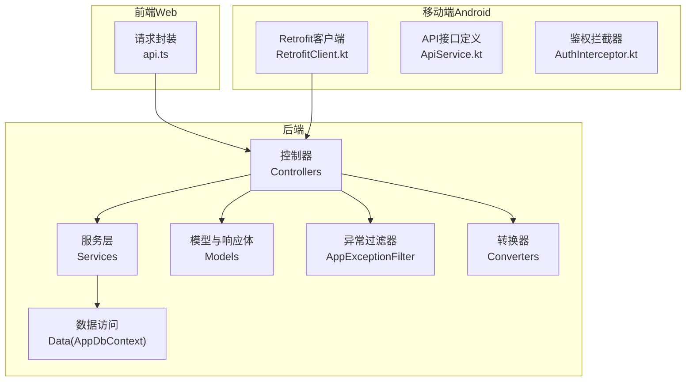
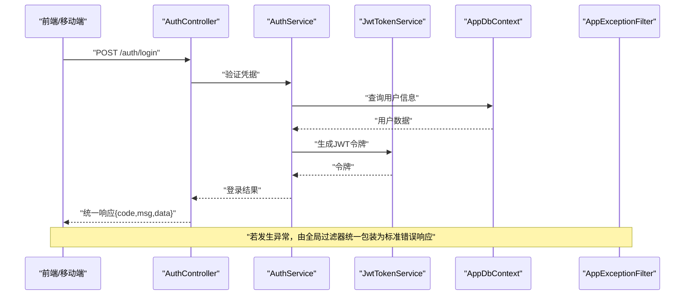
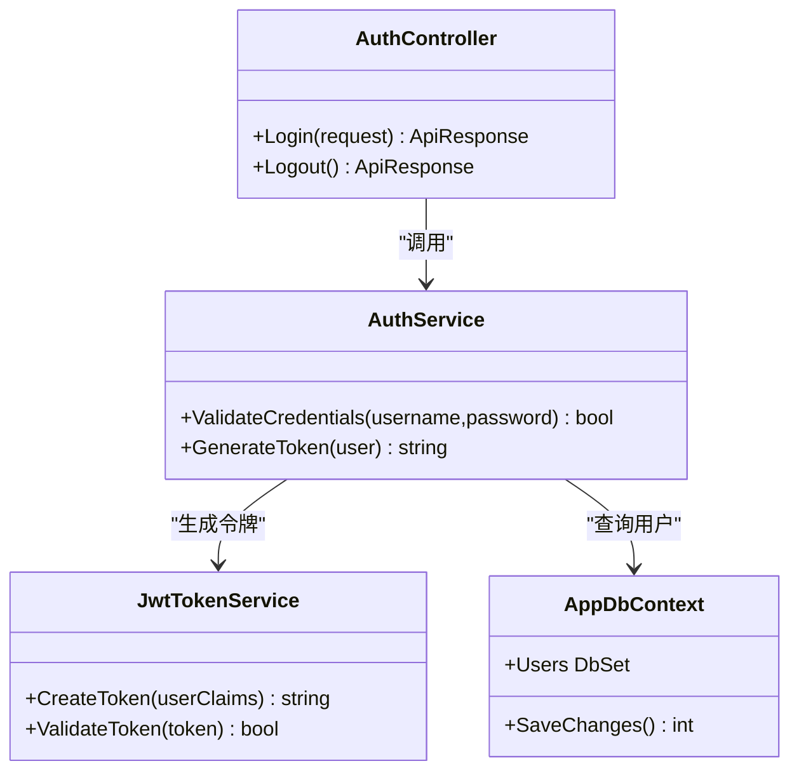
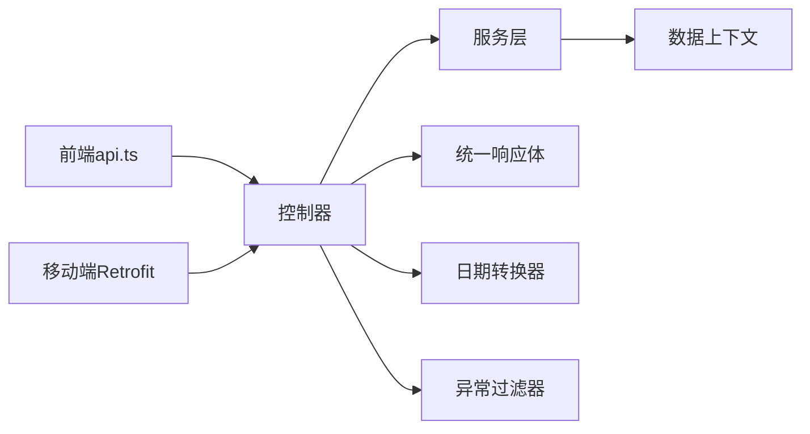

# 通用接口规范

<cite>
**本文引用的文件**   
- [Program.cs](file://dip-system/api/Program.cs)
- [AppExceptionFilter.cs](file://dip-system/api/Controllers/AppExceptionFilter.cs)
- [ApiResponse.cs](file://dip-system/api/Models/ApiResponse.cs)
- [BaseEntity.cs](file://dip-system/api/Models/BaseEntity.cs)
- [LocalDateTimeConverter.cs](file://dip-system/api/Converters/LocalDateTimeConverter.cs)
- [AuthController.cs](file://dip-system/api/Controllers/AuthController.cs)
- [AuthService.cs](file://dip-system/api/Services/AuthService.cs)
- [JwtTokenService.cs](file://dip-system/api/Services/JwtTokenService.cs)
- [AppDbContext.cs](file://dip-system/api/Data/AppDbContext.cs)
- [api.ts](file://dip-system/frontend-web/src/lib/api.ts)
- [RetrofitClient.kt](file://mobile-android/app/src/main/java/com/dip/material/data/network/RetrofitClient.kt)
- [ApiService.kt](file://mobile-android/app/src/main/java/com/dip/material/data/network/ApiService.kt)
- [AuthInterceptor.kt](file://mobile-android/app/src/main/java/com/dip/material/data/network/AuthInterceptor.kt)
</cite>

## 目录
1. [简介](#简介)
2. [项目结构](#项目结构)
3. [核心组件](#核心组件)
4. [架构总览](#架构总览)
5. [详细组件分析](#详细组件分析)
6. [依赖关系分析](#依赖关系分析)
7. [性能考虑](#性能考虑)
8. [故障排查指南](#故障排查指南)
9. [结论](#结论)
10. [附录](#附录)

## 简介
本规范面向DIP系统前后端与移动端，统一API响应格式、错误码定义与异常处理机制；明确BaseEntity基类、数据转换器、通用工具类的用法；规范分页查询、排序过滤、批量操作的调用约定；提供数据验证、参数绑定、格式转换的最佳实践；并给出通用的请求封装、响应处理、错误拦截的实现示例。同时覆盖API版本控制、向后兼容性与废弃接口处理策略，以及性能优化、缓存与限流的配置建议。

## 项目结构
后端采用ASP.NET Core API，分层清晰：控制器（Controllers）负责HTTP边界，服务层（Services）承载业务逻辑，模型（Models）定义实体与统一响应体，转换器（Converters）处理序列化细节，数据访问通过EF Core上下文（Data）。前端Web使用TypeScript/React，集中封装HTTP请求与响应处理；移动端Android使用Kotlin+Retrofit，统一鉴权与网络栈。

**图表来源** 
- [Program.cs](file://dip-system/api/Program.cs)
- [AppExceptionFilter.cs](file://dip-system/api/Controllers/AppExceptionFilter.cs)
- [ApiResponse.cs](file://dip-system/api/Models/ApiResponse.cs)
- [BaseEntity.cs](file://dip-system/api/Models/BaseEntity.cs)
- [LocalDateTimeConverter.cs](file://dip-system/api/Converters/LocalDateTimeConverter.cs)
- [api.ts](file://dip-system/frontend-web/src/lib/api.ts)
- [RetrofitClient.kt](file://mobile-android/app/src/main/java/com/dip/material/data/network/RetrofitClient.kt)
- [ApiService.kt](file://mobile-android/app/src/main/java/com/dip/material/data/network/ApiService.kt)
- [AuthInterceptor.kt](file://mobile-android/app/src/main/java/com/dip/material/data/network/AuthInterceptor.kt)

**章节来源**
- [Program.cs](file://dip-system/api/Program.cs)
- [AppExceptionFilter.cs](file://dip-system/api/Controllers/AppExceptionFilter.cs)
- [ApiResponse.cs](file://dip-system/api/Models/ApiResponse.cs)
- [BaseEntity.cs](file://dip-system/api/Models/BaseEntity.cs)
- [LocalDateTimeConverter.cs](file://dip-system/api/Converters/LocalDateTimeConverter.cs)
- [api.ts](file://dip-system/frontend-web/src/lib/api.ts)
- [RetrofitClient.kt](file://mobile-android/app/src/main/java/com/dip/material/data/network/RetrofitClient.kt)
- [ApiService.kt](file://mobile-android/app/src/main/java/com/dip/material/data/network/ApiService.kt)
- [AuthInterceptor.kt](file://mobile-android/app/src/main/java/com/dip/material/data/network/AuthInterceptor.kt)

## 核心组件
- 统一响应体 ApiResponse：所有API返回统一的JSON结构，包含状态码、消息、数据与时间戳等字段，便于前后端一致解析。
- 基础实体 BaseEntity：为所有领域实体提供通用字段（如创建/更新时间、审计信息等），确保数据一致性。
- 异常过滤器 AppExceptionFilter：全局捕获未处理异常，转换为标准错误响应，避免堆栈泄露。
- 数据转换器 LocalDateTimeConverter：统一日期时间序列化/反序列化格式，避免时区与格式不一致问题。
- 前端请求封装 api.ts：统一发起HTTP请求、处理响应、错误提示与重试策略。
- 移动端网络栈 RetrofitClient.kt + ApiService.kt + AuthInterceptor.kt：统一鉴权注入、错误处理与响应映射。

**章节来源**
- [ApiResponse.cs](file://dip-system/api/Models/ApiResponse.cs)
- [BaseEntity.cs](file://dip-system/api/Models/BaseEntity.cs)
- [AppExceptionFilter.cs](file://dip-system/api/Controllers/AppExceptionFilter.cs)
- [LocalDateTimeConverter.cs](file://dip-system/api/Converters/LocalDateTimeConverter.cs)
- [api.ts](file://dip-system/frontend-web/src/lib/api.ts)
- [RetrofitClient.kt](file://mobile-android/app/src/main/java/com/dip/material/data/network/RetrofitClient.kt)
- [ApiService.kt](file://mobile-android/app/src/main/java/com/dip/material/data/network/ApiService.kt)
- [AuthInterceptor.kt](file://mobile-android/app/src/main/java/com/dip/material/data/network/AuthInterceptor.kt)

## 架构总览
下图展示一次典型认证流程的调用链，体现控制器、服务、JWT令牌生成与全局异常处理的协作方式。

**图表来源** 
- [AuthController.cs](file://dip-system/api/Controllers/AuthController.cs)
- [AuthService.cs](file://dip-system/api/Services/AuthService.cs)
- [JwtTokenService.cs](file://dip-system/api/Services/JwtTokenService.cs)
- [AppDbContext.cs](file://dip-system/api/Data/AppDbContext.cs)
- [AppExceptionFilter.cs](file://dip-system/api/Controllers/AppExceptionFilter.cs)

## 详细组件分析

### 统一响应体与错误码
- 响应体结构
  - code：业务状态码（成功、失败、业务校验失败等）
  - msg：人类可读的消息
  - data：业务数据（可为对象或数组）
  - timestamp：响应时间戳
- 错误码定义
  - 2xx：成功
  - 4xx：客户端错误（参数校验失败、权限不足等）
  - 5xx：服务端错误（内部异常、数据库异常等）
- 最佳实践
  - 控制器仅返回统一响应体，不直接抛出异常
  - 业务异常在服务层抛出，由全局过滤器捕获并转为标准错误响应
  - 前端根据code分支处理，msg用于UI提示

**章节来源**
- [ApiResponse.cs](file://dip-system/api/Models/ApiResponse.cs)
- [AppExceptionFilter.cs](file://dip-system/api/Controllers/AppExceptionFilter.cs)

### 基础实体 BaseEntity
- 作用：为所有实体提供通用审计字段（如创建人、创建时间、修改人、修改时间等）
- 使用方式：所有领域实体继承该基类，确保数据一致性与可追溯性
- 注意事项：避免在DTO中暴露敏感审计字段；必要时在序列化层过滤

**章节来源**
- [BaseEntity.cs](file://dip-system/api/Models/BaseEntity.cs)

### 数据转换器 LocalDateTimeConverter
- 作用：统一日期时间的序列化与反序列化格式（如ISO 8601）
- 使用方式：在API启动时注册转换器，确保所有日期时间字段按统一格式传输
- 好处：避免前后端时区与格式差异导致的解析错误

**章节来源**
- [LocalDateTimeConverter.cs](file://dip-system/api/Converters/LocalDateTimeConverter.cs)

### 全局异常处理 AppExceptionFilter
- 作用：捕获未处理异常，记录日志，返回标准错误响应
- 行为：区分业务异常与系统异常，设置不同code与msg
- 安全：屏蔽堆栈与敏感信息，防止泄露

**章节来源**
- [AppExceptionFilter.cs](file://dip-system/api/Controllers/AppExceptionFilter.cs)

### 认证流程（AuthController + AuthService + JwtTokenService）
- 流程说明：客户端提交用户名密码，服务层验证并生成JWT令牌，控制器返回统一响应
- 扩展点：支持多因子认证、会话管理、令牌刷新

**图表来源** 
- [AuthController.cs](file://dip-system/api/Controllers/AuthController.cs)
- [AuthService.cs](file://dip-system/api/Services/AuthService.cs)
- [JwtTokenService.cs](file://dip-system/api/Services/JwtTokenService.cs)
- [AppDbContext.cs](file://dip-system/api/Data/AppDbContext.cs)

**章节来源**
- [AuthController.cs](file://dip-system/api/Controllers/AuthController.cs)
- [AuthService.cs](file://dip-system/api/Services/AuthService.cs)
- [JwtTokenService.cs](file://dip-system/api/Services/JwtTokenService.cs)
- [AppDbContext.cs](file://dip-system/api/Data/AppDbContext.cs)

### 前端请求封装（api.ts）
- 功能：统一发起HTTP请求、处理响应、错误提示、重试与超时
- 最佳实践：
  - 所有请求经过统一拦截器，附加鉴权头
  - 响应统一解析code/msg/data，非成功态弹出提示
  - 支持取消重复请求与防抖

**章节来源**
- [api.ts](file://dip-system/frontend-web/src/lib/api.ts)

### 移动端网络栈（RetrofitClient.kt + ApiService.kt + AuthInterceptor.kt）
- 功能：统一鉴权注入、错误处理、响应映射到Kotlin数据类
- 最佳实践：
  - 使用OkHttp拦截器自动添加Authorization头
  - 统一错误码映射到本地错误类型
  - 支持离线缓存与重试策略

**章节来源**
- [RetrofitClient.kt](file://mobile-android/app/src/main/java/com/dip/material/data/network/RetrofitClient.kt)
- [ApiService.kt](file://mobile-android/app/src/main/java/com/dip/material/data/network/ApiService.kt)
- [AuthInterceptor.kt](file://mobile-android/app/src/main/java/com/dip/material/data/network/AuthInterceptor.kt)

## 依赖关系分析
后端模块间依赖清晰：控制器依赖服务层，服务层依赖数据访问上下文；转换器与异常过滤器作为横切关注点被全局注册。前端与移动端分别依赖后端API契约，通过统一响应体与错误码实现解耦。

**图表来源** 
- [Program.cs](file://dip-system/api/Program.cs)
- [AppExceptionFilter.cs](file://dip-system/api/Controllers/AppExceptionFilter.cs)
- [ApiResponse.cs](file://dip-system/api/Models/ApiResponse.cs)
- [LocalDateTimeConverter.cs](file://dip-system/api/Converters/LocalDateTimeConverter.cs)
- [api.ts](file://dip-system/frontend-web/src/lib/api.ts)
- [RetrofitClient.kt](file://mobile-android/app/src/main/java/com/dip/material/data/network/RetrofitClient.kt)

**章节来源**
- [Program.cs](file://dip-system/api/Program.cs)

## 性能考虑
- 数据库层面
  - 合理使用索引，避免N+1查询
  - 分页查询限制每页大小上限
- 应用层面
  - 启用内存缓存热点数据（如字典、配置）
  - 异步处理耗时操作（如报表生成）
- 网络层面
  - 前端/移动端启用请求合并与去重
  - 合理设置超时与重试次数
- 序列化
  - 使用轻量级DTO，避免传输冗余字段
  - 统一日期时间格式减少解析开销

[本节为通用指导，无需特定文件引用]

## 故障排查指南
- 常见问题
  - 日期时间解析失败：检查转换器是否注册，确认前端/移动端发送格式
  - 鉴权失败：检查Authorization头是否正确携带，令牌是否过期
  - 分页参数错误：确认page、size、sort等参数命名与类型
- 定位方法
  - 查看全局异常过滤器日志
  - 使用浏览器/Postman模拟请求，观察统一响应体中的code与msg
  - 前端/移动端打印错误拦截日志

**章节来源**
- [AppExceptionFilter.cs](file://dip-system/api/Controllers/AppExceptionFilter.cs)
- [api.ts](file://dip-system/frontend-web/src/lib/api.ts)
- [RetrofitClient.kt](file://mobile-android/app/src/main/java/com/dip/material/data/network/RetrofitClient.kt)

## 结论
通过统一响应体、错误码、异常处理与数据转换器，DIP系统实现了前后端一致的接口契约。BaseEntity保障数据一致性，前端与移动端的网络封装提升用户体验与健壮性。遵循本规范可有效降低沟通成本、提高开发效率与系统可维护性。

[本节为总结，无需特定文件引用]

## 附录

### 分页查询、排序过滤、批量操作规范
- 分页参数
  - page：页码（从1开始）
  - size：每页条数（默认20，最大100）
- 排序
  - sort：字段名,asc|desc（多个用逗号分隔）
- 过滤
  - 使用查询字符串键值对，支持精确匹配与模糊匹配
- 批量操作
  - 使用POST/PUT批量接口，传入数组，服务端进行事务处理

[本节为通用规范，无需特定文件引用]

### 数据验证、参数绑定、格式转换最佳实践
- 服务端使用模型验证注解，返回统一错误响应
- 前端在提交前进行表单校验，减少无效请求
- 日期时间统一使用ISO 8601格式，时区明确

[本节为通用实践，无需特定文件引用]

### API版本控制、向后兼容与废弃接口策略
- 版本控制
  - URL路径包含版本号（如/v1/）
  - 头部Accept-Version指定版本
- 向后兼容
  - 新增字段不影响旧客户端
  - 删除字段需保留一段时间并提供迁移指南
- 废弃接口
  - 返回Deprecation响应头
  - 提供替代接口与迁移时间表

[本节为通用策略，无需特定文件引用]

### 缓存策略与限流机制配置建议
- 缓存
  - 热点数据使用内存缓存（如IMemoryCache）
  - 设置合理的过期时间与更新策略
- 限流
  - 基于IP或用户ID限制请求频率
  - 动态调整阈值以应对流量高峰

[本节为通用建议，无需特定文件引用]