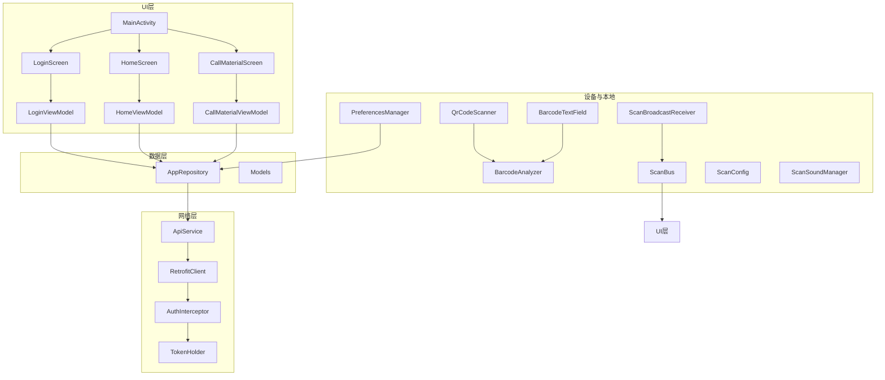
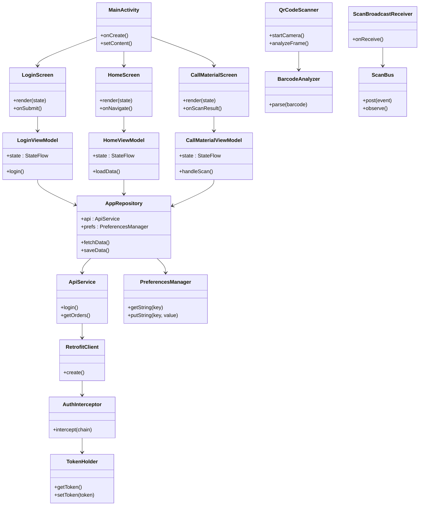
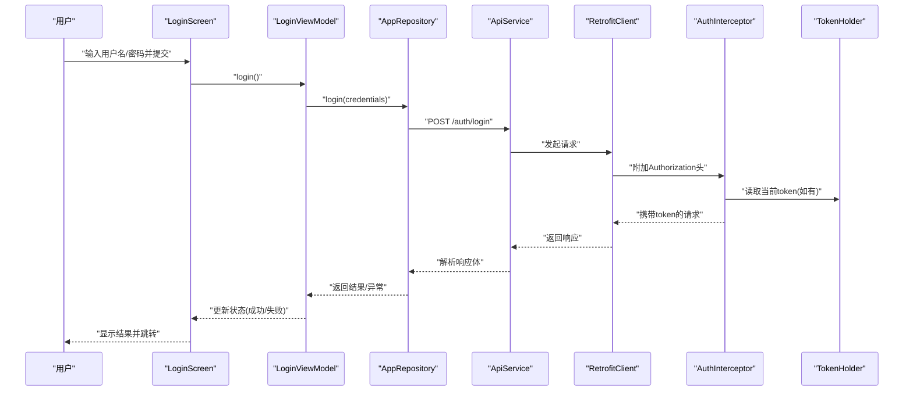
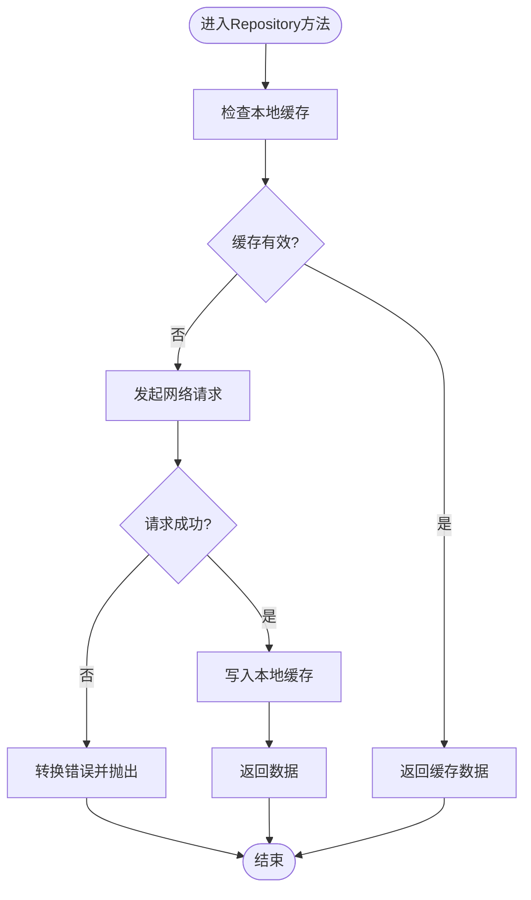
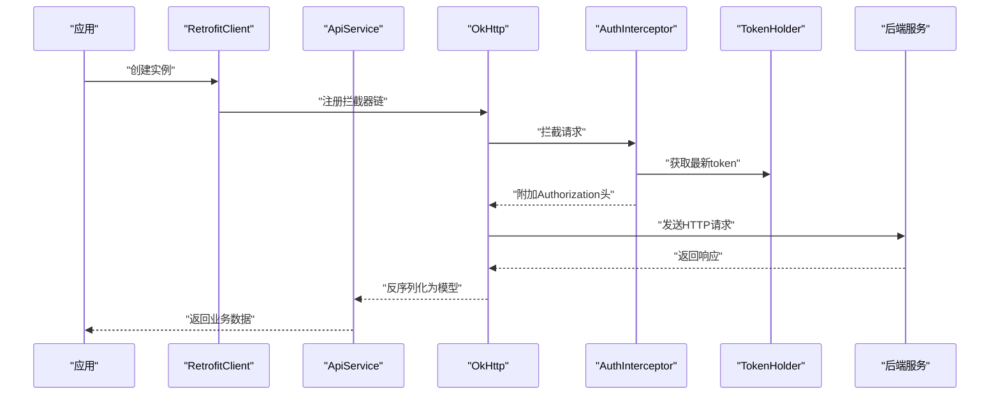
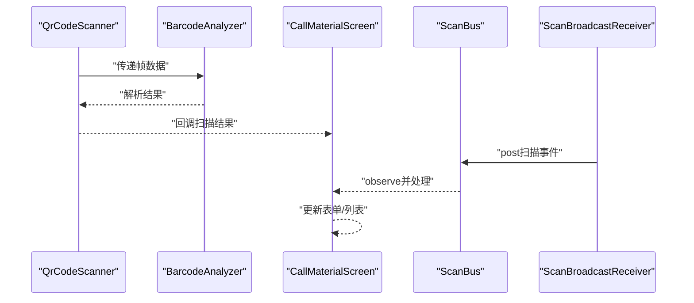
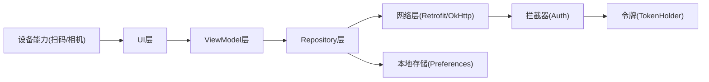

# Android移动应用

<cite>
**本文引用的文件**   
- [MainActivity.kt](file://mobile-android/app/src/main/java/com/dip/material/MainActivity.kt)
- [DIPApplication.kt](file://mobile-android/app/src/main/java/com/dip/material/DIPApplication.kt)
- [Models.kt](file://mobile-android/app/src/main/java/com/dip/material/data/models/Models.kt)
- [ApiService.kt](file://mobile-android/app/src/main/java/com/dip/material/data/network/ApiService.kt)
- [RetrofitClient.kt](file://mobile-android/app/src/main/java/com/dip/material/data/network/RetrofitClient.kt)
- [AuthInterceptor.kt](file://mobile-android/app/src/main/java/com/dip/material/data/network/AuthInterceptor.kt)
- [TokenHolder.kt](file://mobile-android/app/src/main/java/com/dip/material/data/network/TokenHolder.kt)
- [AppRepository.kt](file://mobile-android/app/src/main/java/com/dip/material/data/repository/AppRepository.kt)
- [LoginScreen.kt](file://mobile-android/app/src/main/java/com/dip/material/ui/login/LoginScreen.kt)
- [LoginViewModel.kt](file://mobile-android/app/src/main/java/com/dip/material/ui/login/LoginViewModel.kt)
- [HomeScreen.kt](file://mobile-android/app/src/main/java/com/dip/material/ui/home/HomeScreen.kt)
- [HomeViewModel.kt](file://mobile-android/app/src/main/java/com/dip/material/ui/home/HomeViewModel.kt)
- [CallMaterialScreen.kt](file://mobile-android/app/src/main/java/com/dip/material/ui/callmaterial/CallMaterialScreen.kt)
- [CallMaterialViewModel.kt](file://mobile-android/app/src/main/java/com/dip/material/ui/callmaterial/CallMaterialViewModel.kt)
- [QrCodeScanner.kt](file://mobile-android/app/src/main/java/com/dip/material/ui/components/QrCodeScanner.kt)
- [BarcodeAnalyzer.kt](file://mobile-android/app/src/main/java/com/dip/material/ui/components/BarcodeAnalyzer.kt)
- [BarcodeTextField.kt](file://mobile-android/app/src/main/java/com/dip/material/ui/components/BarcodeTextField.kt)
- [ScanBroadcastReceiver.kt](file://mobile-android/app/src/main/java/com/dip/material/utils/ScanBroadcastReceiver.kt)
- [ScanBus.kt](file://mobile-android/app/src/main/java/com/dip/material/utils/ScanBus.kt)
- [ScanConfig.kt](file://mobile-android/app/src/main/java/com/dip/material/utils/ScanConfig.kt)
- [ScanSoundManager.kt](file://mobile-android/app/src/main/java/com/dip/material/utils/ScanSoundManager.kt)
- [PreferencesManager.kt](file://mobile-android/app/src/main/java/com/dip/material/utils/PreferencesManager.kt)
- [Theme.kt](file://mobile-android/app/src/main/java/com/dip/material/ui/theme/Theme.kt)
- [Color.kt](file://mobile-android/app/src/main/java/com/dip/material/ui/theme/Color.kt)
- [Type.kt](file://mobile-android/app/src/main/java/com/dip/material/ui/theme/Type.kt)
- [AndroidManifest.xml](file://mobile-android/app/src/main/AndroidManifest.xml)
- [build.gradle.kts](file://mobile-android/app/build.gradle.kts)
</cite>

## 目录
1. [简介](#简介)
2. [项目结构](#项目结构)
3. [核心组件](#核心组件)
4. [架构总览](#架构总览)
5. [详细组件分析](#详细组件分析)
6. [依赖关系分析](#依赖关系分析)
7. [性能考量](#性能考量)
8. [故障排查指南](#故障排查指南)
9. [结论](#结论)
10. [附录](#附录)

## 简介
本文件为DIP系统Android移动应用的完整技术文档，面向使用Kotlin与Jetpack Compose的现代化Android开发实践。文档围绕MVVM架构模式展开，涵盖ViewModel状态管理、Repository数据层设计、网络通信（Retrofit + OkHttp拦截器 + JWT令牌管理）、扫码枪与摄像头扫描集成、本地存储与离线处理、Material Design主题定制与多语言支持，以及开发规范、调试技巧与发布流程。目标是帮助开发者快速理解并高效维护该应用。

## 项目结构
应用采用分层架构：UI层（Compose Screens + ViewModels）→ 数据层（Repository）→ 网络层（Retrofit + OkHttp）→ 设备与本地能力（扫码广播、偏好设置）。模块按功能域划分，便于扩展与维护。

图表来源
- [MainActivity.kt](file://mobile-android/app/src/main/java/com/dip/material/MainActivity.kt)
- [LoginScreen.kt](file://mobile-android/app/src/main/java/com/dip/material/ui/login/LoginScreen.kt)
- [HomeScreen.kt](file://mobile-android/app/src/main/java/com/dip/material/ui/home/HomeScreen.kt)
- [CallMaterialScreen.kt](file://mobile-android/app/src/main/java/com/dip/material/ui/callmaterial/CallMaterialScreen.kt)
- [LoginViewModel.kt](file://mobile-android/app/src/main/java/com/dip/material/ui/login/LoginViewModel.kt)
- [HomeViewModel.kt](file://mobile-android/app/src/main/java/com/dip/material/ui/home/HomeViewModel.kt)
- [CallMaterialViewModel.kt](file://mobile-android/app/src/main/java/com/dip/material/ui/callmaterial/CallMaterialViewModel.kt)
- [AppRepository.kt](file://mobile-android/app/src/main/java/com/dip/material/data/repository/AppRepository.kt)
- [Models.kt](file://mobile-android/app/src/main/java/com/dip/material/data/models/Models.kt)
- [RetrofitClient.kt](file://mobile-android/app/src/main/java/com/dip/material/data/network/RetrofitClient.kt)
- [ApiService.kt](file://mobile-android/app/src/main/java/com/dip/material/data/network/ApiService.kt)
- [AuthInterceptor.kt](file://mobile-android/app/src/main/java/com/dip/material/data/network/AuthInterceptor.kt)
- [TokenHolder.kt](file://mobile-android/app/src/main/java/com/dip/material/data/network/TokenHolder.kt)
- [QrCodeScanner.kt](file://mobile-android/app/src/main/java/com/dip/material/ui/components/QrCodeScanner.kt)
- [BarcodeAnalyzer.kt](file://mobile-android/app/src/main/java/com/dip/material/ui/components/BarcodeAnalyzer.kt)
- [BarcodeTextField.kt](file://mobile-android/app/src/main/java/com/dip/material/ui/components/BarcodeTextField.kt)
- [ScanBroadcastReceiver.kt](file://mobile-android/app/src/main/java/com/dip/material/utils/ScanBroadcastReceiver.kt)
- [ScanBus.kt](file://mobile-android/app/src/main/java/com/dip/material/utils/ScanBus.kt)
- [ScanConfig.kt](file://mobile-android/app/src/main/java/com/dip/material/utils/ScanConfig.kt)
- [ScanSoundManager.kt](file://mobile-android/app/src/main/java/com/dip/material/utils/ScanSoundManager.kt)
- [PreferencesManager.kt](file://mobile-android/app/src/main/java/com/dip/material/utils/PreferencesManager.kt)

章节来源
- [MainActivity.kt](file://mobile-android/app/src/main/java/com/dip/material/MainActivity.kt)
- [AndroidManifest.xml](file://mobile-android/app/src/main/AndroidManifest.xml)
- [build.gradle.kts](file://mobile-android/app/build.gradle.kts)

## 核心组件
- MVVM架构：UI层通过Composable屏幕与ViewModel协作，ViewModel持有可组合状态，调用Repository进行数据操作。
- Repository数据层：统一封装网络与本地数据源，向上暴露协程流或挂起函数，屏蔽实现细节。
- 网络通信：Retrofit定义API接口，OkHttp拦截器负责JWT注入与错误处理，TokenHolder集中管理令牌生命周期。
- 扫码与硬件：摄像头扫描通过自定义组件完成；扫码枪通过系统广播接收并分发到应用内总线。
- 本地存储：PreferencesManager提供键值对持久化，用于保存用户会话、配置与缓存。
- UI与主题：基于Material 3，Color/Type/Theme统一管理样式，支持多语言资源。

章节来源
- [LoginViewModel.kt](file://mobile-android/app/src/main/java/com/dip/material/ui/login/LoginViewModel.kt)
- [HomeViewModel.kt](file://mobile-android/app/src/main/java/com/dip/material/ui/home/HomeViewModel.kt)
- [CallMaterialViewModel.kt](file://mobile-android/app/src/main/java/com/dip/material/ui/callmaterial/CallMaterialViewModel.kt)
- [AppRepository.kt](file://mobile-android/app/src/main/java/com/dip/material/data/repository/AppRepository.kt)
- [ApiService.kt](file://mobile-android/app/src/main/java/com/dip/material/data/network/ApiService.kt)
- [RetrofitClient.kt](file://mobile-android/app/src/main/java/com/dip/material/data/network/RetrofitClient.kt)
- [AuthInterceptor.kt](file://mobile-android/app/src/main/java/com/dip/material/data/network/AuthInterceptor.kt)
- [TokenHolder.kt](file://mobile-android/app/src/main/java/com/dip/material/data/network/TokenHolder.kt)
- [QrCodeScanner.kt](file://mobile-android/app/src/main/java/com/dip/material/ui/components/QrCodeScanner.kt)
- [BarcodeAnalyzer.kt](file://mobile-android/app/src/main/java/com/dip/material/ui/components/BarcodeAnalyzer.kt)
- [BarcodeTextField.kt](file://mobile-android/app/src/main/java/com/dip/material/ui/components/BarcodeTextField.kt)
- [ScanBroadcastReceiver.kt](file://mobile-android/app/src/main/java/com/dip/material/utils/ScanBroadcastReceiver.kt)
- [ScanBus.kt](file://mobile-android/app/src/main/java/com/dip/material/utils/ScanBus.kt)
- [ScanConfig.kt](file://mobile-android/app/src/main/java/com/dip/material/utils/ScanConfig.kt)
- [ScanSoundManager.kt](file://mobile-android/app/src/main/java/com/dip/material/utils/ScanSoundManager.kt)
- [PreferencesManager.kt](file://mobile-android/app/src/main/java/com/dip/material/utils/PreferencesManager.kt)
- [Theme.kt](file://mobile-android/app/src/main/java/com/dip/material/ui/theme/Theme.kt)
- [Color.kt](file://mobile-android/app/src/main/java/com/dip/material/ui/theme/Color.kt)
- [Type.kt](file://mobile-android/app/src/main/java/com/dip/material/ui/theme/Type.kt)

## 架构总览
应用遵循清晰的层次分离：UI层仅关注展示与交互，ViewModel负责状态与业务编排，Repository聚合数据源，网络层通过Retrofit与OkHttp访问后端服务，设备能力通过广播与组件抽象。

图表来源
- [MainActivity.kt](file://mobile-android/app/src/main/java/com/dip/material/MainActivity.kt)
- [LoginScreen.kt](file://mobile-android/app/src/main/java/com/dip/material/ui/login/LoginScreen.kt)
- [HomeScreen.kt](file://mobile-android/app/src/main/java/com/dip/material/ui/home/HomeScreen.kt)
- [CallMaterialScreen.kt](file://mobile-android/app/src/main/java/com/dip/material/ui/callmaterial/CallMaterialScreen.kt)
- [LoginViewModel.kt](file://mobile-android/app/src/main/java/com/dip/material/ui/login/LoginViewModel.kt)
- [HomeViewModel.kt](file://mobile-android/app/src/main/java/com/dip/material/ui/home/HomeViewModel.kt)
- [CallMaterialViewModel.kt](file://mobile-android/app/src/main/java/com/dip/material/ui/callmaterial/CallMaterialViewModel.kt)
- [AppRepository.kt](file://mobile-android/app/src/main/java/com/dip/material/data/repository/AppRepository.kt)
- [ApiService.kt](file://mobile-android/app/src/main/java/com/dip/material/data/network/ApiService.kt)
- [RetrofitClient.kt](file://mobile-android/app/src/main/java/com/dip/material/data/network/RetrofitClient.kt)
- [AuthInterceptor.kt](file://mobile-android/app/src/main/java/com/dip/material/data/network/AuthInterceptor.kt)
- [TokenHolder.kt](file://mobile-android/app/src/main/java/com/dip/material/data/network/TokenHolder.kt)
- [QrCodeScanner.kt](file://mobile-android/app/src/main/java/com/dip/material/ui/components/QrCodeScanner.kt)
- [BarcodeAnalyzer.kt](file://mobile-android/app/src/main/java/com/dip/material/ui/components/BarcodeAnalyzer.kt)
- [ScanBroadcastReceiver.kt](file://mobile-android/app/src/main/java/com/dip/material/utils/ScanBroadcastReceiver.kt)
- [ScanBus.kt](file://mobile-android/app/src/main/java/com/dip/material/utils/ScanBus.kt)
- [PreferencesManager.kt](file://mobile-android/app/src/main/java/com/dip/material/utils/PreferencesManager.kt)

## 详细组件分析

### MVVM与状态管理
- ViewModel职责：封装页面状态与业务逻辑，暴露StateFlow供UI订阅；避免直接持有Context或View引用。
- 状态设计：使用不可变状态对象，结合协程处理异步任务，确保线程安全与内存泄漏防护。
- 导航与事件：屏幕通过回调或事件总线触发ViewModel动作，ViewModel更新状态后UI自动重组。

图表来源
- [LoginScreen.kt](file://mobile-android/app/src/main/java/com/dip/material/ui/login/LoginScreen.kt)
- [LoginViewModel.kt](file://mobile-android/app/src/main/java/com/dip/material/ui/login/LoginViewModel.kt)
- [AppRepository.kt](file://mobile-android/app/src/main/java/com/dip/material/data/repository/AppRepository.kt)
- [ApiService.kt](file://mobile-android/app/src/main/java/com/dip/material/data/network/ApiService.kt)
- [RetrofitClient.kt](file://mobile-android/app/src/main/java/com/dip/material/data/network/RetrofitClient.kt)
- [AuthInterceptor.kt](file://mobile-android/app/src/main/java/com/dip/material/data/network/AuthInterceptor.kt)
- [TokenHolder.kt](file://mobile-android/app/src/main/java/com/dip/material/data/network/TokenHolder.kt)

章节来源
- [LoginViewModel.kt](file://mobile-android/app/src/main/java/com/dip/material/ui/login/LoginViewModel.kt)
- [HomeViewModel.kt](file://mobile-android/app/src/main/java/com/dip/material/ui/home/HomeViewModel.kt)
- [CallMaterialViewModel.kt](file://mobile-android/app/src/main/java/com/dip/material/ui/callmaterial/CallMaterialViewModel.kt)

### 数据层与Repository设计
- 单一数据源：Repository统一协调网络与本地缓存，优先返回缓存数据，后台刷新网络数据。
- 错误处理：将网络异常转换为领域层错误类型，便于UI层展示友好提示。
- 并发控制：使用协程与流量控制，避免重复请求与竞态条件。

图表来源
- [AppRepository.kt](file://mobile-android/app/src/main/java/com/dip/material/data/repository/AppRepository.kt)
- [PreferencesManager.kt](file://mobile-android/app/src/main/java/com/dip/material/utils/PreferencesManager.kt)
- [ApiService.kt](file://mobile-android/app/src/main/java/com/dip/material/data/network/ApiService.kt)

章节来源
- [AppRepository.kt](file://mobile-android/app/src/main/java/com/dip/material/data/repository/AppRepository.kt)
- [Models.kt](file://mobile-android/app/src/main/java/com/dip/material/data/models/Models.kt)

### 网络通信模块（Retrofit + OkHttp + JWT）
- Retrofit客户端：集中配置Base URL、序列化器、超时与重试策略。
- OkHttp拦截器：统一添加Authorization头、记录日志、处理通用错误码。
- JWT令牌管理：TokenHolder在登录成功后更新令牌，并在后续请求中自动注入。

图表来源
- [RetrofitClient.kt](file://mobile-android/app/src/main/java/com/dip/material/data/network/RetrofitClient.kt)
- [ApiService.kt](file://mobile-android/app/src/main/java/com/dip/material/data/network/ApiService.kt)
- [AuthInterceptor.kt](file://mobile-android/app/src/main/java/com/dip/material/data/network/AuthInterceptor.kt)
- [TokenHolder.kt](file://mobile-android/app/src/main/java/com/dip/material/data/network/TokenHolder.kt)

章节来源
- [RetrofitClient.kt](file://mobile-android/app/src/main/java/com/dip/material/data/network/RetrofitClient.kt)
- [ApiService.kt](file://mobile-android/app/src/main/java/com/dip/material/data/network/ApiService.kt)
- [AuthInterceptor.kt](file://mobile-android/app/src/main/java/com/dip/material/data/network/AuthInterceptor.kt)
- [TokenHolder.kt](file://mobile-android/app/src/main/java/com/dip/material/data/network/TokenHolder.kt)

### 扫码枪与摄像头扫描集成
- 摄像头扫描：QrCodeScanner启动相机预览，逐帧分析条码/二维码，BarcodeAnalyzer解析内容并回调给UI。
- 扫码枪集成：ScanBroadcastReceiver监听系统广播，解析扫描结果并通过ScanBus分发给各页面。
- 输入增强：BarcodeTextField支持键盘式扫码枪输入，自动识别并填充字段。

图表来源
- [QrCodeScanner.kt](file://mobile-android/app/src/main/java/com/dip/material/ui/components/QrCodeScanner.kt)
- [BarcodeAnalyzer.kt](file://mobile-android/app/src/main/java/com/dip/material/ui/components/BarcodeAnalyzer.kt)
- [BarcodeTextField.kt](file://mobile-android/app/src/main/java/com/dip/material/ui/components/BarcodeTextField.kt)
- [ScanBroadcastReceiver.kt](file://mobile-android/app/src/main/java/com/dip/material/utils/ScanBroadcastReceiver.kt)
- [ScanBus.kt](file://mobile-android/app/src/main/java/com/dip/material/utils/ScanBus.kt)

章节来源
- [QrCodeScanner.kt](file://mobile-android/app/src/main/java/com/dip/material/ui/components/QrCodeScanner.kt)
- [BarcodeAnalyzer.kt](file://mobile-android/app/src/main/java/com/dip/material/ui/components/BarcodeAnalyzer.kt)
- [BarcodeTextField.kt](file://mobile-android/app/src/main/java/com/dip/material/ui/components/BarcodeTextField.kt)
- [ScanBroadcastReceiver.kt](file://mobile-android/app/src/main/java/com/dip/material/utils/ScanBroadcastReceiver.kt)
- [ScanBus.kt](file://mobile-android/app/src/main/java/com/dip/material/utils/ScanBus.kt)
- [ScanConfig.kt](file://mobile-android/app/src/main/java/com/dip/material/utils/ScanConfig.kt)
- [ScanSoundManager.kt](file://mobile-android/app/src/main/java/com/dip/material/utils/ScanSoundManager.kt)

### 本地数据存储与偏好设置
- PreferencesManager：封装SharedPreferences读写，提供类型安全的存取方法与默认值。
- 离线数据处理：Repository优先读取本地缓存，网络失败时降级返回可用数据，保证用户体验。
- 会话管理：登录成功后保存token与用户信息，应用重启后自动恢复登录态。

章节来源
- [PreferencesManager.kt](file://mobile-android/app/src/main/java/com/dip/material/utils/PreferencesManager.kt)
- [AppRepository.kt](file://mobile-android/app/src/main/java/com/dip/material/data/repository/AppRepository.kt)
- [TokenHolder.kt](file://mobile-android/app/src/main/java/com/dip/material/data/network/TokenHolder.kt)

### Material Design UI与主题定制
- Color/Type/Theme：集中定义颜色、字体与主题样式，支持动态主题切换与暗色模式。
- 多语言支持：strings.xml管理文案，配合系统语言设置实现国际化。
- 组件复用：统一的按钮、卡片、对话框等基础组件，提升一致性与可维护性。

章节来源
- [Color.kt](file://mobile-android/app/src/main/java/com/dip/material/ui/theme/Color.kt)
- [Type.kt](file://mobile-android/app/src/main/java/com/dip/material/ui/theme/Type.kt)
- [Theme.kt](file://mobile-android/app/src/main/java/com/dip/material/ui/theme/Theme.kt)
- [strings.xml](file://mobile-android/app/src/main/res/values/strings.xml)

## 依赖关系分析
- 模块耦合：UI层依赖ViewModel，ViewModel依赖Repository，Repository依赖网络与本地存储，低耦合高内聚。
- 外部依赖：Retrofit、OkHttp、协程、Compose等库通过Gradle统一管理版本与优化。
- 权限与组件：AndroidManifest声明必要权限与组件，确保扫码、相机、网络等功能正常运行。

图表来源
- [build.gradle.kts](file://mobile-android/app/build.gradle.kts)
- [AndroidManifest.xml](file://mobile-android/app/src/main/AndroidManifest.xml)
- [AppRepository.kt](file://mobile-android/app/src/main/java/com/dip/material/data/repository/AppRepository.kt)
- [RetrofitClient.kt](file://mobile-android/app/src/main/java/com/dip/material/data/network/RetrofitClient.kt)
- [AuthInterceptor.kt](file://mobile-android/app/src/main/java/com/dip/material/data/network/AuthInterceptor.kt)
- [TokenHolder.kt](file://mobile-android/app/src/main/java/com/dip/material/data/network/TokenHolder.kt)
- [PreferencesManager.kt](file://mobile-android/app/src/main/java/com/dip/material/utils/PreferencesManager.kt)
- [QrCodeScanner.kt](file://mobile-android/app/src/main/java/com/dip/material/ui/components/QrCodeScanner.kt)
- [ScanBroadcastReceiver.kt](file://mobile-android/app/src/main/java/com/dip/material/utils/ScanBroadcastReceiver.kt)

章节来源
- [build.gradle.kts](file://mobile-android/app/build.gradle.kts)
- [AndroidManifest.xml](file://mobile-android/app/src/main/AndroidManifest.xml)

## 性能考量
- 网络优化：启用连接池、合理设置超时与重试，减少无效请求；对大列表使用分页加载。
- 内存管理：ViewModel避免持有长生命周期对象；图片与扫描帧及时释放。
- 主线程保护：所有耗时操作放入协程IO调度器，避免阻塞UI。
- 缓存策略：热点数据本地缓存，缩短首屏加载时间。

[本节为通用指导，不直接分析具体文件]

## 故障排查指南
- 登录失败：检查AuthInterceptor是否正确注入token，确认后端认证接口返回格式。
- 扫码无响应：验证ScanBroadcastReceiver是否注册成功，ScanBus事件是否被订阅。
- 网络错误：查看OkHttp日志，确认Base URL与证书配置；检查Token过期与刷新逻辑。
- 崩溃与ANR：使用Logcat过滤应用包名，定位异常堆栈；检查协程作用域与取消机制。

章节来源
- [AuthInterceptor.kt](file://mobile-android/app/src/main/java/com/dip/material/data/network/AuthInterceptor.kt)
- [ScanBroadcastReceiver.kt](file://mobile-android/app/src/main/java/com/dip/material/utils/ScanBroadcastReceiver.kt)
- [ScanBus.kt](file://mobile-android/app/src/main/java/com/dip/material/utils/ScanBus.kt)
- [RetrofitClient.kt](file://mobile-android/app/src/main/java/com/dip/material/data/network/RetrofitClient.kt)

## 结论
本应用以MVVM为核心，结合Compose现代UI、Retrofit网络栈与设备能力抽象，构建了可扩展、易维护的DIP系统移动端。通过清晰的分层与模块化设计，团队可快速迭代功能并保障稳定性。建议持续完善错误处理、性能监控与自动化测试，以提升交付质量。

[本节为总结，不直接分析具体文件]

## 附录
- 开发规范：命名约定、代码风格、提交信息模板；禁止在主线程执行网络与I/O。
- 调试技巧：启用OkHttp日志、Compose调试工具、断点与日志埋点；使用模拟器与真机对比。
- 发布流程：签名配置、混淆规则、构建产物校验、上架前测试清单。

[本节为通用指导，不直接分析具体文件]