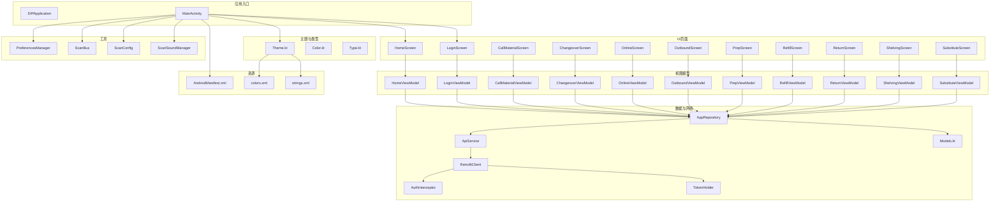
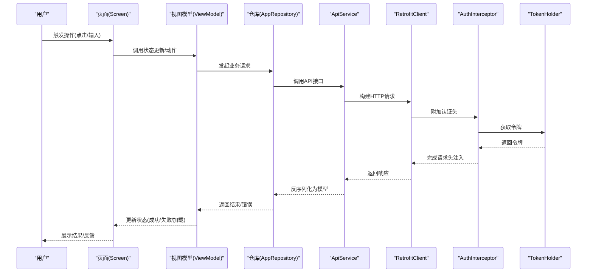
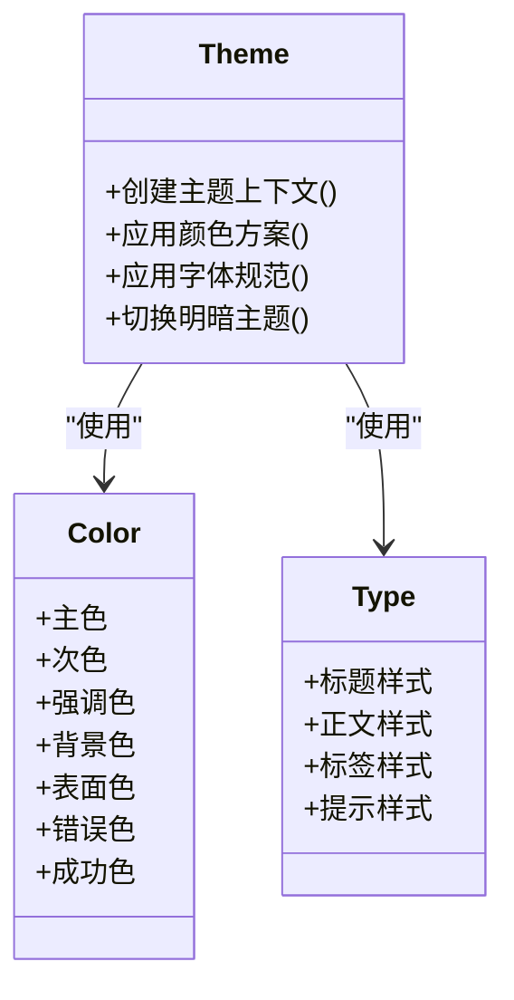
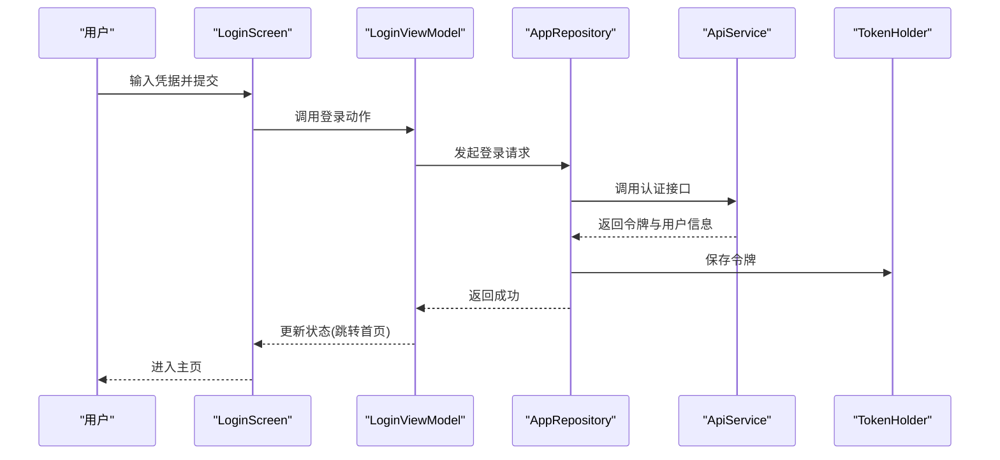
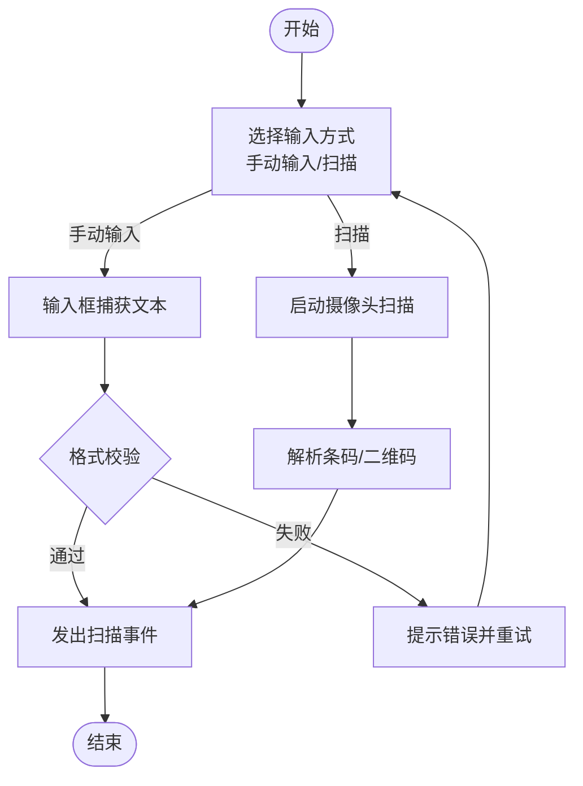
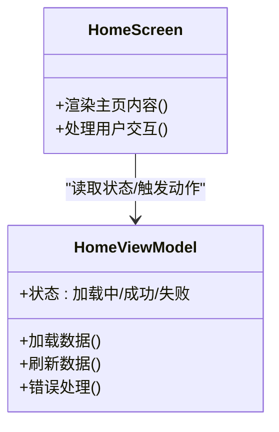
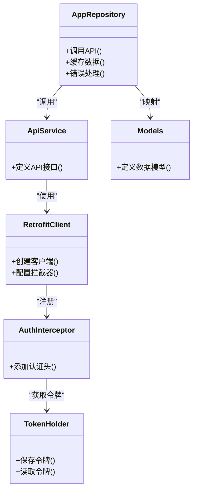
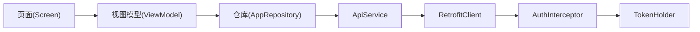

# UI界面组件

<cite>
**本文档引用的文件**   
- [MainActivity.kt](file://mobile-android/app/src/main/java/com/dip/material/MainActivity.kt)
- [DIPApplication.kt](file://mobile-android/app/src/main/java/com/dip/material/DIPApplication.kt)
- [Theme.kt](file://mobile-android/app/src/main/java/com/dip/material/ui/theme/Theme.kt)
- [Color.kt](file://mobile-android/app/src/main/java/com/dip/material/ui/theme/Color.kt)
- [Type.kt](file://mobile-android/app/src/main/java/com/dip/material/ui/theme/Type.kt)
- [HomeScreen.kt](file://mobile-android/app/src/main/java/com/dip/material/ui/home/HomeScreen.kt)
- [HomeViewModel.kt](file://mobile-android/app/src/main/java/com/dip/material/ui/home/HomeViewModel.kt)
- [LoginScreen.kt](file://mobile-android/app/src/main/java/com/dip/material/ui/login/LoginScreen.kt)
- [LoginViewModel.kt](file://mobile-android/app/src/main/java/com/dip/material/ui/login/LoginViewModel.kt)
- [CallMaterialScreen.kt](file://mobile-android/app/src/main/java/com/dip/material/ui/callmaterial/CallMaterialScreen.kt)
- [CallMaterialViewModel.kt](file://mobile-android/app/src/main/java/com/dip/material/ui/callmaterial/CallMaterialViewModel.kt)
- [ChangeoverScreen.kt](file://mobile-android/app/src/main/java/com/dip/material/ui/changeover/ChangeoverScreen.kt)
- [ChangeoverViewModel.kt](file://mobile-android/app/src/main/java/com/dip/material/ui/changeover/ChangeoverViewModel.kt)
- [OnlineScreen.kt](file://mobile-android/app/src/main/java/com/dip/material/ui/online/OnlineScreen.kt)
- [OnlineViewModel.kt](file://mobile-android/app/src/main/java/com/dip/material/ui/online/OnlineViewModel.kt)
- [OutboundScreen.kt](file://mobile-android/app/src/main/java/com/dip/material/ui/outbound/OutboundScreen.kt)
- [OutboundViewModel.kt](file://mobile-android/app/src/main/java/com/dip/material/ui/outbound/OutboundViewModel.kt)
- [PrepScreen.kt](file://mobile-android/app/src/main/java/com/dip/material/ui/prep/PrepScreen.kt)
- [PrepViewModel.kt](file://mobile-android/app/src/main/java/com/dip/material/ui/prep/PrepViewModel.kt)
- [RefillScreen.kt](file://mobile-android/app/src/main/java/com/dip/material/ui/refill/RefillScreen.kt)
- [RefillViewModel.kt](file://mobile-android/app/src/main/java/com/dip/material/ui/refill/RefillViewModel.kt)
- [ReturnScreen.kt](file://mobile-android/app/src/main/java/com/dip/material/ui/return_/ReturnScreen.kt)
- [ReturnViewModel.kt](file://mobile-android/app/src/main/java/com/dip/material/ui/return_/ReturnViewModel.kt)
- [ShelvingScreen.kt](file://mobile-android/app/src/main/java/com/dip/material/ui/shelving/ShelvingScreen.kt)
- [ShelvingViewModel.kt](file://mobile-android/app/src/main/java/com/dip/material/ui/shelving/ShelvingViewModel.kt)
- [SubstituteScreen.kt](file://mobile-android/app/src/main/java/com/dip/material/ui/substitute/SubstituteScreen.kt)
- [SubstituteViewModel.kt](file://mobile-android/app/src/main/java/com/dip/material/ui/substitute/SubstituteViewModel.kt)
- [BarcodeTextField.kt](file://mobile-android/app/src/main/java/com/dip/material/ui/components/BarcodeTextField.kt)
- [QrCodeScanner.kt](file://mobile-android/app/src/main/java/com/dip/material/ui/components/QrCodeScanner.kt)
- [ScannerOverlay.kt](file://mobile-android/app/src/main/java/com/dip/material/ui/components/ScannerOverlay.kt)
- [BarcodeAnalyzer.kt](file://mobile-android/app/src/main/java/com/dip/material/ui/components/BarcodeAnalyzer.kt)
- [PcbTuneParams.kt](file://mobile-android/app/src/main/java/com/dip/material/ui/components/PcbTuneParams.kt)
- [ImageUtils.kt](file://mobile-android/app/src/main/java/com/dip/material/ui/components/ImageUtils.kt)
- [ApiService.kt](file://mobile-android/app/src/main/java/com/dip/material/data/network/ApiService.kt)
- [RetrofitClient.kt](file://mobile-android/app/src/main/java/com/dip/material/data/network/RetrofitClient.kt)
- [AuthInterceptor.kt](file://mobile-android/app/src/main/java/com/dip/material/data/network/AuthInterceptor.kt)
- [TokenHolder.kt](file://mobile-android/app/src/main/java/com/dip/material/data/network/TokenHolder.kt)
- [AppRepository.kt](file://mobile-android/app/src/main/java/com/dip/material/data/repository/AppRepository.kt)
- [Models.kt](file://mobile-android/app/src/main/java/com/dip/material/data/models/Models.kt)
- [PreferencesManager.kt](file://mobile-android/app/src/main/java/com/dip/material/utils/PreferencesManager.kt)
- [ScanBus.kt](file://mobile-android/app/src/main/java/com/dip/material/utils/ScanBus.kt)
- [ScanConfig.kt](file://mobile-android/app/src/main/java/com/dip/material/utils/ScanConfig.kt)
- [ScanSoundManager.kt](file://mobile-android/app/src/main/java/com/dip/material/utils/ScanSoundManager.kt)
- [AndroidManifest.xml](file://mobile-android/app/src/main/AndroidManifest.xml)
- [colors.xml](file://mobile-android/app/src/main/res/values/colors.xml)
- [strings.xml](file://mobile-android/app/src/main/res/values/strings.xml)
</cite>

## 目录
1. [简介](#简介)
2. [项目结构](#项目结构)
3. [核心组件](#核心组件)
4. [架构总览](#架构总览)
5. [详细组件分析](#详细组件分析)
6. [依赖分析](#依赖分析)
7. [性能考虑](#性能考虑)
8. [故障排查指南](#故障排查指南)
9. [结论](#结论)
10. [附录](#附录)

## 简介
本文件面向DIP系统Android应用的UI层，系统性说明基于Material Design 3的主题体系（颜色、字体、组件样式）、Jetpack Compose组件库的使用与自定义组件开发、响应式布局策略、用户交互模式、动画效果、无障碍支持，以及主题切换、多语言支持与屏幕适配方案。同时给出UI开发最佳实践、性能优化技巧与调试方法，帮助开发者快速上手并高质量交付。

## 项目结构
Android端采用现代Kotlin + Jetpack Compose技术栈，UI按功能模块划分（home、login、callmaterial、changeover等），每个页面包含对应的Screen与ViewModel；主题与类型定义集中在ui/theme；网络与数据访问位于data包；工具类集中于utils。

图表来源
- [DIPApplication.kt](file://mobile-android/app/src/main/java/com/dip/material/DIPApplication.kt)
- [MainActivity.kt](file://mobile-android/app/src/main/java/com/dip/material/MainActivity.kt)
- [Theme.kt](file://mobile-android/app/src/main/java/com/dip/material/ui/theme/Theme.kt)
- [Color.kt](file://mobile-android/app/src/main/java/com/dip/material/ui/theme/Color.kt)
- [Type.kt](file://mobile-android/app/src/main/java/com/dip/material/ui/theme/Type.kt)
- [HomeScreen.kt](file://mobile-android/app/src/main/java/com/dip/material/ui/home/HomeScreen.kt)
- [HomeViewModel.kt](file://mobile-android/app/src/main/java/com/dip/material/ui/home/HomeViewModel.kt)
- [LoginScreen.kt](file://mobile-android/app/src/main/java/com/dip/material/ui/login/LoginScreen.kt)
- [LoginViewModel.kt](file://mobile-android/app/src/main/java/com/dip/material/ui/login/LoginViewModel.kt)
- [CallMaterialScreen.kt](file://mobile-android/app/src/main/java/com/dip/material/ui/callmaterial/CallMaterialScreen.kt)
- [CallMaterialViewModel.kt](file://mobile-android/app/src/main/java/com/dip/material/ui/callmaterial/CallMaterialViewModel.kt)
- [ChangeoverScreen.kt](file://mobile-android/app/src/main/java/com/dip/material/ui/changeover/ChangeoverScreen.kt)
- [ChangeoverViewModel.kt](file://mobile-android/app/src/main/java/com/dip/material/ui/changeover/ChangeoverViewModel.kt)
- [OnlineScreen.kt](file://mobile-android/app/src/main/java/com/dip/material/ui/online/OnlineScreen.kt)
- [OnlineViewModel.kt](file://mobile-android/app/src/main/java/com/dip/material/ui/online/OnlineViewModel.kt)
- [OutboundScreen.kt](file://mobile-android/app/src/main/java/com/dip/material/ui/outbound/OutboundScreen.kt)
- [OutboundViewModel.kt](file://mobile-android/app/src/main/java/com/dip/material/ui/outbound/OutboundViewModel.kt)
- [PrepScreen.kt](file://mobile-android/app/src/main/java/com/dip/material/ui/prep/PrepScreen.kt)
- [PrepViewModel.kt](file://mobile-android/app/src/main/java/com/dip/material/ui/prep/PrepViewModel.kt)
- [RefillScreen.kt](file://mobile-android/app/src/main/java/com/dip/material/ui/refill/RefillScreen.kt)
- [RefillViewModel.kt](file://mobile-android/app/src/main/java/com/dip/material/ui/refill/RefillViewModel.kt)
- [ReturnScreen.kt](file://mobile-android/app/src/main/java/com/dip/material/ui/return_/ReturnScreen.kt)
- [ReturnViewModel.kt](file://mobile-android/app/src/main/java/com/dip/material/ui/return_/ReturnViewModel.kt)
- [ShelvingScreen.kt](file://mobile-android/app/src/main/java/com/dip/material/ui/shelving/ShelvingScreen.kt)
- [ShelvingViewModel.kt](file://mobile-android/app/src/main/java/com/dip/material/ui/shelving/ShelvingViewModel.kt)
- [SubstituteScreen.kt](file://mobile-android/app/src/main/java/com/dip/material/ui/substitute/SubstituteScreen.kt)
- [SubstituteViewModel.kt](file://mobile-android/app/src/main/java/com/dip/material/ui/substitute/SubstituteViewModel.kt)
- [ApiService.kt](file://mobile-android/app/src/main/java/com/dip/material/data/network/ApiService.kt)
- [RetrofitClient.kt](file://mobile-android/app/src/main/java/com/dip/material/data/network/RetrofitClient.kt)
- [AuthInterceptor.kt](file://mobile-android/app/src/main/java/com/dip/material/data/network/AuthInterceptor.kt)
- [TokenHolder.kt](file://mobile-android/app/src/main/java/com/dip/material/data/network/TokenHolder.kt)
- [AppRepository.kt](file://mobile-android/app/src/main/java/com/dip/material/data/repository/AppRepository.kt)
- [Models.kt](file://mobile-android/app/src/main/java/com/dip/material/data/models/Models.kt)
- [PreferencesManager.kt](file://mobile-android/app/src/main/java/com/dip/material/utils/PreferencesManager.kt)
- [ScanBus.kt](file://mobile-android/app/src/main/java/com/dip/material/utils/ScanBus.kt)
- [ScanConfig.kt](file://mobile-android/app/src/main/java/com/dip/material/utils/ScanConfig.kt)
- [ScanSoundManager.kt](file://mobile-android/app/src/main/java/com/dip/material/utils/ScanSoundManager.kt)
- [AndroidManifest.xml](file://mobile-android/app/src/main/AndroidManifest.xml)
- [colors.xml](file://mobile-android/app/src/main/res/values/colors.xml)
- [strings.xml](file://mobile-android/app/src/main/res/values/strings.xml)

章节来源
- [MainActivity.kt](file://mobile-android/app/src/main/java/com/dip/material/MainActivity.kt)
- [DIPApplication.kt](file://mobile-android/app/src/main/java/com/dip/material/DIPApplication.kt)
- [Theme.kt](file://mobile-android/app/src/main/java/com/dip/material/ui/theme/Theme.kt)
- [Color.kt](file://mobile-android/app/src/main/java/com/dip/material/ui/theme/Color.kt)
- [Type.kt](file://mobile-android/app/src/main/java/com/dip/material/ui/theme/Type.kt)
- [AndroidManifest.xml](file://mobile-android/app/src/main/AndroidManifest.xml)
- [colors.xml](file://mobile-android/app/src/main/res/values/colors.xml)
- [strings.xml](file://mobile-android/app/src/main/res/values/strings.xml)

## 核心组件
- 主题与类型
  - Material3主题：通过统一的颜色与排版定义，为所有Compose组件提供一致的外观与行为。
  - 颜色方案：主色、次色、强调色、背景与表面色、错误与成功语义色，遵循MD3的语义化命名。
  - 字体规范：标题、正文、标签、提示等文本样式，确保可读性与层级清晰。
- 页面与视图模型
  - 页面（Screen）：使用Compose声明式UI，描述界面结构与状态。
  - 视图模型（ViewModel）：管理业务状态、处理用户输入、调用数据层，保持UI无状态或最小状态。
- 通用组件
  - 条码输入框、二维码扫描器、扫描遮罩、条码解析、图像工具、PCB调参参数封装等。
- 数据与网络
  - Retrofit客户端、认证拦截器、令牌持有者、仓库抽象、API接口定义与数据模型。
- 工具与配置
  - 偏好设置管理器、扫码总线、扫码配置、扫码音效管理等。

章节来源
- [Theme.kt](file://mobile-android/app/src/main/java/com/dip/material/ui/theme/Theme.kt)
- [Color.kt](file://mobile-android/app/src/main/java/com/dip/material/ui/theme/Color.kt)
- [Type.kt](file://mobile-android/app/src/main/java/com/dip/material/ui/theme/Type.kt)
- [HomeScreen.kt](file://mobile-android/app/src/main/java/com/dip/material/ui/home/HomeScreen.kt)
- [HomeViewModel.kt](file://mobile-android/app/src/main/java/com/dip/material/ui/home/HomeViewModel.kt)
- [LoginScreen.kt](file://mobile-android/app/src/main/java/com/dip/material/ui/login/LoginScreen.kt)
- [LoginViewModel.kt](file://mobile-android/app/src/main/java/com/dip/material/ui/login/LoginViewModel.kt)
- [CallMaterialScreen.kt](file://mobile-android/app/src/main/java/com/dip/material/ui/callmaterial/CallMaterialScreen.kt)
- [CallMaterialViewModel.kt](file://mobile-android/app/src/main/java/com/dip/material/ui/callmaterial/CallMaterialViewModel.kt)
- [ChangeoverScreen.kt](file://mobile-android/app/src/main/java/com/dip/material/ui/changeover/ChangeoverScreen.kt)
- [ChangeoverViewModel.kt](file://mobile-android/app/src/main/java/com/dip/material/ui/changeover/ChangeoverViewModel.kt)
- [OnlineScreen.kt](file://mobile-android/app/src/main/java/com/dip/material/ui/online/OnlineScreen.kt)
- [OnlineViewModel.kt](file://mobile-android/app/src/main/java/com/dip/material/ui/online/OnlineViewModel.kt)
- [OutboundScreen.kt](file://mobile-android/app/src/main/java/com/dip/material/ui/outbound/OutboundScreen.kt)
- [OutboundViewModel.kt](file://mobile-android/app/src/main/java/com/dip/material/ui/outbound/OutboundViewModel.kt)
- [PrepScreen.kt](file://mobile-android/app/src/main/java/com/dip/material/ui/prep/PrepScreen.kt)
- [PrepViewModel.kt](file://mobile-android/app/src/main/java/com/dip/material/ui/prep/PrepViewModel.kt)
- [RefillScreen.kt](file://mobile-android/app/src/main/java/com/dip/material/ui/refill/RefillScreen.kt)
- [RefillViewModel.kt](file://mobile-android/app/src/main/java/com/dip/material/ui/refill/RefillViewModel.kt)
- [ReturnScreen.kt](file://mobile-android/app/src/main/java/com/dip/material/ui/return_/ReturnScreen.kt)
- [ReturnViewModel.kt](file://mobile-android/app/src/main/java/com/dip/material/ui/return_/ReturnViewModel.kt)
- [ShelvingScreen.kt](file://mobile-android/app/src/main/java/com/dip/material/ui/shelving/ShelvingScreen.kt)
- [ShelvingViewModel.kt](file://mobile-android/app/src/main/java/com/dip/material/ui/shelving/ShelvingViewModel.kt)
- [SubstituteScreen.kt](file://mobile-android/app/src/main/java/com/dip/material/ui/substitute/SubstituteScreen.kt)
- [SubstituteViewModel.kt](file://mobile-android/app/src/main/java/com/dip/material/ui/substitute/SubstituteViewModel.kt)
- [BarcodeTextField.kt](file://mobile-android/app/src/main/java/com/dip/material/ui/components/BarcodeTextField.kt)
- [QrCodeScanner.kt](file://mobile-android/app/src/main/java/com/dip/material/ui/components/QrCodeScanner.kt)
- [ScannerOverlay.kt](file://mobile-android/app/src/main/java/com/dip/material/ui/components/ScannerOverlay.kt)
- [BarcodeAnalyzer.kt](file://mobile-android/app/src/main/java/com/dip/material/ui/components/BarcodeAnalyzer.kt)
- [PcbTuneParams.kt](file://mobile-android/app/src/main/java/com/dip/material/ui/components/PcbTuneParams.kt)
- [ImageUtils.kt](file://mobile-android/app/src/main/java/com/dip/material/ui/components/ImageUtils.kt)
- [ApiService.kt](file://mobile-android/app/src/main/java/com/dip/material/data/network/ApiService.kt)
- [RetrofitClient.kt](file://mobile-android/app/src/main/java/com/dip/material/data/network/RetrofitClient.kt)
- [AuthInterceptor.kt](file://mobile-android/app/src/main/java/com/dip/material/data/network/AuthInterceptor.kt)
- [TokenHolder.kt](file://mobile-android/app/src/main/java/com/dip/material/data/network/TokenHolder.kt)
- [AppRepository.kt](file://mobile-android/app/src/main/java/com/dip/material/data/repository/AppRepository.kt)
- [Models.kt](file://mobile-android/app/src/main/java/com/dip/material/data/models/Models.kt)
- [PreferencesManager.kt](file://mobile-android/app/src/main/java/com/dip/material/utils/PreferencesManager.kt)
- [ScanBus.kt](file://mobile-android/app/src/main/java/com/dip/material/utils/ScanBus.kt)
- [ScanConfig.kt](file://mobile-android/app/src/main/java/com/dip/material/utils/ScanConfig.kt)
- [ScanSoundManager.kt](file://mobile-android/app/src/main/java/com/dip/material/utils/ScanSoundManager.kt)

## 架构总览
UI层采用“页面-视图模型-仓库-网络”的分层架构，结合Compose的状态提升与不可变数据流，保证可测试性与可维护性。

图表来源
- [HomeScreen.kt](file://mobile-android/app/src/main/java/com/dip/material/ui/home/HomeScreen.kt)
- [HomeViewModel.kt](file://mobile-android/app/src/main/java/com/dip/material/ui/home/HomeViewModel.kt)
- [AppRepository.kt](file://mobile-android/app/src/main/java/com/dip/material/data/repository/AppRepository.kt)
- [ApiService.kt](file://mobile-android/app/src/main/java/com/dip/material/data/network/ApiService.kt)
- [RetrofitClient.kt](file://mobile-android/app/src/main/java/com/dip/material/data/network/RetrofitClient.kt)
- [AuthInterceptor.kt](file://mobile-android/app/src/main/java/com/dip/material/data/network/AuthInterceptor.kt)
- [TokenHolder.kt](file://mobile-android/app/src/main/java/com/dip/material/data/network/TokenHolder.kt)

## 详细组件分析

### 主题系统与Material Design 3
- 颜色方案
  - 使用语义化颜色（主色、次色、强调色、背景、表面、错误、成功等），便于暗色/亮色主题切换。
  - 颜色资源集中管理，避免硬编码，提高一致性。
- 字体规范
  - 标题、正文、标签、提示等文本样式统一由类型定义，确保层级与可读性。
- 组件样式定制
  - 按钮、卡片、输入框、导航等组件通过主题扩展实现一致的视觉风格。
  - 支持动态颜色与系统主题联动。

图表来源
- [Theme.kt](file://mobile-android/app/src/main/java/com/dip/material/ui/theme/Theme.kt)
- [Color.kt](file://mobile-android/app/src/main/java/com/dip/material/ui/theme/Color.kt)
- [Type.kt](file://mobile-android/app/src/main/java/com/dip/material/ui/theme/Type.kt)

章节来源
- [Theme.kt](file://mobile-android/app/src/main/java/com/dip/material/ui/theme/Theme.kt)
- [Color.kt](file://mobile-android/app/src/main/java/com/dip/material/ui/theme/Color.kt)
- [Type.kt](file://mobile-android/app/src/main/java/com/dip/material/ui/theme/Type.kt)
- [colors.xml](file://mobile-android/app/src/main/res/values/colors.xml)
- [strings.xml](file://mobile-android/app/src/main/res/values/strings.xml)

### 登录流程与认证集成
- 用户输入用户名/密码，提交后由ViewModel调用仓库进行认证。
- 认证通过后保存令牌，后续请求自动携带。
- 失败时显示错误信息，支持重试。

图表来源
- [LoginScreen.kt](file://mobile-android/app/src/main/java/com/dip/material/ui/login/LoginScreen.kt)
- [LoginViewModel.kt](file://mobile-android/app/src/main/java/com/dip/material/ui/login/LoginViewModel.kt)
- [AppRepository.kt](file://mobile-android/app/src/main/java/com/dip/material/data/repository/AppRepository.kt)
- [ApiService.kt](file://mobile-android/app/src/main/java/com/dip/material/data/network/ApiService.kt)
- [TokenHolder.kt](file://mobile-android/app/src/main/java/com/dip/material/data/network/TokenHolder.kt)

章节来源
- [LoginScreen.kt](file://mobile-android/app/src/main/java/com/dip/material/ui/login/LoginScreen.kt)
- [LoginViewModel.kt](file://mobile-android/app/src/main/java/com/dip/material/ui/login/LoginViewModel.kt)
- [AppRepository.kt](file://mobile-android/app/src/main/java/com/dip/material/data/repository/AppRepository.kt)
- [ApiService.kt](file://mobile-android/app/src/main/java/com/dip/material/data/network/ApiService.kt)
- [TokenHolder.kt](file://mobile-android/app/src/main/java/com/dip/material/data/network/TokenHolder.kt)

### 扫码与条码输入组件
- 条码输入框：支持粘贴、扫描回调、校验与格式化。
- 二维码扫描器：相机预览、实时识别、结果回调。
- 扫描遮罩：绘制扫描区域与引导线。
- 条码解析：将原始字符串解析为结构化数据。
- 图像工具：压缩、旋转、裁剪等常用图像处理。

图表来源
- [BarcodeTextField.kt](file://mobile-android/app/src/main/java/com/dip/material/ui/components/BarcodeTextField.kt)
- [QrCodeScanner.kt](file://mobile-android/app/src/main/java/com/dip/material/ui/components/QrCodeScanner.kt)
- [ScannerOverlay.kt](file://mobile-android/app/src/main/java/com/dip/material/ui/components/ScannerOverlay.kt)
- [BarcodeAnalyzer.kt](file://mobile-android/app/src/main/java/com/dip/material/ui/components/BarcodeAnalyzer.kt)
- [ImageUtils.kt](file://mobile-android/app/src/main/java/com/dip/material/ui/components/ImageUtils.kt)

章节来源
- [BarcodeTextField.kt](file://mobile-android/app/src/main/java/com/dip/material/ui/components/BarcodeTextField.kt)
- [QrCodeScanner.kt](file://mobile-android/app/src/main/java/com/dip/material/ui/components/QrCodeScanner.kt)
- [ScannerOverlay.kt](file://mobile-android/app/src/main/java/com/dip/material/ui/components/ScannerOverlay.kt)
- [BarcodeAnalyzer.kt](file://mobile-android/app/src/main/java/com/dip/material/ui/components/BarcodeAnalyzer.kt)
- [ImageUtils.kt](file://mobile-android/app/src/main/java/com/dip/material/ui/components/ImageUtils.kt)

### 业务页面与状态管理
- 各业务页面（如呼叫物料、换型、在线、出库、备料、补料、退货、上架、替代）均遵循“页面-视图模型”模式。
- ViewModel负责状态管理与副作用处理，页面仅负责渲染与用户交互。
- 典型状态包括加载中、成功、失败、空数据等，配合加载指示与错误提示。

图表来源
- [HomeScreen.kt](file://mobile-android/app/src/main/java/com/dip/material/ui/home/HomeScreen.kt)
- [HomeViewModel.kt](file://mobile-android/app/src/main/java/com/dip/material/ui/home/HomeViewModel.kt)

章节来源
- [HomeScreen.kt](file://mobile-android/app/src/main/java/com/dip/material/ui/home/HomeScreen.kt)
- [HomeViewModel.kt](file://mobile-android/app/src/main/java/com/dip/material/ui/home/HomeViewModel.kt)
- [CallMaterialScreen.kt](file://mobile-android/app/src/main/java/com/dip/material/ui/callmaterial/CallMaterialScreen.kt)
- [CallMaterialViewModel.kt](file://mobile-android/app/src/main/java/com/dip/material/ui/callmaterial/CallMaterialViewModel.kt)
- [ChangeoverScreen.kt](file://mobile-android/app/src/main/java/com/dip/material/ui/changeover/ChangeoverScreen.kt)
- [ChangeoverViewModel.kt](file://mobile-android/app/src/main/java/com/dip/material/ui/changeover/ChangeoverViewModel.kt)
- [OnlineScreen.kt](file://mobile-android/app/src/main/java/com/dip/material/ui/online/OnlineScreen.kt)
- [OnlineViewModel.kt](file://mobile-android/app/src/main/java/com/dip/material/ui/online/OnlineViewModel.kt)
- [OutboundScreen.kt](file://mobile-android/app/src/main/java/com/dip/material/ui/outbound/OutboundScreen.kt)
- [OutboundViewModel.kt](file://mobile-android/app/src/main/java/com/dip/material/ui/outbound/OutboundViewModel.kt)
- [PrepScreen.kt](file://mobile-android/app/src/main/java/com/dip/material/ui/prep/PrepScreen.kt)
- [PrepViewModel.kt](file://mobile-android/app/src/main/java/com/dip/material/ui/prep/PrepViewModel.kt)
- [RefillScreen.kt](file://mobile-android/app/src/main/java/com/dip/material/ui/refill/RefillScreen.kt)
- [RefillViewModel.kt](file://mobile-android/app/src/main/java/com/dip/material/ui/refill/RefillViewModel.kt)
- [ReturnScreen.kt](file://mobile-android/app/src/main/java/com/dip/material/ui/return_/ReturnScreen.kt)
- [ReturnViewModel.kt](file://mobile-android/app/src/main/java/com/dip/material/ui/return_/ReturnViewModel.kt)
- [ShelvingScreen.kt](file://mobile-android/app/src/main/java/com/dip/material/ui/shelving/ShelvingScreen.kt)
- [ShelvingViewModel.kt](file://mobile-android/app/src/main/java/com/dip/material/ui/shelving/ShelvingViewModel.kt)
- [SubstituteScreen.kt](file://mobile-android/app/src/main/java/com/dip/material/ui/substitute/SubstituteScreen.kt)
- [SubstituteViewModel.kt](file://mobile-android/app/src/main/java/com/dip/material/ui/substitute/SubstituteViewModel.kt)

### 数据与网络集成
- ApiService定义REST接口，RetrofitClient负责构建客户端与基础配置。
- AuthInterceptor在请求前注入认证头，TokenHolder统一管理令牌生命周期。
- AppRepository聚合数据源，对外暴露统一的业务方法。
- Models.kt定义数据模型，用于序列化与反序列化。

图表来源
- [ApiService.kt](file://mobile-android/app/src/main/java/com/dip/material/data/network/ApiService.kt)
- [RetrofitClient.kt](file://mobile-android/app/src/main/java/com/dip/material/data/network/RetrofitClient.kt)
- [AuthInterceptor.kt](file://mobile-android/app/src/main/java/com/dip/material/data/network/AuthInterceptor.kt)
- [TokenHolder.kt](file://mobile-android/app/src/main/java/com/dip/material/data/network/TokenHolder.kt)
- [AppRepository.kt](file://mobile-android/app/src/main/java/com/dip/material/data/repository/AppRepository.kt)
- [Models.kt](file://mobile-android/app/src/main/java/com/dip/material/data/models/Models.kt)

章节来源
- [ApiService.kt](file://mobile-android/app/src/main/java/com/dip/material/data/network/ApiService.kt)
- [RetrofitClient.kt](file://mobile-android/app/src/main/java/com/dip/material/data/network/RetrofitClient.kt)
- [AuthInterceptor.kt](file://mobile-android/app/src/main/java/com/dip/material/data/network/AuthInterceptor.kt)
- [TokenHolder.kt](file://mobile-android/app/src/main/java/com/dip/material/data/network/TokenHolder.kt)
- [AppRepository.kt](file://mobile-android/app/src/main/java/com/dip/material/data/repository/AppRepository.kt)
- [Models.kt](file://mobile-android/app/src/main/java/com/dip/material/data/models/Models.kt)

### 工具与配置
- PreferencesManager：持久化用户偏好（如主题、语言、扫描配置）。
- ScanBus：扫码事件总线，解耦扫描组件与业务逻辑。
- ScanConfig：扫码相关配置（如扫描模式、声音开关）。
- ScanSoundManager：播放扫码音效，提升用户体验。

章节来源
- [PreferencesManager.kt](file://mobile-android/app/src/main/java/com/dip/material/utils/PreferencesManager.kt)
- [ScanBus.kt](file://mobile-android/app/src/main/java/com/dip/material/utils/ScanBus.kt)
- [ScanConfig.kt](file://mobile-android/app/src/main/java/com/dip/material/utils/ScanConfig.kt)
- [ScanSoundManager.kt](file://mobile-android/app/src/main/java/com/dip/material/utils/ScanSoundManager.kt)

## 依赖分析
- 组件内聚与耦合
  - 页面与ViewModel低耦合，通过状态与动作通信。
  - ViewModel与Repository解耦，便于替换数据源与单元测试。
  - 网络层通过拦截器与令牌管理实现横切关注点分离。
- 外部依赖
  - Compose UI框架、Material3主题、Retrofit网络库、协程异步处理。
- 潜在循环依赖
  - 当前分层清晰，未发现直接循环依赖；需警惕ViewModel与Repository之间的间接引用。

图表来源
- [HomeScreen.kt](file://mobile-android/app/src/main/java/com/dip/material/ui/home/HomeScreen.kt)
- [HomeViewModel.kt](file://mobile-android/app/src/main/java/com/dip/material/ui/home/HomeViewModel.kt)
- [AppRepository.kt](file://mobile-android/app/src/main/java/com/dip/material/data/repository/AppRepository.kt)
- [ApiService.kt](file://mobile-android/app/src/main/java/com/dip/material/data/network/ApiService.kt)
- [RetrofitClient.kt](file://mobile-android/app/src/main/java/com/dip/material/data/network/RetrofitClient.kt)
- [AuthInterceptor.kt](file://mobile-android/app/src/main/java/com/dip/material/data/network/AuthInterceptor.kt)
- [TokenHolder.kt](file://mobile-android/app/src/main/java/com/dip/material/data/network/TokenHolder.kt)

章节来源
- [HomeScreen.kt](file://mobile-android/app/src/main/java/com/dip/material/ui/home/HomeScreen.kt)
- [HomeViewModel.kt](file://mobile-android/app/src/main/java/com/dip/material/ui/home/HomeViewModel.kt)
- [AppRepository.kt](file://mobile-android/app/src/main/java/com/dip/material/data/repository/AppRepository.kt)
- [ApiService.kt](file://mobile-android/app/src/main/java/com/dip/material/data/network/ApiService.kt)
- [RetrofitClient.kt](file://mobile-android/app/src/main/java/com/dip/material/data/network/RetrofitClient.kt)
- [AuthInterceptor.kt](file://mobile-android/app/src/main/java/com/dip/material/data/network/AuthInterceptor.kt)
- [TokenHolder.kt](file://mobile-android/app/src/main/java/com/dip/material/data/network/TokenHolder.kt)

## 性能考虑
- 渲染优化
  - 使用remember与derivedStateOf减少不必要的重组。
  - 列表使用LazyColumn/LazyRow，分页加载大数据集。
  - 图片加载使用占位图与缓存策略。
- 网络优化
  - 合理设置超时与重试策略，避免频繁请求。
  - 使用缓存与离线数据，提升首屏与弱网体验。
- 内存与CPU
  - 避免在重组中执行耗时操作，使用协程与后台线程。
  - 及时释放资源（相机、监听器等）。
- 动画与过渡
  - 使用轻量级动画，避免复杂路径与高帧率开销。
  - 合理使用延迟与节流，降低主线程压力。

[本节为通用指导，不直接分析具体文件]

## 故障排查指南
- 常见问题
  - 认证失败：检查令牌是否过期、拦截器是否正确注入。
  - 网络错误：查看日志与响应码，确认接口地址与参数。
  - 扫描异常：检查权限、相机初始化、解析规则。
  - 主题不一致：确认主题上下文是否正确传递，颜色与字体是否覆盖。
- 调试方法
  - 使用Log输出关键状态与事件。
  - 启用Compose调试工具（重组计数、布局检查）。
  - 模拟弱网与异常场景，验证错误处理。

章节来源
- [AuthInterceptor.kt](file://mobile-android/app/src/main/java/com/dip/material/data/network/AuthInterceptor.kt)
- [TokenHolder.kt](file://mobile-android/app/src/main/java/com/dip/material/data/network/TokenHolder.kt)
- [ApiService.kt](file://mobile-android/app/src/main/java/com/dip/material/data/network/ApiService.kt)
- [RetrofitClient.kt](file://mobile-android/app/src/main/java/com/dip/material/data/network/RetrofitClient.kt)
- [QrCodeScanner.kt](file://mobile-android/app/src/main/java/com/dip/material/ui/components/QrCodeScanner.kt)
- [BarcodeAnalyzer.kt](file://mobile-android/app/src/main/java/com/dip/material/ui/components/BarcodeAnalyzer.kt)
- [Theme.kt](file://mobile-android/app/src/main/java/com/dip/material/ui/theme/Theme.kt)

## 结论
DIP系统Android端的UI层以Material Design 3为主题基础，结合Jetpack Compose与MVVM架构，实现了清晰的职责分离与良好的可维护性。通过统一的组件与主题、完善的网络与数据层、丰富的工具与配置，支撑了扫码、表单、列表、导航等常见业务场景。建议持续优化渲染与网络性能，完善无障碍与多语言支持，提升整体用户体验。

[本节为总结性内容，不直接分析具体文件]

## 附录
- 主题切换
  - 通过主题上下文切换明暗主题，持久化用户偏好。
- 多语言支持
  - 使用strings资源与本地化工具，动态切换语言。
- 屏幕适配
  - 使用相对尺寸与约束布局，适配不同分辨率与方向。
- 最佳实践
  - 单一职责、状态提升、不可变数据、错误边界、可访问性优先。
- 调试清单
  - 网络日志、重组计数、内存泄漏检测、崩溃堆栈分析。

[本节为补充性内容，不直接分析具体文件]