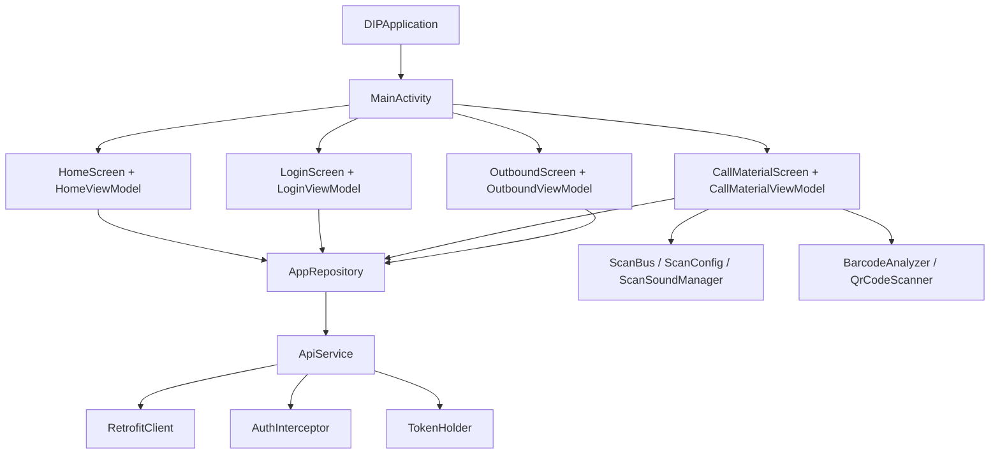
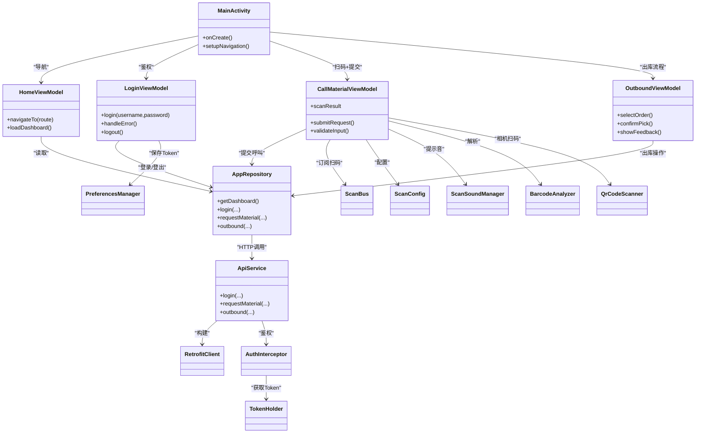
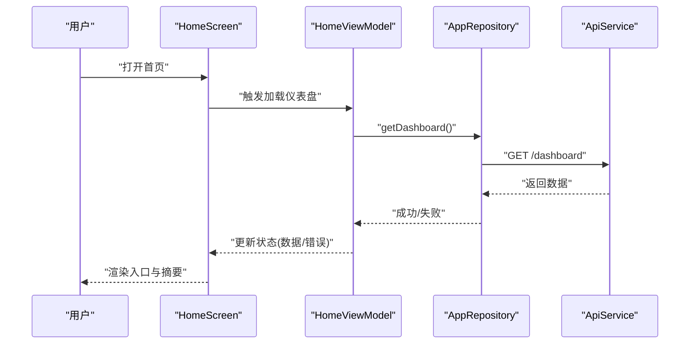
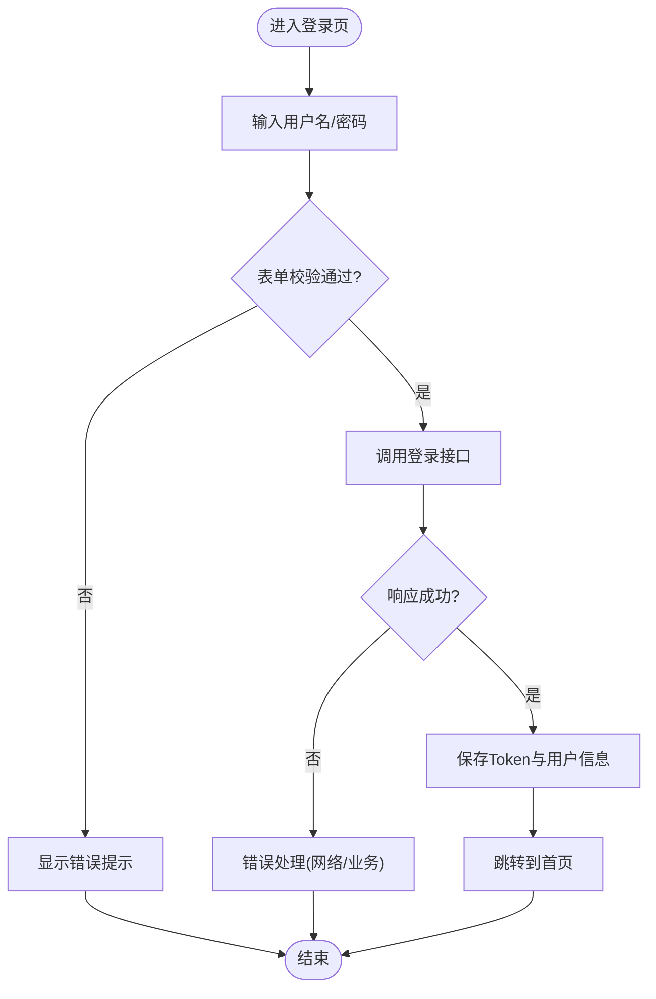
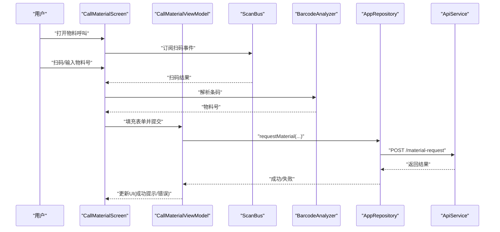
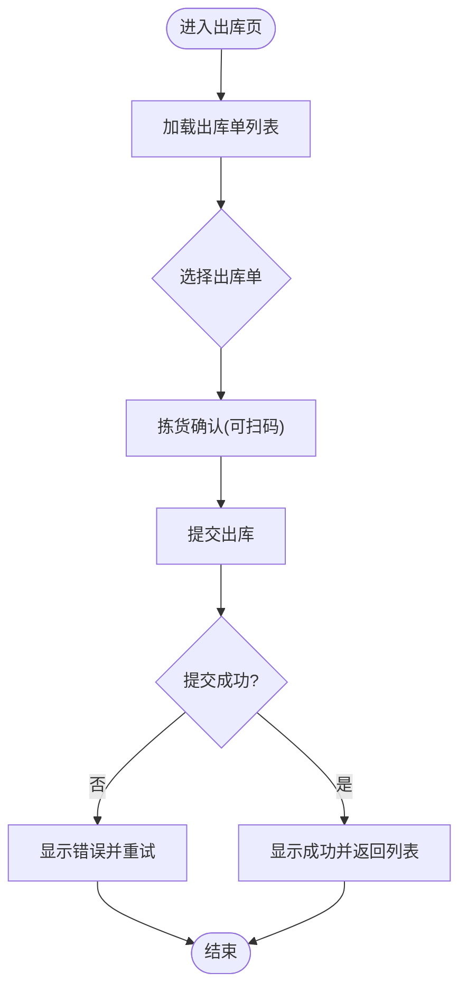
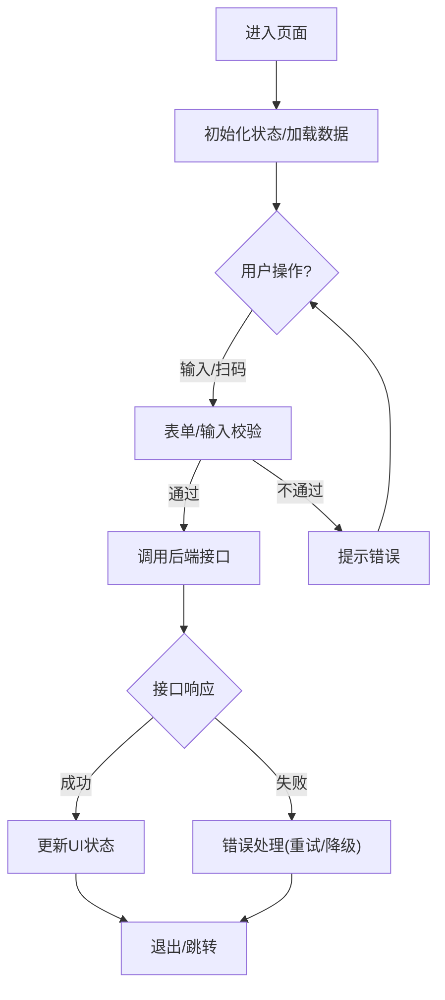
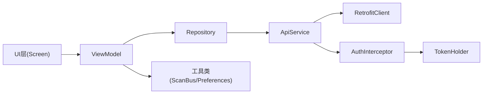

# 业务功能模块

<cite>
**本文引用的文件**   
- [MainActivity.kt](file://mobile-android/app/src/main/java/com/dip/material/MainActivity.kt)
- [DIPApplication.kt](file://mobile-android/app/src/main/java/com/dip/material/DIPApplication.kt)
- [HomeScreen.kt](file://mobile-android/app/src/main/java/com/dip/material/ui/home/HomeScreen.kt)
- [HomeViewModel.kt](file://mobile-android/app/src/main/java/com/dip/material/ui/home/HomeViewModel.kt)
- [LoginScreen.kt](file://mobile-android/app/src/main/java/com/dip/material/ui/login/LoginScreen.kt)
- [LoginViewModel.kt](file://mobile-android/app/src/main/java/com/dip/material/ui/login/LoginViewModel.kt)
- [CallMaterialScreen.kt](file://mobile-android/app/src/main/java/com/dip/material/ui/callmaterial/CallMaterialScreen.kt)
- [CallMaterialViewModel.kt](file://mobile-android/app/src/main/java/com/dip/material/ui/callmaterial/CallMaterialViewModel.kt)
- [OutboundScreen.kt](file://mobile-android/app/src/main/java/com/dip/material/ui/outbound/OutboundScreen.kt)
- [OutboundViewModel.kt](file://mobile-android/app/src/main/java/com/dip/material/ui/outbound/OutboundViewModel.kt)
- [ApiService.kt](file://mobile-android/app/src/main/java/com/dip/material/data/network/ApiService.kt)
- [RetrofitClient.kt](file://mobile-android/app/src/main/java/com/dip/material/data/network/RetrofitClient.kt)
- [AuthInterceptor.kt](file://mobile-android/app/src/main/java/com/dip/material/data/network/AuthInterceptor.kt)
- [TokenHolder.kt](file://mobile-android/app/src/main/java/com/dip/material/data/network/TokenHolder.kt)
- [AppRepository.kt](file://mobile-android/app/src/main/java/com/dip/material/data/repository/AppRepository.kt)
- [Models.kt](file://mobile-android/app/src/main/java/com/dip/material/data/models/Models.kt)
- [PreferencesManager.kt](file://mobile-android/app/src/main/java/com/dip/material/utils/PreferencesManager.kt)
- [ScanBus.kt](file://mobile-android/app/src/main/java/com/dip/material/utils/ScanBus.kt)
- [ScanConfig.kt](file://mobile-android/app/src/main/java/com/dip/material/utils/ScanConfig.kt)
- [ScanSoundManager.kt](file://mobile-android/app/src/main/java/com/dip/material/utils/ScanSoundManager.kt)
- [BarcodeAnalyzer.kt](file://mobile-android/app/src/main/java/com/dip/material/ui/components/BarcodeAnalyzer.kt)
- [QrCodeScanner.kt](file://mobile-android/app/src/main/java/com/dip/material/ui/components/QrCodeScanner.kt)
- [AndroidManifest.xml](file://mobile-android/app/src/main/AndroidManifest.xml)
</cite>

## 目录
1. [简介](#简介)
2. [项目结构](#项目结构)
3. [核心组件](#核心组件)
4. [架构总览](#架构总览)
5. [详细组件分析](#详细组件分析)
6. [依赖关系分析](#依赖关系分析)
7. [性能考虑](#性能考虑)
8. [故障排查指南](#故障排查指南)
9. [结论](#结论)
10. [附录](#附录)

## 简介
本文件面向DIP系统Android应用的业务功能模块，聚焦首页导航、用户登录、物料呼叫、出库管理等核心能力。文档从架构与数据流入手，详细说明ViewModel状态管理、界面交互逻辑、业务流程控制、页面间导航与数据传递、状态同步机制，并给出表单验证、错误处理与用户反馈设计建议，同时提供测试方法与性能优化技巧，帮助开发者快速理解与扩展系统。

## 项目结构
Android端采用模块化分层组织：
- 应用入口与全局初始化：DIPApplication、MainActivity
- UI层（Compose）：按业务域划分包，如home、login、callmaterial、outbound等，每个业务包含Screen与ViewModel
- 数据层：network（Retrofit+拦截器）、repository（统一数据访问）、models（数据模型）
- 工具层：扫描总线、扫码配置、声音提示、偏好设置等

图表来源
- [DIPApplication.kt](file://mobile-android/app/src/main/java/com/dip/material/DIPApplication.kt)
- [MainActivity.kt](file://mobile-android/app/src/main/java/com/dip/material/MainActivity.kt)
- [HomeScreen.kt](file://mobile-android/app/src/main/java/com/dip/material/ui/home/HomeScreen.kt)
- [HomeViewModel.kt](file://mobile-android/app/src/main/java/com/dip/material/ui/home/HomeViewModel.kt)
- [LoginScreen.kt](file://mobile-android/app/src/main/java/com/dip/material/ui/login/LoginScreen.kt)
- [LoginViewModel.kt](file://mobile-android/app/src/main/java/com/dip/material/ui/login/LoginViewModel.kt)
- [CallMaterialScreen.kt](file://mobile-android/app/src/main/java/com/dip/material/ui/callmaterial/CallMaterialScreen.kt)
- [CallMaterialViewModel.kt](file://mobile-android/app/src/main/java/com/dip/material/ui/callmaterial/CallMaterialViewModel.kt)
- [OutboundScreen.kt](file://mobile-android/app/src/main/java/com/dip/material/ui/outbound/OutboundScreen.kt)
- [OutboundViewModel.kt](file://mobile-android/app/src/main/java/com/dip/material/ui/outbound/OutboundViewModel.kt)
- [AppRepository.kt](file://mobile-android/app/src/main/java/com/dip/material/data/repository/AppRepository.kt)
- [ApiService.kt](file://mobile-android/app/src/main/java/com/dip/material/data/network/ApiService.kt)
- [RetrofitClient.kt](file://mobile-android/app/src/main/java/com/dip/material/data/network/RetrofitClient.kt)
- [AuthInterceptor.kt](file://mobile-android/app/src/main/java/com/dip/material/data/network/AuthInterceptor.kt)
- [TokenHolder.kt](file://mobile-android/app/src/main/java/com/dip/material/data/network/TokenHolder.kt)
- [ScanBus.kt](file://mobile-android/app/src/main/java/com/dip/material/utils/ScanBus.kt)
- [ScanConfig.kt](file://mobile-android/app/src/main/java/com/dip/material/utils/ScanConfig.kt)
- [ScanSoundManager.kt](file://mobile-android/app/src/main/java/com/dip/material/utils/ScanSoundManager.kt)
- [BarcodeAnalyzer.kt](file://mobile-android/app/src/main/java/com/dip/material/ui/components/BarcodeAnalyzer.kt)
- [QrCodeScanner.kt](file://mobile-android/app/src/main/java/com/dip/material/ui/components/QrCodeScanner.kt)

章节来源
- [DIPApplication.kt](file://mobile-android/app/src/main/java/com/dip/material/DIPApplication.kt)
- [MainActivity.kt](file://mobile-android/app/src/main/java/com/dip/material/MainActivity.kt)
- [AndroidManifest.xml](file://mobile-android/app/src/main/AndroidManifest.xml)

## 核心组件
- 应用与入口
  - DIPApplication：应用级初始化（网络、权限、扫描相关能力）
  - MainActivity：启动Compose根布局与路由分发
- UI与状态
  - HomeScreen/HomeViewModel：首页导航与快捷入口
  - LoginScreen/LoginViewModel：登录流程、鉴权状态、错误提示
  - CallMaterialScreen/CallMaterialViewModel：物料呼叫的扫码输入、列表展示、提交
  - OutboundScreen/OutboundViewModel：出库单选择、拣货确认、结果反馈
- 数据与网络
  - AppRepository：聚合API调用、缓存与错误转换
  - ApiService：Retrofit接口定义
  - RetrofitClient：客户端构建、超时、日志
  - AuthInterceptor：请求头注入Token
  - TokenHolder：Token读写与过期判断
- 工具与扫描
  - ScanBus/ScanConfig/ScanSoundManager：扫码事件总线、配置与提示音
  - BarcodeAnalyzer/QrCodeScanner：条码解析与相机扫码UI
  - PreferencesManager：本地持久化（如Token、用户信息）

章节来源
- [HomeScreen.kt](file://mobile-android/app/src/main/java/com/dip/material/ui/home/HomeScreen.kt)
- [HomeViewModel.kt](file://mobile-android/app/src/main/java/com/dip/material/ui/home/HomeViewModel.kt)
- [LoginScreen.kt](file://mobile-android/app/src/main/java/com/dip/material/ui/login/LoginScreen.kt)
- [LoginViewModel.kt](file://mobile-android/app/src/main/java/com/dip/material/ui/login/LoginLoginViewModel.kt)
- [CallMaterialScreen.kt](file://mobile-android/app/src/main/java/com/dip/material/ui/callmaterial/CallMaterialScreen.kt)
- [CallMaterialViewModel.kt](file://mobile-android/app/src/main/java/com/dip/material/ui/callmaterial/CallMaterialViewModel.kt)
- [OutboundScreen.kt](file://mobile-android/app/src/main/java/com/dip/material/ui/outbound/OutboundScreen.kt)
- [OutboundViewModel.kt](file://mobile-android/app/src/main/java/com/dip/material/ui/outbound/OutboundViewModel.kt)
- [AppRepository.kt](file://mobile-android/app/src/main/java/com/dip/material/data/repository/AppRepository.kt)
- [ApiService.kt](file://mobile-android/app/src/main/java/com/dip/material/data/network/ApiService.kt)
- [RetrofitClient.kt](file://mobile-android/app/src/main/java/com/dip/material/data/network/RetrofitClient.kt)
- [AuthInterceptor.kt](file://mobile-android/app/src/main/java/com/dip/material/data/network/AuthInterceptor.kt)
- [TokenHolder.kt](file://mobile-android/app/src/main/java/com/dip/material/data/network/TokenHolder.kt)
- [ScanBus.kt](file://mobile-android/app/src/main/java/com/dip/material/utils/ScanBus.kt)
- [ScanConfig.kt](file://mobile-android/app/src/main/java/com/dip/material/utils/ScanConfig.kt)
- [ScanSoundManager.kt](file://mobile-android/app/src/main/java/com/dip/material/utils/ScanSoundManager.kt)
- [BarcodeAnalyzer.kt](file://mobile-android/app/src/main/java/com/dip/material/ui/components/BarcodeAnalyzer.kt)
- [QrCodeScanner.kt](file://mobile-android/app/src/main/java/com/dip/material/ui/components/QrCodeScanner.kt)
- [PreferencesManager.kt](file://mobile-android/app/src/main/java/com/dip/material/utils/PreferencesManager.kt)

## 架构总览
整体遵循MVVM+Repository模式：
- UI层使用Jetpack Compose，通过StateFlow/State收集ViewModel状态
- ViewModel负责业务编排、错误处理与状态提升
- Repository封装网络、缓存与领域规则
- Network层基于Retrofit+OkHttp，统一鉴权拦截与Token刷新
- 扫描能力通过广播/总线解耦，避免UI阻塞

图表来源
- [MainActivity.kt](file://mobile-android/app/src/main/java/com/dip/material/MainActivity.kt)
- [HomeViewModel.kt](file://mobile-android/app/src/main/java/com/dip/material/ui/home/HomeViewModel.kt)
- [LoginViewModel.kt](file://mobile-android/app/src/main/java/com/dip/material/ui/login/LoginViewModel.kt)
- [CallMaterialViewModel.kt](file://mobile-android/app/src/main/java/com/dip/material/ui/callmaterial/CallMaterialViewModel.kt)
- [OutboundViewModel.kt](file://mobile-android/app/src/main/java/com/dip/material/ui/outbound/OutboundViewModel.kt)
- [AppRepository.kt](file://mobile-android/app/src/main/java/com/dip/material/data/repository/AppRepository.kt)
- [ApiService.kt](file://mobile-android/app/src/main/java/com/dip/material/data/network/ApiService.kt)
- [RetrofitClient.kt](file://mobile-android/app/src/main/java/com/dip/material/data/network/RetrofitClient.kt)
- [AuthInterceptor.kt](file://mobile-android/app/src/main/java/com/dip/material/data/network/AuthInterceptor.kt)
- [TokenHolder.kt](file://mobile-android/app/src/main/java/com/dip/material/data/network/TokenHolder.kt)
- [ScanBus.kt](file://mobile-android/app/src/main/java/com/dip/material/utils/ScanBus.kt)
- [ScanConfig.kt](file://mobile-android/app/src/main/java/com/dip/material/utils/ScanConfig.kt)
- [ScanSoundManager.kt](file://mobile-android/app/src/main/java/com/dip/material/utils/ScanSoundManager.kt)
- [BarcodeAnalyzer.kt](file://mobile-android/app/src/main/java/com/dip/material/ui/components/BarcodeAnalyzer.kt)
- [QrCodeScanner.kt](file://mobile-android/app/src/main/java/com/dip/material/ui/components/QrCodeScanner.kt)
- [PreferencesManager.kt](file://mobile-android/app/src/main/java/com/dip/material/utils/PreferencesManager.kt)

## 详细组件分析

### 首页导航（Home）
- 职责
  - 展示业务入口卡片（登录、物料呼叫、出库等）
  - 根据用户状态决定默认跳转
  - 加载仪表盘或待办摘要
- 状态管理
  - ViewModel暴露导航目标、加载状态、错误消息
  - UI通过StateFlow/State订阅更新
- 导航
  - 使用Compose导航组件进行页面切换
  - 参数以Route参数或Bundle传递

图表来源
- [HomeScreen.kt](file://mobile-android/app/src/main/java/com/dip/material/ui/home/HomeScreen.kt)
- [HomeViewModel.kt](file://mobile-android/app/src/main/java/com/dip/material/ui/home/HomeViewModel.kt)
- [AppRepository.kt](file://mobile-android/app/src/main/java/com/dip/material/data/repository/AppRepository.kt)
- [ApiService.kt](file://mobile-android/app/src/main/java/com/dip/material/data/network/ApiService.kt)

章节来源
- [HomeScreen.kt](file://mobile-android/app/src/main/java/com/dip/material/ui/home/HomeScreen.kt)
- [HomeViewModel.kt](file://mobile-android/app/src/main/java/com/dip/material/ui/home/HomeViewModel.kt)

### 用户登录（Login）
- 职责
  - 用户名/密码输入与校验
  - 调用登录接口，保存Token与用户信息
  - 失败时显示错误提示，支持重试
- 状态管理
  - 输入状态、加载状态、错误消息、登录成功标志
- 鉴权
  - AuthInterceptor在后续请求自动附加Token
  - TokenHolder负责Token生命周期管理

图表来源
- [LoginScreen.kt](file://mobile-android/app/src/main/java/com/dip/material/ui/login/LoginScreen.kt)
- [LoginViewModel.kt](file://mobile-android/app/src/main/java/com/dip/material/ui/login/LoginViewModel.kt)
- [AuthInterceptor.kt](file://mobile-android/app/src/main/java/com/dip/material/data/network/AuthInterceptor.kt)
- [TokenHolder.kt](file://mobile-android/app/src/main/java/com/dip/material/data/network/TokenHolder.kt)
- [PreferencesManager.kt](file://mobile-android/app/src/main/java/com/dip/material/utils/PreferencesManager.kt)

章节来源
- [LoginScreen.kt](file://mobile-android/app/src/main/java/com/dip/material/ui/login/LoginScreen.kt)
- [LoginViewModel.kt](file://mobile-android/app/src/main/java/com/dip/material/ui/login/LoginViewModel.kt)

### 物料呼叫（Call Material）
- 职责
  - 支持手动输入与扫码输入物料号
  - 校验物料号格式与必填项
  - 提交呼叫请求，展示结果与历史
- 扫码集成
  - ScanBus接收扫码事件，ScanConfig配置解码策略
  - ScanSoundManager播放提示音，提升操作反馈
  - BarcodeAnalyzer解析条码内容，QrCodeScanner提供相机扫码UI
- 状态管理
  - 输入状态、扫码结果、提交中、成功/失败消息

图表来源
- [CallMaterialScreen.kt](file://mobile-android/app/src/main/java/com/dip/material/ui/callmaterial/CallMaterialScreen.kt)
- [CallMaterialViewModel.kt](file://mobile-android/app/src/main/java/com/dip/material/ui/callmaterial/CallMaterialViewModel.kt)
- [ScanBus.kt](file://mobile-android/app/src/main/java/com/dip/material/utils/ScanBus.kt)
- [ScanConfig.kt](file://mobile-android/app/src/main/java/com/dip/material/utils/ScanConfig.kt)
- [ScanSoundManager.kt](file://mobile-android/app/src/main/java/com/dip/material/utils/ScanSoundManager.kt)
- [BarcodeAnalyzer.kt](file://mobile-android/app/src/main/java/com/dip/material/ui/components/BarcodeAnalyzer.kt)
- [QrCodeScanner.kt](file://mobile-android/app/src/main/java/com/dip/material/ui/components/QrCodeScanner.kt)
- [AppRepository.kt](file://mobile-android/app/src/main/java/com/dip/material/data/repository/AppRepository.kt)
- [ApiService.kt](file://mobile-android/app/src/main/java/com/dip/material/data/network/ApiService.kt)

章节来源
- [CallMaterialScreen.kt](file://mobile-android/app/src/main/java/com/dip/material/ui/callmaterial/CallMaterialScreen.kt)
- [CallMaterialViewModel.kt](file://mobile-android/app/src/main/java/com/dip/material/ui/callmaterial/CallMaterialViewModel.kt)

### 出库管理（Outbound）
- 职责
  - 选择出库单、拣货确认、批量提交
  - 展示进度与结果反馈
- 状态管理
  - 订单列表、选中项、提交状态、错误提示
- 交互
  - 支持扫码快速定位物料，减少人工输入

图表来源
- [OutboundScreen.kt](file://mobile-android/app/src/main/java/com/dip/material/ui/outbound/OutboundScreen.kt)
- [OutboundViewModel.kt](file://mobile-android/app/src/main/java/com/dip/material/ui/outbound/OutboundViewModel.kt)
- [AppRepository.kt](file://mobile-android/app/src/main/java/com/dip/material/data/repository/AppRepository.kt)
- [ApiService.kt](file://mobile-android/app/src/main/java/com/dip/material/data/network/ApiService.kt)

章节来源
- [OutboundScreen.kt](file://mobile-android/app/src/main/java/com/dip/material/ui/outbound/OutboundScreen.kt)
- [OutboundViewModel.kt](file://mobile-android/app/src/main/java/com/dip/material/ui/outbound/OutboundViewModel.kt)

### 概念性概览
以下流程图展示了通用业务页面的交互范式，适用于登录、物料呼叫、出库等场景：

[本图为概念性流程，不直接映射具体源码文件]

## 依赖关系分析
- 组件耦合
  - UI与ViewModel松耦合，通过StateFlow/State通信
  - ViewModel与Repository单向依赖，便于测试与替换实现
  - Repository与Network层通过ApiService解耦
- 外部依赖
  - Retrofit/OkHttp用于HTTP通信
  - Jetpack Compose与Navigation用于UI与路由
  - 扫码SDK通过ScanBus抽象，降低耦合

图表来源
- [HomeViewModel.kt](file://mobile-android/app/src/main/java/com/dip/material/ui/home/HomeViewModel.kt)
- [LoginViewModel.kt](file://mobile-android/app/src/main/java/com/dip/material/ui/login/LoginViewModel.kt)
- [CallMaterialViewModel.kt](file://mobile-android/app/src/main/java/com/dip/material/ui/callmaterial/CallMaterialViewModel.kt)
- [OutboundViewModel.kt](file://mobile-android/app/src/main/java/com/dip/material/ui/outbound/OutboundViewModel.kt)
- [AppRepository.kt](file://mobile-android/app/src/main/java/com/dip/material/data/repository/AppRepository.kt)
- [ApiService.kt](file://mobile-android/app/src/main/java/com/dip/material/data/network/ApiService.kt)
- [RetrofitClient.kt](file://mobile-android/app/src/main/java/com/dip/material/data/network/RetrofitClient.kt)
- [AuthInterceptor.kt](file://mobile-android/app/src/main/java/com/dip/material/data/network/AuthInterceptor.kt)
- [TokenHolder.kt](file://mobile-android/app/src/main/java/com/dip/material/data/network/TokenHolder.kt)
- [ScanBus.kt](file://mobile-android/app/src/main/java/com/dip/material/utils/ScanBus.kt)
- [PreferencesManager.kt](file://mobile-android/app/src/main/java/com/dip/material/utils/PreferencesManager.kt)

章节来源
- [AppRepository.kt](file://mobile-android/app/src/main/java/com/dip/material/data/repository/AppRepository.kt)
- [ApiService.kt](file://mobile-android/app/src/main/java/com/dip/material/data/network/ApiService.kt)
- [RetrofitClient.kt](file://mobile-android/app/src/main/java/com/dip/material/data/network/RetrofitClient.kt)
- [AuthInterceptor.kt](file://mobile-android/app/src/main/java/com/dip/material/data/network/AuthInterceptor.kt)
- [TokenHolder.kt](file://mobile-android/app/src/main/java/com/dip/material/data/network/TokenHolder.kt)
- [ScanBus.kt](file://mobile-android/app/src/main/java/com/dip/material/utils/ScanBus.kt)
- [PreferencesManager.kt](file://mobile-android/app/src/main/java/com/dip/material/utils/PreferencesManager.kt)

## 性能考虑
- 网络层
  - 合理设置Retrofit超时与重试策略，避免频繁重发
  - 使用Gzip压缩与缓存策略，减少带宽占用
  - 对大列表分页加载，避免一次性拉取过多数据
- UI层
  - 使用StateFlow/State精确订阅，避免不必要的重组
  - 图片与资源按需加载，避免主线程阻塞
- 扫描与I/O
  - 将扫码解析放在后台线程，避免卡顿
  - 提示音与震动异步执行，减少UI延迟
- 内存与生命周期
  - ViewModel持有轻量状态，避免泄漏
  - 及时释放相机与监听器，防止内存泄漏

[本节为通用指导，不直接分析具体文件]

## 故障排查指南
- 登录失败
  - 检查Token是否有效、AuthInterceptor是否正确注入
  - 查看后端返回的错误码与消息，定位业务错误
  - 确认PreferencesManager是否正确保存/读取Token
- 扫码无响应
  - 检查ScanBus订阅是否生效、权限是否授予
  - 确认ScanConfig解码策略与相机权限
  - 使用ScanSoundManager验证音频输出是否正常
- 网络异常
  - 检查RetrofitClient配置（域名、协议、超时）
  - 查看日志与拦截器链，确认请求头与签名
  - 针对弱网环境增加重试与降级提示

章节来源
- [LoginViewModel.kt](file://mobile-android/app/src/main/java/com/dip/material/ui/login/LoginViewModel.kt)
- [AuthInterceptor.kt](file://mobile-android/app/src/main/java/com/dip/material/data/network/AuthInterceptor.kt)
- [TokenHolder.kt](file://mobile-android/app/src/main/java/com/dip/material/data/network/TokenHolder.kt)
- [PreferencesManager.kt](file://mobile-android/app/src/main/java/com/dip/material/utils/PreferencesManager.kt)
- [ScanBus.kt](file://mobile-android/app/src/main/java/com/dip/material/utils/ScanBus.kt)
- [ScanConfig.kt](file://mobile-android/app/src/main/java/com/dip/material/utils/ScanConfig.kt)
- [ScanSoundManager.kt](file://mobile-android/app/src/main/java/com/dip/material/utils/ScanSoundManager.kt)
- [RetrofitClient.kt](file://mobile-android/app/src/main/java/com/dip/material/data/network/RetrofitClient.kt)

## 结论
本模块以MVVM+Repository为核心，结合Compose与Retrofit构建了清晰的业务边界与数据流。通过统一的鉴权拦截、扫码总线与工具库，实现了登录、物料呼叫、出库等关键流程的稳定与可扩展。建议在后续迭代中继续强化错误处理、性能监控与自动化测试，以提升用户体验与交付质量。

[本节为总结，不直接分析具体文件]

## 附录
- 表单验证建议
  - 必填字段即时校验，错误提示就近显示
  - 输入长度、格式、范围等多维度校验
- 错误处理与用户反馈
  - 区分网络错误与业务错误，提供明确提示
  - 支持一键重试与回退操作
- 功能测试方法
  - 单元测试：ViewModel状态流转、Repository数据转换
  - 集成测试：ApiService接口契约、拦截器行为
  - UI测试：Compose组合与导航路径覆盖
- 用户体验改进
  - 加载骨架屏与空状态占位
  - 扫码成功后即时音效与振动反馈
  - 关键操作二次确认与撤销机制

[本节为补充建议，不直接分析具体文件]