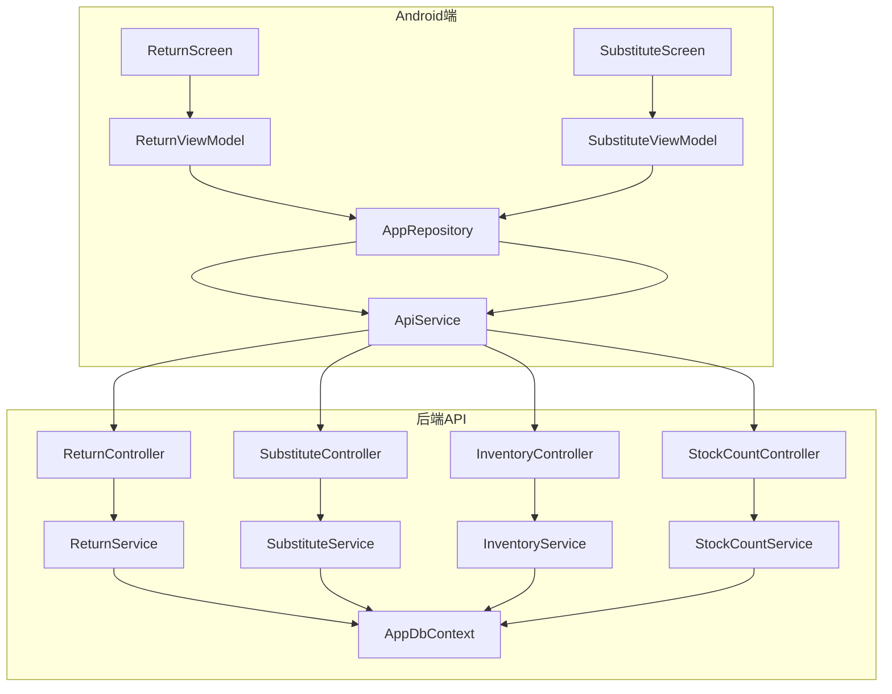
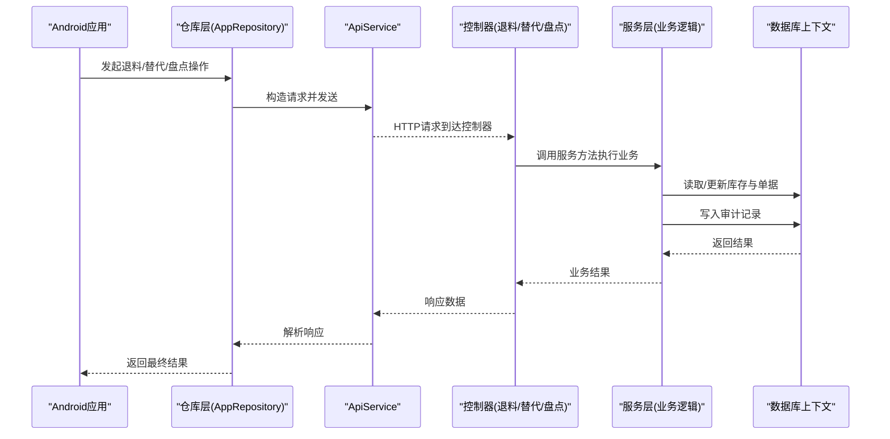
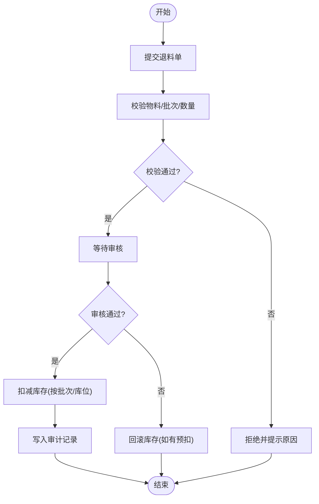
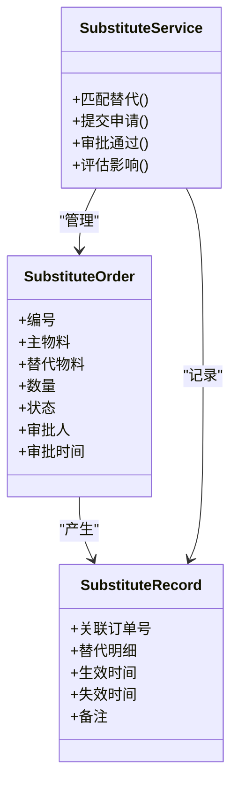
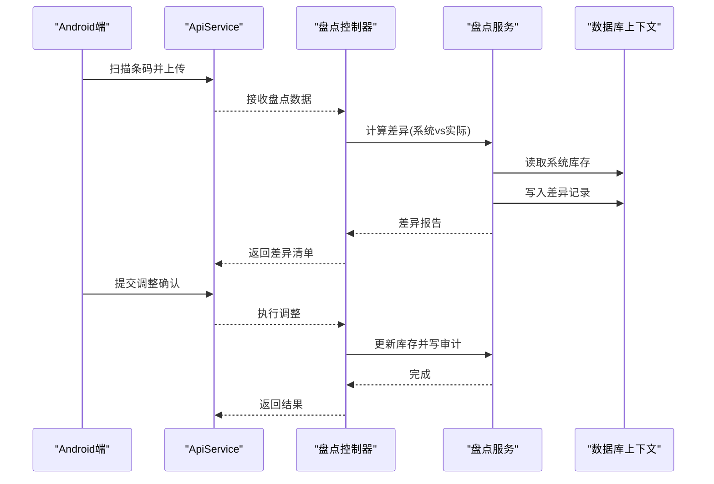
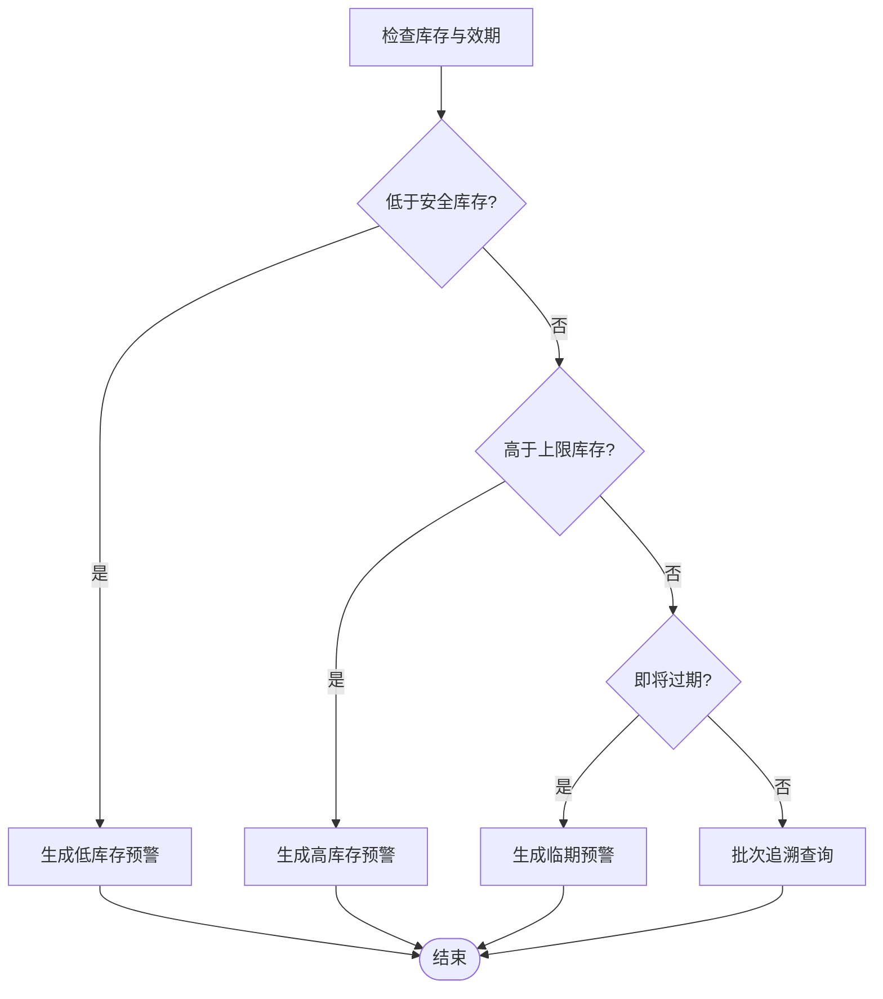
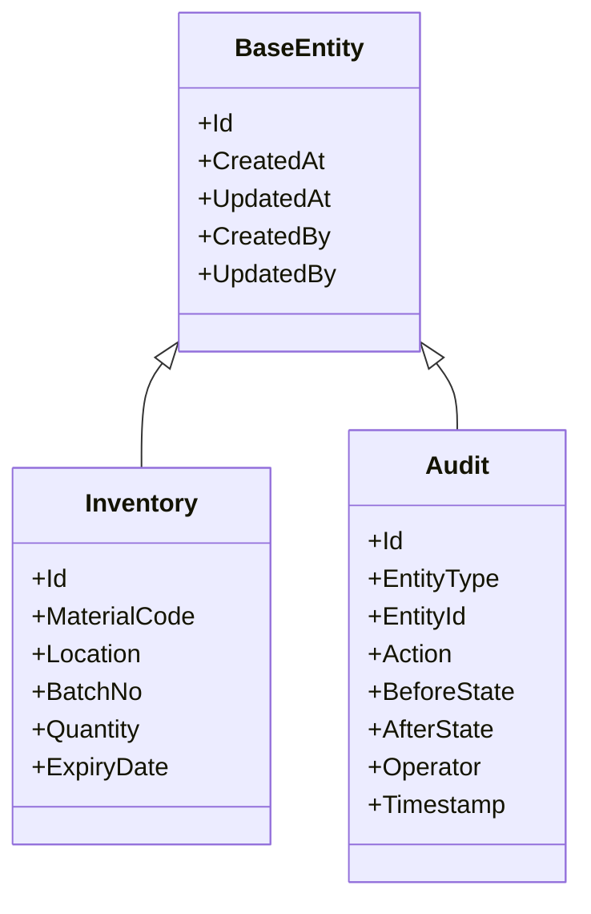
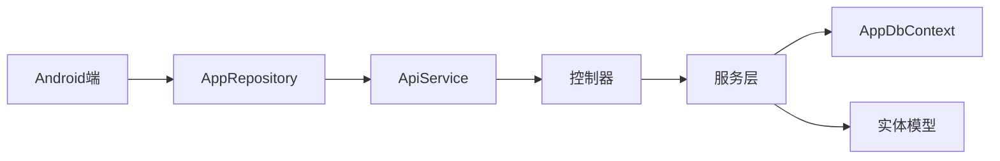

# 库存控制模块

<cite>
**本文引用的文件**   
- [InventoryController.cs](file://dip-system/api/Controllers/InventoryController.cs)
- [InventoryService.cs](file://dip-system/api/Services/InventoryService.cs)
- [Inventory.cs](file://dip-system/api/Models/Inventory.cs)
- [ReturnController.cs](file://dip-system/api/Controllers/ReturnController.cs)
- [ReturnService.cs](file://dip-system/api/Services/ReturnService.cs)
- [Return.cs](file://dip-system/api/Models/Return.cs)
- [SubstituteController.cs](file://dip-system/api/Controllers/SubstituteController.cs)
- [SubstituteService.cs](file://dip-system/api/Services/SubstituteService.cs)
- [SubstituteOrder.cs](file://dip-system/api/Models/SubstituteOrder.cs)
- [SubstituteRecord.cs](file://dip-system/api/Models/SubstituteRecord.cs)
- [StockCountController.cs](file://dip-system/api/Controllers/StockCountController.cs)
- [StockCountService.cs](file://dip-system/api/Services/StockCountService.cs)
- [StockCount.cs](file://dip-system/api/Models/StockCount.cs)
- [Audit.cs](file://dip-system/api/Models/Audit.cs)
- [BaseEntity.cs](file://dip-system/api/Models/BaseEntity.cs)
- [AppDbContext.cs](file://dip-system/api/Data/AppDbContext.cs)
- [ApiService.kt](file://mobile-android/app/src/main/java/com/dip/material/data/network/ApiService.kt)
- [AppRepository.kt](file://mobile-android/app/src/main/java/com/dip/material/data/repository/AppRepository.kt)
- [ReturnScreen.kt](file://mobile-android/app/src/main/java/com/dip/material/ui/return_/ReturnScreen.kt)
- [ReturnViewModel.kt](file://mobile-android/app/src/main/java/com/dip/material/ui/return_/ReturnViewModel.kt)
- [SubstituteScreen.kt](file://mobile-android/app/src/main/java/com/dip/material/ui/substitute/SubstituteScreen.kt)
- [SubstituteViewModel.kt](file://mobile-android/app/src/main/java/com/dip/material/ui/substitute/SubstituteViewModel.kt)
- [StockCountList.tsx](file://dip-system/frontend-web/src/pages/StockCountList.tsx)
</cite>

## 目录
1. [简介](#简介)
2. [项目结构](#项目结构)
3. [核心组件](#核心组件)
4. [架构总览](#架构总览)
5. [详细组件分析](#详细组件分析)
6. [依赖关系分析](#依赖关系分析)
7. [性能考虑](#性能考虑)
8. [故障排查指南](#故障排查指南)
9. [结论](#结论)
10. [附录](#附录) 

## 简介
本文件面向DIP系统Android应用的“库存控制模块”，围绕退料审核与回滚、替代料匹配与审批、盘点作业（扫描盘点、差异分析与调整确认）、库存预警与效期管理、批次追溯、准确性保证、异常处理与审计日志等关键能力进行系统化说明。文档以服务端API控制器与服务层为核心，结合Android端界面与仓库层，给出端到端流程、数据模型、错误处理与审计追踪机制，帮助开发与运维人员快速理解并正确使用该模块。

## 项目结构
库存控制相关代码分布在后端API、前端Web与Android移动端三层：
- 后端API：控制器负责HTTP接口定义，服务层实现业务逻辑，模型定义数据实体，数据库上下文提供持久化。
- Android端：屏幕与视图模型负责用户交互与状态管理，网络层调用后端API，仓库层封装数据访问。
- 前端Web：盘点列表页面用于盘点任务管理与结果查看。

**图示来源** 
- [ReturnScreen.kt](file://mobile-android/app/src/main/java/com/dip/material/ui/return_/ReturnScreen.kt)
- [ReturnViewModel.kt](file://mobile-android/app/src/main/java/com/dip/material/ui/return_/ReturnViewModel.kt)
- [SubstituteScreen.kt](file://mobile-android/app/src/main/java/com/dip/material/ui/substitute/SubstituteScreen.kt)
- [SubstituteViewModel.kt](file://mobile-android/app/src/main/java/com/dip/material/ui/substitute/SubstituteViewModel.kt)
- [AppRepository.kt](file://mobile-android/app/src/main/java/com/dip/material/data/repository/AppRepository.kt)
- [ApiService.kt](file://mobile-android/app/src/main/java/com/dip/material/data/network/ApiService.kt)
- [ReturnController.cs](file://dip-system/api/Controllers/ReturnController.cs)
- [ReturnService.cs](file://dip-system/api/Services/ReturnService.cs)
- [SubstituteController.cs](file://dip-system/api/Controllers/SubstituteController.cs)
- [SubstituteService.cs](file://dip-system/api/Services/SubstituteService.cs)
- [InventoryController.cs](file://dip-system/api/Controllers/InventoryController.cs)
- [InventoryService.cs](file://dip-system/api/Services/InventoryService.cs)
- [StockCountController.cs](file://dip-system/api/Controllers/StockCountController.cs)
- [StockCountService.cs](file://dip-system/api/Services/StockCountService.cs)
- [AppDbContext.cs](file://dip-system/api/Data/AppDbContext.cs)

**章节来源**
- [ReturnController.cs](file://dip-system/api/Controllers/ReturnController.cs)
- [ReturnService.cs](file://dip-system/api/Services/ReturnService.cs)
- [SubstituteController.cs](file://dip-system/api/Controllers/SubstituteController.cs)
- [SubstituteService.cs](file://dip-system/api/Services/SubstituteService.cs)
- [InventoryController.cs](file://dip-system/api/Controllers/InventoryController.cs)
- [InventoryService.cs](file://dip-system/api/Services/InventoryService.cs)
- [StockCountController.cs](file://dip-system/api/Controllers/StockCountController.cs)
- [StockCountService.cs](file://dip-system/api/Services/StockCountService.cs)
- [AppDbContext.cs](file://dip-system/api/Data/AppDbContext.cs)
- [ApiService.kt](file://mobile-android/app/src/main/java/com/dip/material/data/network/ApiService.kt)
- [AppRepository.kt](file://mobile-android/app/src/main/java/com/dip/material/data/repository/AppRepository.kt)
- [ReturnScreen.kt](file://mobile-android/app/src/main/java/com/dip/material/ui/return_/ReturnScreen.kt)
- [ReturnViewModel.kt](file://mobile-android/app/src/main/java/com/dip/material/ui/return_/ReturnViewModel.kt)
- [SubstituteScreen.kt](file://mobile-android/app/src/main/java/com/dip/material/ui/substitute/SubstituteScreen.kt)
- [SubstituteViewModel.kt](file://mobile-android/app/src/main/java/com/dip/material/ui/substitute/SubstituteViewModel.kt)
- [StockCountList.tsx](file://dip-system/frontend-web/src/pages/StockCountList.tsx)

## 核心组件
- 退料管理：控制器暴露退料提交、查询、审核接口；服务层实现退料单创建、校验、库存扣减与回滚、审计记录写入。
- 替代料管理：控制器提供替代料申请、匹配、审批接口；服务层实现替代规则匹配、影响评估、审批流推进与记录归档。
- 库存基础：控制器与服务层提供库存查询、锁定、释放、批量更新等能力，支撑退料与替代料操作。
- 盘点作业：控制器与服务层支持盘点任务创建、扫描录入、差异计算、调整确认与审计记录。
- 审计与基类：所有实体继承基类，统一包含审计字段；审计模型记录操作轨迹。

**章节来源**
- [ReturnController.cs](file://dip-system/api/Controllers/ReturnController.cs)
- [ReturnService.cs](file://dip-system/api/Services/ReturnService.cs)
- [Return.cs](file://dip-system/api/Models/Return.cs)
- [SubstituteController.cs](file://dip-system/api/Controllers/SubstituteController.cs)
- [SubstituteService.cs](file://dip-system/api/Services/SubstituteService.cs)
- [SubstituteOrder.cs](file://dip-system/api/Models/SubstituteOrder.cs)
- [SubstituteRecord.cs](file://dip-system/api/Models/SubstituteRecord.cs)
- [InventoryController.cs](file://dip-system/api/Controllers/InventoryController.cs)
- [InventoryService.cs](file://dip-system/api/Services/InventoryService.cs)
- [Inventory.cs](file://dip-system/api/Models/Inventory.cs)
- [StockCountController.cs](file://dip-system/api/Controllers/StockCountController.cs)
- [StockCountService.cs](file://dip-system/api/Services/StockCountService.cs)
- [StockCount.cs](file://dip-system/api/Models/StockCount.cs)
- [Audit.cs](file://dip-system/api/Models/Audit.cs)
- [BaseEntity.cs](file://dip-system/api/Models/BaseEntity.cs)

## 架构总览
库存控制模块采用分层架构：Android端通过ApiService调用后端REST接口，控制器接收请求后委托服务层执行业务逻辑，服务层通过数据库上下文读写实体，并在关键节点写入审计记录。

**图示来源** 
- [ApiService.kt](file://mobile-android/app/src/main/java/com/dip/material/data/network/ApiService.kt)
- [AppRepository.kt](file://mobile-android/app/src/main/java/com/dip/material/data/repository/AppRepository.kt)
- [ReturnController.cs](file://dip-system/api/Controllers/ReturnController.cs)
- [ReturnService.cs](file://dip-system/api/Services/ReturnService.cs)
- [SubstituteController.cs](file://dip-system/api/Controllers/SubstituteController.cs)
- [SubstituteService.cs](file://dip-system/api/Services/SubstituteService.cs)
- [StockCountController.cs](file://dip-system/api/Controllers/StockCountController.cs)
- [StockCountService.cs](file://dip-system/api/Services/StockCountService.cs)
- [AppDbContext.cs](file://dip-system/api/Data/AppDbContext.cs)

## 详细组件分析

### 退料流程：审核机制、库存回滚与记录保存
- 审核机制：退料单提交后进入待审状态，审核通过后执行库存扣减；审核拒绝则保持原库存或触发回滚。
- 库存回滚：在审核失败或撤销时，按退料明细逐项恢复对应批次与库位的数量，确保一致性。
- 记录保存：每次退料操作均生成退料单与审计记录，包含操作人、时间、原因、前后库存快照。

**图示来源** 
- [ReturnController.cs](file://dip-system/api/Controllers/ReturnController.cs)
- [ReturnService.cs](file://dip-system/api/Services/ReturnService.cs)
- [Return.cs](file://dip-system/api/Models/Return.cs)
- [InventoryService.cs](file://dip-system/api/Services/InventoryService.cs)
- [Audit.cs](file://dip-system/api/Models/Audit.cs)

**章节来源**
- [ReturnController.cs](file://dip-system/api/Controllers/ReturnController.cs)
- [ReturnService.cs](file://dip-system/api/Services/ReturnService.cs)
- [Return.cs](file://dip-system/api/Models/Return.cs)
- [InventoryService.cs](file://dip-system/api/Services/InventoryService.cs)
- [Audit.cs](file://dip-system/api/Models/Audit.cs)

### 替代料管理：匹配规则、审批流程与影响评估
- 匹配规则：基于物料编码、规格、供应商、有效期、批次策略等进行替代匹配，支持优先级与条件过滤。
- 审批流程：替代申请提交后进入审批队列，审批通过后生效并记录替代关系与使用范围。
- 影响评估：评估对现有订单、在途库存、生产计划的影响，必要时触发调整建议。

**图示来源** 
- [SubstituteOrder.cs](file://dip-system/api/Models/SubstituteOrder.cs)
- [SubstituteRecord.cs](file://dip-system/api/Models/SubstituteRecord.cs)
- [SubstituteService.cs](file://dip-system/api/Services/SubstituteService.cs)
- [SubstituteController.cs](file://dip-system/api/Controllers/SubstituteController.cs)

**章节来源**
- [SubstituteController.cs](file://dip-system/api/Controllers/SubstituteController.cs)
- [SubstituteService.cs](file://dip-system/api/Services/SubstituteService.cs)
- [SubstituteOrder.cs](file://dip-system/api/Models/SubstituteOrder.cs)
- [SubstituteRecord.cs](file://dip-system/api/Models/SubstituteRecord.cs)

### 盘点作业：扫描盘点、差异分析与调整确认
- 扫描盘点：通过条码/二维码扫描采集实际库存，自动与系统库存比对。
- 差异分析：计算盘盈盘亏，生成差异报告，支持按库位/批次维度汇总。
- 调整确认：审核差异后执行库存调整，记录调整原因与审计信息。

**图示来源** 
- [StockCountController.cs](file://dip-system/api/Controllers/StockCountController.cs)
- [StockCountService.cs](file://dip-system/api/Services/StockCountService.cs)
- [StockCount.cs](file://dip-system/api/Models/StockCount.cs)
- [ApiService.kt](file://mobile-android/app/src/main/java/com/dip/material/data/network/ApiService.kt)
- [AppRepository.kt](file://mobile-android/app/src/main/java/com/dip/material/data/repository/AppRepository.kt)

**章节来源**
- [StockCountController.cs](file://dip-system/api/Controllers/StockCountController.cs)
- [StockCountService.cs](file://dip-system/api/Services/StockCountService.cs)
- [StockCount.cs](file://dip-system/api/Models/StockCount.cs)
- [StockCountList.tsx](file://dip-system/frontend-web/src/pages/StockCountList.tsx)

### 库存预警与效期管理、批次追溯
- 库存预警：当库存低于安全阈值或高于上限时触发预警，支持按物料/库位配置阈值。
- 效期管理：维护物料有效期，临期预警与过期拦截，支持先进先出(FIFO)策略。
- 批次追溯：记录每批物料的入库、出库、退料、替代、盘点调整轨迹，支持正向与反向追溯。

**图示来源** 
- [InventoryService.cs](file://dip-system/api/Services/InventoryService.cs)
- [Inventory.cs](file://dip-system/api/Models/Inventory.cs)
- [Audit.cs](file://dip-system/api/Models/Audit.cs)

**章节来源**
- [InventoryService.cs](file://dip-system/api/Services/InventoryService.cs)
- [Inventory.cs](file://dip-system/api/Models/Inventory.cs)
- [Audit.cs](file://dip-system/api/Models/Audit.cs)

### 库存准确性保证、异常处理与审计日志
- 准确性保证：通过事务性更新、并发锁、盘点校准与差异闭环提升库存准确性。
- 异常处理：统一异常过滤器捕获异常，返回标准化错误码与消息，支持重试与降级。
- 审计日志：所有关键操作写入审计表，包含操作人、时间、前后值、原因，支持查询与导出。

**图示来源** 
- [BaseEntity.cs](file://dip-system/api/Models/BaseEntity.cs)
- [Audit.cs](file://dip-system/api/Models/Audit.cs)
- [Inventory.cs](file://dip-system/api/Models/Inventory.cs)

**章节来源**
- [BaseEntity.cs](file://dip-system/api/Models/BaseEntity.cs)
- [Audit.cs](file://dip-system/api/Models/Audit.cs)
- [Inventory.cs](file://dip-system/api/Models/Inventory.cs)

## 依赖关系分析
库存控制模块的依赖关系清晰：Android端依赖ApiService与AppRepository；后端控制器依赖服务层；服务层依赖数据库上下文与实体模型。各层职责明确，耦合度低，便于扩展与维护。

**图示来源** 
- [AppRepository.kt](file://mobile-android/app/src/main/java/com/dip/material/data/repository/AppRepository.kt)
- [ApiService.kt](file://mobile-android/app/src/main/java/com/dip/material/data/network/ApiService.kt)
- [ReturnController.cs](file://dip-system/api/Controllers/ReturnController.cs)
- [ReturnService.cs](file://dip-system/api/Services/ReturnService.cs)
- [SubstituteController.cs](file://dip-system/api/Controllers/SubstituteController.cs)
- [SubstituteService.cs](file://dip-system/api/Services/SubstituteService.cs)
- [StockCountController.cs](file://dip-system/api/Controllers/StockCountController.cs)
- [StockCountService.cs](file://dip-system/api/Services/StockCountService.cs)
- [AppDbContext.cs](file://dip-system/api/Data/AppDbContext.cs)
- [Inventory.cs](file://dip-system/api/Models/Inventory.cs)
- [Return.cs](file://dip-system/api/Models/Return.cs)
- [SubstituteOrder.cs](file://dip-system/api/Models/SubstituteOrder.cs)
- [SubstituteRecord.cs](file://dip-system/api/Models/SubstituteRecord.cs)
- [StockCount.cs](file://dip-system/api/Models/StockCount.cs)

**章节来源**
- [AppRepository.kt](file://mobile-android/app/src/main/java/com/dip/material/data/repository/AppRepository.kt)
- [ApiService.kt](file://mobile-android/app/src/main/java/com/dip/material/data/network/ApiService.kt)
- [ReturnController.cs](file://dip-system/api/Controllers/ReturnController.cs)
- [ReturnService.cs](file://dip-system/api/Services/ReturnService.cs)
- [SubstituteController.cs](file://dip-system/api/Controllers/SubstituteController.cs)
- [SubstituteService.cs](file://dip-system/api/Services/SubstituteService.cs)
- [StockCountController.cs](file://dip-system/api/Controllers/StockCountController.cs)
- [StockCountService.cs](file://dip-system/api/Services/StockCountService.cs)
- [AppDbContext.cs](file://dip-system/api/Data/AppDbContext.cs)
- [Inventory.cs](file://dip-system/api/Models/Inventory.cs)
- [Return.cs](file://dip-system/api/Models/Return.cs)
- [SubstituteOrder.cs](file://dip-system/api/Models/SubstituteOrder.cs)
- [SubstituteRecord.cs](file://dip-system/api/Models/SubstituteRecord.cs)
- [StockCount.cs](file://dip-system/api/Models/StockCount.cs)

## 性能考虑
- 批量操作：退料、盘点调整建议使用批量接口减少往返次数。
- 索引优化：为物料编码、批次号、库位、有效期等常用查询字段建立索引。
- 缓存策略：对热点库存数据可引入内存缓存，注意一致性刷新。
- 异步处理：审批通知、预警推送可采用异步任务避免阻塞主流程。
- 分页查询：盘点与审计日志列表需分页加载，避免一次性拉取大量数据。

[本节为通用指导，不直接分析具体文件]

## 故障排查指南
- 常见异常：参数校验失败、库存不足、并发冲突、网络超时。
- 定位方法：查看审计日志与错误日志，核对操作前后状态；检查数据库事务是否回滚。
- 解决步骤：修正输入参数、释放被占用的库存、重试失败请求、检查网络与权限。
- 预防建议：增加前置校验、完善异常提示、加强监控告警。

**章节来源**
- [ReturnController.cs](file://dip-system/api/Controllers/ReturnController.cs)
- [ReturnService.cs](file://dip-system/api/Services/ReturnService.cs)
- [SubstituteController.cs](file://dip-system/api/Controllers/SubstituteController.cs)
- [SubstituteService.cs](file://dip-system/api/Services/SubstituteService.cs)
- [StockCountController.cs](file://dip-system/api/Controllers/StockCountController.cs)
- [StockCountService.cs](file://dip-system/api/Services/StockCountService.cs)
- [Audit.cs](file://dip-system/api/Models/Audit.cs)

## 结论
库存控制模块通过清晰的层次结构与完善的业务流程，实现了退料审核与回滚、替代料匹配与审批、盘点作业与差异调整、库存预警与效期管理、批次追溯与审计日志等核心能力。建议在后续迭代中持续优化性能与用户体验，强化异常处理与监控告警，确保库存数据的准确性与可追溯性。

[本节为总结性内容，不直接分析具体文件]

## 附录
- 术语表：退料、替代料、盘点、库存预警、效期管理、批次追溯、审计日志。
- 参考页面：Android端退料与替代料界面、前端盘点列表页面。

[本节为补充信息，不直接分析具体文件]