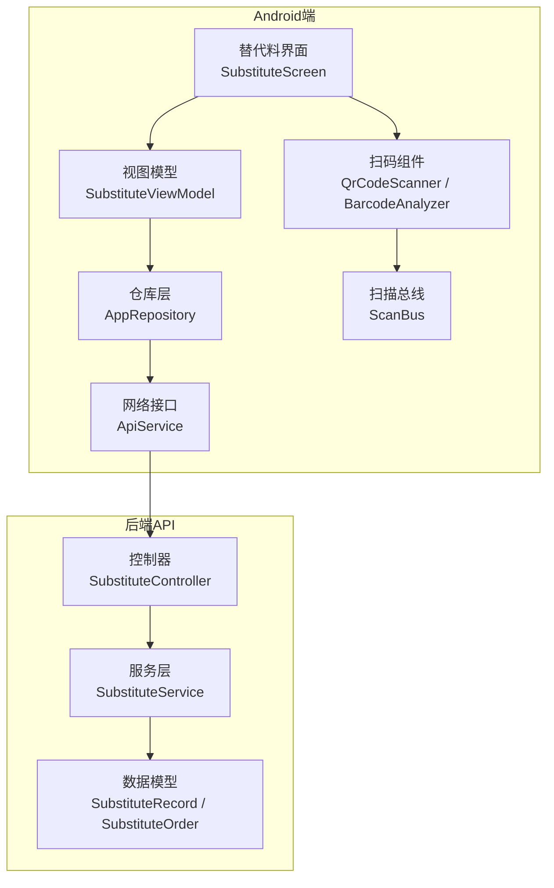
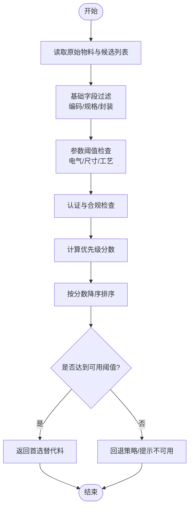
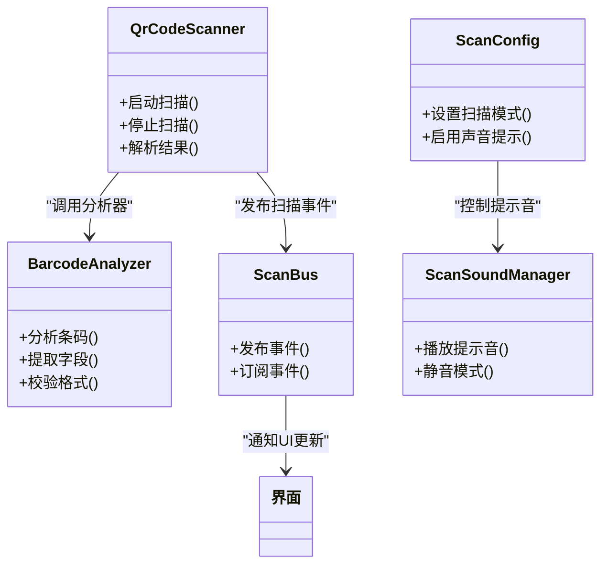
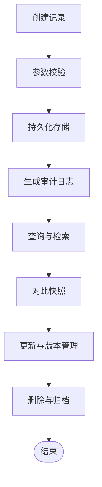
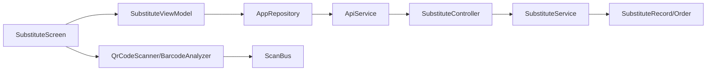

# 替代料管理

<cite>
**本文引用的文件**   
- [SubstituteController.cs](file://dip-system/api/Controllers/SubstituteController.cs)
- [SubstituteService.cs](file://dip-system/api/Services/SubstituteService.cs)
- [SubstituteRecord.cs](file://dip-system/api/Models/SubstituteRecord.cs)
- [SubstituteOrder.cs](file://dip-system/api/Models/SubstituteOrder.cs)
- [ApiService.kt](file://mobile-android/app/src/main/java/com/dip/material/data/network/ApiService.kt)
- [AppRepository.kt](file://mobile-android/app/src/main/java/com/dip/material/data/repository/AppRepository.kt)
- [SubstituteScreen.kt](file://mobile-android/app/src/main/java/com/dip/material/ui/substitute/SubstituteScreen.kt)
- [SubstituteViewModel.kt](file://mobile-android/app/src/main/java/com/dip/material/ui/substitute/SubstituteViewModel.kt)
- [BarcodeAnalyzer.kt](file://mobile-android/app/src/main/java/com/dip/material/ui/components/BarcodeAnalyzer.kt)
- [QrCodeScanner.kt](file://mobile-android/app/src/main/java/com/dip/material/ui/components/QrCodeScanner.kt)
- [ScanBus.kt](file://mobile-android/app/src/main/java/com/dip/material/utils/ScanBus.kt)
- [ScanConfig.kt](file://mobile-android/app/src/main/java/com/dip/material/utils/ScanConfig.kt)
- [ScanSoundManager.kt](file://mobile-android/app/src/main/java/com/dip/material/utils/ScanSoundManager.kt)
- [2026-07-13-substitute-redesign-plan.md](file://dip-system/docs/superpowers/plans/2026-07-13-substitute-redesign-plan.md)
</cite>

## 目录
1. [简介](#简介)
2. [项目结构](#项目结构)
3. [核心组件](#核心组件)
4. [架构总览](#架构总览)
5. [详细组件分析](#详细组件分析)
6. [依赖关系分析](#依赖关系分析)
7. [性能考虑](#性能考虑)
8. [故障排查指南](#故障排查指南)
9. [结论](#结论)
10. [附录](#附录)

## 简介
本文件面向DIP系统Android应用中的“替代料管理”功能，覆盖以下关键主题：
- 替代料的匹配规则、优先级算法与兼容性检查
- 替代料审批流程、影响评估与变更通知
- 替代料扫描识别、物料对比与参数验证
- 替代料记录管理、历史追溯与性能监控
- 异常处理、数据一致性保证与用户体验优化

该文档以代码仓库中的后端API、服务层、模型定义以及Android端界面、网络与扫描组件为依据，提供从业务到实现的系统化说明。

## 项目结构
围绕替代料管理，涉及的主要模块如下：
- 后端API与控制层：提供替代料相关的数据查询、提交与审批接口
- 服务层：封装替代料匹配、优先级排序、兼容性校验、审批流转等核心逻辑
- 数据模型：定义替代料记录、订单关联等实体结构
- Android前端：提供扫码识别、物料对比、参数校验、提交审批的交互界面
- 扫描与工具：二维码/条码扫描、广播总线、声音提示与配置管理



图表来源
- [SubstituteScreen.kt](file://mobile-android/app/src/main/java/com/dip/material/ui/substitute/SubstituteScreen.kt)
- [SubstituteViewModel.kt](file://mobile-android/app/src/main/java/com/dip/material/ui/substitute/SubstituteViewModel.kt)
- [AppRepository.kt](file://mobile-android/app/src/main/java/com/dip/material/data/repository/AppRepository.kt)
- [ApiService.kt](file://mobile-android/app/src/main/java/com/dip/material/data/network/ApiService.kt)
- [QrCodeScanner.kt](file://mobile-android/app/src/main/java/com/dip/material/ui/components/QrCodeScanner.kt)
- [BarcodeAnalyzer.kt](file://mobile-android/app/src/main/java/com/dip/material/ui/components/BarcodeAnalyzer.kt)
- [ScanBus.kt](file://mobile-android/app/src/main/java/com/dip/material/utils/ScanBus.kt)
- [SubstituteController.cs](file://dip-system/api/Controllers/SubstituteController.cs)
- [SubstituteService.cs](file://dip-system/api/Services/SubstituteService.cs)
- [SubstituteRecord.cs](file://dip-system/api/Models/SubstituteRecord.cs)
- [SubstituteOrder.cs](file://dip-system/api/Models/SubstituteOrder.cs)

章节来源
- [SubstituteController.cs](file://dip-system/api/Controllers/SubstituteController.cs)
- [SubstituteService.cs](file://dip-system/api/Services/SubstituteService.cs)
- [SubstituteRecord.cs](file://dip-system/api/Models/SubstituteRecord.cs)
- [SubstituteOrder.cs](file://dip-system/api/Models/SubstituteOrder.cs)
- [ApiService.kt](file://mobile-android/app/src/main/java/com/dip/material/data/network/ApiService.kt)
- [AppRepository.kt](file://mobile-android/app/src/main/java/com/dip/material/data/repository/AppRepository.kt)
- [SubstituteScreen.kt](file://mobile-android/app/src/main/java/com/dip/material/ui/substitute/SubstituteScreen.kt)
- [SubstituteViewModel.kt](file://mobile-android/app/src/main/java/com/dip/material/ui/substitute/SubstituteViewModel.kt)
- [BarcodeAnalyzer.kt](file://mobile-android/app/src/main/java/com/dip/material/ui/components/BarcodeAnalyzer.kt)
- [QrCodeScanner.kt](file://mobile-android/app/src/main/java/com/dip/material/ui/components/QrCodeScanner.kt)
- [ScanBus.kt](file://mobile-android/app/src/main/java/com/dip/material/utils/ScanBus.kt)
- [ScanConfig.kt](file://mobile-android/app/src/main/java/com/dip/material/utils/ScanConfig.kt)
- [ScanSoundManager.kt](file://mobile-android/app/src/main/java/com/dip/material/utils/ScanSoundManager.kt)

## 核心组件
- 控制层（SubstituteController）：暴露替代料相关的REST接口，负责请求解析、参数校验与响应封装
- 服务层（SubstituteService）：实现替代料匹配规则、优先级排序、兼容性检查、审批流程、影响评估与变更通知
- 数据模型（SubstituteRecord、SubstituteOrder）：描述替代料记录与订单关联的结构
- Android端界面（SubstituteScreen、SubstituteViewModel）：提供扫码、对比、校验、提交审批的用户交互与状态管理
- 网络与仓库（ApiService、AppRepository）：封装HTTP调用与本地缓存/重试策略
- 扫描与工具（QrCodeScanner、BarcodeAnalyzer、ScanBus、ScanConfig、ScanSoundManager）：完成条码/二维码识别、事件分发与提示音

章节来源
- [SubstituteController.cs](file://dip-system/api/Controllers/SubstituteController.cs)
- [SubstituteService.cs](file://dip-system/api/Services/SubstituteService.cs)
- [SubstituteRecord.cs](file://dip-system/api/Models/SubstituteRecord.cs)
- [SubstituteOrder.cs](file://dip-system/api/Models/SubstituteOrder.cs)
- [ApiService.kt](file://mobile-android/app/src/main/java/com/dip/material/data/network/ApiService.kt)
- [AppRepository.kt](file://mobile-android/app/src/main/java/com/dip/material/data/repository/AppRepository.kt)
- [SubstituteScreen.kt](file://mobile-android/app/src/main/java/com/dip/material/ui/substitute/SubstituteScreen.kt)
- [SubstituteViewModel.kt](file://mobile-android/app/src/main/java/com/dip/material/ui/substitute/SubstituteViewModel.kt)
- [BarcodeAnalyzer.kt](file://mobile-android/app/src/main/java/com/dip/material/ui/components/BarcodeAnalyzer.kt)
- [QrCodeScanner.kt](file://mobile-android/app/src/main/java/com/dip/material/ui/components/QrCodeScanner.kt)
- [ScanBus.kt](file://mobile-android/app/src/main/java/com/dip/material/utils/ScanBus.kt)
- [ScanConfig.kt](file://mobile-android/app/src/main/java/com/dip/material/utils/ScanConfig.kt)
- [ScanSoundManager.kt](file://mobile-android/app/src/main/java/com/dip/material/utils/ScanSoundManager.kt)

## 架构总览
替代料管理的端到端流程包括：
- Android端通过扫码组件识别物料信息，经视图模型与仓库层调用后端API
- 后端控制器接收请求并交由服务层执行匹配、优先级排序、兼容性检查与审批流程
- 服务层基于数据模型持久化记录与订单关联，返回结果给前端展示与操作

```mermaid
sequenceDiagram
participant 用户 as "用户"
participant 界面 as "SubstituteScreen"
participant VM as "SubstituteViewModel"
participant 仓库 as "AppRepository"
participant 网络 as "ApiService"
participant 控制器 as "SubstituteController"
participant 服务 as "SubstituteService"
participant 模型 as "SubstituteRecord/Order"
用户->>界面 : 打开替代料页面
界面->>VM : 初始化状态
用户->>界面 : 扫码/输入物料
界面->>VM : 触发扫描回调
VM->>仓库 : 获取基础信息与候选替代料
仓库->>网络 : 发起HTTP请求
网络->>控制器 : POST/GET 替代料接口
控制器->>服务 : 调用匹配/优先级/兼容性逻辑
服务->>模型 : 读取/写入替代料记录与订单
服务-->>控制器 : 返回匹配结果与审批状态
控制器-->>网络 : 封装响应
网络-->>仓库 : 返回数据
仓库-->>VM : 更新状态
VM-->>界面 : 渲染对比与操作按钮
用户->>界面 : 提交审批/确认使用
界面->>VM : 提交动作
VM->>仓库 : 提交审批/变更记录
仓库->>网络 : 发起提交请求
网络->>控制器->>服务 : 执行审批与影响评估
服务-->>控制器 : 返回成功/失败
控制器-->>网络-->>仓库-->>VM-->>界面 : 反馈结果与通知
```

图表来源
- [SubstituteScreen.kt](file://mobile-android/app/src/main/java/com/dip/material/ui/substitute/SubstituteScreen.kt)
- [SubstituteViewModel.kt](file://mobile-android/app/src/main/java/com/dip/material/ui/substitute/SubstituteViewModel.kt)
- [AppRepository.kt](file://mobile-android/app/src/main/java/com/dip/material/data/repository/AppRepository.kt)
- [ApiService.kt](file://mobile-android/app/src/main/java/com/dip/material/data/network/ApiService.kt)
- [SubstituteController.cs](file://dip-system/api/Controllers/SubstituteController.cs)
- [SubstituteService.cs](file://dip-system/api/Services/SubstituteService.cs)
- [SubstituteRecord.cs](file://dip-system/api/Models/SubstituteRecord.cs)
- [SubstituteOrder.cs](file://dip-system/api/Models/SubstituteOrder.cs)

## 详细组件分析

### 替代料匹配规则与优先级算法
- 匹配维度：物料编码、规格型号、封装形式、电气参数、供应商批次、认证状态等
- 优先级排序：基于兼容等级、认证完备性、库存可用性、价格差异、历史使用成功率等综合评分
- 兼容性检查：关键参数阈值比对、封装尺寸约束、工艺能力限制、安全与合规要求



图表来源
- [SubstituteService.cs](file://dip-system/api/Services/SubstituteService.cs)
- [SubstituteRecord.cs](file://dip-system/api/Models/SubstituteRecord.cs)
- [SubstituteOrder.cs](file://dip-system/api/Models/SubstituteOrder.cs)

章节来源
- [SubstituteService.cs](file://dip-system/api/Services/SubstituteService.cs)
- [SubstituteRecord.cs](file://dip-system/api/Models/SubstituteRecord.cs)
- [SubstituteOrder.cs](file://dip-system/api/Models/SubstituteOrder.cs)

### 替代料审批流程与影响评估
- 审批流程：提交申请→审核人校验→影响评估（BOM/工艺/库存/成本）→批准或驳回→记录归档
- 影响评估：对当前订单、在制工单、库存计划、采购策略的影响分析与风险提示
- 变更通知：审批通过后向相关角色推送通知，更新生效范围与版本

```mermaid
sequenceDiagram
participant 用户 as "用户"
participant 界面 as "SubstituteScreen"
participant VM as "SubstituteViewModel"
participant 仓库 as "AppRepository"
participant 网络 as "ApiService"
participant 控制器 as "SubstituteController"
participant 服务 as "SubstituteService"
用户->>界面 : 选择替代料并提交审批
界面->>VM : 触发提交动作
VM->>仓库 : 提交审批请求
仓库->>网络 : 发起POST审批接口
网络->>控制器 : 接收审批请求
控制器->>服务 : 执行审批与影响评估
服务-->>控制器 : 返回评估结果与审批状态
控制器-->>网络-->>仓库-->>VM-->>界面 : 展示结果与后续操作
```

图表来源
- [SubstituteController.cs](file://dip-system/api/Controllers/SubstituteController.cs)
- [SubstituteService.cs](file://dip-system/api/Services/SubstituteService.cs)
- [ApiService.kt](file://mobile-android/app/src/main/java/com/dip/material/data/network/ApiService.kt)
- [AppRepository.kt](file://mobile-android/app/src/main/java/com/dip/material/data/repository/AppRepository.kt)
- [SubstituteScreen.kt](file://mobile-android/app/src/main/java/com/dip/material/ui/substitute/SubstituteScreen.kt)
- [SubstituteViewModel.kt](file://mobile-android/app/src/main/java/com/dip/material/ui/substitute/SubstituteViewModel.kt)

章节来源
- [SubstituteController.cs](file://dip-system/api/Controllers/SubstituteController.cs)
- [SubstituteService.cs](file://dip-system/api/Services/SubstituteService.cs)
- [ApiService.kt](file://mobile-android/app/src/main/java/com/dip/material/data/network/ApiService.kt)
- [AppRepository.kt](file://mobile-android/app/src/main/java/com/dip/material/data/repository/AppRepository.kt)
- [SubstituteScreen.kt](file://mobile-android/app/src/main/java/com/dip/material/ui/substitute/SubstituteScreen.kt)
- [SubstituteViewModel.kt](file://mobile-android/app/src/main/java/com/dip/material/ui/substitute/SubstituteViewModel.kt)

### 替代料扫描识别与物料对比
- 扫描识别：支持二维码/条码扫描，解析物料编码、批次、序列号等关键信息
- 物料对比：将扫描结果与目标物料进行字段级对比，突出差异项（规格、封装、参数）
- 参数验证：对关键参数进行阈值校验与格式校验，确保可替换性与安全性



图表来源
- [QrCodeScanner.kt](file://mobile-android/app/src/main/java/com/dip/material/ui/components/QrCodeScanner.kt)
- [BarcodeAnalyzer.kt](file://mobile-android/app/src/main/java/com/dip/material/ui/components/BarcodeAnalyzer.kt)
- [ScanBus.kt](file://mobile-android/app/src/main/java/com/dip/material/utils/ScanBus.kt)
- [ScanConfig.kt](file://mobile-android/app/src/main/java/com/dip/material/utils/ScanConfig.kt)
- [ScanSoundManager.kt](file://mobile-android/app/src/main/java/com/dip/material/utils/ScanSoundManager.kt)

章节来源
- [QrCodeScanner.kt](file://mobile-android/app/src/main/java/com/dip/material/ui/components/QrCodeScanner.kt)
- [BarcodeAnalyzer.kt](file://mobile-android/app/src/main/java/com/dip/material/ui/components/BarcodeAnalyzer.kt)
- [ScanBus.kt](file://mobile-android/app/src/main/java/com/dip/material/utils/ScanBus.kt)
- [ScanConfig.kt](file://mobile-android/app/src/main/java/com/dip/material/utils/ScanConfig.kt)
- [ScanSoundManager.kt](file://mobile-android/app/src/main/java/com/dip/material/utils/ScanSoundManager.kt)

### 替代料记录管理与历史追溯
- 记录管理：创建、查询、更新、删除替代料记录，维护版本与审计信息
- 历史追溯：记录每次变更的操作人、时间、原因与前后对比快照
- 数据一致性：通过事务与幂等设计保证记录一致性与可恢复性



图表来源
- [SubstituteRecord.cs](file://dip-system/api/Models/SubstituteRecord.cs)
- [SubstituteOrder.cs](file://dip-system/api/Models/SubstituteOrder.cs)
- [SubstituteService.cs](file://dip-system/api/Services/SubstituteService.cs)

章节来源
- [SubstituteRecord.cs](file://dip-system/api/Models/SubstituteRecord.cs)
- [SubstituteOrder.cs](file://dip-system/api/Models/SubstituteOrder.cs)
- [SubstituteService.cs](file://dip-system/api/Services/SubstituteService.cs)

### 性能监控与用户体验优化
- 性能监控：对匹配计算、审批流程、扫描解析耗时进行埋点与统计
- 用户体验：加载态提示、错误友好提示、批量操作优化、离线缓存与重试
- 扫描体验：快速识别、防抖处理、声音与震动反馈、弱网降级

章节来源
- [SubstituteScreen.kt](file://mobile-android/app/src/main/java/com/dip/material/ui/substitute/SubstituteScreen.kt)
- [SubstituteViewModel.kt](file://mobile-android/app/src/main/java/com/dip/material/ui/substitute/SubstituteViewModel.kt)
- [ApiService.kt](file://mobile-android/app/src/main/java/com/dip/material/data/network/ApiService.kt)
- [AppRepository.kt](file://mobile-android/app/src/main/java/com/dip/material/data/repository/AppRepository.kt)
- [ScanBus.kt](file://mobile-android/app/src/main/java/com/dip/material/utils/ScanBus.kt)
- [ScanSoundManager.kt](file://mobile-android/app/src/main/java/com/dip/material/utils/ScanSoundManager.kt)

## 依赖关系分析
- Android端依赖：界面层依赖视图模型，视图模型依赖仓库层，仓库层依赖网络接口；扫描组件通过总线与UI解耦
- 后端依赖：控制器依赖服务层，服务层依赖数据模型；服务层内部包含匹配、优先级、兼容性、审批等业务逻辑
- 外部集成：网络层可能集成认证拦截器、超时与重试策略；扫描组件依赖设备硬件能力



图表来源
- [SubstituteScreen.kt](file://mobile-android/app/src/main/java/com/dip/material/ui/substitute/SubstituteScreen.kt)
- [SubstituteViewModel.kt](file://mobile-android/app/src/main/java/com/dip/material/ui/substitute/SubstituteViewModel.kt)
- [AppRepository.kt](file://mobile-android/app/src/main/java/com/dip/material/data/repository/AppRepository.kt)
- [ApiService.kt](file://mobile-android/app/src/main/java/com/dip/material/data/network/ApiService.kt)
- [SubstituteController.cs](file://dip-system/api/Controllers/SubstituteController.cs)
- [SubstituteService.cs](file://dip-system/api/Services/SubstituteService.cs)
- [SubstituteRecord.cs](file://dip-system/api/Models/SubstituteRecord.cs)
- [SubstituteOrder.cs](file://dip-system/api/Models/SubstituteOrder.cs)
- [QrCodeScanner.kt](file://mobile-android/app/src/main/java/com/dip/material/ui/components/QrCodeScanner.kt)
- [BarcodeAnalyzer.kt](file://mobile-android/app/src/main/java/com/dip/material/ui/components/BarcodeAnalyzer.kt)
- [ScanBus.kt](file://mobile-android/app/src/main/java/com/dip/material/utils/ScanBus.kt)

章节来源
- [SubstituteScreen.kt](file://mobile-android/app/src/main/java/com/dip/material/ui/substitute/SubstituteScreen.kt)
- [SubstituteViewModel.kt](file://mobile-android/app/src/main/java/com/dip/material/ui/substitute/SubstituteViewModel.kt)
- [AppRepository.kt](file://mobile-android/app/src/main/java/com/dip/material/data/repository/AppRepository.kt)
- [ApiService.kt](file://mobile-android/app/src/main/java/com/dip/material/data/network/ApiService.kt)
- [SubstituteController.cs](file://dip-system/api/Controllers/SubstituteController.cs)
- [SubstituteService.cs](file://dip-system/api/Services/SubstituteService.cs)
- [SubstituteRecord.cs](file://dip-system/api/Models/SubstituteRecord.cs)
- [SubstituteOrder.cs](file://dip-system/api/Models/SubstituteOrder.cs)
- [QrCodeScanner.kt](file://mobile-android/app/src/main/java/com/dip/material/ui/components/QrCodeScanner.kt)
- [BarcodeAnalyzer.kt](file://mobile-android/app/src/main/java/com/dip/material/ui/components/BarcodeAnalyzer.kt)
- [ScanBus.kt](file://mobile-android/app/src/main/java/com/dip/material/utils/ScanBus.kt)

## 性能考虑
- 匹配与排序：避免全量扫描，采用索引与预筛选减少计算开销
- 审批流程：异步处理影响评估，避免阻塞主线程
- 扫描解析：本地缓存解析结果，减少重复计算
- 网络请求：合理设置超时与重试，避免频繁请求导致抖动
- 内存管理：及时释放扫描资源，避免内存泄漏

[本节为通用指导，不直接分析具体文件]

## 故障排查指南
- 扫描失败：检查设备权限、摄像头状态、扫描配置与总线订阅是否正确
- 匹配结果为空：核对基础字段过滤条件、参数阈值与认证状态
- 审批失败：查看影响评估报告、权限校验与数据一致性约束
- 网络异常：检查认证令牌、接口路径与错误码，必要时启用重试与降级

章节来源
- [SubstituteController.cs](file://dip-system/api/Controllers/SubstituteController.cs)
- [SubstituteService.cs](file://dip-system/api/Services/SubstituteService.cs)
- [ApiService.kt](file://mobile-android/app/src/main/java/com/dip/material/data/network/ApiService.kt)
- [AppRepository.kt](file://mobile-android/app/src/main/java/com/dip/material/data/repository/AppRepository.kt)
- [SubstituteScreen.kt](file://mobile-android/app/src/main/java/com/dip/material/ui/substitute/SubstituteScreen.kt)
- [SubstituteViewModel.kt](file://mobile-android/app/src/main/java/com/dip/material/ui/substitute/SubstituteViewModel.kt)
- [ScanBus.kt](file://mobile-android/app/src/main/java/com/dip/material/utils/ScanBus.kt)
- [ScanConfig.kt](file://mobile-android/app/src/main/java/com/dip/material/utils/ScanConfig.kt)
- [ScanSoundManager.kt](file://mobile-android/app/src/main/java/com/dip/material/utils/ScanSoundManager.kt)

## 结论
替代料管理功能通过Android端与后端的协同，实现了从扫描识别、物料对比、参数验证到匹配排序、兼容性检查、审批流程与影响评估的完整闭环。借助清晰的依赖关系与良好的用户体验设计，系统在稳定性、性能与可维护性方面具备良好基础。建议持续完善监控与审计能力，进一步提升数据一致性与操作可追溯性。

[本节为总结性内容，不直接分析具体文件]

## 附录
- 参考设计文档：替代料重构计划（规划了替代料功能的整体改进方向与实施步骤）

章节来源
- [2026-07-13-substitute-redesign-plan.md](file://dip-system/docs/superpowers/plans/2026-07-13-substitute-redesign-plan.md)