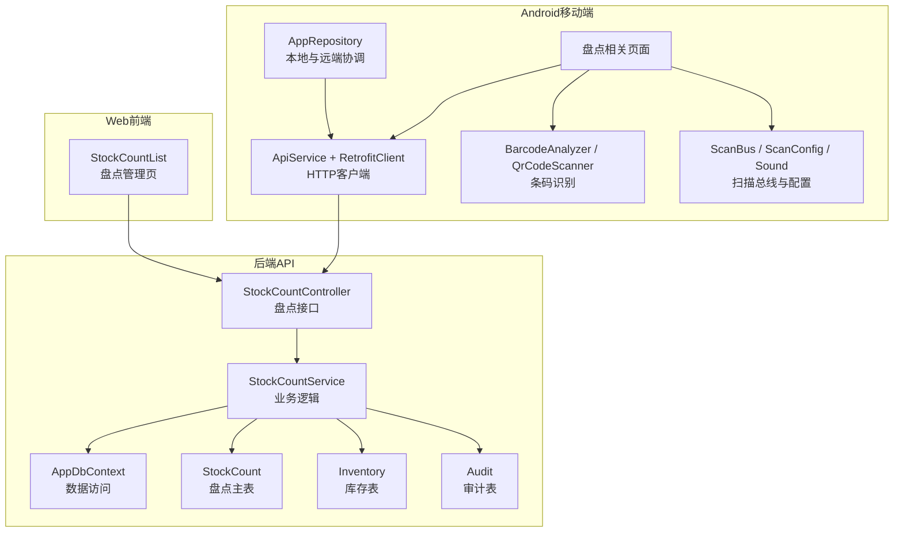
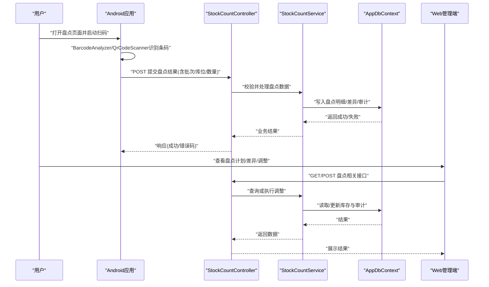
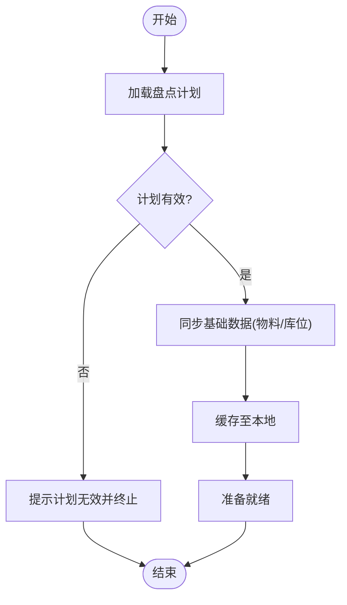
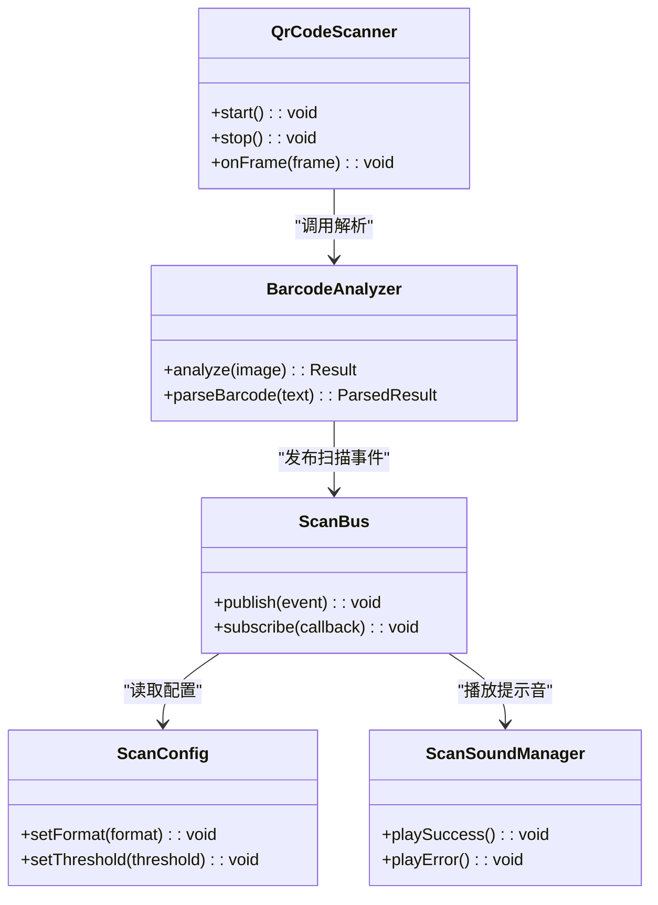
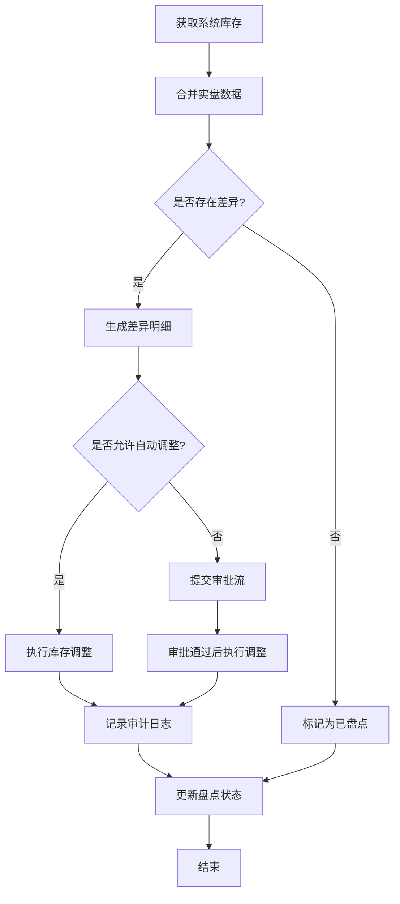
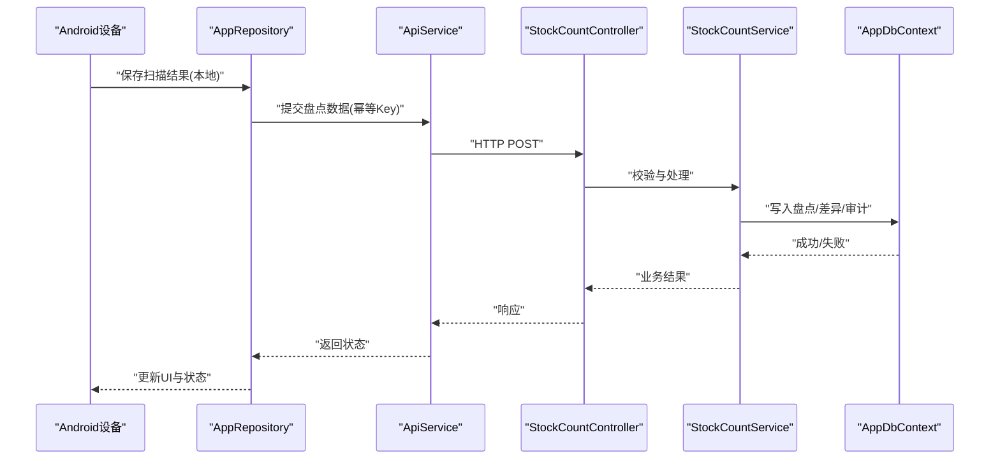
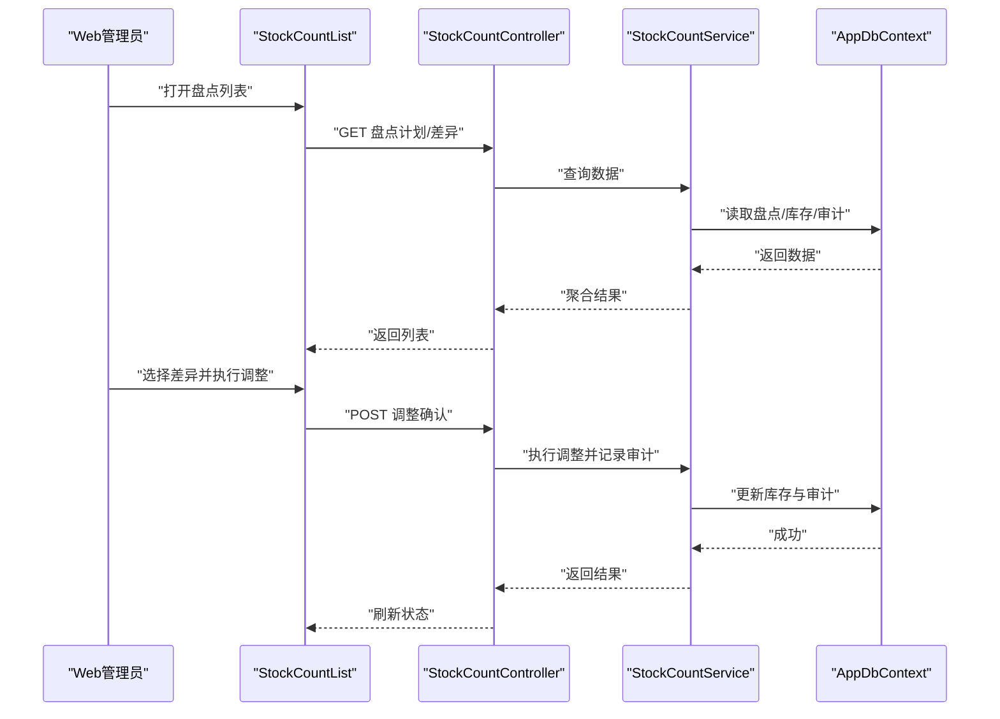
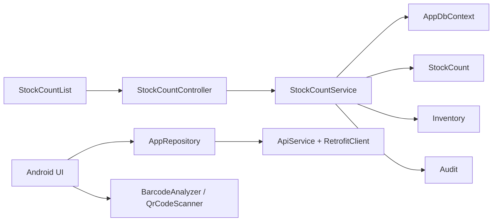

# 盘点作业

<cite>
**本文引用的文件**   
- [StockCountController.cs](file://dip-system/api/Controllers/StockCountController.cs)
- [StockCountService.cs](file://dip-system/api/Services/StockCountService.cs)
- [StockCount.cs](file://dip-system/api/Models/StockCount.cs)
- [Inventory.cs](file://dip-system/api/Models/Inventory.cs)
- [Audit.cs](file://dip-system/api/Models/Audit.cs)
- [AppDbContext.cs](file://dip-system/api/Data/AppDbContext.cs)
- [ApiService.kt](file://mobile-android/app/src/main/java/com/dip/material/data/network/ApiService.kt)
- [RetrofitClient.kt](file://mobile-android/app/src/main/java/com/dip/material/data/network/RetrofitClient.kt)
- [AppRepository.kt](file://mobile-android/app/src/main/java/com/dip/material/data/repository/AppRepository.kt)
- [BarcodeAnalyzer.kt](file://mobile-android/app/src/main/java/com/dip/material/ui/components/BarcodeAnalyzer.kt)
- [QrCodeScanner.kt](file://mobile-android/app/src/main/java/com/dip/material/ui/components/QrCodeScanner.kt)
- [ScanBus.kt](file://mobile-android/app/src/main/java/com/dip/material/utils/ScanBus.kt)
- [ScanConfig.kt](file://mobile-android/app/src/main/java/com/dip/material/utils/ScanConfig.kt)
- [ScanSoundManager.kt](file://mobile-android/app/src/main/java/com/dip/material/utils/ScanSoundManager.kt)
- [StockCountList.tsx](file://dip-system/frontend-web/src/pages/StockCountList.tsx)
- [StockCountList.tsx](file://dip-system/frontend-web/src/pages/StockCountList.tsx)
</cite>

## 目录
1. [简介](#简介)
2. [项目结构](#项目结构)
3. [核心组件](#核心组件)
4. [架构总览](#架构总览)
5. [详细组件分析](#详细组件分析)
6. [依赖关系分析](#依赖关系分析)
7. [性能考虑](#性能考虑)
8. [故障排查指南](#故障排查指南)
9. [结论](#结论)
10. [附录](#附录)

## 简介
本文件面向DIP系统Android应用的“盘点作业”功能，覆盖从盘点计划、扫描盘点、差异分析到调整确认的完整流程。文档重点说明：
- 盘点数据采集、校验与同步机制
- 盘点扫描（条码识别）、批量操作
- 盘点差异处理、库存调整与审计记录
- 异常处理、数据完整性保证与性能优化策略

该功能由后端API服务、移动端Android应用与Web管理端共同协作完成，形成端到端的盘点闭环。

## 项目结构
盘点相关的关键代码分布在以下模块：
- 后端API（C#）：控制器、服务、数据模型与数据库上下文
- Android移动端（Kotlin）：网络层、仓库层、扫描与条码解析、UI交互
- Web前端（React+TypeScript）：盘点列表与管理界面

**图示来源** 
- [StockCountController.cs](file://dip-system/api/Controllers/StockCountController.cs)
- [StockCountService.cs](file://dip-system/api/Services/StockCountService.cs)
- [AppDbContext.cs](file://dip-system/api/Data/AppDbContext.cs)
- [StockCount.cs](file://dip-system/api/Models/StockCount.cs)
- [Inventory.cs](file://dip-system/api/Models/Inventory.cs)
- [Audit.cs](file://dip-system/api/Models/Audit.cs)
- [ApiService.kt](file://mobile-android/app/src/main/java/com/dip/material/data/network/ApiService.kt)
- [RetrofitClient.kt](file://mobile-android/app/src/main/java/com/dip/material/data/network/RetrofitClient.kt)
- [AppRepository.kt](file://mobile-android/app/src/main/java/com/dip/material/data/repository/AppRepository.kt)
- [BarcodeAnalyzer.kt](file://mobile-android/app/src/main/java/com/dip/material/ui/components/BarcodeAnalyzer.kt)
- [QrCodeScanner.kt](file://mobile-android/app/src/main/java/com/dip/material/ui/components/QrCodeScanner.kt)
- [ScanBus.kt](file://mobile-android/app/src/main/java/com/dip/material/utils/ScanBus.kt)
- [ScanConfig.kt](file://mobile-android/app/src/main/java/com/dip/material/utils/ScanConfig.kt)
- [ScanSoundManager.kt](file://mobile-android/app/src/main/java/com/dip/material/utils/ScanSoundManager.kt)
- [StockCountList.tsx](file://dip-system/frontend-web/src/pages/StockCountList.tsx)

**章节来源**
- [StockCountController.cs](file://dip-system/api/Controllers/StockCountController.cs)
- [StockCountService.cs](file://dip-system/api/Services/StockCountService.cs)
- [AppDbContext.cs](file://dip-system/api/Data/AppDbContext.cs)
- [StockCount.cs](file://dip-system/api/Models/StockCount.cs)
- [Inventory.cs](file://dip-system/api/Models/Inventory.cs)
- [Audit.cs](file://dip-system/api/Models/Audit.cs)
- [ApiService.kt](file://mobile-android/app/src/main/java/com/dip/material/data/network/ApiService.kt)
- [RetrofitClient.kt](file://mobile-android/app/src/main/java/com/dip/material/data/network/RetrofitClient.kt)
- [AppRepository.kt](file://mobile-android/app/src/main/java/com/dip/material/data/repository/AppRepository.kt)
- [BarcodeAnalyzer.kt](file://mobile-android/app/src/main/java/com/dip/material/ui/components/BarcodeAnalyzer.kt)
- [QrCodeScanner.kt](file://mobile-android/app/src/main/java/com/dip/material/ui/components/QrCodeScanner.kt)
- [ScanBus.kt](file://mobile-android/app/src/main/java/com/dip/material/utils/ScanBus.kt)
- [ScanConfig.kt](file://mobile-android/app/src/main/java/com/dip/material/utils/ScanConfig.kt)
- [ScanSoundManager.kt](file://mobile-android/app/src/main/java/com/dip/material/utils/ScanSoundManager.kt)
- [StockCountList.tsx](file://dip-system/frontend-web/src/pages/StockCountList.tsx)

## 核心组件
- 后端控制器与服务
  - StockCountController：暴露盘点相关的REST接口（如创建盘点计划、提交盘点结果、查询差异、执行调整等）
  - StockCountService：实现盘点业务逻辑（计划生成、结果汇总、差异计算、库存调整、审计记录）
- 数据模型与持久化
  - StockCount：盘点主记录（计划、状态、时间戳、操作人等）
  - Inventory：库存实体（物料、库位、数量等）
  - Audit：审计日志（操作类型、对象、变更前后值、操作人、时间）
  - AppDbContext：EF Core上下文，映射上述实体并管理事务
- Android移动端
  - ApiService + RetrofitClient：统一HTTP请求封装、鉴权拦截
  - AppRepository：协调本地缓存与远端同步，负责离线重试与幂等
  - BarcodeAnalyzer / QrCodeScanner：条码/二维码识别与解析
  - ScanBus / ScanConfig / ScanSoundManager：扫描事件总线、扫描参数配置与提示音
- Web前端
  - StockCountList：盘点任务列表、状态查看、差异导出、调整审批入口

**章节来源**
- [StockCountController.cs](file://dip-system/api/Controllers/StockCountController.cs)
- [StockCountService.cs](file://dip-system/api/Services/StockCountService.cs)
- [StockCount.cs](file://dip-system/api/Models/StockCount.cs)
- [Inventory.cs](file://dip-system/api/Models/Inventory.cs)
- [Audit.cs](file://dip-system/api/Models/Audit.cs)
- [AppDbContext.cs](file://dip-system/api/Data/AppDbContext.cs)
- [ApiService.kt](file://mobile-android/app/src/main/java/com/dip/material/data/network/ApiService.kt)
- [RetrofitClient.kt](file://mobile-android/app/src/main/java/com/dip/material/data/network/RetrofitClient.kt)
- [AppRepository.kt](file://mobile-android/app/src/main/java/com/dip/material/data/repository/AppRepository.kt)
- [BarcodeAnalyzer.kt](file://mobile-android/app/src/main/java/com/dip/material/ui/components/BarcodeAnalyzer.kt)
- [QrCodeScanner.kt](file://mobile-android/app/src/main/java/com/dip/material/ui/components/QrCodeScanner.kt)
- [ScanBus.kt](file://mobile-android/app/src/main/java/com/dip/material/utils/ScanBus.kt)
- [ScanConfig.kt](file://mobile-android/app/src/main/java/com/dip/material/utils/ScanConfig.kt)
- [ScanSoundManager.kt](file://mobile-android/app/src/main/java/com/dip/material/utils/ScanSoundManager.kt)
- [StockCountList.tsx](file://dip-system/frontend-web/src/pages/StockCountList.tsx)

## 架构总览
盘点作业的整体调用链如下：
- Android端通过扫码采集物料信息，经本地校验后提交至后端
- 后端控制器将请求路由至服务层进行业务处理
- 服务层基于数据库上下文读写盘点、库存与审计数据
- Web端用于盘点计划管理与差异审核、调整确认

**图示来源** 
- [StockCountController.cs](file://dip-system/api/Controllers/StockCountController.cs)
- [StockCountService.cs](file://dip-system/api/Services/StockCountService.cs)
- [AppDbContext.cs](file://dip-system/api/Data/AppDbContext.cs)
- [ApiService.kt](file://mobile-android/app/src/main/java/com/dip/material/data/network/ApiService.kt)
- [RetrofitClient.kt](file://mobile-android/app/src/main/java/com/dip/material/data/network/RetrofitClient.kt)
- [AppRepository.kt](file://mobile-android/app/src/main/java/com/dip/material/data/repository/AppRepository.kt)
- [BarcodeAnalyzer.kt](file://mobile-android/app/src/main/java/com/dip/material/ui/components/BarcodeAnalyzer.kt)
- [QrCodeScanner.kt](file://mobile-android/app/src/main/java/com/dip/material/ui/components/QrCodeScanner.kt)
- [StockCountList.tsx](file://dip-system/frontend-web/src/pages/StockCountList.tsx)

## 详细组件分析

### 盘点计划与数据准备
- 计划生成：根据生产计划或库存策略生成盘点任务，包含物料范围、库位、截止时间、负责人等
- 数据下发：后端将盘点计划下发至Android端，支持增量同步与断点续传
- 本地缓存：Android端缓存计划与历史扫描结果，确保离线可用

**图示来源** 
- [StockCountService.cs](file://dip-system/api/Services/StockCountService.cs)
- [AppRepository.kt](file://mobile-android/app/src/main/java/com/dip/material/data/repository/AppRepository.kt)
- [ApiService.kt](file://mobile-android/app/src/main/java/com/dip/material/data/network/ApiService.kt)

**章节来源**
- [StockCountService.cs](file://dip-system/api/Services/StockCountService.cs)
- [AppRepository.kt](file://mobile-android/app/src/main/java/com/dip/material/data/repository/AppRepository.kt)
- [ApiService.kt](file://mobile-android/app/src/main/java/com/dip/material/data/network/ApiService.kt)

### 扫描盘点与条码识别
- 扫码采集：使用BarcodeAnalyzer与QrCodeScanner对条码/二维码进行识别
- 数据校验：校验物料编码、库位有效性、数量格式与正负约束
- 批量操作：支持连续扫码、批量导入、重复扫码去重
- 提示反馈：ScanSoundManager提供提示音，ScanBus分发扫描事件

**图示来源** 
- [BarcodeAnalyzer.kt](file://mobile-android/app/src/main/java/com/dip/material/ui/components/BarcodeAnalyzer.kt)
- [QrCodeScanner.kt](file://mobile-android/app/src/main/java/com/dip/material/ui/components/QrCodeScanner.kt)
- [ScanBus.kt](file://mobile-android/app/src/main/java/com/dip/material/utils/ScanBus.kt)
- [ScanConfig.kt](file://mobile-android/app/src/main/java/com/dip/material/utils/ScanConfig.kt)
- [ScanSoundManager.kt](file://mobile-android/app/src/main/java/com/dip/material/utils/ScanSoundManager.kt)

**章节来源**
- [BarcodeAnalyzer.kt](file://mobile-android/app/src/main/java/com/dip/material/ui/components/BarcodeAnalyzer.kt)
- [QrCodeScanner.kt](file://mobile-android/app/src/main/java/com/dip/material/ui/components/QrCodeScanner.kt)
- [ScanBus.kt](file://mobile-android/app/src/main/java/com/dip/material/utils/ScanBus.kt)
- [ScanConfig.kt](file://mobile-android/app/src/main/java/com/dip/material/utils/ScanConfig.kt)
- [ScanSoundManager.kt](file://mobile-android/app/src/main/java/com/dip/material/utils/ScanSoundManager.kt)

### 差异分析与库存调整
- 差异计算：对比系统库存与实盘数量，生成差异明细（超发、短少、无账有物、有账无物）
- 调整规则：支持按差异阈值自动调整或人工审批调整
- 审计记录：所有调整操作写入审计表，保留操作人与时间戳

**图示来源** 
- [StockCountService.cs](file://dip-system/api/Services/StockCountService.cs)
- [Inventory.cs](file://dip-system/api/Models/Inventory.cs)
- [Audit.cs](file://dip-system/api/Models/Audit.cs)

**章节来源**
- [StockCountService.cs](file://dip-system/api/Services/StockCountService.cs)
- [Inventory.cs](file://dip-system/api/Models/Inventory.cs)
- [Audit.cs](file://dip-system/api/Models/Audit.cs)

### 数据采集、校验与同步机制
- 采集：Android端扫码采集，本地先落库，再异步同步至后端
- 校验：前端字段校验、后端业务校验（唯一性、范围、一致性）
- 同步：幂等提交（基于唯一键），失败重试与冲突解决（最后写入优先或人工介入）

**图示来源** 
- [AppRepository.kt](file://mobile-android/app/src/main/java/com/dip/material/data/repository/AppRepository.kt)
- [ApiService.kt](file://mobile-android/app/src/main/java/com/dip/material/data/network/ApiService.kt)
- [StockCountController.cs](file://dip-system/api/Controllers/StockCountController.cs)
- [StockCountService.cs](file://dip-system/api/Services/StockCountService.cs)
- [AppDbContext.cs](file://dip-system/api/Data/AppDbContext.cs)

**章节来源**
- [AppRepository.kt](file://mobile-android/app/src/main/java/com/dip/material/data/repository/AppRepository.kt)
- [ApiService.kt](file://mobile-android/app/src/main/java/com/dip/material/data/network/ApiService.kt)
- [StockCountController.cs](file://dip-system/api/Controllers/StockCountController.cs)
- [StockCountService.cs](file://dip-system/api/Services/StockCountService.cs)
- [AppDbContext.cs](file://dip-system/api/Data/AppDbContext.cs)

### Web管理端盘点列表与操作
- 盘点列表：展示计划、进度、差异统计、状态
- 差异导出：支持导出差异明细供线下核对
- 调整确认：在线审批与批量调整

**图示来源** 
- [StockCountList.tsx](file://dip-system/frontend-web/src/pages/StockCountList.tsx)
- [StockCountController.cs](file://dip-system/api/Controllers/StockCountController.cs)
- [StockCountService.cs](file://dip-system/api/Services/StockCountService.cs)
- [AppDbContext.cs](file://dip-system/api/Data/AppDbContext.cs)

**章节来源**
- [StockCountList.tsx](file://dip-system/frontend-web/src/pages/StockCountList.tsx)
- [StockCountController.cs](file://dip-system/api/Controllers/StockCountController.cs)
- [StockCountService.cs](file://dip-system/api/Services/StockCountService.cs)
- [AppDbContext.cs](file://dip-system/api/Data/AppDbContext.cs)

## 依赖关系分析
- 控制器依赖服务，服务依赖数据上下文与模型
- Android端依赖网络层与仓库层，仓库层协调本地与远端
- Web端通过控制器访问服务层数据

**图示来源** 
- [StockCountController.cs](file://dip-system/api/Controllers/StockCountController.cs)
- [StockCountService.cs](file://dip-system/api/Services/StockCountService.cs)
- [AppDbContext.cs](file://dip-system/api/Data/AppDbContext.cs)
- [StockCount.cs](file://dip-system/api/Models/StockCount.cs)
- [Inventory.cs](file://dip-system/api/Models/Inventory.cs)
- [Audit.cs](file://dip-system/api/Models/Audit.cs)
- [AppRepository.kt](file://mobile-android/app/src/main/java/com/dip/material/data/repository/AppRepository.kt)
- [ApiService.kt](file://mobile-android/app/src/main/java/com/dip/material/data/network/ApiService.kt)
- [RetrofitClient.kt](file://mobile-android/app/src/main/java/com/dip/material/data/network/RetrofitClient.kt)
- [BarcodeAnalyzer.kt](file://mobile-android/app/src/main/java/com/dip/material/ui/components/BarcodeAnalyzer.kt)
- [QrCodeScanner.kt](file://mobile-android/app/src/main/java/com/dip/material/ui/components/QrCodeScanner.kt)
- [StockCountList.tsx](file://dip-system/frontend-web/src/pages/StockCountList.tsx)

**章节来源**
- [StockCountController.cs](file://dip-system/api/Controllers/StockCountController.cs)
- [StockCountService.cs](file://dip-system/api/Services/StockCountService.cs)
- [AppDbContext.cs](file://dip-system/api/Data/AppDbContext.cs)
- [StockCount.cs](file://dip-system/api/Models/StockCount.cs)
- [Inventory.cs](file://dip-system/api/Models/Inventory.cs)
- [Audit.cs](file://dip-system/api/Models/Audit.cs)
- [AppRepository.kt](file://mobile-android/app/src/main/java/com/dip/material/data/repository/AppRepository.kt)
- [ApiService.kt](file://mobile-android/app/src/main/java/com/dip/material/data/network/ApiService.kt)
- [RetrofitClient.kt](file://mobile-android/app/src/main/java/com/dip/material/data/network/RetrofitClient.kt)
- [BarcodeAnalyzer.kt](file://mobile-android/app/src/main/java/com/dip/material/ui/components/BarcodeAnalyzer.kt)
- [QrCodeScanner.kt](file://mobile-android/app/src/main/java/com/dip/material/ui/components/QrCodeScanner.kt)
- [StockCountList.tsx](file://dip-system/frontend-web/src/pages/StockCountList.tsx)

## 性能考虑
- 批量提交：Android端合并多次扫描为批量请求，减少网络往返
- 分页与过滤：后端接口支持分页与条件过滤，降低数据传输量
- 并发控制：服务层对同一库位的调整加锁，避免竞态条件
- 缓存策略：Android端缓存基础数据与计划，提升离线可用性
- 索引优化：数据库对常用查询字段建立索引（物料编码、库位、盘点单号）
- 超时与重试：网络层设置合理超时与指数退避重试

[本节为通用指导，不直接分析具体文件]

## 故障排查指南
- 扫码失败
  - 检查摄像头权限与光线环境
  - 确认条码格式与解析阈值配置
  - 查看ScanBus事件是否触发
- 提交失败
  - 检查网络连通性与鉴权令牌
  - 查看后端错误码与日志
  - 确认幂等Key是否重复
- 差异异常
  - 核对系统库存快照时间
  - 检查调整规则与审批状态
  - 审计日志定位操作轨迹
- 数据不一致
  - 检查本地与远端同步状态
  - 冲突解决策略（最后写入优先或人工介入）
  - 回滚与补偿机制

**章节来源**
- [ScanBus.kt](file://mobile-android/app/src/main/java/com/dip/material/utils/ScanBus.kt)
- [ScanConfig.kt](file://mobile-android/app/src/main/java/com/dip/material/utils/ScanConfig.kt)
- [ApiService.kt](file://mobile-android/app/src/main/java/com/dip/material/data/network/ApiService.kt)
- [StockCountController.cs](file://dip-system/api/Controllers/StockCountController.cs)
- [StockCountService.cs](file://dip-system/api/Services/StockCountService.cs)
- [Audit.cs](file://dip-system/api/Models/Audit.cs)

## 结论
盘点作业通过Android端高效扫码采集、后端严谨的业务校验与调整、以及Web端的可视化管理，形成完整的盘点闭环。通过幂等提交、事务保障与审计记录，确保数据一致性与可追溯性。结合批量操作、缓存与索引优化，系统在大规模盘点场景下具备良好性能与稳定性。

[本节为总结性内容，不直接分析具体文件]

## 附录
- 关键术语
  - 盘点计划：指定物料范围、库位、时间与负责人的盘点任务
  - 差异明细：系统库存与实盘数量的差异清单
  - 审计记录：盘点相关操作的不可变日志
- 最佳实践
  - 在弱网环境下启用离线缓存与重试
  - 对高频扫描字段建立索引
  - 严格区分自动调整与人工审批路径
  - 定期备份审计日志与盘点快照

[本节为补充信息，不直接分析具体文件]