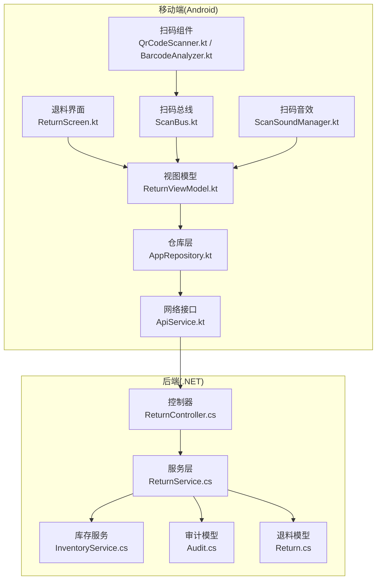
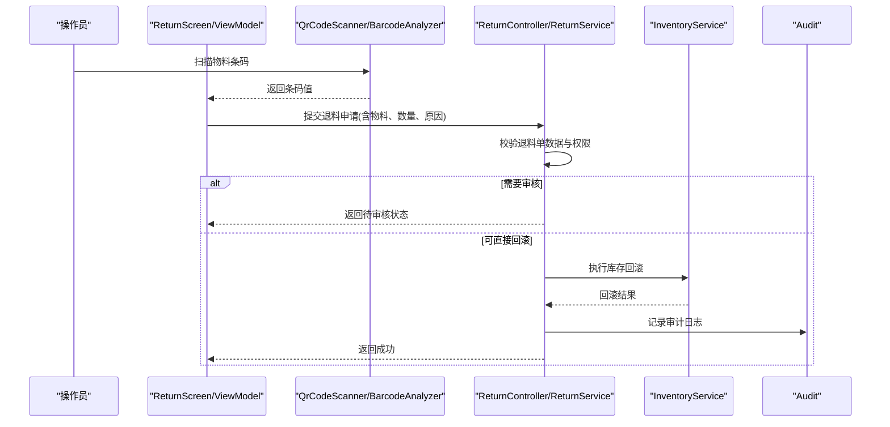
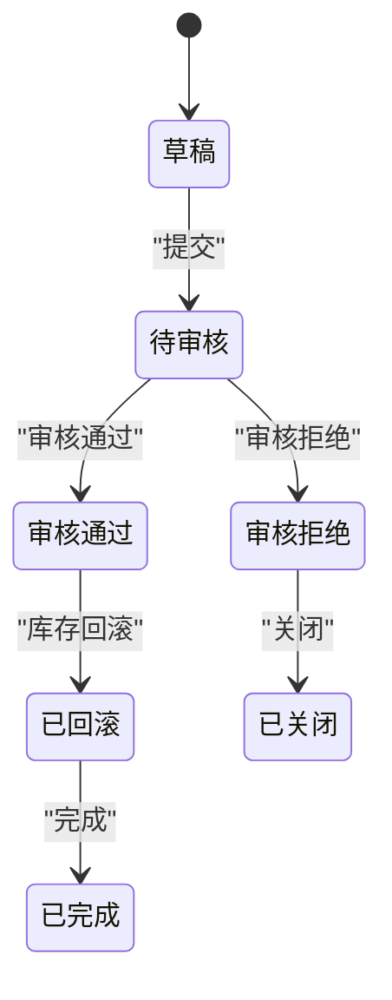
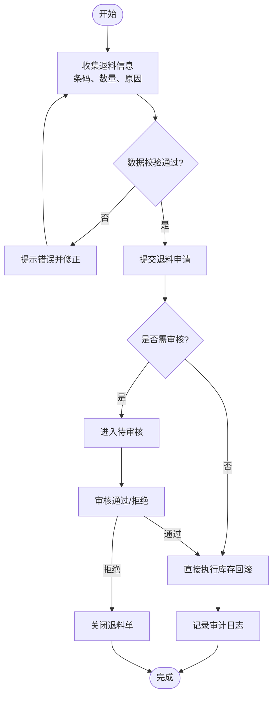
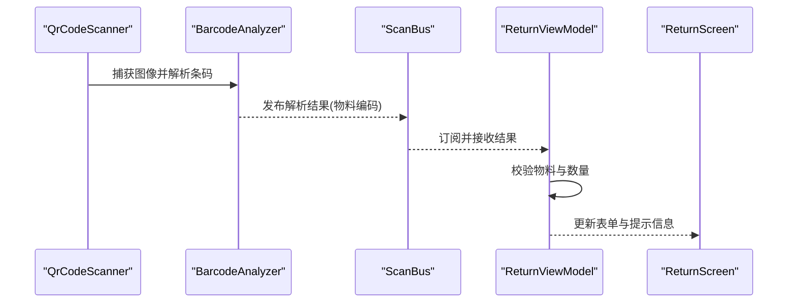
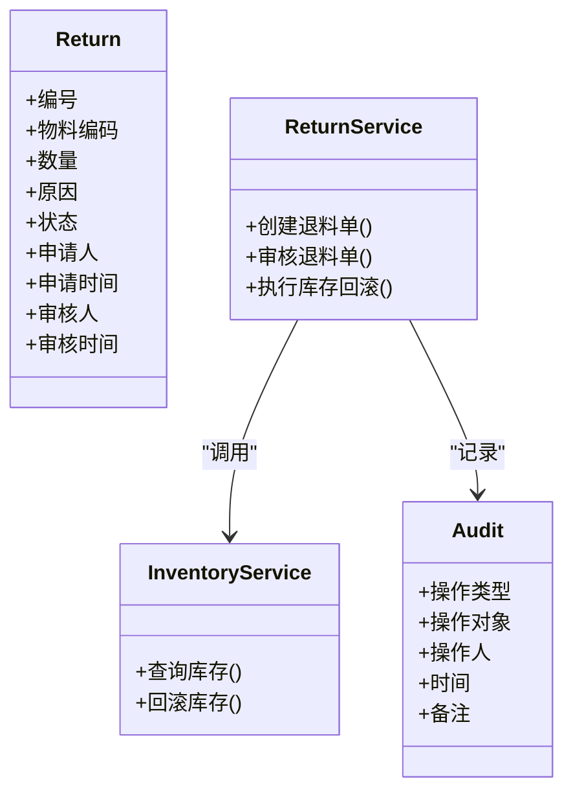
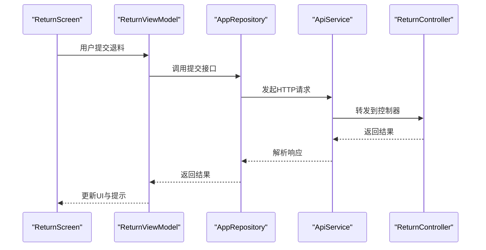
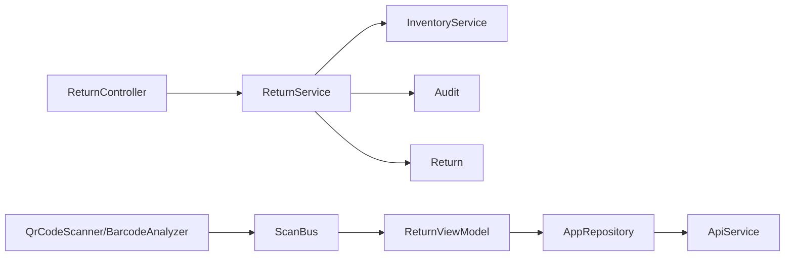

# 退料管理

<cite>
**本文引用的文件**   
- [ReturnController.cs](file://dip-system/api/Controllers/ReturnController.cs)
- [ReturnService.cs](file://dip-system/api/Services/ReturnService.cs)
- [Return.cs](file://dip-system/api/Models/Return.cs)
- [InventoryService.cs](file://dip-system/api/Services/InventoryService.cs)
- [Audit.cs](file://dip-system/api/Models/Audit.cs)
- [ApiService.kt](file://mobile-android/app/src/main/java/com/dip/material/data/network/ApiService.kt)
- [AppRepository.kt](file://mobile-android/app/src/main/java/com/dip/material/data/repository/AppRepository.kt)
- [ReturnScreen.kt](file://mobile-android/app/src/main/java/com/dip/material/ui/return_/ReturnScreen.kt)
- [ReturnViewModel.kt](file://mobile-android/app/src/main/java/com/dip/material/ui/return_/ReturnViewModel.kt)
- [BarcodeAnalyzer.kt](file://mobile-android/app/src/main/java/com/dip/material/ui/components/BarcodeAnalyzer.kt)
- [QrCodeScanner.kt](file://mobile-android/app/src/main/java/com/dip/material/ui/components/QrCodeScanner.kt)
- [ScanBus.kt](file://mobile-android/app/src/main/java/com/dip/material/utils/ScanBus.kt)
- [ScanSoundManager.kt](file://mobile-android/app/src/main/java/com/dip/material/utils/ScanSoundManager.kt)
</cite>

## 目录
1. [简介](#简介)
2. [项目结构](#项目结构)
3. [核心组件](#核心组件)
4. [架构总览](#架构总览)
5. [详细组件分析](#详细组件分析)
6. [依赖关系分析](#依赖关系分析)
7. [性能考虑](#性能考虑)
8. [故障排查指南](#故障排查指南)
9. [结论](#结论)
10. [附录](#附录)

## 简介
本文件面向DIP系统Android应用的“退料管理”功能，系统化阐述退料申请、审核机制与库存回滚的完整业务逻辑；定义退料单数据结构、状态流转与审批流程；说明退料扫描（条码识别）、物料确认、记录保存、审计日志与异常处理机制；并提供错误处理、数据验证与用户交互反馈的最佳实践。文档兼顾后端API与服务层、移动端UI与数据层，帮助开发者与实施人员快速理解并正确使用该功能。

## 项目结构
退料管理涉及前后端协同：
- 后端（ASP.NET Core）提供退料相关API、服务与数据模型，包含退料单实体、库存回滚与审计日志。
- 前端Web用于管理与审核操作。
- Android移动端负责现场退料扫描、物料确认、提交申请与结果反馈。

**图表来源** 
- [ReturnScreen.kt](file://mobile-android/app/src/main/java/com/dip/material/ui/return_/ReturnScreen.kt)
- [ReturnViewModel.kt](file://mobile-android/app/src/main/java/com/dip/material/ui/return_/ReturnViewModel.kt)
- [AppRepository.kt](file://mobile-android/app/src/main/java/com/dip/material/data/repository/AppRepository.kt)
- [ApiService.kt](file://mobile-android/app/src/main/java/com/dip/material/data/network/ApiService.kt)
- [QrCodeScanner.kt](file://mobile-android/app/src/main/java/com/dip/material/ui/components/QrCodeScanner.kt)
- [BarcodeAnalyzer.kt](file://mobile-android/app/src/main/java/com/dip/material/ui/components/BarcodeAnalyzer.kt)
- [ScanBus.kt](file://mobile-android/app/src/main/java/com/dip/material/utils/ScanBus.kt)
- [ScanSoundManager.kt](file://mobile-android/app/src/main/java/com/dip/material/utils/ScanSoundManager.kt)
- [ReturnController.cs](file://dip-system/api/Controllers/ReturnController.cs)
- [ReturnService.cs](file://dip-system/api/Services/ReturnService.cs)
- [InventoryService.cs](file://dip-system/api/Services/InventoryService.cs)
- [Audit.cs](file://dip-system/api/Models/Audit.cs)
- [Return.cs](file://dip-system/api/Models/Return.cs)

**章节来源**
- [ReturnController.cs](file://dip-system/api/Controllers/ReturnController.cs)
- [ReturnService.cs](file://dip-system/api/Services/ReturnService.cs)
- [Return.cs](file://dip-system/api/Models/Return.cs)
- [InventoryService.cs](file://dip-system/api/Services/InventoryService.cs)
- [Audit.cs](file://dip-system/api/Models/Audit.cs)
- [ApiService.kt](file://mobile-android/app/src/main/java/com/dip/material/data/network/ApiService.kt)
- [AppRepository.kt](file://mobile-android/app/src/main/java/com/dip/material/data/repository/AppRepository.kt)
- [ReturnScreen.kt](file://mobile-android/app/src/main/java/com/dip/material/ui/return_/ReturnScreen.kt)
- [ReturnViewModel.kt](file://mobile-android/app/src/main/java/com/dip/material/ui/return_/ReturnViewModel.kt)
- [BarcodeAnalyzer.kt](file://mobile-android/app/src/main/java/com/dip/material/ui/components/BarcodeAnalyzer.kt)
- [QrCodeScanner.kt](file://mobile-android/app/src/main/java/com/dip/material/ui/components/QrCodeScanner.kt)
- [ScanBus.kt](file://mobile-android/app/src/main/java/com/dip/material/utils/ScanBus.kt)
- [ScanSoundManager.kt](file://mobile-android/app/src/main/java/com/dip/material/utils/ScanSoundManager.kt)

## 核心组件
- 退料控制器（ReturnController）：暴露退料相关的HTTP接口，接收移动端提交的退料申请、查询与审核请求。
- 退料服务（ReturnService）：实现退料业务逻辑，包括退料单创建、校验、库存回滚、状态更新与审计记录。
- 库存服务（InventoryService）：提供库存查询与扣减/回滚能力，确保退料后库存一致性。
- 退料模型（Return）：定义退料单的数据结构与字段约束。
- 审计模型（Audit）：记录关键操作的审计日志，支持追溯。
- 移动端网络层（ApiService、AppRepository）：封装HTTP调用与本地缓存/重试策略。
- 移动端UI（ReturnScreen、ReturnViewModel）：退料界面展示、扫码输入、表单校验、提交与反馈。
- 扫码组件（QrCodeScanner、BarcodeAnalyzer、ScanBus、ScanSoundManager）：摄像头扫码、条码解析、事件总线与提示音。

**章节来源**
- [ReturnController.cs](file://dip-system/api/Controllers/ReturnController.cs)
- [ReturnService.cs](file://dip-system/api/Services/ReturnService.cs)
- [InventoryService.cs](file://dip-system/api/Services/InventoryService.cs)
- [Return.cs](file://dip-system/api/Models/Return.cs)
- [Audit.cs](file://dip-system/api/Models/Audit.cs)
- [ApiService.kt](file://mobile-android/app/src/main/java/com/dip/material/data/network/ApiService.kt)
- [AppRepository.kt](file://mobile-android/app/src/main/java/com/dip/material/data/repository/AppRepository.kt)
- [ReturnScreen.kt](file://mobile-android/app/src/main/java/com/dip/material/ui/return_/ReturnScreen.kt)
- [ReturnViewModel.kt](file://mobile-android/app/src/main/java/com/dip/material/ui/return_/ReturnViewModel.kt)
- [QrCodeScanner.kt](file://mobile-android/app/src/main/java/com/dip/material/ui/components/QrCodeScanner.kt)
- [BarcodeAnalyzer.kt](file://mobile-android/app/src/main/java/com/dip/material/ui/components/BarcodeAnalyzer.kt)
- [ScanBus.kt](file://mobile-android/app/src/main/java/com/dip/material/utils/ScanBus.kt)
- [ScanSoundManager.kt](file://mobile-android/app/src/main/java/com/dip/material/utils/ScanSoundManager.kt)

## 架构总览
退料管理的端到端流程如下：
- 移动端通过扫码获取物料条码，进行物料确认与数量校验。
- 提交退料申请至后端控制器，服务层执行退料单创建与校验。
- 若为已审核通过的退料单，则触发库存回滚；否则进入待审核状态。
- 审核通过后，库存正式回滚并写入审计日志。
- 移动端实时获取操作结果并给出用户反馈。

**图表来源** 
- [ReturnScreen.kt](file://mobile-android/app/src/main/java/com/dip/material/ui/return_/ReturnScreen.kt)
- [ReturnViewModel.kt](file://mobile-android/app/src/main/java/com/dip/material/ui/return_/ReturnViewModel.kt)
- [QrCodeScanner.kt](file://mobile-android/app/src/main/java/com/dip/material/ui/components/QrCodeScanner.kt)
- [BarcodeAnalyzer.kt](file://mobile-android/app/src/main/java/com/dip/material/ui/components/BarcodeAnalyzer.kt)
- [ReturnController.cs](file://dip-system/api/Controllers/ReturnController.cs)
- [ReturnService.cs](file://dip-system/api/Services/ReturnService.cs)
- [InventoryService.cs](file://dip-system/api/Services/InventoryService.cs)
- [Audit.cs](file://dip-system/api/Models/Audit.cs)

## 详细组件分析

### 退料单数据结构与状态流转
- 退料单（Return）字段建议包含：
  - 编号、关联订单/工单、物料编码、名称、批次、数量、单位、退料原因、申请人、申请时间、审核人、审核时间、状态等。
- 状态流转：
  - 草稿/待提交 → 待审核 → 审核通过 → 已回滚 → 已完成
  - 草稿/待提交 → 审核拒绝 → 已关闭
- 规则要点：
  - 退料数量不得大于可用库存或原出库数量。
  - 同一物料在同一退料单中应去重合并。
  - 审核通过后才能执行库存回滚。

**图表来源** 
- [Return.cs](file://dip-system/api/Models/Return.cs)
- [ReturnService.cs](file://dip-system/api/Services/ReturnService.cs)

**章节来源**
- [Return.cs](file://dip-system/api/Models/Return.cs)
- [ReturnService.cs](file://dip-system/api/Services/ReturnService.cs)

### 退料申请与审核流程
- 申请：
  - 移动端收集条码、数量、原因等信息，提交至后端。
  - 后端校验必填项、数量合法性、权限与业务规则。
- 审核：
  - 管理员在Web端查看退料单并进行审核。
  - 审核通过后，后端触发库存回滚并记录审计日志。
- 结果反馈：
  - 移动端显示审核结果与库存回滚状态。

**图表来源** 
- [ReturnController.cs](file://dip-system/api/Controllers/ReturnController.cs)
- [ReturnService.cs](file://dip-system/api/Services/ReturnService.cs)
- [InventoryService.cs](file://dip-system/api/Services/InventoryService.cs)
- [Audit.cs](file://dip-system/api/Models/Audit.cs)

**章节来源**
- [ReturnController.cs](file://dip-system/api/Controllers/ReturnController.cs)
- [ReturnService.cs](file://dip-system/api/Services/ReturnService.cs)
- [InventoryService.cs](file://dip-system/api/Services/InventoryService.cs)
- [Audit.cs](file://dip-system/api/Models/Audit.cs)

### 退料扫描与条码识别
- 扫码流程：
  - 使用摄像头扫描条码/二维码，解析出物料编码。
  - 将解析结果推送至视图模型，自动填充物料信息与数量。
- 物料确认：
  - 界面展示物料详情，允许人工核对与修改数量。
  - 对重复扫描进行去重与合并。
- 提示与反馈：
  - 扫码成功播放提示音，失败给出明确错误提示。

**图表来源** 
- [QrCodeScanner.kt](file://mobile-android/app/src/main/java/com/dip/material/ui/components/QrCodeScanner.kt)
- [BarcodeAnalyzer.kt](file://mobile-android/app/src/main/java/com/dip/material/ui/components/BarcodeAnalyzer.kt)
- [ScanBus.kt](file://mobile-android/app/src/main/java/com/dip/material/utils/ScanBus.kt)
- [ReturnViewModel.kt](file://mobile-android/app/src/main/java/com/dip/material/ui/return_/ReturnViewModel.kt)
- [ReturnScreen.kt](file://mobile-android/app/src/main/java/com/dip/material/ui/return_/ReturnScreen.kt)

**章节来源**
- [QrCodeScanner.kt](file://mobile-android/app/src/main/java/com/dip/material/ui/components/QrCodeScanner.kt)
- [BarcodeAnalyzer.kt](file://mobile-android/app/src/main/java/com/dip/material/ui/components/BarcodeAnalyzer.kt)
- [ScanBus.kt](file://mobile-android/app/src/main/java/com/dip/material/utils/ScanBus.kt)
- [ReturnViewModel.kt](file://mobile-android/app/src/main/java/com/dip/material/ui/return_/ReturnViewModel.kt)
- [ReturnScreen.kt](file://mobile-android/app/src/main/java/com/dip/material/ui/return_/ReturnScreen.kt)

### 库存回滚与审计日志
- 库存回滚：
  - 审核通过后，根据退料单明细逐项回滚库存。
  - 回滚前校验可用库存与批次匹配性，避免负库存。
- 审计日志：
  - 每次退料申请、审核、回滚均记录审计日志，包含操作人、时间、前后库存快照等。
- 事务与一致性：
  - 回滚与审计写入应在同一事务中，保证数据一致性。

**图表来源** 
- [Return.cs](file://dip-system/api/Models/Return.cs)
- [InventoryService.cs](file://dip-system/api/Services/InventoryService.cs)
- [Audit.cs](file://dip-system/api/Models/Audit.cs)
- [ReturnService.cs](file://dip-system/api/Services/ReturnService.cs)

**章节来源**
- [Return.cs](file://dip-system/api/Models/Return.cs)
- [InventoryService.cs](file://dip-system/api/Services/InventoryService.cs)
- [Audit.cs](file://dip-system/api/Models/Audit.cs)
- [ReturnService.cs](file://dip-system/api/Services/ReturnService.cs)

### 移动端数据层与网络调用
- 网络接口（ApiService）：
  - 定义退料申请、查询、审核等API方法。
- 仓库层（AppRepository）：
  - 封装网络调用、错误处理、重试与缓存策略。
- 视图模型（ReturnViewModel）：
  - 管理退料表单状态、扫码结果、提交与结果回调。

**图表来源** 
- [ReturnScreen.kt](file://mobile-android/app/src/main/java/com/dip/material/ui/return_/ReturnScreen.kt)
- [ReturnViewModel.kt](file://mobile-android/app/src/main/java/com/dip/material/ui/return_/ReturnViewModel.kt)
- [AppRepository.kt](file://mobile-android/app/src/main/java/com/dip/material/data/repository/AppRepository.kt)
- [ApiService.kt](file://mobile-android/app/src/main/java/com/dip/material/data/network/ApiService.kt)
- [ReturnController.cs](file://dip-system/api/Controllers/ReturnController.cs)

**章节来源**
- [ApiService.kt](file://mobile-android/app/src/main/java/com/dip/material/data/network/ApiService.kt)
- [AppRepository.kt](file://mobile-android/app/src/main/java/com/dip/material/data/repository/AppRepository.kt)
- [ReturnViewModel.kt](file://mobile-android/app/src/main/java/com/dip/material/ui/return_/ReturnViewModel.kt)
- [ReturnScreen.kt](file://mobile-android/app/src/main/java/com/dip/material/ui/return_/ReturnScreen.kt)
- [ReturnController.cs](file://dip-system/api/Controllers/ReturnController.cs)

## 依赖关系分析
- 控制器依赖服务层，服务层依赖库存服务与审计模型。
- 移动端视图模型依赖仓库层，仓库层依赖网络接口。
- 扫码组件通过事件总线与视图模型解耦。

**图表来源** 
- [ReturnController.cs](file://dip-system/api/Controllers/ReturnController.cs)
- [ReturnService.cs](file://dip-system/api/Services/ReturnService.cs)
- [InventoryService.cs](file://dip-system/api/Services/InventoryService.cs)
- [Audit.cs](file://dip-system/api/Models/Audit.cs)
- [Return.cs](file://dip-system/api/Models/Return.cs)
- [ReturnViewModel.kt](file://mobile-android/app/src/main/java/com/dip/material/ui/return_/ReturnViewModel.kt)
- [AppRepository.kt](file://mobile-android/app/src/main/java/com/dip/material/data/repository/AppRepository.kt)
- [ApiService.kt](file://mobile-android/app/src/main/java/com/dip/material/data/network/ApiService.kt)
- [QrCodeScanner.kt](file://mobile-android/app/src/main/java/com/dip/material/ui/components/QrCodeScanner.kt)
- [BarcodeAnalyzer.kt](file://mobile-android/app/src/main/java/com/dip/material/ui/components/BarcodeAnalyzer.kt)
- [ScanBus.kt](file://mobile-android/app/src/main/java/com/dip/material/utils/ScanBus.kt)

**章节来源**
- [ReturnController.cs](file://dip-system/api/Controllers/ReturnController.cs)
- [ReturnService.cs](file://dip-system/api/Services/ReturnService.cs)
- [InventoryService.cs](file://dip-system/api/Services/InventoryService.cs)
- [Audit.cs](file://dip-system/api/Models/Audit.cs)
- [Return.cs](file://dip-system/api/Models/Return.cs)
- [ReturnViewModel.kt](file://mobile-android/app/src/main/java/com/dip/material/ui/return_/ReturnViewModel.kt)
- [AppRepository.kt](file://mobile-android/app/src/main/java/com/dip/material/data/repository/AppRepository.kt)
- [ApiService.kt](file://mobile-android/app/src/main/java/com/dip/material/data/network/ApiService.kt)
- [QrCodeScanner.kt](file://mobile-android/app/src/main/java/com/dip/material/ui/components/QrCodeScanner.kt)
- [BarcodeAnalyzer.kt](file://mobile-android/app/src/main/java/com/dip/material/ui/components/BarcodeAnalyzer.kt)
- [ScanBus.kt](file://mobile-android/app/src/main/java/com/dip/material/utils/ScanBus.kt)

## 性能考虑
- 批量提交：对于多物料退料，建议在后端采用批量处理减少往返次数。
- 并发控制：审核与回滚操作需加锁或版本控制，避免并发冲突。
- 缓存策略：物料主数据与库存快照可短期缓存，提升扫码确认速度。
- 异步处理：耗时操作（如库存回滚、审计写入）可异步化，提高响应性。
- 网络优化：启用连接复用、压缩与合理超时设置。

[本节为通用指导，不直接分析具体文件]

## 故障排查指南
- 扫码失败：
  - 检查摄像头权限与环境光线；确认条码格式与解析器配置。
  - 监听扫码总线事件，定位解析失败原因。
- 提交失败：
  - 检查网络连通性与鉴权令牌；查看后端返回的错误码与消息。
  - 校验必填字段与数量范围，确保业务规则通过。
- 库存回滚异常：
  - 核查可用库存与批次匹配；检查事务是否回滚。
  - 查看审计日志定位问题时间点与操作人。
- 审核流程卡住：
  - 确认审核权限与状态机流转；检查是否有未完成的依赖任务。

**章节来源**
- [ReturnService.cs](file://dip-system/api/Services/ReturnService.cs)
- [InventoryService.cs](file://dip-system/api/Services/InventoryService.cs)
- [Audit.cs](file://dip-system/api/Models/Audit.cs)
- [ReturnViewModel.kt](file://mobile-android/app/src/main/java/com/dip/material/ui/return_/ReturnViewModel.kt)
- [ScanBus.kt](file://mobile-android/app/src/main/java/com/dip/material/utils/ScanBus.kt)
- [ScanSoundManager.kt](file://mobile-android/app/src/main/java/com/dip/material/utils/ScanSoundManager.kt)

## 结论
退料管理功能通过清晰的职责划分与严谨的状态机设计，实现了从扫码、申请、审核到库存回滚与审计的全链路闭环。移动端与后端协作紧密，扫码与提示增强用户体验，审计日志保障可追溯性。建议在后续迭代中加强批量处理、并发控制与缓存优化，以提升整体性能与稳定性。

[本节为总结性内容，不直接分析具体文件]

## 附录
- 最佳实践建议：
  - 统一错误码与消息规范，便于前端友好提示。
  - 引入单元测试与集成测试覆盖关键路径。
  - 定期审查审计日志，发现异常操作与风险点。
  - 对扫码模块进行多场景测试，确保鲁棒性。

[本节为补充建议，不直接分析具体文件]