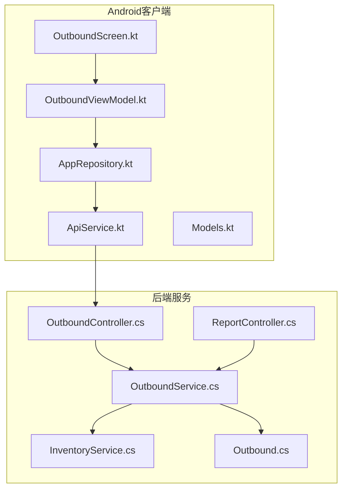
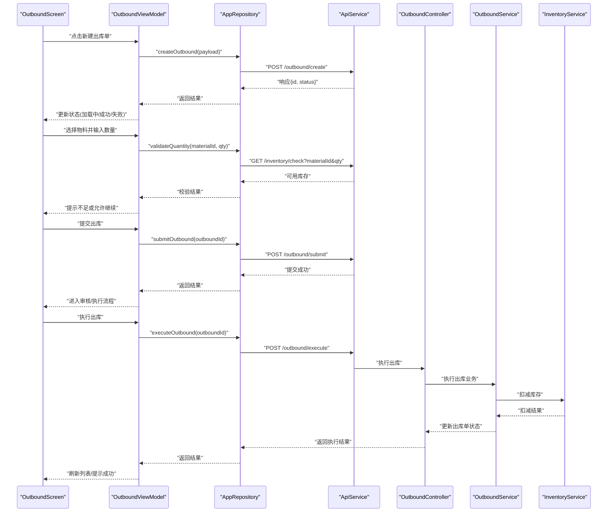
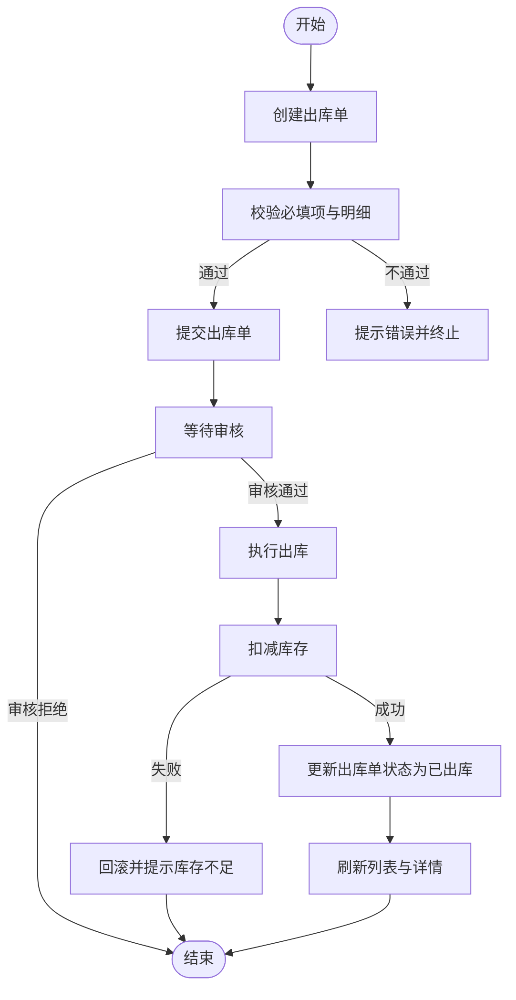
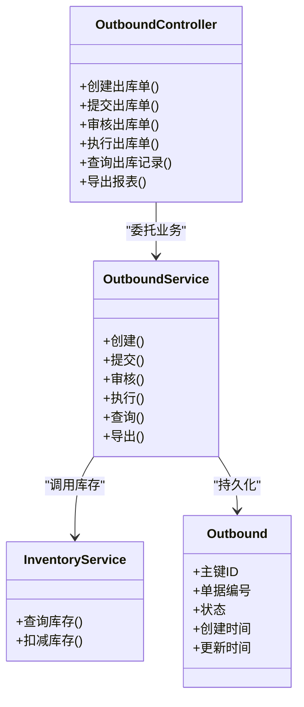
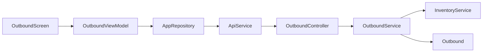

# 出库管理功能

<cite>
**本文引用的文件**   
- [OutboundScreen.kt](file://mobile-android/app/src/main/java/com/dip/material/ui/outbound/OutboundScreen.kt)
- [OutboundViewModel.kt](file://mobile-android/app/src/main/java/com/dip/material/ui/outbound/OutboundViewModel.kt)
- [ApiService.kt](file://mobile-android/app/src/main/java/com/dip/material/data/network/ApiService.kt)
- [AppRepository.kt](file://mobile-android/app/src/main/java/com/dip/material/data/repository/AppRepository.kt)
- [Models.kt](file://mobile-android/app/src/main/java/com/dip/material/data/models/Models.kt)
- [OutboundController.cs](file://dip-system/api/Controllers/OutboundController.cs)
- [OutboundService.cs](file://dip-system/api/Services/OutboundService.cs)
- [Outbound.cs](file://dip-system/api/Models/Outbound.cs)
- [InventoryService.cs](file://dip-system/api/Services/InventoryService.cs)
- [ReportController.cs](file://dip-system/api/Controllers/ReportController.cs)
</cite>

## 目录
1. [简介](#简介)
2. [项目结构](#项目结构)
3. [核心组件](#核心组件)
4. [架构总览](#架构总览)
5. [详细组件分析](#详细组件分析)
6. [依赖关系分析](#依赖关系分析)
7. [性能考虑](#性能考虑)
8. [故障排查指南](#故障排查指南)
9. [结论](#结论)
10. [附录](#附录)

## 简介
本文件面向DIP系统Android应用的“出库管理”功能，聚焦OutboundScreen界面的出库单管理、物料选择与数量确认，以及OutboundViewModel的业务逻辑（出库流程控制、库存扣减、状态同步）。文档同时覆盖出库单的创建、审核、执行全流程，以及出库记录查询、历史追溯与报表生成能力。最后给出异常处理策略、数据一致性保障与性能优化建议，并提供实际使用场景的参考路径。

## 项目结构
出库管理在Android端位于ui/outbound包，包含界面与视图模型；数据层通过repository与network模块访问后端API；后端由ASP.NET Core提供控制器与服务，数据库模型定义在Models中。

图表来源
- [OutboundScreen.kt](file://mobile-android/app/src/main/java/com/dip/material/ui/outbound/OutboundScreen.kt)
- [OutboundViewModel.kt](file://mobile-android/app/src/main/java/com/dip/material/ui/outbound/OutboundViewModel.kt)
- [AppRepository.kt](file://mobile-android/app/src/main/java/com/dip/material/data/repository/AppRepository.kt)
- [ApiService.kt](file://mobile-android/app/src/main/java/com/dip/material/data/network/ApiService.kt)
- [Models.kt](file://mobile-android/app/src/main/java/com/dip/material/data/models/Models.kt)
- [OutboundController.cs](file://dip-system/api/Controllers/OutboundController.cs)
- [OutboundService.cs](file://dip-system/api/Services/OutboundService.cs)
- [InventoryService.cs](file://dip-system/api/Services/InventoryService.cs)
- [ReportController.cs](file://dip-system/api/Controllers/ReportController.cs)
- [Outbound.cs](file://dip-system/api/Models/Outbound.cs)

章节来源
- [OutboundScreen.kt](file://mobile-android/app/src/main/java/com/dip/material/ui/outbound/OutboundScreen.kt)
- [OutboundViewModel.kt](file://mobile-android/app/src/main/java/com/dip/material/ui/outbound/OutboundViewModel.kt)
- [ApiService.kt](file://mobile-android/app/src/main/java/com/dip/material/data/network/ApiService.kt)
- [AppRepository.kt](file://mobile-android/app/src/main/java/com/dip/material/data/repository/AppRepository.kt)
- [Models.kt](file://mobile-android/app/src/main/java/com/dip/material/data/models/Models.kt)
- [OutboundController.cs](file://dip-system/api/Controllers/OutboundController.cs)
- [OutboundService.cs](file://dip-system/api/Services/OutboundService.cs)
- [InventoryService.cs](file://dip-system/api/Services/InventoryService.cs)
- [ReportController.cs](file://dip-system/api/Controllers/ReportController.cs)
- [Outbound.cs](file://dip-system/api/Models/Outbound.cs)

## 核心组件
- OutboundScreen：负责出库单列表展示、新建出库单、选择物料、输入数量、提交出库等UI交互与状态显示。
- OutboundViewModel：封装出库业务逻辑，协调仓库操作、调用API、维护本地状态（如加载态、错误信息、成功提示），并驱动界面刷新。
- AppRepository：统一的数据访问入口，聚合网络请求与本地缓存（如有），为ViewModel提供方法。
- ApiService：Retrofit接口定义，声明出库相关REST API。
- Models：Kotlin数据模型，映射前后端数据结构。
- 后端OutboundController/OutboundService：实现出库单CRUD、审核、执行、库存扣减、审计日志等。
- InventoryService：负责库存查询与扣减原子性操作。
- ReportController：提供出库统计与报表导出接口。

章节来源
- [OutboundScreen.kt](file://mobile-android/app/src/main/java/com/dip/material/ui/outbound/OutboundScreen.kt)
- [OutboundViewModel.kt](file://mobile-android/app/src/main/java/com/dip/material/ui/outbound/OutboundViewModel.kt)
- [AppRepository.kt](file://mobile-android/app/src/main/java/com/dip/material/data/repository/AppRepository.kt)
- [ApiService.kt](file://mobile-android/app/src/main/java/com/dip/material/data/network/ApiService.kt)
- [Models.kt](file://mobile-android/app/src/main/java/com/dip/material/data/models/Models.kt)
- [OutboundController.cs](file://dip-system/api/Controllers/OutboundController.cs)
- [OutboundService.cs](file://dip-system/api/Services/OutboundService.cs)
- [InventoryService.cs](file://dip-system/api/Services/InventoryService.cs)
- [ReportController.cs](file://dip-system/api/Controllers/ReportController.cs)

## 架构总览
出库管理采用典型的MVVM + Repository模式，Android端通过ViewModel与Repository解耦UI与数据源，Repository调用Retrofit接口与后端通信。后端以Controller暴露REST API，Service层实现业务编排与事务控制，确保库存扣减与出库单状态变更的一致性。

图表来源
- [OutboundScreen.kt](file://mobile-android/app/src/main/java/com/dip/material/ui/outbound/OutboundScreen.kt)
- [OutboundViewModel.kt](file://mobile-android/app/src/main/java/com/dip/material/ui/outbound/OutboundViewModel.kt)
- [AppRepository.kt](file://mobile-android/app/src/main/java/com/dip/material/data/repository/AppRepository.kt)
- [ApiService.kt](file://mobile-android/app/src/main/java/com/dip/material/data/network/ApiService.kt)
- [OutboundController.cs](file://dip-system/api/Controllers/OutboundController.cs)
- [OutboundService.cs](file://dip-system/api/Services/OutboundService.cs)
- [InventoryService.cs](file://dip-system/api/Services/InventoryService.cs)

## 详细组件分析

### OutboundScreen界面分析
- 出库单列表：展示单据编号、状态、创建时间、操作按钮（查看、编辑、提交、执行）。
- 新建出库单：打开表单，支持扫码或手动输入物料条码，自动填充物料名称与规格。
- 物料选择与数量确认：支持多行明细，实时校验库存可用性，限制最大可出数量。
- 提交与执行：根据当前状态启用不同操作，提交后进入审核流程，审核后进入执行流程。
- 错误与提示：网络异常、库存不足、权限不足等错误提示与重试机制。

章节来源
- [OutboundScreen.kt](file://mobile-android/app/src/main/java/com/dip/material/ui/outbound/OutboundScreen.kt)

### OutboundViewModel业务逻辑分析
- 状态管理：维护loading、error、success、currentOutbound、detailList等状态。
- 出库流程控制：
  - 创建：构造出库单主表与明细，调用后端创建接口。
  - 提交：校验必填字段与明细完整性，调用提交接口，状态变更为待审核。
  - 审核：仅具备审核权限的用户可执行，通过后状态变更为已审核。
  - 执行：调用执行接口，触发库存扣减与出库单状态更新。
- 库存扣减：在执行阶段调用库存服务进行原子扣减，失败回滚并提示。
- 状态同步：每次操作成功后刷新列表与详情，保证UI与后端一致。
- 异常处理：捕获网络异常、参数校验失败、业务异常，转换为用户可读消息。

图表来源
- [OutboundViewModel.kt](file://mobile-android/app/src/main/java/com/dip/material/ui/outbound/OutboundViewModel.kt)
- [AppRepository.kt](file://mobile-android/app/src/main/java/com/dip/material/data/repository/AppRepository.kt)
- [ApiService.kt](file://mobile-android/app/src/main/java/com/dip/material/data/network/ApiService.kt)
- [OutboundController.cs](file://dip-system/api/Controllers/OutboundController.cs)
- [OutboundService.cs](file://dip-system/api/Services/OutboundService.cs)
- [InventoryService.cs](file://dip-system/api/Services/InventoryService.cs)

章节来源
- [OutboundViewModel.kt](file://mobile-android/app/src/main/java/com/dip/material/ui/outbound/OutboundViewModel.kt)

### 数据模型与接口契约
- Android端Models：定义出库单主表与明细的Kotlin数据类，便于序列化与反序列化。
- 后端Outbound模型：定义数据库实体与DTO，用于控制器与服务间传递。
- ApiService：声明出库相关的REST接口，包括创建、提交、审核、执行、查询、报表导出等。

章节来源
- [Models.kt](file://mobile-android/app/src/main/java/com/dip/material/data/models/Models.kt)
- [Outbound.cs](file://dip-system/api/Models/Outbound.cs)
- [ApiService.kt](file://mobile-android/app/src/main/java/com/dip/material/data/network/ApiService.kt)

### 后端出库服务与库存扣减
- OutboundController：接收前端请求，参数校验后委托OutboundService处理。
- OutboundService：编排出库流程，包括创建、提交、审核、执行；在执行阶段调用InventoryService进行库存扣减，并使用事务保证一致性。
- InventoryService：提供库存查询与扣减方法，确保并发安全与数据一致性。

图表来源
- [OutboundController.cs](file://dip-system/api/Controllers/OutboundController.cs)
- [OutboundService.cs](file://dip-system/api/Services/OutboundService.cs)
- [InventoryService.cs](file://dip-system/api/Services/InventoryService.cs)
- [Outbound.cs](file://dip-system/api/Models/Outbound.cs)

章节来源
- [OutboundController.cs](file://dip-system/api/Controllers/OutboundController.cs)
- [OutboundService.cs](file://dip-system/api/Services/OutboundService.cs)
- [InventoryService.cs](file://dip-system/api/Services/InventoryService.cs)
- [Outbound.cs](file://dip-system/api/Models/Outbound.cs)

### 出库记录查询、历史追溯与报表生成
- 查询：支持按单据编号、物料、时间范围、状态筛选，分页返回。
- 历史追溯：记录每个状态的变更时间与操作人，支持审计追踪。
- 报表生成：按时间段、仓库、物料类别汇总出库数量与金额，支持导出Excel/PDF。

章节来源
- [OutboundController.cs](file://dip-system/api/Controllers/OutboundController.cs)
- [ReportController.cs](file://dip-system/api/Controllers/ReportController.cs)

## 依赖关系分析
- Android端：
  - OutboundScreen依赖OutboundViewModel进行状态管理与业务调用。
  - OutboundViewModel依赖AppRepository进行数据访问。
  - AppRepository依赖ApiService进行HTTP请求。
- 后端：
  - OutboundController依赖OutboundService进行业务编排。
  - OutboundService依赖InventoryService进行库存操作。
  - 所有数据持久化依赖数据库（通过Entity/DTO映射）。

图表来源
- [OutboundScreen.kt](file://mobile-android/app/src/main/java/com/dip/material/ui/outbound/OutboundScreen.kt)
- [OutboundViewModel.kt](file://mobile-android/app/src/main/java/com/dip/material/ui/outbound/OutboundViewModel.kt)
- [AppRepository.kt](file://mobile-android/app/src/main/java/com/dip/material/data/repository/AppRepository.kt)
- [ApiService.kt](file://mobile-android/app/src/main/java/com/dip/material/data/network/ApiService.kt)
- [OutboundController.cs](file://dip-system/api/Controllers/OutboundController.cs)
- [OutboundService.cs](file://dip-system/api/Services/OutboundService.cs)
- [InventoryService.cs](file://dip-system/api/Services/InventoryService.cs)
- [Outbound.cs](file://dip-system/api/Models/Outbound.cs)

章节来源
- [OutboundScreen.kt](file://mobile-android/app/src/main/java/com/dip/material/ui/outbound/OutboundScreen.kt)
- [OutboundViewModel.kt](file://mobile-android/app/src/main/java/com/dip/material/ui/outbound/OutboundViewModel.kt)
- [AppRepository.kt](file://mobile-android/app/src/main/java/com/dip/material/data/repository/AppRepository.kt)
- [ApiService.kt](file://mobile-android/app/src/main/java/com/dip/material/data/network/ApiService.kt)
- [OutboundController.cs](file://dip-system/api/Controllers/OutboundController.cs)
- [OutboundService.cs](file://dip-system/api/Services/OutboundService.cs)
- [InventoryService.cs](file://dip-system/api/Services/InventoryService.cs)
- [Outbound.cs](file://dip-system/api/Models/Outbound.cs)

## 性能考虑
- 前端：
  - 列表分页与懒加载，避免一次性加载大量数据。
  - 防抖与节流：搜索与扫码输入时减少重复请求。
  - 本地缓存：对常用字典与物料信息进行缓存，降低网络开销。
- 后端：
  - 数据库索引：对常用查询字段（单据编号、物料ID、时间）建立索引。
  - 事务边界：将库存扣减与状态更新置于同一事务，避免部分成功。
  - 异步处理：报表导出采用异步任务，避免阻塞主线程。
  - 连接池与超时：合理配置HTTP连接池与数据库连接池，设置合理的超时与重试策略。

[本节为通用指导，不直接分析具体文件]

## 故障排查指南
- 常见问题：
  - 库存不足：检查InventoryService扣减逻辑与并发锁，确认库存快照是否一致。
  - 状态不一致：检查事务是否完整，是否存在未提交或回滚的情况。
  - 网络异常：检查ApiService接口定义与后端路由是否匹配，查看错误码与消息。
  - 权限问题：确认用户角色与操作权限，审核与执行需相应权限。
- 调试建议：
  - 开启日志：在ViewModel与Repository层打印关键步骤与参数。
  - 抓包工具：使用Charles/Fiddler抓取HTTP请求与响应，定位接口问题。
  - 后端日志：查看OutboundService与InventoryService的异常堆栈与事务日志。

章节来源
- [OutboundViewModel.kt](file://mobile-android/app/src/main/java/com/dip/material/ui/outbound/OutboundViewModel.kt)
- [AppRepository.kt](file://mobile-android/app/src/main/java/com/dip/material/data/repository/AppRepository.kt)
- [ApiService.kt](file://mobile-android/app/src/main/java/com/dip/material/data/network/ApiService.kt)
- [OutboundService.cs](file://dip-system/api/Services/OutboundService.cs)
- [InventoryService.cs](file://dip-system/api/Services/InventoryService.cs)

## 结论
出库管理功能通过清晰的MVVM架构与后端服务编排，实现了从创建、审核到执行的完整流程，结合库存服务的原子扣减与事务控制，保障了数据一致性与业务可靠性。通过分页、缓存、异步导出等优化手段，提升了用户体验与系统性能。建议在后续迭代中加强审计日志与异常监控，进一步提升可观测性与可维护性。

[本节为总结，不直接分析具体文件]

## 附录
- 实际使用场景参考路径：
  - 新建出库单：参见OutboundViewModel中的创建方法与AppRepository的对应接口调用。
  - 物料选择与数量确认：参见OutboundScreen的输入校验与OutboundViewModel的库存校验逻辑。
  - 提交与执行：参见OutboundViewModel的提交与执行方法，以及后端OutboundController/OutboundService的执行流程。
  - 查询与报表：参见ApiService的查询接口与ReportController的报表导出接口。

章节来源
- [OutboundViewModel.kt](file://mobile-android/app/src/main/java/com/dip/material/ui/outbound/OutboundViewModel.kt)
- [OutboundScreen.kt](file://mobile-android/app/src/main/java/com/dip/material/ui/outbound/OutboundScreen.kt)
- [ApiService.kt](file://mobile-android/app/src/main/java/com/dip/material/data/network/ApiService.kt)
- [OutboundController.cs](file://dip-system/api/Controllers/OutboundController.cs)
- [ReportController.cs](file://dip-system/api/Controllers/ReportController.cs)