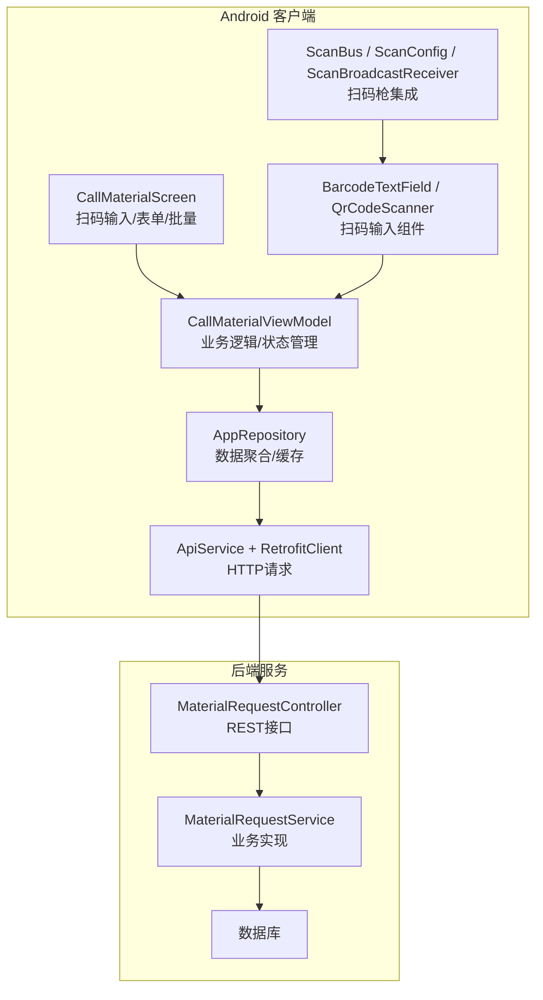
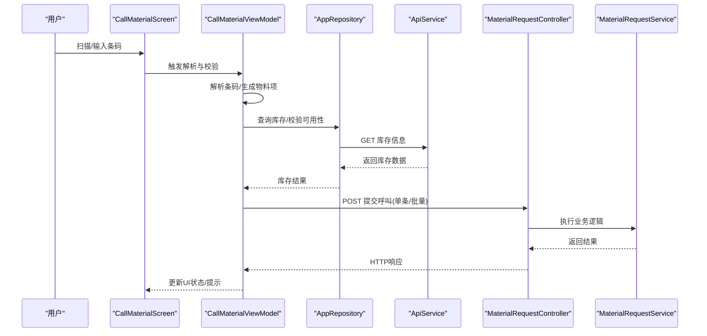
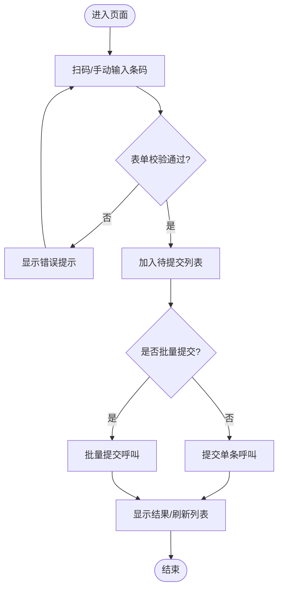
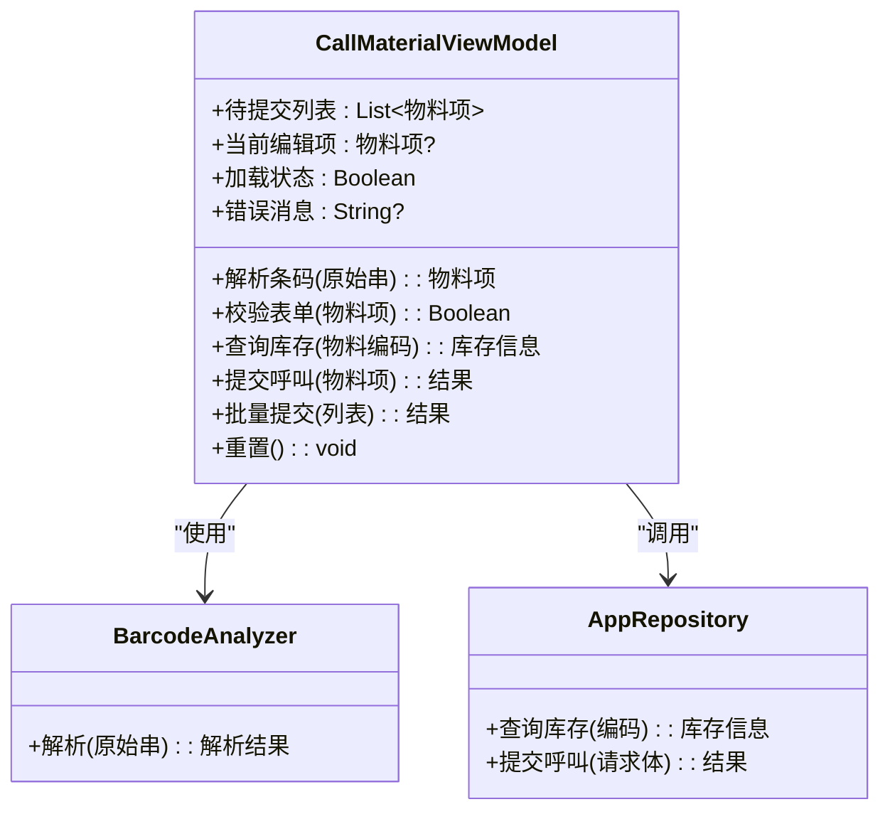
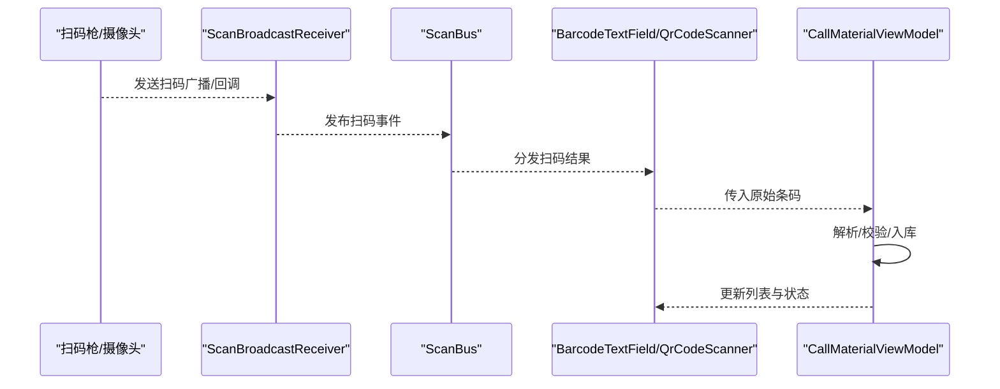
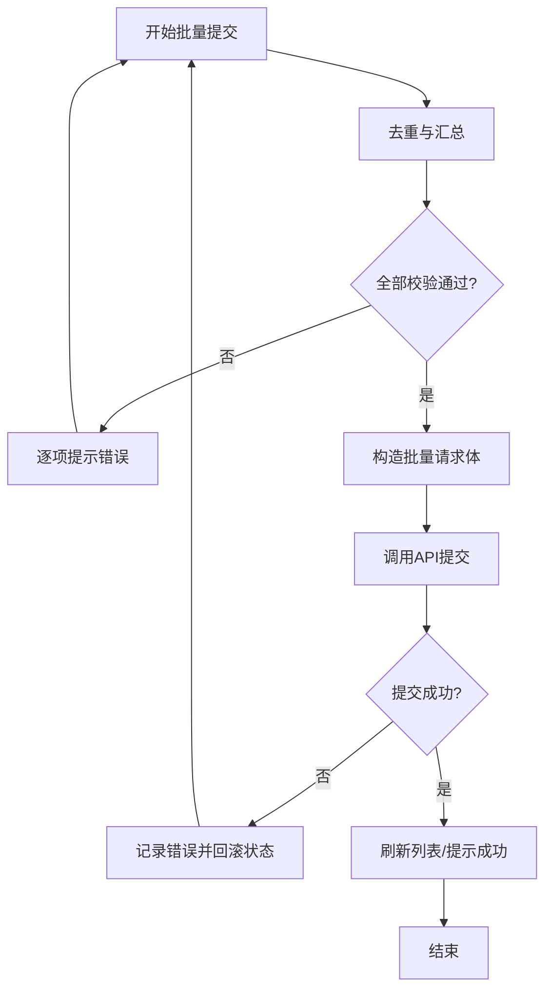
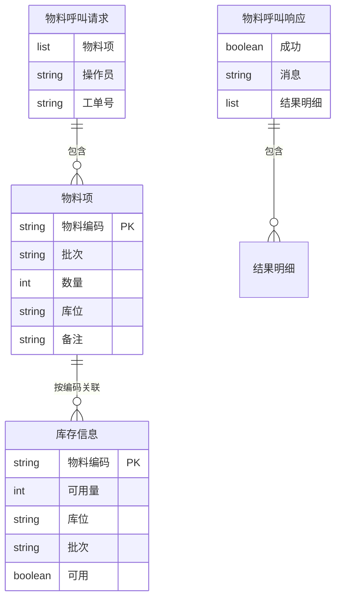
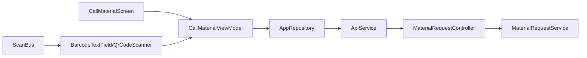

# 物料呼叫功能

<cite>
**本文档引用的文件**   
- [CallMaterialScreen.kt](file://mobile-android/app/src/main/java/com/dip/material/ui/callmaterial/CallMaterialScreen.kt)
- [CallMaterialViewModel.kt](file://mobile-android/app/src/main/java/com/dip/material/ui/callmaterial/CallMaterialViewModel.kt)
- [ApiService.kt](file://mobile-android/app/src/main/java/com/dip/material/data/network/ApiService.kt)
- [RetrofitClient.kt](file://mobile-android/app/src/main/java/com/dip/material/data/network/RetrofitClient.kt)
- [AppRepository.kt](file://mobile-android/app/src/main/java/com/dip/material/data/repository/AppRepository.kt)
- [Models.kt](file://mobile-android/app/src/main/java/com/dip/material/data/models/Models.kt)
- [BarcodeAnalyzer.kt](file://mobile-android/app/src/main/java/com/dip/material/ui/components/BarcodeAnalyzer.kt)
- [BarcodeTextField.kt](file://mobile-android/app/src/main/java/com/dip/material/ui/components/BarcodeTextField.kt)
- [QrCodeScanner.kt](file://mobile-android/app/src/main/java/com/dip/material/ui/components/QrCodeScanner.kt)
- [ScanBroadcastReceiver.kt](file://mobile-android/app/src/main/java/com/dip/material/utils/ScanBroadcastReceiver.kt)
- [ScanBus.kt](file://mobile-android/app/src/main/java/com/dip/material/utils/ScanBus.kt)
- [ScanConfig.kt](file://mobile-android/app/src/main/java/com/dip/material/utils/ScanConfig.kt)
- [ScanSoundManager.kt](file://mobile-android/app/src/main/java/com/dip/material/utils/ScanSoundManager.kt)
- [MaterialRequestController.cs](file://dip-system/api/Controllers/MaterialRequestController.cs)
- [MaterialRequestService.cs](file://dip-system/api/Services/MaterialRequestService.cs)
- [MaterialRequest.cs](file://dip-system/api/Models/MaterialRequest.cs)
</cite>

## 目录
1. [简介](#简介)
2. [项目结构](#项目结构)
3. [核心组件](#核心组件)
4. [架构总览](#架构总览)
5. [详细组件分析](#详细组件分析)
6. [依赖关系分析](#依赖关系分析)
7. [性能考虑](#性能考虑)
8. [故障排查指南](#故障排查指南)
9. [结论](#结论)
10. [附录](#附录)

## 简介
本文件面向DIP系统Android应用中的“物料呼叫”功能，聚焦于CallMaterialScreen界面的扫码输入、表单验证与批量操作，以及CallMaterialViewModel的业务逻辑（条码解析、库存检查、API调用流程）。文档同时覆盖扫码枪集成机制、实时数据更新、错误处理策略，并给出完整的业务流程、状态管理与用户交互设计说明。为便于不同技术背景的读者理解，文档采用由浅入深的层次化组织方式，并提供流程图与时序图辅助说明。

## 项目结构
物料呼叫功能在Android端位于ui/callmaterial包下，包含界面与视图模型；数据层通过repository与network模块访问后端API；扫码能力由ui/components与utils下的通用组件提供。后端对应MaterialRequest相关控制器与服务。

图表来源
- [CallMaterialScreen.kt](file://mobile-android/app/src/main/java/com/dip/material/ui/callmaterial/CallMaterialScreen.kt)
- [CallMaterialViewModel.kt](file://mobile-android/app/src/main/java/com/dip/material/ui/callmaterial/CallMaterialViewModel.kt)
- [ApiService.kt](file://mobile-android/app/src/main/java/com/dip/material/data/network/ApiService.kt)
- [RetrofitClient.kt](file://mobile-android/app/src/main/java/com/dip/material/data/network/RetrofitClient.kt)
- [AppRepository.kt](file://mobile-android/app/src/main/java/com/dip/material/data/repository/AppRepository.kt)
- [BarcodeTextField.kt](file://mobile-android/app/src/main/java/com/dip/material/ui/components/BarcodeTextField.kt)
- [QrCodeScanner.kt](file://mobile-android/app/src/main/java/com/dip/material/ui/components/QrCodeScanner.kt)
- [ScanBus.kt](file://mobile-android/app/src/main/java/com/dip/material/utils/ScanBus.kt)
- [ScanConfig.kt](file://mobile-android/app/src/main/java/com/dip/material/utils/ScanConfig.kt)
- [ScanBroadcastReceiver.kt](file://mobile-android/app/src/main/java/com/dip/material/utils/ScanBroadcastReceiver.kt)
- [MaterialRequestController.cs](file://dip-system/api/Controllers/MaterialRequestController.cs)
- [MaterialRequestService.cs](file://dip-system/api/Services/MaterialRequestService.cs)

章节来源
- [CallMaterialScreen.kt](file://mobile-android/app/src/main/java/com/dip/material/ui/callmaterial/CallMaterialScreen.kt)
- [CallMaterialViewModel.kt](file://mobile-android/app/src/main/java/com/dip/material/ui/callmaterial/CallMaterialViewModel.kt)
- [ApiService.kt](file://mobile-android/app/src/main/java/com/dip/material/data/network/ApiService.kt)
- [RetrofitClient.kt](file://mobile-android/app/src/main/java/com/dip/material/data/network/RetrofitClient.kt)
- [AppRepository.kt](file://mobile-android/app/src/main/java/com/dip/material/data/repository/AppRepository.kt)
- [Models.kt](file://mobile-android/app/src/main/java/com/dip/material/data/models/Models.kt)
- [BarcodeAnalyzer.kt](file://mobile-android/app/src/main/java/com/dip/material/ui/components/BarcodeAnalyzer.kt)
- [BarcodeTextField.kt](file://mobile-android/app/src/main/java/com/dip/material/ui/components/BarcodeTextField.kt)
- [QrCodeScanner.kt](file://mobile-android/app/src/main/java/com/dip/material/ui/components/QrCodeScanner.kt)
- [ScanBroadcastReceiver.kt](file://mobile-android/app/src/main/java/com/dip/material/utils/ScanBroadcastReceiver.kt)
- [ScanBus.kt](file://mobile-android/app/src/main/java/com/dip/material/utils/ScanBus.kt)
- [ScanConfig.kt](file://mobile-android/app/src/main/java/com/dip/material/utils/ScanConfig.kt)
- [ScanSoundManager.kt](file://mobile-android/app/src/main/java/com/dip/material/utils/ScanSoundManager.kt)
- [MaterialRequestController.cs](file://dip-system/api/Controllers/MaterialRequestController.cs)
- [MaterialRequestService.cs](file://dip-system/api/Services/MaterialRequestService.cs)
- [MaterialRequest.cs](file://dip-system/api/Models/MaterialRequest.cs)

## 核心组件
- CallMaterialScreen：负责扫码输入、表单展示与校验、批量提交入口与结果反馈。
- CallMaterialViewModel：承载业务状态与流程控制，包括条码解析、库存检查、提交请求、批量处理与错误处理。
- AppRepository：聚合网络与本地数据源，统一对外暴露查询与提交方法。
- ApiService + RetrofitClient：定义HTTP接口与网络配置。
- 扫码组件：BarcodeTextField、QrCodeScanner、BarcodeAnalyzer用于条码识别与输入；ScanBus、ScanConfig、ScanBroadcastReceiver、ScanSoundManager用于扫码枪集成与提示音。
- 后端：MaterialRequestController与MaterialRequestService提供物料呼叫的REST接口与业务逻辑。

章节来源
- [CallMaterialScreen.kt](file://mobile-android/app/src/main/java/com/dip/material/ui/callmaterial/CallMaterialScreen.kt)
- [CallMaterialViewModel.kt](file://mobile-android/app/src/main/java/com/dip/material/ui/callmaterial/CallMaterialViewModel.kt)
- [AppRepository.kt](file://mobile-android/app/src/main/java/com/dip/material/data/repository/AppRepository.kt)
- [ApiService.kt](file://mobile-android/app/src/main/java/com/dip/material/data/network/ApiService.kt)
- [RetrofitClient.kt](file://mobile-android/app/src/main/java/com/dip/material/data/network/RetrofitClient.kt)
- [BarcodeAnalyzer.kt](file://mobile-android/app/src/main/java/com/dip/material/ui/components/BarcodeAnalyzer.kt)
- [BarcodeTextField.kt](file://mobile-android/app/src/main/java/com/dip/material/ui/components/BarcodeTextField.kt)
- [QrCodeScanner.kt](file://mobile-android/app/src/main/java/com/dip/material/ui/components/QrCodeScanner.kt)
- [ScanBroadcastReceiver.kt](file://mobile-android/app/src/main/java/com/dip/material/utils/ScanBroadcastReceiver.kt)
- [ScanBus.kt](file://mobile-android/app/src/main/java/com/dip/material/utils/ScanBus.kt)
- [ScanConfig.kt](file://mobile-android/app/src/main/java/com/dip/material/utils/ScanConfig.kt)
- [ScanSoundManager.kt](file://mobile-android/app/src/main/java/com/dip/material/utils/ScanSoundManager.kt)
- [MaterialRequestController.cs](file://dip-system/api/Controllers/MaterialRequestController.cs)
- [MaterialRequestService.cs](file://dip-system/api/Services/MaterialRequestService.cs)

## 架构总览
物料呼叫的整体流程如下：用户在CallMaterialScreen中通过扫码或手动输入获取条码，ViewModel进行解析与校验，随后调用仓库层查询库存信息，最后将呼叫请求提交至后端。批量操作支持对多条记录进行合并提交。

图表来源
- [CallMaterialScreen.kt](file://mobile-android/app/src/main/java/com/dip/material/ui/callmaterial/CallMaterialScreen.kt)
- [CallMaterialViewModel.kt](file://mobile-android/app/src/main/java/com/dip/material/ui/callmaterial/CallMaterialViewModel.kt)
- [ApiService.kt](file://mobile-android/app/src/main/java/com/dip/material/data/network/ApiService.kt)
- [MaterialRequestController.cs](file://dip-system/api/Controllers/MaterialRequestController.cs)
- [MaterialRequestService.cs](file://dip-system/api/Services/MaterialRequestService.cs)

## 详细组件分析

### CallMaterialScreen 界面与交互
- 扫码输入：集成BarcodeTextField与QrCodeScanner，支持扫码枪与摄像头扫码两种输入方式。
- 表单验证：对必填字段（如物料编码、数量、库位等）进行即时校验，失败时给出明确提示。
- 批量操作：提供批量添加、批量提交入口，支持对列表内多项进行合并校验与提交。
- 结果反馈：成功/失败提示、加载态、错误消息展示。

图表来源
- [CallMaterialScreen.kt](file://mobile-android/app/src/main/java/com/dip/material/ui/callmaterial/CallMaterialScreen.kt)
- [BarcodeTextField.kt](file://mobile-android/app/src/main/java/com/dip/material/ui/components/BarcodeTextField.kt)
- [QrCodeScanner.kt](file://mobile-android/app/src/main/java/com/dip/material/ui/components/QrCodeScanner.kt)

章节来源
- [CallMaterialScreen.kt](file://mobile-android/app/src/main/java/com/dip/material/ui/callmaterial/CallMaterialScreen.kt)
- [BarcodeTextField.kt](file://mobile-android/app/src/main/java/com/dip/material/ui/components/BarcodeTextField.kt)
- [QrCodeScanner.kt](file://mobile-android/app/src/main/java/com/dip/material/ui/components/QrCodeScanner.kt)

### CallMaterialViewModel 业务逻辑
- 条码解析：接收原始条码字符串，调用BarcodeAnalyzer进行格式解析，提取物料编码、批次、数量等关键信息。
- 库存检查：调用仓库层查询库存，判断可用量、库位有效性、批次匹配等规则。
- API调用：封装单条与批量提交请求，处理网络异常与业务错误码。
- 状态管理：维护待提交列表、当前编辑项、加载状态、错误消息、成功提示等。
- 错误处理：区分网络错误、参数校验错误、库存不足、重复提交等场景，给出可操作的提示。

图表来源
- [CallMaterialViewModel.kt](file://mobile-android/app/src/main/java/com/dip/material/ui/callmaterial/CallMaterialViewModel.kt)
- [BarcodeAnalyzer.kt](file://mobile-android/app/src/main/java/com/dip/material/ui/components/BarcodeAnalyzer.kt)
- [AppRepository.kt](file://mobile-android/app/src/main/java/com/dip/material/data/repository/AppRepository.kt)

章节来源
- [CallMaterialViewModel.kt](file://mobile-android/app/src/main/java/com/dip/material/ui/callmaterial/CallMaterialViewModel.kt)
- [BarcodeAnalyzer.kt](file://mobile-android/app/src/main/java/com/dip/material/ui/components/BarcodeAnalyzer.kt)
- [AppRepository.kt](file://mobile-android/app/src/main/java/com/dip/material/data/repository/AppRepository.kt)

### 扫码输入与扫码枪集成
- 输入组件：BarcodeTextField提供文本框形式的条码输入，支持粘贴与键盘事件；QrCodeScanner提供摄像头扫码能力。
- 扫码枪集成：ScanBroadcastReceiver监听系统广播，ScanBus作为事件总线分发扫码结果，ScanConfig集中管理扫码设备配置，ScanSoundManager播放提示音。
- 实时数据更新：扫码结果经ScanBus推送至UI层，ViewModel即时解析并更新待提交列表。

图表来源
- [ScanBroadcastReceiver.kt](file://mobile-android/app/src/main/java/com/dip/material/utils/ScanBroadcastReceiver.kt)
- [ScanBus.kt](file://mobile-android/app/src/main/java/com/dip/material/utils/ScanBus.kt)
- [ScanConfig.kt](file://mobile-android/app/src/main/java/com/dip/material/utils/ScanConfig.kt)
- [ScanSoundManager.kt](file://mobile-android/app/src/main/java/com/dip/material/utils/ScanSoundManager.kt)
- [BarcodeTextField.kt](file://mobile-android/app/src/main/java/com/dip/material/ui/components/BarcodeTextField.kt)
- [QrCodeScanner.kt](file://mobile-android/app/src/main/java/com/dip/material/ui/components/QrCodeScanner.kt)
- [CallMaterialViewModel.kt](file://mobile-android/app/src/main/java/com/dip/material/ui/callmaterial/CallMaterialViewModel.kt)

章节来源
- [ScanBroadcastReceiver.kt](file://mobile-android/app/src/main/java/com/dip/material/utils/ScanBroadcastReceiver.kt)
- [ScanBus.kt](file://mobile-android/app/src/main/java/com/dip/material/utils/ScanBus.kt)
- [ScanConfig.kt](file://mobile-android/app/src/main/java/com/dip/material/utils/ScanConfig.kt)
- [ScanSoundManager.kt](file://mobile-android/app/src/main/java/com/dip/material/utils/ScanSoundManager.kt)
- [BarcodeTextField.kt](file://mobile-android/app/src/main/java/com/dip/material/ui/components/BarcodeTextField.kt)
- [QrCodeScanner.kt](file://mobile-android/app/src/main/java/com/dip/material/ui/components/QrCodeScanner.kt)
- [CallMaterialViewModel.kt](file://mobile-android/app/src/main/java/com/dip/material/ui/callmaterial/CallMaterialViewModel.kt)

### 表单验证与批量操作
- 表单验证：对物料编码、数量、库位、批次等关键字段进行非空、格式、范围校验；失败时即时提示并阻止提交。
- 批量操作：支持将多个物料项加入待提交队列，批量提交前进行整体校验（去重、总量限制、库存一致性），成功后统一刷新列表与状态。

图表来源
- [CallMaterialScreen.kt](file://mobile-android/app/src/main/java/com/dip/material/ui/callmaterial/CallMaterialScreen.kt)
- [CallMaterialViewModel.kt](file://mobile-android/app/src/main/java/com/dip/material/ui/callmaterial/CallMaterialViewModel.kt)

章节来源
- [CallMaterialScreen.kt](file://mobile-android/app/src/main/java/com/dip/material/ui/callmaterial/CallMaterialScreen.kt)
- [CallMaterialViewModel.kt](file://mobile-android/app/src/main/java/com/dip/material/ui/callmaterial/CallMaterialViewModel.kt)

### 数据模型与API契约
- 数据模型：Models.kt定义物料项、库存信息、请求/响应结构等。
- API接口：ApiService.kt声明GET/POST等方法；RetrofitClient.kt配置基础URL、拦截器、超时等。
- 后端接口：MaterialRequestController提供REST端点，MaterialRequestService实现业务逻辑，MaterialRequest.cs定义数据模型。

图表来源
- [Models.kt](file://mobile-android/app/src/main/java/com/dip/material/data/models/Models.kt)
- [ApiService.kt](file://mobile-android/app/src/main/java/com/dip/material/data/network/ApiService.kt)
- [RetrofitClient.kt](file://mobile-android/app/src/main/java/com/dip/material/data/network/RetrofitClient.kt)
- [MaterialRequestController.cs](file://dip-system/api/Controllers/MaterialRequestController.cs)
- [MaterialRequestService.cs](file://dip-system/api/Services/MaterialRequestService.cs)
- [MaterialRequest.cs](file://dip-system/api/Models/MaterialRequest.cs)

章节来源
- [Models.kt](file://mobile-android/app/src/main/java/com/dip/material/data/models/Models.kt)
- [ApiService.kt](file://mobile-android/app/src/main/java/com/dip/material/data/network/ApiService.kt)
- [RetrofitClient.kt](file://mobile-android/app/src/main/java/com/dip/material/data/network/RetrofitClient.kt)
- [MaterialRequestController.cs](file://dip-system/api/Controllers/MaterialRequestController.cs)
- [MaterialRequestService.cs](file://dip-system/api/Services/MaterialRequestService.cs)
- [MaterialRequest.cs](file://dip-system/api/Models/MaterialRequest.cs)

## 依赖关系分析
- UI层依赖ViewModel，ViewModel依赖Repository，Repository依赖Network与本地存储。
- 扫码子系统通过事件总线松耦合连接硬件/摄像头与UI/VM。
- 后端控制器与服务解耦，便于扩展与维护。

图表来源
- [CallMaterialScreen.kt](file://mobile-android/app/src/main/java/com/dip/material/ui/callmaterial/CallMaterialScreen.kt)
- [CallMaterialViewModel.kt](file://mobile-android/app/src/main/java/com/dip/material/ui/callmaterial/CallMaterialViewModel.kt)
- [AppRepository.kt](file://mobile-android/app/src/main/java/com/dip/material/data/repository/AppRepository.kt)
- [ApiService.kt](file://mobile-android/app/src/main/java/com/dip/material/data/network/ApiService.kt)
- [MaterialRequestController.cs](file://dip-system/api/Controllers/MaterialRequestController.cs)
- [MaterialRequestService.cs](file://dip-system/api/Services/MaterialRequestService.cs)

章节来源
- [CallMaterialScreen.kt](file://mobile-android/app/src/main/java/com/dip/material/ui/callmaterial/CallMaterialScreen.kt)
- [CallMaterialViewModel.kt](file://mobile-android/app/src/main/java/com/dip/material/ui/callmaterial/CallMaterialViewModel.kt)
- [AppRepository.kt](file://mobile-android/app/src/main/java/com/dip/material/data/repository/AppRepository.kt)
- [ApiService.kt](file://mobile-android/app/src/main/java/com/dip/material/data/network/ApiService.kt)
- [MaterialRequestController.cs](file://dip-system/api/Controllers/MaterialRequestController.cs)
- [MaterialRequestService.cs](file://dip-system/api/Services/MaterialRequestService.cs)

## 性能考虑
- 网络请求：合理设置超时与重试策略，避免频繁重复请求；批量提交减少往返次数。
- 解析与校验：在后台线程执行条码解析与复杂校验，避免阻塞UI。
- 列表渲染：对大量条目使用分页或虚拟列表，减少内存占用。
- 扫码事件：防抖与去重，避免同一扫码结果多次触发。

[本节为通用指导，不直接分析具体文件]

## 故障排查指南
- 扫码无响应：检查ScanBroadcastReceiver是否正确注册、权限是否授予、ScanBus订阅是否正常。
- 表单校验失败：确认必填字段与格式规则，查看错误提示定位问题。
- 库存查询失败：核对物料编码、网络连通性、后端接口状态。
- 提交失败：检查请求体结构、后端返回的错误码与消息，必要时打印日志。
- 批量提交异常：检查去重与总量限制逻辑，确保状态回滚正确。

章节来源
- [CallMaterialViewModel.kt](file://mobile-android/app/src/main/java/com/dip/material/ui/callmaterial/CallMaterialViewModel.kt)
- [ApiService.kt](file://mobile-android/app/src/main/java/com/dip/material/data/network/ApiService.kt)
- [ScanBroadcastReceiver.kt](file://mobile-android/app/src/main/java/com/dip/material/utils/ScanBroadcastReceiver.kt)
- [ScanBus.kt](file://mobile-android/app/src/main/java/com/dip/material/utils/ScanBus.kt)

## 结论
物料呼叫功能通过清晰的UI与ViewModel分层、健壮的扫码集成与事件总线、统一的仓库与网络抽象，实现了从扫码输入到库存校验再到API提交的完整闭环。批量操作提升了效率，完善的错误处理与状态管理保障了用户体验。建议在生产环境中加强日志与监控，持续优化解析与网络性能。

[本节为总结性内容，不直接分析具体文件]

## 附录
- 最佳实践
  - 将条码解析与校验放在后台协程/线程，避免主线程阻塞。
  - 使用统一的错误类型与提示文案，提升可维护性与一致性。
  - 批量提交前进行预校验与去重，失败时保证状态回滚。
  - 对扫码事件做防抖与幂等处理，防止重复提交。
  - 合理配置Retrofit超时与重试，结合业务场景选择重试策略。

[本节为通用指导，不直接分析具体文件]