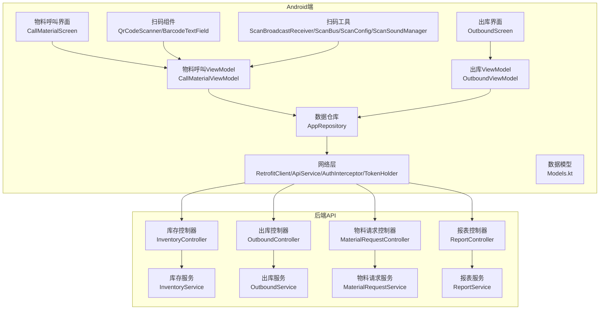
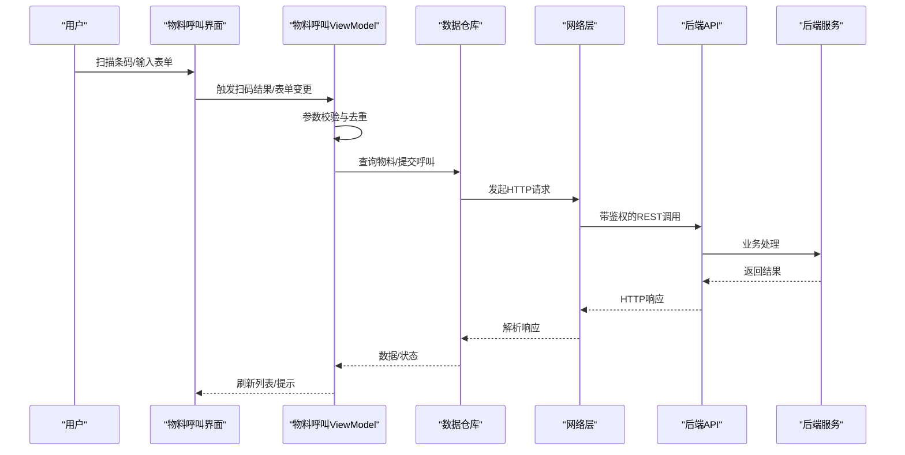
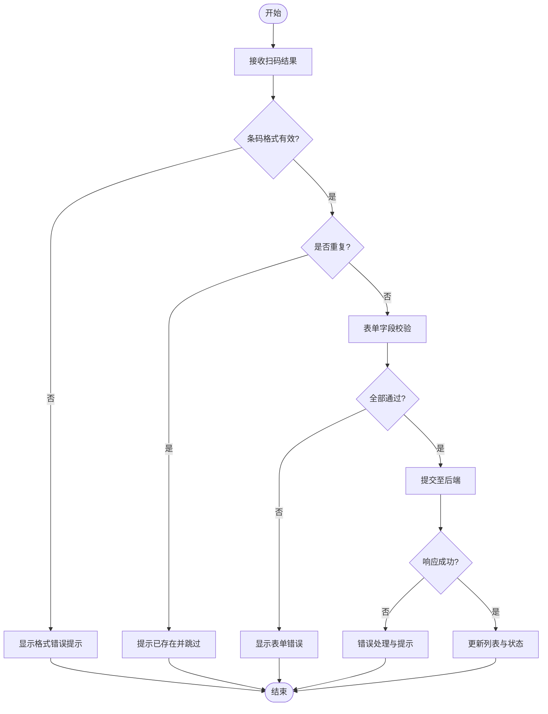
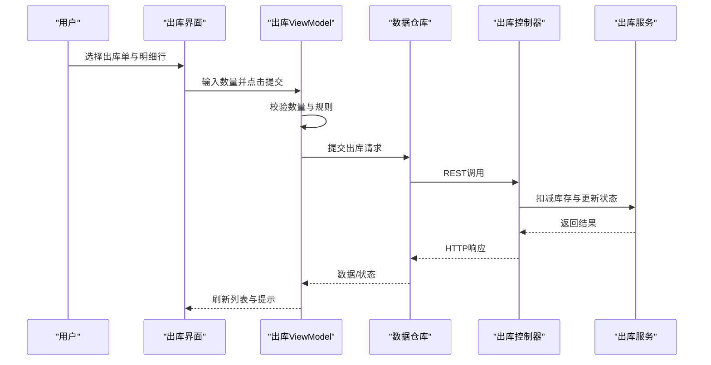
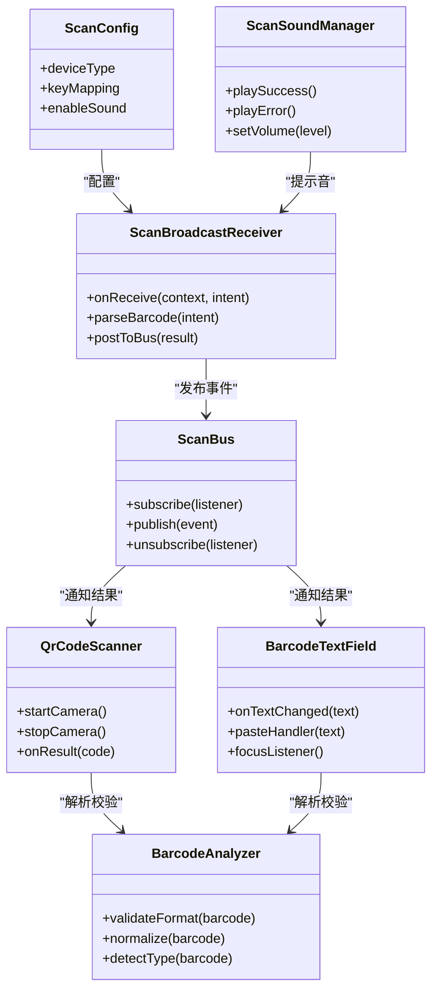
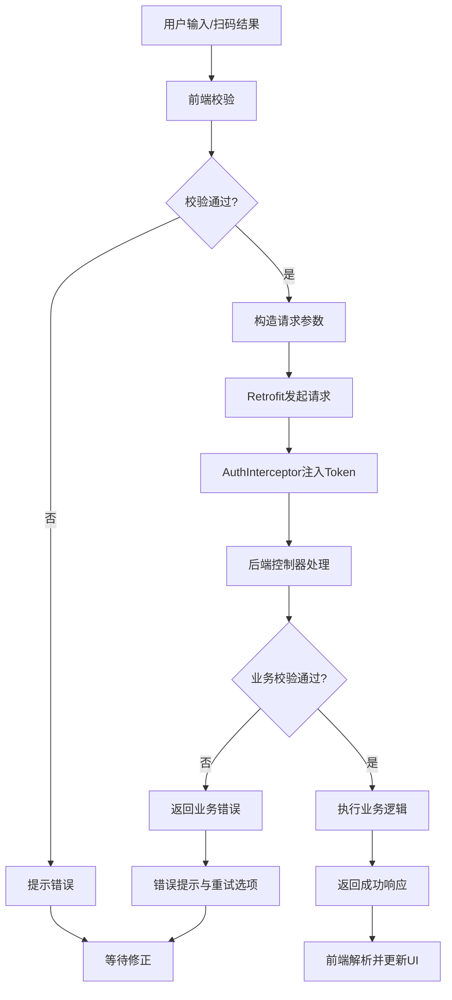
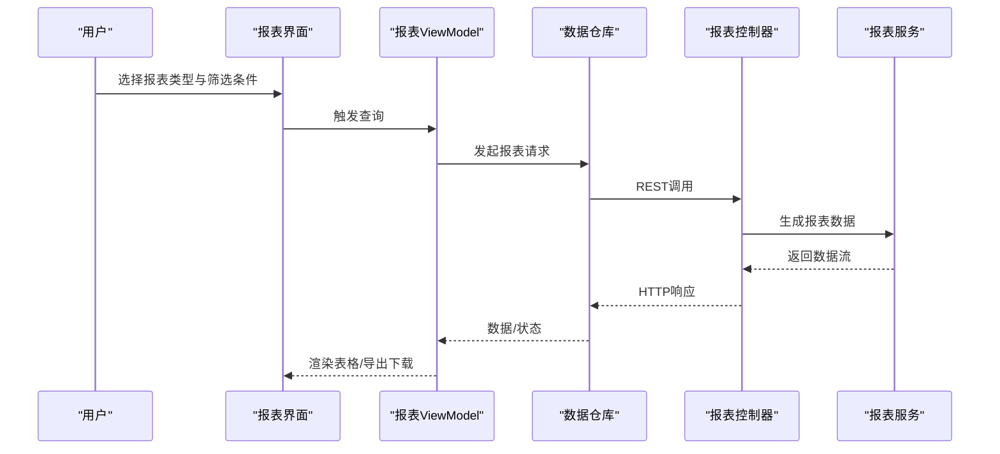
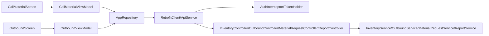

# 物料管理模块

<cite>
**本文档引用的文件**   
- [CallMaterialScreen.kt](file://mobile-android/app/src/main/java/com/dip/material/ui/callmaterial/CallMaterialScreen.kt)
- [CallMaterialViewModel.kt](file://mobile-android/app/src/main/java/com/dip/material/ui/callmaterial/CallMaterialViewModel.kt)
- [OutboundScreen.kt](file://mobile-android/app/src/main/java/com/dip/material/ui/outbound/OutboundScreen.kt)
- [OutboundViewModel.kt](file://mobile-android/app/src/main/java/com/dip/material/ui/outbound/OutboundViewModel.kt)
- [BarcodeAnalyzer.kt](file://mobile-android/app/src/main/java/com/dip/material/ui/components/BarcodeAnalyzer.kt)
- [BarcodeTextField.kt](file://mobile-android/app/src/main/java/com/dip/material/ui/components/BarcodeTextField.kt)
- [QrCodeScanner.kt](file://mobile-android/app/src/main/java/com/dip/material/ui/components/QrCodeScanner.kt)
- [ScanBroadcastReceiver.kt](file://mobile-android/app/src/main/java/com/dip/material/utils/ScanBroadcastReceiver.kt)
- [ScanBus.kt](file://mobile-android/app/src/main/java/com/dip/material/utils/ScanBus.kt)
- [ScanConfig.kt](file://mobile-android/app/src/main/java/com/dip/material/utils/ScanConfig.kt)
- [ScanSoundManager.kt](file://mobile-android/app/src/main/java/com/dip/material/utils/ScanSoundManager.kt)
- [ApiService.kt](file://mobile-android/app/src/main/java/com/dip/material/data/network/ApiService.kt)
- [RetrofitClient.kt](file://mobile-android/app/src/main/java/com/dip/material/data/network/RetrofitClient.kt)
- [AuthInterceptor.kt](file://mobile-android/app/src/main/java/com/dip/material/data/network/AuthInterceptor.kt)
- [TokenHolder.kt](file://mobile-android/app/src/main/java/com/dip/material/data/network/TokenHolder.kt)
- [AppRepository.kt](file://mobile-android/app/src/main/java/com/dip/material/data/repository/AppRepository.kt)
- [Models.kt](file://mobile-android/app/src/main/java/com/dip/material/data/models/Models.kt)
- [InventoryController.cs](file://dip-system/api/Controllers/InventoryController.cs)
- [OutboundController.cs](file://dip-system/api/Controllers/OutboundController.cs)
- [MaterialRequestController.cs](file://dip-system/api/Controllers/MaterialRequestController.cs)
- [ReportController.cs](file://dip-system/api/Controllers/ReportController.cs)
- [InventoryService.cs](file://dip-system/api/Services/InventoryService.cs)
- [OutboundService.cs](file://dip-system/api/Services/OutboundService.cs)
- [MaterialRequestService.cs](file://dip-system/api/Services/MaterialRequestService.cs)
- [ReportService.cs](file://dip-system/api/Services/ReportService.cs)
</cite>

## 目录
1. [简介](#简介)
2. [项目结构](#项目结构)
3. [核心组件](#核心组件)
4. [架构总览](#架构总览)
5. [详细组件分析](#详细组件分析)
6. [依赖关系分析](#依赖关系分析)
7. [性能考虑](#性能考虑)
8. [故障排查指南](#故障排查指南)
9. [结论](#结论)
10. [附录](#附录)

## 简介
本文件面向DIP系统Android应用的“物料管理模块”，聚焦以下能力：
- 物料呼叫界面：扫码输入、表单校验、批量操作
- CallMaterialViewModel：业务编排、数据验证、API调用
- 出库管理：出库流程、库存扣减、状态更新
- 扫码枪集成：硬件广播、条码解析、错误处理
- 物料追踪、历史记录与报表生成

文档以代码级分析为基础，配合架构图、时序图与流程图，帮助开发者与实施人员快速理解并正确使用该模块。

## 项目结构
物料管理模块在Android端采用MVVM架构，UI层通过ViewModel协调数据层（网络、仓库）；后端为.NET API，提供库存、出库、物料请求与报表等接口。关键目录与职责如下：
- mobile-android/app/src/main/java/com/dip/material/ui/callmaterial：物料呼叫界面与ViewModel
- mobile-android/app/src/main/java/com/dip/material/ui/outbound：出库界面与ViewModel
- mobile-android/app/src/main/java/com/dip/material/ui/components：扫码相关UI组件（二维码扫描、条码文本框、条码分析器）
- mobile-android/app/src/main/java/com/dip/material/utils：扫码枪集成工具（广播接收器、事件总线、配置、声音提示）
- mobile-android/app/src/main/java/com/dip/material/data：网络封装、仓库、数据模型
- dip-system/api：后端控制器与服务，暴露REST接口

图表来源
- [CallMaterialScreen.kt](file://mobile-android/app/src/main/java/com/dip/material/ui/callmaterial/CallMaterialScreen.kt)
- [CallMaterialViewModel.kt](file://mobile-android/app/src/main/java/com/dip/material/ui/callmaterial/CallMaterialViewModel.kt)
- [OutboundScreen.kt](file://mobile-android/app/src/main/java/com/dip/material/ui/outbound/OutboundScreen.kt)
- [OutboundViewModel.kt](file://mobile-android/app/src/main/java/com/dip/material/ui/outbound/OutboundViewModel.kt)
- [QrCodeScanner.kt](file://mobile-android/app/src/main/java/com/dip/material/ui/components/QrCodeScanner.kt)
- [BarcodeTextField.kt](file://mobile-android/app/src/main/java/com/dip/material/ui/components/BarcodeTextField.kt)
- [ScanBroadcastReceiver.kt](file://mobile-android/app/src/main/java/com/dip/material/utils/ScanBroadcastReceiver.kt)
- [ScanBus.kt](file://mobile-android/app/src/main/java/com/dip/material/utils/ScanBus.kt)
- [ScanConfig.kt](file://mobile-android/app/src/main/java/com/dip/material/utils/ScanConfig.kt)
- [ScanSoundManager.kt](file://mobile-android/app/src/main/java/com/dip/material/utils/ScanSoundManager.kt)
- [AppRepository.kt](file://mobile-android/app/src/main/java/com/dip/material/data/repository/AppRepository.kt)
- [ApiService.kt](file://mobile-android/app/src/main/java/com/dip/material/data/network/ApiService.kt)
- [RetrofitClient.kt](file://mobile-android/app/src/main/java/com/dip/material/data/network/RetrofitClient.kt)
- [AuthInterceptor.kt](file://mobile-android/app/src/main/java/com/dip/material/data/network/AuthInterceptor.kt)
- [TokenHolder.kt](file://mobile-android/app/src/main/java/com/dip/material/data/network/TokenHolder.kt)
- [InventoryController.cs](file://dip-system/api/Controllers/InventoryController.cs)
- [OutboundController.cs](file://dip-system/api/Controllers/OutboundController.cs)
- [MaterialRequestController.cs](file://dip-system/api/Controllers/MaterialRequestController.cs)
- [ReportController.cs](file://dip-system/api/Controllers/ReportController.cs)
- [InventoryService.cs](file://dip-system/api/Services/InventoryService.cs)
- [OutboundService.cs](file://dip-system/api/Services/OutboundService.cs)
- [MaterialRequestService.cs](file://dip-system/api/Services/MaterialRequestService.cs)
- [ReportService.cs](file://dip-system/api/Services/ReportService.cs)

章节来源
- [CallMaterialScreen.kt](file://mobile-android/app/src/main/java/com/dip/material/ui/callmaterial/CallMaterialScreen.kt)
- [CallMaterialViewModel.kt](file://mobile-android/app/src/main/java/com/dip/material/ui/callmaterial/CallMaterialViewModel.kt)
- [OutboundScreen.kt](file://mobile-android/app/src/main/java/com/dip/material/ui/outbound/OutboundScreen.kt)
- [OutboundViewModel.kt](file://mobile-android/app/src/main/java/com/dip/material/ui/outbound/OutboundViewModel.kt)
- [ApiService.kt](file://mobile-android/app/src/main/java/com/dip/material/data/network/ApiService.kt)
- [RetrofitClient.kt](file://mobile-android/app/src/main/java/com/dip/material/data/network/RetrofitClient.kt)
- [AuthInterceptor.kt](file://mobile-android/app/src/main/java/com/dip/material/data/network/AuthInterceptor.kt)
- [TokenHolder.kt](file://mobile-android/app/src/main/java/com/dip/material/data/network/TokenHolder.kt)
- [AppRepository.kt](file://mobile-android/app/src/main/java/com/dip/material/data/repository/AppRepository.kt)
- [Models.kt](file://mobile-android/app/src/main/java/com/dip/material/data/models/Models.kt)

## 核心组件
- 物料呼叫界面（CallMaterialScreen）：负责展示物料呼叫列表、扫码入口、表单输入区与批量操作按钮，订阅扫码结果并驱动ViewModel执行查询与提交。
- 物料呼叫ViewModel（CallMaterialViewModel）：编排扫码结果处理、表单校验、批量选择与提交、错误提示与加载状态管理。
- 出库界面（OutboundScreen）：展示待出库单、出库明细、数量输入与确认提交。
- 出库ViewModel（OutboundViewModel）：处理出库流程、库存扣减、状态更新与结果反馈。
- 扫码组件（QrCodeScanner、BarcodeTextField、BarcodeAnalyzer）：摄像头扫码、文本框粘贴/监听、条码格式分析与校验。
- 扫码枪工具（ScanBroadcastReceiver、ScanBus、ScanConfig、ScanSoundManager）：硬件广播接收、事件分发、配置管理与提示音控制。
- 数据层（AppRepository、ApiService、RetrofitClient、AuthInterceptor、TokenHolder、Models）：统一网络访问、鉴权拦截、令牌持有与数据模型定义。

章节来源
- [CallMaterialScreen.kt](file://mobile-android/app/src/main/java/com/dip/material/ui/callmaterial/CallMaterialScreen.kt)
- [CallMaterialViewModel.kt](file://mobile-android/app/src/main/java/com/dip/material/ui/callmaterial/CallMaterialViewModel.kt)
- [OutboundScreen.kt](file://mobile-android/app/src/main/java/com/dip/material/ui/outbound/OutboundScreen.kt)
- [OutboundViewModel.kt](file://mobile-android/app/src/main/java/com/dip/material/ui/outbound/OutboundViewModel.kt)
- [QrCodeScanner.kt](file://mobile-android/app/src/main/java/com/dip/material/ui/components/QrCodeScanner.kt)
- [BarcodeTextField.kt](file://mobile-android/app/src/main/java/com/dip/material/ui/components/BarcodeTextField.kt)
- [BarcodeAnalyzer.kt](file://mobile-android/app/src/main/java/com/dip/material/ui/components/BarcodeAnalyzer.kt)
- [ScanBroadcastReceiver.kt](file://mobile-android/app/src/main/java/com/dip/material/utils/ScanBroadcastReceiver.kt)
- [ScanBus.kt](file://mobile-android/app/src/main/java/com/dip/material/utils/ScanBus.kt)
- [ScanConfig.kt](file://mobile-android/app/src/main/java/com/dip/material/utils/ScanConfig.kt)
- [ScanSoundManager.kt](file://mobile-android/app/src/main/java/com/dip/material/utils/ScanSoundManager.kt)
- [AppRepository.kt](file://mobile-android/app/src/main/java/com/dip/material/data/repository/AppRepository.kt)
- [ApiService.kt](file://mobile-android/app/src/main/java/com/dip/material/data/network/ApiService.kt)
- [RetrofitClient.kt](file://mobile-android/app/src/main/java/com/dip/material/data/network/RetrofitClient.kt)
- [AuthInterceptor.kt](file://mobile-android/app/src/main/java/com/dip/material/data/network/AuthInterceptor.kt)
- [TokenHolder.kt](file://mobile-android/app/src/main/java/com/dip/material/data/network/TokenHolder.kt)
- [Models.kt](file://mobile-android/app/src/main/java/com/dip/material/data/models/Models.kt)

## 架构总览
Android端采用MVVM+Repository模式，UI仅负责展示与用户交互，业务逻辑集中在ViewModel，数据访问由Repository统一封装，网络请求通过Retrofit发起并由鉴权拦截器注入认证信息。后端按控制器-服务分层，提供库存、出库、物料请求与报表等能力。

图表来源
- [CallMaterialScreen.kt](file://mobile-android/app/src/main/java/com/dip/material/ui/callmaterial/CallMaterialScreen.kt)
- [CallMaterialViewModel.kt](file://mobile-android/app/src/main/java/com/dip/material/ui/callmaterial/CallMaterialViewModel.kt)
- [ApiService.kt](file://mobile-android/app/src/main/java/com/dip/material/data/network/ApiService.kt)
- [RetrofitClient.kt](file://mobile-android/app/src/main/java/com/dip/material/data/network/RetrofitClient.kt)
- [AuthInterceptor.kt](file://mobile-android/app/src/main/java/com/dip/material/data/network/AuthInterceptor.kt)
- [TokenHolder.kt](file://mobile-android/app/src/main/java/com/dip/material/data/network/TokenHolder.kt)
- [InventoryController.cs](file://dip-system/api/Controllers/InventoryController.cs)
- [OutboundController.cs](file://dip-system/api/Controllers/OutboundController.cs)
- [MaterialRequestController.cs](file://dip-system/api/Controllers/MaterialRequestController.cs)
- [ReportController.cs](file://dip-system/api/Controllers/ReportController.cs)

## 详细组件分析

### 物料呼叫界面与ViewModel
- 功能要点
  - 扫码输入：支持摄像头扫码与文本框粘贴，自动去重与重复提示
  - 表单输入：物料编码、批次、数量等字段校验（非空、格式、范围）
  - 批量操作：多选提交、全选/反选、批量删除
  - 状态管理：加载中、成功、失败、错误消息提示
- 业务流程
  - 扫码结果进入ViewModel后先进行格式校验与本地去重
  - 校验通过后调用仓库层发起查询或提交
  - 根据后端响应更新UI状态与列表
- 错误处理
  - 网络异常、鉴权失败、业务校验失败均给出明确提示
  - 支持重试与回退到上一状态

图表来源
- [CallMaterialScreen.kt](file://mobile-android/app/src/main/java/com/dip/material/ui/callmaterial/CallMaterialScreen.kt)
- [CallMaterialViewModel.kt](file://mobile-android/app/src/main/java/com/dip/material/ui/callmaterial/CallMaterialViewModel.kt)
- [BarcodeTextField.kt](file://mobile-android/app/src/main/java/com/dip/material/ui/components/BarcodeTextField.kt)
- [BarcodeAnalyzer.kt](file://mobile-android/app/src/main/java/com/dip/material/ui/components/BarcodeAnalyzer.kt)

章节来源
- [CallMaterialScreen.kt](file://mobile-android/app/src/main/java/com/dip/material/ui/callmaterial/CallMaterialScreen.kt)
- [CallMaterialViewModel.kt](file://mobile-android/app/src/main/java/com/dip/material/ui/callmaterial/CallMaterialViewModel.kt)
- [BarcodeTextField.kt](file://mobile-android/app/src/main/java/com/dip/material/ui/components/BarcodeTextField.kt)
- [BarcodeAnalyzer.kt](file://mobile-android/app/src/main/java/com/dip/material/ui/components/BarcodeAnalyzer.kt)

### 出库管理
- 功能要点
  - 出库单列表与明细展示
  - 数量输入与校验（不超过可用库存、最小出库单位）
  - 批量出库与确认提交
  - 库存扣减与状态更新（待出库→部分出库→已完成）
- 业务流程
  - 选择出库单与明细行，输入数量并提交
  - ViewModel调用仓库层发起出库请求
  - 后端服务执行库存扣减与状态流转，返回结果
  - 前端刷新列表与提示

图表来源
- [OutboundScreen.kt](file://mobile-android/app/src/main/java/com/dip/material/ui/outbound/OutboundScreen.kt)
- [OutboundViewModel.kt](file://mobile-android/app/src/main/java/com/dip/material/ui/outbound/OutboundViewModel.kt)
- [OutboundController.cs](file://dip-system/api/Controllers/OutboundController.cs)
- [OutboundService.cs](file://dip-system/api/Services/OutboundService.cs)

章节来源
- [OutboundScreen.kt](file://mobile-android/app/src/main/java/com/dip/material/ui/outbound/OutboundScreen.kt)
- [OutboundViewModel.kt](file://mobile-android/app/src/main/java/com/dip/material/ui/outbound/OutboundViewModel.kt)
- [OutboundController.cs](file://dip-system/api/Controllers/OutboundController.cs)
- [OutboundService.cs](file://dip-system/api/Services/OutboundService.cs)

### 扫码枪集成与条码解析
- 硬件集成
  - 通过广播接收器监听扫码枪事件，避免与摄像头冲突
  - 使用事件总线分发扫码结果给各界面
  - 配置项支持不同设备型号与按键映射
- 条码解析
  - 支持常见条码格式校验与过滤
  - 文本框粘贴与焦点事件捕获，兼容软键盘输入
- 错误处理
  - 无效条码提示、重复扫描去重、超时重试
  - 提示音反馈增强用户体验

图表来源
- [ScanBroadcastReceiver.kt](file://mobile-android/app/src/main/java/com/dip/material/utils/ScanBroadcastReceiver.kt)
- [ScanBus.kt](file://mobile-android/app/src/main/java/com/dip/material/utils/ScanBus.kt)
- [ScanConfig.kt](file://mobile-android/app/src/main/java/com/dip/material/utils/ScanConfig.kt)
- [ScanSoundManager.kt](file://mobile-android/app/src/main/java/com/dip/material/utils/ScanSoundManager.kt)
- [BarcodeAnalyzer.kt](file://mobile-android/app/src/main/java/com/dip/material/ui/components/BarcodeAnalyzer.kt)
- [QrCodeScanner.kt](file://mobile-android/app/src/main/java/com/dip/material/ui/components/QrCodeScanner.kt)
- [BarcodeTextField.kt](file://mobile-android/app/src/main/java/com/dip/material/ui/components/BarcodeTextField.kt)

章节来源
- [ScanBroadcastReceiver.kt](file://mobile-android/app/src/main/java/com/dip/material/utils/ScanBroadcastReceiver.kt)
- [ScanBus.kt](file://mobile-android/app/src/main/java/com/dip/material/utils/ScanBus.kt)
- [ScanConfig.kt](file://mobile-android/app/src/main/java/com/dip/material/utils/ScanConfig.kt)
- [ScanSoundManager.kt](file://mobile-android/app/src/main/java/com/dip/material/utils/ScanSoundManager.kt)
- [BarcodeAnalyzer.kt](file://mobile-android/app/src/main/java/com/dip/material/ui/components/BarcodeAnalyzer.kt)
- [QrCodeScanner.kt](file://mobile-android/app/src/main/java/com/dip/material/ui/components/QrCodeScanner.kt)
- [BarcodeTextField.kt](file://mobile-android/app/src/main/java/com/dip/material/ui/components/BarcodeTextField.kt)

### 数据验证与API调用
- 数据验证
  - 前端字段校验：必填、长度、数值范围、格式正则
  - 业务规则校验：库存充足性、批次有效性、最小出库单位
- API调用
  - 统一网络封装：RetrofitClient初始化、ApiService接口定义
  - 鉴权拦截：AuthInterceptor注入Token，TokenHolder管理生命周期
  - 错误处理：网络异常、HTTP错误码、业务错误消息统一处理

图表来源
- [CallMaterialViewModel.kt](file://mobile-android/app/src/main/java/com/dip/material/ui/callmaterial/CallMaterialViewModel.kt)
- [OutboundViewModel.kt](file://mobile-android/app/src/main/java/com/dip/material/ui/outbound/OutboundViewModel.kt)
- [ApiService.kt](file://mobile-android/app/src/main/java/com/dip/material/data/network/ApiService.kt)
- [RetrofitClient.kt](file://mobile-android/app/src/main/java/com/dip/material/data/network/RetrofitClient.kt)
- [AuthInterceptor.kt](file://mobile-android/app/src/main/java/com/dip/material/data/network/AuthInterceptor.kt)
- [TokenHolder.kt](file://mobile-android/app/src/main/java/com/dip/material/data/network/TokenHolder.kt)

章节来源
- [CallMaterialViewModel.kt](file://mobile-android/app/src/main/java/com/dip/material/ui/callmaterial/CallMaterialViewModel.kt)
- [OutboundViewModel.kt](file://mobile-android/app/src/main/java/com/dip/material/ui/outbound/OutboundViewModel.kt)
- [ApiService.kt](file://mobile-android/app/src/main/java/com/dip/material/data/network/ApiService.kt)
- [RetrofitClient.kt](file://mobile-android/app/src/main/java/com/dip/material/data/network/RetrofitClient.kt)
- [AuthInterceptor.kt](file://mobile-android/app/src/main/java/com/dip/material/data/network/AuthInterceptor.kt)
- [TokenHolder.kt](file://mobile-android/app/src/main/java/com/dip/material/data/network/TokenHolder.kt)

### 物料追踪、历史记录与报表
- 物料追踪
  - 基于物料编码与批次号查询历史出入库记录
  - 结合时间范围与操作人筛选，形成可追溯链路
- 历史记录
  - 前端分页展示，支持导出与打印
  - 后端服务聚合多表数据，保证一致性
- 报表生成
  - 库存变动报表、出库汇总报表、物料呼叫统计
  - 支持PDF/Excel导出，后端服务生成流式输出

图表来源
- [ReportController.cs](file://dip-system/api/Controllers/ReportController.cs)
- [ReportService.cs](file://dip-system/api/Services/ReportService.cs)
- [ApiService.kt](file://mobile-android/app/src/main/java/com/dip/material/data/network/ApiService.kt)
- [RetrofitClient.kt](file://mobile-android/app/src/main/java/com/dip/material/data/network/RetrofitClient.kt)

章节来源
- [ReportController.cs](file://dip-system/api/Controllers/ReportController.cs)
- [ReportService.cs](file://dip-system/api/Services/ReportService.cs)
- [ApiService.kt](file://mobile-android/app/src/main/java/com/dip/material/data/network/ApiService.kt)
- [RetrofitClient.kt](file://mobile-android/app/src/main/java/com/dip/material/data/network/RetrofitClient.kt)

## 依赖关系分析
- Android端依赖
  - UI层依赖ViewModel，ViewModel依赖Repository
  - Repository依赖网络层（Retrofit、鉴权拦截、令牌持有）
  - 扫码组件与工具类解耦，通过事件总线通信
- 后端依赖
  - 控制器依赖服务层，服务层依赖数据访问与业务规则
  - 报表服务依赖数据聚合与导出引擎

图表来源
- [CallMaterialScreen.kt](file://mobile-android/app/src/main/java/com/dip/material/ui/callmaterial/CallMaterialScreen.kt)
- [CallMaterialViewModel.kt](file://mobile-android/app/src/main/java/com/dip/material/ui/callmaterial/CallMaterialViewModel.kt)
- [OutboundScreen.kt](file://mobile-android/app/src/main/java/com/dip/material/ui/outbound/OutboundScreen.kt)
- [OutboundViewModel.kt](file://mobile-android/app/src/main/java/com/dip/material/ui/outbound/OutboundViewModel.kt)
- [AppRepository.kt](file://mobile-android/app/src/main/java/com/dip/material/data/repository/AppRepository.kt)
- [ApiService.kt](file://mobile-android/app/src/main/java/com/dip/material/data/network/ApiService.kt)
- [RetrofitClient.kt](file://mobile-android/app/src/main/java/com/dip/material/data/network/RetrofitClient.kt)
- [AuthInterceptor.kt](file://mobile-android/app/src/main/java/com/dip/material/data/network/AuthInterceptor.kt)
- [TokenHolder.kt](file://mobile-android/app/src/main/java/com/dip/material/data/network/TokenHolder.kt)
- [InventoryController.cs](file://dip-system/api/Controllers/InventoryController.cs)
- [OutboundController.cs](file://dip-system/api/Controllers/OutboundController.cs)
- [MaterialRequestController.cs](file://dip-system/api/Controllers/MaterialRequestController.cs)
- [ReportController.cs](file://dip-system/api/Controllers/ReportController.cs)
- [InventoryService.cs](file://dip-system/api/Services/InventoryService.cs)
- [OutboundService.cs](file://dip-system/api/Services/OutboundService.cs)
- [MaterialRequestService.cs](file://dip-system/api/Services/MaterialRequestService.cs)
- [ReportService.cs](file://dip-system/api/Services/ReportService.cs)

章节来源
- [AppRepository.kt](file://mobile-android/app/src/main/java/com/dip/material/data/repository/AppRepository.kt)
- [ApiService.kt](file://mobile-android/app/src/main/java/com/dip/material/data/network/ApiService.kt)
- [RetrofitClient.kt](file://mobile-android/app/src/main/java/com/dip/material/data/network/RetrofitClient.kt)
- [AuthInterceptor.kt](file://mobile-android/app/src/main/java/com/dip/material/data/network/AuthInterceptor.kt)
- [TokenHolder.kt](file://mobile-android/app/src/main/java/com/dip/material/data/network/TokenHolder.kt)
- [InventoryController.cs](file://dip-system/api/Controllers/InventoryController.cs)
- [OutboundController.cs](file://dip-system/api/Controllers/OutboundController.cs)
- [MaterialRequestController.cs](file://dip-system/api/Controllers/MaterialRequestController.cs)
- [ReportController.cs](file://dip-system/api/Controllers/ReportController.cs)
- [InventoryService.cs](file://dip-system/api/Services/InventoryService.cs)
- [OutboundService.cs](file://dip-system/api/Services/OutboundService.cs)
- [MaterialRequestService.cs](file://dip-system/api/Services/MaterialRequestService.cs)
- [ReportService.cs](file://dip-system/api/Services/ReportService.cs)

## 性能考虑
- 前端优化
  - 列表分页与懒加载，减少首屏数据量
  - 扫码结果去重与防抖，避免重复请求
  - 图片与资源按需加载，降低内存占用
- 网络优化
  - 连接池与超时配置合理设置
  - 鉴权令牌缓存与刷新策略，减少重复登录
- 后端优化
  - 数据库索引优化，提升查询性能
  - 报表生成使用流式输出，避免大对象内存峰值
  - 并发控制与限流，保障稳定性

[本节为通用指导，不直接分析具体文件]

## 故障排查指南
- 扫码问题
  - 检查广播接收器权限与注册
  - 确认设备型号与按键映射配置
  - 查看事件总线订阅是否正确
- 网络问题
  - 检查鉴权拦截器是否注入Token
  - 查看HTTP状态码与错误消息
  - 确认后端服务可用性
- 业务问题
  - 核对表单校验规则与业务规则
  - 检查库存充足性与批次有效性
  - 查看后端日志定位具体错误

章节来源
- [ScanBroadcastReceiver.kt](file://mobile-android/app/src/main/java/com/dip/material/utils/ScanBroadcastReceiver.kt)
- [ScanBus.kt](file://mobile-android/app/src/main/java/com/dip/material/utils/ScanBus.kt)
- [ScanConfig.kt](file://mobile-android/app/src/main/java/com/dip/material/utils/ScanConfig.kt)
- [AuthInterceptor.kt](file://mobile-android/app/src/main/java/com/dip/material/data/network/AuthInterceptor.kt)
- [TokenHolder.kt](file://mobile-android/app/src/main/java/com/dip/material/data/network/TokenHolder.kt)

## 结论
物料管理模块通过清晰的MVVM架构与前后端分层设计，实现了扫码输入、表单校验、批量操作、出库流程、库存扣减、状态更新、物料追踪与报表生成等核心能力。扫码枪集成与错误处理机制保障了现场操作的稳定性与用户体验。建议在生产环境加强监控与日志采集，持续优化性能与可靠性。

[本节为总结性内容，不直接分析具体文件]

## 附录
- 术语说明
  - 物料呼叫：生产线上对物料的领取申请
  - 出库：将库存物料从仓库发出至生产线或其他部门
  - 物料追踪：基于编码与批次的历史出入库记录查询
- 最佳实践
  - 统一错误码与消息规范
  - 前端表单校验与后端业务校验双重保障
  - 扫码结果去重与防抖，避免重复提交
  - 报表生成采用异步任务与流式输出

[本节为补充信息，不直接分析具体文件]