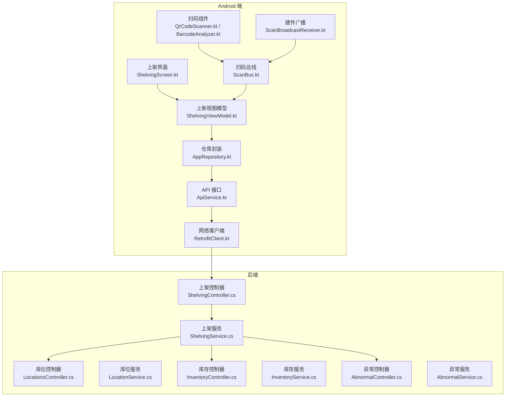
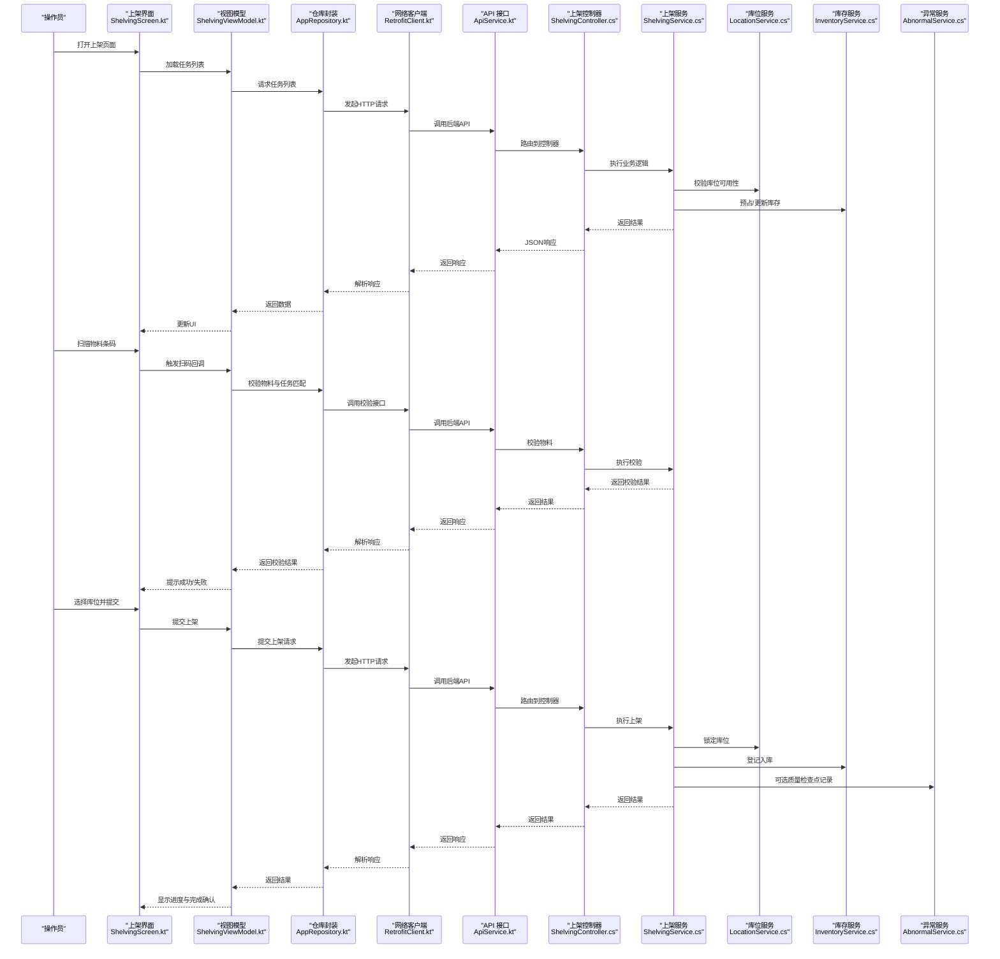
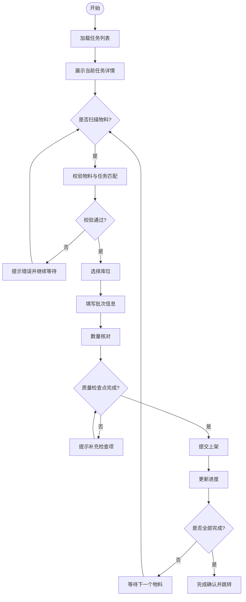
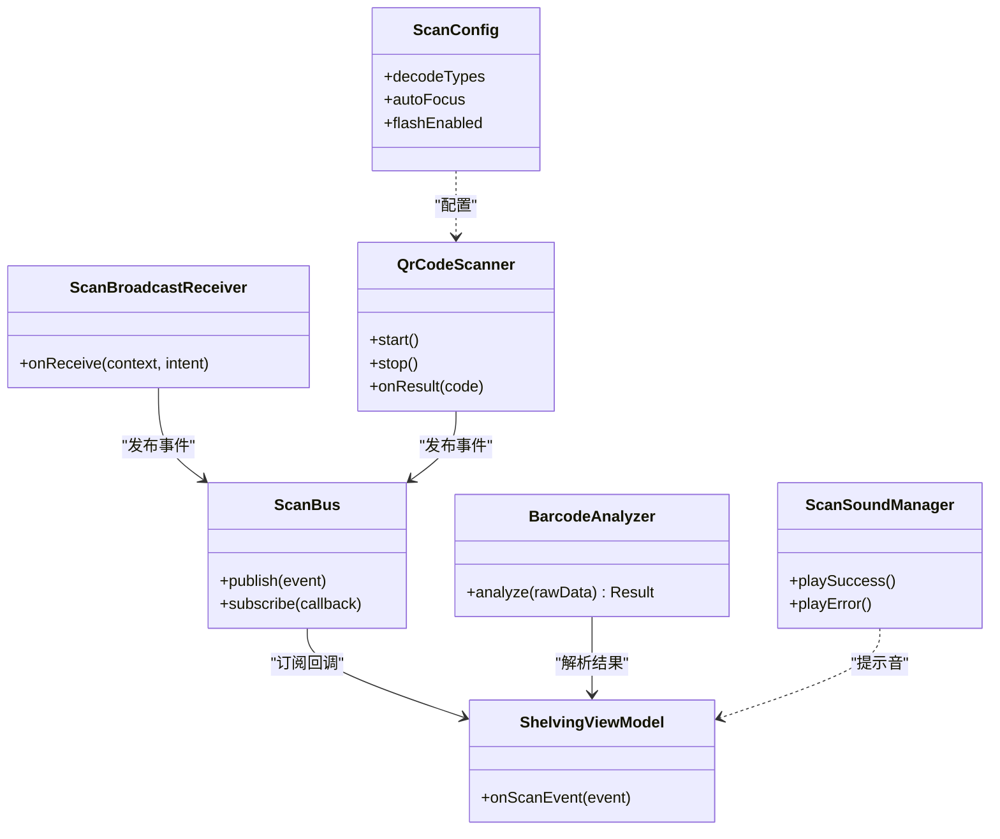
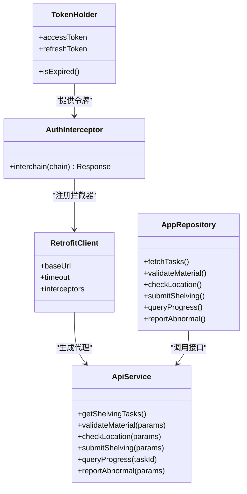
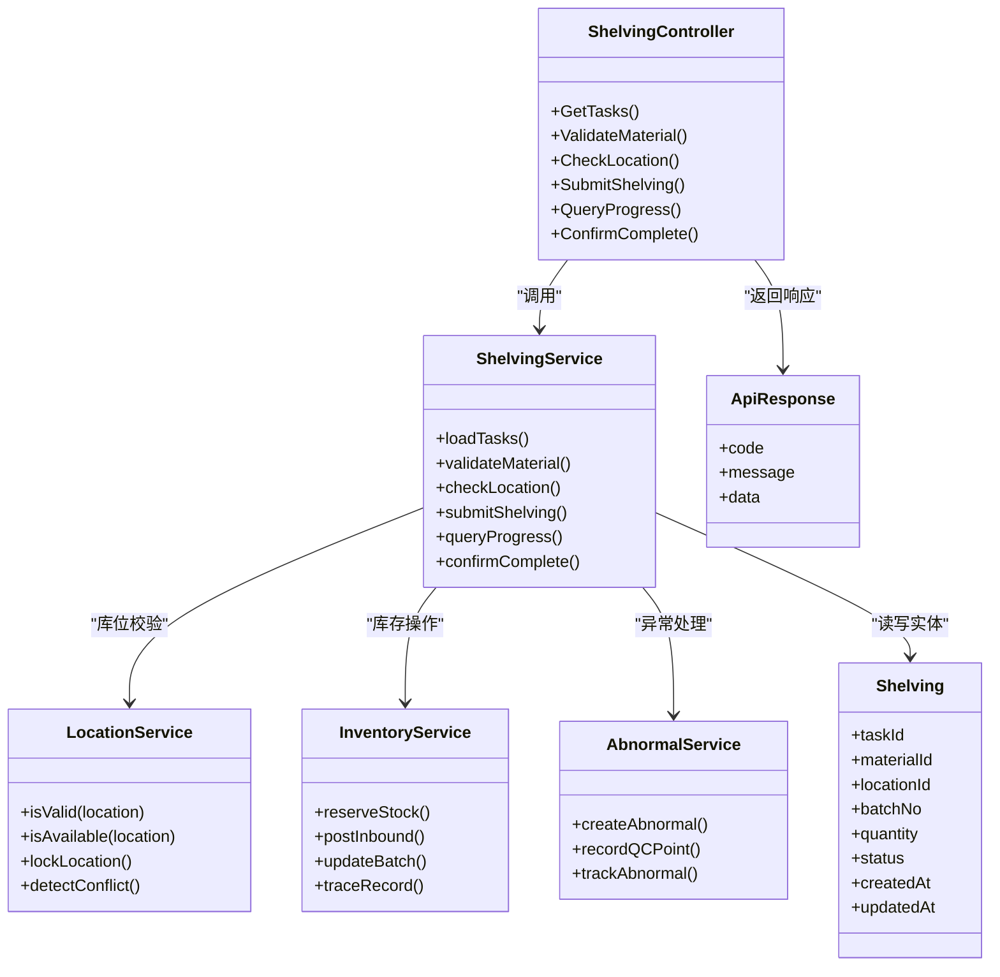
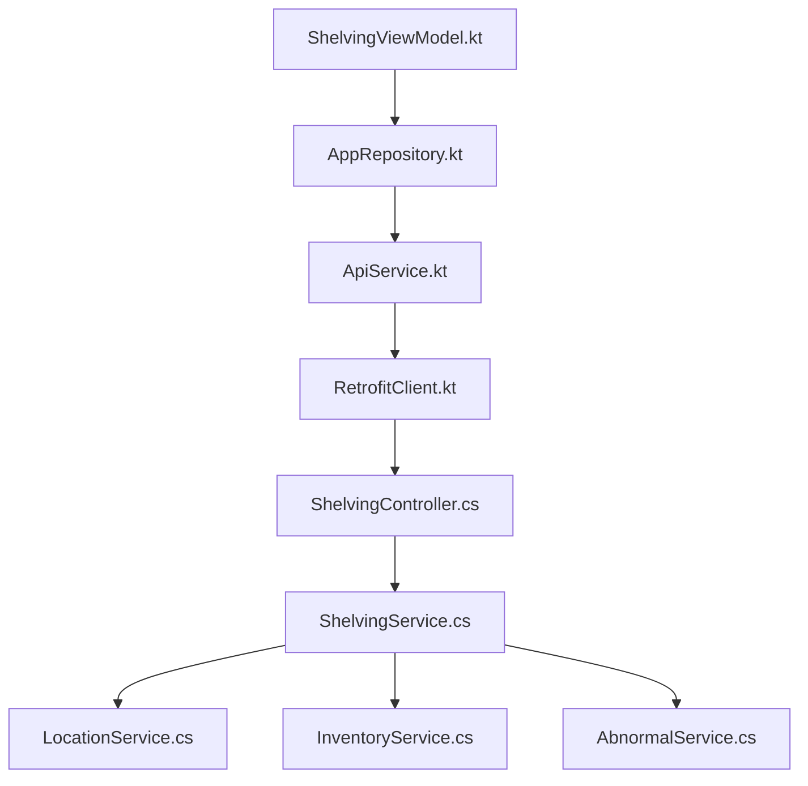

# 上架作业

<cite>
**本文引用的文件**   
- [ShelvingScreen.kt](file://mobile-android/app/src/main/java/com/dip/material/ui/shelving/ShelvingScreen.kt)
- [ShelvingViewModel.kt](file://mobile-android/app/src/main/java/com/dip/material/ui/shelving/ShelvingViewModel.kt)
- [ApiService.kt](file://mobile-android/app/src/main/java/com/dip/material/data/network/ApiService.kt)
- [RetrofitClient.kt](file://mobile-android/app/src/main/java/com/dip/material/data/network/RetrofitClient.kt)
- [AuthInterceptor.kt](file://mobile-android/app/src/main/java/com/dip/material/data/network/AuthInterceptor.kt)
- [TokenHolder.kt](file://mobile-android/app/src/main/java/com/dip/material/data/network/TokenHolder.kt)
- [AppRepository.kt](file://mobile-android/app/src/main/java/com/dip/material/data/repository/AppRepository.kt)
- [Models.kt](file://mobile-android/app/src/main/java/com/dip/material/data/models/Models.kt)
- [BarcodeAnalyzer.kt](file://mobile-android/app/src/main/java/com/dip/material/ui/components/BarcodeAnalyzer.kt)
- [QrCodeScanner.kt](file://mobile-android/app/src/main/java/com/dip/material/ui/components/QrCodeScanner.kt)
- [ScanBroadcastReceiver.kt](file://mobile-android/app/src/main/java/com/dip/material/utils/ScanBroadcastReceiver.kt)
- [ScanBus.kt](file://mobile-android/app/src/main/java/com/dip/material/utils/ScanBus.kt)
- [ScanConfig.kt](file://mobile-android/app/src/main/java/com/dip/material/utils/ScanConfig.kt)
- [ScanSoundManager.kt](file://mobile-android/app/src/main/java/com/dip/material/utils/ScanSoundManager.kt)
- [ShelvingController.cs](file://dip-system/api/Controllers/ShelvingController.cs)
- [ShelvingService.cs](file://dip-system/api/Services/ShelvingService.cs)
- [Shelving.cs](file://dip-system/api/Models/Shelving.cs)
- [LocationsController.cs](file://dip-system/api/Controllers/LocationsController.cs)
- [LocationService.cs](file://dip-system/api/Services/LocationService.cs)
- [InventoryController.cs](file://dip-system/api/Controllers/InventoryController.cs)
- [InventoryService.cs](file://dip-system/api/Services/InventoryService.cs)
- [AbnormalController.cs](file://dip-system/api/Controllers/AbnormalController.cs)
- [AbnormalService.cs](file://dip-system/api/Services/AbnormalService.cs)
- [ApiResponse.cs](file://dip-system/api/Models/ApiResponse.cs)
</cite>

## 目录
1. [简介](#简介)
2. [项目结构](#项目结构)
3. [核心组件](#核心组件)
4. [架构总览](#架构总览)
5. [详细组件分析](#详细组件分析)
6. [依赖分析](#依赖分析)
7. [性能考虑](#性能考虑)
8. [故障排查指南](#故障排查指南)
9. [结论](#结论)
10. [附录](#附录)

## 简介
本文件面向DIP系统Android应用的上架作业功能，覆盖任务分配、物料扫描确认、库位选择、批次管理、扫码验证、位置校验、数量核对、异常处理、库位冲突检测、质量检查点设置、进度监控、完成确认与追溯记录。文档从移动端界面与交互、数据层与网络层、后端API与服务、以及端到端流程进行系统化说明，帮助开发与运维人员快速理解并高效维护该能力。

## 项目结构
上架作业涉及Android端UI与业务逻辑、扫码子系统、网络与仓库服务、以及后端控制器与服务。关键路径如下：
- Android端：上架界面与状态管理（ShelvingScreen.kt、ShelvingViewModel.kt）
- 扫码子系统：二维码/条码解析与硬件广播（QrCodeScanner.kt、BarcodeAnalyzer.kt、ScanBroadcastReceiver.kt、ScanBus.kt、ScanConfig.kt、ScanSoundManager.kt）
- 数据与网络：统一API接口、拦截器、令牌持有者、仓库封装（ApiService.kt、RetrofitClient.kt、AuthInterceptor.kt、TokenHolder.kt、AppRepository.kt）
- 后端：上架控制器与服务、库位与库存服务、异常服务（ShelvingController.cs、ShelvingService.cs、LocationsController.cs、LocationService.cs、InventoryController.cs、InventoryService.cs、AbnormalController.cs、AbnormalService.cs）
- 数据模型：上架实体、响应体等（Shelving.cs、ApiResponse.cs、Models.kt）

**图表来源** 
- [ShelvingScreen.kt](file://mobile-android/app/src/main/java/com/dip/material/ui/shelving/ShelvingScreen.kt)
- [ShelvingViewModel.kt](file://mobile-android/app/src/main/java/com/dip/material/ui/shelving/ShelvingViewModel.kt)
- [ApiService.kt](file://mobile-android/app/src/main/java/com/dip/material/data/network/ApiService.kt)
- [RetrofitClient.kt](file://mobile-android/app/src/main/java/com/dip/material/data/network/RetrofitClient.kt)
- [AuthInterceptor.kt](file://mobile-android/app/src/main/java/com/dip/material/data/network/AuthInterceptor.kt)
- [TokenHolder.kt](file://mobile-android/app/src/main/java/com/dip/material/data/network/TokenHolder.kt)
- [AppRepository.kt](file://mobile-android/app/src/main/java/com/dip/material/data/repository/AppRepository.kt)
- [QrCodeScanner.kt](file://mobile-android/app/src/main/java/com/dip/material/ui/components/QrCodeScanner.kt)
- [BarcodeAnalyzer.kt](file://mobile-android/app/src/main/java/com/dip/material/ui/components/BarcodeAnalyzer.kt)
- [ScanBroadcastReceiver.kt](file://mobile-android/app/src/main/java/com/dip/material/utils/ScanBroadcastReceiver.kt)
- [ScanBus.kt](file://mobile-android/app/src/main/java/com/dip/material/utils/ScanBus.kt)
- [ScanConfig.kt](file://mobile-android/app/src/main/java/com/dip/material/utils/ScanConfig.kt)
- [ScanSoundManager.kt](file://mobile-android/app/src/main/java/com/dip/material/utils/ScanSoundManager.kt)
- [ShelvingController.cs](file://dip-system/api/Controllers/ShelvingController.cs)
- [ShelvingService.cs](file://dip-system/api/Services/ShelvingService.cs)
- [LocationsController.cs](file://dip-system/api/Controllers/LocationsController.cs)
- [LocationService.cs](file://dip-system/api/Services/LocationService.cs)
- [InventoryController.cs](file://dip-system/api/Controllers/InventoryController.cs)
- [InventoryService.cs](file://dip-system/api/Services/InventoryService.cs)
- [AbnormalController.cs](file://dip-system/api/Controllers/AbnormalController.cs)
- [AbnormalService.cs](file://dip-system/api/Services/AbnormalService.cs)

**章节来源**
- [ShelvingScreen.kt](file://mobile-android/app/src/main/java/com/dip/material/ui/shelving/ShelvingScreen.kt)
- [ShelvingViewModel.kt](file://mobile-android/app/src/main/java/com/dip/material/ui/shelving/ShelvingViewModel.kt)
- [ApiService.kt](file://mobile-android/app/src/main/java/com/dip/material/data/network/ApiService.kt)
- [RetrofitClient.kt](file://mobile-android/app/src/main/java/com/dip/material/data/network/RetrofitClient.kt)
- [AuthInterceptor.kt](file://mobile-android/app/src/main/java/com/dip/material/data/network/AuthInterceptor.kt)
- [TokenHolder.kt](file://mobile-android/app/src/main/java/com/dip/material/data/network/TokenHolder.kt)
- [AppRepository.kt](file://mobile-android/app/src/main/java/com/dip/material/data/repository/AppRepository.kt)
- [Models.kt](file://mobile-android/app/src/main/java/com/dip/material/data/models/Models.kt)
- [ShelvingController.cs](file://dip-system/api/Controllers/ShelvingController.cs)
- [ShelvingService.cs](file://dip-system/api/Services/ShelvingService.cs)
- [LocationsController.cs](file://dip-system/api/Controllers/LocationsController.cs)
- [LocationService.cs](file://dip-system/api/Services/LocationService.cs)
- [InventoryController.cs](file://dip-system/api/Controllers/InventoryController.cs)
- [InventoryService.cs](file://dip-system/api/Services/InventoryService.cs)
- [AbnormalController.cs](file://dip-system/api/Controllers/AbnormalController.cs)
- [AbnormalService.cs](file://dip-system/api/Services/AbnormalService.cs)

## 核心组件
- 上架界面与状态管理：负责展示任务列表、当前任务详情、扫码输入框、库位选择面板、批次信息、数量核对、质量检查点、异常上报入口、进度与完成确认。
- 扫码子系统：集成硬件扫描广播与摄像头扫码，统一通过事件总线分发到业务层，支持提示音反馈与配置开关。
- 数据与网络：封装统一的API调用、鉴权拦截、令牌刷新、错误重试与缓存策略。
- 后端服务：提供上架任务查询与提交、库位校验与占用检测、库存扣减与入库登记、批次与追溯记录、异常工单创建。

**章节来源**
- [ShelvingScreen.kt](file://mobile-android/app/src/main/java/com/dip/material/ui/shelving/ShelvingScreen.kt)
- [ShelvingViewModel.kt](file://mobile-android/app/src/main/java/com/dip/material/ui/shelving/ShelvingViewModel.kt)
- [ApiService.kt](file://mobile-android/app/src/main/java/com/dip/material/data/network/ApiService.kt)
- [RetrofitClient.kt](file://mobile-android/app/src/main/java/com/dip/material/data/network/RetrofitClient.kt)
- [AuthInterceptor.kt](file://mobile-android/app/src/main/java/com/dip/material/data/network/AuthInterceptor.kt)
- [TokenHolder.kt](file://mobile-android/app/src/main/java/com/dip/material/data/network/TokenHolder.kt)
- [AppRepository.kt](file://mobile-android/app/src/main/java/com/dip/material/data/repository/AppRepository.kt)
- [ShelvingController.cs](file://dip-system/api/Controllers/ShelvingController.cs)
- [ShelvingService.cs](file://dip-system/api/Services/ShelvingService.cs)

## 架构总览
上架作业采用“前端MVVM + 扫码事件总线 + 后端REST”的架构模式。Android端通过ViewModel集中管理上架状态，使用Repository统一访问网络；后端以控制器暴露REST接口，服务层实现业务规则与一致性保障。

**图表来源** 
- [ShelvingScreen.kt](file://mobile-android/app/src/main/java/com/dip/material/ui/shelving/ShelvingScreen.kt)
- [ShelvingViewModel.kt](file://mobile-android/app/src/main/java/com/dip/material/ui/shelving/ShelvingViewModel.kt)
- [ApiService.kt](file://mobile-android/app/src/main/java/com/dip/material/data/network/ApiService.kt)
- [RetrofitClient.kt](file://mobile-android/app/src/main/java/com/dip/material/data/network/RetrofitClient.kt)
- [ShelvingController.cs](file://dip-system/api/Controllers/ShelvingController.cs)
- [ShelvingService.cs](file://dip-system/api/Services/ShelvingService.cs)
- [LocationService.cs](file://dip-system/api/Services/LocationService.cs)
- [InventoryService.cs](file://dip-system/api/Services/InventoryService.cs)
- [AbnormalService.cs](file://dip-system/api/Services/AbnormalService.cs)

## 详细组件分析

### 上架界面与状态管理（ShelvingScreen.kt、ShelvingViewModel.kt）
- 界面职责：展示任务列表、当前任务详情、扫码输入区、库位选择面板、批次信息与数量核对、质量检查点、异常上报入口、进度条与完成确认按钮。
- 状态管理：ViewModel集中管理任务、物料、库位、批次、数量、质量检查点、异常、进度与错误消息；监听扫码事件总线，驱动UI更新。
- 交互流程：
  - 初始化：拉取任务列表与待上架明细。
  - 扫码：接收扫码事件，自动填充物料信息，触发后端校验。
  - 库位选择：根据任务要求与库位可用性过滤候选库位。
  - 批次管理：绑定批次号、有效期、供应商等信息。
  - 数量核对：对比任务需求与实际扫描数量，防止超量或不足。
  - 质量检查点：按规则勾选必要检查项，未满足则阻止提交。
  - 提交上架：组装请求参数，调用后端接口，更新进度与状态。
  - 完成确认：成功后提示并进入下一任务或返回列表。

**图表来源** 
- [ShelvingScreen.kt](file://mobile-android/app/src/main/java/com/dip/material/ui/shelving/ShelvingScreen.kt)
- [ShelvingViewModel.kt](file://mobile-android/app/src/main/java/com/dip/material/ui/shelving/ShelvingViewModel.kt)

**章节来源**
- [ShelvingScreen.kt](file://mobile-android/app/src/main/java/com/dip/material/ui/shelving/ShelvingScreen.kt)
- [ShelvingViewModel.kt](file://mobile-android/app/src/main/java/com/dip/material/ui/shelving/ShelvingViewModel.kt)

### 扫码子系统（QrCodeScanner.kt、BarcodeAnalyzer.kt、ScanBroadcastReceiver.kt、ScanBus.kt、ScanConfig.kt、ScanSoundManager.kt）
- 硬件广播：ScanBroadcastReceiver监听系统或设备广播，将扫描结果发布到ScanBus。
- 事件总线：ScanBus作为中央通道，解耦扫码源与业务消费方，支持多订阅者。
- 解析器：BarcodeAnalyzer对原始数据进行格式识别与提取（如物料码、批次号）。
- 摄像头扫码：QrCodeScanner提供摄像头扫码能力，兼容不同设备。
- 配置与反馈：ScanConfig控制扫码行为（如自动聚焦、解码类型），ScanSoundManager播放提示音。
- 与业务集成：ShelvingViewModel订阅ScanBus，收到扫码事件后触发物料校验与UI更新。

**图表来源** 
- [ScanBroadcastReceiver.kt](file://mobile-android/app/src/main/java/com/dip/material/utils/ScanBroadcastReceiver.kt)
- [ScanBus.kt](file://mobile-android/app/src/main/java/com/dip/material/utils/ScanBus.kt)
- [BarcodeAnalyzer.kt](file://mobile-android/app/src/main/java/com/dip/material/ui/components/BarcodeAnalyzer.kt)
- [QrCodeScanner.kt](file://mobile-android/app/src/main/java/com/dip/material/ui/components/QrCodeScanner.kt)
- [ScanConfig.kt](file://mobile-android/app/src/main/java/com/dip/material/utils/ScanConfig.kt)
- [ScanSoundManager.kt](file://mobile-android/app/src/main/java/com/dip/material/utils/ScanSoundManager.kt)
- [ShelvingViewModel.kt](file://mobile-android/app/src/main/java/com/dip/material/ui/shelving/ShelvingViewModel.kt)

**章节来源**
- [QrCodeScanner.kt](file://mobile-android/app/src/main/java/com/dip/material/ui/components/QrCodeScanner.kt)
- [BarcodeAnalyzer.kt](file://mobile-android/app/src/main/java/com/dip/material/ui/components/BarcodeAnalyzer.kt)
- [ScanBroadcastReceiver.kt](file://mobile-android/app/src/main/java/com/dip/material/utils/ScanBroadcastReceiver.kt)
- [ScanBus.kt](file://mobile-android/app/src/main/java/com/dip/material/utils/ScanBus.kt)
- [ScanConfig.kt](file://mobile-android/app/src/main/java/com/dip/material/utils/ScanConfig.kt)
- [ScanSoundManager.kt](file://mobile-android/app/src/main/java/com/dip/material/utils/ScanSoundManager.kt)

### 数据与网络（ApiService.kt、RetrofitClient.kt、AuthInterceptor.kt、TokenHolder.kt、AppRepository.kt）
- ApiService：定义所有上架相关接口（任务查询、物料校验、库位校验、提交上架、进度查询、异常上报等）。
- RetrofitClient：构建HTTP客户端，配置基础URL、超时、日志与序列化。
- AuthInterceptor：统一添加鉴权头，处理令牌过期与刷新。
- TokenHolder：集中管理访问令牌与刷新逻辑。
- AppRepository：封装业务级调用，合并多个API、处理错误与重试、提供协程友好的数据流。

**图表来源** 
- [ApiService.kt](file://mobile-android/app/src/main/java/com/dip/material/data/network/ApiService.kt)
- [RetrofitClient.kt](file://mobile-android/app/src/main/java/com/dip/material/data/network/RetrofitClient.kt)
- [AuthInterceptor.kt](file://mobile-android/app/src/main/java/com/dip/material/data/network/AuthInterceptor.kt)
- [TokenHolder.kt](file://mobile-android/app/src/main/java/com/dip/material/data/network/TokenHolder.kt)
- [AppRepository.kt](file://mobile-android/app/src/main/java/com/dip/material/data/repository/AppRepository.kt)

**章节来源**
- [ApiService.kt](file://mobile-android/app/src/main/java/com/dip/material/data/network/ApiService.kt)
- [RetrofitClient.kt](file://mobile-android/app/src/main/java/com/dip/material/data/network/RetrofitClient.kt)
- [AuthInterceptor.kt](file://mobile-android/app/src/main/java/com/dip/material/data/network/AuthInterceptor.kt)
- [TokenHolder.kt](file://mobile-android/app/src/main/java/com/dip/material/data/network/TokenHolder.kt)
- [AppRepository.kt](file://mobile-android/app/src/main/java/com/dip/material/data/repository/AppRepository.kt)

### 后端服务（ShelvingController.cs、ShelvingService.cs、LocationsController.cs、LocationService.cs、InventoryController.cs、InventoryService.cs、AbnormalController.cs、AbnormalService.cs）
- 上架控制器与服务：处理任务查询、物料校验、库位校验、提交上架、进度查询、完成确认、追溯记录。
- 库位服务：校验库位类型、容量、占用状态、冲突检测与锁定。
- 库存服务：扣减在途库存、登记入库、批次与追溯信息写入。
- 异常服务：创建异常工单、质量检查点记录、异常上报与跟踪。
- 数据模型：Shelving.cs定义上架实体字段（任务ID、物料、库位、批次、数量、状态、时间戳等），ApiResponse.cs统一响应格式。

**图表来源** 
- [ShelvingController.cs](file://dip-system/api/Controllers/ShelvingController.cs)
- [ShelvingService.cs](file://dip-system/api/Services/ShelvingService.cs)
- [LocationsController.cs](file://dip-system/api/Controllers/LocationsController.cs)
- [LocationService.cs](file://dip-system/api/Services/LocationService.cs)
- [InventoryController.cs](file://dip-system/api/Controllers/InventoryController.cs)
- [InventoryService.cs](file://dip-system/api/Services/InventoryService.cs)
- [AbnormalController.cs](file://dip-system/api/Controllers/AbnormalController.cs)
- [AbnormalService.cs](file://dip-system/api/Services/AbnormalService.cs)
- [Shelving.cs](file://dip-system/api/Models/Shelving.cs)
- [ApiResponse.cs](file://dip-system/api/Models/ApiResponse.cs)

**章节来源**
- [ShelvingController.cs](file://dip-system/api/Controllers/ShelvingController.cs)
- [ShelvingService.cs](file://dip-system/api/Services/ShelvingService.cs)
- [LocationsController.cs](file://dip-system/api/Controllers/LocationsController.cs)
- [LocationService.cs](file://dip-system/api/Services/LocationService.cs)
- [InventoryController.cs](file://dip-system/api/Controllers/InventoryController.cs)
- [InventoryService.cs](file://dip-system/api/Services/InventoryService.cs)
- [AbnormalController.cs](file://dip-system/api/Controllers/AbnormalController.cs)
- [AbnormalService.cs](file://dip-system/api/Services/AbnormalService.cs)
- [Shelving.cs](file://dip-system/api/Models/Shelving.cs)
- [ApiResponse.cs](file://dip-system/api/Models/ApiResponse.cs)

## 依赖分析
- 模块耦合：Android端通过Repository与ApiService解耦具体网络实现；后端控制器与服务分层清晰，库位、库存、异常服务独立。
- 外部依赖：Retrofit用于HTTP通信，扫码SDK或系统广播用于硬件采集，数据库与缓存由后端服务管理。
- 潜在循环依赖：避免Service之间直接互相调用，通过事件或事务协调；Android端ViewModel不直接依赖网络，仅通过Repository。

**图表来源** 
- [ShelvingViewModel.kt](file://mobile-android/app/src/main/java/com/dip/material/ui/shelving/ShelvingViewModel.kt)
- [AppRepository.kt](file://mobile-android/app/src/main/java/com/dip/material/data/repository/AppRepository.kt)
- [ApiService.kt](file://mobile-android/app/src/main/java/com/dip/material/data/network/ApiService.kt)
- [RetrofitClient.kt](file://mobile-android/app/src/main/java/com/dip/material/data/network/RetrofitClient.kt)
- [ShelvingController.cs](file://dip-system/api/Controllers/ShelvingController.cs)
- [ShelvingService.cs](file://dip-system/api/Services/ShelvingService.cs)
- [LocationService.cs](file://dip-system/api/Services/LocationService.cs)
- [InventoryService.cs](file://dip-system/api/Services/InventoryService.cs)
- [AbnormalService.cs](file://dip-system/api/Services/AbnormalService.cs)

**章节来源**
- [ShelvingViewModel.kt](file://mobile-android/app/src/main/java/com/dip/material/ui/shelving/ShelvingViewModel.kt)
- [AppRepository.kt](file://mobile-android/app/src/main/java/com/dip/material/data/repository/AppRepository.kt)
- [ApiService.kt](file://mobile-android/app/src/main/java/com/dip/material/data/network/ApiService.kt)
- [RetrofitClient.kt](file://mobile-android/app/src/main/java/com/dip/material/data/network/RetrofitClient.kt)
- [ShelvingController.cs](file://dip-system/api/Controllers/ShelvingController.cs)
- [ShelvingService.cs](file://dip-system/api/Services/ShelvingService.cs)
- [LocationService.cs](file://dip-system/api/Services/LocationService.cs)
- [InventoryService.cs](file://dip-system/api/Services/InventoryService.cs)
- [AbnormalService.cs](file://dip-system/api/Services/AbnormalService.cs)

## 性能考虑
- 网络优化：合理设置超时与重试，使用连接池与缓存策略；批量提交减少往返次数。
- 扫码性能：优先使用硬件广播，避免频繁摄像头解码；解析器轻量化处理，必要时异步执行。
- UI渲染：ViewModel中状态变更最小化，避免主线程阻塞；分页加载任务与明细。
- 后端并发：库位锁与库存操作使用事务与行级锁，避免死锁；热点数据缓存（如库位容量）提升响应速度。
- 资源管理：及时释放摄像头与扫描资源，避免内存泄漏。

[本节为通用指导，无需特定文件引用]

## 故障排查指南
- 扫码无响应：检查ScanBroadcastReceiver是否正确注册，ScanBus订阅是否生效，ScanConfig配置是否匹配设备。
- 物料校验失败：核对物料编码、任务关联关系、批次有效性；查看后端校验逻辑与返回码。
- 库位冲突：检查库位类型、容量、占用状态；确认锁定机制与并发控制。
- 提交失败：检查网络状态、鉴权令牌、请求参数完整性；查看后端日志与异常服务记录。
- 进度不更新：确认进度查询接口是否正常，后端事务是否提交，前端轮询或推送是否有效。
- 异常上报：确认异常工单创建成功，质量检查点记录完整，追踪链路可查。

**章节来源**
- [ScanBroadcastReceiver.kt](file://mobile-android/app/src/main/java/com/dip/material/utils/ScanBroadcastReceiver.kt)
- [ScanBus.kt](file://mobile-android/app/src/main/java/com/dip/material/utils/ScanBus.kt)
- [ScanConfig.kt](file://mobile-android/app/src/main/java/com/dip/material/utils/ScanConfig.kt)
- [ShelvingViewModel.kt](file://mobile-android/app/src/main/java/com/dip/material/ui/shelving/ShelvingViewModel.kt)
- [ShelvingController.cs](file://dip-system/api/Controllers/ShelvingController.cs)
- [ShelvingService.cs](file://dip-system/api/Services/ShelvingService.cs)
- [LocationService.cs](file://dip-system/api/Services/LocationService.cs)
- [InventoryService.cs](file://dip-system/api/Services/InventoryService.cs)
- [AbnormalService.cs](file://dip-system/api/Services/AbnormalService.cs)

## 结论
上架作业通过清晰的MVVM架构与事件总线解耦扫码与业务，结合后端服务的严格校验与事务保障，实现了从任务分配到完成确认的全流程闭环。建议在后续迭代中增强离线容错、批量操作与可视化追溯，进一步提升效率与可靠性。

[本节为总结性内容，无需特定文件引用]

## 附录
- 术语表：
  - 上架：将物料从暂存区移动到指定库位并完成库存登记的过程。
  - 库位冲突：同一库位被多个任务同时占用或容量不足导致的冲突。
  - 质量检查点：上架过程中必须完成的质检步骤，未满足则禁止提交。
  - 追溯记录：包含物料、批次、库位、时间与操作人的完整链路信息。

[本节为概念性内容，无需特定文件引用]