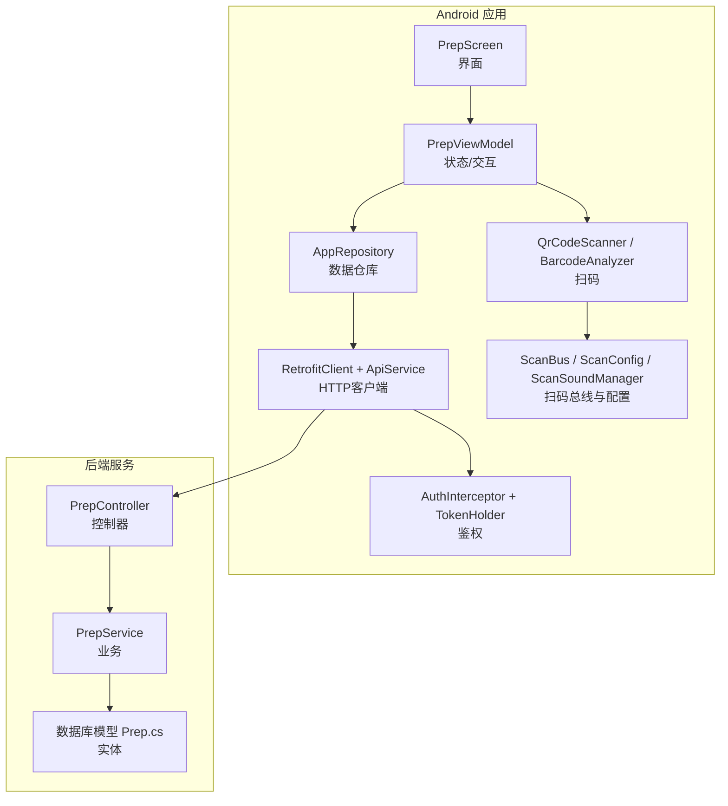
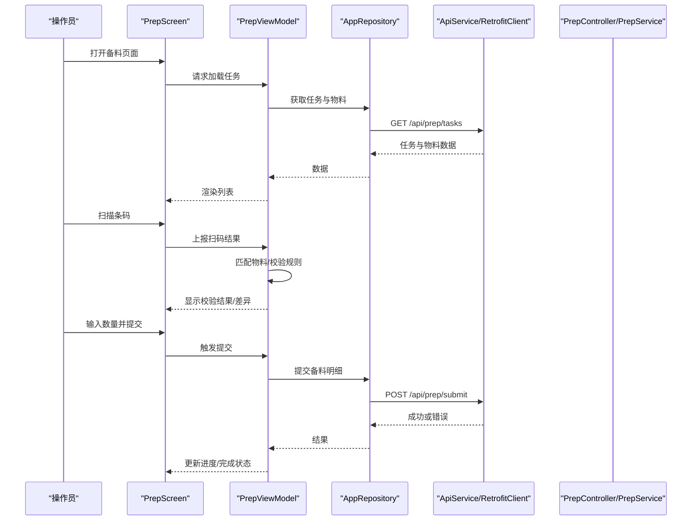
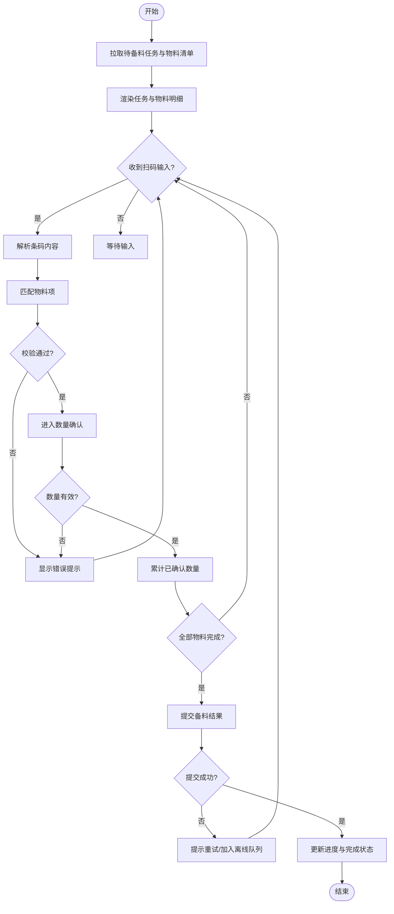
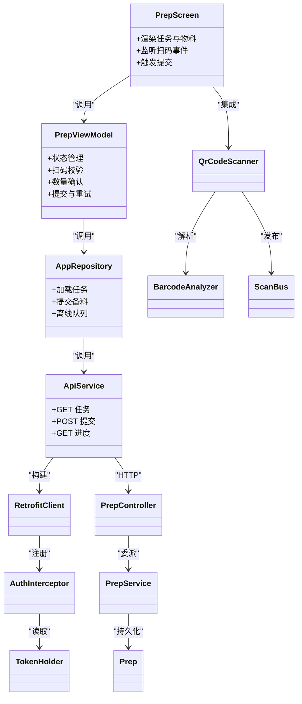

# 备料作业

<cite>
**本文引用的文件**   
- [PrepScreen.kt](file://mobile-android/app/src/main/java/com/dip/material/ui/prep/PrepScreen.kt)
- [PrepViewModel.kt](file://mobile-android/app/src/main/java/com/dip/material/ui/prep/PrepViewModel.kt)
- [ApiService.kt](file://mobile-android/app/src/main/java/com/dip/material/data/network/ApiService.kt)
- [RetrofitClient.kt](file://mobile-android/app/src/main/java/com/dip/material/data/network/RetrofitClient.kt)
- [AuthInterceptor.kt](file://mobile-android/app/src/main/java/com/dip/material/data/network/AuthInterceptor.kt)
- [TokenHolder.kt](file://mobile-android/app/src/main/java/com/dip/material/data/network/TokenHolder.kt)
- [AppRepository.kt](file://mobile-android/app/src/main/java/com/dip/material/data/repository/AppRepository.kt)
- [Models.kt](file://mobile-android/app/src/main/java/com/dip/material/data/models/Models.kt)
- [BarcodeAnalyzer.kt](file://mobile-android/app/src/main/java/com/dip/material/ui/components/BarcodeAnalyzer.kt)
- [QrCodeScanner.kt](file://mobile-android/app/src/main/java/com/dip/material/ui/components/QrCodeScanner.kt)
- [ScanBus.kt](file://mobile-android/app/src/main/java/com/dip/material/utils/ScanBus.kt)
- [ScanConfig.kt](file://mobile-android/app/src/main/java/com/dip/material/utils/ScanConfig.kt)
- [ScanSoundManager.kt](file://mobile-android/app/src/main/java/com/dip/material/utils/ScanSoundManager.kt)
- [PrepController.cs](file://dip-system/api/Controllers/PrepController.cs)
- [PrepService.cs](file://dip-system/api/Services/PrepService.cs)
- [Prep.cs](file://dip-system/api/Models/Prep.cs)
</cite>

## 目录
1. [简介](#简介)
2. [项目结构](#项目结构)
3. [核心组件](#核心组件)
4. [架构总览](#架构总览)
5. [详细组件分析](#详细组件分析)
6. [依赖关系分析](#依赖关系分析)
7. [性能考量](#性能考量)
8. [故障排查指南](#故障排查指南)
9. [结论](#结论)
10. [附录](#附录)

## 简介
本文件面向DIP系统Android应用的“备料作业”功能，覆盖从任务接收、物料核对、条码扫描验证、数量确认到完成确认与批次记录的全流程。文档同时说明界面交互、数据绑定、状态管理、异常处理与重试机制，以及前后端通信、数据同步策略与离线处理能力，帮助开发者与实施人员快速理解并稳定运行该模块。

## 项目结构
备料作业在Android端采用MVVM架构：UI层（Compose）通过ViewModel协调业务逻辑，Repository统一数据访问，网络层基于Retrofit+OkHttp实现API调用与鉴权拦截，扫码能力由专用组件提供，后端以ASP.NET Core API提供服务。

图表来源
- [PrepScreen.kt](file://mobile-android/app/src/main/java/com/dip/material/ui/prep/PrepScreen.kt)
- [PrepViewModel.kt](file://mobile-android/app/src/main/java/com/dip/material/ui/prep/PrepViewModel.kt)
- [AppRepository.kt](file://mobile-android/app/src/main/java/com/dip/material/data/repository/AppRepository.kt)
- [ApiService.kt](file://mobile-android/app/src/main/java/com/dip/material/data/network/ApiService.kt)
- [RetrofitClient.kt](file://mobile-android/app/src/main/java/com/dip/material/data/network/RetrofitClient.kt)
- [AuthInterceptor.kt](file://mobile-android/app/src/main/java/com/dip/material/data/network/AuthInterceptor.kt)
- [TokenHolder.kt](file://mobile-android/app/src/main/java/com/dip/material/data/network/TokenHolder.kt)
- [QrCodeScanner.kt](file://mobile-android/app/src/main/java/com/dip/material/ui/components/QrCodeScanner.kt)
- [BarcodeAnalyzer.kt](file://mobile-android/app/src/main/java/com/dip/material/ui/components/BarcodeAnalyzer.kt)
- [ScanBus.kt](file://mobile-android/app/src/main/java/com/dip/material/utils/ScanBus.kt)
- [ScanConfig.kt](file://mobile-android/app/src/main/java/com/dip/material/utils/ScanConfig.kt)
- [ScanSoundManager.kt](file://mobile-android/app/src/main/java/com/dip/material/utils/ScanSoundManager.kt)
- [PrepController.cs](file://dip-system/api/Controllers/PrepController.cs)
- [PrepService.cs](file://dip-system/api/Services/PrepService.cs)
- [Prep.cs](file://dip-system/api/Models/Prep.cs)

章节来源
- [PrepScreen.kt](file://mobile-android/app/src/main/java/com/dip/material/ui/prep/PrepScreen.kt)
- [PrepViewModel.kt](file://mobile-android/app/src/main/java/com/dip/material/ui/prep/PrepViewModel.kt)
- [ApiService.kt](file://mobile-android/app/src/main/java/com/dip/material/data/network/ApiService.kt)
- [RetrofitClient.kt](file://mobile-android/app/src/main/java/com/dip/material/data/network/RetrofitClient.kt)
- [AuthInterceptor.kt](file://mobile-android/app/src/main/java/com/dip/material/data/network/AuthInterceptor.kt)
- [TokenHolder.kt](file://mobile-android/app/src/main/java/com/dip/material/data/network/TokenHolder.kt)
- [AppRepository.kt](file://mobile-android/app/src/main/java/com/dip/material/data/repository/AppRepository.kt)
- [Models.kt](file://mobile-android/app/src/main/java/com/dip/material/data/models/Models.kt)
- [QrCodeScanner.kt](file://mobile-android/app/src/main/java/com/dip/material/ui/components/QrCodeScanner.kt)
- [BarcodeAnalyzer.kt](file://mobile-android/app/src/main/java/com/dip/material/ui/components/BarcodeAnalyzer.kt)
- [ScanBus.kt](file://mobile-android/app/src/main/java/com/dip/material/utils/ScanBus.kt)
- [ScanConfig.kt](file://mobile-android/app/src/main/java/com/dip/material/utils/ScanConfig.kt)
- [ScanSoundManager.kt](file://mobile-android/app/src/main/java/com/dip/material/utils/ScanSoundManager.kt)
- [PrepController.cs](file://dip-system/api/Controllers/PrepController.cs)
- [PrepService.cs](file://dip-system/api/Services/PrepService.cs)
- [Prep.cs](file://dip-system/api/Models/Prep.cs)

## 核心组件
- 界面层（PrepScreen）：负责展示备料任务列表、物料明细、扫码输入框、数量输入与操作按钮；监听扫码事件与用户操作，驱动ViewModel更新状态。
- 视图模型（PrepViewModel）：维护备料任务与物料状态、校验结果、错误提示、进度与完成标记；编排扫码、校验、提交等业务流程。
- 数据仓库（AppRepository）：封装对后端的API调用、本地缓存与离线队列；对外暴露统一的加载、提交、重试接口。
- 网络层（RetrofitClient + ApiService + AuthInterceptor + TokenHolder）：定义API契约、构建HTTP客户端、注入认证头、持有与刷新令牌。
- 扫码子系统（QrCodeScanner / BarcodeAnalyzer / ScanBus / ScanConfig / ScanSoundManager）：采集条码、解析内容、分发至订阅者、播放提示音、读取配置。
- 后端（PrepController / PrepService / Prep.cs）：提供备料任务的查询、校验、提交、进度与批次记录接口，执行业务规则与持久化。

章节来源
- [PrepScreen.kt](file://mobile-android/app/src/main/java/com/dip/material/ui/prep/PrepScreen.kt)
- [PrepViewModel.kt](file://mobile-android/app/src/main/java/com/dip/material/ui/prep/PrepViewModel.kt)
- [AppRepository.kt](file://mobile-android/app/src/main/java/com/dip/material/data/repository/AppRepository.kt)
- [ApiService.kt](file://mobile-android/app/src/main/java/com/dip/material/data/network/ApiService.kt)
- [RetrofitClient.kt](file://mobile-android/app/src/main/java/com/dip/material/data/network/RetrofitClient.kt)
- [AuthInterceptor.kt](file://mobile-android/app/src/main/java/com/dip/material/data/network/AuthInterceptor.kt)
- [TokenHolder.kt](file://mobile-android/app/src/main/java/com/dip/material/data/network/TokenHolder.kt)
- [QrCodeScanner.kt](file://mobile-android/app/src/main/java/com/dip/material/ui/components/QrCodeScanner.kt)
- [BarcodeAnalyzer.kt](file://mobile-android/app/src/main/java/com/dip/material/ui/components/BarcodeAnalyzer.kt)
- [ScanBus.kt](file://mobile-android/app/src/main/java/com/dip/material/utils/ScanBus.kt)
- [ScanConfig.kt](file://mobile-android/app/src/main/java/com/dip/material/utils/ScanConfig.kt)
- [ScanSoundManager.kt](file://mobile-android/app/src/main/java/com/dip/material/utils/ScanSoundManager.kt)
- [PrepController.cs](file://dip-system/api/Controllers/PrepController.cs)
- [PrepService.cs](file://dip-system/api/Services/PrepService.cs)
- [Prep.cs](file://dip-system/api/Models/Prep.cs)

## 架构总览
备料作业端到端流程如下：
- 任务接收：前端拉取待备料任务与物料清单，显示于界面。
- 扫码核对：扫描物料条码，自动匹配物料项，进行编码/批次/效期等校验。
- 数量确认：逐条确认实收数量，支持增量累计与差异提示。
- 提交完成：汇总校验通过后提交，后端返回批次号与完成状态。
- 进度跟踪：实时反馈各物料校验与提交进度，失败可重试。
- 离线处理：网络不可用时将提交写入本地队列，恢复后自动重试。

图表来源
- [PrepScreen.kt](file://mobile-android/app/src/main/java/com/dip/material/ui/prep/PrepScreen.kt)
- [PrepViewModel.kt](file://mobile-android/app/src/main/java/com/dip/material/ui/prep/PrepViewModel.kt)
- [AppRepository.kt](file://mobile-android/app/src/main/java/com/dip/material/data/repository/AppRepository.kt)
- [ApiService.kt](file://mobile-android/app/src/main/java/com/dip/material/data/network/ApiService.kt)
- [RetrofitClient.kt](file://mobile-android/app/src/main/java/com/dip/material/data/network/RetrofitClient.kt)
- [PrepController.cs](file://dip-system/api/Controllers/PrepController.cs)
- [PrepService.cs](file://dip-system/api/Services/PrepService.cs)

## 详细组件分析

### 备料界面（PrepScreen）
- 职责：展示任务与物料明细、扫码输入框、数量输入、操作按钮；响应扫码广播与用户点击。
- 数据绑定：通过State收集任务、物料、校验结果、错误信息、进度与完成状态；使用组合式函数按需刷新。
- 交互流程：
  - 进入页面时触发加载任务。
  - 聚焦扫码输入框，监听ScanBus事件，解析条码并传递给ViewModel。
  - 用户修改数量后，实时更新本地状态并在提交前做基础校验。
  - 提交成功后更新整体进度与完成标记，必要时弹出提示。

章节来源
- [PrepScreen.kt](file://mobile-android/app/src/main/java/com/dip/material/ui/prep/PrepScreen.kt)

### 视图模型（PrepViewModel）
- 职责：维护备料状态机（空闲/加载中/校验中/提交中/完成/失败），编排扫码校验、数量确认、提交与重试。
- 关键流程：
  - 加载任务：调用Repository获取任务与物料，设置加载状态与初始数据。
  - 扫码校验：根据条码匹配物料，执行编码、批次、效期等校验，生成差异提示。
  - 数量确认：累计已确认数量，限制不超过需求数量，超限给出提示。
  - 提交完成：组装提交载荷，调用Repository提交，处理成功/失败分支，更新进度与批次号。
  - 错误处理：捕获网络与业务异常，转换为友好提示，支持重试。
- 状态管理：使用不可变状态对象，避免竞态条件；通过副作用（如Toast、导航）与UI解耦。

章节来源
- [PrepViewModel.kt](file://mobile-android/app/src/main/java/com/dip/material/ui/prep/PrepViewModel.kt)

### 数据仓库（AppRepository）
- 职责：统一数据源，封装网络请求、本地缓存与离线队列；对外暴露简洁的协程接口。
- 关键点：
  - 网络调用：委托ApiService发起请求，处理通用错误码与消息。
  - 离线队列：提交失败时将请求入队，网络恢复后按序重试。
  - 缓存策略：任务与物料列表短期缓存，减少重复请求。
  - 并发控制：同一任务提交串行化，避免重复提交。

章节来源
- [AppRepository.kt](file://mobile-android/app/src/main/java/com/dip/material/data/repository/AppRepository.kt)

### 网络层（RetrofitClient + ApiService + AuthInterceptor + TokenHolder）
- RetrofitClient：构建OkHttpClient，注册拦截器、序列化器与超时配置。
- ApiService：声明备料相关API端点（任务查询、提交、进度、批次记录）。
- AuthInterceptor：为每个请求注入Authorization头，处理401重登流程。
- TokenHolder：集中管理Token生命周期，支持刷新与失效清理。

章节来源
- [RetrofitClient.kt](file://mobile-android/app/src/main/java/com/dip/material/data/network/RetrofitClient.kt)
- [ApiService.kt](file://mobile-android/app/src/main/java/com/dip/material/data/network/ApiService.kt)
- [AuthInterceptor.kt](file://mobile-android/app/src/main/java/com/dip/material/data/network/AuthInterceptor.kt)
- [TokenHolder.kt](file://mobile-android/app/src/main/java/com/dip/material/data/network/TokenHolder.kt)

### 扫码子系统（QrCodeScanner / BarcodeAnalyzer / ScanBus / ScanConfig / ScanSoundManager）
- QrCodeScanner：相机预览与二维码/条码识别，回调原始字符串。
- BarcodeAnalyzer：对原始字符串进行格式校验与字段提取（如物料编码、批次、效期）。
- ScanBus：事件总线，发布/订阅扫码结果，解耦采集与消费。
- ScanConfig：读取扫码设备配置（如是否自动回车、提示音开关）。
- ScanSoundManager：播放成功/失败提示音，提升操作反馈。

章节来源
- [QrCodeScanner.kt](file://mobile-android/app/src/main/java/com/dip/material/ui/components/QrCodeScanner.kt)
- [BarcodeAnalyzer.kt](file://mobile-android/app/src/main/java/com/dip/material/ui/components/BarcodeAnalyzer.kt)
- [ScanBus.kt](file://mobile-android/app/src/main/java/com/dip/material/utils/ScanBus.kt)
- [ScanConfig.kt](file://mobile-android/app/src/main/java/com/dip/material/utils/ScanConfig.kt)
- [ScanSoundManager.kt](file://mobile-android/app/src/main/java/com/dip/material/utils/ScanSoundManager.kt)

### 后端接口（PrepController / PrepService / Prep.cs）
- PrepController：暴露REST API，参数校验、权限检查、异常包装。
- PrepService：实现备料业务逻辑（任务分配、物料核对、数量校验、提交落库、批次生成）。
- Prep.cs：定义备料任务、物料明细、提交记录等实体结构与约束。

章节来源
- [PrepController.cs](file://dip-system/api/Controllers/PrepController.cs)
- [PrepService.cs](file://dip-system/api/Services/PrepService.cs)
- [Prep.cs](file://dip-system/api/Models/Prep.cs)

### 备料任务接收与物料核对流程

图表来源
- [PrepViewModel.kt](file://mobile-android/app/src/main/java/com/dip/material/ui/prep/PrepViewModel.kt)
- [AppRepository.kt](file://mobile-android/app/src/main/java/com/dip/material/data/repository/AppRepository.kt)
- [ApiService.kt](file://mobile-android/app/src/main/java/com/dip/material/data/network/ApiService.kt)
- [PrepController.cs](file://dip-system/api/Controllers/PrepController.cs)
- [PrepService.cs](file://dip-system/api/Services/PrepService.cs)

## 依赖关系分析
- UI层依赖ViewModel，不直接访问网络或数据库。
- ViewModel依赖Repository，屏蔽数据源细节。
- Repository依赖RetrofitClient与ApiService，统一错误处理与重试。
- 扫码子系统通过ScanBus与ViewModel解耦，便于扩展更多扫码设备。
- 后端控制器与服务分离，服务专注业务规则，控制器负责协议适配。

图表来源
- [PrepScreen.kt](file://mobile-android/app/src/main/java/com/dip/material/ui/prep/PrepScreen.kt)
- [PrepViewModel.kt](file://mobile-android/app/src/main/java/com/dip/material/ui/prep/PrepViewModel.kt)
- [AppRepository.kt](file://mobile-android/app/src/main/java/com/dip/material/data/repository/AppRepository.kt)
- [ApiService.kt](file://mobile-android/app/src/main/java/com/dip/material/data/network/ApiService.kt)
- [RetrofitClient.kt](file://mobile-android/app/src/main/java/com/dip/material/data/network/RetrofitClient.kt)
- [AuthInterceptor.kt](file://mobile-android/app/src/main/java/com/dip/material/data/network/AuthInterceptor.kt)
- [TokenHolder.kt](file://mobile-android/app/src/main/java/com/dip/material/data/network/TokenHolder.kt)
- [QrCodeScanner.kt](file://mobile-android/app/src/main/java/com/dip/material/ui/components/QrCodeScanner.kt)
- [BarcodeAnalyzer.kt](file://mobile-android/app/src/main/java/com/dip/material/ui/components/BarcodeAnalyzer.kt)
- [ScanBus.kt](file://mobile-android/app/src/main/java/com/dip/material/utils/ScanBus.kt)
- [PrepController.cs](file://dip-system/api/Controllers/PrepController.cs)
- [PrepService.cs](file://dip-system/api/Services/PrepService.cs)
- [Prep.cs](file://dip-system/api/Models/Prep.cs)

## 性能考量
- 列表渲染优化：仅对变更的物料项重组，避免全量刷新。
- 网络请求合并：批量提交时聚合请求，减少往返次数。
- 缓存策略：任务与物料短时效缓存，降低重复请求。
- 扫码解析异步：避免阻塞主线程，使用协程/后台线程处理。
- 重试退避：指数退避与最大重试次数，防止雪崩。
- 内存管理：及时释放相机资源与监听器，避免泄漏。

## 故障排查指南
- 无法加载任务
  - 检查网络连通性与Token有效性。
  - 查看ApiService日志与后端返回码。
  - 确认AuthInterceptor是否正确注入Authorization头。
- 扫码无效
  - 检查ScanBus订阅是否注册。
  - 验证BarcodeAnalyzer解析规则与设备配置。
  - 确认相机权限与摄像头可用。
- 提交失败
  - 查看后端PrepController/PrepService日志。
  - 检查离线队列是否积压，恢复后是否自动重试。
  - 确认数量校验与必填字段是否符合业务规则。
- 提示音异常
  - 检查ScanSoundManager音量与媒体通道设置。
  - 确认ScanConfig中提示音开关未关闭。

章节来源
- [ApiService.kt](file://mobile-android/app/src/main/java/com/dip/material/data/network/ApiService.kt)
- [RetrofitClient.kt](file://mobile-android/app/src/main/java/com/dip/material/data/network/RetrofitClient.kt)
- [AuthInterceptor.kt](file://mobile-android/app/src/main/java/com/dip/material/data/network/AuthInterceptor.kt)
- [TokenHolder.kt](file://mobile-android/app/src/main/java/com/dip/material/data/network/TokenHolder.kt)
- [ScanBus.kt](file://mobile-android/app/src/main/java/com/dip/material/utils/ScanBus.kt)
- [BarcodeAnalyzer.kt](file://mobile-android/app/src/main/java/com/dip/material/ui/components/BarcodeAnalyzer.kt)
- [ScanConfig.kt](file://mobile-android/app/src/main/java/com/dip/material/utils/ScanConfig.kt)
- [ScanSoundManager.kt](file://mobile-android/app/src/main/java/com/dip/material/utils/ScanSoundManager.kt)
- [PrepController.cs](file://dip-system/api/Controllers/PrepController.cs)
- [PrepService.cs](file://dip-system/api/Services/PrepService.cs)

## 结论
备料作业模块通过清晰的MVVM分层、稳健的网络与扫码子系统、完善的异常与重试机制，实现了从任务接收到完成确认的闭环流程。结合后端API与离线队列，保证了高可用与一致性。建议在生产环境持续监控网络与扫码质量，完善日志与告警，以提升现场作业效率与稳定性。

## 附录
- 术语说明
  - 备料任务：生产计划下发的物料准备任务，包含物料清单与需求数量。
  - 物料核对：依据条码匹配物料，校验编码、批次、效期等属性。
  - 数量确认：逐条确认实收数量，累计并与需求对比。
  - 批次记录：提交成功后生成的批次号与明细记录，用于追溯。
- 最佳实践
  - 保持状态不可变，避免并发冲突。
  - 所有外部IO（网络、扫码、存储）异步化。
  - 对用户可见的错误提供明确原因与可操作建议。
  - 离线场景下保证最终一致性与幂等性。