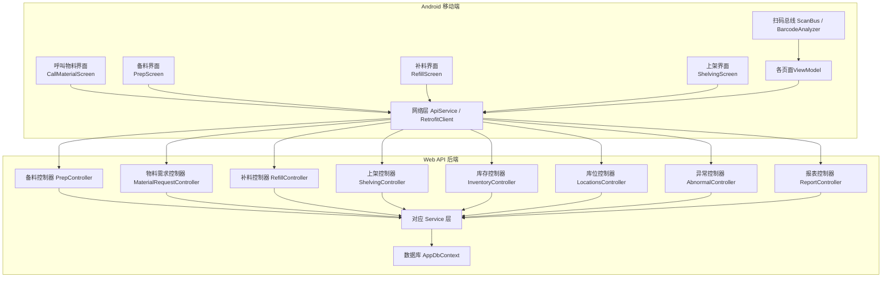
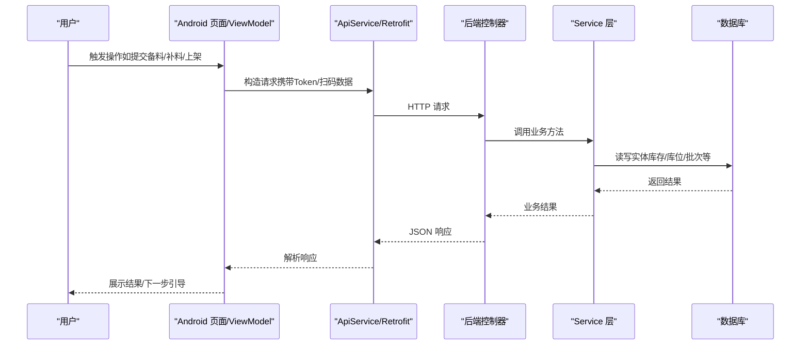
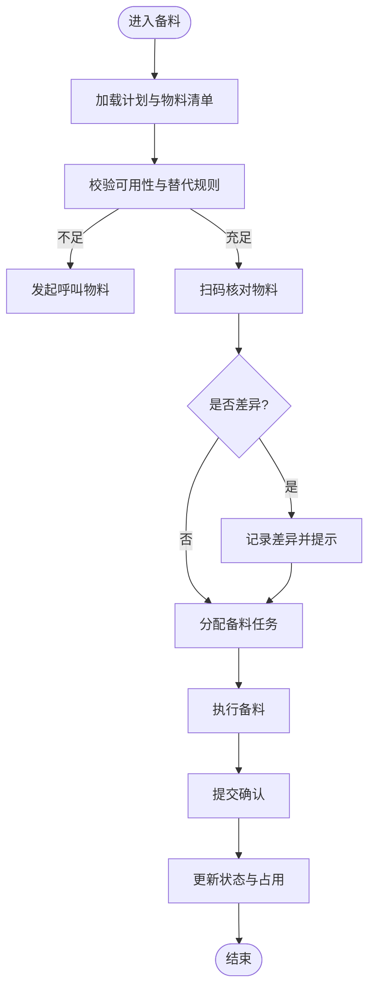
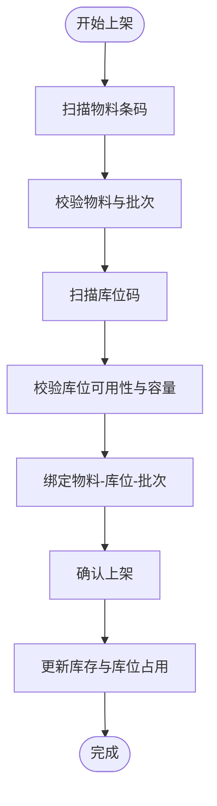
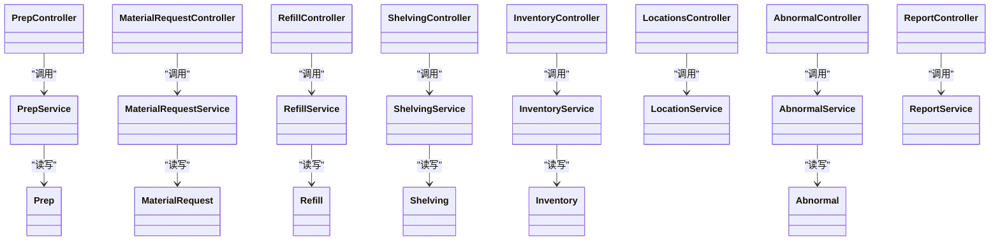

# 生产作业模块

<cite>
**本文引用的文件**   
- [PrepController.cs](file://dip-system/api/Controllers/PrepController.cs)
- [PrepService.cs](file://dip-system/api/Services/PrepService.cs)
- [Prep.cs](file://dip-system/api/Models/Prep.cs)
- [MaterialRequestController.cs](file://dip-system/api/Controllers/MaterialRequestController.cs)
- [MaterialRequestService.cs](file://dip-system/api/Services/MaterialRequestService.cs)
- [MaterialRequest.cs](file://dip-system/api/Models/MaterialRequest.cs)
- [RefillController.cs](file://dip-system/api/Controllers/RefillController.cs)
- [RefillService.cs](file://dip-system/api/Services/RefillService.cs)
- [Refill.cs](file://dip-system/api/Models/Refill.cs)
- [ShelvingController.cs](file://dip-system/api/Controllers/ShelvingController.cs)
- [ShelvingService.cs](file://dip-system/api/Services/ShelvingService.cs)
- [Shelving.cs](file://dip-system/api/Models/Shelving.cs)
- [InventoryController.cs](file://dip-system/api/Controllers/InventoryController.cs)
- [InventoryService.cs](file://dip-system/api/Services/InventoryService.cs)
- [Inventory.cs](file://dip-system/api/Models/Inventory.cs)
- [LocationsController.cs](file://dip-system/api/Controllers/LocationsController.cs)
- [LocationService.cs](file://dip-system/api/Services/LocationService.cs)
- [AbnormalController.cs](file://dip-system/api/Controllers/AbnormalController.cs)
- [AbnormalService.cs](file://dip-system/api/Services/AbnormalService.cs)
- [Abnormal.cs](file://dip-system/api/Models/Abnormal.cs)
- [ReportController.cs](file://dip-system/api/Controllers/ReportController.cs)
- [ReportService.cs](file://dip-system/api/Services/ReportService.cs)
- [AppDbContext.cs](file://dip-system/api/Data/AppDbContext.cs)
- [CallMaterialScreen.kt](file://mobile-android/app/src/main/java/com/dip/material/ui/callmaterial/CallMaterialScreen.kt)
- [CallMaterialViewModel.kt](file://mobile-android/app/src/main/java/com/dip/material/ui/callmaterial/CallMaterialViewModel.kt)
- [PrepScreen.kt](file://mobile-android/app/src/main/java/com/dip/material/ui/prep/PrepScreen.kt)
- [PrepViewModel.kt](file://mobile-android/app/src/main/java/com/dip/material/ui/prep/PrepViewModel.kt)
- [RefillScreen.kt](file://mobile-android/app/src/main/java/com/dip/material/ui/refill/RefillScreen.kt)
- [RefillViewModel.kt](file://mobile-android/app/src/main/java/com/dip/material/ui/refill/RefillViewModel.kt)
- [ShelvingScreen.kt](file://mobile-android/app/src/main/java/com/dip/material/ui/shelving/ShelvingScreen.kt)
- [ShelvingViewModel.kt](file://mobile-android/app/src/main/java/com/dip/material/ui/shelving/ShelvingViewModel.kt)
- [ApiService.kt](file://mobile-android/app/src/main/java/com/dip/material/data/network/ApiService.kt)
- [RetrofitClient.kt](file://mobile-android/app/src/main/java/com/dip/material/data/network/RetrofitClient.kt)
- [AuthInterceptor.kt](file://mobile-android/app/src/main/java/com/dip/material/data/network/AuthInterceptor.kt)
- [ScanBus.kt](file://mobile-android/app/src/main/java/com/dip/material/utils/ScanBus.kt)
- [BarcodeAnalyzer.kt](file://mobile-android/app/src/main/java/com/dip/material/ui/components/BarcodeAnalyzer.kt)
</cite>

## 目录
1. [引言](#引言)
2. [项目结构](#项目结构)
3. [核心组件](#核心组件)
4. [架构总览](#架构总览)
5. [详细组件分析](#详细组件分析)
6. [依赖关系分析](#依赖关系分析)
7. [性能考虑](#性能考虑)
8. [故障排查指南](#故障排查指南)
9. [结论](#结论)
10. [附录](#附录)

## 引言
本文件面向DIP系统Android应用的生产作业模块，覆盖备料、补料与上架三大核心流程，并补充生产状态监控、异常处理、进度反馈、效率统计、质量追溯与合规性检查等能力说明。文档以“从前端到后端”的端到端视角组织，既便于一线作业人员理解操作路径，也便于开发者定位实现细节。

## 项目结构
生产作业模块由Android移动端与.NET Web API后端组成：
- Android端负责扫码采集、界面交互、本地状态管理与网络请求封装。
- 后端提供REST接口，承载业务逻辑、数据持久化与跨模块协作（库存、位置、物料需求、异常、报表等）。



图表来源
- [PrepController.cs](file://dip-system/api/Controllers/PrepController.cs)
- [MaterialRequestController.cs](file://dip-system/api/Controllers/MaterialRequestController.cs)
- [RefillController.cs](file://dip-system/api/Controllers/RefillController.cs)
- [ShelvingController.cs](file://dip-system/api/Controllers/ShelvingController.cs)
- [InventoryController.cs](file://dip-system/api/Controllers/InventoryController.cs)
- [LocationsController.cs](file://dip-system/api/Controllers/LocationsController.cs)
- [AbnormalController.cs](file://dip-system/api/Controllers/AbnormalController.cs)
- [ReportController.cs](file://dip-system/api/Controllers/ReportController.cs)
- [AppDbContext.cs](file://dip-system/api/Data/AppDbContext.cs)
- [CallMaterialScreen.kt](file://mobile-android/app/src/main/java/com/dip/material/ui/callmaterial/CallMaterialScreen.kt)
- [PrepScreen.kt](file://mobile-android/app/src/main/java/com/dip/material/ui/prep/PrepScreen.kt)
- [RefillScreen.kt](file://mobile-android/app/src/main/java/com/dip/material/ui/refill/RefillScreen.kt)
- [ShelvingScreen.kt](file://mobile-android/app/src/main/java/com/dip/material/ui/shelving/ShelvingScreen.kt)
- [ApiService.kt](file://mobile-android/app/src/main/java/com/dip/material/data/network/ApiService.kt)
- [RetrofitClient.kt](file://mobile-android/app/src/main/java/com/dip/material/data/network/RetrofitClient.kt)
- [AuthInterceptor.kt](file://mobile-android/app/src/main/java/com/dip/material/data/network/AuthInterceptor.kt)
- [ScanBus.kt](file://mobile-android/app/src/main/java/com/dip/material/utils/ScanBus.kt)
- [BarcodeAnalyzer.kt](file://mobile-android/app/src/main/java/com/dip/material/ui/components/BarcodeAnalyzer.kt)

章节来源
- [AppDbContext.cs](file://dip-system/api/Data/AppDbContext.cs)
- [ApiService.kt](file://mobile-android/app/src/main/java/com/dip/material/data/network/ApiService.kt)
- [RetrofitClient.kt](file://mobile-android/app/src/main/java/com/dip/material/data/network/RetrofitClient.kt)
- [AuthInterceptor.kt](file://mobile-android/app/src/main/java/com/dip/material/data/network/AuthInterceptor.kt)
- [ScanBus.kt](file://mobile-android/app/src/main/java/com/dip/material/utils/ScanBus.kt)
- [BarcodeAnalyzer.kt](file://mobile-android/app/src/main/java/com/dip/material/ui/components/BarcodeAnalyzer.kt)

## 核心组件
- 备料（Prep）：完成备料准备、物料核对、任务分配与执行确认。
- 补料（Refill）：触发条件判断、审批流转、库存扣减与记录。
- 上架（Shelving）：扫描确认、库位管理、批次跟踪与入库登记。
- 支撑能力：库存（Inventory）、库位（Locations）、异常（Abnormal）、报表（Report）。

章节来源
- [PrepController.cs](file://dip-system/api/Controllers/PrepController.cs)
- [PrepService.cs](file://dip-system/api/Services/PrepService.cs)
- [Prep.cs](file://dip-system/api/Models/Prep.cs)
- [MaterialRequestController.cs](file://dip-system/api/Controllers/MaterialRequestController.cs)
- [MaterialRequestService.cs](file://dip-system/api/Services/MaterialRequestService.cs)
- [MaterialRequest.cs](file://dip-system/api/Models/MaterialRequest.cs)
- [RefillController.cs](file://dip-system/api/Controllers/RefillController.cs)
- [RefillService.cs](file://dip-system/api/Services/RefillService.cs)
- [Refill.cs](file://dip-system/api/Models/Refill.cs)
- [ShelvingController.cs](file://dip-system/api/Controllers/ShelvingController.cs)
- [ShelvingService.cs](file://dip-system/api/Services/ShelvingService.cs)
- [Shelving.cs](file://dip-system/api/Models/Shelving.cs)
- [InventoryController.cs](file://dip-system/api/Controllers/InventoryController.cs)
- [InventoryService.cs](file://dip-system/api/Services/InventoryService.cs)
- [Inventory.cs](file://dip-system/api/Models/Inventory.cs)
- [LocationsController.cs](file://dip-system/api/Controllers/LocationsController.cs)
- [LocationService.cs](file://dip-system/api/Services/LocationService.cs)
- [AbnormalController.cs](file://dip-system/api/Controllers/AbnormalController.cs)
- [AbnormalService.cs](file://dip-system/api/Services/AbnormalService.cs)
- [Abnormal.cs](file://dip-system/api/Models/Abnormal.cs)
- [ReportController.cs](file://dip-system/api/Controllers/ReportController.cs)
- [ReportService.cs](file://dip-system/api/Services/ReportService.cs)

## 架构总览
生产作业模块采用“前端页面 + ViewModel + 网络层”与“控制器 + 服务层 + 数据访问”的分层架构。Android端通过统一的ApiService调用后端REST接口；后端控制器仅做参数校验与路由转发，核心业务在Service层实现，并通过Entity Framework上下文访问数据库。



图表来源
- [ApiService.kt](file://mobile-android/app/src/main/java/com/dip/material/data/network/ApiService.kt)
- [RetrofitClient.kt](file://mobile-android/app/src/main/java/com/dip/material/data/network/RetrofitClient.kt)
- [AuthInterceptor.kt](file://mobile-android/app/src/main/java/com/dip/material/data/network/AuthInterceptor.kt)
- [PrepController.cs](file://dip-system/api/Controllers/PrepController.cs)
- [PrepService.cs](file://dip-system/api/Services/PrepService.cs)
- [AppDbContext.cs](file://dip-system/api/Data/AppDbContext.cs)

## 详细组件分析

### 备料作业（Prep）
- 准备工作
  - 选择工单/批次，加载所需物料清单。
  - 校验物料可用性（库存、替代策略、有效期）。
- 物料核对
  - 扫码比对条码与BOM/需求单，记录差异。
  - 支持批量核对与快速纠错。
- 任务分配
  - 将备料任务下发至指定工位/人员。
  - 支持分派、回退、重分配。
- 执行与确认
  - 完成后提交确认，更新备料状态与库存占用。
  - 生成备料记录用于追溯。



图表来源
- [PrepController.cs](file://dip-system/api/Controllers/PrepController.cs)
- [PrepService.cs](file://dip-system/api/Services/PrepService.cs)
- [Prep.cs](file://dip-system/api/Models/Prep.cs)
- [MaterialRequestController.cs](file://dip-system/api/Controllers/MaterialRequestController.cs)
- [MaterialRequestService.cs](file://dip-system/api/Services/MaterialRequestService.cs)
- [MaterialRequest.cs](file://dip-system/api/Models/MaterialRequest.cs)
- [CallMaterialScreen.kt](file://mobile-android/app/src/main/java/com/dip/material/ui/callmaterial/CallMaterialScreen.kt)
- [CallMaterialViewModel.kt](file://mobile-android/app/src/main/java/com/dip/material/ui/callmaterial/CallMaterialViewModel.kt)
- [PrepScreen.kt](file://mobile-android/app/src/main/java/com/dip/material/ui/prep/PrepScreen.kt)
- [PrepViewModel.kt](file://mobile-android/app/src/main/java/com/dip/material/ui/prep/PrepViewModel.kt)

章节来源
- [PrepController.cs](file://dip-system/api/Controllers/PrepController.cs)
- [PrepService.cs](file://dip-system/api/Services/PrepService.cs)
- [Prep.cs](file://dip-system/api/Models/Prep.cs)
- [MaterialRequestController.cs](file://dip-system/api/Controllers/MaterialRequestController.cs)
- [MaterialRequestService.cs](file://dip-system/api/Services/MaterialRequestService.cs)
- [MaterialRequest.cs](file://dip-system/api/Models/MaterialRequest.cs)
- [CallMaterialScreen.kt](file://mobile-android/app/src/main/java/com/dip/material/ui/callmaterial/CallMaterialScreen.kt)
- [CallMaterialViewModel.kt](file://mobile-android/app/src/main/java/com/dip/material/ui/callmaterial/CallMaterialViewModel.kt)
- [PrepScreen.kt](file://mobile-android/app/src/main/java/com/dip/material/ui/prep/PrepScreen.kt)
- [PrepViewModel.kt](file://mobile-android/app/src/main/java/com/dip/material/ui/prep/PrepViewModel.kt)

### 补料流程（Refill）
- 触发条件
  - 线边库存低于阈值或按消耗自动触发。
  - 人工发起补料申请。
- 审批流程
  - 创建补料申请，走审批流（可配置多级审批）。
  - 审批通过后生成补料任务。
- 库存调整
  - 出库扣减、在途登记、到货确认。
  - 与备料/上线消耗联动，确保账实一致。

```mermaid
sequenceDiagram
participant U as "用户"
participant R as "补料界面/ViewModel"
participant API as "ApiService"
participant RC as "RefillController"
participant RS as "RefillService"
participant INV as "InventoryService"
participant DB as "数据库"
U->>R : 发起补料申请
R->>API : POST 补料申请
API->>RC : 路由到控制器
RC->>RS : 校验与创建申请
RS->>DB : 写入申请记录
DB-->>RS : 成功
RS-->>RC : 返回申请ID
RC-->>API : 返回结果
API-->>R : 展示审批状态
Note over R,RS : 审批通过后自动生成补料任务
R->>API : 提交出库/到货确认
API->>RC->>RS->>INV->>DB : 扣减库存并登记流水
```

图表来源
- [RefillController.cs](file://dip-system/api/Controllers/RefillController.cs)
- [RefillService.cs](file://dip-system/api/Services/RefillService.cs)
- [Refill.cs](file://dip-system/api/Models/Refill.cs)
- [InventoryController.cs](file://dip-system/api/Controllers/InventoryController.cs)
- [InventoryService.cs](file://dip-system/api/Services/InventoryService.cs)
- [Inventory.cs](file://dip-system/api/Models/Inventory.cs)
- [RefillScreen.kt](file://mobile-android/app/src/main/java/com/dip/material/ui/refill/RefillScreen.kt)
- [RefillViewModel.kt](file://mobile-android/app/src/main/java/com/dip/material/ui/refill/RefillViewModel.kt)
- [ApiService.kt](file://mobile-android/app/src/main/java/com/dip/material/data/network/ApiService.kt)

章节来源
- [RefillController.cs](file://dip-system/api/Controllers/RefillController.cs)
- [RefillService.cs](file://dip-system/api/Services/RefillService.cs)
- [Refill.cs](file://dip-system/api/Models/Refill.cs)
- [InventoryController.cs](file://dip-system/api/Controllers/InventoryController.cs)
- [InventoryService.cs](file://dip-system/api/Services/InventoryService.cs)
- [Inventory.cs](file://dip-system/api/Models/Inventory.cs)
- [RefillScreen.kt](file://mobile-android/app/src/main/java/com/dip/material/ui/refill/RefillScreen.kt)
- [RefillViewModel.kt](file://mobile-android/app/src/main/java/com/dip/material/ui/refill/RefillViewModel.kt)

### 上架操作（Shelving）
- 扫描确认
  - 扫描物料条码与库位码，进行绑定校验。
  - 支持批次、效期、序列号等多维信息录入。
- 位置管理
  - 库位容量、分区、优先级策略。
  - 推荐库位与冲突检测。
- 批次跟踪
  - 批次号、生产日期、到期日、供应商批号。
  - 正向/反向追溯查询。



图表来源
- [ShelvingController.cs](file://dip-system/api/Controllers/ShelvingController.cs)
- [ShelvingService.cs](file://dip-system/api/Services/ShelvingService.cs)
- [Shelving.cs](file://dip-system/api/Models/Shelving.cs)
- [InventoryController.cs](file://dip-system/api/Controllers/InventoryController.cs)
- [InventoryService.cs](file://dip-system/api/Services/InventoryService.cs)
- [Inventory.cs](file://dip-system/api/Models/Inventory.cs)
- [LocationsController.cs](file://dip-system/api/Controllers/LocationsController.cs)
- [LocationService.cs](file://dip-system/api/Services/LocationService.cs)
- [ShelvingScreen.kt](file://mobile-android/app/src/main/java/com/dip/material/ui/shelving/ShelvingScreen.kt)
- [ShelvingViewModel.kt](file://mobile-android/app/src/main/java/com/dip/material/ui/shelving/ShelvingViewModel.kt)
- [ScanBus.kt](file://mobile-android/app/src/main/java/com/dip/material/utils/ScanBus.kt)
- [BarcodeAnalyzer.kt](file://mobile-android/app/src/main/java/com/dip/material/ui/components/BarcodeAnalyzer.kt)

章节来源
- [ShelvingController.cs](file://dip-system/api/Controllers/ShelvingController.cs)
- [ShelvingService.cs](file://dip-system/api/Services/ShelvingService.cs)
- [Shelving.cs](file://dip-system/api/Models/Shelving.cs)
- [InventoryController.cs](file://dip-system/api/Controllers/InventoryController.cs)
- [InventoryService.cs](file://dip-system/api/Services/InventoryService.cs)
- [Inventory.cs](file://dip-system/api/Models/Inventory.cs)
- [LocationsController.cs](file://dip-system/api/Controllers/LocationsController.cs)
- [LocationService.cs](file://dip-system/api/Services/LocationService.cs)
- [ShelvingScreen.kt](file://mobile-android/app/src/main/java/com/dip/material/ui/shelving/ShelvingScreen.kt)
- [ShelvingViewModel.kt](file://mobile-android/app/src/main/java/com/dip/material/ui/shelving/ShelvingViewModel.kt)
- [ScanBus.kt](file://mobile-android/app/src/main/java/com/dip/material/utils/ScanBus.kt)
- [BarcodeAnalyzer.kt](file://mobile-android/app/src/main/java/com/dip/material/ui/components/BarcodeAnalyzer.kt)

### 生产状态监控与进度反馈
- 状态监控
  - 实时查看备料、补料、上架任务状态与进度。
  - 看板聚合关键指标（完成率、阻塞项、异常数）。
- 进度反馈
  - 节点级上报（开始、进行中、完成、异常）。
  - 支持离线缓存与网络恢复后同步。

章节来源
- [PrepController.cs](file://dip-system/api/Controllers/PrepController.cs)
- [PrepService.cs](file://dip-system/api/Services/PrepService.cs)
- [RefillController.cs](file://dip-system/api/Controllers/RefillController.cs)
- [RefillService.cs](file://dip-system/api/Services/RefillService.cs)
- [ShelvingController.cs](file://dip-system/api/Controllers/ShelvingController.cs)
- [ShelvingService.cs](file://dip-system/api/Services/ShelvingService.cs)
- [PrepScreen.kt](file://mobile-android/app/src/main/java/com/dip/material/ui/prep/PrepScreen.kt)
- [PrepViewModel.kt](file://mobile-android/app/src/main/java/com/dip/material/ui/prep/PrepViewModel.kt)
- [RefillScreen.kt](file://mobile-android/app/src/main/java/com/dip/material/ui/refill/RefillScreen.kt)
- [RefillViewModel.kt](file://mobile-android/app/src/main/java/com/dip/material/ui/refill/RefillViewModel.kt)
- [ShelvingScreen.kt](file://mobile-android/app/src/main/java/com/dip/material/ui/shelving/ShelvingScreen.kt)
- [ShelvingViewModel.kt](file://mobile-android/app/src/main/java/com/dip/material/ui/shelving/ShelvingViewModel.kt)

### 异常处理
- 异常类型
  - 物料短缺、条码不匹配、库位冲突、审批失败、网络异常等。
- 处理机制
  - 异常登记、分类、升级、闭环跟踪。
  - 与备料/补料/上架流程联动阻断或告警。

章节来源
- [AbnormalController.cs](file://dip-system/api/Controllers/AbnormalController.cs)
- [AbnormalService.cs](file://dip-system/api/Services/AbnormalService.cs)
- [Abnormal.cs](file://dip-system/api/Models/Abnormal.cs)

### 作业效率统计、质量追溯与合规性检查
- 效率统计
  - 人均产出、任务耗时、瓶颈环节识别。
  - 基于报表接口导出与分析。
- 质量追溯
  - 物料批次、供应商、检验报告关联。
  - 正向/反向追溯链构建。
- 合规性检查
  - 效期控制、替代料合规、审批留痕。
  - 审计日志与不可篡改记录。

章节来源
- [ReportController.cs](file://dip-system/api/Controllers/ReportController.cs)
- [ReportService.cs](file://dip-system/api/Services/ReportService.cs)
- [InventoryController.cs](file://dip-system/api/Controllers/InventoryController.cs)
- [InventoryService.cs](file://dip-system/api/Services/InventoryService.cs)
- [Inventory.cs](file://dip-system/api/Models/Inventory.cs)

## 依赖关系分析
- 控制器与服务解耦：控制器仅做入参校验与响应包装，业务逻辑集中在Service。
- 数据模型清晰：Prep、MaterialRequest、Refill、Shelving、Inventory、Locations、Abnormal、Report等实体明确职责。
- 前后端契约：ApiService定义统一接口，RetrofitClient负责连接与拦截器（鉴权）。
- 扫码链路：ScanBus与BarcodeAnalyzer为Android端扫码输入提供统一通道。



图表来源
- [PrepController.cs](file://dip-system/api/Controllers/PrepController.cs)
- [PrepService.cs](file://dip-system/api/Services/PrepService.cs)
- [Prep.cs](file://dip-system/api/Models/Prep.cs)
- [MaterialRequestController.cs](file://dip-system/api/Controllers/MaterialRequestController.cs)
- [MaterialRequestService.cs](file://dip-system/api/Services/MaterialRequestService.cs)
- [MaterialRequest.cs](file://dip-system/api/Models/MaterialRequest.cs)
- [RefillController.cs](file://dip-system/api/Controllers/RefillController.cs)
- [RefillService.cs](file://dip-system/api/Services/RefillService.cs)
- [Refill.cs](file://dip-system/api/Models/Refill.cs)
- [ShelvingController.cs](file://dip-system/api/Controllers/ShelvingController.cs)
- [ShelvingService.cs](file://dip-system/api/Services/ShelvingService.cs)
- [Shelving.cs](file://dip-system/api/Models/Shelving.cs)
- [InventoryController.cs](file://dip-system/api/Controllers/InventoryController.cs)
- [InventoryService.cs](file://dip-system/api/Services/InventoryService.cs)
- [Inventory.cs](file://dip-system/api/Models/Inventory.cs)
- [LocationsController.cs](file://dip-system/api/Controllers/LocationsController.cs)
- [LocationService.cs](file://dip-system/api/Services/LocationService.cs)
- [AbnormalController.cs](file://dip-system/api/Controllers/AbnormalController.cs)
- [AbnormalService.cs](file://dip-system/api/Services/AbnormalService.cs)
- [Abnormal.cs](file://dip-system/api/Models/Abnormal.cs)
- [ReportController.cs](file://dip-system/api/Controllers/ReportController.cs)
- [ReportService.cs](file://dip-system/api/Services/ReportService.cs)

## 性能考虑
- 网络层
  - 使用Retrofit连接池与超时配置，避免频繁建立连接。
  - 鉴权拦截器缓存Token，减少重复认证开销。
- 数据层
  - 批量操作优先（批量插入/更新），减少往返次数。
  - 热点数据缓存（如库位、字典）降低数据库压力。
- 前端交互
  - 列表分页与懒加载，避免一次性加载大量数据。
  - 扫码输入去抖与合并，减少无效请求。
- 并发与一致性
  - 库存扣减采用事务与乐观锁，防止超卖。
  - 长耗时操作异步化，提升用户体验。

[本节为通用指导，无需特定文件引用]

## 故障排查指南
- 常见问题
  - 扫码无响应：检查ScanBus订阅与权限配置。
  - 登录失效：检查AuthInterceptor的Token刷新逻辑。
  - 库存不一致：核查事务边界与并发锁策略。
  - 审批卡住：查看审批流状态与审批人权限。
- 定位步骤
  - 前端日志：打印请求URL、参数与响应体。
  - 后端日志：关注异常堆栈与SQL执行时间。
  - 数据核对：对比中间表与最终表的一致性。
  - 复现用例：最小化场景验证问题根因。

章节来源
- [AbnormalController.cs](file://dip-system/api/Controllers/AbnormalController.cs)
- [AbnormalService.cs](file://dip-system/api/Services/AbnormalService.cs)
- [Abnormal.cs](file://dip-system/api/Models/Abnormal.cs)
- [AuthInterceptor.kt](file://mobile-android/app/src/main/java/com/dip/material/data/network/AuthInterceptor.kt)
- [ScanBus.kt](file://mobile-android/app/src/main/java/com/dip/material/utils/ScanBus.kt)

## 结论
生产作业模块围绕备料、补料、上架三大主线，结合库存、库位、异常与报表等支撑能力，形成完整的端到端闭环。通过清晰的层次划分与稳定的前后端契约，既能满足现场作业的高效与准确，也为后续扩展（多产品订单、替代策略优化等）奠定基础。建议持续完善监控与审计能力，强化数据一致性与可追溯性。

[本节为总结性内容，无需特定文件引用]

## 附录
- 术语
  - 备料：根据生产计划准备所需物料的过程。
  - 补料：在生产过程中对线边库存的补充行为。
  - 上架：将物料入库并绑定库位与批次的过程。
  - 批次：同一生产/采购批次标识，用于追溯。
- 最佳实践
  - 所有涉及库存变动的操作必须落库并记录流水。
  - 关键节点需有审批留痕与审计日志。
  - 扫码输入需具备强校验与容错提示。

[本节为附加说明，无需特定文件引用]