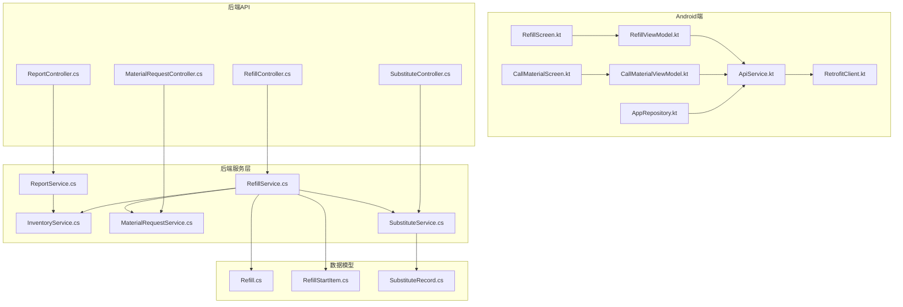
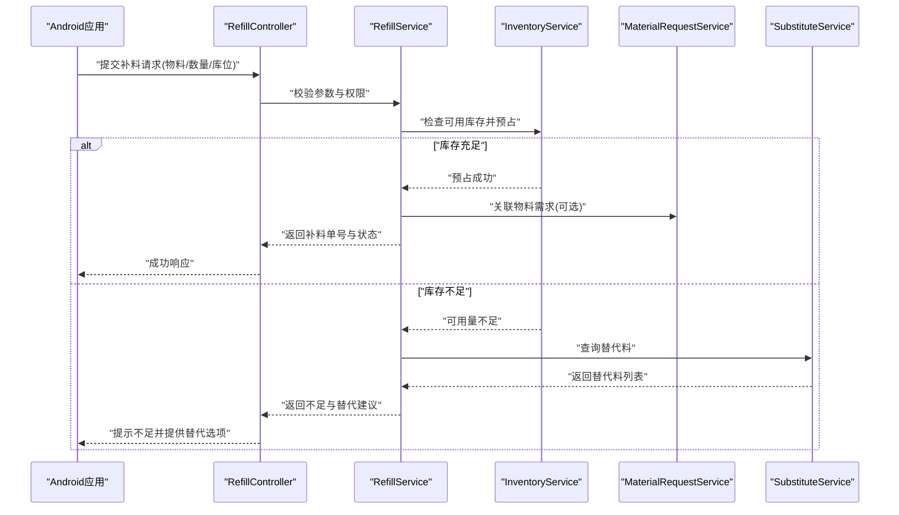
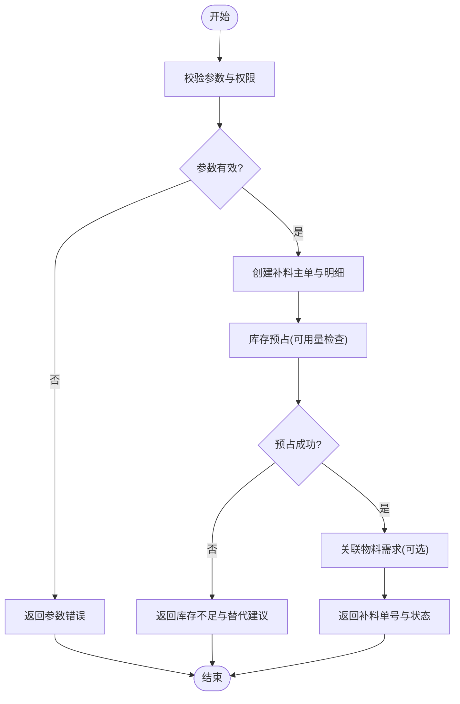
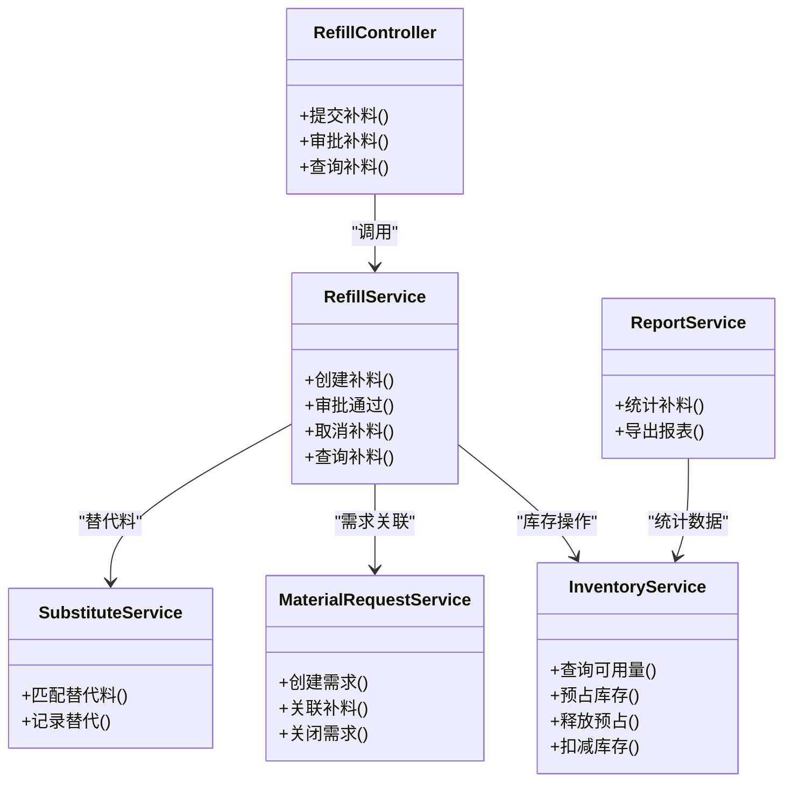

# 补料作业

<cite>
**本文引用的文件**   
- [RefillController.cs](file://dip-system/api/Controllers/RefillController.cs)
- [RefillService.cs](file://dip-system/api/Services/RefillService.cs)
- [Refill.cs](file://dip-system/api/Models/Refill.cs)
- [RefillStartItem.cs](file://dip-system/api/Models/RefillStartItem.cs)
- [InventoryService.cs](file://dip-system/api/Services/InventoryService.cs)
- [MaterialRequestController.cs](file://dip-system/api/Controllers/MaterialRequestController.cs)
- [MaterialRequestService.cs](file://dip-system/api/Services/MaterialRequestService.cs)
- [SubstituteController.cs](file://dip-system/api/Controllers/SubstituteController.cs)
- [SubstituteService.cs](file://dip-system/api/Services/SubstituteService.cs)
- [SubstituteRecord.cs](file://dip-system/api/Models/SubstituteRecord.cs)
- [ReportController.cs](file://dip-system/api/Controllers/ReportController.cs)
- [ReportService.cs](file://dip-system/api/Services/ReportService.cs)
- [CallMaterialScreen.kt](file://mobile-android/app/src/main/java/com/dip/material/ui/callmaterial/CallMaterialScreen.kt)
- [CallMaterialViewModel.kt](file://mobile-android/app/src/main/java/com/dip/material/ui/callmaterial/CallMaterialViewModel.kt)
- [RefillScreen.kt](file://mobile-android/app/src/main/java/com/dip/material/ui/refill/RefillScreen.kt)
- [RefillViewModel.kt](file://mobile-android/app/src/main/java/com/dip/material/ui/refill/RefillViewModel.kt)
- [ApiService.kt](file://mobile-android/app/src/main/java/com/dip/material/data/network/ApiService.kt)
- [RetrofitClient.kt](file://mobile-android/app/src/main/java/com/dip/material/data/network/RetrofitClient.kt)
- [AppRepository.kt](file://mobile-android/app/src/main/java/com/dip/material/data/repository/AppRepository.kt)
</cite>

## 目录
1. [简介](#简介)
2. [项目结构](#项目结构)
3. [核心组件](#核心组件)
4. [架构总览](#架构总览)
5. [详细组件分析](#详细组件分析)
6. [依赖关系分析](#依赖关系分析)
7. [性能考虑](#性能考虑)
8. [故障排查指南](#故障排查指南)
9. [结论](#结论)
10. [附录](#附录)

## 简介
本文件面向DIP系统Android应用的“补料作业”功能，覆盖以下关键内容：
- 补料请求的触发条件与审批流程
- 库存调整逻辑与并发控制策略
- 补料界面操作流程（物料选择、数量确认、位置指定）
- 异常处理、库存不足预警、替代料机制
- 补料记录查询、历史追溯与统计报表
- 状态管理与实时同步方案

该文档以代码为依据，结合前后端实现进行系统化说明，帮助开发与运维人员快速理解并正确使用补料作业能力。

## 项目结构
补料作业涉及后端API控制器与服务层、数据模型以及Android端UI与网络层。整体结构如下：
- 后端
  - 控制器：补料接口、物料需求接口、替代料接口、报表接口等
  - 服务层：补料业务、库存服务、物料需求服务、替代料服务、报表服务等
  - 模型：补料主表、补料明细、库存、替代记录等
- Android端
  - UI：补料页面、调用物料页面等
  - ViewModel：补料与调用物料的交互逻辑
  - 网络：Retrofit客户端、API定义、仓库封装

图表来源
- [RefillController.cs](file://dip-system/api/Controllers/RefillController.cs)
- [RefillService.cs](file://dip-system/api/Services/RefillService.cs)
- [InventoryService.cs](file://dip-system/api/Services/InventoryService.cs)
- [MaterialRequestController.cs](file://dip-system/api/Controllers/MaterialRequestController.cs)
- [MaterialRequestService.cs](file://dip-system/api/Services/MaterialRequestService.cs)
- [SubstituteController.cs](file://dip-system/api/Controllers/SubstituteController.cs)
- [SubstituteService.cs](file://dip-system/api/Services/SubstituteService.cs)
- [ReportController.cs](file://dip-system/api/Controllers/ReportController.cs)
- [ReportService.cs](file://dip-system/api/Services/ReportService.cs)
- [Refill.cs](file://dip-system/api/Models/Refill.cs)
- [RefillStartItem.cs](file://dip-system/api/Models/RefillStartItem.cs)
- [SubstituteRecord.cs](file://dip-system/api/Models/SubstituteRecord.cs)
- [CallMaterialScreen.kt](file://mobile-android/app/src/main/java/com/dip/material/ui/callmaterial/CallMaterialScreen.kt)
- [CallMaterialViewModel.kt](file://mobile-android/app/src/main/java/com/dip/material/ui/callmaterial/CallMaterialViewModel.kt)
- [RefillScreen.kt](file://mobile-android/app/src/main/java/com/dip/material/ui/refill/RefillScreen.kt)
- [RefillViewModel.kt](file://mobile-android/app/src/main/java/com/dip/material/ui/refill/RefillViewModel.kt)
- [ApiService.kt](file://mobile-android/app/src/main/java/com/dip/material/data/network/ApiService.kt)
- [RetrofitClient.kt](file://mobile-android/app/src/main/java/com/dip/material/data/network/RetrofitClient.kt)
- [AppRepository.kt](file://mobile-android/app/src/main/java/com/dip/material/data/repository/AppRepository.kt)

章节来源
- [RefillController.cs](file://dip-system/api/Controllers/RefillController.cs)
- [RefillService.cs](file://dip-system/api/Services/RefillService.cs)
- [InventoryService.cs](file://dip-system/api/Services/InventoryService.cs)
- [MaterialRequestController.cs](file://dip-system/api/Controllers/MaterialRequestController.cs)
- [MaterialRequestService.cs](file://dip-system/api/Services/MaterialRequestService.cs)
- [SubstituteController.cs](file://dip-system/api/Controllers/SubstituteController.cs)
- [SubstituteService.cs](file://dip-system/api/Services/SubstituteService.cs)
- [ReportController.cs](file://dip-system/api/Controllers/ReportController.cs)
- [ReportService.cs](file://dip-system/api/Services/ReportService.cs)
- [Refill.cs](file://dip-system/api/Models/Refill.cs)
- [RefillStartItem.cs](file://dip-system/api/Models/RefillStartItem.cs)
- [SubstituteRecord.cs](file://dip-system/api/Models/SubstituteRecord.cs)
- [CallMaterialScreen.kt](file://mobile-android/app/src/main/java/com/dip/material/ui/callmaterial/CallMaterialScreen.kt)
- [CallMaterialViewModel.kt](file://mobile-android/app/src/main/java/com/dip/material/ui/callmaterial/CallMaterialViewModel.kt)
- [RefillScreen.kt](file://mobile-android/app/src/main/java/com/dip/material/ui/refill/RefillScreen.kt)
- [RefillViewModel.kt](file://mobile-android/app/src/main/java/com/dip/material/ui/refill/RefillViewModel.kt)
- [ApiService.kt](file://mobile-android/app/src/main/java/com/dip/material/data/network/ApiService.kt)
- [RetrofitClient.kt](file://mobile-android/app/src/main/java/com/dip/material/data/network/RetrofitClient.kt)
- [AppRepository.kt](file://mobile-android/app/src/main/java/com/dip/material/data/repository/AppRepository.kt)

## 核心组件
- 补料控制器与服务
  - 负责接收补料请求、校验参数、创建补料单、触发库存预占与后续扣减、维护补料状态流转
  - 与库存服务协作完成可用量检查、锁定与释放、实际扣减
  - 与物料需求服务联动，支持由生产备料或产线缺料触发补料
- 替代料服务
  - 当主料库存不足时，提供替代料匹配与替换建议
  - 记录替代决策与执行结果，便于审计与追溯
- 报表服务
  - 提供补料统计、趋势分析、异常率等指标
- Android端补料界面
  - 补料页面：物料选择、数量确认、库位指定、提交与状态展示
  - 调用物料页面：从产线视角发起补料请求，关联工单/设备/库位
  - ViewModel：管理本地状态、错误提示、重试与分页加载
  - 网络层：统一API封装、鉴权拦截、超时与重试策略

章节来源
- [RefillController.cs](file://dip-system/api/Controllers/RefillController.cs)
- [RefillService.cs](file://dip-system/api/Services/RefillService.cs)
- [InventoryService.cs](file://dip-system/api/Services/InventoryService.cs)
- [MaterialRequestController.cs](file://dip-system/api/Controllers/MaterialRequestController.cs)
- [MaterialRequestService.cs](file://dip-system/api/Services/MaterialRequestService.cs)
- [SubstituteController.cs](file://dip-system/api/Controllers/SubstituteController.cs)
- [SubstituteService.cs](file://dip-system/api/Services/SubstituteService.cs)
- [ReportController.cs](file://dip-system/api/Controllers/ReportController.cs)
- [ReportService.cs](file://dip-system/api/Services/ReportService.cs)
- [Refill.cs](file://dip-system/api/Models/Refill.cs)
- [RefillStartItem.cs](file://dip-system/api/Models/RefillStartItem.cs)
- [SubstituteRecord.cs](file://dip-system/api/Models/SubstituteRecord.cs)
- [CallMaterialScreen.kt](file://mobile-android/app/src/main/java/com/dip/material/ui/callmaterial/CallMaterialScreen.kt)
- [CallMaterialViewModel.kt](file://mobile-android/app/src/main/java/com/dip/material/ui/callmaterial/CallMaterialViewModel.kt)
- [RefillScreen.kt](file://mobile-android/app/src/main/java/com/dip/material/ui/refill/RefillScreen.kt)
- [RefillViewModel.kt](file://mobile-android/app/src/main/java/com/dip/material/ui/refill/RefillViewModel.kt)
- [ApiService.kt](file://mobile-android/app/src/main/java/com/dip/material/data/network/ApiService.kt)
- [RetrofitClient.kt](file://mobile-android/app/src/main/java/com/dip/material/data/network/RetrofitClient.kt)
- [AppRepository.kt](file://mobile-android/app/src/main/java/com/dip/material/data/repository/AppRepository.kt)

## 架构总览
补料作业的整体交互流程如下：
- Android端通过ApiService调用后端补料接口
- RefillController接收请求并委托RefillService执行业务
- RefillService协调InventoryService进行库存校验与调整，必要时调用MaterialRequestService关联需求
- 若库存不足，SubstituteService提供替代料建议并记录替代决策
- 报表服务聚合补料数据用于统计与追溯

图表来源
- [RefillController.cs](file://dip-system/api/Controllers/RefillController.cs)
- [RefillService.cs](file://dip-system/api/Services/RefillService.cs)
- [InventoryService.cs](file://dip-system/api/Services/InventoryService.cs)
- [MaterialRequestService.cs](file://dip-system/api/Services/MaterialRequestService.cs)
- [SubstituteService.cs](file://dip-system/api/Services/SubstituteService.cs)

## 详细组件分析

### 补料控制器与服务（RefillController / RefillService）
- 职责
  - 接收补料请求，校验用户权限与参数完整性
  - 创建补料主记录与明细，设置初始状态为“待审批/已提交”
  - 调用库存服务进行可用量检查与预占，失败则回滚并返回错误信息
  - 与物料需求服务联动，将补料与具体需求单关联
  - 支持审批通过后执行实际扣减，更新补料状态为“已完成/部分完成”
- 关键流程
  - 提交补料：参数校验→创建主单与明细→库存预占→返回单号
  - 审批通过：校验审批人→执行扣减→更新状态→记录审计
  - 取消/作废：释放预占→更新状态→记录原因
- 并发控制
  - 使用数据库事务保证预占与扣减的一致性
  - 对同一物料+库位的操作加锁，避免超卖
- 异常处理
  - 参数错误：返回明确错误码与消息
  - 库存不足：返回不足数量与替代建议
  - 网络/服务异常：重试与降级策略

图表来源
- [RefillController.cs](file://dip-system/api/Controllers/RefillController.cs)
- [RefillService.cs](file://dip-system/api/Services/RefillService.cs)
- [InventoryService.cs](file://dip-system/api/Services/InventoryService.cs)
- [MaterialRequestService.cs](file://dip-system/api/Services/MaterialRequestService.cs)

章节来源
- [RefillController.cs](file://dip-system/api/Controllers/RefillController.cs)
- [RefillService.cs](file://dip-system/api/Services/RefillService.cs)
- [InventoryService.cs](file://dip-system/api/Services/InventoryService.cs)
- [MaterialRequestService.cs](file://dip-system/api/Services/MaterialRequestService.cs)

### 库存服务（InventoryService）
- 职责
  - 提供库存查询、可用量计算、预占与释放、实际扣减
  - 支持批次/库位维度管理，确保扣减准确性
  - 在并发场景下保证一致性（事务+行级锁）
- 关键方法
  - 查询可用量：按物料+库位维度返回可发数量
  - 预占库存：锁定一定数量，防止其他请求占用
  - 释放预占：审批失败或取消时释放
  - 扣减库存：审批通过后执行实际出库
- 并发策略
  - 使用数据库事务隔离级别与行级锁避免竞态
  - 对热点物料采用排队或限流策略

章节来源
- [InventoryService.cs](file://dip-system/api/Services/InventoryService.cs)

### 物料需求服务（MaterialRequestService）
- 职责
  - 管理物料需求单，支持从生产计划或产线缺料触发
  - 与补料单关联，形成需求到供应的闭环
- 关键流程
  - 创建需求单：关联工单/设备/物料/数量
  - 需求变更：数量增减、优先级调整
  - 需求关闭：补料完成后自动关闭或手动关闭

章节来源
- [MaterialRequestController.cs](file://dip-system/api/Controllers/MaterialRequestController.cs)
- [MaterialRequestService.cs](file://dip-system/api/Services/MaterialRequestService.cs)

### 替代料服务（SubstituteService）
- 职责
  - 根据替代规则匹配候选替代料
  - 记录替代决策与执行结果，支持审计
- 关键流程
  - 输入：主料编码、需求数量、库位
  - 输出：替代料列表（含优先级、有效期、兼容性）
  - 决策：用户选择后生成替代记录并关联补料单

章节来源
- [SubstituteController.cs](file://dip-system/api/Controllers/SubstituteController.cs)
- [SubstituteService.cs](file://dip-system/api/Services/SubstituteService.cs)
- [SubstituteRecord.cs](file://dip-system/api/Models/SubstituteRecord.cs)

### 报表服务（ReportService）
- 职责
  - 汇总补料数据，生成统计报表（总量、完成率、异常率、替代率）
  - 支持按时间、物料、库位、人员等多维度筛选
- 关键指标
  - 补料总量与趋势
  - 库存不足触发次数与替代比例
  - 平均处理时长与审批通过率

章节来源
- [ReportController.cs](file://dip-system/api/Controllers/ReportController.cs)
- [ReportService.cs](file://dip-system/api/Services/ReportService.cs)

### Android端补料界面（RefillScreen / RefillViewModel）
- 界面流程
  - 进入补料页：加载物料列表、搜索与扫码
  - 选择物料：显示当前库存、可用量、库位信息
  - 输入数量：校验最小包装、最大限制、安全库存
  - 指定库位：选择目标库位，显示库位容量与温度等属性
  - 提交补料：异步提交，显示进度与结果
  - 状态跟踪：查看补料单状态、审批进度、历史记录
- 错误处理
  - 网络异常：重试与离线缓存
  - 库存不足：提示不足并引导选择替代料
  - 参数错误：即时校验并提示修正

章节来源
- [RefillScreen.kt](file://mobile-android/app/src/main/java/com/dip/material/ui/refill/RefillScreen.kt)
- [RefillViewModel.kt](file://mobile-android/app/src/main/java/com/dip/material/ui/refill/RefillViewModel.kt)

### Android端调用物料界面（CallMaterialScreen / CallMaterialViewModel）
- 界面流程
  - 从产线视角发起补料请求，关联工单/设备/库位
  - 扫描条码快速录入物料与数量
  - 提交后等待审批结果，实时更新状态
- 交互优化
  - 防抖输入、批量提交、断网续传

章节来源
- [CallMaterialScreen.kt](file://mobile-android/app/src/main/java/com/dip/material/ui/callmaterial/CallMaterialScreen.kt)
- [CallMaterialViewModel.kt](file://mobile-android/app/src/main/java/com/dip/material/ui/callmaterial/CallMaterialViewModel.kt)

### 网络层（ApiService / RetrofitClient / AppRepository）
- ApiService
  - 定义补料、物料需求、替代料、报表等接口
  - 统一请求头、鉴权、错误码映射
- RetrofitClient
  - 配置超时、重试、日志打印
- AppRepository
  - 封装业务调用，提供本地缓存与离线能力

章节来源
- [ApiService.kt](file://mobile-android/app/src/main/java/com/dip/material/data/network/ApiService.kt)
- [RetrofitClient.kt](file://mobile-android/app/src/main/java/com/dip/material/data/network/RetrofitClient.kt)
- [AppRepository.kt](file://mobile-android/app/src/main/java/com/dip/material/data/repository/AppRepository.kt)

## 依赖关系分析
补料作业的核心依赖关系如下：
- 控制器依赖服务层
- 服务层依赖库存、物料需求、替代料、报表等服务
- Android端通过API服务调用后端接口
- 数据模型贯穿服务层与持久化层

图表来源
- [RefillController.cs](file://dip-system/api/Controllers/RefillController.cs)
- [RefillService.cs](file://dip-system/api/Services/RefillService.cs)
- [InventoryService.cs](file://dip-system/api/Services/InventoryService.cs)
- [MaterialRequestService.cs](file://dip-system/api/Services/MaterialRequestService.cs)
- [SubstituteService.cs](file://dip-system/api/Services/SubstituteService.cs)
- [ReportService.cs](file://dip-system/api/Services/ReportService.cs)

章节来源
- [RefillController.cs](file://dip-system/api/Controllers/RefillController.cs)
- [RefillService.cs](file://dip-system/api/Services/RefillService.cs)
- [InventoryService.cs](file://dip-system/api/Services/InventoryService.cs)
- [MaterialRequestService.cs](file://dip-system/api/Services/MaterialRequestService.cs)
- [SubstituteService.cs](file://dip-system/api/Services/SubstituteService.cs)
- [ReportService.cs](file://dip-system/api/Services/ReportService.cs)

## 性能考虑
- 数据库层面
  - 对热点物料+库位操作使用行级锁，避免超卖
  - 合理索引提升查询与预占效率
- 服务层
  - 使用事务保证一致性，减少长事务
  - 对高并发场景引入队列与限流
- Android端
  - 分页加载与懒加载减少内存压力
  - 网络重试与缓存提升用户体验

[本节为通用指导，不直接分析具体文件]

## 故障排查指南
- 常见错误
  - 参数错误：检查必填字段、格式、范围
  - 库存不足：查看可用量、预占情况、替代料建议
  - 审批失败：检查审批人权限、流程状态
  - 网络异常：检查连接、超时、重试策略
- 排查步骤
  - 查看补料单状态与审计日志
  - 核对库存变动记录与预占释放
  - 检查替代料匹配规则与记录
  - 分析Android端日志与网络请求

章节来源
- [RefillController.cs](file://dip-system/api/Controllers/RefillController.cs)
- [RefillService.cs](file://dip-system/api/Services/RefillService.cs)
- [InventoryService.cs](file://dip-system/api/Services/InventoryService.cs)
- [SubstituteService.cs](file://dip-system/api/Services/SubstituteService.cs)
- [ReportService.cs](file://dip-system/api/Services/ReportService.cs)

## 结论
补料作业功能通过前后端协同实现了从需求触发、审批流转到库存调整的完整闭环。系统在并发控制、异常处理、替代料机制与报表统计方面提供了完善的能力，能够有效支撑产线稳定运行。建议在生产环境中加强监控与告警，持续优化性能与用户体验。

[本节为总结性内容，不直接分析具体文件]

## 附录
- 术语解释
  - 补料单：记录物料补充需求的单据
  - 预占：临时锁定库存，防止被其他请求占用
  - 替代料：在主料不足时使用的替代物料
  - 库位：仓库中存放物料的具体位置
- 相关模型
  - 补料主表与明细：记录补料基本信息与物料明细
  - 替代记录：记录替代决策与执行结果

章节来源
- [Refill.cs](file://dip-system/api/Models/Refill.cs)
- [RefillStartItem.cs](file://dip-system/api/Models/RefillStartItem.cs)
- [SubstituteRecord.cs](file://dip-system/api/Models/SubstituteRecord.cs)