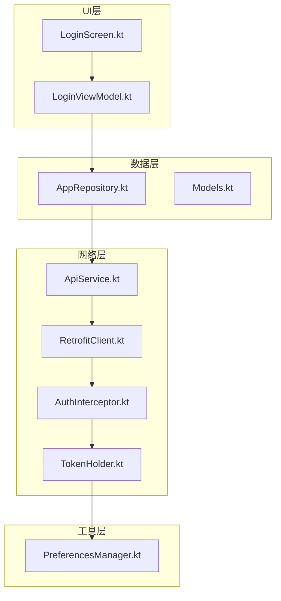
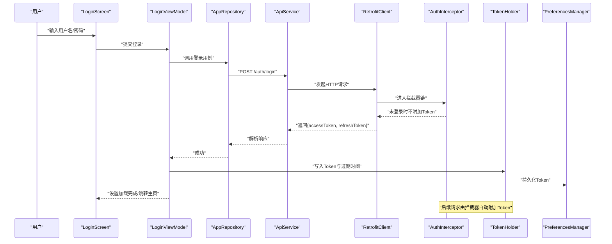
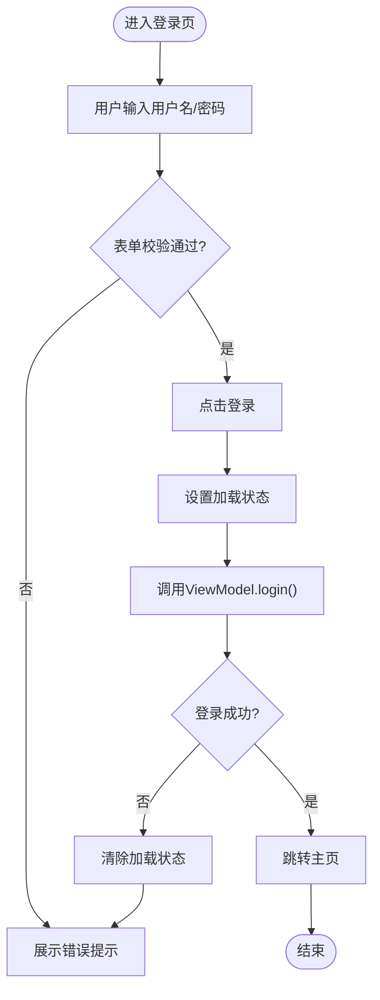
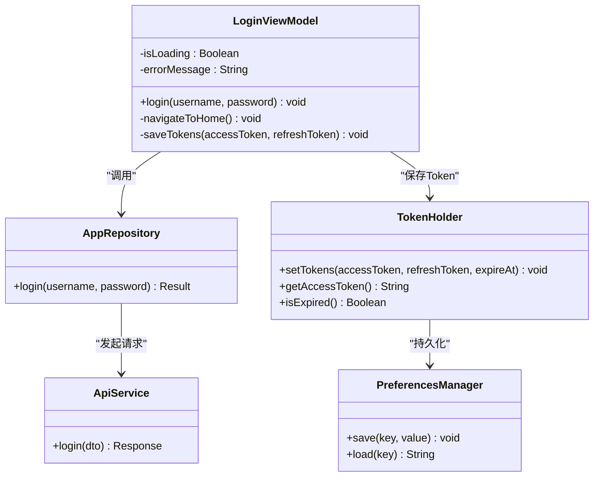
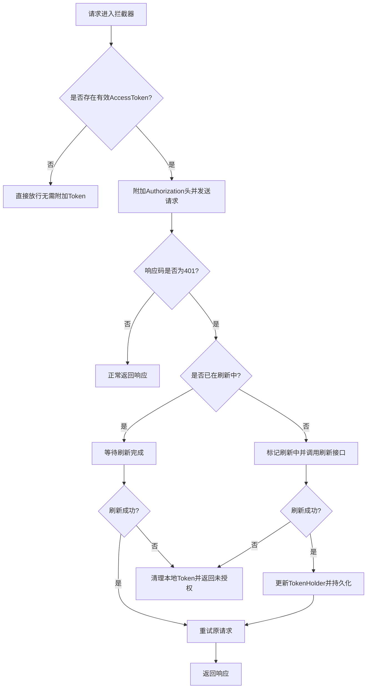
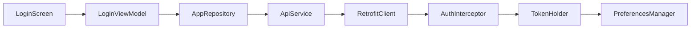

# 用户认证模块

<cite>
**本文引用的文件**   
- [LoginScreen.kt](file://mobile-android/app/src/main/java/com/dip/material/ui/login/LoginScreen.kt)
- [LoginViewModel.kt](file://mobile-android/app/src/main/java/com/dip/material/ui/login/LoginViewModel.kt)
- [AuthInterceptor.kt](file://mobile-android/app/src/main/java/com/dip/material/data/network/AuthInterceptor.kt)
- [RetrofitClient.kt](file://mobile-android/app/src/main/java/com/dip/material/data/network/RetrofitClient.kt)
- [TokenHolder.kt](file://mobile-android/app/src/main/java/com/dip/material/data/network/TokenHolder.kt)
- [ApiService.kt](file://mobile-android/app/src/main/java/com/dip/material/data/network/ApiService.kt)
- [PreferencesManager.kt](file://mobile-android/app/src/main/java/com/dip/material/utils/PreferencesManager.kt)
- [AppRepository.kt](file://mobile-android/app/src/main/java/com/dip/material/data/repository/AppRepository.kt)
- [Models.kt](file://mobile-android/app/src/main/java/com/dip/material/data/models/Models.kt)
</cite>

## 目录
1. [简介](#简介)
2. [项目结构](#项目结构)
3. [核心组件](#核心组件)
4. [架构总览](#架构总览)
5. [详细组件分析](#详细组件分析)
6. [依赖关系分析](#依赖关系分析)
7. [性能考虑](#性能考虑)
8. [故障排查指南](#故障排查指南)
9. [结论](#结论)
10. [附录](#附录)

## 简介
本文件面向DIP系统Android应用的用户认证模块，聚焦登录界面的表单验证、错误提示与加载状态管理；系统化说明LoginViewModel的认证流程、Token存储与会话管理；详解AuthInterceptor的自动鉴权机制、Token刷新策略与网络请求拦截；并给出安全最佳实践（密码加密、会话超时处理）、认证失败的错误处理与重试机制实现建议。

## 项目结构
认证相关代码主要分布在以下包：
- ui/login：登录界面与视图模型
- data/network：网络层（Retrofit、拦截器、Token持有者）
- utils：本地持久化（SharedPreferences封装）
- data/repository：数据仓库（统一对外暴露认证能力）
- data/models：数据模型（含认证相关DTO）

图表来源
- [LoginScreen.kt](file://mobile-android/app/src/main/java/com/dip/material/ui/login/LoginScreen.kt)
- [LoginViewModel.kt](file://mobile-android/app/src/main/java/com/dip/material/ui/login/LoginViewModel.kt)
- [AppRepository.kt](file://mobile-android/app/src/main/java/com/dip/material/data/repository/AppRepository.kt)
- [ApiService.kt](file://mobile-android/app/src/main/java/com/dip/material/data/network/ApiService.kt)
- [RetrofitClient.kt](file://mobile-android/app/src/main/java/com/dip/material/data/network/RetrofitClient.kt)
- [AuthInterceptor.kt](file://mobile-android/app/src/main/java/com/dip/material/data/network/AuthInterceptor.kt)
- [TokenHolder.kt](file://mobile-android/app/src/main/java/com/dip/material/data/network/TokenHolder.kt)
- [PreferencesManager.kt](file://mobile-android/app/src/main/java/com/dip/material/utils/PreferencesManager.kt)

章节来源
- [LoginScreen.kt](file://mobile-android/app/src/main/java/com/dip/material/ui/login/LoginScreen.kt)
- [LoginViewModel.kt](file://mobile-android/app/src/main/java/com/dip/material/ui/login/LoginViewModel.kt)
- [ApiService.kt](file://mobile-android/app/src/main/java/com/dip/material/data/network/ApiService.kt)
- [RetrofitClient.kt](file://mobile-android/app/src/main/java/com/dip/material/data/network/RetrofitClient.kt)
- [AuthInterceptor.kt](file://mobile-android/app/src/main/java/com/dip/material/data/network/AuthInterceptor.kt)
- [TokenHolder.kt](file://mobile-android/app/src/main/java/com/dip/material/data/network/TokenHolder.kt)
- [PreferencesManager.kt](file://mobile-android/app/src/main/java/com/dip/material/utils/PreferencesManager.kt)
- [AppRepository.kt](file://mobile-android/app/src/main/java/com/dip/material/data/repository/AppRepository.kt)
- [Models.kt](file://mobile-android/app/src/main/java/com/dip/material/data/models/Models.kt)

## 核心组件
- LoginScreen：负责登录表单展示、输入校验反馈、加载态与结果提示。
- LoginViewModel：编排登录流程，调用仓库发起认证，管理加载状态与错误信息，成功后保存Token并跳转。
- AuthInterceptor：为每个出站请求附加Authorization头；在收到401时尝试无阻塞刷新Token并重试一次。
- TokenHolder：进程内单例，维护当前AccessToken/RefreshToken及过期时间，提供读写接口。
- PreferencesManager：对SharedPreferences的安全封装，用于持久化Token与敏感配置。
- ApiService：定义认证与业务API接口。
- RetrofitClient：构建Retrofit实例，注入拦截器与序列化配置。
- AppRepository：聚合认证相关用例，向上屏蔽网络细节。
- Models.kt：认证相关的请求/响应数据类。

章节来源
- [LoginScreen.kt](file://mobile-android/app/src/main/java/com/dip/material/ui/login/LoginScreen.kt)
- [LoginViewModel.kt](file://mobile-android/app/src/main/java/com/dip/material/ui/login/LoginViewModel.kt)
- [AuthInterceptor.kt](file://mobile-android/app/src/main/java/com/dip/material/data/network/AuthInterceptor.kt)
- [TokenHolder.kt](file://mobile-android/app/src/main/java/com/dip/material/data/network/TokenHolder.kt)
- [PreferencesManager.kt](file://mobile-android/app/src/main/java/com/dip/material/utils/PreferencesManager.kt)
- [ApiService.kt](file://mobile-android/app/src/main/java/com/dip/material/data/network/ApiService.kt)
- [RetrofitClient.kt](file://mobile-android/app/src/main/java/com/dip/material/data/network/RetrofitClient.kt)
- [AppRepository.kt](file://mobile-android/app/src/main/java/com/dip/material/data/repository/AppRepository.kt)
- [Models.kt](file://mobile-android/app/src/main/java/com/dip/material/data/models/Models.kt)

## 架构总览
下图展示了从UI到网络的完整认证链路，包括登录、Token存储、拦截器鉴权与失败重试。

图表来源
- [LoginScreen.kt](file://mobile-android/app/src/main/java/com/dip/material/ui/login/LoginScreen.kt)
- [LoginViewModel.kt](file://mobile-android/app/src/main/java/com/dip/material/ui/login/LoginViewModel.kt)
- [AppRepository.kt](file://mobile-android/app/src/main/java/com/dip/material/data/repository/AppRepository.kt)
- [ApiService.kt](file://mobile-android/app/src/main/java/com/dip/material/data/network/ApiService.kt)
- [RetrofitClient.kt](file://mobile-android/app/src/main/java/com/dip/material/data/network/RetrofitClient.kt)
- [AuthInterceptor.kt](file://mobile-android/app/src/main/java/com/dip/material/data/network/AuthInterceptor.kt)
- [TokenHolder.kt](file://mobile-android/app/src/main/java/com/dip/material/data/network/TokenHolder.kt)
- [PreferencesManager.kt](file://mobile-android/app/src/main/java/com/dip/material/utils/PreferencesManager.kt)

## 详细组件分析

### 登录界面与表单验证（LoginScreen）
- 输入项：用户名、密码。支持基础非空校验与格式校验（如长度、字符集）。
- 错误提示：将校验失败或后端返回的错误以Toast/文本形式展示，避免堆叠提示。
- 加载状态：提交后禁用按钮并显示进度指示，完成后恢复。
- 导航：登录成功后根据权限跳转到主页或相应功能页。

章节来源
- [LoginScreen.kt](file://mobile-android/app/src/main/java/com/dip/material/ui/login/LoginScreen.kt)

### 认证流程编排（LoginViewModel）
- 职责：协调UI与仓库，管理加载状态、错误消息与导航事件。
- 流程要点：
  - 触发登录：收集输入，调用仓库登录方法。
  - 成功分支：保存Token（访问令牌与刷新令牌），更新会话状态，通知UI跳转。
  - 失败分支：捕获网络异常与业务错误，映射为用户可读提示。
  - 并发控制：防止重复提交（使用防抖或锁）。

图表来源
- [LoginViewModel.kt](file://mobile-android/app/src/main/java/com/dip/material/ui/login/LoginViewModel.kt)
- [AppRepository.kt](file://mobile-android/app/src/main/java/com/dip/material/data/repository/AppRepository.kt)
- [ApiService.kt](file://mobile-android/app/src/main/java/com/dip/material/data/network/ApiService.kt)
- [TokenHolder.kt](file://mobile-android/app/src/main/java/com/dip/material/data/network/TokenHolder.kt)
- [PreferencesManager.kt](file://mobile-android/app/src/main/java/com/dip/material/utils/PreferencesManager.kt)

章节来源
- [LoginViewModel.kt](file://mobile-android/app/src/main/java/com/dip/material/ui/login/LoginViewModel.kt)
- [AppRepository.kt](file://mobile-android/app/src/main/java/com/dip/material/data/repository/AppRepository.kt)
- [ApiService.kt](file://mobile-android/app/src/main/java/com/dip/material/data/network/ApiService.kt)
- [TokenHolder.kt](file://mobile-android/app/src/main/java/com/dip/material/data/network/TokenHolder.kt)
- [PreferencesManager.kt](file://mobile-android/app/src/main/java/com/dip/material/utils/PreferencesManager.kt)

### 自动鉴权与Token刷新（AuthInterceptor）
- 自动鉴权：对每个出站请求，若存在有效AccessToken则附加至Authorization头。
- 401处理：
  - 判断是否已刷新中，避免并发刷新风暴。
  - 调用刷新接口获取新Token，成功后重试原请求。
  - 刷新失败则清理本地Token并引导重新登录。
- 线程安全：使用互斥或原子标志保护刷新流程。
- 幂等性：确保刷新接口在同一时刻仅执行一次。

图表来源
- [AuthInterceptor.kt](file://mobile-android/app/src/main/java/com/dip/material/data/network/AuthInterceptor.kt)
- [TokenHolder.kt](file://mobile-android/app/src/main/java/com/dip/material/data/network/TokenHolder.kt)
- [PreferencesManager.kt](file://mobile-android/app/src/main/java/com/dip/material/utils/PreferencesManager.kt)

章节来源
- [AuthInterceptor.kt](file://mobile-android/app/src/main/java/com/dip/material/data/network/AuthInterceptor.kt)
- [TokenHolder.kt](file://mobile-android/app/src/main/java/com/dip/material/data/network/TokenHolder.kt)
- [PreferencesManager.kt](file://mobile-android/app/src/main/java/com/dip/material/utils/PreferencesManager.kt)

### 网络客户端与接口（RetrofitClient & ApiService）
- RetrofitClient：集中配置OkHttp、Gson/Moshi、超时、日志与拦截器链。
- ApiService：声明登录、刷新Token与业务接口，定义请求体与响应类型。
- 建议：
  - 区分登录/刷新接口与普通接口的错误处理策略。
  - 合理设置连接/读取/写入超时，适配弱网环境。

章节来源
- [RetrofitClient.kt](file://mobile-android/app/src/main/java/com/dip/material/data/network/RetrofitClient.kt)
- [ApiService.kt](file://mobile-android/app/src/main/java/com/dip/material/data/network/ApiService.kt)

### Token存储与会话管理（TokenHolder & PreferencesManager）
- TokenHolder：
  - 提供进程内存取AccessToken/RefreshToken与过期时间。
  - 提供isExpired()判断，结合服务端返回的过期策略。
- PreferencesManager：
  - 安全地读写敏感字段，建议对敏感值进行二次加密（见安全最佳实践）。
  - 提供统一的键名管理与默认值处理。

章节来源
- [TokenHolder.kt](file://mobile-android/app/src/main/java/com/dip/material/data/network/TokenHolder.kt)
- [PreferencesManager.kt](file://mobile-android/app/src/main/java/com/dip/material/utils/PreferencesManager.kt)

### 数据模型（Models.kt）
- 登录请求/响应：包含用户名、密码、accessToken、refreshToken、过期时间等字段。
- 错误响应：统一错误码与消息，便于前端展示。
- 建议：
  - 使用不可变数据类。
  - 严格校验必填字段与格式。

章节来源
- [Models.kt](file://mobile-android/app/src/main/java/com/dip/material/data/models/Models.kt)

## 依赖关系分析
- UI层依赖ViewModel，ViewModel依赖Repository，Repository依赖ApiService。
- 网络层通过RetrofitClient装配AuthInterceptor，拦截器依赖TokenHolder与PreferencesManager。
- TokenHolder作为全局状态源，被拦截器与ViewModel共同消费。

图表来源
- [LoginScreen.kt](file://mobile-android/app/src/main/java/com/dip/material/ui/login/LoginScreen.kt)
- [LoginViewModel.kt](file://mobile-android/app/src/main/java/com/dip/material/ui/login/LoginViewModel.kt)
- [AppRepository.kt](file://mobile-android/app/src/main/java/com/dip/material/data/repository/AppRepository.kt)
- [ApiService.kt](file://mobile-android/app/src/main/java/com/dip/material/data/network/ApiService.kt)
- [RetrofitClient.kt](file://mobile-android/app/src/main/java/com/dip/material/data/network/RetrofitClient.kt)
- [AuthInterceptor.kt](file://mobile-android/app/src/main/java/com/dip/material/data/network/AuthInterceptor.kt)
- [TokenHolder.kt](file://mobile-android/app/src/main/java/com/dip/material/data/network/TokenHolder.kt)
- [PreferencesManager.kt](file://mobile-android/app/src/main/java/com/dip/material/utils/PreferencesManager.kt)

章节来源
- [LoginScreen.kt](file://mobile-android/app/src/main/java/com/dip/material/ui/login/LoginScreen.kt)
- [LoginViewModel.kt](file://mobile-android/app/src/main/java/com/dip/material/ui/login/LoginViewModel.kt)
- [AppRepository.kt](file://mobile-android/app/src/main/java/com/dip/material/data/repository/AppRepository.kt)
- [ApiService.kt](file://mobile-android/app/src/main/java/com/dip/material/data/network/ApiService.kt)
- [RetrofitClient.kt](file://mobile-android/app/src/main/java/com/dip/material/data/network/RetrofitClient.kt)
- [AuthInterceptor.kt](file://mobile-android/app/src/main/java/com/dip/material/data/network/AuthInterceptor.kt)
- [TokenHolder.kt](file://mobile-android/app/src/main/java/com/dip/material/data/network/TokenHolder.kt)
- [PreferencesManager.kt](file://mobile-android/app/src/main/java/com/dip/material/utils/PreferencesManager.kt)

## 性能考虑
- 减少重复登录：启动时检查Token有效性，避免不必要的登录请求。
- 防抖与节流：登录按钮防抖，避免快速多次点击导致重复请求。
- 网络优化：合理设置超时与重试次数；启用Gzip压缩；复用OkHttpClient。
- 内存占用：避免在ViewModel中持有大对象引用；及时释放回调与监听。
- 刷新风暴防护：使用信号量或原子标志保证同一时刻仅一个刷新请求。

[本节为通用指导，不直接分析具体文件]

## 故障排查指南
- 常见错误分类：
  - 网络错误：断网、DNS失败、超时。建议在UI层提示“网络异常，请检查连接”。
  - 认证错误：401/403。应触发刷新流程；刷新失败则清空Token并回到登录页。
  - 业务错误：参数校验失败、账号不存在、密码错误。映射为友好提示。
- 定位手段：
  - 开启OkHttp日志打印请求/响应头与体（脱敏）。
  - 记录关键路径日志：登录开始/结束、刷新开始/结束、Token写入/读取。
  - 监控Token过期时间与刷新成功率。
- 重试策略：
  - 对幂等GET请求可自动重试1次；POST等非幂等请求不建议自动重试。
  - 指数退避与抖动，避免雪崩。

章节来源
- [AuthInterceptor.kt](file://mobile-android/app/src/main/java/com/dip/material/data/network/AuthInterceptor.kt)
- [LoginViewModel.kt](file://mobile-android/app/src/main/java/com/dip/material/ui/login/LoginViewModel.kt)
- [RetrofitClient.kt](file://mobile-android/app/src/main/java/com/dip/material/data/network/RetrofitClient.kt)

## 结论
本认证模块通过清晰的分层与职责划分，实现了安全的登录流程、健壮的Token管理与自动鉴权。配合合理的错误处理与重试策略，可在弱网与异常场景下保持良好用户体验。建议持续完善安全加固与监控告警，提升整体稳定性。

[本节为总结，不直接分析具体文件]

## 附录

### 安全最佳实践
- 密码传输：始终使用HTTPS；不在日志中输出明文密码。
- 本地存储：对敏感字段（Token、密码）进行加密存储；优先使用Android Keystore。
- 会话管理：设置合理的Token有效期；服务端支持短时效Access Token与长时效Refresh Token。
- 最小权限：按角色下发权限，前端基于权限控制可见性与操作。
- 防重放：必要时引入nonce与签名机制。

[本节为通用指导，不直接分析具体文件]

### 会话超时处理
- 客户端侧：
  - 在请求前检查Token剩余有效期，提前刷新。
  - 后台任务定期检测并刷新即将过期的Token。
- 服务端侧：
  - 明确返回过期时间与刷新接口。
  - 支持批量刷新与并发控制。

[本节为通用指导，不直接分析具体文件]

### 认证失败的错误处理与重试机制实现
- 错误分类与映射：
  - 网络层错误：提示“网络不可用”或“服务器繁忙”。
  - 认证失败：提示“登录信息有误”或“会话已过期”，并引导重新登录。
  - 业务错误：展示具体错误原因。
- 重试策略：
  - 仅在特定条件下重试（如网络抖动导致的瞬时失败）。
  - 限制最大重试次数与间隔，避免无限重试。
- 降级与兜底：
  - 关键路径失败时提供离线提示或缓存数据。
  - 用户可手动触发重试。

章节来源
- [AuthInterceptor.kt](file://mobile-android/app/src/main/java/com/dip/material/data/network/AuthInterceptor.kt)
- [LoginViewModel.kt](file://mobile-android/app/src/main/java/com/dip/material/ui/login/LoginViewModel.kt)
- [RetrofitClient.kt](file://mobile-android/app/src/main/java/com/dip/material/data/network/RetrofitClient.kt)