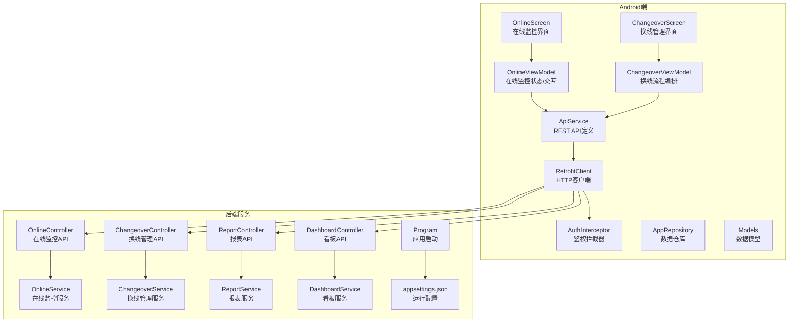
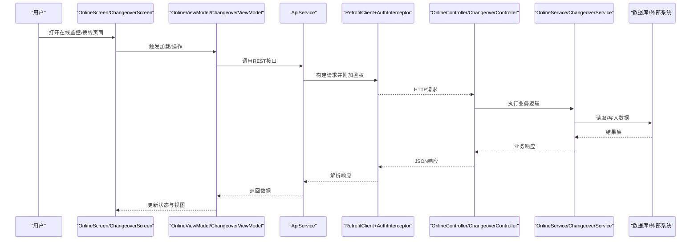
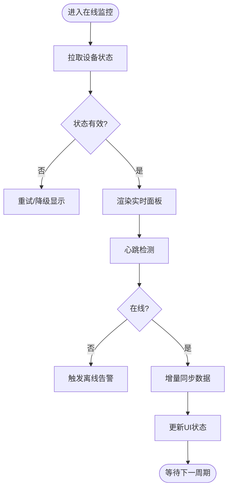
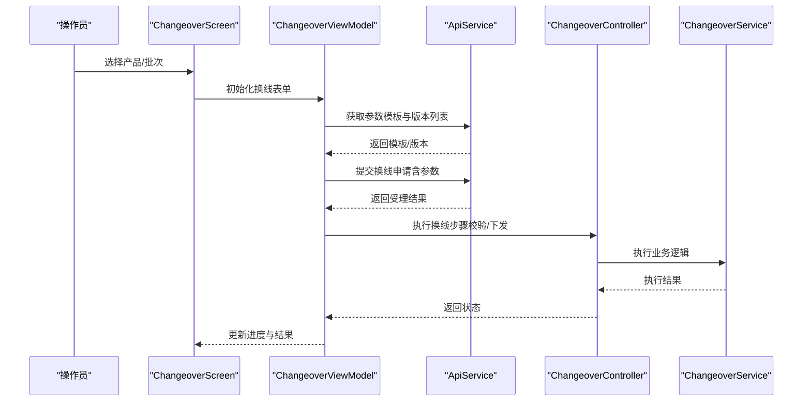
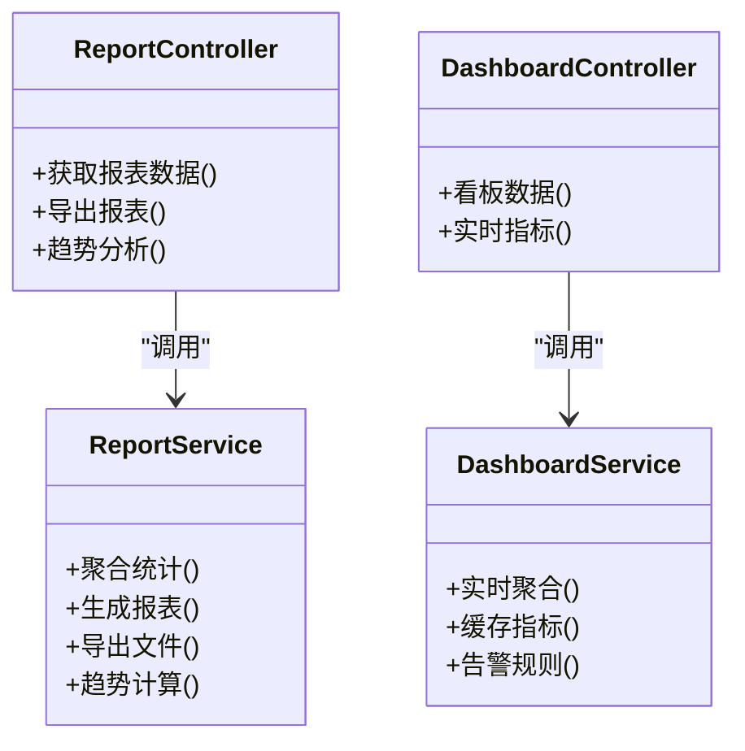
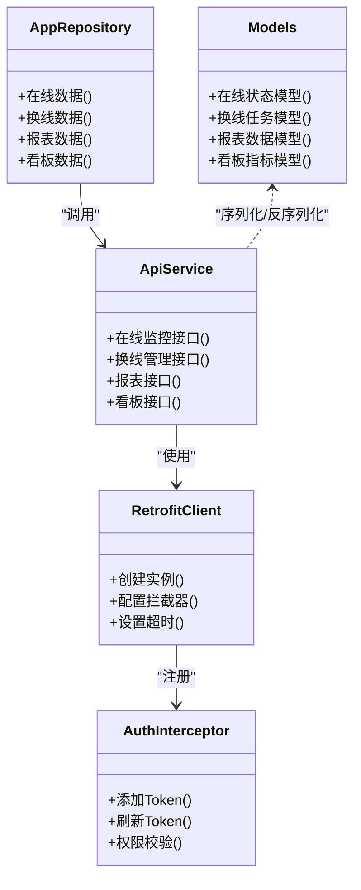
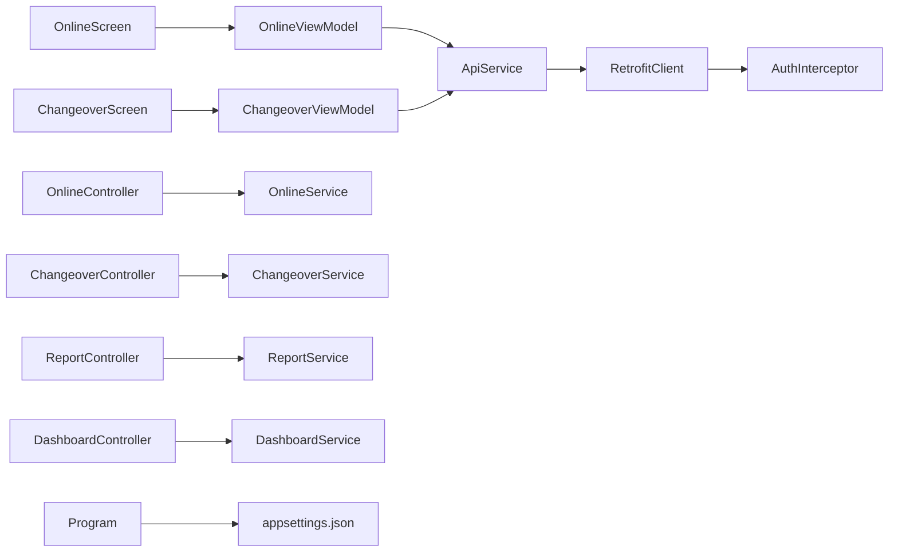

# 监控报表模块

<cite>
**本文引用的文件**   
- [OnlineScreen.kt](file://mobile-android/app/src/main/java/com/dip/material/ui/online/OnlineScreen.kt)
- [OnlineViewModel.kt](file://mobile-android/app/src/main/java/com/dip/material/ui/online/OnlineViewModel.kt)
- [ChangeoverScreen.kt](file://mobile-android/app/src/main/java/com/dip/material/ui/changeover/ChangeoverScreen.kt)
- [ChangeoverViewModel.kt](file://mobile-android/app/src/main/java/com/dip/material/ui/changeover/ChangeoverViewModel.kt)
- [ApiService.kt](file://mobile-android/app/src/main/java/com/dip/material/data/network/ApiService.kt)
- [RetrofitClient.kt](file://mobile-android/app/src/main/java/com/dip/material/data/network/RetrofitClient.kt)
- [AuthInterceptor.kt](file://mobile-android/app/src/main/java/com/dip/material/data/network/AuthInterceptor.kt)
- [AppRepository.kt](file://mobile-android/app/src/main/java/com/dip/material/data/repository/AppRepository.kt)
- [Models.kt](file://mobile-android/app/src/main/java/com/dip/material/data/models/Models.kt)
- [DashboardController.cs](file://dip-system/api/Controllers/DashboardController.cs)
- [ReportController.cs](file://dip-system/api/Controllers/ReportController.cs)
- [OnlineController.cs](file://dip-system/api/Controllers/OnlineController.cs)
- [ChangeoverController.cs](file://dip-system/api/Controllers/ChangeoverController.cs)
- [DashboardService.cs](file://dip-system/api/Services/DashboardService.cs)
- [ReportService.cs](file://dip-system/api/Services/ReportService.cs)
- [OnlineService.cs](file://dip-system/api/Services/OnlineService.cs)
- [ChangeoverService.cs](file://dip-system/api/Services/ChangeoverService.cs)
- [Program.cs](file://dip-system/api/Program.cs)
- [appsettings.json](file://dip-system/api/appsettings.json)
</cite>

## 目录
1. [简介](#简介)
2. [项目结构](#项目结构)
3. [核心组件](#核心组件)
4. [架构总览](#架构总览)
5. [详细组件分析](#详细组件分析)
6. [依赖关系分析](#依赖关系分析)
7. [性能考虑](#性能考虑)
8. [故障诊断与排错指南](#故障诊断与排错指南)
9. [结论](#结论)
10. [附录](#附录)

## 简介
本章节面向DIP系统Android应用的“监控报表模块”，聚焦在线监控的实时状态展示、设备连接与数据同步；换线管理的切换流程、参数配置与版本控制；生产数据采集、统计与可视化；告警机制、性能监控与故障诊断；以及报表生成、数据导出与趋势分析能力。文档以Android端为核心，结合后端API与服务层进行端到端说明，帮助读者快速理解并高效使用或扩展该模块。

## 项目结构
监控报表模块横跨Android前端与后端服务：
- Android端（Kotlin + Jetpack Compose）
  - UI层：在线监控页面、换线管理页面等
  - ViewModel：负责状态管理与业务编排
  - 网络层：Retrofit客户端、拦截器、API接口定义
  - 数据仓库：统一数据访问入口
  - 模型：前后端共享的数据结构
- 后端（ASP.NET Core）
  - 控制器：在线、换线、报表、看板等
  - 服务层：领域逻辑、聚合计算、外部集成
  - 配置与启动：应用启动、中间件、数据库连接

图表来源
- [OnlineScreen.kt](file://mobile-android/app/src/main/java/com/dip/material/ui/online/OnlineScreen.kt)
- [OnlineViewModel.kt](file://mobile-android/app/src/main/java/com/dip/material/ui/online/OnlineViewModel.kt)
- [ChangeoverScreen.kt](file://mobile-android/app/src/main/java/com/dip/material/ui/changeover/ChangeoverScreen.kt)
- [ChangeoverViewModel.kt](file://mobile-android/app/src/main/java/com/dip/material/ui/changeover/ChangeoverViewModel.kt)
- [ApiService.kt](file://mobile-android/app/src/main/java/com/dip/material/data/network/ApiService.kt)
- [RetrofitClient.kt](file://mobile-android/app/src/main/java/com/dip/material/data/network/RetrofitClient.kt)
- [AuthInterceptor.kt](file://mobile-android/app/src/main/java/com/dip/material/data/network/AuthInterceptor.kt)
- [AppRepository.kt](file://mobile-android/app/src/main/java/com/dip/material/data/repository/AppRepository.kt)
- [Models.kt](file://mobile-android/app/src/main/java/com/dip/material/data/models/Models.kt)
- [OnlineController.cs](file://dip-system/api/Controllers/OnlineController.cs)
- [ChangeoverController.cs](file://dip-system/api/Controllers/ChangeoverController.cs)
- [ReportController.cs](file://dip-system/api/Controllers/ReportController.cs)
- [DashboardController.cs](file://dip-system/api/Controllers/DashboardController.cs)
- [OnlineService.cs](file://dip-system/api/Services/OnlineService.cs)
- [ChangeoverService.cs](file://dip-system/api/Services/ChangeoverService.cs)
- [ReportService.cs](file://dip-system/api/Services/ReportService.cs)
- [DashboardService.cs](file://dip-system/api/Services/DashboardService.cs)
- [Program.cs](file://dip-system/api/Program.cs)
- [appsettings.json](file://dip-system/api/appsettings.json)

章节来源
- [OnlineScreen.kt](file://mobile-android/app/src/main/java/com/dip/material/ui/online/OnlineScreen.kt)
- [OnlineViewModel.kt](file://mobile-android/app/src/main/java/com/dip/material/ui/online/OnlineViewModel.kt)
- [ChangeoverScreen.kt](file://mobile-android/app/src/main/java/com/dip/material/ui/changeover/ChangeoverScreen.kt)
- [ChangeoverViewModel.kt](file://mobile-android/app/src/main/java/com/dip/material/ui/changeover/ChangeoverViewModel.kt)
- [ApiService.kt](file://mobile-android/app/src/main/java/com/dip/material/data/network/ApiService.kt)
- [RetrofitClient.kt](file://mobile-android/app/src/main/java/com/dip/material/data/network/RetrofitClient.kt)
- [AuthInterceptor.kt](file://mobile-android/app/src/main/java/com/dip/material/data/network/AuthInterceptor.kt)
- [AppRepository.kt](file://mobile-android/app/src/main/java/com/dip/material/data/repository/AppRepository.kt)
- [Models.kt](file://mobile-android/app/src/main/java/com/dip/material/data/models/Models.kt)
- [OnlineController.cs](file://dip-system/api/Controllers/OnlineController.cs)
- [ChangeoverController.cs](file://dip-system/api/Controllers/ChangeoverController.cs)
- [ReportController.cs](file://dip-system/api/Controllers/ReportController.cs)
- [DashboardController.cs](file://dip-system/api/Controllers/DashboardController.cs)
- [OnlineService.cs](file://dip-system/api/Services/OnlineService.cs)
- [ChangeoverService.cs](file://dip-system/api/Services/ChangeoverService.cs)
- [ReportService.cs](file://dip-system/api/Services/ReportService.cs)
- [DashboardService.cs](file://dip-system/api/Services/DashboardService.cs)
- [Program.cs](file://dip-system/api/Program.cs)
- [appsettings.json](file://dip-system/api/appsettings.json)

## 核心组件
- 在线监控（Online）
  - 功能要点：实时状态展示、设备连接与心跳、数据同步刷新、异常告警提示
  - 关键类：OnlineScreen、OnlineViewModel、OnlineController、OnlineService
- 换线管理（Changeover）
  - 功能要点：换线任务创建与执行、参数配置校验、版本控制与回滚、审批与审计
  - 关键类：ChangeoverScreen、ChangeoverViewModel、ChangeoverController、ChangeoverService
- 报表与看板（Report & Dashboard）
  - 功能要点：生产数据采集、统计聚合、可视化展示、报表导出、趋势分析
  - 关键类：ReportController、ReportService、DashboardController、DashboardService
- 网络与数据
  - 功能要点：REST调用、鉴权、错误处理、缓存策略、本地持久化
  - 关键类：ApiService、RetrofitClient、AuthInterceptor、AppRepository、Models

章节来源
- [OnlineScreen.kt](file://mobile-android/app/src/main/java/com/dip/material/ui/online/OnlineScreen.kt)
- [OnlineViewModel.kt](file://mobile-android/app/src/main/java/com/dip/material/ui/online/OnlineViewModel.kt)
- [ChangeoverScreen.kt](file://mobile-android/app/src/main/java/com/dip/material/ui/changeover/ChangeoverScreen.kt)
- [ChangeoverViewModel.kt](file://mobile-android/app/src/main/java/com/dip/material/ui/changeover/ChangeoverViewModel.kt)
- [ApiService.kt](file://mobile-android/app/src/main/java/com/dip/material/data/network/ApiService.kt)
- [RetrofitClient.kt](file://mobile-android/app/src/main/java/com/dip/material/data/network/RetrofitClient.kt)
- [AuthInterceptor.kt](file://mobile-android/app/src/main/java/com/dip/material/data/network/AuthInterceptor.kt)
- [AppRepository.kt](file://mobile-android/app/src/main/java/com/dip/material/data/repository/AppRepository.kt)
- [Models.kt](file://mobile-android/app/src/main/java/com/dip/material/data/models/Models.kt)
- [OnlineController.cs](file://dip-system/api/Controllers/OnlineController.cs)
- [ChangeoverController.cs](file://dip-system/api/Controllers/ChangeoverController.cs)
- [ReportController.cs](file://dip-system/api/Controllers/ReportController.cs)
- [DashboardController.cs](file://dip-system/api/Controllers/DashboardController.cs)
- [OnlineService.cs](file://dip-system/api/Services/OnlineService.cs)
- [ChangeoverService.cs](file://dip-system/api/Services/ChangeoverService.cs)
- [ReportService.cs](file://dip-system/api/Services/ReportService.cs)
- [DashboardService.cs](file://dip-system/api/Services/DashboardService.cs)

## 架构总览
整体采用前后端分离架构：Android端通过Retrofit发起REST请求，由鉴权拦截器附加认证信息；后端控制器接收请求后交由对应服务层处理，服务层完成业务逻辑、数据聚合与外部系统集成；返回结构化数据供前端渲染与交互。

图表来源
- [OnlineScreen.kt](file://mobile-android/app/src/main/java/com/dip/material/ui/online/OnlineScreen.kt)
- [OnlineViewModel.kt](file://mobile-android/app/src/main/java/com/dip/material/ui/online/OnlineViewModel.kt)
- [ChangeoverScreen.kt](file://mobile-android/app/src/main/java/com/dip/material/ui/changeover/ChangeoverScreen.kt)
- [ChangeoverViewModel.kt](file://mobile-android/app/src/main/java/com/dip/material/ui/changeover/ChangeoverViewModel.kt)
- [ApiService.kt](file://mobile-android/app/src/main/java/com/dip/material/data/network/ApiService.kt)
- [RetrofitClient.kt](file://mobile-android/app/src/main/java/com/dip/material/data/network/RetrofitClient.kt)
- [AuthInterceptor.kt](file://mobile-android/app/src/main/java/com/dip/material/data/network/AuthInterceptor.kt)
- [OnlineController.cs](file://dip-system/api/Controllers/OnlineController.cs)
- [ChangeoverController.cs](file://dip-system/api/Controllers/ChangeoverController.cs)
- [OnlineService.cs](file://dip-system/api/Services/OnlineService.cs)
- [ChangeoverService.cs](file://dip-system/api/Services/ChangeoverService.cs)

## 详细组件分析

### 在线监控（Online）
- 实时状态展示
  - 通过轮询或长连接获取设备在线状态、运行指标与异常事件
  - UI层以卡片/列表形式呈现，支持筛选与排序
- 设备连接与数据同步
  - 心跳检测、断线重连、增量同步
  - 失败重试与退避策略，保证稳定性
- 告警机制
  - 阈值告警、规则引擎触发、消息推送
  - 告警级别、确认与消警流程

图表来源
- [OnlineScreen.kt](file://mobile-android/app/src/main/java/com/dip/material/ui/online/OnlineScreen.kt)
- [OnlineViewModel.kt](file://mobile-android/app/src/main/java/com/dip/material/ui/online/OnlineViewModel.kt)
- [OnlineController.cs](file://dip-system/api/Controllers/OnlineController.cs)
- [OnlineService.cs](file://dip-system/api/Services/OnlineService.cs)

章节来源
- [OnlineScreen.kt](file://mobile-android/app/src/main/java/com/dip/material/ui/online/OnlineScreen.kt)
- [OnlineViewModel.kt](file://mobile-android/app/src/main/java/com/dip/material/ui/online/OnlineViewModel.kt)
- [OnlineController.cs](file://dip-system/api/Controllers/OnlineController.cs)
- [OnlineService.cs](file://dip-system/api/Services/OnlineService.cs)

### 换线管理（Changeover）
- 切换流程
  - 创建换线任务、选择目标版本、参数校验、执行与验证、归档记录
- 参数配置
  - 模板化参数、必填校验、范围检查、依赖项检查
- 版本控制
  - 版本快照、变更对比、回滚策略、审计追踪

图表来源
- [ChangeoverScreen.kt](file://mobile-android/app/src/main/java/com/dip/material/ui/changeover/ChangeoverScreen.kt)
- [ChangeoverViewModel.kt](file://mobile-android/app/src/main/java/com/dip/material/ui/changeover/ChangeoverViewModel.kt)
- [ChangeoverController.cs](file://dip-system/api/Controllers/ChangeoverController.cs)
- [ChangeoverService.cs](file://dip-system/api/Services/ChangeoverService.cs)

章节来源
- [ChangeoverScreen.kt](file://mobile-android/app/src/main/java/com/dip/material/ui/changeover/ChangeoverScreen.kt)
- [ChangeoverViewModel.kt](file://mobile-android/app/src/main/java/com/dip/material/ui/changeover/ChangeoverViewModel.kt)
- [ChangeoverController.cs](file://dip-system/api/Controllers/ChangeoverController.cs)
- [ChangeoverService.cs](file://dip-system/api/Services/ChangeoverService.cs)

### 报表与看板（Report & Dashboard）
- 数据采集与统计
  - 多源采集（设备、工单、物料）、清洗与聚合
  - 指标计算（OEE、良率、节拍、在制品）
- 可视化展示
  - 折线图、柱状图、饼图、热力图、仪表盘
- 报表生成与导出
  - 模板化报表、定时生成、PDF/Excel导出
- 趋势分析
  - 时间序列分析、同比环比、预测预警

图表来源
- [ReportController.cs](file://dip-system/api/Controllers/ReportController.cs)
- [ReportService.cs](file://dip-system/api/Services/ReportService.cs)
- [DashboardController.cs](file://dip-system/api/Controllers/DashboardController.cs)
- [DashboardService.cs](file://dip-system/api/Services/DashboardService.cs)

章节来源
- [ReportController.cs](file://dip-system/api/Controllers/ReportController.cs)
- [ReportService.cs](file://dip-system/api/Services/ReportService.cs)
- [DashboardController.cs](file://dip-system/api/Controllers/DashboardController.cs)
- [DashboardService.cs](file://dip-system/api/Services/DashboardService.cs)

### 网络与数据（Network & Repository）
- REST接口定义
  - 统一的API封装、错误码映射、超时与重试配置
- 鉴权与拦截
  - Token注入、刷新策略、权限校验
- 数据仓库
  - 统一数据访问、缓存策略、本地持久化、并发安全

图表来源
- [ApiService.kt](file://mobile-android/app/src/main/java/com/dip/material/data/network/ApiService.kt)
- [RetrofitClient.kt](file://mobile-android/app/src/main/java/com/dip/material/data/network/RetrofitClient.kt)
- [AuthInterceptor.kt](file://mobile-android/app/src/main/java/com/dip/material/data/network/AuthInterceptor.kt)
- [AppRepository.kt](file://mobile-android/app/src/main/java/com/dip/material/data/repository/AppRepository.kt)
- [Models.kt](file://mobile-android/app/src/main/java/com/dip/material/data/models/Models.kt)

章节来源
- [ApiService.kt](file://mobile-android/app/src/main/java/com/dip/material/data/network/ApiService.kt)
- [RetrofitClient.kt](file://mobile-android/app/src/main/java/com/dip/material/data/network/RetrofitClient.kt)
- [AuthInterceptor.kt](file://mobile-android/app/src/main/java/com/dip/material/data/network/AuthInterceptor.kt)
- [AppRepository.kt](file://mobile-android/app/src/main/java/com/dip/material/data/repository/AppRepository.kt)
- [Models.kt](file://mobile-android/app/src/main/java/com/dip/material/data/models/Models.kt)

## 依赖关系分析
- Android端依赖
  - UI层依赖ViewModel，ViewModel依赖ApiService
  - ApiService依赖RetrofitClient与AuthInterceptor
  - AppRepository作为统一数据访问入口，屏蔽网络与本地存储细节
- 后端依赖
  - Controller依赖Service，Service依赖数据访问与外部系统
  - Program与appsettings.json提供启动与运行时配置

图表来源
- [OnlineScreen.kt](file://mobile-android/app/src/main/java/com/dip/material/ui/online/OnlineScreen.kt)
- [OnlineViewModel.kt](file://mobile-android/app/src/main/java/com/dip/material/ui/online/OnlineViewModel.kt)
- [ChangeoverScreen.kt](file://mobile-android/app/src/main/java/com/dip/material/ui/changeover/ChangeoverScreen.kt)
- [ChangeoverViewModel.kt](file://mobile-android/app/src/main/java/com/dip/material/ui/changeover/ChangeoverViewModel.kt)
- [ApiService.kt](file://mobile-android/app/src/main/java/com/dip/material/data/network/ApiService.kt)
- [RetrofitClient.kt](file://mobile-android/app/src/main/java/com/dip/material/data/network/RetrofitClient.kt)
- [AuthInterceptor.kt](file://mobile-android/app/src/main/java/com/dip/material/data/network/AuthInterceptor.kt)
- [OnlineController.cs](file://dip-system/api/Controllers/OnlineController.cs)
- [ChangeoverController.cs](file://dip-system/api/Controllers/ChangeoverController.cs)
- [ReportController.cs](file://dip-system/api/Controllers/ReportController.cs)
- [DashboardController.cs](file://dip-system/api/Controllers/DashboardController.cs)
- [OnlineService.cs](file://dip-system/api/Services/OnlineService.cs)
- [ChangeoverService.cs](file://dip-system/api/Services/ChangeoverService.cs)
- [ReportService.cs](file://dip-system/api/Services/ReportService.cs)
- [DashboardService.cs](file://dip-system/api/Services/DashboardService.cs)
- [Program.cs](file://dip-system/api/Program.cs)
- [appsettings.json](file://dip-system/api/appsettings.json)

章节来源
- [OnlineScreen.kt](file://mobile-android/app/src/main/java/com/dip/material/ui/online/OnlineScreen.kt)
- [OnlineViewModel.kt](file://mobile-android/app/src/main/java/com/dip/material/ui/online/OnlineViewModel.kt)
- [ChangeoverScreen.kt](file://mobile-android/app/src/main/java/com/dip/material/ui/changeover/ChangeoverScreen.kt)
- [ChangeoverViewModel.kt](file://mobile-android/app/src/main/java/com/dip/material/ui/changeover/ChangeoverViewModel.kt)
- [ApiService.kt](file://mobile-android/app/src/main/java/com/dip/material/data/network/ApiService.kt)
- [RetrofitClient.kt](file://mobile-android/app/src/main/java/com/dip/material/data/network/RetrofitClient.kt)
- [AuthInterceptor.kt](file://mobile-android/app/src/main/java/com/dip/material/data/network/AuthInterceptor.kt)
- [OnlineController.cs](file://dip-system/api/Controllers/OnlineController.cs)
- [ChangeoverController.cs](file://dip-system/api/Controllers/ChangeoverController.cs)
- [ReportController.cs](file://dip-system/api/Controllers/ReportController.cs)
- [DashboardController.cs](file://dip-system/api/Controllers/DashboardController.cs)
- [OnlineService.cs](file://dip-system/api/Services/OnlineService.cs)
- [ChangeoverService.cs](file://dip-system/api/Services/ChangeoverService.cs)
- [ReportService.cs](file://dip-system/api/Services/ReportService.cs)
- [DashboardService.cs](file://dip-system/api/Services/DashboardService.cs)
- [Program.cs](file://dip-system/api/Program.cs)
- [appsettings.json](file://dip-system/api/appsettings.json)

## 性能考虑
- 网络层优化
  - 合理设置超时与重试次数，避免雪崩
  - 使用连接池与HTTP缓存减少重复请求
- 数据层优化
  - 分页与增量同步，降低带宽与内存占用
  - 本地缓存热点数据，提升首屏与交互响应
- UI层优化
  - 按需渲染与懒加载，避免大列表卡顿
  - 防抖与节流，减少频繁状态更新
- 后端优化
  - 聚合查询与索引优化，缩短响应时间
  - 异步处理耗时任务，提高吞吐

[本节为通用指导，不直接分析具体文件]

## 故障诊断与排错指南
- 常见问题定位
  - 网络连接失败：检查Retrofit配置、代理与防火墙
  - 鉴权失败：检查Token有效期与刷新策略
  - 数据不同步：核对轮询间隔与增量字段
  - 报表导出失败：检查模板与权限
- 日志与调试
  - 启用网络日志与SQL日志
  - 收集崩溃堆栈与性能指标
- 恢复策略
  - 自动重试与降级显示
  - 断线重连与数据补偿

章节来源
- [RetrofitClient.kt](file://mobile-android/app/src/main/java/com/dip/material/data/network/RetrofitClient.kt)
- [AuthInterceptor.kt](file://mobile-android/app/src/main/java/com/dip/material/data/network/AuthInterceptor.kt)
- [AppRepository.kt](file://mobile-android/app/src/main/java/com/dip/material/data/repository/AppRepository.kt)
- [Program.cs](file://dip-system/api/Program.cs)
- [appsettings.json](file://dip-system/api/appsettings.json)

## 结论
监控报表模块通过清晰的职责划分与稳定的网络通信，实现了在线监控、换线管理、报表与看板的完整闭环。建议在后续迭代中持续优化性能与可观测性，完善告警与审计能力，提升系统的可靠性与易用性。

[本节为总结性内容，不直接分析具体文件]

## 附录
- 术语表
  - 在线监控：设备状态与运行指标的实时展示
  - 换线管理：产品切换的流程化管理
  - 报表与看板：数据统计与可视化展示
- 参考路径
  - Android端：mobile-android/app/src/main/java/com/dip/material
  - 后端服务：dip-system/api

[本节为补充信息，不直接分析具体文件]