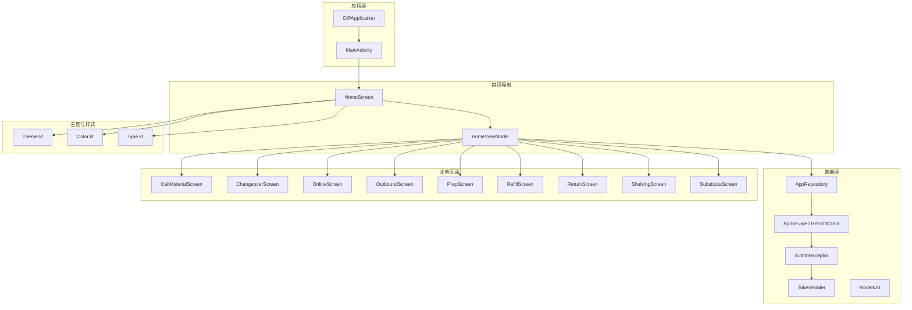
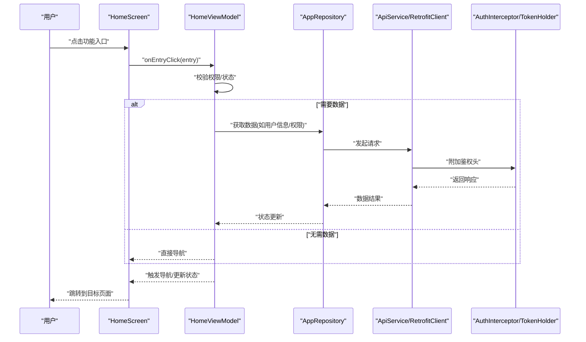
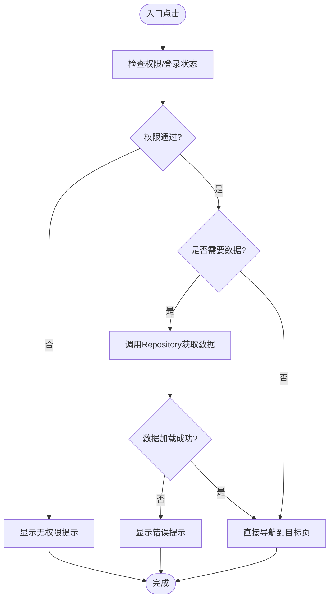
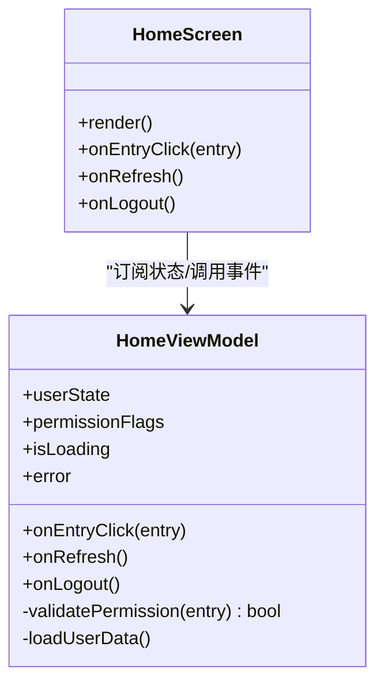
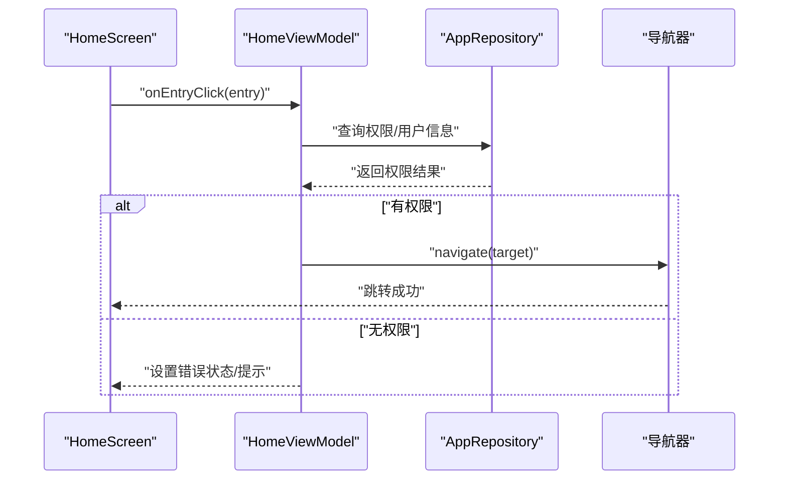
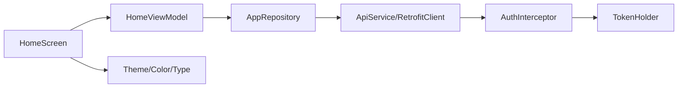

# 首页导航模块

<cite>
**本文引用的文件**   
- [HomeScreen.kt](file://mobile-android/app/src/main/java/com/dip/material/ui/home/HomeScreen.kt)
- [HomeViewModel.kt](file://mobile-android/app/src/main/java/com/dip/material/ui/home/HomeViewModel.kt)
- [Theme.kt](file://mobile-android/app/src/main/java/com/dip/material/ui/theme/Theme.kt)
- [Color.kt](file://mobile-android/app/src/main/java/com/dip/material/ui/theme/Color.kt)
- [Type.kt](file://mobile-android/app/src/main/java/com/dip/material/ui/theme/Type.kt)
- [MainActivity.kt](file://mobile-android/app/src/main/java/com/dip/material/MainActivity.kt)
- [DIPApplication.kt](file://mobile-android/app/src/main/java/com/dip/material/DIPApplication.kt)
- [ApiService.kt](file://mobile-android/app/src/main/java/com/dip/material/data/network/ApiService.kt)
- [RetrofitClient.kt](file://mobile-android/app/src/main/java/com/dip/material/data/network/RetrofitClient.kt)
- [AuthInterceptor.kt](file://mobile-android/app/src/main/java/com/dip/material/data/network/AuthInterceptor.kt)
- [TokenHolder.kt](file://mobile-android/app/src/main/java/com/dip/material/data/network/TokenHolder.kt)
- [AppRepository.kt](file://mobile-android/app/src/main/java/com/dip/material/data/repository/AppRepository.kt)
- [Models.kt](file://mobile-android/app/src/main/java/com/dip/material/data/models/Models.kt)
- [LoginScreen.kt](file://mobile-android/app/src/main/java/com/dip/material/ui/login/LoginScreen.kt)
- [LoginViewModel.kt](file://mobile-android/app/src/main/java/com/dip/material/ui/login/LoginViewModel.kt)
- [CallMaterialScreen.kt](file://mobile-android/app/src/main/java/com/dip/material/ui/callmaterial/CallMaterialScreen.kt)
- [ChangeoverScreen.kt](file://mobile-android/app/src/main/java/com/dip/material/ui/changeover/ChangeoverScreen.kt)
- [OnlineScreen.kt](file://mobile-android/app/src/main/java/com/dip/material/ui/online/OnlineScreen.kt)
- [OutboundScreen.kt](file://mobile-android/app/src/main/java/com/dip/material/ui/outbound/OutboundScreen.kt)
- [PrepScreen.kt](file://mobile-android/app/src/main/java/com/dip/material/ui/prep/PrepScreen.kt)
- [RefillScreen.kt](file://mobile-android/app/src/main/java/com/dip/material/ui/refill/RefillScreen.kt)
- [ReturnScreen.kt](file://mobile-android/app/src/main/java/com/dip/material/ui/return_/ReturnScreen.kt)
- [ShelvingScreen.kt](file://mobile-android/app/src/main/java/com/dip/material/ui/shelving/ShelvingScreen.kt)
- [SubstituteScreen.kt](file://mobile-android/app/src/main/java/com/dip/material/ui/substitute/SubstituteScreen.kt)
</cite>

## 目录
1. [简介](#简介)
2. [项目结构](#项目结构)
3. [核心组件](#核心组件)
4. [架构总览](#架构总览)
5. [详细组件分析](#详细组件分析)
6. [依赖分析](#依赖分析)
7. [性能考虑](#性能考虑)
8. [故障排查指南](#故障排查指南)
9. [结论](#结论)
10. [附录](#附录)

## 简介
本章节面向DIP系统Android应用的“首页导航模块”，聚焦HomeScreen界面的布局设计、功能入口展示与用户交互逻辑；同时文档化HomeViewModel的状态管理、数据绑定与事件处理机制。内容涵盖各业务功能的快捷入口、导航跳转逻辑、权限控制实现，以及界面响应式设计、主题适配与性能优化策略，并提供代码示例路径与最佳实践指导，帮助开发者快速理解并扩展该模块。

## 项目结构
- 模块位置：mobile-android/app/src/main/java/com/dip/material/ui/home
- 关键文件：
  - HomeScreen.kt：首页UI（Jetpack Compose）与入口卡片布局
  - HomeViewModel.kt：首页状态、事件处理与导航触发
  - 主题与类型：ui/theme下的Theme.kt、Color.kt、Type.kt
  - 应用与主Activity：DIPApplication.kt、MainActivity.kt
  - 网络与鉴权：data/network下的ApiService.kt、RetrofitClient.kt、AuthInterceptor.kt、TokenHolder.kt
  - 仓库与模型：data/repository/AppRepository.kt、data/models/Models.kt
  - 登录与鉴权流程：ui/login下的LoginScreen.kt、LoginViewModel.kt
  - 各业务页面：callmaterial、changeover、online、outbound、prep、refill、return_、shelving、substitute等

图表来源
- [DIPApplication.kt](file://mobile-android/app/src/main/java/com/dip/material/DIPApplication.kt)
- [MainActivity.kt](file://mobile-android/app/src/main/java/com/dip/material/MainActivity.kt)
- [HomeScreen.kt](file://mobile-android/app/src/main/java/com/dip/material/ui/home/HomeScreen.kt)
- [HomeViewModel.kt](file://mobile-android/app/src/main/java/com/dip/material/ui/home/HomeViewModel.kt)
- [Theme.kt](file://mobile-android/app/src/main/java/com/dip/material/ui/theme/Theme.kt)
- [Color.kt](file://mobile-android/app/src/main/java/com/dip/material/ui/theme/Color.kt)
- [Type.kt](file://mobile-android/app/src/main/java/com/dip/material/ui/theme/Type.kt)
- [AppRepository.kt](file://mobile-android/app/src/main/java/com/dip/material/data/repository/AppRepository.kt)
- [ApiService.kt](file://mobile-android/app/src/main/java/com/dip/material/data/network/ApiService.kt)
- [RetrofitClient.kt](file://mobile-android/app/src/main/java/com/dip/material/data/network/RetrofitClient.kt)
- [AuthInterceptor.kt](file://mobile-android/app/src/main/java/com/dip/material/data/network/AuthInterceptor.kt)
- [TokenHolder.kt](file://mobile-android/app/src/main/java/com/dip/material/data/network/TokenHolder.kt)
- [Models.kt](file://mobile-android/app/src/main/java/com/dip/material/data/models/Models.kt)

章节来源
- [HomeScreen.kt](file://mobile-android/app/src/main/java/com/dip/material/ui/home/HomeScreen.kt)
- [HomeViewModel.kt](file://mobile-android/app/src/main/java/com/dip/material/ui/home/HomeViewModel.kt)
- [Theme.kt](file://mobile-android/app/src/main/java/com/dip/material/ui/theme/Theme.kt)
- [Color.kt](file://mobile-android/app/src/main/java/com/dip/material/ui/theme/Color.kt)
- [Type.kt](file://mobile-android/app/src/main/java/com/dip/material/ui/theme/Type.kt)
- [MainActivity.kt](file://mobile-android/app/src/main/java/com/dip/material/MainActivity.kt)
- [DIPApplication.kt](file://mobile-android/app/src/main/java/com/dip/material/DIPApplication.kt)

## 核心组件
- HomeScreen（Compose UI）
  - 职责：渲染首页布局、展示业务功能入口卡片、承载用户点击交互、调用ViewModel方法触发导航或数据加载。
  - 关键点：使用响应式布局容器（如网格/列表），结合主题颜色与排版，保证在不同屏幕尺寸下良好呈现。
- HomeViewModel（状态与事件）
  - 职责：维护首页所需状态（如用户信息、权限标志、加载态）、暴露可观察状态给UI、处理用户事件（点击入口、刷新、退出登录等）。
  - 关键点：通过StateFlow/ViewModelState进行状态驱动更新；封装导航动作（如路由跳转）；必要时触发数据拉取或缓存更新。
- 主题与类型（Theme/Color/Type）
  - 职责：定义全局色彩、字体与组件样式，确保首页与整体应用风格一致，支持深色模式与多设备适配。
- 数据与网络（Repository/ApiService/RetrofitClient/AuthInterceptor/TokenHolder）
  - 职责：统一数据访问、HTTP请求构建、鉴权拦截与Token管理，为首页提供必要的数据支撑（如用户信息、权限）。
- 业务页面（各功能Screen）
  - 职责：各自独立的功能界面，由首页导航进入，遵循统一的导航与权限校验流程。

章节来源
- [HomeScreen.kt](file://mobile-android/app/src/main/java/com/dip/material/ui/home/HomeScreen.kt)
- [HomeViewModel.kt](file://mobile-android/app/src/main/java/com/dip/material/ui/home/HomeViewModel.kt)
- [Theme.kt](file://mobile-android/app/src/main/java/com/dip/material/ui/theme/Theme.kt)
- [Color.kt](file://mobile-android/app/src/main/java/com/dip/material/ui/theme/Color.kt)
- [Type.kt](file://mobile-android/app/src/main/java/com/dip/material/ui/theme/Type.kt)
- [AppRepository.kt](file://mobile-android/app/src/main/java/com/dip/material/data/repository/AppRepository.kt)
- [ApiService.kt](file://mobile-android/app/src/main/java/com/dip/material/data/network/ApiService.kt)
- [RetrofitClient.kt](file://mobile-android/app/src/main/java/com/dip/material/data/network/RetrofitClient.kt)
- [AuthInterceptor.kt](file://mobile-android/app/src/main/java/com/dip/material/data/network/AuthInterceptor.kt)
- [TokenHolder.kt](file://mobile-android/app/src/main/java/com/dip/material/data/network/TokenHolder.kt)

## 架构总览
首页导航采用MVVM + Compose的架构模式：
- UI层（HomeScreen）仅负责渲染与事件派发，不直接操作数据。
- ViewModel（HomeViewModel）集中管理状态与业务逻辑，向UI暴露可观察状态。
- Repository（AppRepository）聚合数据源，屏蔽底层网络与本地存储细节。
- 网络层（RetrofitClient + ApiService）负责API调用，AuthInterceptor注入鉴权头，TokenHolder管理Token生命周期。
- 导航由各Screen内部或ViewModel触发的路由跳转完成，权限在跳转前校验。

图表来源
- [HomeScreen.kt](file://mobile-android/app/src/main/java/com/dip/material/ui/home/HomeScreen.kt)
- [HomeViewModel.kt](file://mobile-android/app/src/main/java/com/dip/material/ui/home/HomeViewModel.kt)
- [AppRepository.kt](file://mobile-android/app/src/main/java/com/dip/material/data/repository/AppRepository.kt)
- [ApiService.kt](file://mobile-android/app/src/main/java/com/dip/material/data/network/ApiService.kt)
- [RetrofitClient.kt](file://mobile-android/app/src/main/java/com/dip/material/data/network/RetrofitClient.kt)
- [AuthInterceptor.kt](file://mobile-android/app/src/main/java/com/dip/material/data/network/AuthInterceptor.kt)
- [TokenHolder.kt](file://mobile-android/app/src/main/java/com/dip/material/data/network/TokenHolder.kt)

## 详细组件分析

### HomeScreen 界面设计与交互
- 布局设计
  - 使用响应式网格/列表展示功能入口卡片，每个卡片包含图标、标题与简要说明。
  - 根据屏幕宽度自适应列数，保证小屏设备仍可高效点击。
  - 主题色与字体通过Theme/Color/Type统一配置，支持深色模式切换。
- 功能入口
  - 常见入口包括：呼叫物料、换线、在线监控、出库、备料、补料、退货、上架、替代等。
  - 每个入口对应一个业务Screen，点击后执行权限校验与导航。
- 用户交互
  - 点击入口触发ViewModel的事件处理，必要时先拉取必要数据（如用户权限）。
  - 加载态与错误提示通过UI状态反馈，提升用户体验。

图表来源
- [HomeScreen.kt](file://mobile-android/app/src/main/java/com/dip/material/ui/home/HomeScreen.kt)
- [HomeViewModel.kt](file://mobile-android/app/src/main/java/com/dip/material/ui/home/HomeViewModel.kt)
- [AppRepository.kt](file://mobile-android/app/src/main/java/com/dip/material/data/repository/AppRepository.kt)

章节来源
- [HomeScreen.kt](file://mobile-android/app/src/main/java/com/dip/material/ui/home/HomeScreen.kt)

### HomeViewModel 状态管理与事件处理
- 状态管理
  - 使用可观察状态（如StateFlow/State）暴露用户信息、权限标志、加载态与错误信息。
  - 状态变更仅在事件处理中发生，避免UI层直接修改状态。
- 数据绑定
  - UI订阅ViewModel状态，自动刷新界面元素（如入口可见性、禁用态）。
  - 对耗时操作使用协程/异步任务，避免阻塞主线程。
- 事件处理
  - onEntryClick：校验权限、决定是否需要数据加载、触发导航。
  - onRefresh：刷新必要数据（如用户权限、菜单项）。
  - onLogout：清理Token与用户信息，跳转登录页。

图表来源
- [HomeViewModel.kt](file://mobile-android/app/src/main/java/com/dip/material/ui/home/HomeViewModel.kt)
- [HomeScreen.kt](file://mobile-android/app/src/main/java/com/dip/material/ui/home/HomeScreen.kt)

章节来源
- [HomeViewModel.kt](file://mobile-android/app/src/main/java/com/dip/material/ui/home/HomeViewModel.kt)

### 权限控制与导航跳转
- 权限控制
  - 在进入功能页前，检查用户角色/权限标志，未授权则提示或阻止跳转。
  - 权限数据来源于Repository（可能来自后端接口或本地缓存）。
- 导航跳转
  - 使用统一的导航框架（如Navigation Compose）进行页面跳转。
  - 跳转前统一进行鉴权拦截，确保安全性。

图表来源
- [HomeViewModel.kt](file://mobile-android/app/src/main/java/com/dip/material/ui/home/HomeViewModel.kt)
- [AppRepository.kt](file://mobile-android/app/src/main/java/com/dip/material/data/repository/AppRepository.kt)

章节来源
- [HomeViewModel.kt](file://mobile-android/app/src/main/java/com/dip/material/ui/home/HomeViewModel.kt)
- [AppRepository.kt](file://mobile-android/app/src/main/java/com/dip/material/data/repository/AppRepository.kt)

### 主题适配与响应式设计
- 主题适配
  - 通过Theme.kt/Color.kt/Type.kt统一管理颜色、字体与组件样式。
  - 支持动态主题切换（浅色/深色），首页入口卡片随主题变化自动适配。
- 响应式设计
  - 使用自适应布局容器，根据屏幕尺寸调整入口卡片行列数与间距。
  - 在小屏设备上优先保证核心入口的可点击性与可读性。

章节来源
- [Theme.kt](file://mobile-android/app/src/main/java/com/dip/material/ui/theme/Theme.kt)
- [Color.kt](file://mobile-android/app/src/main/java/com/dip/material/ui/theme/Color.kt)
- [Type.kt](file://mobile-android/app/src/main/java/com/dip/material/ui/theme/Type.kt)
- [HomeScreen.kt](file://mobile-android/app/src/main/java/com/dip/material/ui/home/HomeScreen.kt)

### 各业务功能入口与页面
- 呼叫物料（CallMaterialScreen）
- 换线（ChangeoverScreen）
- 在线监控（OnlineScreen）
- 出库（OutboundScreen）
- 备料（PrepScreen）
- 补料（RefillScreen）
- 退货（ReturnScreen）
- 上架（ShelvingScreen）
- 替代（SubstituteScreen）

以上页面均由首页入口导航进入，遵循统一的权限校验与导航流程。

章节来源
- [CallMaterialScreen.kt](file://mobile-android/app/src/main/java/com/dip/material/ui/callmaterial/CallMaterialScreen.kt)
- [ChangeoverScreen.kt](file://mobile-android/app/src/main/java/com/dip/material/ui/changeover/ChangeoverScreen.kt)
- [OnlineScreen.kt](file://mobile-android/app/src/main/java/com/dip/material/ui/online/OnlineScreen.kt)
- [OutboundScreen.kt](file://mobile-android/app/src/main/java/com/dip/material/ui/outbound/OutboundScreen.kt)
- [PrepScreen.kt](file://mobile-android/app/src/main/java/com/dip/material/ui/prep/PrepScreen.kt)
- [RefillScreen.kt](file://mobile-android/app/src/main/java/com/dip/material/ui/refill/RefillScreen.kt)
- [ReturnScreen.kt](file://mobile-android/app/src/main/java/com/dip/material/ui/return_/ReturnScreen.kt)
- [ShelvingScreen.kt](file://mobile-android/app/src/main/java/com/dip/material/ui/shelving/ShelvingScreen.kt)
- [SubstituteScreen.kt](file://mobile-android/app/src/main/java/com/dip/material/ui/substitute/SubstituteScreen.kt)

## 依赖分析
- 组件耦合
  - HomeScreen依赖HomeViewModel，低耦合高内聚。
  - HomeViewModel依赖AppRepository，屏蔽数据源细节。
  - Repository依赖网络层（ApiService/RetrofitClient）与鉴权（AuthInterceptor/TokenHolder）。
- 外部依赖
  - Jetpack Compose用于UI声明式构建。
  - Navigation用于页面跳转。
  - Retrofit用于HTTP请求，OkHttp作为底层客户端。
  - Kotlin协程用于异步任务处理。

图表来源
- [HomeScreen.kt](file://mobile-android/app/src/main/java/com/dip/material/ui/home/HomeScreen.kt)
- [HomeViewModel.kt](file://mobile-android/app/src/main/java/com/dip/material/ui/home/HomeViewModel.kt)
- [AppRepository.kt](file://mobile-android/app/src/main/java/com/dip/material/data/repository/AppRepository.kt)
- [ApiService.kt](file://mobile-android/app/src/main/java/com/dip/material/data/network/ApiService.kt)
- [RetrofitClient.kt](file://mobile-android/app/src/main/java/com/dip/material/data/network/RetrofitClient.kt)
- [AuthInterceptor.kt](file://mobile-android/app/src/main/java/com/dip/material/data/network/AuthInterceptor.kt)
- [TokenHolder.kt](file://mobile-android/app/src/main/java/com/dip/material/data/network/TokenHolder.kt)
- [Theme.kt](file://mobile-android/app/src/main/java/com/dip/material/ui/theme/Theme.kt)
- [Color.kt](file://mobile-android/app/src/main/java/com/dip/material/ui/theme/Color.kt)
- [Type.kt](file://mobile-android/app/src/main/java/com/dip/material/ui/theme/Type.kt)

章节来源
- [HomeScreen.kt](file://mobile-android/app/src/main/java/com/dip/material/ui/home/HomeScreen.kt)
- [HomeViewModel.kt](file://mobile-android/app/src/main/java/com/dip/material/ui/home/HomeViewModel.kt)
- [AppRepository.kt](file://mobile-android/app/src/main/java/com/dip/material/data/repository/AppRepository.kt)
- [ApiService.kt](file://mobile-android/app/src/main/java/com/dip/material/data/network/ApiService.kt)
- [RetrofitClient.kt](file://mobile-android/app/src/main/java/com/dip/material/data/network/RetrofitClient.kt)
- [AuthInterceptor.kt](file://mobile-android/app/src/main/java/com/dip/material/data/network/AuthInterceptor.kt)
- [TokenHolder.kt](file://mobile-android/app/src/main/java/com/dip/material/data/network/TokenHolder.kt)

## 性能考虑
- UI渲染优化
  - 使用Compose的remember/key避免不必要的重组。
  - 入口卡片数据静态化，减少重复计算。
- 数据加载优化
  - 合理使用缓存（内存/本地），减少网络请求频率。
  - 分页加载与懒加载，避免一次性加载大量数据。
- 异步与并发
  - 使用协程管理异步任务，避免阻塞主线程。
  - 合理设置超时与重试策略，提升鲁棒性。
- 主题与资源
  - 主题切换时避免全量重建，按需更新受影响组件。
  - 图片等资源进行压缩与缓存，减少内存占用。

[本节为通用性能建议，不直接分析具体文件]

## 故障排查指南
- 常见问题
  - 权限校验失败：检查Token是否有效、用户权限是否正确。
  - 网络请求失败：检查ApiService配置、AuthInterceptor是否正确注入Header。
  - 导航异常：确认路由定义与参数传递是否正确。
- 调试建议
  - 在HomeViewModel中添加日志输出，跟踪状态变化与事件处理。
  - 使用Network Interceptor打印请求/响应详情。
  - 通过Logcat过滤关键字定位问题。

章节来源
- [HomeViewModel.kt](file://mobile-android/app/src/main/java/com/dip/material/ui/home/HomeViewModel.kt)
- [ApiService.kt](file://mobile-android/app/src/main/java/com/dip/material/data/network/ApiService.kt)
- [AuthInterceptor.kt](file://mobile-android/app/src/main/java/com/dip/material/data/network/AuthInterceptor.kt)
- [TokenHolder.kt](file://mobile-android/app/src/main/java/com/dip/material/data/network/TokenHolder.kt)

## 结论
首页导航模块以HomeScreen与HomeViewModel为核心，采用MVVM架构与Compose声明式UI，实现了清晰的职责分离与良好的可维护性。通过统一的权限控制与导航流程，确保了业务入口的安全性与一致性。主题适配与响应式设计提升了用户体验，性能优化策略保障了流畅交互。建议后续继续完善错误处理与日志记录，进一步提升稳定性与可观测性。

[本节为总结性内容，不直接分析具体文件]

## 附录
- 最佳实践
  - 将业务逻辑集中在ViewModel，UI仅负责渲染与事件派发。
  - 使用统一的状态管理方案（如StateFlow），避免分散的状态更新。
  - 对敏感操作（如登出、删除）增加二次确认。
  - 对所有网络请求添加超时与重试机制。
- 代码示例路径
  - 首页入口点击处理：[HomeScreen.kt](file://mobile-android/app/src/main/java/com/dip/material/ui/home/HomeScreen.kt)
  - 权限校验与导航：[HomeViewModel.kt](file://mobile-android/app/src/main/java/com/dip/material/ui/home/HomeViewModel.kt)
  - 网络请求与鉴权：[ApiService.kt](file://mobile-android/app/src/main/java/com/dip/material/data/network/ApiService.kt)、[AuthInterceptor.kt](file://mobile-android/app/src/main/java/com/dip/material/data/network/AuthInterceptor.kt)
  - 主题与样式：[Theme.kt](file://mobile-android/app/src/main/java/com/dip/material/ui/theme/Theme.kt)、[Color.kt](file://mobile-android/app/src/main/java/com/dip/material/ui/theme/Color.kt)、[Type.kt](file://mobile-android/app/src/main/java/com/dip/material/ui/theme/Type.kt)

[本节为补充信息，不直接分析具体文件]