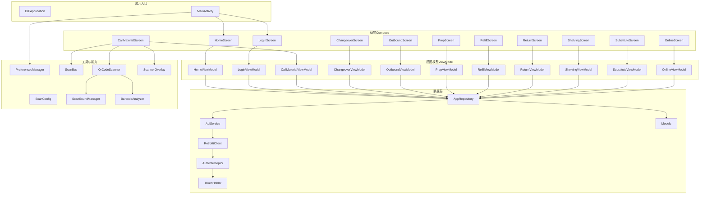
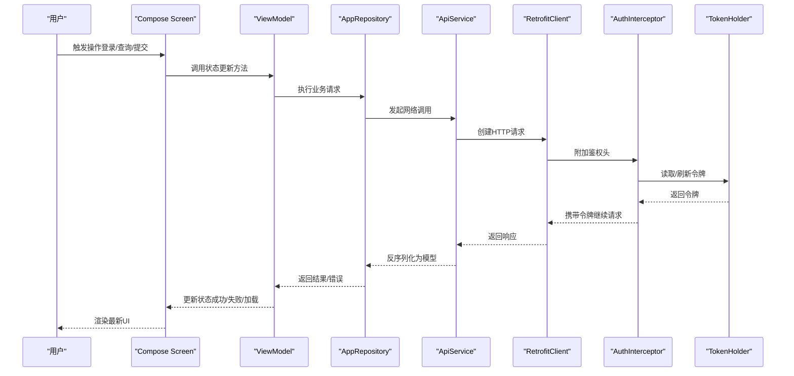
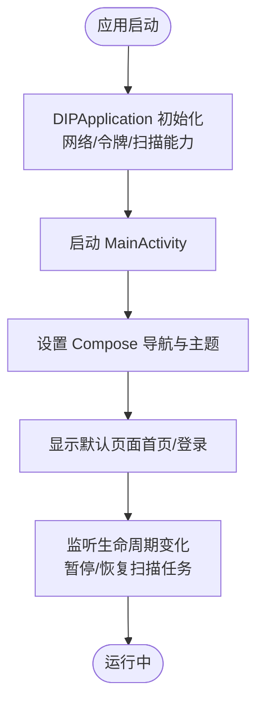
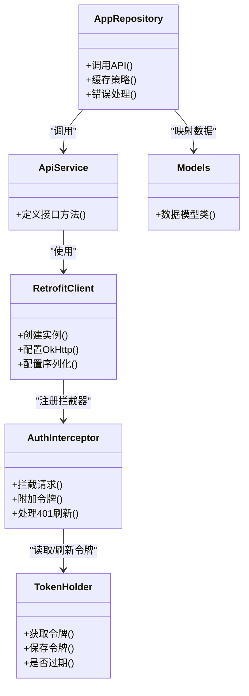
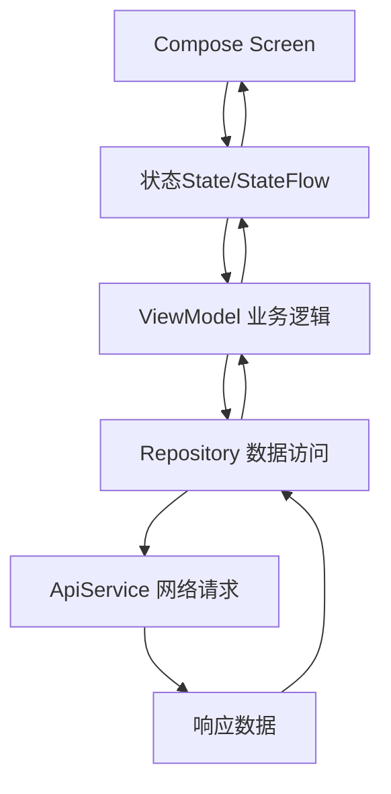
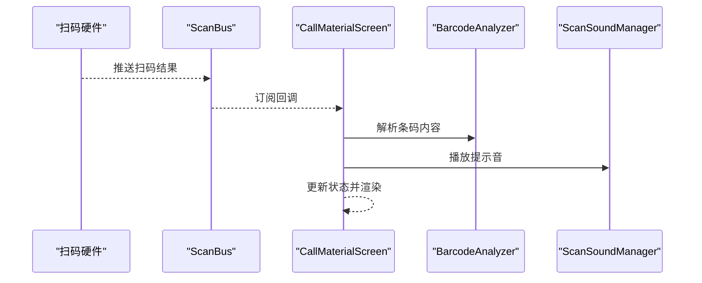
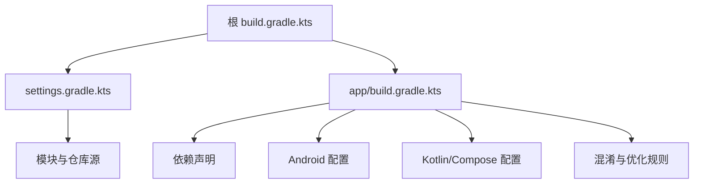
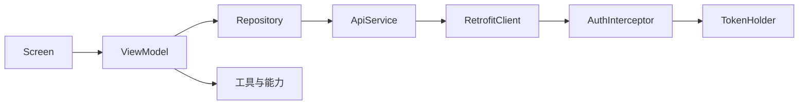

# 应用架构设计

<cite>
**本文引用的文件**   
- [DIPApplication.kt](file://mobile-android/app/src/main/java/com/dip/material/DIPApplication.kt)
- [MainActivity.kt](file://mobile-android/app/src/main/java/com/dip/material/MainActivity.kt)
- [build.gradle.kts（app）](file://mobile-android/app/build.gradle.kts)
- [build.gradle.kts（根）](file://mobile-android/build.gradle.kts)
- [settings.gradle.kts](file://mobile-android/settings.gradle.kts)
- [gradle.properties](file://mobile-android/gradle.properties)
- [AndroidManifest.xml](file://mobile-android/app/src/main/AndroidManifest.xml)
- [ApiService.kt](file://mobile-android/app/src/main/java/com/dip/material/data/network/ApiService.kt)
- [RetrofitClient.kt](file://mobile-android/app/src/main/java/com/dip/material/data/network/RetrofitClient.kt)
- [AuthInterceptor.kt](file://mobile-android/app/src/main/java/com/dip/material/data/network/AuthInterceptor.kt)
- [TokenHolder.kt](file://mobile-android/app/src/main/java/com/dip/material/data/network/TokenHolder.kt)
- [AppRepository.kt](file://mobile-android/app/src/main/java/com/dip/material/data/repository/AppRepository.kt)
- [Models.kt](file://mobile-android/app/src/main/java/com/dip/material/data/models/Models.kt)
- [HomeScreen.kt](file://mobile-android/app/src/main/java/com/dip/material/ui/home/HomeScreen.kt)
- [HomeViewModel.kt](file://mobile-android/app/src/main/java/com/dip/material/ui/home/HomeViewModel.kt)
- [LoginScreen.kt](file://mobile-android/app/src/main/java/com/dip/material/ui/login/LoginScreen.kt)
- [LoginViewModel.kt](file://mobile-android/app/src/main/java/com/dip/material/ui/login/LoginViewModel.kt)
- [CallMaterialScreen.kt](file://mobile-android/app/src/main/java/com/dip/material/ui/callmaterial/CallMaterialScreen.kt)
- [CallMaterialViewModel.kt](file://mobile-android/app/src/main/java/com/dip/material/ui/callmaterial/CallMaterialViewModel.kt)
- [ChangeoverScreen.kt](file://mobile-android/app/src/main/java/com/dip/material/ui/changeover/ChangeoverScreen.kt)
- [ChangeoverViewModel.kt](file://mobile-android/app/src/main/java/com/dip/material/ui/changeover/ChangeoverViewModel.kt)
- [OutboundScreen.kt](file://mobile-android/app/src/main/java/com/dip/material/ui/outbound/OutboundScreen.kt)
- [OutboundViewModel.kt](file://mobile-android/app/src/main/java/com/dip/material/ui/outbound/OutboundViewModel.kt)
- [PrepScreen.kt](file://mobile-android/app/src/main/java/com/dip/material/ui/prep/PrepScreen.kt)
- [PrepViewModel.kt](file://mobile-android/app/src/main/java/com/dip/material/ui/prep/PrepViewModel.kt)
- [RefillScreen.kt](file://mobile-android/app/src/main/java/com/dip/material/ui/refill/RefillScreen.kt)
- [RefillViewModel.kt](file://mobile-android/app/src/main/java/com/dip/material/ui/refill/RefillViewModel.kt)
- [ReturnScreen.kt](file://mobile-android/app/src/main/java/com/dip/material/ui/return_/ReturnScreen.kt)
- [ReturnViewModel.kt](file://mobile-android/app/src/main/java/com/dip/material/ui/return_/ReturnViewModel.kt)
- [ShelvingScreen.kt](file://mobile-android/app/src/main/java/com/dip/material/ui/shelving/ShelvingScreen.kt)
- [ShelvingViewModel.kt](file://mobile-android/app/src/main/java/com/dip/material/ui/shelving/ShelvingViewModel.kt)
- [SubstituteScreen.kt](file://mobile-android/app/src/main/java/com/dip/material/ui/substitute/SubstituteScreen.kt)
- [SubstituteViewModel.kt](file://mobile-android/app/src/main/java/com/dip/material/ui/substitute/SubstituteViewModel.kt)
- [OnlineScreen.kt](file://mobile-android/app/src/main/java/com/dip/material/ui/online/OnlineScreen.kt)
- [OnlineViewModel.kt](file://mobile-android/app/src/main/java/com/dip/material/ui/online/OnlineViewModel.kt)
- [Theme.kt](file://mobile-android/app/src/main/java/com/dip/material/ui/theme/Theme.kt)
- [Color.kt](file://mobile-android/app/src/main/java/com/dip/material/ui/theme/Color.kt)
- [Type.kt](file://mobile-android/app/src/main/java/com/dip/material/ui/theme/Type.kt)
- [PreferencesManager.kt](file://mobile-android/app/src/main/java/com/dip/material/utils/PreferencesManager.kt)
- [ScanBus.kt](file://mobile-android/app/src/main/java/com/dip/material/utils/ScanBus.kt)
- [ScanConfig.kt](file://mobile-android/app/src/main/java/com/dip/material/utils/ScanConfig.kt)
- [ScanSoundManager.kt](file://mobile-android/app/src/main/java/com/dip/material/utils/ScanSoundManager.kt)
- [BarcodeAnalyzer.kt](file://mobile-android/app/src/main/java/com/dip/material/ui/components/BarcodeAnalyzer.kt)
- [QrCodeScanner.kt](file://mobile-android/app/src/main/java/com/dip/material/ui/components/QrCodeScanner.kt)
- [ScannerOverlay.kt](file://mobile-android/app/src/main/java/com/dip/material/ui/components/ScannerOverlay.kt)
</cite>

## 目录
1. [简介](#简介)
2. [项目结构](#项目结构)
3. [核心组件](#核心组件)
4. [架构总览](#架构总览)
5. [详细组件分析](#详细组件分析)
6. [依赖关系分析](#依赖关系分析)
7. [性能考虑](#性能考虑)
8. [故障排查指南](#故障排查指南)
9. [结论](#结论)
10. [附录](#附录)

## 简介
本文件面向DIP系统Android应用的架构设计与实现，聚焦于基于MVVM模式的代码组织、Jetpack Compose UI与状态管理策略、依赖注入配置、模块划分与包命名规范、构建与Gradle优化、以及扩展性与性能考量。文档旨在帮助开发者快速理解整体架构并指导后续演进。

## 项目结构
Android端采用单模块工程（app），按功能域进行包划分：
- data：数据层，包含网络接口定义、Retrofit客户端、拦截器、令牌持有者、仓库与数据模型
- ui：界面层，使用Jetpack Compose，按业务域分包（home、login、callmaterial等），每个领域包含Screen与ViewModel
- utils：工具与能力封装，如偏好存储、扫码总线与声音管理
- theme：Compose主题与样式

图表来源
- [DIPApplication.kt:1-200](file://mobile-android/app/src/main/java/com/dip/material/DIPApplication.kt#L1-L200)
- [MainActivity.kt:1-200](file://mobile-android/app/src/main/java/com/dip/material/MainActivity.kt#L1-L200)
- [HomeScreen.kt:1-200](file://mobile-android/app/src/main/java/com/dip/material/ui/home/HomeScreen.kt#L1-L200)
- [HomeViewModel.kt:1-200](file://mobile-android/app/src/main/java/com/dip/material/ui/home/HomeViewModel.kt#L1-L200)
- [LoginScreen.kt:1-200](file://mobile-android/app/src/main/java/com/dip/material/ui/login/LoginScreen.kt#L1-L200)
- [LoginViewModel.kt:1-200](file://mobile-android/app/src/main/java/com/dip/material/ui/login/LoginViewModel.kt#L1-L200)
- [CallMaterialScreen.kt:1-200](file://mobile-android/app/src/main/java/com/dip/material/ui/callmaterial/CallMaterialScreen.kt#L1-L200)
- [CallMaterialViewModel.kt:1-200](file://mobile-android/app/src/main/java/com/dip/material/ui/callmaterial/CallMaterialViewModel.kt#L1-L200)
- [ChangeoverScreen.kt:1-200](file://mobile-android/app/src/main/java/com/dip/material/ui/changeover/ChangeoverScreen.kt#L1-L200)
- [ChangeoverViewModel.kt:1-200](file://mobile-android/app/src/main/java/com/dip/material/ui/changeover/ChangeoverViewModel.kt#L1-L200)
- [OutboundScreen.kt:1-200](file://mobile-android/app/src/main/java/com/dip/material/ui/outbound/OutboundScreen.kt#L1-L200)
- [OutboundViewModel.kt:1-200](file://mobile-android/app/src/main/java/com/dip/material/ui/outbound/OutboundViewModel.kt#L1-L200)
- [PrepScreen.kt:1-200](file://mobile-android/app/src/main/java/com/dip/material/ui/prep/PrepScreen.kt#L1-L200)
- [PrepViewModel.kt:1-200](file://mobile-android/app/src/main/java/com/dip/material/ui/prep/PrepViewModel.kt#L1-L200)
- [RefillScreen.kt:1-200](file://mobile-android/app/src/main/java/com/dip/material/ui/refill/RefillScreen.kt#L1-L200)
- [RefillViewModel.kt:1-200](file://mobile-android/app/src/main/java/com/dip/material/ui/refill/RefillViewModel.kt#L1-L200)
- [ReturnScreen.kt:1-200](file://mobile-android/app/src/main/java/com/dip/material/ui/return_/ReturnScreen.kt#L1-L200)
- [ReturnViewModel.kt:1-200](file://mobile-android/app/src/main/java/com/dip/material/ui/return_/ReturnViewModel.kt#L1-L200)
- [ShelvingScreen.kt:1-200](file://mobile-android/app/src/main/java/com/dip/material/ui/shelving/ShelvingScreen.kt#L1-L200)
- [ShelvingViewModel.kt:1-200](file://mobile-android/app/src/main/java/com/dip/material/ui/shelving/ShelvingViewModel.kt#L1-L200)
- [SubstituteScreen.kt:1-200](file://mobile-android/app/src/main/java/com/dip/material/ui/substitute/SubstituteScreen.kt#L1-L200)
- [SubstituteViewModel.kt:1-200](file://mobile-android/app/src/main/java/com/dip/material/ui/substitute/SubstituteViewModel.kt#L1-L200)
- [OnlineScreen.kt:1-200](file://mobile-android/app/src/main/java/com/dip/material/ui/online/OnlineScreen.kt#L1-L200)
- [OnlineViewModel.kt:1-200](file://mobile-android/app/src/main/java/com/dip/material/ui/online/OnlineViewModel.kt#L1-L200)
- [AppRepository.kt:1-200](file://mobile-android/app/src/main/java/com/dip/material/data/repository/AppRepository.kt#L1-L200)
- [ApiService.kt:1-200](file://mobile-android/app/src/main/java/com/dip/material/data/network/ApiService.kt#L1-L200)
- [RetrofitClient.kt:1-200](file://mobile-android/app/src/main/java/com/dip/material/data/network/RetrofitClient.kt#L1-L200)
- [AuthInterceptor.kt:1-200](file://mobile-android/app/src/main/java/com/dip/material/data/network/AuthInterceptor.kt#L1-L200)
- [TokenHolder.kt:1-200](file://mobile-android/app/src/main/java/com/dip/material/data/network/TokenHolder.kt#L1-L200)
- [Models.kt:1-200](file://mobile-android/app/src/main/java/com/dip/material/data/models/Models.kt#L1-L200)
- [PreferencesManager.kt:1-200](file://mobile-android/app/src/main/java/com/dip/material/utils/PreferencesManager.kt#L1-L200)
- [ScanBus.kt:1-200](file://mobile-android/app/src/main/java/com/dip/material/utils/ScanBus.kt#L1-L200)
- [ScanConfig.kt:1-200](file://mobile-android/app/src/main/java/com/dip/material/utils/ScanConfig.kt#L1-L200)
- [ScanSoundManager.kt:1-200](file://mobile-android/app/src/main/java/com/dip/material/utils/ScanSoundManager.kt#L1-L200)
- [BarcodeAnalyzer.kt:1-200](file://mobile-android/app/src/main/java/com/dip/material/ui/components/BarcodeAnalyzer.kt#L1-L200)
- [QrCodeScanner.kt:1-200](file://mobile-android/app/src/main/java/com/dip/material/ui/components/QrCodeScanner.kt#L1-L200)
- [ScannerOverlay.kt:1-200](file://mobile-android/app/src/main/java/com/dip/material/ui/components/ScannerOverlay.kt#L1-L200)

章节来源
- [AndroidManifest.xml:1-200](file://mobile-android/app/src/main/AndroidManifest.xml#L1-L200)
- [DIPApplication.kt:1-200](file://mobile-android/app/src/main/java/com/dip/material/DIPApplication.kt#L1-L200)
- [MainActivity.kt:1-200](file://mobile-android/app/src/main/java/com/dip/material/MainActivity.kt#L1-L200)

## 核心组件
- Application初始化：负责全局能力注册与依赖准备，例如网络客户端、令牌持有者与扫描相关能力的初始化
- Activity生命周期管理：主Activity作为Compose宿主，负责导航与屏幕切换，遵循生命周期最佳实践
- MVVM分层：Screen仅负责展示与用户交互；ViewModel维护状态与业务逻辑；Repository统一数据源访问
- Jetpack Compose UI：以函数式声明式UI为核心，结合状态提升与组合函数拆分，实现可组合的界面
- 依赖注入：当前工程未引入第三方DI框架，通过手动装配或Kotlin对象/单例进行轻量依赖管理
- 数据层：Retrofit + OkHttp拦截器完成鉴权与请求头注入；Repository聚合API与本地缓存；数据模型集中定义

章节来源
- [DIPApplication.kt:1-200](file://mobile-android/app/src/main/java/com/dip/material/DIPApplication.kt#L1-L200)
- [MainActivity.kt:1-200](file://mobile-android/app/src/main/java/com/dip/material/MainActivity.kt#L1-L200)
- [AppRepository.kt:1-200](file://mobile-android/app/src/main/java/com/dip/material/data/repository/AppRepository.kt#L1-L200)
- [ApiService.kt:1-200](file://mobile-android/app/src/main/java/com/dip/material/data/network/ApiService.kt#L1-L200)
- [RetrofitClient.kt:1-200](file://mobile-android/app/src/main/java/com/dip/material/data/network/RetrofitClient.kt#L1-L200)
- [AuthInterceptor.kt:1-200](file://mobile-android/app/src/main/java/com/dip/material/data/network/AuthInterceptor.kt#L1-L200)
- [TokenHolder.kt:1-200](file://mobile-android/app/src/main/java/com/dip/material/data/network/TokenHolder.kt#L1-L200)

## 架构总览
下图展示了从UI到数据层的调用链路与关键组件交互，体现MVVM职责分离与网络鉴权流程。

图表来源
- [HomeScreen.kt:1-200](file://mobile-android/app/src/main/java/com/dip/material/ui/home/HomeScreen.kt#L1-L200)
- [HomeViewModel.kt:1-200](file://mobile-android/app/src/main/java/com/dip/material/ui/home/HomeViewModel.kt#L1-L200)
- [AppRepository.kt:1-200](file://mobile-android/app/src/main/java/com/dip/material/data/repository/AppRepository.kt#L1-L200)
- [ApiService.kt:1-200](file://mobile-android/app/src/main/java/com/dip/material/data/network/ApiService.kt#L1-L200)
- [RetrofitClient.kt:1-200](file://mobile-android/app/src/main/java/com/dip/material/data/network/RetrofitClient.kt#L1-L200)
- [AuthInterceptor.kt:1-200](file://mobile-android/app/src/main/java/com/dip/material/data/network/AuthInterceptor.kt#L1-L200)
- [TokenHolder.kt:1-200](file://mobile-android/app/src/main/java/com/dip/material/data/network/TokenHolder.kt#L1-L200)

## 详细组件分析

### 应用启动与生命周期管理
- DIPApplication：应用级初始化，包括网络客户端、令牌持有者与扫描能力准备
- MainActivity：Compose宿主，负责导航与屏幕切换，处理生命周期事件（如前台/后台切换对扫描的影响）

图表来源
- [DIPApplication.kt:1-200](file://mobile-android/app/src/main/java/com/dip/material/DIPApplication.kt#L1-L200)
- [MainActivity.kt:1-200](file://mobile-android/app/src/main/java/com/dip/material/MainActivity.kt#L1-L200)

章节来源
- [DIPApplication.kt:1-200](file://mobile-android/app/src/main/java/com/dip/material/DIPApplication.kt#L1-L200)
- [MainActivity.kt:1-200](file://mobile-android/app/src/main/java/com/dip/material/MainActivity.kt#L1-L200)

### 数据层与网络栈
- ApiService：定义REST接口，使用注解描述方法与参数
- RetrofitClient：配置OkHttp、超时、日志与序列化
- AuthInterceptor：为请求附加Authorization头，必要时刷新令牌
- TokenHolder：集中管理令牌存取与过期判断
- AppRepository：聚合API调用与本地缓存，提供统一的业务数据访问
- Models：数据模型定义，用于请求与响应的映射

图表来源
- [ApiService.kt:1-200](file://mobile-android/app/src/main/java/com/dip/material/data/network/ApiService.kt#L1-L200)
- [RetrofitClient.kt:1-200](file://mobile-android/app/src/main/java/com/dip/material/data/network/RetrofitClient.kt#L1-L200)
- [AuthInterceptor.kt:1-200](file://mobile-android/app/src/main/java/com/dip/material/data/network/AuthInterceptor.kt#L1-L200)
- [TokenHolder.kt:1-200](file://mobile-android/app/src/main/java/com/dip/material/data/network/TokenHolder.kt#L1-L200)
- [AppRepository.kt:1-200](file://mobile-android/app/src/main/java/com/dip/material/data/repository/AppRepository.kt#L1-L200)
- [Models.kt:1-200](file://mobile-android/app/src/main/java/com/dip/material/data/models/Models.kt#L1-L200)

章节来源
- [ApiService.kt:1-200](file://mobile-android/app/src/main/java/com/dip/material/data/network/ApiService.kt#L1-L200)
- [RetrofitClient.kt:1-200](file://mobile-android/app/src/main/java/com/dip/material/data/network/RetrofitClient.kt#L1-L200)
- [AuthInterceptor.kt:1-200](file://mobile-android/app/src/main/java/com/dip/material/data/network/AuthInterceptor.kt#L1-L200)
- [TokenHolder.kt:1-200](file://mobile-android/app/src/main/java/com/dip/material/data/network/TokenHolder.kt#L1-L200)
- [AppRepository.kt:1-200](file://mobile-android/app/src/main/java/com/dip/material/data/repository/AppRepository.kt#L1-L200)
- [Models.kt:1-200](file://mobile-android/app/src/main/java/com/dip/material/data/models/Models.kt#L1-L200)

### UI与状态管理（Jetpack Compose）
- Screen组件：纯展示与用户输入，通过回调或状态提升与ViewModel通信
- ViewModel：使用StateFlow/LiveData管理状态，处理业务逻辑与副作用
- 主题与样式：集中管理颜色、字体与排版，保证一致性

图表来源
- [HomeScreen.kt:1-200](file://mobile-android/app/src/main/java/com/dip/material/ui/home/HomeScreen.kt#L1-L200)
- [HomeViewModel.kt:1-200](file://mobile-android/app/src/main/java/com/dip/material/ui/home/HomeViewModel.kt#L1-L200)
- [LoginScreen.kt:1-200](file://mobile-android/app/src/main/java/com/dip/material/ui/login/LoginScreen.kt#L1-L200)
- [LoginViewModel.kt:1-200](file://mobile-android/app/src/main/java/com/dip/material/ui/login/LoginViewModel.kt#L1-L200)
- [Theme.kt:1-200](file://mobile-android/app/src/main/java/com/dip/material/ui/theme/Theme.kt#L1-L200)
- [Color.kt:1-200](file://mobile-android/app/src/main/java/com/dip/material/ui/theme/Color.kt#L1-L200)
- [Type.kt:1-200](file://mobile-android/app/src/main/java/com/dip/material/ui/theme/Type.kt#L1-L200)

章节来源
- [HomeScreen.kt:1-200](file://mobile-android/app/src/main/java/com/dip/material/ui/home/HomeScreen.kt#L1-L200)
- [HomeViewModel.kt:1-200](file://mobile-android/app/src/main/java/com/dip/material/ui/home/HomeViewModel.kt#L1-L200)
- [LoginScreen.kt:1-200](file://mobile-android/app/src/main/java/com/dip/material/ui/login/LoginScreen.kt#L1-L200)
- [LoginViewModel.kt:1-200](file://mobile-android/app/src/main/java/com/dip/material/ui/login/LoginViewModel.kt#L1-L200)
- [Theme.kt:1-200](file://mobile-android/app/src/main/java/com/dip/material/ui/theme/Theme.kt#L1-L200)
- [Color.kt:1-200](file://mobile-android/app/src/main/java/com/dip/material/ui/theme/Color.kt#L1-L200)
- [Type.kt:1-200](file://mobile-android/app/src/main/java/com/dip/material/ui/theme/Type.kt#L1-L200)

### 扫码与硬件集成
- ScanBus：扫码事件总线，解耦扫码硬件与UI
- QrCodeScanner/BarcodeAnalyzer：二维码/条码识别与分析
- ScannerOverlay：扫描叠加层UI
- ScanSoundManager：扫码提示音控制
- ScanConfig：扫码配置项

图表来源
- [ScanBus.kt:1-200](file://mobile-android/app/src/main/java/com/dip/material/utils/ScanBus.kt#L1-L200)
- [QrCodeScanner.kt:1-200](file://mobile-android/app/src/main/java/com/dip/material/ui/components/QrCodeScanner.kt#L1-L200)
- [BarcodeAnalyzer.kt:1-200](file://mobile-android/app/src/main/java/com/dip/material/ui/components/BarcodeAnalyzer.kt#L1-L200)
- [ScannerOverlay.kt:1-200](file://mobile-android/app/src/main/java/com/dip/material/ui/components/ScannerOverlay.kt#L1-L200)
- [ScanSoundManager.kt:1-200](file://mobile-android/app/src/main/java/com/dip/material/utils/ScanSoundManager.kt#L1-L200)
- [ScanConfig.kt:1-200](file://mobile-android/app/src/main/java/com/dip/material/utils/ScanConfig.kt#L1-L200)
- [CallMaterialScreen.kt:1-200](file://mobile-android/app/src/main/java/com/dip/material/ui/callmaterial/CallMaterialScreen.kt#L1-L200)

章节来源
- [ScanBus.kt:1-200](file://mobile-android/app/src/main/java/com/dip/material/utils/ScanBus.kt#L1-L200)
- [QrCodeScanner.kt:1-200](file://mobile-android/app/src/main/java/com/dip/material/ui/components/QrCodeScanner.kt#L1-L200)
- [BarcodeAnalyzer.kt:1-200](file://mobile-android/app/src/main/java/com/dip/material/ui/components/BarcodeAnalyzer.kt#L1-L200)
- [ScannerOverlay.kt:1-200](file://mobile-android/app/src/main/java/com/dip/material/ui/components/ScannerOverlay.kt#L1-L200)
- [ScanSoundManager.kt:1-200](file://mobile-android/app/src/main/java/com/dip/material/utils/ScanSoundManager.kt#L1-L200)
- [ScanConfig.kt:1-200](file://mobile-android/app/src/main/java/com/dip/material/utils/ScanConfig.kt#L1-L200)
- [CallMaterialScreen.kt:1-200](file://mobile-android/app/src/main/java/com/dip/material/ui/callmaterial/CallMaterialScreen.kt#L1-L200)

### 构建配置与依赖管理
- Gradle脚本：统一版本管理与插件配置，启用Kotlin DSL与Compose支持
- 依赖策略：集中声明公共依赖，避免重复与冲突
- 构建优化：启用并行构建、增量编译与缓存

图表来源
- [build.gradle.kts（根）:1-200](file://mobile-android/build.gradle.kts#L1-L200)
- [settings.gradle.kts:1-200](file://mobile-android/settings.gradle.kts#L1-L200)
- [build.gradle.kts（app）:1-200](file://mobile-android/app/build.gradle.kts#L1-L200)
- [gradle.properties:1-200](file://mobile-android/gradle.properties#L1-L200)

章节来源
- [build.gradle.kts（根）:1-200](file://mobile-android/build.gradle.kts#L1-L200)
- [settings.gradle.kts:1-200](file://mobile-android/settings.gradle.kts#L1-L200)
- [build.gradle.kts（app）:1-200](file://mobile-android/app/build.gradle.kts#L1-L200)
- [gradle.properties:1-200](file://mobile-android/gradle.properties#L1-L200)

## 依赖关系分析
- 低耦合高内聚：Screen与ViewModel之间通过状态与回调通信，不直接依赖数据层
- 数据层抽象：Repository屏蔽网络与本地细节，便于替换与测试
- 网络栈解耦：Retrofit与OkHttp通过拦截器扩展，令牌管理独立
- 工具能力模块化：扫码、声音、偏好存储等能力集中在utils，便于复用

图表来源
- [HomeScreen.kt:1-200](file://mobile-android/app/src/main/java/com/dip/material/ui/home/HomeScreen.kt#L1-L200)
- [HomeViewModel.kt:1-200](file://mobile-android/app/src/main/java/com/dip/material/ui/home/HomeViewModel.kt#L1-L200)
- [AppRepository.kt:1-200](file://mobile-android/app/src/main/java/com/dip/material/data/repository/AppRepository.kt#L1-L200)
- [ApiService.kt:1-200](file://mobile-android/app/src/main/java/com/dip/material/data/network/ApiService.kt#L1-L200)
- [RetrofitClient.kt:1-200](file://mobile-android/app/src/main/java/com/dip/material/data/network/RetrofitClient.kt#L1-L200)
- [AuthInterceptor.kt:1-200](file://mobile-android/app/src/main/java/com/dip/material/data/network/AuthInterceptor.kt#L1-L200)
- [TokenHolder.kt:1-200](file://mobile-android/app/src/main/java/com/dip/material/data/network/TokenHolder.kt#L1-L200)

章节来源
- [HomeScreen.kt:1-200](file://mobile-android/app/src/main/java/com/dip/material/ui/home/HomeScreen.kt#L1-L200)
- [HomeViewModel.kt:1-200](file://mobile-android/app/src/main/java/com/dip/material/ui/home/HomeViewModel.kt#L1-L200)
- [AppRepository.kt:1-200](file://mobile-android/app/src/main/java/com/dip/material/data/repository/AppRepository.kt#L1-L200)
- [ApiService.kt:1-200](file://mobile-android/app/src/main/java/com/dip/material/data/network/ApiService.kt#L1-L200)
- [RetrofitClient.kt:1-200](file://mobile-android/app/src/main/java/com/dip/material/data/network/RetrofitClient.kt#L1-L200)
- [AuthInterceptor.kt:1-200](file://mobile-android/app/src/main/java/com/dip/material/data/network/AuthInterceptor.kt#L1-L200)
- [TokenHolder.kt:1-200](file://mobile-android/app/src/main/java/com/dip/material/data/network/TokenHolder.kt#L1-L200)

## 性能考虑
- 网络请求：合理设置超时与重试，启用连接池与GZIP压缩
- 状态管理：使用不可变状态与最小化重组，避免不必要的UI重绘
- 内存管理：及时释放资源，避免在ViewModel中持有长生命周期引用导致泄漏
- 构建优化：启用并行构建、增量编译与缓存，减少冷启动时间
- 扫描性能：限制帧率与分辨率，按需开启摄像头，避免阻塞主线程

[本节为通用指导，无需特定文件来源]

## 故障排查指南
- 登录失败：检查令牌有效期与刷新逻辑，确认拦截器是否正确附加头
- 网络异常：查看OkHttp日志，定位超时、证书或域名问题
- UI卡顿：分析重组热点，减少复杂计算与IO在主线程执行
- 扫码无响应：检查权限、相机占用与广播接收器注册
- 构建失败：核对依赖版本与仓库源，清理缓存后重试

章节来源
- [AuthInterceptor.kt:1-200](file://mobile-android/app/src/main/java/com/dip/material/data/network/AuthInterceptor.kt#L1-L200)
- [TokenHolder.kt:1-200](file://mobile-android/app/src/main/java/com/dip/material/data/network/TokenHolder.kt#L1-L200)
- [RetrofitClient.kt:1-200](file://mobile-android/app/src/main/java/com/dip/material/data/network/RetrofitClient.kt#L1-L200)
- [ScanBus.kt:1-200](file://mobile-android/app/src/main/java/com/dip/material/utils/ScanBus.kt#L1-L200)
- [QrCodeScanner.kt:1-200](file://mobile-android/app/src/main/java/com/dip/material/ui/components/QrCodeScanner.kt#L1-L200)

## 结论
DIP系统Android应用采用清晰的MVVM分层与Compose UI，数据层通过Retrofit与拦截器实现鉴权与可扩展的网络栈。工程结构按功能域划分，便于团队协作与维护。未来可在依赖注入、缓存策略与测试覆盖方面持续优化，以提升可维护性与扩展性。

[本节为总结性内容，无需特定文件来源]

## 附录
- 包命名规范：com.dip.material.{data|ui|utils}，子包按领域划分
- 模块划分：当前为单模块，未来可按领域拆分为feature模块
- 构建脚本：统一版本与插件，启用Compose与Kotlin DSL
- 依赖管理：集中声明，避免冲突与重复

[本节为补充信息，无需特定文件来源]