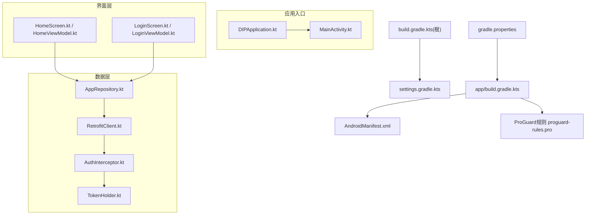
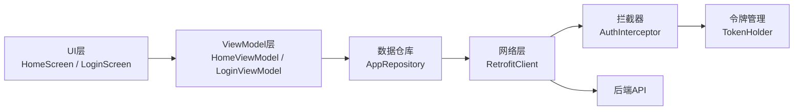
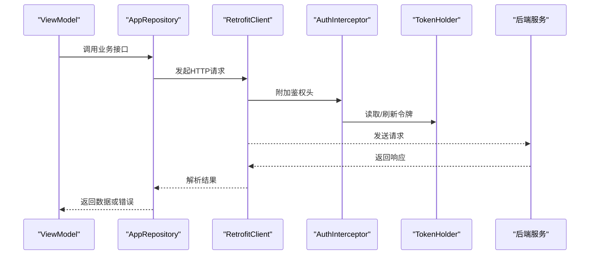
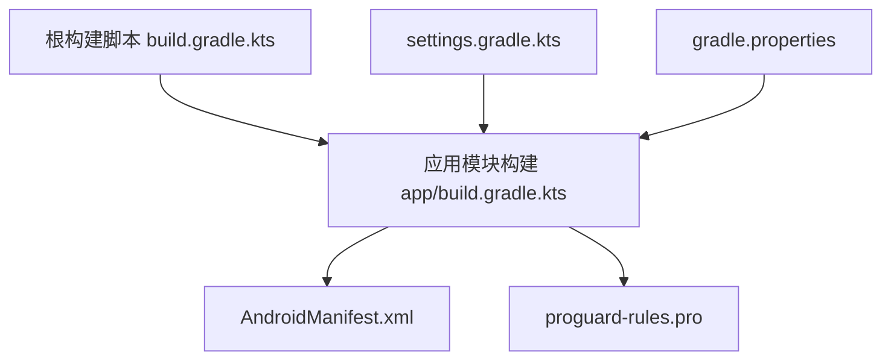

# 开发指南

<cite>
**本文引用的文件**   
- [mobile-android/app/build.gradle.kts](file://mobile-android/app/build.gradle.kts)
- [mobile-android/build.gradle.kts](file://mobile-android/build.gradle.kts)
- [mobile-android/settings.gradle.kts](file://mobile-android/settings.gradle.kts)
- [mobile-android/gradle.properties](file://mobile-android/gradle.properties)
- [mobile-android/app/src/main/java/com/dip/material/DIPApplication.kt](file://mobile-android/app/src/main/java/com/dip/material/DIPApplication.kt)
- [mobile-android/app/src/main/java/com/dip/material/MainActivity.kt](file://mobile-android/app/src/main/java/com/dip/material/MainActivity.kt)
- [mobile-android/app/src/main/AndroidManifest.xml](file://mobile-android/app/src/main/AndroidManifest.xml)
- [mobile-android/app/src/main/java/com/dip/material/data/network/RetrofitClient.kt](file://mobile-android/app/src/main/java/com/dip/material/data/network/RetrofitClient.kt)
- [mobile-android/app/src/main/java/com/dip/material/data/network/AuthInterceptor.kt](file://mobile-android/app/src/main/java/com/dip/material/data/network/AuthInterceptor.kt)
- [mobile-android/app/src/main/java/com/dip/material/data/network/TokenHolder.kt](file://mobile-android/app/src/main/java/com/dip/material/data/network/TokenHolder.kt)
- [mobile-android/app/src/main/java/com/dip/material/data/repository/AppRepository.kt](file://mobile-android/app/src/main/java/com/dip/material/data/repository/AppRepository.kt)
- [mobile-android/app/src/main/java/com/dip/material/ui/home/HomeScreen.kt](file://mobile-android/app/src/main/java/com/dip/material/ui/home/HomeScreen.kt)
- [mobile-android/app/src/main/java/com/dip/material/ui/home/HomeViewModel.kt](file://mobile-android/app/src/main/java/com/dip/material/ui/home/HomeViewModel.kt)
- [mobile-android/app/src/main/java/com/dip/material/ui/login/LoginScreen.kt](file://mobile-android/app/src/main/java/com/dip/material/ui/login/LoginScreen.kt)
- [mobile-android/app/src/main/java/com/dip/material/ui/login/LoginViewModel.kt](file://mobile-android/app/src/main/java/com/dip/material/ui/login/LoginViewModel.kt)
- [mobile-android/app/src/main/java/com/dip/material/utils/PreferencesManager.kt](file://mobile-android/app/src/main/java/com/dip/material/utils/PreferencesManager.kt)
- [mobile-android/app/proguard-rules.pro](file://mobile-android/app/proguard-rules.pro)
</cite>

## 目录
1. [简介](#简介)
2. [项目结构](#项目结构)
3. [核心组件](#核心组件)
4. [架构总览](#架构总览)
5. [详细组件分析](#详细组件分析)
6. [依赖分析](#依赖分析)
7. [性能考虑](#性能考虑)
8. [故障排查指南](#故障排查指南)
9. [结论](#结论)
10. [附录](#附录)

## 简介
本指南面向DIP系统Android应用开发者，覆盖开发环境搭建、IDE配置、Gradle构建系统使用、代码规范与命名约定、注释标准、调试技巧、日志记录、性能分析、测试策略（单元/UI/集成）、代码审查流程、版本控制规范、发布打包流程、常见问题解决方案、性能优化建议与安全编码实践。目标是帮助团队高效协作、稳定交付高质量Android客户端。

## 项目结构
Android模块位于 mobile-android 目录，采用Kotlin + Jetpack Compose + MVVM + Retrofit的网络层架构。关键目录与职责：
- app/src/main/java/com/dip/material：应用主包，包含Application、Activity、UI页面、数据层与工具类
- data/network：网络请求封装、拦截器、令牌管理
- data/repository：业务聚合仓库
- ui：按功能划分的Compose页面与ViewModel
- utils：通用工具（偏好设置、扫描相关等）
- gradle与构建脚本：统一依赖与构建参数

图表来源
- [mobile-android/app/build.gradle.kts](file://mobile-android/app/build.gradle.kts)
- [mobile-android/build.gradle.kts](file://mobile-android/build.gradle.kts)
- [mobile-android/settings.gradle.kts](file://mobile-android/settings.gradle.kts)
- [mobile-android/gradle.properties](file://mobile-android/gradle.properties)
- [mobile-android/app/src/main/AndroidManifest.xml](file://mobile-android/app/src/main/AndroidManifest.xml)
- [mobile-android/app/src/main/java/com/dip/material/DIPApplication.kt](file://mobile-android/app/src/main/java/com/dip/material/DIPApplication.kt)
- [mobile-android/app/src/main/java/com/dip/material/MainActivity.kt](file://mobile-android/app/src/main/java/com/dip/material/MainActivity.kt)
- [mobile-android/app/src/main/java/com/dip/material/data/network/RetrofitClient.kt](file://mobile-android/app/src/main/java/com/dip/material/data/network/RetrofitClient.kt)
- [mobile-android/app/src/main/java/com/dip/material/data/network/AuthInterceptor.kt](file://mobile-android/app/src/main/java/com/dip/material/data/network/AuthInterceptor.kt)
- [mobile-android/app/src/main/java/com/dip/material/data/network/TokenHolder.kt](file://mobile-android/app/src/main/java/com/dip/material/data/network/TokenHolder.kt)
- [mobile-android/app/src/main/java/com/dip/material/data/repository/AppRepository.kt](file://mobile-android/app/src/main/java/com/dip/material/data/repository/AppRepository.kt)
- [mobile-android/app/src/main/java/com/dip/material/ui/home/HomeScreen.kt](file://mobile-android/app/src/main/java/com/dip/material/ui/home/HomeScreen.kt)
- [mobile-android/app/src/main/java/com/dip/material/ui/home/HomeViewModel.kt](file://mobile-android/app/src/main/java/com/dip/material/ui/home/HomeViewModel.kt)
- [mobile-android/app/src/main/java/com/dip/material/ui/login/LoginScreen.kt](file://mobile-android/app/src/main/java/com/dip/material/ui/login/LoginScreen.kt)
- [mobile-android/app/src/main/java/com/dip/material/ui/login/LoginViewModel.kt](file://mobile-android/app/src/main/java/com/dip/material/ui/login/LoginViewModel.kt)

章节来源
- [mobile-android/app/build.gradle.kts](file://mobile-android/app/build.gradle.kts)
- [mobile-android/build.gradle.kts](file://mobile-android/build.gradle.kts)
- [mobile-android/settings.gradle.kts](file://mobile-android/settings.gradle.kts)
- [mobile-android/gradle.properties](file://mobile-android/gradle.properties)
- [mobile-android/app/src/main/AndroidManifest.xml](file://mobile-android/app/src/main/AndroidManifest.xml)

## 核心组件
- 应用启动与主题初始化：DIPApplication负责全局初始化；MainActivity作为Compose入口
- 网络层：RetrofitClient提供统一的HTTP客户端；AuthInterceptor处理鉴权头；TokenHolder集中管理令牌
- 数据仓库：AppRepository聚合业务接口调用，向上暴露领域方法
- UI层：以功能为边界的Compose Screen与对应ViewModel，遵循状态提升与单向数据流

章节来源
- [mobile-android/app/src/main/java/com/dip/material/DIPApplication.kt](file://mobile-android/app/src/main/java/com/dip/material/DIPApplication.kt)
- [mobile-android/app/src/main/java/com/dip/material/MainActivity.kt](file://mobile-android/app/src/main/java/com/dip/material/MainActivity.kt)
- [mobile-android/app/src/main/java/com/dip/material/data/network/RetrofitClient.kt](file://mobile-android/app/src/main/java/com/dip/material/data/network/RetrofitClient.kt)
- [mobile-android/app/src/main/java/com/dip/material/data/network/AuthInterceptor.kt](file://mobile-android/app/src/main/java/com/dip/material/data/network/AuthInterceptor.kt)
- [mobile-android/app/src/main/java/com/dip/material/data/network/TokenHolder.kt](file://mobile-android/app/src/main/java/com/dip/material/data/network/TokenHolder.kt)
- [mobile-android/app/src/main/java/com/dip/material/data/repository/AppRepository.kt](file://mobile-android/app/src/main/java/com/dip/material/data/repository/AppRepository.kt)
- [mobile-android/app/src/main/java/com/dip/material/ui/home/HomeScreen.kt](file://mobile-android/app/src/main/java/com/dip/material/ui/home/HomeScreen.kt)
- [mobile-android/app/src/main/java/com/dip/material/ui/home/HomeViewModel.kt](file://mobile-android/app/src/main/java/com/dip/material/ui/home/HomeViewModel.kt)
- [mobile-android/app/src/main/java/com/dip/material/ui/login/LoginScreen.kt](file://mobile-android/app/src/main/java/com/dip/material/ui/login/LoginScreen.kt)
- [mobile-android/app/src/main/java/com/dip/material/ui/login/LoginViewModel.kt](file://mobile-android/app/src/main/java/com/dip/material/ui/login/LoginViewModel.kt)

## 架构总览
整体采用MVVM + Compose的声明式UI，数据通过Repository抽象到网络层，鉴权通过拦截器自动注入。

图表来源
- [mobile-android/app/src/main/java/com/dip/material/ui/home/HomeScreen.kt](file://mobile-android/app/src/main/java/com/dip/material/ui/home/HomeScreen.kt)
- [mobile-android/app/src/main/java/com/dip/material/ui/home/HomeViewModel.kt](file://mobile-android/app/src/main/java/com/dip/material/ui/home/HomeViewModel.kt)
- [mobile-android/app/src/main/java/com/dip/material/ui/login/LoginScreen.kt](file://mobile-android/app/src/main/java/com/dip/material/ui/login/LoginScreen.kt)
- [mobile-android/app/src/main/java/com/dip/material/ui/login/LoginViewModel.kt](file://mobile-android/app/src/main/java/com/dip/material/ui/login/LoginViewModel.kt)
- [mobile-android/app/src/main/java/com/dip/material/data/repository/AppRepository.kt](file://mobile-android/app/src/main/java/com/dip/material/data/repository/AppRepository.kt)
- [mobile-android/app/src/main/java/com/dip/material/data/network/RetrofitClient.kt](file://mobile-android/app/src/main/java/com/dip/material/data/network/RetrofitClient.kt)
- [mobile-android/app/src/main/java/com/dip/material/data/network/AuthInterceptor.kt](file://mobile-android/app/src/main/java/com/dip/material/data/network/AuthInterceptor.kt)
- [mobile-android/app/src/main/java/com/dip/material/data/network/TokenHolder.kt](file://mobile-android/app/src/main/java/com/dip/material/data/network/TokenHolder.kt)

## 详细组件分析

### 构建系统与Gradle配置
- 根级构建脚本用于统一插件与依赖版本管理
- 应用模块构建脚本定义编译SDK、目标SDK、最小SDK、签名配置、资源与清单合并、混淆规则
- settings.gradle.kts声明模块与仓库源
- gradle.properties集中配置构建参数（如内存、并行、AndroidX开关等）

章节来源
- [mobile-android/build.gradle.kts](file://mobile-android/build.gradle.kts)
- [mobile-android/app/build.gradle.kts](file://mobile-android/app/build.gradle.kts)
- [mobile-android/settings.gradle.kts](file://mobile-android/settings.gradle.kts)
- [mobile-android/gradle.properties](file://mobile-android/gradle.properties)

### 应用入口与主界面
- DIPApplication：应用级初始化（主题、网络、存储等）
- MainActivity：Compose根节点与导航入口

章节来源
- [mobile-android/app/src/main/java/com/dip/material/DIPApplication.kt](file://mobile-android/app/src/main/java/com/dip/material/DIPApplication.kt)
- [mobile-android/app/src/main/java/com/dip/material/MainActivity.kt](file://mobile-android/app/src/main/java/com/dip/material/MainActivity.kt)

### 网络层与鉴权
- RetrofitClient：单例HTTP客户端，统一Base URL、超时、序列化等
- AuthInterceptor：在请求头中注入认证信息（如Authorization），并处理401重定向登录
- TokenHolder：集中存取当前用户令牌，支持过期刷新策略

图表来源
- [mobile-android/app/src/main/java/com/dip/material/data/network/RetrofitClient.kt](file://mobile-android/app/src/main/java/com/dip/material/data/network/RetrofitClient.kt)
- [mobile-android/app/src/main/java/com/dip/material/data/network/AuthInterceptor.kt](file://mobile-android/app/src/main/java/com/dip/material/data/network/AuthInterceptor.kt)
- [mobile-android/app/src/main/java/com/dip/material/data/network/TokenHolder.kt](file://mobile-android/app/src/main/java/com/dip/material/data/network/TokenHolder.kt)
- [mobile-android/app/src/main/java/com/dip/material/data/repository/AppRepository.kt](file://mobile-android/app/src/main/java/com/dip/material/data/repository/AppRepository.kt)

章节来源
- [mobile-android/app/src/main/java/com/dip/material/data/network/RetrofitClient.kt](file://mobile-android/app/src/main/java/com/dip/material/data/network/RetrofitClient.kt)
- [mobile-android/app/src/main/java/com/dip/material/data/network/AuthInterceptor.kt](file://mobile-android/app/src/main/java/com/dip/material/data/network/AuthInterceptor.kt)
- [mobile-android/app/src/main/java/com/dip/material/data/network/TokenHolder.kt](file://mobile-android/app/src/main/java/com/dip/material/data/network/TokenHolder.kt)
- [mobile-android/app/src/main/java/com/dip/material/data/repository/AppRepository.kt](file://mobile-android/app/src/main/java/com/dip/material/data/repository/AppRepository.kt)

### UI与状态管理
- HomeScreen与HomeViewModel：首页展示与状态管理，通过Repository获取数据
- LoginScreen与LoginViewModel：登录流程，成功后更新令牌并跳转

章节来源
- [mobile-android/app/src/main/java/com/dip/material/ui/home/HomeScreen.kt](file://mobile-android/app/src/main/java/com/dip/material/ui/home/HomeScreen.kt)
- [mobile-android/app/src/main/java/com/dip/material/ui/home/HomeViewModel.kt](file://mobile-android/app/src/main/java/com/dip/material/ui/home/HomeViewModel.kt)
- [mobile-android/app/src/main/java/com/dip/material/ui/login/LoginScreen.kt](file://mobile-android/app/src/main/java/com/dip/material/ui/login/LoginScreen.kt)
- [mobile-android/app/src/main/java/com/dip/material/ui/login/LoginViewModel.kt](file://mobile-android/app/src/main/java/com/dip/material/ui/login/LoginViewModel.kt)

### 本地持久化
- PreferencesManager：封装SharedPreferences，用于保存令牌、用户信息等

章节来源
- [mobile-android/app/src/main/java/com/dip/material/utils/PreferencesManager.kt](file://mobile-android/app/src/main/java/com/dip/material/utils/PreferencesManager.kt)

## 依赖分析
- 构建期依赖由根构建脚本统一管理，避免版本漂移
- 运行时依赖集中在应用模块，包括网络、UI、工具库
- 模块内依赖清晰：UI依赖ViewModel，ViewModel依赖Repository，Repository依赖网络层

图表来源
- [mobile-android/build.gradle.kts](file://mobile-android/build.gradle.kts)
- [mobile-android/app/build.gradle.kts](file://mobile-android/app/build.gradle.kts)
- [mobile-android/settings.gradle.kts](file://mobile-android/settings.gradle.kts)
- [mobile-android/gradle.properties](file://mobile-android/gradle.properties)
- [mobile-android/app/src/main/AndroidManifest.xml](file://mobile-android/app/src/main/AndroidManifest.xml)
- [mobile-android/app/proguard-rules.pro](file://mobile-android/app/proguard-rules.pro)

章节来源
- [mobile-android/build.gradle.kts](file://mobile-android/build.gradle.kts)
- [mobile-android/app/build.gradle.kts](file://mobile-android/app/build.gradle.kts)
- [mobile-android/settings.gradle.kts](file://mobile-android/settings.gradle.kts)
- [mobile-android/gradle.properties](file://mobile-android/gradle.properties)

## 性能考虑
- 网络层
  - 合理设置超时与重试策略，避免频繁重试导致雪崩
  - 启用GZIP压缩与连接池复用
  - 对大列表使用分页加载与懒加载
- UI层
  - 减少重组范围，拆分可组合项，使用remember缓存计算结果
  - 避免在主线程执行耗时操作，使用协程调度
- 存储
  - 合理使用SharedPreferences，避免频繁写入；必要时迁移至Room
- 构建与运行
  - 开启增量编译与并行构建
  - 使用R8/ProGuard进行代码压缩与混淆

[本节为通用指导，不直接分析具体文件]

## 故障排查指南
- 构建失败
  - 检查JDK版本与Android SDK路径配置
  - 清理构建缓存后重试
- 网络异常
  - 确认Base URL与证书配置
  - 查看拦截器是否成功注入令牌
  - 检查服务端返回码与错误体格式
- 登录失效
  - 校验Token有效期与刷新逻辑
  - 确认401时是否正确跳转登录页
- 崩溃与ANR
  - 使用Logcat过滤关键字定位
  - 检查主线程阻塞与未捕获异常

章节来源
- [mobile-android/app/src/main/java/com/dip/material/data/network/AuthInterceptor.kt](file://mobile-android/app/src/main/java/com/dip/material/data/network/AuthInterceptor.kt)
- [mobile-android/app/src/main/java/com/dip/material/data/network/TokenHolder.kt](file://mobile-android/app/src/main/java/com/dip/material/data/network/TokenHolder.kt)
- [mobile-android/app/src/main/java/com/dip/material/ui/login/LoginViewModel.kt](file://mobile-android/app/src/main/java/com/dip/material/ui/login/LoginViewModel.kt)

## 结论
本指南基于现有代码结构与实现，提供了从环境搭建到发布上线的全链路开发参考。建议团队在此基础上补充单元测试与UI自动化测试，完善CI/CD流水线，持续优化性能与安全。

[本节为总结性内容，不直接分析具体文件]

## 附录

### 开发环境与IDE配置
- Android Studio推荐版本：最新稳定版
- JDK：与Gradle要求匹配（通常JDK 11或以上）
- Android SDK：安装平台与构建工具，确保命令行可用
- 设备与模拟器：至少一个API级别满足最小SDK的设备

[本节为通用指导，不直接分析具体文件]

### Gradle构建命令
- 清理与构建：./gradlew clean assembleDebug
- 运行测试：./gradlew test
- 生成APK/AAB：./gradlew assembleRelease
- 查看依赖树：./gradlew app:dependencies

[本节为通用指导，不直接分析具体文件]

### 代码规范与命名约定
- Kotlin风格：遵循官方Kotlin风格指南
- 包名：全小写，按功能划分
- 类与方法：驼峰命名，动词开头的方法表达动作
- 常量：全大写加下划线
- 注释：公共API添加KDoc，复杂逻辑行内注释说明意图

[本节为通用指导，不直接分析具体文件]

### 调试技巧与日志记录
- Logcat：按包名或标签过滤，结合优先级筛选
- 断点调试：在ViewModel与Repository处设置断点验证数据流
- 网络抓包：使用Charles/Fiddler代理HTTPS，需信任证书
- 日志规范：区分DEBUG/INFO/WARN/ERROR，避免输出敏感信息

[本节为通用指导，不直接分析具体文件]

### 性能分析工具
- Profiler：CPU/内存/网络/能耗分析
- Layout Inspector：布局层级与重组热点
- LeakCanary：内存泄漏检测

[本节为通用指导，不直接分析具体文件]

### 测试策略
- 单元测试：对ViewModel与Repository进行Mock测试，验证状态与数据转换
- UI测试：使用Compose Testing或Espresso编写端到端用例
- 集成测试：对网络层进行Mock，验证完整业务流程

[本节为通用指导，不直接分析具体文件]

### 代码审查流程
- 提交前自测：通过静态检查与本地测试
- Pull Request：描述变更动机、影响范围与测试证据
- 审查要点：可读性、健壮性、安全性、性能与可维护性

[本节为通用指导，不直接分析具体文件]

### 版本控制规范
- 分支模型：主干保护，功能分支开发，热修复分支
- 提交信息：语义化提交（feat/fix/docs等）
- 标签与里程碑：按版本打标签，关联需求与问题

[本节为通用指导，不直接分析具体文件]

### 发布与打包
- 签名配置：Keystore安全保管，避免硬编码密码
- 混淆与优化：启用R8/ProGuard，按需保留反射与注解
- 产物校验：校验签名、资源与依赖合规

章节来源
- [mobile-android/app/proguard-rules.pro](file://mobile-android/app/proguard-rules.pro)

### 常见开发问题与解决方案
- 依赖冲突：使用./gradlew dependencies --configuration releaseRuntimeClasspath排查
- 构建慢：开启并行、增量编译与守护进程
- 网络跨域/证书：正确配置域名与证书，生产环境禁用调试

[本节为通用指导，不直接分析具体文件]

### 安全编码实践
- 敏感信息：不在日志与代码中明文存放密钥
- 输入校验：服务端与客户端双重校验
- 权限最小化：按需申请系统权限
- 通信安全：强制HTTPS，校验证书与主机名

[本节为通用指导，不直接分析具体文件]