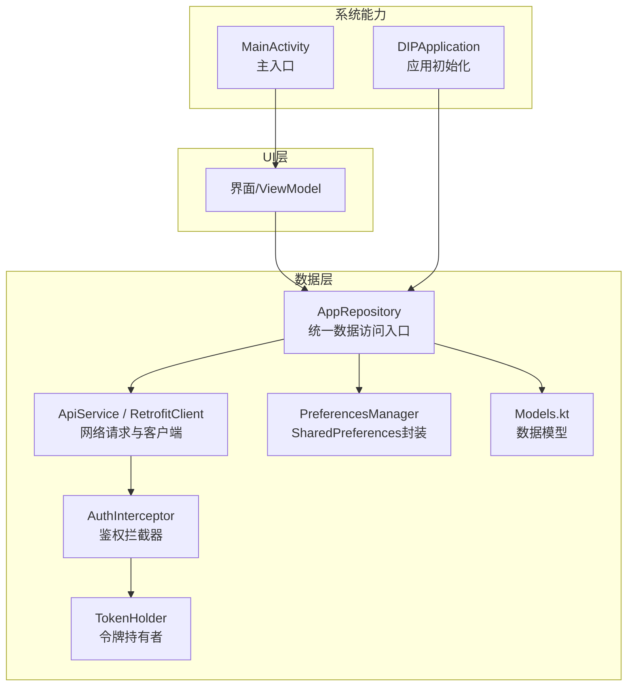
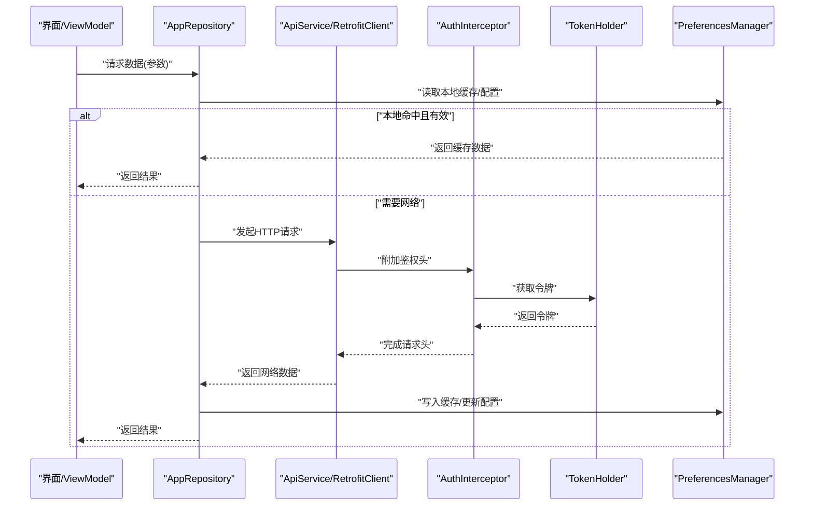
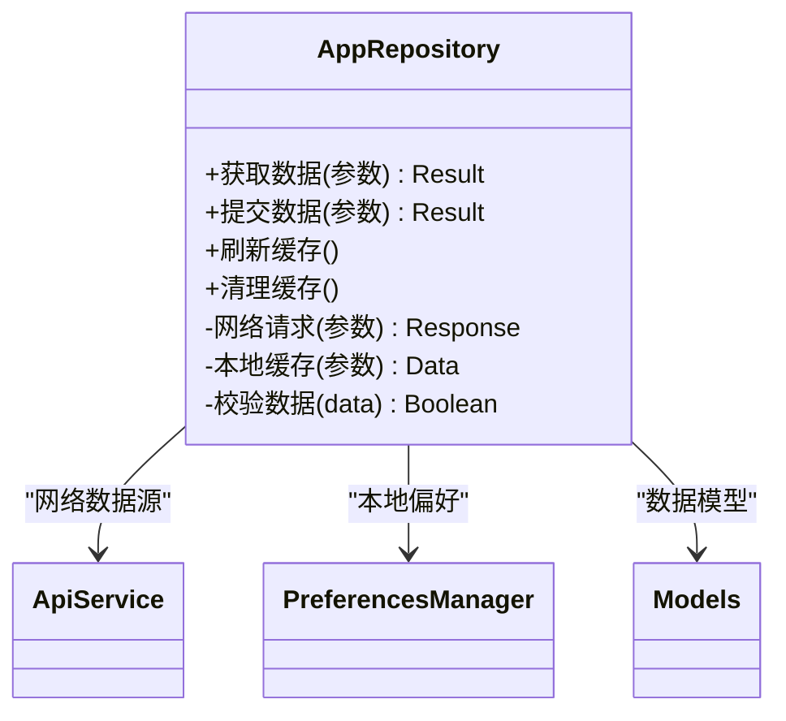
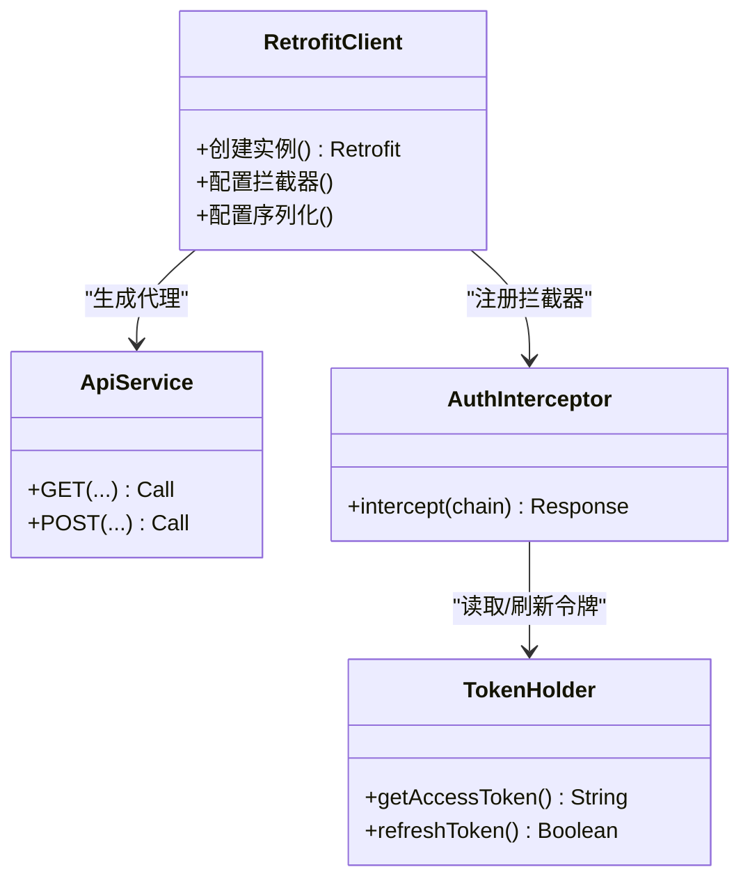
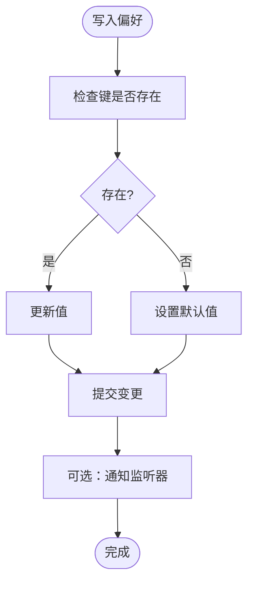
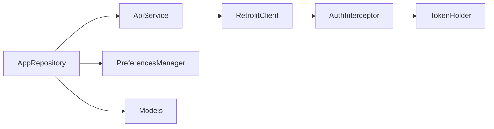

# 数据存储管理

<cite>
**本文引用的文件**   
- [AppRepository.kt](file://mobile-android/app/src/main/java/com/dip/material/data/repository/AppRepository.kt)
- [ApiService.kt](file://mobile-android/app/src/main/java/com/dip/material/data/network/ApiService.kt)
- [RetrofitClient.kt](file://mobile-android/app/src/main/java/com/dip/material/data/network/RetrofitClient.kt)
- [AuthInterceptor.kt](file://mobile-android/app/src/main/java/com/dip/material/data/network/AuthInterceptor.kt)
- [TokenHolder.kt](file://mobile-android/app/src/main/java/com/dip/material/data/network/TokenHolder.kt)
- [Models.kt](file://mobile-android/app/src/main/java/com/dip/material/data/models/Models.kt)
- [PreferencesManager.kt](file://mobile-android/app/src/main/java/com/dip/material/utils/PreferencesManager.kt)
- [DIPApplication.kt](file://mobile-android/app/src/main/java/com/dip/material/DIPApplication.kt)
- [MainActivity.kt](file://mobile-android/app/src/main/java/com/dip/material/MainActivity.kt)
</cite>

## 目录
1. [简介](#简介)
2. [项目结构](#项目结构)
3. [核心组件](#核心组件)
4. [架构总览](#架构总览)
5. [详细组件分析](#详细组件分析)
6. [依赖关系分析](#依赖关系分析)
7. [性能考虑](#性能考虑)
8. [故障排查指南](#故障排查指南)
9. [结论](#结论)
10. [附录](#附录)

## 简介
本文件面向DIP系统Android应用的数据存储与持久化，聚焦以下目标：
- SharedPreferences使用与偏好设置封装
- Repository模式实现、数据源抽象与缓存策略设计
- 本地数据库操作（如引入Room）与离线数据管理
- 数据同步机制（网络与本地一致性）
- 数据加密存储、备份恢复、存储空间优化
- 数据迁移方案、版本兼容性与内存泄漏防护

说明：当前仓库中已实现的本地持久化以SharedPreferences为主，未包含本地数据库实现。本文在“现状”基础上给出“建议与演进路径”，以便后续扩展至Room等本地数据库。

## 项目结构
Android端数据层位于 data 包下，包含模型、网络与仓库；工具层提供偏好设置封装；UI层通过ViewModel消费仓库提供的数据。

图表来源
- [AppRepository.kt:1-200](file://mobile-android/app/src/main/java/com/dip/material/data/repository/AppRepository.kt#L1-L200)
- [ApiService.kt:1-200](file://mobile-android/app/src/main/java/com/dip/material/data/network/ApiService.kt#L1-L200)
- [RetrofitClient.kt:1-200](file://mobile-android/app/src/main/java/com/dip/material/data/network/RetrofitClient.kt#L1-L200)
- [AuthInterceptor.kt:1-200](file://mobile-android/app/src/main/java/com/dip/material/data/network/AuthInterceptor.kt#L1-L200)
- [TokenHolder.kt:1-200](file://mobile-android/app/src/main/java/com/dip/material/data/network/TokenHolder.kt#L1-L200)
- [PreferencesManager.kt:1-200](file://mobile-android/app/src/main/java/com/dip/material/utils/PreferencesManager.kt#L1-L200)
- [Models.kt:1-200](file://mobile-android/app/src/main/java/com/dip/material/data/models/Models.kt#L1-L200)
- [DIPApplication.kt:1-200](file://mobile-android/app/src/main/java/com/dip/material/DIPApplication.kt#L1-L200)
- [MainActivity.kt:1-200](file://mobile-android/app/src/main/java/com/dip/material/MainActivity.kt#L1-L200)

章节来源
- [AppRepository.kt:1-200](file://mobile-android/app/src/main/java/com/dip/material/data/repository/AppRepository.kt#L1-L200)
- [ApiService.kt:1-200](file://mobile-android/app/src/main/java/com/dip/material/data/network/ApiService.kt#L1-L200)
- [RetrofitClient.kt:1-200](file://mobile-android/app/src/main/java/com/dip/material/data/network/RetrofitClient.kt#L1-L200)
- [AuthInterceptor.kt:1-200](file://mobile-android/app/src/main/java/com/dip/material/data/network/AuthInterceptor.kt#L1-L200)
- [TokenHolder.kt:1-200](file://mobile-android/app/src/main/java/com/dip/material/data/network/TokenHolder.kt#L1-L200)
- [PreferencesManager.kt:1-200](file://mobile-android/app/src/main/java/com/dip/material/utils/PreferencesManager.kt#L1-L200)
- [Models.kt:1-200](file://mobile-android/app/src/main/java/com/dip/material/data/models/Models.kt#L1-L200)
- [DIPApplication.kt:1-200](file://mobile-android/app/src/main/java/com/dip/material/DIPApplication.kt#L1-L200)
- [MainActivity.kt:1-200](file://mobile-android/app/src/main/java/com/dip/material/MainActivity.kt#L1-L200)

## 核心组件
- 仓库层（Repository）
  - 职责：聚合多数据源（网络、本地），对外暴露统一API；负责缓存策略、重试与错误处理。
  - 关键类：AppRepository
- 网络层（Network）
  - 职责：定义接口、构建客户端、添加鉴权拦截器、令牌管理。
  - 关键类：ApiService、RetrofitClient、AuthInterceptor、TokenHolder
- 偏好设置（SharedPreferences）
  - 职责：轻量配置与用户偏好存储；提供类型安全的读写封装。
  - 关键类：PreferencesManager
- 数据模型（Models）
  - 职责：定义网络响应与本地实体结构，供Repository与UI层共享。
  - 关键类：Models.kt中的各类数据模型
- 应用与入口
  - 职责：全局初始化（如网络、权限、日志）、生命周期管理。
  - 关键类：DIPApplication、MainActivity

章节来源
- [AppRepository.kt:1-200](file://mobile-android/app/src/main/java/com/dip/material/data/repository/AppRepository.kt#L1-L200)
- [ApiService.kt:1-200](file://mobile-android/app/src/main/java/com/dip/material/data/network/ApiService.kt#L1-L200)
- [RetrofitClient.kt:1-200](file://mobile-android/app/src/main/java/com/dip/material/data/network/RetrofitClient.kt#L1-L200)
- [AuthInterceptor.kt:1-200](file://mobile-android/app/src/main/java/com/dip/material/data/network/AuthInterceptor.kt#L1-L200)
- [TokenHolder.kt:1-200](file://mobile-android/app/src/main/java/com/dip/material/data/network/TokenHolder.kt#L1-L200)
- [PreferencesManager.kt:1-200](file://mobile-android/app/src/main/java/com/dip/material/utils/PreferencesManager.kt#L1-L200)
- [Models.kt:1-200](file://mobile-android/app/src/main/java/com/dip/material/data/models/Models.kt#L1-L200)
- [DIPApplication.kt:1-200](file://mobile-android/app/src/main/java/com/dip/material/DIPApplication.kt#L1-L200)
- [MainActivity.kt:1-200](file://mobile-android/app/src/main/java/com/dip/material/MainActivity.kt#L1-L200)

## 架构总览
下图展示从UI到数据源的调用链与数据流向，突出Repository作为统一入口的职责。

图表来源
- [AppRepository.kt:1-200](file://mobile-android/app/src/main/java/com/dip/material/data/repository/AppRepository.kt#L1-L200)
- [ApiService.kt:1-200](file://mobile-android/app/src/main/java/com/dip/material/data/network/ApiService.kt#L1-L200)
- [RetrofitClient.kt:1-200](file://mobile-android/app/src/main/java/com/dip/material/data/network/RetrofitClient.kt#L1-L200)
- [AuthInterceptor.kt:1-200](file://mobile-android/app/src/main/java/com/dip/material/data/network/AuthInterceptor.kt#L1-L200)
- [TokenHolder.kt:1-200](file://mobile-android/app/src/main/java/com/dip/material/data/network/TokenHolder.kt#L1-L200)
- [PreferencesManager.kt:1-200](file://mobile-android/app/src/main/java/com/dip/material/utils/PreferencesManager.kt#L1-L200)

## 详细组件分析

### 仓库层（AppRepository）
- 职责
  - 统一数据访问入口，屏蔽网络与本地差异
  - 缓存策略：优先读本地，失效时回源网络并回填缓存
  - 错误处理：网络异常、鉴权失败、数据校验
  - 并发控制：避免重复请求（可结合协程或RxJava）
- 设计要点
  - 将业务语义封装为方法（如获取列表、提交表单）
  - 对敏感字段进行脱敏后再落盘
  - 提供刷新与强制拉取接口
- 建议扩展
  - 引入Room作为二级缓存，提升复杂查询与离线能力
  - 增加缓存过期时间、LRU淘汰策略
  - 增加数据一致性校验（ETag/Last-Modified）

图表来源
- [AppRepository.kt:1-200](file://mobile-android/app/src/main/java/com/dip/material/data/repository/AppRepository.kt#L1-L200)
- [ApiService.kt:1-200](file://mobile-android/app/src/main/java/com/dip/material/data/network/ApiService.kt#L1-L200)
- [PreferencesManager.kt:1-200](file://mobile-android/app/src/main/java/com/dip/material/utils/PreferencesManager.kt#L1-L200)
- [Models.kt:1-200](file://mobile-android/app/src/main/java/com/dip/material/data/models/Models.kt#L1-L200)

章节来源
- [AppRepository.kt:1-200](file://mobile-android/app/src/main/java/com/dip/material/data/repository/AppRepository.kt#L1-L200)

### 网络层（ApiService / RetrofitClient / AuthInterceptor / TokenHolder）
- 职责
  - 定义REST API接口（ApiService）
  - 构建Retrofit实例（RetrofitClient），配置超时、序列化、拦截器
  - 鉴权拦截器（AuthInterceptor）自动附加令牌
  - 令牌持有者（TokenHolder）集中管理登录态与过期刷新
- 设计要点
  - 统一错误码映射与重试策略
  - 安全传输（HTTPS）、敏感头过滤
  - 令牌刷新流程（401触发刷新后重试）
- 建议扩展
  - 增加请求日志与性能监控
  - 支持断点续传与批量请求合并

图表来源
- [RetrofitClient.kt:1-200](file://mobile-android/app/src/main/java/com/dip/material/data/network/RetrofitClient.kt#L1-L200)
- [ApiService.kt:1-200](file://mobile-android/app/src/main/java/com/dip/material/data/network/ApiService.kt#L1-L200)
- [AuthInterceptor.kt:1-200](file://mobile-android/app/src/main/java/com/dip/material/data/network/AuthInterceptor.kt#L1-L200)
- [TokenHolder.kt:1-200](file://mobile-android/app/src/main/java/com/dip/material/data/network/TokenHolder.kt#L1-L200)

章节来源
- [ApiService.kt:1-200](file://mobile-android/app/src/main/java/com/dip/material/data/network/ApiService.kt#L1-L200)
- [RetrofitClient.kt:1-200](file://mobile-android/app/src/main/java/com/dip/material/data/network/RetrofitClient.kt#L1-L200)
- [AuthInterceptor.kt:1-200](file://mobile-android/app/src/main/java/com/dip/material/data/network/AuthInterceptor.kt#L1-L200)
- [TokenHolder.kt:1-200](file://mobile-android/app/src/main/java/com/dip/material/data/network/TokenHolder.kt#L1-L200)

### 偏好设置封装（PreferencesManager）
- 职责
  - 对SharedPreferences进行类型安全封装
  - 提供常用键值存取（字符串、布尔、数字、JSON等）
  - 支持默认值、监听变化、批量操作
- 设计要点
  - 键名统一管理，避免硬编码
  - 敏感信息加密存储（见下文“加密存储”）
  - 异步写入与事务性提交
- 建议扩展
  - 引入DataStore替代SharedPreferences以获得更好的类型与协程支持
  - 增加版本迁移与兼容性处理

图表来源
- [PreferencesManager.kt:1-200](file://mobile-android/app/src/main/java/com/dip/material/utils/PreferencesManager.kt#L1-L200)

章节来源
- [PreferencesManager.kt:1-200](file://mobile-android/app/src/main/java/com/dip/material/utils/PreferencesManager.kt#L1-L200)

### 数据模型（Models.kt）
- 职责
  - 定义网络响应体、请求体与本地实体
  - 保持前后端契约一致，便于序列化/反序列化
- 设计要点
  - 使用不可变数据结构（data class）
  - 区分DTO与Domain Model，必要时做转换
  - 对枚举与状态码进行集中管理

章节来源
- [Models.kt:1-200](file://mobile-android/app/src/main/java/com/dip/material/data/models/Models.kt#L1-L200)

### 应用与入口（DIPApplication / MainActivity）
- 职责
  - DIPApplication：全局初始化（网络、日志、权限、崩溃收集）
  - MainActivity：应用启动、导航、权限申请
- 设计要点
  - 避免在Application中持有长生命周期对象导致内存泄漏
  - 延迟初始化重资源，缩短冷启动时间

章节来源
- [DIPApplication.kt:1-200](file://mobile-android/app/src/main/java/com/dip/material/DIPApplication.kt#L1-L200)
- [MainActivity.kt:1-200](file://mobile-android/app/src/main/java/com/dip/material/MainActivity.kt#L1-L200)

## 依赖关系分析
- 耦合度
  - Repository与网络、偏好设置解耦，便于替换数据源
  - 网络层通过拦截器与令牌持有者解耦鉴权逻辑
- 外部依赖
  - Retrofit、OkHttp、Gson/Moshi（序列化）
  - SharedPreferences（当前）；建议逐步迁移至DataStore
- 潜在循环依赖
  - 确保Repository不反向依赖UI；TokenHolder仅依赖基础库

图表来源
- [AppRepository.kt:1-200](file://mobile-android/app/src/main/java/com/dip/material/data/repository/AppRepository.kt#L1-L200)
- [ApiService.kt:1-200](file://mobile-android/app/src/main/java/com/dip/material/data/network/ApiService.kt#L1-L200)
- [RetrofitClient.kt:1-200](file://mobile-android/app/src/main/java/com/dip/material/data/network/RetrofitClient.kt#L1-L200)
- [AuthInterceptor.kt:1-200](file://mobile-android/app/src/main/java/com/dip/material/data/network/AuthInterceptor.kt#L1-L200)
- [TokenHolder.kt:1-200](file://mobile-android/app/src/main/java/com/dip/material/data/network/TokenHolder.kt#L1-L200)
- [PreferencesManager.kt:1-200](file://mobile-android/app/src/main/java/com/dip/material/utils/PreferencesManager.kt#L1-L200)
- [Models.kt:1-200](file://mobile-android/app/src/main/java/com/dip/material/data/models/Models.kt#L1-L200)

章节来源
- [AppRepository.kt:1-200](file://mobile-android/app/src/main/java/com/dip/material/data/repository/AppRepository.kt#L1-L200)
- [ApiService.kt:1-200](file://mobile-android/app/src/main/java/com/dip/material/data/network/ApiService.kt#L1-L200)
- [RetrofitClient.kt:1-200](file://mobile-android/app/src/main/java/com/dip/material/data/network/RetrofitClient.kt#L1-L200)
- [AuthInterceptor.kt:1-200](file://mobile-android/app/src/main/java/com/dip/material/data/network/AuthInterceptor.kt#L1-L200)
- [TokenHolder.kt:1-200](file://mobile-android/app/src/main/java/com/dip/material/data/network/TokenHolder.kt#L1-L200)
- [PreferencesManager.kt:1-200](file://mobile-android/app/src/main/java/com/dip/material/utils/PreferencesManager.kt#L1-L200)
- [Models.kt:1-200](file://mobile-android/app/src/main/java/com/dip/material/data/models/Models.kt#L1-L200)

## 性能考虑
- 缓存策略
  - 热点数据短期缓存（TTL），减少网络请求
  - 大列表分页加载与懒加载
- 网络优化
  - 合理设置超时与重试次数
  - 启用Gzip压缩与连接复用
- I/O优化
  - 偏好设置批量写入，避免频繁提交
  - 避免在主线程执行耗时I/O
- 内存管理
  - 避免在Repository中持有Activity/Fragment引用
  - 及时释放Bitmap等大对象

[本节为通用指导，无需特定文件来源]

## 故障排查指南
- 常见问题
  - 401未授权：检查TokenHolder是否过期、AuthInterceptor是否正确附加令牌
  - 缓存不一致：确认缓存失效策略与刷新时机
  - 偏好设置读写失败：检查键名、类型匹配与权限
- 定位手段
  - 开启Retrofit日志（调试环境）
  - 打印关键路径的耗时与异常堆栈
  - 使用Android Studio Profiler观察内存与I/O

章节来源
- [AuthInterceptor.kt:1-200](file://mobile-android/app/src/main/java/com/dip/material/data/network/AuthInterceptor.kt#L1-L200)
- [TokenHolder.kt:1-200](file://mobile-android/app/src/main/java/com/dip/material/data/network/TokenHolder.kt#L1-L200)
- [PreferencesManager.kt:1-200](file://mobile-android/app/src/main/java/com/dip/material/utils/PreferencesManager.kt#L1-L200)

## 结论
当前Android端数据层以Repository为核心，结合Retrofit网络与SharedPreferences偏好设置，形成清晰的数据访问边界。建议在后续迭代中引入Room与DataStore，完善离线能力、数据迁移与加密存储，进一步提升稳定性与可维护性。

[本节为总结，无需特定文件来源]

## 附录

### SharedPreferences使用与偏好设置封装
- 使用建议
  - 将键名集中管理，避免散落在各处
  - 对布尔开关、用户ID、语言、主题等轻量数据进行持久化
  - 避免存储大对象或频繁变更的集合
- 封装要点
  - 类型安全读写、默认值、监听变化
  - 支持批量操作与事务提交
- 参考实现位置
  - [PreferencesManager.kt](file://mobile-android/app/src/main/java/com/dip/material/utils/PreferencesManager.kt)

章节来源
- [PreferencesManager.kt:1-200](file://mobile-android/app/src/main/java/com/dip/material/utils/PreferencesManager.kt#L1-L200)

### Repository模式实现与数据源抽象
- 实现要点
  - 统一接口，隐藏数据源细节
  - 明确缓存优先级与失效条件
  - 错误分类与重试策略
- 数据源抽象
  - 网络数据源（ApiService）
  - 本地数据源（SharedPreferences/未来Room）
- 参考实现位置
  - [AppRepository.kt](file://mobile-android/app/src/main/java/com/dip/material/data/repository/AppRepository.kt)

章节来源
- [AppRepository.kt:1-200](file://mobile-android/app/src/main/java/com/dip/material/data/repository/AppRepository.kt#L1-L200)

### 缓存策略设计
- 策略建议
  - LRU+TTL混合策略
  - 按模块划分缓存空间
  - 冷热数据分离
- 失效与更新
  - 主动刷新与被动失效
  - 版本号与Etag配合
- 参考实现位置
  - [AppRepository.kt](file://mobile-android/app/src/main/java/com/dip/material/data/repository/AppRepository.kt)

章节来源
- [AppRepository.kt:1-200](file://mobile-android/app/src/main/java/com/dip/material/data/repository/AppRepository.kt#L1-L200)

### 本地数据库操作与离线数据管理（建议）
- 推荐技术
  - Room + Kotlin Coroutines + Flow
- 设计要点
  - DAO层抽象CRUD
  - 实体与索引优化查询
  - 离线队列与冲突解决
- 实施步骤
  - 定义Entity、DAO、Database
  - 在Repository中接入本地数据源
  - 实现增量同步与冲突合并

[本节为建议与规划，无需特定文件来源]

### 数据同步机制
- 同步策略
  - 写后同步（Write-through）或写回（Write-behind）
  - 冲突检测与合并策略
- 实现要点
  - 操作日志与幂等性
  - 后台任务调度（WorkManager）
- 参考实现位置
  - [AppRepository.kt](file://mobile-android/app/src/main/java/com/dip/material/data/repository/AppRepository.kt)

章节来源
- [AppRepository.kt:1-200](file://mobile-android/app/src/main/java/com/dip/material/data/repository/AppRepository.kt#L1-L200)

### 数据加密存储
- 适用场景
  - 用户凭证、令牌、敏感配置
- 技术方案
  - Android Keystore + AES-GCM
  - 密钥轮换与备份策略
- 实施要点
  - 避免明文存储
  - 加解密性能与用户体验平衡

[本节为建议与规划，无需特定文件来源]

### 备份恢复与存储空间优化
- 备份恢复
  - 导出/导入关键配置与缓存
  - 云端备份（可选）
- 空间优化
  - 定期清理过期缓存
  - 图片与文件压缩与裁剪

[本节为建议与规划，无需特定文件来源]

### 数据迁移方案与版本兼容性
- 偏好设置迁移
  - 版本键前缀与迁移脚本
  - 兼容旧键名与新键名
- 数据库迁移（引入Room后）
  - Migration脚本与降级策略
- 参考实现位置
  - [PreferencesManager.kt](file://mobile-android/app/src/main/java/com/dip/material/utils/PreferencesManager.kt)

章节来源
- [PreferencesManager.kt:1-200](file://mobile-android/app/src/main/java/com/dip/material/utils/PreferencesManager.kt#L1-L200)

### 内存泄漏防护
- 常见陷阱
  - 静态持有Context/Activity
  - 长生命周期对象引用短生命周期组件
- 防护措施
  - 使用Application Context
  - 协程作用域与生命周期绑定
  - 及时取消订阅与释放资源
- 参考实现位置
  - [DIPApplication.kt](file://mobile-android/app/src/main/java/com/dip/material/DIPApplication.kt)
  - [MainActivity.kt](file://mobile-android/app/src/main/java/com/dip/material/MainActivity.kt)

章节来源
- [DIPApplication.kt:1-200](file://mobile-android/app/src/main/java/com/dip/material/DIPApplication.kt#L1-L200)
- [MainActivity.kt:1-200](file://mobile-android/app/src/main/java/com/dip/material/MainActivity.kt#L1-L200)