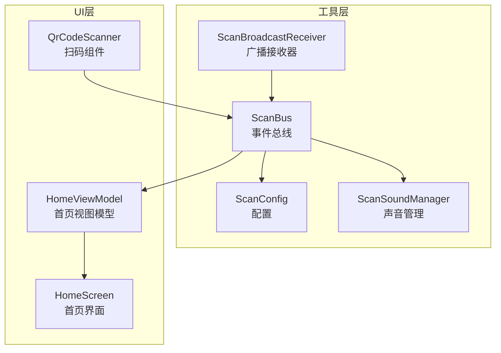
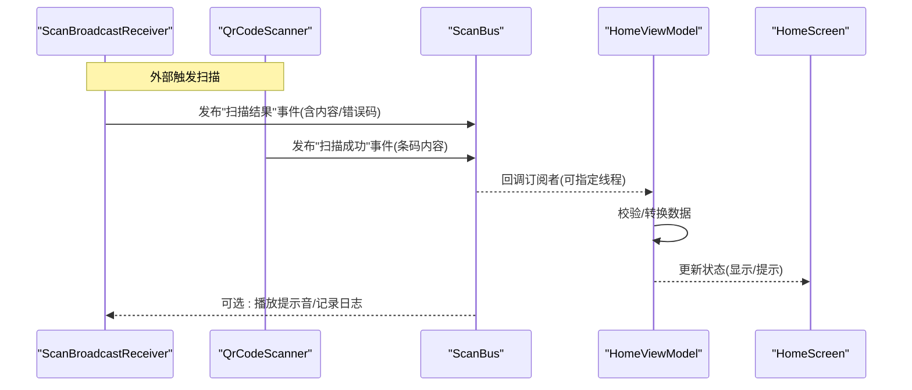
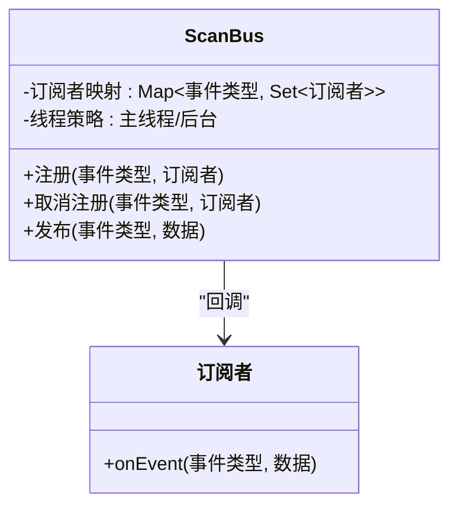
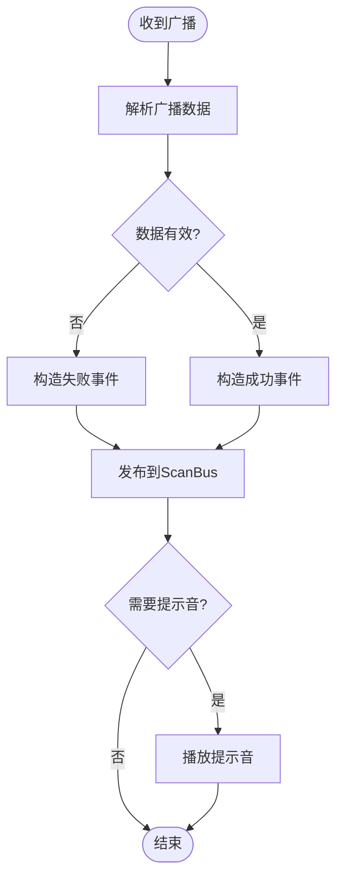
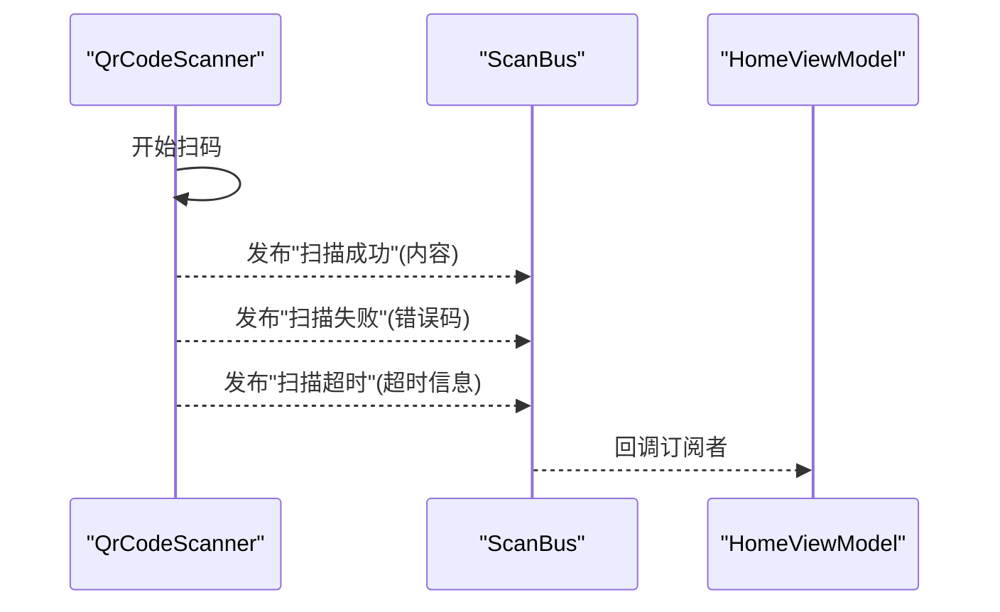
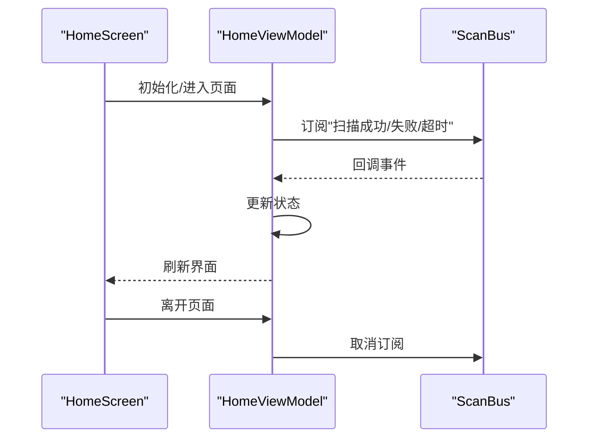
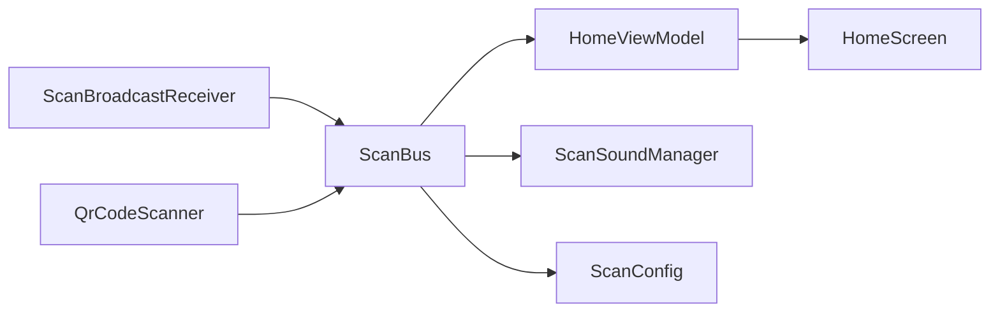

# 事件总线设计

<cite>
**本文引用的文件**   
- [ScanBus.kt](file://mobile-android/app/src/main/java/com/dip/material/utils/ScanBus.kt)
- [ScanBroadcastReceiver.kt](file://mobile-android/app/src/main/java/com/dip/material/utils/ScanBroadcastReceiver.kt)
- [ScanConfig.kt](file://mobile-android/app/src/main/java/com/dip/material/utils/ScanConfig.kt)
- [ScanSoundManager.kt](file://mobile-android/app/src/main/java/com/dip/material/utils/ScanSoundManager.kt)
- [QrCodeScanner.kt](file://mobile-android/app/src/main/java/com/dip/material/ui/components/QrCodeScanner.kt)
- [HomeScreen.kt](file://mobile-android/app/src/main/java/com/dip/material/ui/home/HomeScreen.kt)
- [HomeViewModel.kt](file://mobile-android/app/src/main/java/com/dip/material/ui/home/HomeViewModel.kt)
</cite>

## 目录
1. [简介](#简介)
2. [项目结构](#项目结构)
3. [核心组件](#核心组件)
4. [架构总览](#架构总览)
5. [详细组件分析](#详细组件分析)
6. [依赖关系分析](#依赖关系分析)
7. [性能与内存管理](#性能与内存管理)
8. [故障排查指南](#故障排查指南)
9. [结论](#结论)
10. [附录：使用示例与最佳实践](#附录使用示例与最佳实践)

## 简介
本文件为 ScanBus 事件总线的架构文档，围绕基于发布订阅模式的事件分发机制展开，涵盖事件的定义、注册、发布与消费流程；梳理扫描成功、失败、超时等场景的事件类型与处理策略；给出内存管理与性能优化建议，避免内存泄漏与重复订阅；并提供在业务模块中订阅扫描事件与处理回调的实际用法示例，以及事件调试方法与性能监控建议。

## 项目结构
ScanBus 位于 Android 应用的 utils 包中，作为跨组件的轻量级事件总线，负责将底层扫描结果（广播或扫码组件）解耦到上层 UI 与 ViewModel。相关关键文件包括：
- 事件总线核心：ScanBus.kt
- 广播接收器：ScanBroadcastReceiver.kt
- 配置与声音反馈：ScanConfig.kt、ScanSoundManager.kt
- 扫码组件：QrCodeScanner.kt
- 业务页面与状态：HomeScreen.kt、HomeViewModel.kt

图表来源
- [ScanBus.kt](file://mobile-android/app/src/main/java/com/dip/material/utils/ScanBus.kt)
- [ScanBroadcastReceiver.kt](file://mobile-android/app/src/main/java/com/dip/material/utils/ScanBroadcastReceiver.kt)
- [ScanConfig.kt](file://mobile-android/app/src/main/java/com/dip/material/utils/ScanConfig.kt)
- [ScanSoundManager.kt](file://mobile-android/app/src/main/java/com/dip/material/utils/ScanSoundManager.kt)
- [QrCodeScanner.kt](file://mobile-android/app/src/main/java/com/dip/material/ui/components/QrCodeScanner.kt)
- [HomeScreen.kt](file://mobile-android/app/src/main/java/com/dip/material/ui/home/HomeScreen.kt)
- [HomeViewModel.kt](file://mobile-android/app/src/main/java/com/dip/material/ui/home/HomeViewModel.kt)

章节来源
- [ScanBus.kt](file://mobile-android/app/src/main/java/com/dip/material/utils/ScanBus.kt)
- [ScanBroadcastReceiver.kt](file://mobile-android/app/src/main/java/com/dip/material/utils/ScanBroadcastReceiver.kt)
- [ScanConfig.kt](file://mobile-android/app/src/main/java/com/dip/material/utils/ScanConfig.kt)
- [ScanSoundManager.kt](file://mobile-android/app/src/main/java/com/dip/material/utils/ScanSoundManager.kt)
- [QrCodeScanner.kt](file://mobile-android/app/src/main/java/com/dip/material/ui/components/QrCodeScanner.kt)
- [HomeScreen.kt](file://mobile-android/app/src/main/java/com/dip/material/ui/home/HomeScreen.kt)
- [HomeViewModel.kt](file://mobile-android/app/src/main/java/com/dip/material/ui/home/HomeViewModel.kt)

## 核心组件
- 事件总线（ScanBus）
  - 职责：维护事件类型与订阅者映射，提供注册、取消注册、发布接口；保证线程安全与生命周期友好。
  - 关键点：支持按事件类型区分订阅；提供去重注册能力；可选主线程回调；内部数据结构需考虑并发访问与弱引用防泄漏。
- 广播接收器（ScanBroadcastReceiver）
  - 职责：监听系统或自定义广播中的扫描结果，解析并转发至事件总线。
  - 关键点：避免在主线程执行耗时操作；对异常进行兜底处理；根据配置决定是否播放提示音。
- 配置（ScanConfig）
  - 职责：集中管理扫描行为开关、超时阈值、是否启用声音提示、线程策略等。
- 声音管理（ScanSoundManager）
  - 职责：封装提示音播放逻辑，避免频繁创建播放器资源。
- 扫码组件（QrCodeScanner）
  - 职责：调用相机/SDK完成扫码，成功后通过事件总线发布“扫描成功”事件。
- 业务页面（HomeScreen/HomeViewModel）
  - 职责：订阅扫描事件，更新 UI 状态；在生命周期结束时取消订阅，防止内存泄漏。

章节来源
- [ScanBus.kt](file://mobile-android/app/src/main/java/com/dip/material/utils/ScanBus.kt)
- [ScanBroadcastReceiver.kt](file://mobile-android/app/src/main/java/com/dip/material/utils/ScanBroadcastReceiver.kt)
- [ScanConfig.kt](file://mobile-android/app/src/main/java/com/dip/material/utils/ScanConfig.kt)
- [ScanSoundManager.kt](file://mobile-android/app/src/main/java/com/dip/material/utils/ScanSoundManager.kt)
- [QrCodeScanner.kt](file://mobile-android/app/src/main/java/com/dip/material/ui/components/QrCodeScanner.kt)
- [HomeScreen.kt](file://mobile-android/app/src/main/java/com/dip/material/ui/home/HomeScreen.kt)
- [HomeViewModel.kt](file://mobile-android/app/src/main/java/com/dip/material/ui/home/HomeViewModel.kt)

## 架构总览
下图展示了从广播/扫码组件到事件总线再到业务层的完整数据流，覆盖成功、失败、超时三类典型事件。

图表来源
- [ScanBroadcastReceiver.kt](file://mobile-android/app/src/main/java/com/dip/material/utils/ScanBroadcastReceiver.kt)
- [QrCodeScanner.kt](file://mobile-android/app/src/main/java/com/dip/material/ui/components/QrCodeScanner.kt)
- [ScanBus.kt](file://mobile-android/app/src/main/java/com/dip/material/utils/ScanBus.kt)
- [HomeViewModel.kt](file://mobile-android/app/src/main/java/com/dip/material/ui/home/HomeViewModel.kt)
- [HomeScreen.kt](file://mobile-android/app/src/main/java/com/dip/material/ui/home/HomeScreen.kt)

## 详细组件分析

### 事件总线（ScanBus）
- 设计要点
  - 事件类型枚举：如“扫描成功”“扫描失败”“扫描超时”等，便于精确订阅。
  - 订阅机制：按事件类型维护订阅者集合，支持去重注册；提供生命周期感知取消订阅方法。
  - 发布机制：遍历对应事件类型的订阅者并回调；可选择在主线程或后台线程执行。
  - 并发与内存：使用线程安全的容器存储订阅者；必要时采用弱引用避免持有 Activity/Fragment 引用导致泄漏。
- 复杂度与性能
  - 注册/取消注册：O(1)~O(n) 取决于实现（哈希表 O(1)，列表 O(n)）。
  - 发布：O(k)，k 为该事件类型的订阅者数量。
  - 建议：控制每个事件类型的订阅者规模；批量发布时避免在大对象上复制。

图表来源
- [ScanBus.kt](file://mobile-android/app/src/main/java/com/dip/material/utils/ScanBus.kt)

章节来源
- [ScanBus.kt](file://mobile-android/app/src/main/java/com/dip/material/utils/ScanBus.kt)

### 广播接收器（ScanBroadcastReceiver）
- 职责
  - 接收扫描相关广播，解析消息体，统一转换为事件并发布到 ScanBus。
  - 根据配置决定是否播放提示音、是否打印日志。
- 健壮性
  - 对空消息、非法格式进行防御性处理。
  - 捕获异常并降级为“扫描失败”事件，确保上层稳定。

图表来源
- [ScanBroadcastReceiver.kt](file://mobile-android/app/src/main/java/com/dip/material/utils/ScanBroadcastReceiver.kt)
- [ScanConfig.kt](file://mobile-android/app/src/main/java/com/dip/material/utils/ScanConfig.kt)
- [ScanSoundManager.kt](file://mobile-android/app/src/main/java/com/dip/material/utils/ScanSoundManager.kt)

章节来源
- [ScanBroadcastReceiver.kt](file://mobile-android/app/src/main/java/com/dip/material/utils/ScanBroadcastReceiver.kt)
- [ScanConfig.kt](file://mobile-android/app/src/main/java/com/dip/material/utils/ScanConfig.kt)
- [ScanSoundManager.kt](file://mobile-android/app/src/main/java/com/dip/material/utils/ScanSoundManager.kt)

### 扫码组件（QrCodeScanner）
- 职责
  - 启动相机/SDK，解码二维码/条形码。
  - 成功时发布“扫描成功”事件；失败或超时发布相应事件。
- 与事件总线集成
  - 通过 ScanBus 发布事件，不直接耦合 UI。
  - 支持超时控制与重试策略（由配置驱动）。

图表来源
- [QrCodeScanner.kt](file://mobile-android/app/src/main/java/com/dip/material/ui/components/QrCodeScanner.kt)
- [ScanBus.kt](file://mobile-android/app/src/main/java/com/dip/material/utils/ScanBus.kt)
- [HomeViewModel.kt](file://mobile-android/app/src/main/java/com/dip/material/ui/home/HomeViewModel.kt)

章节来源
- [QrCodeScanner.kt](file://mobile-android/app/src/main/java/com/dip/material/ui/components/QrCodeScanner.kt)
- [ScanBus.kt](file://mobile-android/app/src/main/java/com/dip/material/utils/ScanBus.kt)
- [HomeViewModel.kt](file://mobile-android/app/src/main/java/com/dip/material/ui/home/HomeViewModel.kt)

### 业务页面（HomeScreen/HomeViewModel）
- 职责
  - 在 ViewModel 中订阅 ScanBus 事件，处理业务逻辑并更新 State。
  - 在合适的生命周期点取消订阅，避免内存泄漏。
- 交互流程
  - 订阅事件 -> 处理数据 -> 更新 UI -> 取消订阅。

图表来源
- [HomeScreen.kt](file://mobile-android/app/src/main/java/com/dip/material/ui/home/HomeScreen.kt)
- [HomeViewModel.kt](file://mobile-android/app/src/main/java/com/dip/material/ui/home/HomeViewModel.kt)
- [ScanBus.kt](file://mobile-android/app/src/main/java/com/dip/material/utils/ScanBus.kt)

章节来源
- [HomeScreen.kt](file://mobile-android/app/src/main/java/com/dip/material/ui/home/HomeScreen.kt)
- [HomeViewModel.kt](file://mobile-android/app/src/main/java/com/dip/material/ui/home/HomeViewModel.kt)
- [ScanBus.kt](file://mobile-android/app/src/main/java/com/dip/material/utils/ScanBus.kt)

## 依赖关系分析
- 松耦合
  - 广播与扫码组件仅依赖事件总线，不直接依赖 UI。
  - UI/ViewModel 仅依赖事件总线，不关心数据来源。
- 内聚性
  - ScanBus 聚焦事件分发；广播接收器专注解析与转发；声音与配置独立管理。
- 潜在循环依赖
  - 通过事件总线解耦，避免组件间直接互相引用。

图表来源
- [ScanBroadcastReceiver.kt](file://mobile-android/app/src/main/java/com/dip/material/utils/ScanBroadcastReceiver.kt)
- [QrCodeScanner.kt](file://mobile-android/app/src/main/java/com/dip/material/ui/components/QrCodeScanner.kt)
- [ScanBus.kt](file://mobile-android/app/src/main/java/com/dip/material/utils/ScanBus.kt)
- [HomeViewModel.kt](file://mobile-android/app/src/main/java/com/dip/material/ui/home/HomeViewModel.kt)
- [HomeScreen.kt](file://mobile-android/app/src/main/java/com/dip/material/ui/home/HomeScreen.kt)
- [ScanSoundManager.kt](file://mobile-android/app/src/main/java/com/dip/material/utils/ScanSoundManager.kt)
- [ScanConfig.kt](file://mobile-android/app/src/main/java/com/dip/material/utils/ScanConfig.kt)

章节来源
- [ScanBus.kt](file://mobile-android/app/src/main/java/com/dip/material/utils/ScanBus.kt)
- [ScanBroadcastReceiver.kt](file://mobile-android/app/src/main/java/com/dip/material/utils/ScanBroadcastReceiver.kt)
- [QrCodeScanner.kt](file://mobile-android/app/src/main/java/com/dip/material/ui/components/QrCodeScanner.kt)
- [HomeViewModel.kt](file://mobile-android/app/src/main/java/com/dip/material/ui/home/HomeViewModel.kt)
- [HomeScreen.kt](file://mobile-android/app/src/main/java/com/dip/material/ui/home/HomeScreen.kt)
- [ScanSoundManager.kt](file://mobile-android/app/src/main/java/com/dip/material/utils/ScanSoundManager.kt)
- [ScanConfig.kt](file://mobile-android/app/src/main/java/com/dip/material/utils/ScanConfig.kt)

## 性能与内存管理
- 内存管理
  - 订阅者存储建议使用弱引用或配合生命周期自动取消订阅，避免持有 Activity/Fragment 引用导致泄漏。
  - 避免在事件中传递大对象，优先传递标识符或轻量数据，按需加载详情。
  - 单例化的 ScanBus 应谨慎持有全局状态，必要时提供清理接口。
- 避免重复订阅
  - 注册前检查订阅者是否已存在；或使用不可变集合+去重策略。
  - 在页面销毁或 ViewModel 清理时统一取消订阅。
- 线程与调度
  - 发布时可指定回调线程（主线程用于 UI 更新），避免阻塞广播/扫码线程。
  - 批量发布时合并多次回调，减少 UI 抖动。
- 超时与重试
  - 合理设置扫描超时阈值，避免长时间占用相机资源。
  - 失败重试次数限制，防止无限重试造成资源耗尽。
- 声音与 I/O
  - 提示音播放器复用，避免频繁创建释放。
  - 日志输出异步化，避免影响主路径性能。

[本节为通用指导，无需特定文件来源]

## 故障排查指南
- 常见问题
  - 无回调：检查是否重复订阅未去重；确认是否在合适生命周期取消订阅；核对事件类型是否一致。
  - 内存泄漏：检查订阅者是否持有强引用；确认页面退出后是否取消订阅。
  - 广播未触发：检查权限与过滤器；确认广播动作名与数据格式正确。
  - 卡顿：检查是否在回调中执行了耗时操作；确认线程策略是否正确。
- 调试方法
  - 在 ScanBus 发布前后增加日志，统计各事件类型的订阅者数量与回调耗时。
  - 在广播接收器中对异常进行捕获与上报，定位解析失败原因。
  - 使用系统工具（如 Profiler）观察内存与 CPU 峰值，定位热点。
- 恢复策略
  - 对不可恢复的错误，降级为“扫描失败”事件并提示用户重试。
  - 对临时性网络/硬件问题，采用指数退避重试。

章节来源
- [ScanBus.kt](file://mobile-android/app/src/main/java/com/dip/material/utils/ScanBus.kt)
- [ScanBroadcastReceiver.kt](file://mobile-android/app/src/main/java/com/dip/material/utils/ScanBroadcastReceiver.kt)
- [ScanConfig.kt](file://mobile-android/app/src/main/java/com/dip/material/utils/ScanConfig.kt)
- [ScanSoundManager.kt](file://mobile-android/app/src/main/java/com/dip/material/utils/ScanSoundManager.kt)

## 结论
ScanBus 以发布订阅模式为核心，将扫描数据的采集与业务处理解耦，提升了系统的可维护性与扩展性。通过明确的事件类型、严格的订阅生命周期管理、合理的线程与内存策略，可在复杂业务场景中保持高可用与高性能。建议在后续迭代中持续完善事件分类、监控埋点与自动化测试，进一步提升稳定性与可观测性。

[本节为总结性内容，无需特定文件来源]

## 附录：使用示例与最佳实践
- 订阅扫描事件
  - 在 ViewModel 初始化时订阅“扫描成功/失败/超时”事件。
  - 在页面销毁或 ViewModel 清理时取消订阅，避免泄漏。
- 发布扫描事件
  - 广播接收器解析广播后，统一通过事件总线发布。
  - 扫码组件成功或失败时，分别发布对应事件。
- 处理回调
  - 在回调中进行数据校验与转换，更新 ViewModel 状态。
  - 避免在回调中执行耗时任务，必要时切换到后台线程。
- 配置与提示音
  - 通过配置控制是否播放提示音、超时阈值与线程策略。
  - 声音管理器复用播放器实例，降低资源开销。

章节来源
- [HomeViewModel.kt](file://mobile-android/app/src/main/java/com/dip/material/ui/home/HomeViewModel.kt)
- [HomeScreen.kt](file://mobile-android/app/src/main/java/com/dip/material/ui/home/HomeScreen.kt)
- [ScanBroadcastReceiver.kt](file://mobile-android/app/src/main/java/com/dip/material/utils/ScanBroadcastReceiver.kt)
- [QrCodeScanner.kt](file://mobile-android/app/src/main/java/com/dip/material/ui/components/QrCodeScanner.kt)
- [ScanConfig.kt](file://mobile-android/app/src/main/java/com/dip/material/utils/ScanConfig.kt)
- [ScanSoundManager.kt](file://mobile-android/app/src/main/java/com/dip/material/utils/ScanSoundManager.kt)
- [ScanBus.kt](file://mobile-android/app/src/main/java/com/dip/material/utils/ScanBus.kt)