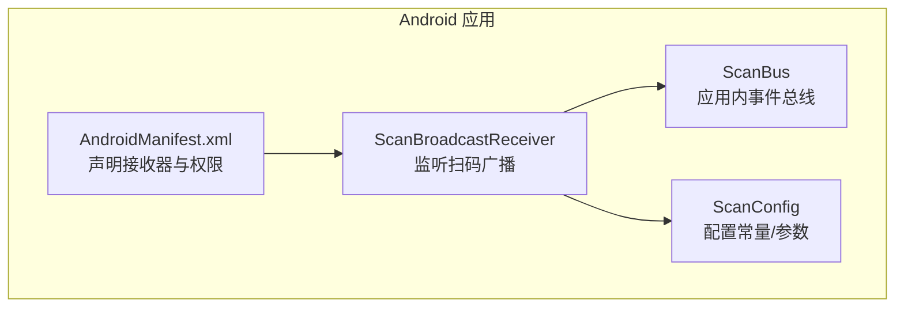
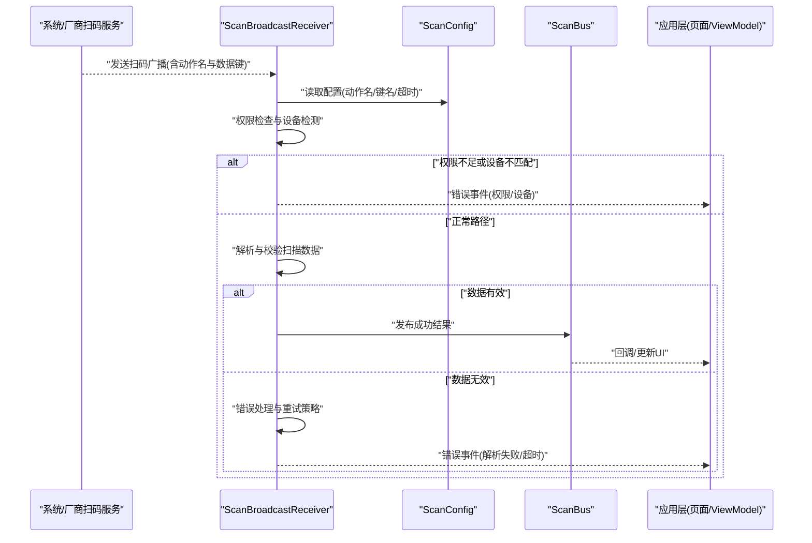
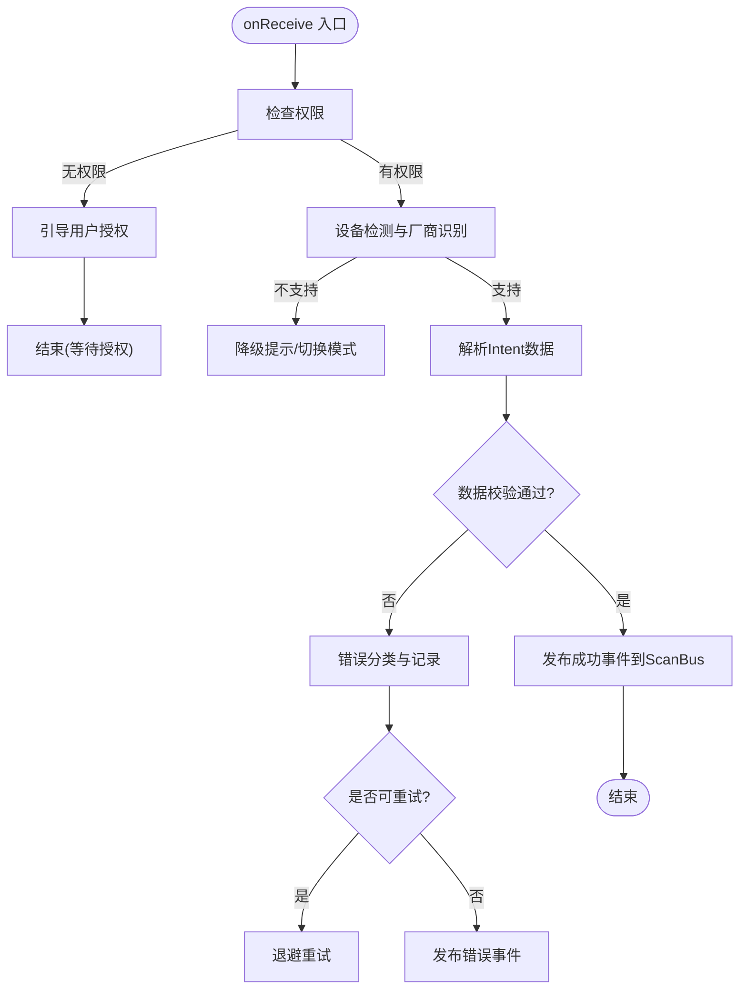
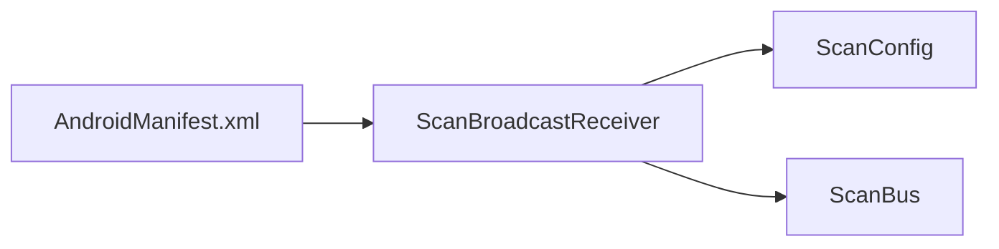

# 广播接收器实现

<cite>
**本文引用的文件**   
- [ScanBroadcastReceiver.kt](file://mobile-android/app/src/main/java/com/dip/material/utils/ScanBroadcastReceiver.kt)
- [ScanBus.kt](file://mobile-android/app/src/main/java/com/dip/material/utils/ScanBus.kt)
- [ScanConfig.kt](file://mobile-android/app/src/main/java/com/dip/material/utils/ScanConfig.kt)
- [AndroidManifest.xml](file://mobile-android/app/src/main/AndroidManifest.xml)
</cite>

## 目录
1. [简介](#简介)
2. [项目结构](#项目结构)
3. [核心组件](#核心组件)
4. [架构总览](#架构总览)
5. [详细组件分析](#详细组件分析)
6. [依赖关系分析](#依赖关系分析)
7. [性能考虑](#性能考虑)
8. [故障排查指南](#故障排查指南)
9. [结论](#结论)
10. [附录](#附录)

## 简介
本技术文档围绕 ScanBroadcastReceiver 广播接收器的实现与使用展开，重点说明如何监听系统扫码事件、不同厂商设备的兼容性处理机制、广播接收器的生命周期管理、权限申请流程、设备检测逻辑，以及扫描数据的解析与验证、错误处理与异常恢复。同时提供在应用中注册与注销广播接收器的实践方法，并给出调试技巧与常见问题解决方案，帮助开发者快速集成与稳定运行。

## 项目结构
与 ScanBroadcastReceiver 相关的 Android 代码位于 mobile-android 模块的 utils 包中，主要包含以下文件：
- ScanBroadcastReceiver.kt：广播接收器实现，负责监听扫码事件、解析数据、分发结果。
- ScanBus.kt：内部总线，用于在应用内传递扫码结果与状态。
- ScanConfig.kt：扫描相关配置（如动作名、键值、超时等）。
- AndroidManifest.xml：声明广播接收器及所需权限。

图表来源
- [ScanBroadcastReceiver.kt](file://mobile-android/app/src/main/java/com/dip/material/utils/ScanBroadcastReceiver.kt)
- [ScanBus.kt](file://mobile-android/app/src/main/java/com/dip/material/utils/ScanBus.kt)
- [ScanConfig.kt](file://mobile-android/app/src/main/java/com/dip/material/utils/ScanConfig.kt)
- [AndroidManifest.xml](file://mobile-android/app/src/main/AndroidManifest.xml)

章节来源
- [ScanBroadcastReceiver.kt](file://mobile-android/app/src/main/java/com/dip/material/utils/ScanBroadcastReceiver.kt)
- [ScanBus.kt](file://mobile-android/app/src/main/java/com/dip/material/utils/ScanBus.kt)
- [ScanConfig.kt](file://mobile-android/app/src/main/java/com/dip/material/utils/ScanConfig.kt)
- [AndroidManifest.xml](file://mobile-android/app/src/main/AndroidManifest.xml)

## 核心组件
- ScanBroadcastReceiver
  - 职责：监听系统或厂商扫码广播，解析数据，校验有效性，通过 ScanBus 分发到应用层；处理异常与重试。
  - 关键点：兼容多厂商动作名与键名；幂等处理重复广播；超时保护；错误码分类。
- ScanBus
  - 职责：应用内轻量事件总线，封装扫码结果与状态，供 UI 或业务模块订阅消费。
  - 关键点：线程安全、背压控制、去重与节流。
- ScanConfig
  - 职责：集中管理扫描相关常量（如动作名、键名、超时时间、默认值等），便于统一维护。
- AndroidManifest.xml
  - 职责：声明广播接收器、过滤动作、声明必要权限（如相机、存储等）。

章节来源
- [ScanBroadcastReceiver.kt](file://mobile-android/app/src/main/java/com/dip/material/utils/ScanBroadcastReceiver.kt)
- [ScanBus.kt](file://mobile-android/app/src/main/java/com/dip/material/utils/ScanBus.kt)
- [ScanConfig.kt](file://mobile-android/app/src/main/java/com/dip/material/utils/ScanConfig.kt)
- [AndroidManifest.xml](file://mobile-android/app/src/main/AndroidManifest.xml)

## 架构总览
下图展示了从系统/厂商扫码广播到应用层处理的完整链路，包括权限检查、设备检测、数据解析、校验与分发。

图表来源
- [ScanBroadcastReceiver.kt](file://mobile-android/app/src/main/java/com/dip/material/utils/ScanBroadcastReceiver.kt)
- [ScanConfig.kt](file://mobile-android/app/src/main/java/com/dip/material/utils/ScanConfig.kt)
- [ScanBus.kt](file://mobile-android/app/src/main/java/com/dip/material/utils/ScanBus.kt)

## 详细组件分析

### ScanBroadcastReceiver 组件分析
- 生命周期管理
  - 注册时机：建议在应用启动或进入需要扫码的页面时动态注册，避免全局常驻带来的功耗与冲突。
  - 注销时机：离开页面或应用退出时及时注销，防止内存泄漏与重复回调。
- 权限申请流程
  - 前置检查：在 onReceive 前检查相机、存储等权限；若缺失则引导用户授权。
  - 动态申请：使用运行时权限 API，处理拒绝与不再询问场景。
- 设备检测逻辑
  - 厂商识别：根据 Build.MANUFACTURER/Model 判断设备类型，选择对应动作名与键名映射。
  - 能力探测：尝试获取扫码服务可用性，不可用时降级提示。
- 扫描数据解析与验证
  - 解析流程：从 Intent extras 按键取值，支持多种编码格式（文本、JSON、Base64）。
  - 校验规则：非空、长度、格式正则、业务字段完整性。
  - 错误处理：区分网络、解析、业务校验错误，返回统一错误码；对可重试错误进行限流重试。
- 异常恢复机制
  - 超时保护：设置解析与回调超时，避免阻塞主线程。
  - 幂等处理：对重复广播进行去重，避免重复处理。
  - 降级策略：当某厂商广播不可用，回退到通用扫码接口或提示用户切换模式。

图表来源
- [ScanBroadcastReceiver.kt](file://mobile-android/app/src/main/java/com/dip/material/utils/ScanBroadcastReceiver.kt)
- [ScanConfig.kt](file://mobile-android/app/src/main/java/com/dip/material/utils/ScanConfig.kt)
- [ScanBus.kt](file://mobile-android/app/src/main/java/com/dip/material/utils/ScanBus.kt)

章节来源
- [ScanBroadcastReceiver.kt](file://mobile-android/app/src/main/java/com/dip/material/utils/ScanBroadcastReceiver.kt)
- [ScanConfig.kt](file://mobile-android/app/src/main/java/com/dip/material/utils/ScanConfig.kt)
- [ScanBus.kt](file://mobile-android/app/src/main/java/com/dip/material/utils/ScanBus.kt)

### ScanBus 组件分析
- 设计目标：为应用层提供统一的扫码事件通道，解耦广播接收器与业务逻辑。
- 关键特性
  - 线程安全：保证多线程环境下事件顺序与一致性。
  - 背压控制：限制并发与队列长度，避免内存溢出。
  - 去重与节流：对高频扫码事件进行合并与限流。
- 使用建议
  - 在页面级订阅，避免全局长驻。
  - 结合 ViewModel 生命周期管理，自动取消订阅。

章节来源
- [ScanBus.kt](file://mobile-android/app/src/main/java/com/dip/material/utils/ScanBus.kt)

### ScanConfig 组件分析
- 作用：集中管理扫描相关常量与默认值，提升可维护性。
- 典型配置项
  - 动作名映射：不同厂商的动作字符串。
  - 键名映射：Intent extras 中的键名。
  - 超时与重试：解析超时、最大重试次数、退避间隔。
  - 默认值与校验规则：正则表达式、最小/最大长度。

章节来源
- [ScanConfig.kt](file://mobile-android/app/src/main/java/com/dip/material/utils/ScanConfig.kt)

### AndroidManifest.xml 声明与权限
- 广播接收器声明
  - 使用 <receiver> 标签声明 ScanBroadcastReceiver。
  - 使用 <intent-filter> 指定动作名（支持多厂商动作）。
- 权限声明
  - 相机权限：用于扫码硬件访问。
  - 存储权限：如需读取本地二维码图片。
  - 其他必要权限：根据厂商 SDK 要求补充。

章节来源
- [AndroidManifest.xml](file://mobile-android/app/src/main/AndroidManifest.xml)

## 依赖关系分析
- 组件耦合
  - ScanBroadcastReceiver 依赖 ScanConfig（配置）与 ScanBus（事件分发）。
  - AndroidManifest.xml 作为外部声明点，驱动接收器生效。
- 潜在循环依赖
  - 当前设计单向依赖，无循环引用风险。
- 外部依赖
  - Android 系统广播机制、厂商扫码服务、运行时权限 API。

图表来源
- [AndroidManifest.xml](file://mobile-android/app/src/main/AndroidManifest.xml)
- [ScanBroadcastReceiver.kt](file://mobile-android/app/src/main/java/com/dip/material/utils/ScanBroadcastReceiver.kt)
- [ScanConfig.kt](file://mobile-android/app/src/main/java/com/dip/material/utils/ScanConfig.kt)
- [ScanBus.kt](file://mobile-android/app/src/main/java/com/dip/material/utils/ScanBus.kt)

章节来源
- [AndroidManifest.xml](file://mobile-android/app/src/main/AndroidManifest.xml)
- [ScanBroadcastReceiver.kt](file://mobile-android/app/src/main/java/com/dip/material/utils/ScanBroadcastReceiver.kt)
- [ScanConfig.kt](file://mobile-android/app/src/main/java/com/dip/material/utils/ScanConfig.kt)
- [ScanBus.kt](file://mobile-android/app/src/main/java/com/dip/material/utils/ScanBus.kt)

## 性能考虑
- 避免在主线程执行耗时操作：解析与校验应在后台线程完成，再回到主线程回调 UI。
- 合理设置超时与重试：防止长时间阻塞与资源占用。
- 减少广播频率：对高频扫码进行合并与节流。
- 及时注销接收器：降低功耗与内存占用。

[本节为通用指导，无需特定文件来源]

## 故障排查指南
- 常见问题
  - 无法收到扫码广播：检查动作名与键名是否正确；确认 Manifest 已声明；验证权限是否授予。
  - 数据解析失败：核对 Intent extras 键名；检查编码格式；增加日志输出定位问题。
  - 设备不兼容：根据厂商型号调整动作名映射；必要时提示用户升级固件或使用替代方案。
  - 重复处理：实现去重逻辑，基于时间戳或序列号过滤重复广播。
- 调试技巧
  - 打印关键变量：动作名、键名、数据内容、错误码。
  - 模拟广播：使用 adb shell am broadcast 模拟厂商广播，验证解析逻辑。
  - 观察线程：确保耗时操作不在主线程执行。
- 错误恢复
  - 对可重试错误采用指数退避；对不可重试错误直接上报并提示用户。
  - 提供降级路径：如切换到系统相机扫码或第三方扫码库。

章节来源
- [ScanBroadcastReceiver.kt](file://mobile-android/app/src/main/java/com/dip/material/utils/ScanBroadcastReceiver.kt)
- [ScanConfig.kt](file://mobile-android/app/src/main/java/com/dip/material/utils/ScanConfig.kt)
- [ScanBus.kt](file://mobile-android/app/src/main/java/com/dip/material/utils/ScanBus.kt)
- [AndroidManifest.xml](file://mobile-android/app/src/main/AndroidManifest.xml)

## 结论
ScanBroadcastReceiver 通过统一的配置与事件总线，实现了跨厂商扫码事件的稳定接收与处理。合理的生命周期管理、权限检查、设备检测与数据校验机制，确保了在不同设备上的兼容性与鲁棒性。结合调试技巧与错误恢复策略，可有效提升用户体验与系统稳定性。

[本节为总结性内容，无需特定文件来源]

## 附录
- 注册与注销示例（概念性步骤）
  - 在页面 onCreate 中动态注册 ScanBroadcastReceiver，传入自定义 Action 与过滤器。
  - 在页面 onDestroy 或 onPause 中注销接收器，释放资源。
  - 在页面中订阅 ScanBus 的事件，处理扫码结果与错误。
- 常见动作名与键名映射（概念性说明）
  - 不同厂商可能使用不同的动作名与键名，需在 ScanConfig 中维护映射表。
  - 建议提供默认映射与扩展点，便于后续新增厂商支持。

[本节为概念性说明，无需特定文件来源]