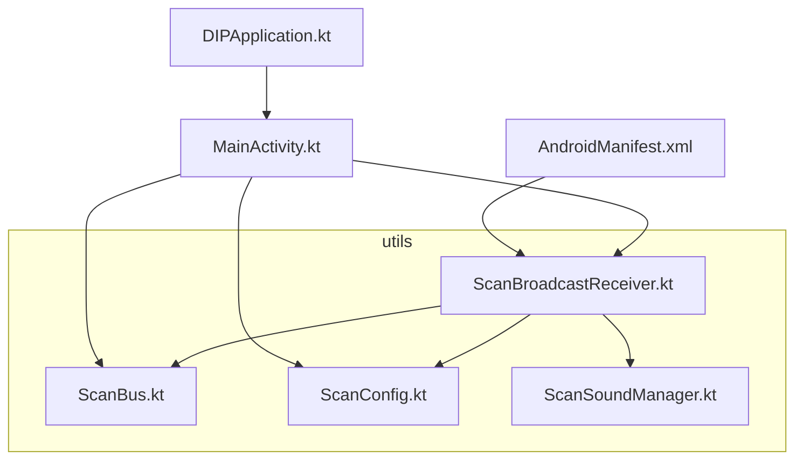
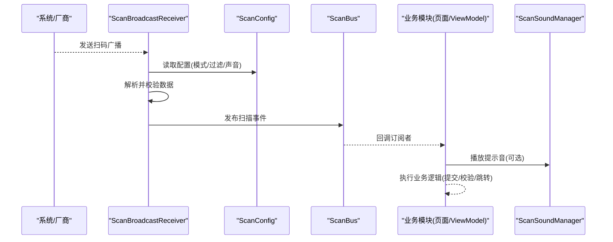
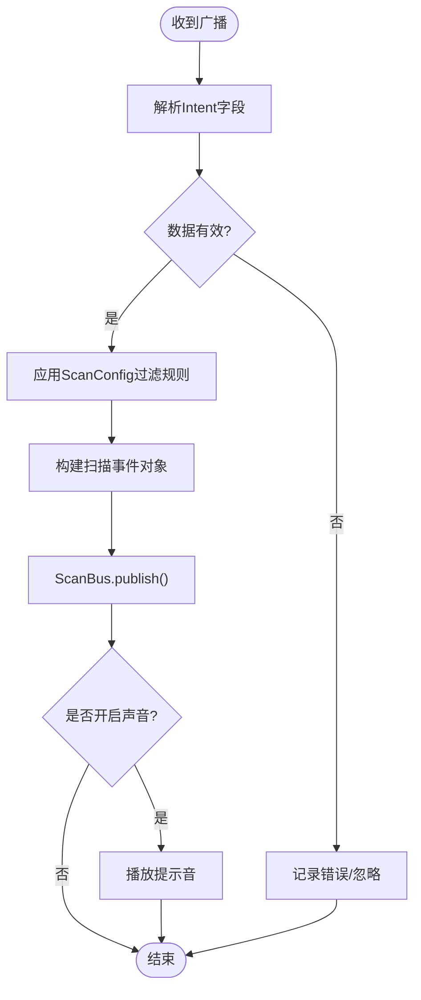
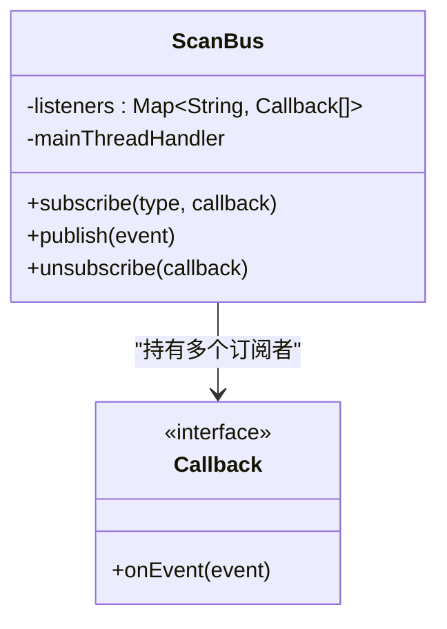
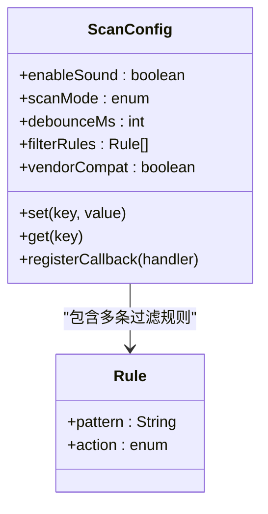
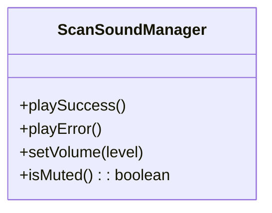
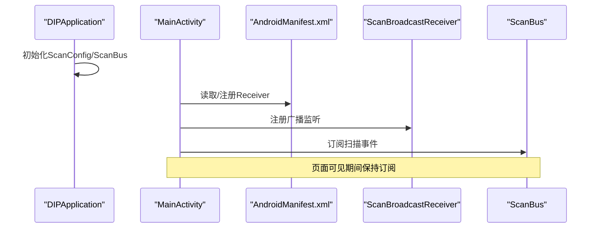
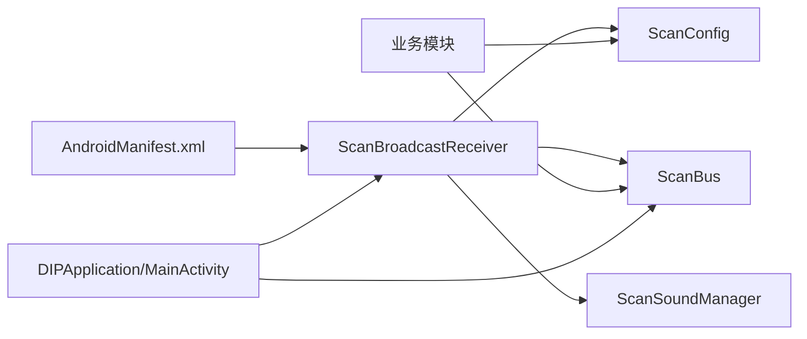

# 扫码枪集成

<cite>
**本文引用的文件**   
- [ScanBroadcastReceiver.kt](file://mobile-android/app/src/main/java/com/dip/material/utils/ScanBroadcastReceiver.kt)
- [ScanBus.kt](file://mobile-android/app/src/main/java/com/dip/material/utils/ScanBus.kt)
- [ScanConfig.kt](file://mobile-android/app/src/main/java/com/dip/material/utils/ScanConfig.kt)
- [ScanSoundManager.kt](file://mobile-android/app/src/main/java/com/dip/material/utils/ScanSoundManager.kt)
- [AndroidManifest.xml](file://mobile-android/app/src/main/AndroidManifest.xml)
- [MainActivity.kt](file://mobile-android/app/src/main/java/com/dip/material/MainActivity.kt)
- [DIPApplication.kt](file://mobile-android/app/src/main/java/com/dip/material/DIPApplication.kt)
</cite>

## 目录
1. [简介](#简介)
2. [项目结构](#项目结构)
3. [核心组件](#核心组件)
4. [架构总览](#架构总览)
5. [详细组件分析](#详细组件分析)
6. [依赖关系分析](#依赖关系分析)
7. [性能考虑](#性能考虑)
8. [故障排查指南](#故障排查指南)
9. [结论](#结论)
10. [附录：业务集成示例与最佳实践](#附录业务集成示例与最佳实践)

## 简介
本文件面向DIP系统Android应用中的“扫码枪集成”模块，系统性阐述以下能力：
- ScanBroadcastReceiver广播接收器如何监听系统扫码事件，并处理不同厂商设备的兼容性问题。
- ScanBus事件总线的设计模式与扫描事件的发布订阅机制。
- ScanConfig配置管理，包括设备参数、扫描模式、回调注册等。
- 扫码枪权限申请流程、设备检测逻辑、错误处理机制。
- 在业务模块中集成扫码功能的实际步骤与异常场景处理建议。

## 项目结构
扫码相关代码集中在 mobile-android/app/src/main/java/com/dip/material/utils 目录下，主要包括：
- 广播接收器：ScanBroadcastReceiver.kt
- 事件总线：ScanBus.kt
- 配置管理：ScanConfig.kt
- 声音反馈：ScanSoundManager.kt
- 入口与清单：MainActivity.kt、AndroidManifest.xml、DIPApplication.kt

**图表来源** 
- [ScanBroadcastReceiver.kt](file://mobile-android/app/src/main/java/com/dip/material/utils/ScanBroadcastReceiver.kt)
- [ScanBus.kt](file://mobile-android/app/src/main/java/com/dip/material/utils/ScanBus.kt)
- [ScanConfig.kt](file://mobile-android/app/src/main/java/com/dip/material/utils/ScanConfig.kt)
- [ScanSoundManager.kt](file://mobile-android/app/src/main/java/com/dip/material/utils/ScanSoundManager.kt)
- [MainActivity.kt](file://mobile-android/app/src/main/java/com/dip/material/MainActivity.kt)
- [AndroidManifest.xml](file://mobile-android/app/src/main/AndroidManifest.xml)
- [DIPApplication.kt](file://mobile-android/app/src/main/java/com/dip/material/DIPApplication.kt)

**章节来源**
- [ScanBroadcastReceiver.kt](file://mobile-android/app/src/main/java/com/dip/material/utils/ScanBroadcastReceiver.kt)
- [ScanBus.kt](file://mobile-android/app/src/main/java/com/dip/material/utils/ScanBus.kt)
- [ScanConfig.kt](file://mobile-android/app/src/main/java/com/dip/material/utils/ScanConfig.kt)
- [ScanSoundManager.kt](file://mobile-android/app/src/main/java/com/dip/material/utils/ScanSoundManager.kt)
- [MainActivity.kt](file://mobile-android/app/src/main/java/com/dip/material/MainActivity.kt)
- [AndroidManifest.xml](file://mobile-android/app/src/main/AndroidManifest.xml)
- [DIPApplication.kt](file://mobile-android/app/src/main/java/com/dip/material/DIPApplication.kt)

## 核心组件
- ScanBroadcastReceiver：负责接收系统或厂商自定义的扫码广播，解析数据，统一封装后通过ScanBus分发。
- ScanBus：轻量级事件总线，提供订阅/发布接口，支持按类型分发扫描结果与状态。
- ScanConfig：集中管理扫码相关配置（如是否启用声音、过滤规则、默认扫描模式、厂商兼容性开关等）。
- ScanSoundManager：封装扫码成功/失败的声音提示，便于统一控制。

**章节来源**
- [ScanBroadcastReceiver.kt](file://mobile-android/app/src/main/java/com/dip/material/utils/ScanBroadcastReceiver.kt)
- [ScanBus.kt](file://mobile-android/app/src/main/java/com/dip/material/utils/ScanBus.kt)
- [ScanConfig.kt](file://mobile-android/app/src/main/java/com/dip/material/utils/ScanConfig.kt)
- [ScanSoundManager.kt](file://mobile-android/app/src/main/java/com/dip/material/utils/ScanSoundManager.kt)

## 架构总览
整体采用“广播接收 + 事件总线 + 配置中心”的分层设计：
- 底层：系统/厂商广播由ScanBroadcastReceiver捕获并解析。
- 中层：ScanBus作为解耦枢纽，将扫描结果以事件形式发布给所有订阅者。
- 上层：业务模块通过ScanConfig进行行为配置，并通过ScanBus订阅扫描结果进行处理。

**图表来源** 
- [ScanBroadcastReceiver.kt](file://mobile-android/app/src/main/java/com/dip/material/utils/ScanBroadcastReceiver.kt)
- [ScanBus.kt](file://mobile-android/app/src/main/java/com/dip/material/utils/ScanBus.kt)
- [ScanConfig.kt](file://mobile-android/app/src/main/java/com/dip/material/utils/ScanConfig.kt)
- [ScanSoundManager.kt](file://mobile-android/app/src/main/java/com/dip/material/utils/ScanSoundManager.kt)

## 详细组件分析

### ScanBroadcastReceiver：系统扫码事件监听与兼容处理
- 职责
  - 注册/注销系统或厂商自定义的扫码广播。
  - 解析不同厂商的Intent字段，提取条码内容、类型、时间戳等。
  - 根据ScanConfig进行过滤与转换，统一为内部事件模型。
  - 通过ScanBus发布事件，触发声音反馈。
- 关键流程
  - onReceive：接收广播 -> 解析Intent -> 校验空值/非法格式 -> 构造扫描事件 -> 调用ScanBus.publish -> 播放提示音。
- 兼容性要点
  - 不同厂商可能使用不同的Action名称与Extra键名，需做白名单映射与降级策略。
  - 对重复扫描进行去抖处理，避免短时间内重复触发。
  - 对超长条码、特殊字符进行清洗与截断保护。

**图表来源** 
- [ScanBroadcastReceiver.kt](file://mobile-android/app/src/main/java/com/dip/material/utils/ScanBroadcastReceiver.kt)
- [ScanConfig.kt](file://mobile-android/app/src/main/java/com/dip/material/utils/ScanConfig.kt)
- [ScanBus.kt](file://mobile-android/app/src/main/java/com/dip/material/utils/ScanBus.kt)
- [ScanSoundManager.kt](file://mobile-android/app/src/main/java/com/dip/material/utils/ScanSoundManager.kt)

**章节来源**
- [ScanBroadcastReceiver.kt](file://mobile-android/app/src/main/java/com/dip/material/utils/ScanBroadcastReceiver.kt)
- [ScanConfig.kt](file://mobile-android/app/src/main/java/com/dip/material/utils/ScanConfig.kt)
- [ScanBus.kt](file://mobile-android/app/src/main/java/com/dip/material/utils/ScanBus.kt)
- [ScanSoundManager.kt](file://mobile-android/app/src/main/java/com/dip/material/utils/ScanSoundManager.kt)

### ScanBus：事件总线设计与发布订阅机制
- 设计模式
  - 观察者模式：订阅者注册回调，发布者触发时通知所有订阅者。
  - 单例/全局访问：保证跨模块共享同一事件通道。
- 核心能力
  - subscribe(type, callback)：按事件类型订阅。
  - publish(event)：发布事件到对应类型的订阅者集合。
  - unsubscribe(callback)：取消订阅，防止内存泄漏。
  - 线程安全：确保在主线程回调UI更新，后台线程发布。
- 扩展点
  - 支持优先级队列、重试机制、死信队列（用于调试与追踪）。

**图表来源** 
- [ScanBus.kt](file://mobile-android/app/src/main/java/com/dip/material/utils/ScanBus.kt)

**章节来源**
- [ScanBus.kt](file://mobile-android/app/src/main/java/com/dip/material/utils/ScanBus.kt)

### ScanConfig：配置管理与回调注册
- 职责
  - 集中管理扫码相关配置项：是否启用声音、扫描模式（单次/连续）、过滤规则（正则/黑名单）、厂商兼容开关等。
  - 提供运行时修改能力，支持热更新。
  - 暴露回调注册接口，供外部注入自定义处理逻辑（如日志、埋点）。
- 典型配置项
  - enableSound：是否播放提示音。
  - scanMode：单次/连续。
  - debounceMs：去抖间隔。
  - filterRules：过滤规则集合。
  - vendorCompat：厂商兼容性开关。
- 生命周期
  - 应用启动时初始化，Activity/Fragment按需读取。

**图表来源** 
- [ScanConfig.kt](file://mobile-android/app/src/main/java/com/dip/material/utils/ScanConfig.kt)

**章节来源**
- [ScanConfig.kt](file://mobile-android/app/src/main/java/com/dip/material/utils/ScanConfig.kt)

### ScanSoundManager：声音反馈封装
- 职责
  - 封装播放成功/失败提示音的逻辑。
  - 支持音量控制、静音模式兼容。
- 使用方式
  - 由ScanBroadcastReceiver或业务模块在适当时机调用。

**图表来源** 
- [ScanSoundManager.kt](file://mobile-android/app/src/main/java/com/dip/material/utils/ScanSoundManager.kt)

**章节来源**
- [ScanSoundManager.kt](file://mobile-android/app/src/main/java/com/dip/material/utils/ScanSoundManager.kt)

### AndroidManifest与入口：广播注册与应用初始化
- AndroidManifest.xml
  - 声明ScanBroadcastReceiver及其IntentFilter，确保能接收到系统/厂商扫码广播。
  - 如需动态权限，需在运行时申请（例如麦克风、相机等，视具体实现而定）。
- MainActivity/DIPApplication
  - 在应用启动时初始化ScanConfig、ScanBus。
  - 在合适的生命周期内注册/注销ScanBroadcastReceiver。
  - 在页面中订阅ScanBus事件，处理扫描结果。

**图表来源** 
- [AndroidManifest.xml](file://mobile-android/app/src/main/AndroidManifest.xml)
- [MainActivity.kt](file://mobile-android/app/src/main/java/com/dip/material/MainActivity.kt)
- [DIPApplication.kt](file://mobile-android/app/src/main/java/com/dip/material/DIPApplication.kt)
- [ScanBroadcastReceiver.kt](file://mobile-android/app/src/main/java/com/dip/material/utils/ScanBroadcastReceiver.kt)
- [ScanBus.kt](file://mobile-android/app/src/main/java/com/dip/material/utils/ScanBus.kt)

**章节来源**
- [AndroidManifest.xml](file://mobile-android/app/src/main/AndroidManifest.xml)
- [MainActivity.kt](file://mobile-android/app/src/main/java/com/dip/material/MainActivity.kt)
- [DIPApplication.kt](file://mobile-android/app/src/main/java/com/dip/material/DIPApplication.kt)
- [ScanBroadcastReceiver.kt](file://mobile-android/app/src/main/java/com/dip/material/utils/ScanBroadcastReceiver.kt)
- [ScanBus.kt](file://mobile-android/app/src/main/java/com/dip/material/utils/ScanBus.kt)

## 依赖关系分析
- ScanBroadcastReceiver依赖ScanConfig（读取配置）与ScanBus（发布事件），并可调用ScanSoundManager（播放提示音）。
- ScanBus为全局单例，被多处订阅，需注意生命周期与内存泄漏。
- ScanConfig为配置中心，被ScanBroadcastReceiver与业务模块共同读取。
- AndroidManifest.xml声明广播接收器，MainActivity/DIPApplication负责生命周期管理。

**图表来源** 
- [ScanBroadcastReceiver.kt](file://mobile-android/app/src/main/java/com/dip/material/utils/ScanBroadcastReceiver.kt)
- [ScanBus.kt](file://mobile-android/app/src/main/java/com/dip/material/utils/ScanBus.kt)
- [ScanConfig.kt](file://mobile-android/app/src/main/java/com/dip/material/utils/ScanConfig.kt)
- [ScanSoundManager.kt](file://mobile-android/app/src/main/java/com/dip/material/utils/ScanSoundManager.kt)
- [AndroidManifest.xml](file://mobile-android/app/src/main/AndroidManifest.xml)
- [MainActivity.kt](file://mobile-android/app/src/main/java/com/dip/material/MainActivity.kt)
- [DIPApplication.kt](file://mobile-android/app/src/main/java/com/dip/material/DIPApplication.kt)

**章节来源**
- [ScanBroadcastReceiver.kt](file://mobile-android/app/src/main/java/com/dip/material/utils/ScanBroadcastReceiver.kt)
- [ScanBus.kt](file://mobile-android/app/src/main/java/com/dip/material/utils/ScanBus.kt)
- [ScanConfig.kt](file://mobile-android/app/src/main/java/com/dip/material/utils/ScanConfig.kt)
- [ScanSoundManager.kt](file://mobile-android/app/src/main/java/com/dip/material/utils/ScanSoundManager.kt)
- [AndroidManifest.xml](file://mobile-android/app/src/main/AndroidManifest.xml)
- [MainActivity.kt](file://mobile-android/app/src/main/java/com/dip/material/MainActivity.kt)
- [DIPApplication.kt](file://mobile-android/app/src/main/java/com/dip/material/DIPApplication.kt)

## 性能考虑
- 去抖与限流：在高频扫描场景下，通过ScanConfig.debounceMs减少重复事件。
- 主线程回调：ScanBus确保UI回调在主线程执行，避免ANR。
- 资源释放：及时取消ScanBus订阅，防止内存泄漏。
- 解析优化：对大字符串进行快速校验与裁剪，避免阻塞。

[本节为通用指导，不直接分析具体文件]

## 故障排查指南
- 无法接收广播
  - 检查AndroidManifest.xml是否正确声明Receiver与IntentFilter。
  - 确认应用是否在前台/后台允许接收广播（部分厂商限制）。
- 扫描结果为空或乱码
  - 检查ScanBroadcastReceiver的解析逻辑与厂商Extra键映射。
  - 查看ScanConfig.filterRules是否误过滤。
- 重复触发
  - 调整ScanConfig.debounceMs，或在ScanBroadcastReceiver内增加去重逻辑。
- 无提示音
  - 检查ScanSoundManager是否被调用，以及设备静音模式。
- 内存泄漏
  - 确保在页面销毁时取消ScanBus订阅。

**章节来源**
- [AndroidManifest.xml](file://mobile-android/app/src/main/AndroidManifest.xml)
- [ScanBroadcastReceiver.kt](file://mobile-android/app/src/main/java/com/dip/material/utils/ScanBroadcastReceiver.kt)
- [ScanConfig.kt](file://mobile-android/app/src/main/java/com/dip/material/utils/ScanConfig.kt)
- [ScanSoundManager.kt](file://mobile-android/app/src/main/java/com/dip/material/utils/ScanSoundManager.kt)
- [ScanBus.kt](file://mobile-android/app/src/main/java/com/dip/material/utils/ScanBus.kt)

## 结论
通过“广播接收 + 事件总线 + 配置中心”的分层设计，DIP系统的扫码枪集成具备高内聚、低耦合、易扩展的特点。ScanBroadcastReceiver屏蔽了厂商差异，ScanBus解耦了事件生产与消费，ScanConfig集中管理行为与策略，ScanSoundManager统一体验。配合完善的权限申请、设备检测与错误处理，可在多机型环境下稳定运行。

[本节为总结性内容，不直接分析具体文件]

## 附录：业务集成示例与最佳实践
- 初始化与配置
  - 在应用启动时初始化ScanConfig与ScanBus，设置默认扫描模式、去抖间隔、声音开关等。
- 注册广播与订阅事件
  - 在MainActivity或合适生命周期注册ScanBroadcastReceiver。
  - 在页面创建时订阅ScanBus的扫描事件，页面销毁时取消订阅。
- 处理扫描结果
  - 在回调中进行数据校验、业务逻辑处理（如入库、出库、盘点）。
  - 根据ScanConfig决定是否播放提示音。
- 权限申请流程
  - 若需要相机/麦克风等权限，应在用户交互前申请，并在拒绝时给出友好提示。
- 设备检测逻辑
  - 在应用启动时检测设备是否支持扫码功能，必要时降级或提示用户。
- 异常场景处理
  - 网络异常：本地缓存+重试。
  - 数据异常：回滚操作+用户提示。
  - 权限拒绝：引导用户前往设置页授权。

[本节为概念性指导，不直接分析具体文件]