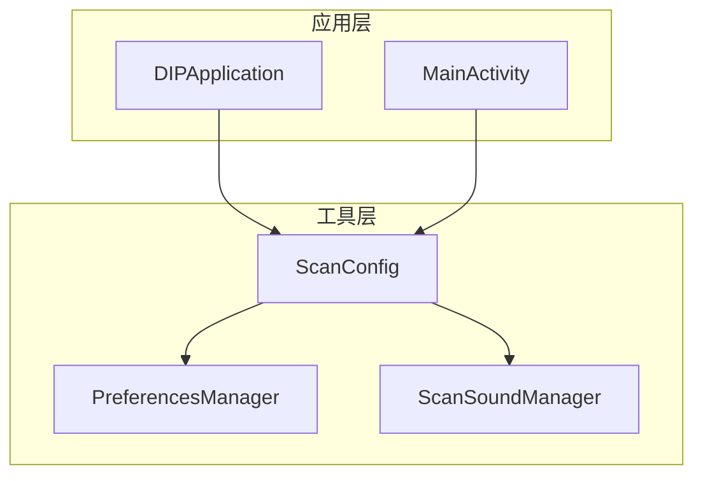
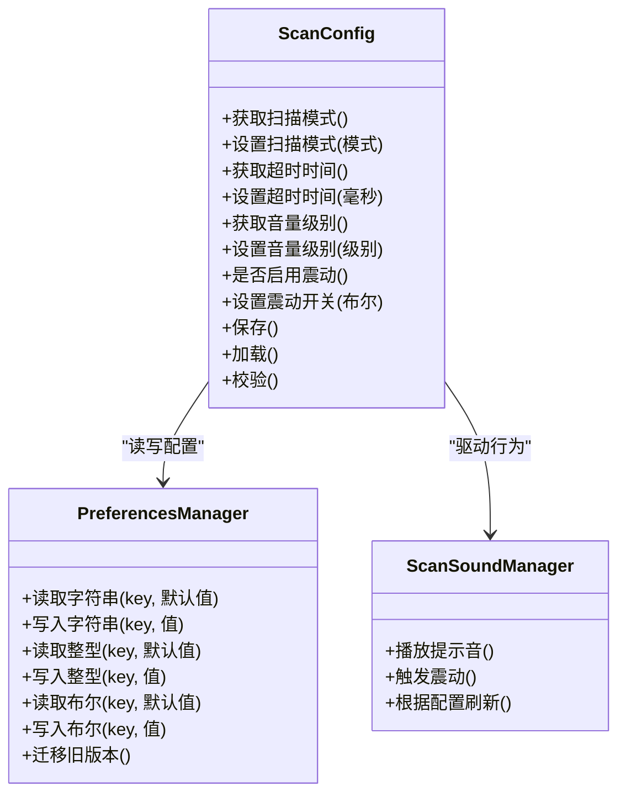
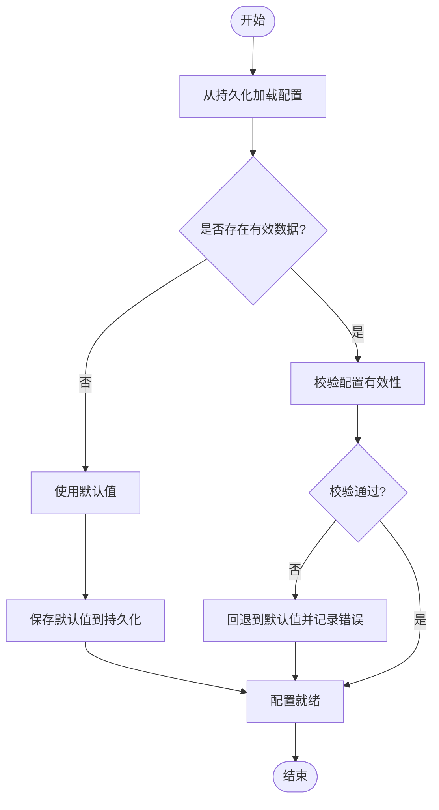
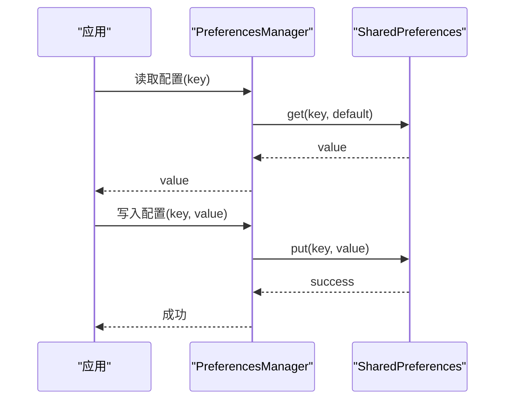
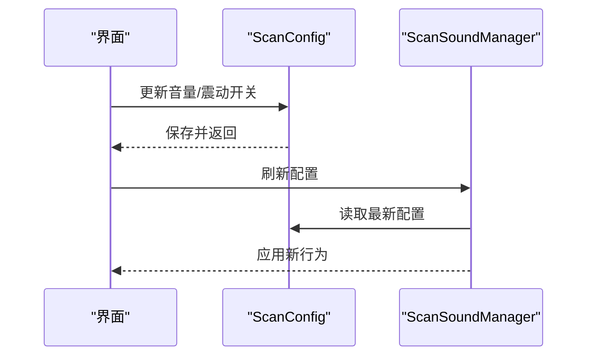
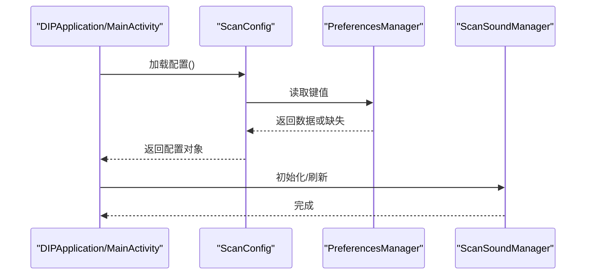
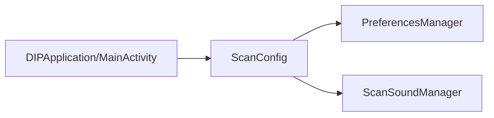

# 配置管理

<cite>
**本文引用的文件**   
- [ScanConfig.kt](file://mobile-android/app/src/main/java/com/dip/material/utils/ScanConfig.kt)
- [PreferencesManager.kt](file://mobile-android/app/src/main/java/com/dip/material/utils/PreferencesManager.kt)
- [ScanSoundManager.kt](file://mobile-android/app/src/main/java/com/dip/material/utils/ScanSoundManager.kt)
- [MainActivity.kt](file://mobile-android/app/src/main/java/com/dip/material/MainActivity.kt)
- [DIPApplication.kt](file://mobile-android/app/src/main/java/com/dip/material/DIPApplication.kt)
</cite>

## 目录
1. [简介](#简介)
2. [项目结构](#项目结构)
3. [核心组件](#核心组件)
4. [架构总览](#架构总览)
5. [详细组件分析](#详细组件分析)
6. [依赖关系分析](#依赖关系分析)
7. [性能考虑](#性能考虑)
8. [故障排查指南](#故障排查指南)
9. [结论](#结论)
10. [附录](#附录)

## 简介
本文件面向 ScanConfig 配置管理系统，聚焦移动端 Android 侧的扫描相关配置。文档涵盖：
- 配置项设计结构（扫描模式、超时设置、音量控制、震动反馈等）
- 配置的初始化流程、默认值管理与动态更新机制
- 配置持久化存储方案（SharedPreferences）与数据迁移策略
- 配置验证与错误处理机制
- 实际配置示例与最佳实践建议，帮助开发者快速集成和使用

## 项目结构
与 ScanConfig 相关的代码集中在 mobile-android 模块的 utils 包中，主要包含：
- 配置模型与读写封装：ScanConfig.kt、PreferencesManager.kt
- 声音与震动控制：ScanSoundManager.kt
- 应用入口与主界面：DIPApplication.kt、MainActivity.kt

图表来源
- [DIPApplication.kt](file://mobile-android/app/src/main/java/com/dip/material/DIPApplication.kt)
- [MainActivity.kt](file://mobile-android/app/src/main/java/com/dip/material/MainActivity.kt)
- [ScanConfig.kt](file://mobile-android/app/src/main/java/com/dip/material/utils/ScanConfig.kt)
- [PreferencesManager.kt](file://mobile-android/app/src/main/java/com/dip/material/utils/PreferencesManager.kt)
- [ScanSoundManager.kt](file://mobile-android/app/src/main/java/com/dip/material/utils/ScanSoundManager.kt)

章节来源
- [ScanConfig.kt](file://mobile-android/app/src/main/java/com/dip/material/utils/ScanConfig.kt)
- [PreferencesManager.kt](file://mobile-android/app/src/main/java/com/dip/material/utils/PreferencesManager.kt)
- [ScanSoundManager.kt](file://mobile-android/app/src/main/java/com/dip/material/utils/ScanSoundManager.kt)
- [MainActivity.kt](file://mobile-android/app/src/main/java/com/dip/material/MainActivity.kt)
- [DIPApplication.kt](file://mobile-android/app/src/main/java/com/dip/material/DIPApplication.kt)

## 核心组件
- ScanConfig：定义扫描相关配置项与访问接口，提供默认值、读取、写入与校验能力。
- PreferencesManager：基于 SharedPreferences 的轻量级键值存储封装，负责持久化与版本迁移。
- ScanSoundManager：根据配置驱动扫描提示音与震动反馈。
- MainActivity / DIPApplication：在应用启动或页面进入时加载配置，并在用户交互后触发配置更新。

章节来源
- [ScanConfig.kt](file://mobile-android/app/src/main/java/com/dip/material/utils/ScanConfig.kt)
- [PreferencesManager.kt](file://mobile-android/app/src/main/java/com/dip/material/utils/PreferencesManager.kt)
- [ScanSoundManager.kt](file://mobile-android/app/src/main/java/com/dip/material/utils/ScanSoundManager.kt)
- [MainActivity.kt](file://mobile-android/app/src/main/java/com/dip/material/MainActivity.kt)
- [DIPApplication.kt](file://mobile-android/app/src/main/java/com/dip/material/DIPApplication.kt)

## 架构总览
整体采用“配置模型 + 持久化封装 + 行为控制器”的分层设计：
- 配置模型层：ScanConfig 暴露统一 API，屏蔽底层存储细节。
- 持久化层：PreferencesManager 提供类型安全的读写与迁移逻辑。
- 行为控制层：ScanSoundManager 依据配置即时生效，无需重启。

图表来源
- [ScanConfig.kt](file://mobile-android/app/src/main/java/com/dip/material/utils/ScanConfig.kt)
- [PreferencesManager.kt](file://mobile-android/app/src/main/java/com/dip/material/utils/PreferencesManager.kt)
- [ScanSoundManager.kt](file://mobile-android/app/src/main/java/com/dip/material/utils/ScanSoundManager.kt)

## 详细组件分析

### ScanConfig：配置模型与访问接口
- 职责
  - 定义扫描相关配置项：扫描模式、超时时间、音量级别、震动开关等。
  - 提供默认值、读取、写入、保存与校验的统一入口。
  - 对外暴露只读快照与可写更新方法，保证线程安全与一致性。
- 关键设计点
  - 默认值集中管理，便于升级与回滚。
  - 参数校验在写入前进行，失败时拒绝并记录原因。
  - 支持热更新：修改后立即通知依赖方（如声音管理器）。
- 典型流程
  - 应用启动时从持久化加载；若不存在则使用默认值并落盘。
  - 用户修改后，先校验再持久化，随后触发行为更新。

图表来源
- [ScanConfig.kt](file://mobile-android/app/src/main/java/com/dip/material/utils/ScanConfig.kt)
- [PreferencesManager.kt](file://mobile-android/app/src/main/java/com/dip/material/utils/PreferencesManager.kt)

章节来源
- [ScanConfig.kt](file://mobile-android/app/src/main/java/com/dip/material/utils/ScanConfig.kt)

### PreferencesManager：持久化与迁移
- 职责
  - 基于 SharedPreferences 提供类型安全的读写接口。
  - 实现配置版本迁移，兼容历史数据结构。
- 关键设计点
  - 所有 key 集中管理，避免硬编码散落在各处。
  - 读写操作具备异常保护，失败时返回默认值并记录日志。
  - 迁移策略：检测版本号，必要时执行字段重命名、类型转换或清理无效数据。
- 典型流程
  - 首次运行：写入默认版本与默认配置。
  - 版本升级：对比当前版本与目标版本，执行增量迁移。

图表来源
- [PreferencesManager.kt](file://mobile-android/app/src/main/java/com/dip/material/utils/PreferencesManager.kt)

章节来源
- [PreferencesManager.kt](file://mobile-android/app/src/main/java/com/dip/material/utils/PreferencesManager.kt)

### ScanSoundManager：声音与震动控制
- 职责
  - 根据 ScanConfig 中的音量与震动开关，控制扫描提示音与震动反馈。
  - 提供按需触发与按配置刷新的能力。
- 关键设计点
  - 与系统音频/震动服务解耦，仅依赖配置状态。
  - 支持静音模式下的降级策略（如仅震动或不反馈）。
- 典型流程
  - 配置变更后调用刷新，内部重新读取配置并更新行为。

图表来源
- [ScanSoundManager.kt](file://mobile-android/app/src/main/java/com/dip/material/utils/ScanSoundManager.kt)
- [ScanConfig.kt](file://mobile-android/app/src/main/java/com/dip/material/utils/ScanConfig.kt)

章节来源
- [ScanSoundManager.kt](file://mobile-android/app/src/main/java/com/dip/material/utils/ScanSoundManager.kt)

### 初始化与动态更新流程
- 初始化
  - 应用启动时（DIPApplication）或进入扫描页面（MainActivity）加载配置。
  - 若配置缺失或损坏，自动回退到默认值并持久化。
- 动态更新
  - 用户在设置页修改后，立即校验并持久化。
  - 通过回调或事件通知相关组件（如声音管理器）刷新行为。

图表来源
- [DIPApplication.kt](file://mobile-android/app/src/main/java/com/dip/material/DIPApplication.kt)
- [MainActivity.kt](file://mobile-android/app/src/main/java/com/dip/material/MainActivity.kt)
- [ScanConfig.kt](file://mobile-android/app/src/main/java/com/dip/material/utils/ScanConfig.kt)
- [PreferencesManager.kt](file://mobile-android/app/src/main/java/com/dip/material/utils/PreferencesManager.kt)
- [ScanSoundManager.kt](file://mobile-android/app/src/main/java/com/dip/material/utils/ScanSoundManager.kt)

章节来源
- [DIPApplication.kt](file://mobile-android/app/src/main/java/com/dip/material/DIPApplication.kt)
- [MainActivity.kt](file://mobile-android/app/src/main/java/com/dip/material/MainActivity.kt)

## 依赖关系分析
- ScanConfig 依赖 PreferencesManager 进行持久化读写。
- ScanConfig 依赖 ScanSoundManager 以响应配置变更。
- MainActivity 与 DIPApplication 作为入口，负责生命周期内的配置加载与刷新。

图表来源
- [DIPApplication.kt](file://mobile-android/app/src/main/java/com/dip/material/DIPApplication.kt)
- [MainActivity.kt](file://mobile-android/app/src/main/java/com/dip/material/MainActivity.kt)
- [ScanConfig.kt](file://mobile-android/app/src/main/java/com/dip/material/utils/ScanConfig.kt)
- [PreferencesManager.kt](file://mobile-android/app/src/main/java/com/dip/material/utils/PreferencesManager.kt)
- [ScanSoundManager.kt](file://mobile-android/app/src/main/java/com/dip/material/utils/ScanSoundManager.kt)

章节来源
- [ScanConfig.kt](file://mobile-android/app/src/main/java/com/dip/material/utils/ScanConfig.kt)
- [PreferencesManager.kt](file://mobile-android/app/src/main/java/com/dip/material/utils/PreferencesManager.kt)
- [ScanSoundManager.kt](file://mobile-android/app/src/main/java/com/dip/material/utils/ScanSoundManager.kt)
- [MainActivity.kt](file://mobile-android/app/src/main/java/com/dip/material/MainActivity.kt)
- [DIPApplication.kt](file://mobile-android/app/src/main/java/com/dip/material/DIPApplication.kt)

## 性能考虑
- 配置读取应延迟至需要时进行，避免冷启动阻塞。
- 批量写入时使用事务性提交，减少 I/O 次数。
- 对高频触发的配置变更（如音量调节）做防抖处理，降低重复持久化开销。
- 校验逻辑尽量轻量，复杂规则可异步执行并缓存结果。

## 故障排查指南
- 常见问题
  - 配置未生效：检查是否调用保存与刷新接口。
  - 默认值被覆盖：确认迁移逻辑是否正确识别版本。
  - 声音/震动不工作：检查权限与设备静音模式。
- 定位步骤
  - 查看配置加载与校验日志。
  - 核对 SharedPreferences 中的 key 与值类型。
  - 复现路径：退出应用后重新进入，观察是否恢复默认值。
- 修复建议
  - 修正 key 命名或类型映射。
  - 增加边界条件测试用例（空值、非法值、极端值）。
  - 为关键路径添加更详细的错误码与上下文信息。

章节来源
- [ScanConfig.kt](file://mobile-android/app/src/main/java/com/dip/material/utils/ScanConfig.kt)
- [PreferencesManager.kt](file://mobile-android/app/src/main/java/com/dip/material/utils/PreferencesManager.kt)
- [ScanSoundManager.kt](file://mobile-android/app/src/main/java/com/dip/material/utils/ScanSoundManager.kt)

## 结论
ScanConfig 配置管理系统通过清晰的职责划分与稳健的持久化策略，实现了扫描相关参数的集中管理与动态更新。借助统一的校验与迁移机制，系统在易用性与可靠性之间取得平衡。建议在实际使用中遵循本文的最佳实践，确保配置一致性与用户体验。

## 附录
- 配置项说明（示例）
  - 扫描模式：枚举值，如“连续扫描”、“单次扫描”。
  - 超时设置：毫秒单位，表示扫描等待时长。
  - 音量级别：整数范围，映射系统音量等级。
  - 震动开关：布尔值，控制是否启用震动反馈。
- 最佳实践
  - 将默认值集中管理，便于版本升级。
  - 所有配置变更需经过校验与持久化。
  - 对敏感配置（如音量）提供用户可见的反馈。
  - 为迁移逻辑编写单元测试，确保向后兼容。