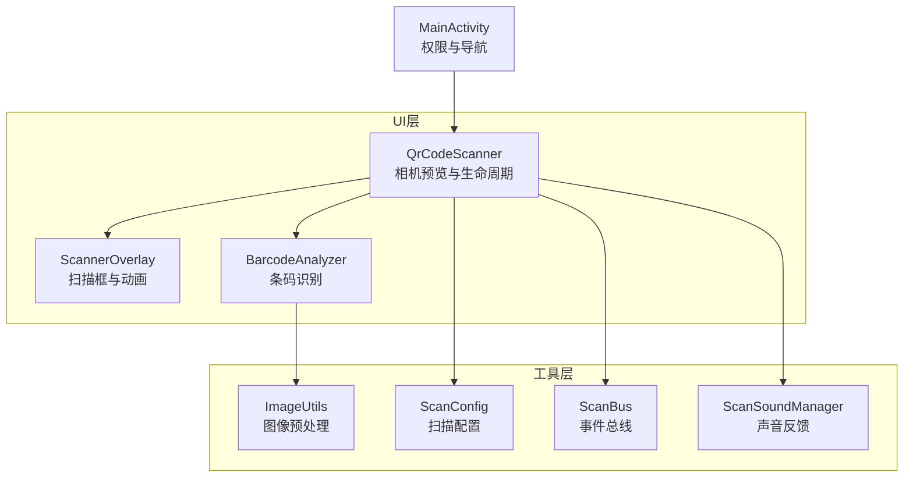
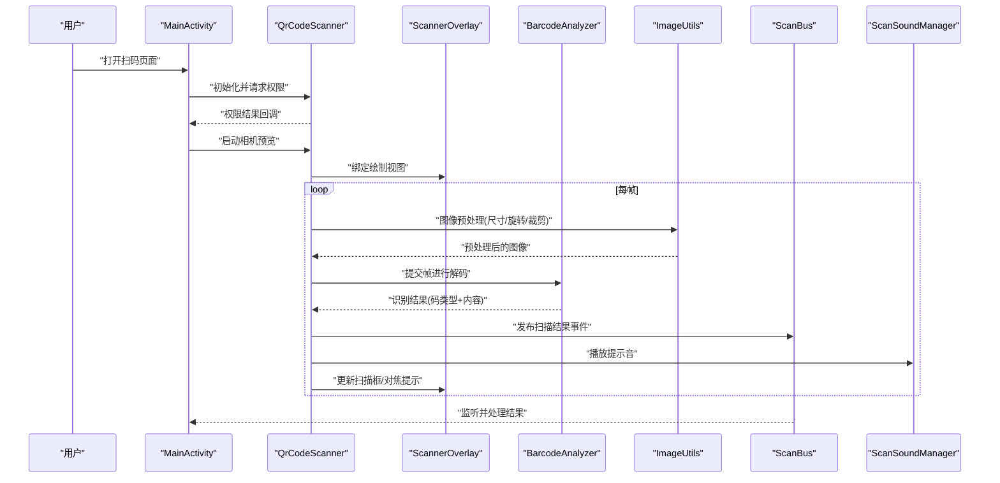
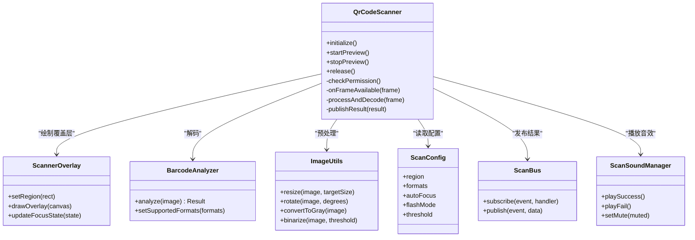
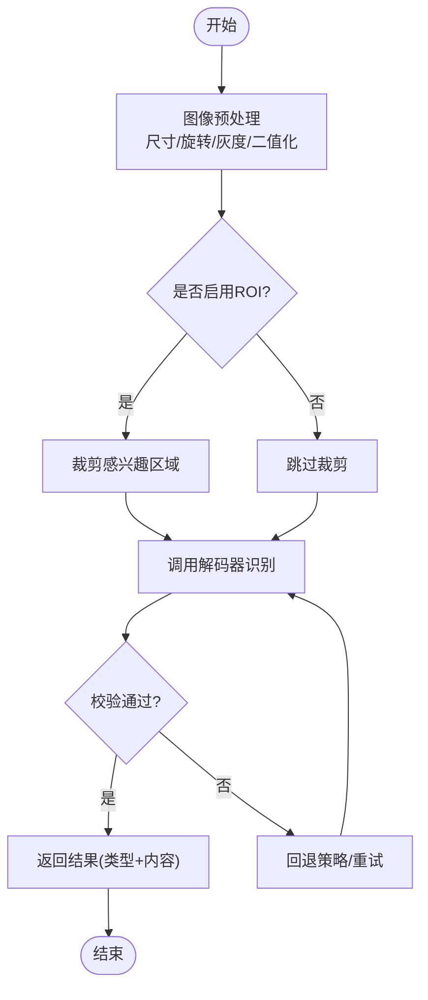
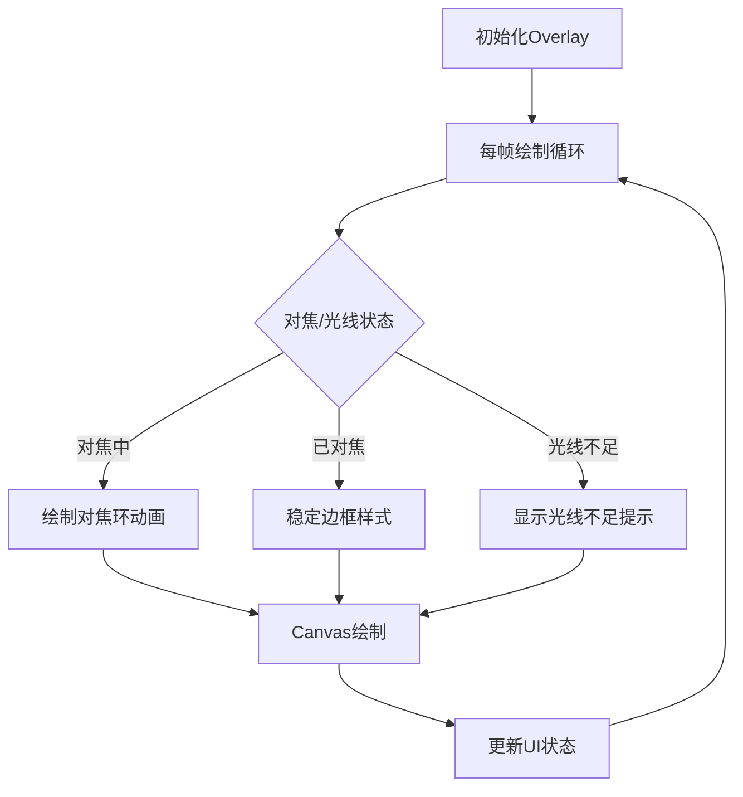
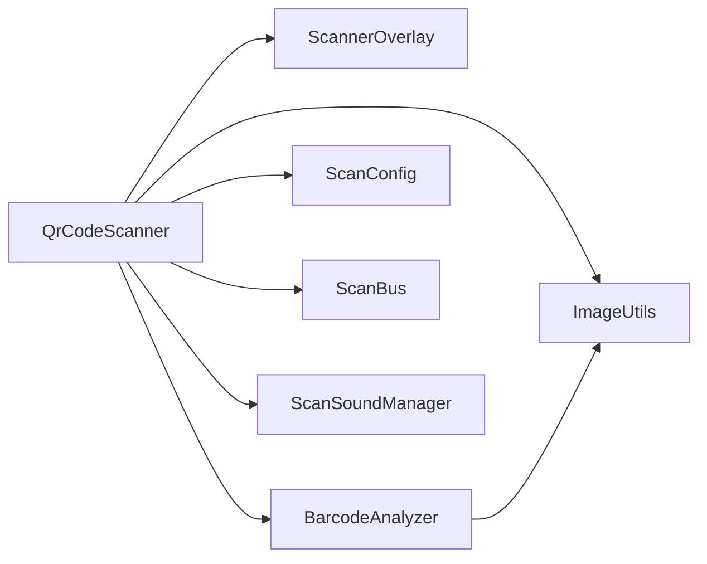

# 摄像头二维码扫描

<cite>
**本文引用的文件**   
- [QrCodeScanner.kt](file://mobile-android/app/src/main/java/com/dip/material/ui/components/QrCodeScanner.kt)
- [BarcodeAnalyzer.kt](file://mobile-android/app/src/main/java/com/dip/material/ui/components/BarcodeAnalyzer.kt)
- [ScannerOverlay.kt](file://mobile-android/app/src/main/java/com/dip/material/ui/components/ScannerOverlay.kt)
- [ImageUtils.kt](file://mobile-android/app/src/main/java/com/dip/material/ui/components/ImageUtils.kt)
- [ScanConfig.kt](file://mobile-android/app/src/main/java/com/dip/material/utils/ScanConfig.kt)
- [ScanBus.kt](file://mobile-android/app/src/main/java/com/dip/material/utils/ScanBus.kt)
- [ScanSoundManager.kt](file://mobile-android/app/src/main/java/com/dip/material/utils/ScanSoundManager.kt)
- [MainActivity.kt](file://mobile-android/app/src/main/java/com/dip/material/MainActivity.kt)
- [AndroidManifest.xml](file://mobile-android/app/src/main/AndroidManifest.xml)
</cite>

## 目录
1. [简介](#简介)
2. [项目结构](#项目结构)
3. [核心组件](#核心组件)
4. [架构总览](#架构总览)
5. [详细组件分析](#详细组件分析)
6. [依赖关系分析](#依赖关系分析)
7. [性能考虑](#性能考虑)
8. [故障排查指南](#故障排查指南)
9. [结论](#结论)
10. [附录：集成示例与最佳实践](#附录集成示例与最佳实践)

## 简介
本文件面向DIP系统Android应用中的摄像头二维码扫描功能，聚焦以下目标：
- 解析并说明 QrCodeScanner 组件的相机权限申请、生命周期管理、预览渲染流程
- 文档化 BarcodeAnalyzer 条形码分析器的算法实现与多格式识别策略
- 详解 ScannerOverlay 自定义绘制（扫描框动画、对焦提示、光线适配）
- 总结二维码解码性能优化（图像预处理、多线程处理、内存管理）
- 提供摄像头兼容性处理方案与设备适配方法
- 给出完整集成示例，展示如何在业务页面接入、处理结果与用户交互

## 项目结构
Android端扫码相关代码位于 mobile-android/app/src/main/java/com/dip/material 下，关键目录与职责如下：
- ui/components：UI与相机能力封装（QrCodeScanner、ScannerOverlay、BarcodeAnalyzer、ImageUtils）
- utils：扫描工具与配置（ScanConfig、ScanBus、ScanSoundManager）
- MainActivity：入口与权限引导、页面跳转等

图表来源
- [QrCodeScanner.kt](file://mobile-android/app/src/main/java/com/dip/material/ui/components/QrCodeScanner.kt)
- [ScannerOverlay.kt](file://mobile-android/app/src/main/java/com/dip/material/ui/components/ScannerOverlay.kt)
- [BarcodeAnalyzer.kt](file://mobile-android/app/src/main/java/com/dip/material/ui/components/BarcodeAnalyzer.kt)
- [ImageUtils.kt](file://mobile-android/app/src/main/java/com/dip/material/ui/components/ImageUtils.kt)
- [ScanConfig.kt](file://mobile-android/app/src/main/java/com/dip/material/utils/ScanConfig.kt)
- [ScanBus.kt](file://mobile-android/app/src/main/java/com/dip/material/utils/ScanBus.kt)
- [ScanSoundManager.kt](file://mobile-android/app/src/main/java/com/dip/material/utils/ScanSoundManager.kt)
- [MainActivity.kt](file://mobile-android/app/src/main/java/com/dip/material/MainActivity.kt)

章节来源
- [MainActivity.kt](file://mobile-android/app/src/main/java/com/dip/material/MainActivity.kt)
- [AndroidManifest.xml](file://mobile-android/app/src/main/AndroidManifest.xml)

## 核心组件
- QrCodeScanner：封装相机预览、权限申请、生命周期回调、帧采集与解码触发。负责将相机帧交给 BarcodeAnalyzer，并将结果通过 ScanBus 上报。
- BarcodeAnalyzer：对输入图像进行预处理（缩放、灰度、二值化等），调用解码库识别多种条码格式，返回结构化结果。
- ScannerOverlay：在相机预览上层绘制扫描框、边框动画、对焦提示、光线指示等视觉元素。
- ImageUtils：提供图像尺寸计算、旋转校正、裁剪、缩放、格式转换等工具方法。
- ScanConfig：集中管理扫描区域、支持的条码类型、是否自动对焦、闪光灯策略、阈值参数等。
- ScanBus：基于事件总线的轻量通信机制，用于在组件间传递扫描结果与状态。
- ScanSoundManager：播放成功/失败音效，支持静音模式与音量控制。

章节来源
- [QrCodeScanner.kt](file://mobile-android/app/src/main/java/com/dip/material/ui/components/QrCodeScanner.kt)
- [BarcodeAnalyzer.kt](file://mobile-android/app/src/main/java/com/dip/material/ui/components/BarcodeAnalyzer.kt)
- [ScannerOverlay.kt](file://mobile-android/app/src/main/java/com/dip/material/ui/components/ScannerOverlay.kt)
- [ImageUtils.kt](file://mobile-android/app/src/main/java/com/dip/material/ui/components/ImageUtils.kt)
- [ScanConfig.kt](file://mobile-android/app/src/main/java/com/dip/material/utils/ScanConfig.kt)
- [ScanBus.kt](file://mobile-android/app/src/main/java/com/dip/material/utils/ScanBus.kt)
- [ScanSoundManager.kt](file://mobile-android/app/src/main/java/com/dip/material/utils/ScanSoundManager.kt)

## 架构总览
整体数据流与控制流如下：
- 权限申请：由入口Activity或组件发起，检查并请求相机权限
- 相机初始化：根据设备能力选择合适分辨率与方向，设置预览Surface
- 帧采集与解码：CameraX/原生API回调帧数据，经ImageUtils预处理后交由BarcodeAnalyzer解码
- 结果上报：通过ScanBus广播扫描结果，UI层订阅并处理
- 视觉反馈：ScannerOverlay绘制扫描框与动画，ScanSoundManager播放提示音

图表来源
- [QrCodeScanner.kt](file://mobile-android/app/src/main/java/com/dip/material/ui/components/QrCodeScanner.kt)
- [BarcodeAnalyzer.kt](file://mobile-android/app/src/main/java/com/dip/material/ui/components/BarcodeAnalyzer.kt)
- [ScannerOverlay.kt](file://mobile-android/app/src/main/java/com/dip/material/ui/components/ScannerOverlay.kt)
- [ImageUtils.kt](file://mobile-android/app/src/main/java/com/dip/material/ui/components/ImageUtils.kt)
- [ScanConfig.kt](file://mobile-android/app/src/main/java/com/dip/material/utils/ScanConfig.kt)
- [ScanBus.kt](file://mobile-android/app/src/main/java/com/dip/material/utils/ScanBus.kt)
- [ScanSoundManager.kt](file://mobile-android/app/src/main/java/com/dip/material/utils/ScanSoundManager.kt)
- [MainActivity.kt](file://mobile-android/app/src/main/java/com/dip/material/MainActivity.kt)

## 详细组件分析

### QrCodeScanner 组件
- 权限管理：在组件创建时检查相机权限，未授权则引导用户授权；支持运行时权限拒绝的回退逻辑
- 生命周期管理：onResume/onPause/onDestroy中分别启动/暂停/释放相机资源，避免泄漏与异常崩溃
- 预览渲染：选择合适的预览尺寸与方向，绑定SurfaceView/SurfaceHolder或Compose预览容器
- 帧采集与解码：从相机帧回调中提取图像数据，按ScanConfig配置进行预处理，再提交给BarcodeAnalyzer
- 结果处理：收到解码结果后，通过ScanBus发布事件，同时触发声音与UI反馈

图表来源
- [QrCodeScanner.kt](file://mobile-android/app/src/main/java/com/dip/material/ui/components/QrCodeScanner.kt)
- [ScannerOverlay.kt](file://mobile-android/app/src/main/java/com/dip/material/ui/components/ScannerOverlay.kt)
- [BarcodeAnalyzer.kt](file://mobile-android/app/src/main/java/com/dip/material/ui/components/BarcodeAnalyzer.kt)
- [ImageUtils.kt](file://mobile-android/app/src/main/java/com/dip/material/ui/components/ImageUtils.kt)
- [ScanConfig.kt](file://mobile-android/app/src/main/java/com/dip/material/utils/ScanConfig.kt)
- [ScanBus.kt](file://mobile-android/app/src/main/java/com/dip/material/utils/ScanBus.kt)
- [ScanSoundManager.kt](file://mobile-android/app/src/main/java/com/dip/material/utils/ScanSoundManager.kt)

章节来源
- [QrCodeScanner.kt](file://mobile-android/app/src/main/java/com/dip/material/ui/components/QrCodeScanner.kt)

### BarcodeAnalyzer 算法实现
- 输入图像预处理：统一尺寸、旋转校正、灰度化、对比度增强、自适应二值化
- 多格式识别：支持QR Code、EAN-13/8、UPC-A/E、Code128、Code39、DataMatrix、PDF417等（具体以配置为准）
- 解码策略：优先快速路径（QR/一维码），失败回退到通用解码器；可配置ROI区域加速
- 结果校验：校验位验证、重复结果去抖、超时重试与降级策略

图表来源
- [BarcodeAnalyzer.kt](file://mobile-android/app/src/main/java/com/dip/material/ui/components/BarcodeAnalyzer.kt)
- [ImageUtils.kt](file://mobile-android/app/src/main/java/com/dip/material/ui/components/ImageUtils.kt)
- [ScanConfig.kt](file://mobile-android/app/src/main/java/com/dip/material/utils/ScanConfig.kt)

章节来源
- [BarcodeAnalyzer.kt](file://mobile-android/app/src/main/java/com/dip/material/ui/components/BarcodeAnalyzer.kt)
- [ImageUtils.kt](file://mobile-android/app/src/main/java/com/dip/material/ui/components/ImageUtils.kt)
- [ScanConfig.kt](file://mobile-android/app/src/main/java/com/dip/material/utils/ScanConfig.kt)

### ScannerOverlay 自定义绘制
- 扫描框绘制：矩形边框、四角高亮、阴影效果
- 动画效果：边框呼吸动画、扫描线移动、对焦环闪烁
- 对焦提示：根据对焦状态切换颜色与透明度
- 光线适配：暗光环境增加亮度提示，强光环境降低对比度
- 性能优化：使用Canvas批量绘制、减少重绘区域、复用Paint对象

图表来源
- [ScannerOverlay.kt](file://mobile-android/app/src/main/java/com/dip/material/ui/components/ScannerOverlay.kt)

章节来源
- [ScannerOverlay.kt](file://mobile-android/app/src/main/java/com/dip/material/ui/components/ScannerOverlay.kt)

### ImageUtils 图像处理
- 尺寸计算：根据预览尺寸与屏幕比例计算最优目标尺寸
- 旋转校正：根据设备方向与相机传感器方向修正图像
- 格式转换：YUV转RGB、灰度化、二值化、对比度增强
- 裁剪与缩放：ROI裁剪、等比缩放、边界填充

章节来源
- [ImageUtils.kt](file://mobile-android/app/src/main/java/com/dip/material/ui/components/ImageUtils.kt)

### ScanConfig 扫描配置
- 区域配置：扫描框位置与大小，支持动态调整
- 格式配置：支持的条码类型集合，可按场景定制
- 行为配置：自动对焦开关、闪光灯策略、阈值参数
- 性能配置：最大帧率、解码线程数、缓存策略

章节来源
- [ScanConfig.kt](file://mobile-android/app/src/main/java/com/dip/material/utils/ScanConfig.kt)

### ScanBus 事件总线
- 订阅机制：页面或组件订阅扫描结果事件
- 发布机制：QrCodeScanner在解码成功后发布事件
- 生命周期：随页面生命周期自动解绑，避免内存泄漏

章节来源
- [ScanBus.kt](file://mobile-android/app/src/main/java/com/dip/material/utils/ScanBus.kt)

### ScanSoundManager 声音反馈
- 播放控制：成功/失败音效播放
- 静音模式：跟随系统静音或用户设置
- 音量控制：支持调节提示音音量

章节来源
- [ScanSoundManager.kt](file://mobile-android/app/src/main/java/com/dip/material/utils/ScanSoundManager.kt)

## 依赖关系分析
- QrCodeScanner 依赖 ScannerOverlay（绘制）、BarcodeAnalyzer（解码）、ImageUtils（预处理）、ScanConfig（配置）、ScanBus（事件）、ScanSoundManager（音效）
- BarcodeAnalyzer 依赖 ImageUtils（预处理）与解码库
- ScannerOverlay 依赖 Canvas绘制与动画框架
- 所有组件通过 ScanConfig 统一管理行为与参数

图表来源
- [QrCodeScanner.kt](file://mobile-android/app/src/main/java/com/dip/material/ui/components/QrCodeScanner.kt)
- [BarcodeAnalyzer.kt](file://mobile-android/app/src/main/java/com/dip/material/ui/components/BarcodeAnalyzer.kt)
- [ScannerOverlay.kt](file://mobile-android/app/src/main/java/com/dip/material/ui/components/ScannerOverlay.kt)
- [ImageUtils.kt](file://mobile-android/app/src/main/java/com/dip/material/ui/components/ImageUtils.kt)
- [ScanConfig.kt](file://mobile-android/app/src/main/java/com/dip/material/utils/ScanConfig.kt)
- [ScanBus.kt](file://mobile-android/app/src/main/java/com/dip/material/utils/ScanBus.kt)
- [ScanSoundManager.kt](file://mobile-android/app/src/main/java/com/dip/material/utils/ScanSoundManager.kt)

章节来源
- [QrCodeScanner.kt](file://mobile-android/app/src/main/java/com/dip/material/ui/components/QrCodeScanner.kt)
- [BarcodeAnalyzer.kt](file://mobile-android/app/src/main/java/com/dip/material/ui/components/BarcodeAnalyzer.kt)
- [ScannerOverlay.kt](file://mobile-android/app/src/main/java/com/dip/material/ui/components/ScannerOverlay.kt)
- [ImageUtils.kt](file://mobile-android/app/src/main/java/com/dip/material/ui/components/ImageUtils.kt)
- [ScanConfig.kt](file://mobile-android/app/src/main/java/com/dip/material/utils/ScanConfig.kt)
- [ScanBus.kt](file://mobile-android/app/src/main/java/com/dip/material/utils/ScanBus.kt)
- [ScanSoundManager.kt](file://mobile-android/app/src/main/java/com/dip/material/utils/ScanSoundManager.kt)

## 性能考虑
- 图像预处理优化
  - 按需缩放：根据解码需求选择最小可用尺寸，减少内存占用
  - 灰度与二值化：仅在必要时进行，避免重复转换
  - ROI裁剪：限制解码区域，提升识别速度
- 多线程处理
  - 解码线程池：并发处理多帧，避免阻塞主线程
  - 异步回调：结果回调采用协程或回调接口，确保UI流畅
- 内存管理
  - 重用Bitmap与缓冲区，避免频繁分配
  - 及时释放相机资源与解码中间对象
- 预览与解码分离
  - 预览保持高分辨率，解码使用降采样图像
- 设备适配
  - 动态检测相机能力，选择最优分辨率与帧率
  - 针对不同厂商相机驱动进行兼容处理

[本节为通用指导，不直接分析具体文件]

## 故障排查指南
- 权限问题
  - 现象：无法打开相机或黑屏
  - 排查：检查运行时权限申请与Manifest声明
- 预览异常
  - 现象：画面拉伸、旋转错误
  - 排查：核对预览尺寸与设备方向，检查旋转校正逻辑
- 解码失败
  - 现象：无法识别或识别率低
  - 排查：检查预处理参数、ROI设置、光线条件与条码质量
- 卡顿与崩溃
  - 现象：界面卡顿或OOM
  - 排查：监控内存使用，减少大对象分配，优化解码线程负载
- 声音无反馈
  - 现象：成功无提示音
  - 排查：检查静音模式与音量设置，确认音效资源加载

章节来源
- [AndroidManifest.xml](file://mobile-android/app/src/main/AndroidManifest.xml)
- [QrCodeScanner.kt](file://mobile-android/app/src/main/java/com/dip/material/ui/components/QrCodeScanner.kt)
- [BarcodeAnalyzer.kt](file://mobile-android/app/src/main/java/com/dip/material/ui/components/BarcodeAnalyzer.kt)
- [ScannerOverlay.kt](file://mobile-android/app/src/main/java/com/dip/material/ui/components/ScannerOverlay.kt)
- [ScanSoundManager.kt](file://mobile-android/app/src/main/java/com/dip/material/utils/ScanSoundManager.kt)

## 结论
QrCodeScanner组件通过清晰的职责划分与模块化设计，实现了稳定的相机权限管理、生命周期控制与预览渲染；BarcodeAnalyzer提供高效的图像预处理与多格式识别；ScannerOverlay增强了用户体验；配合ScanConfig、ScanBus与ScanSoundManager形成完整的扫码解决方案。通过合理的性能优化与设备兼容性处理，可在不同设备上获得一致的扫码体验。

[本节为总结性内容，不直接分析具体文件]

## 附录：集成示例与最佳实践
- 在业务页面中引入QrCodeScanner
  - 初始化组件并传入ScanConfig配置
  - 订阅ScanBus事件获取扫描结果
  - 处理用户交互（如取消、重试、跳转）
- 权限申请流程
  - 在页面启动前检查权限，未授权则引导用户授权
  - 处理拒绝权限的回退逻辑（如跳转到设置页）
- 结果处理建议
  - 对重复结果进行去抖处理
  - 根据码类型执行不同业务逻辑
  - 提供失败重试与手动输入入口
- 性能调优建议
  - 合理设置ROI与解码线程数
  - 监控内存与CPU使用，避免长时间高负载
  - 针对弱网与离线场景做降级处理

章节来源
- [MainActivity.kt](file://mobile-android/app/src/main/java/com/dip/material/MainActivity.kt)
- [QrCodeScanner.kt](file://mobile-android/app/src/main/java/com/dip/material/ui/components/QrCodeScanner.kt)
- [ScanConfig.kt](file://mobile-android/app/src/main/java/com/dip/material/utils/ScanConfig.kt)
- [ScanBus.kt](file://mobile-android/app/src/main/java/com/dip/material/utils/ScanBus.kt)
- [AndroidManifest.xml](file://mobile-android/app/src/main/AndroidManifest.xml)