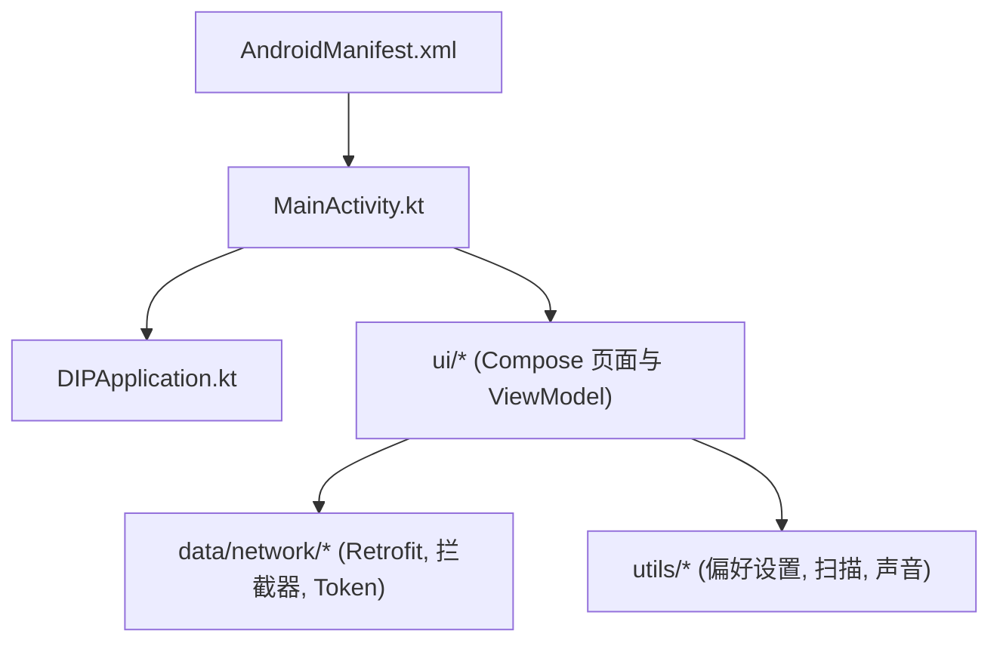
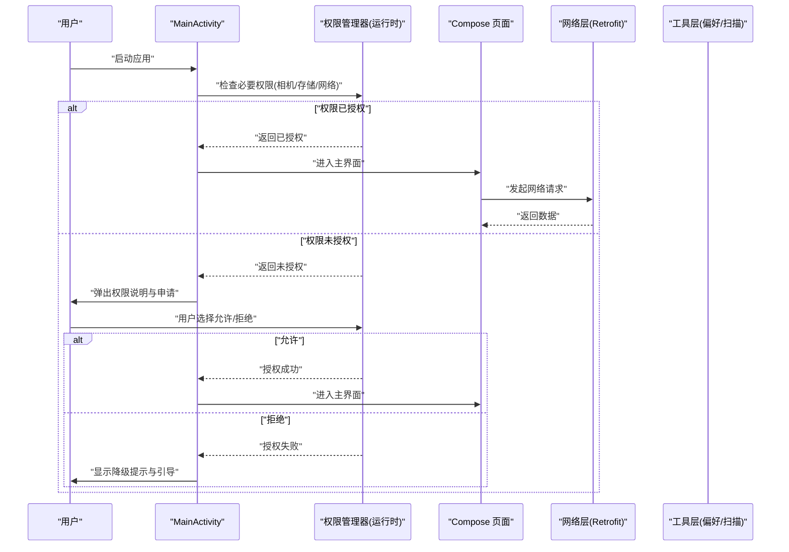
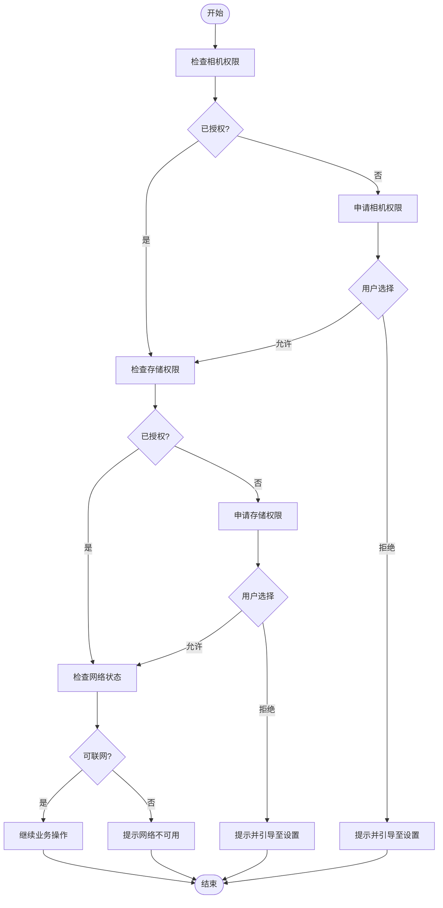
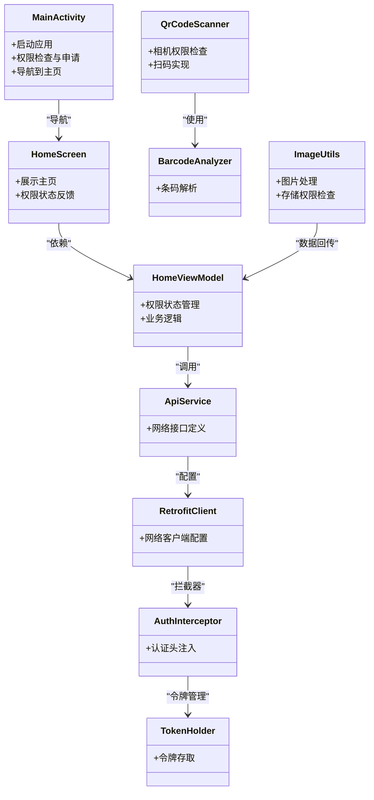
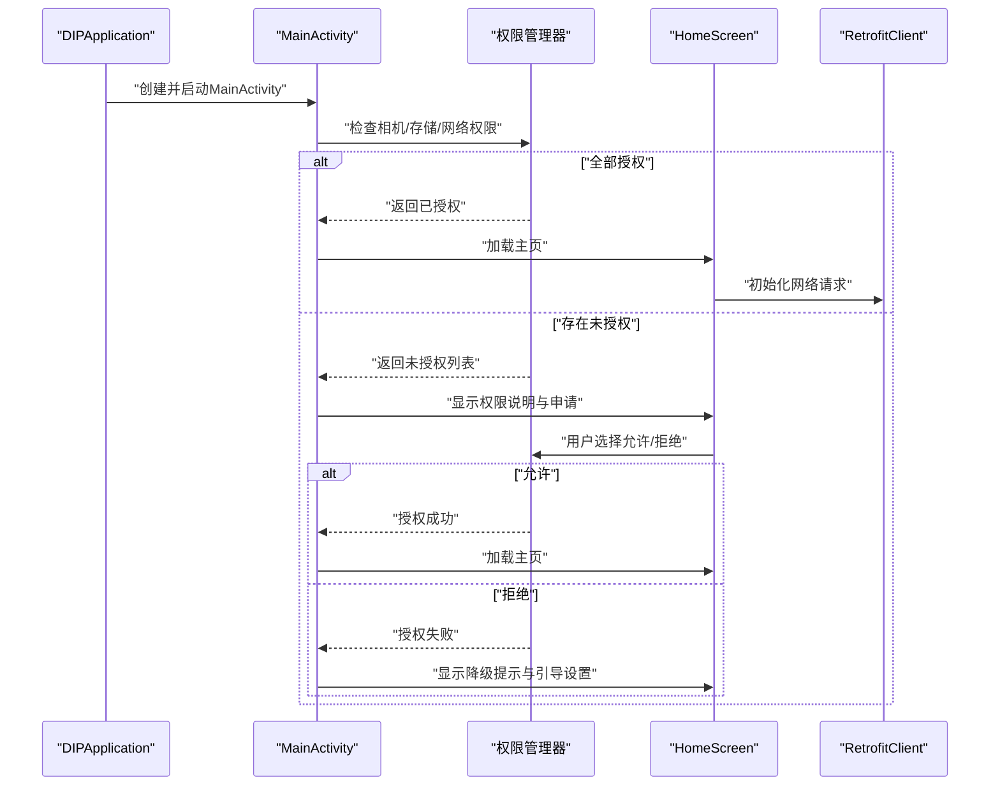

# 硬件权限管理

<cite>
**本文引用的文件**   
- [AndroidManifest.xml](file://mobile-android/app/src/main/AndroidManifest.xml)
- [MainActivity.kt](file://mobile-android/app/src/main/java/com/dip/material/MainActivity.kt)
- [DIPApplication.kt](file://mobile-android/app/src/main/java/com/dip/material/DIPApplication.kt)
- [ApiService.kt](file://mobile-android/app/src/main/java/com/dip/material/data/network/ApiService.kt)
- [RetrofitClient.kt](file://mobile-android/app/src/main/java/com/dip/material/data/network/RetrofitClient.kt)
- [AuthInterceptor.kt](file://mobile-android/app/src/main/java/com/dip/material/data/network/AuthInterceptor.kt)
- [TokenHolder.kt](file://mobile-android/app/src/main/java/com/dip/material/data/network/TokenHolder.kt)
- [AppRepository.kt](file://mobile-android/app/src/main/java/com/dip/material/data/repository/AppRepository.kt)
- [HomeScreen.kt](file://mobile-android/app/src/main/java/com/dip/material/ui/home/HomeScreen.kt)
- [HomeViewModel.kt](file://mobile-android/app/src/main/java/com/dip/material/ui/home/HomeViewModel.kt)
- [LoginScreen.kt](file://mobile-android/app/src/main/java/com/dip/material/ui/login/LoginScreen.kt)
- [LoginViewModel.kt](file://mobile-android/app/src/main/java/com/dip/material/ui/login/LoginViewModel.kt)
- [CallMaterialScreen.kt](file://mobile-android/app/src/main/java/com/dip/material/ui/callmaterial/CallMaterialScreen.kt)
- [CallMaterialViewModel.kt](file://mobile-android/app/src/main/java/com/dip/material/ui/callmaterial/CallMaterialViewModel.kt)
- [QrCodeScanner.kt](file://mobile-android/app/src/main/java/com/dip/material/ui/components/QrCodeScanner.kt)
- [BarcodeAnalyzer.kt](file://mobile-android/app/src/main/java/com/dip/material/ui/components/BarcodeAnalyzer.kt)
- [ImageUtils.kt](file://mobile-android/app/src/main/java/com/dip/material/ui/components/ImageUtils.kt)
- [PreferencesManager.kt](file://mobile-android/app/src/main/java/com/dip/material/utils/PreferencesManager.kt)
- [ScanBroadcastReceiver.kt](file://mobile-android/app/src/main/java/com/dip/material/utils/ScanBroadcastReceiver.kt)
- [ScanBus.kt](file://mobile-android/app/src/main/java/com/dip/material/utils/ScanBus.kt)
- [ScanConfig.kt](file://mobile-android/app/src/main/java/com/dip/material/utils/ScanConfig.kt)
- [ScanSoundManager.kt](file://mobile-android/app/src/main/java/com/dip/material/utils/ScanSoundManager.kt)
</cite>

## 目录
1. [简介](#简介)
2. [项目结构](#项目结构)
3. [核心组件](#核心组件)
4. [架构总览](#架构总览)
5. [详细组件分析](#详细组件分析)
6. [依赖关系分析](#依赖关系分析)
7. [性能考虑](#性能考虑)
8. [故障排查指南](#故障排查指南)
9. [结论](#结论)
10. [附录：启动时权限检查与处理示例](#附录启动时权限检查与处理示例)

## 简介
本文件面向DIP系统Android应用的“硬件权限管理”，聚焦运行时权限（相机、存储、网络）的申请流程、状态检查、动态请求、拒绝后的降级方案，以及AndroidManifest中的权限声明与多版本兼容策略。文档同时给出用户体验设计建议与最佳实践，并提供在应用启动时检查和处理硬件权限的完整流程说明（以代码片段路径引用代替直接贴出代码）。

## 项目结构
Android端位于 mobile-android 模块，关键目录如下：
- app/src/main/AndroidManifest.xml：声明应用所需权限
- app/src/main/java/com/dip/material/MainActivity.kt：应用入口，负责初始化与生命周期相关逻辑
- app/src/main/java/com/dip/material/DIPApplication.kt：应用级初始化
- data/network：网络层（Retrofit、拦截器、令牌管理）
- ui：基于Jetpack Compose的界面与ViewModel
- utils：工具类（偏好设置、扫描广播、声音管理等）

图表来源
- [AndroidManifest.xml](file://mobile-android/app/src/main/AndroidManifest.xml)
- [MainActivity.kt](file://mobile-android/app/src/main/java/com/dip/material/MainActivity.kt)
- [DIPApplication.kt](file://mobile-android/app/src/main/java/com/dip/material/DIPApplication.kt)

章节来源
- [AndroidManifest.xml](file://mobile-android/app/src/main/AndroidManifest.xml)
- [MainActivity.kt](file://mobile-android/app/src/main/java/com/dip/material/MainActivity.kt)
- [DIPApplication.kt](file://mobile-android/app/src/main/java/com/dip/material/DIPApplication.kt)

## 核心组件
- 权限声明与清单配置：通过 AndroidManifest.xml 声明相机、存储、网络等权限，并配合 targetSdkVersion 进行兼容性控制。
- 运行时权限申请：在需要访问硬件或敏感数据前，使用运行时权限API进行检查与申请，支持批量申请与用户选择结果处理。
- 网络权限与连通性：网络功能依赖网络权限与设备网络状态；建议在发起请求前做连通性预检与错误提示。
- 权限恢复与引导：当用户拒绝或取消权限时，提供友好的解释与引导，必要时跳转到系统设置页开启权限。
- 启动时权限检查：在应用启动阶段集中检查必要权限，未授权则立即引导用户完成授权，避免后续流程中断。

章节来源
- [AndroidManifest.xml](file://mobile-android/app/src/main/AndroidManifest.xml)
- [MainActivity.kt](file://mobile-android/app/src/main/java/com/dip/material/MainActivity.kt)
- [DIPApplication.kt](file://mobile-android/app/src/main/java/com/dip/material/DIPApplication.kt)

## 架构总览
下图展示权限相关的整体交互：应用启动后，由入口Activity协调权限检查与申请；UI层根据权限状态决定功能可用性；网络层在具备网络权限后进行通信；工具层提供偏好设置与扫描能力。

图表来源
- [MainActivity.kt](file://mobile-android/app/src/main/java/com/dip/material/MainActivity.kt)
- [HomeScreen.kt](file://mobile-android/app/src/main/java/com/dip/material/ui/home/HomeScreen.kt)
- [HomeViewModel.kt](file://mobile-android/app/src/main/java/com/dip/material/ui/home/HomeViewModel.kt)
- [ApiService.kt](file://mobile-android/app/src/main/java/com/dip/material/data/network/ApiService.kt)
- [RetrofitClient.kt](file://mobile-android/app/src/main/java/com/dip/material/data/network/RetrofitClient.kt)
- [AuthInterceptor.kt](file://mobile-android/app/src/main/java/com/dip/material/data/network/AuthInterceptor.kt)
- [TokenHolder.kt](file://mobile-android/app/src/main/java/com/dip/material/data/network/TokenHolder.kt)

## 详细组件分析

### 清单权限与版本兼容
- 相机权限：声明相机硬件与相机访问权限，适配不同Android版本的相机API差异。
- 存储权限：针对Android 10及以上采用分区存储，仅在需要读写外部存储时声明相应权限，并在UI中提示存储位置变化。
- 网络权限：声明网络访问权限，并在网络不可用时提供友好提示。
- 目标SDK与最小SDK：通过targetSdkVersion与minSdkVersion控制行为差异，确保运行时权限API可用。

章节来源
- [AndroidManifest.xml](file://mobile-android/app/src/main/AndroidManifest.xml)

### 运行时权限申请流程（相机、存储、网络）
- 相机权限：在进入扫码或拍照功能前检查并申请；若被拒绝，提供解释与跳转系统设置的选项。
- 存储权限：在需要保存或读取图片/文件时检查并申请；对Android 10+优先使用媒体集合API。
- 网络权限：网络请求前检查网络状态；无网络权限或无网络时提示用户。

图表来源
- [MainActivity.kt](file://mobile-android/app/src/main/java/com/dip/material/MainActivity.kt)
- [HomeScreen.kt](file://mobile-android/app/src/main/java/com/dip/material/ui/home/HomeScreen.kt)
- [HomeViewModel.kt](file://mobile-android/app/src/main/java/com/dip/material/ui/home/HomeViewModel.kt)
- [QrCodeScanner.kt](file://mobile-android/app/src/main/java/com/dip/material/ui/components/QrCodeScanner.kt)
- [BarcodeAnalyzer.kt](file://mobile-android/app/src/main/java/com/dip/material/ui/components/BarcodeAnalyzer.kt)
- [ImageUtils.kt](file://mobile-android/app/src/main/java/com/dip/material/ui/components/ImageUtils.kt)

章节来源
- [MainActivity.kt](file://mobile-android/app/src/main/java/com/dip/material/MainActivity.kt)
- [HomeScreen.kt](file://mobile-android/app/src/main/java/com/dip/material/ui/home/HomeScreen.kt)
- [HomeViewModel.kt](file://mobile-android/app/src/main/java/com/dip/material/ui/home/HomeViewModel.kt)
- [QrCodeScanner.kt](file://mobile-android/app/src/main/java/com/dip/material/ui/components/QrCodeScanner.kt)
- [BarcodeAnalyzer.kt](file://mobile-android/app/src/main/java/com/dip/material/ui/components/BarcodeAnalyzer.kt)
- [ImageUtils.kt](file://mobile-android/app/src/main/java/com/dip/material/ui/components/ImageUtils.kt)

### 权限状态检查与动态请求处理
- 状态检查：在进入功能前调用权限检查API，区分“已授权”“未授权”“永久拒绝”等状态。
- 动态请求：对未授权项发起申请，处理用户回调（允许/拒绝/取消），并根据结果更新UI与业务状态。
- 批量申请：对多个权限一次性申请，减少弹窗次数，提升体验。

章节来源
- [MainActivity.kt](file://mobile-android/app/src/main/java/com/dip/material/MainActivity.kt)
- [HomeViewModel.kt](file://mobile-android/app/src/main/java/com/dip/material/ui/home/HomeViewModel.kt)

### 用户拒绝权限后的降级方案
- 相机拒绝：禁用扫码/拍照入口，显示原因说明，提供“前往设置开启”按钮。
- 存储拒绝：限制文件读写功能，改用系统分享或云端同步替代方案。
- 网络拒绝：禁用在线功能，提示离线模式或网络连接问题。

章节来源
- [HomeScreen.kt](file://mobile-android/app/src/main/java/com/dip/material/ui/home/HomeScreen.kt)
- [HomeViewModel.kt](file://mobile-android/app/src/main/java/com/dip/material/ui/home/HomeViewModel.kt)

### 网络权限与连通性
- 网络权限：在AndroidManifest中声明网络权限，确保应用能访问互联网。
- 连通性检测：在网络请求前检查网络状态，失败时给出明确提示与重试机制。
- 认证与令牌：通过拦截器统一添加认证头，令牌失效时引导重新登录。

章节来源
- [ApiService.kt](file://mobile-android/app/src/main/java/com/dip/material/data/network/ApiService.kt)
- [RetrofitClient.kt](file://mobile-android/app/src/main/java/com/dip/material/data/network/RetrofitClient.kt)
- [AuthInterceptor.kt](file://mobile-android/app/src/main/java/com/dip/material/data/network/AuthInterceptor.kt)
- [TokenHolder.kt](file://mobile-android/app/src/main/java/com/dip/material/data/network/TokenHolder.kt)

### 权限相关的用户体验设计
- 前置说明：在申请权限前，通过对话框解释用途与必要性，降低用户拒绝率。
- 渐进式引导：首次拒绝后再次进入功能时，提供更清晰的引导与帮助。
- 一键跳转设置：提供直达系统设置页面的快捷方式，便于用户快速开启权限。

章节来源
- [HomeScreen.kt](file://mobile-android/app/src/main/java/com/dip/material/ui/home/HomeScreen.kt)
- [LoginScreen.kt](file://mobile-android/app/src/main/java/com/dip/material/ui/login/LoginScreen.kt)

### 权限最佳实践
- 权限预检：在功能入口提前检查权限，避免中途失败。
- 批量申请：合并多个权限申请，减少打扰。
- 权限恢复：记录用户选择，提供“恢复权限”入口，支持从设置页返回后刷新状态。
- 版本兼容：针对不同Android版本采用合适的API与存储策略。

章节来源
- [PreferencesManager.kt](file://mobile-android/app/src/main/java/com/dip/material/utils/PreferencesManager.kt)
- [MainActivity.kt](file://mobile-android/app/src/main/java/com/dip/material/MainActivity.kt)

## 依赖关系分析
权限相关组件之间的依赖关系如下：
- MainActivity作为入口，协调权限检查与UI导航。
- HomeScreen/HomeViewModel负责业务权限状态与交互。
- QrCodeScanner/BarcodeAnalyzer依赖相机权限进行扫码。
- ImageUtils依赖存储权限进行图片处理。
- Retrofit网络层依赖网络权限与认证拦截器。

图表来源
- [MainActivity.kt](file://mobile-android/app/src/main/java/com/dip/material/MainActivity.kt)
- [HomeScreen.kt](file://mobile-android/app/src/main/java/com/dip/material/ui/home/HomeScreen.kt)
- [HomeViewModel.kt](file://mobile-android/app/src/main/java/com/dip/material/ui/home/HomeViewModel.kt)
- [QrCodeScanner.kt](file://mobile-android/app/src/main/java/com/dip/material/ui/components/QrCodeScanner.kt)
- [BarcodeAnalyzer.kt](file://mobile-android/app/src/main/java/com/dip/material/ui/components/BarcodeAnalyzer.kt)
- [ImageUtils.kt](file://mobile-android/app/src/main/java/com/dip/material/ui/components/ImageUtils.kt)
- [ApiService.kt](file://mobile-android/app/src/main/java/com/dip/material/data/network/ApiService.kt)
- [RetrofitClient.kt](file://mobile-android/app/src/main/java/com/dip/material/data/network/RetrofitClient.kt)
- [AuthInterceptor.kt](file://mobile-android/app/src/main/java/com/dip/material/data/network/AuthInterceptor.kt)
- [TokenHolder.kt](file://mobile-android/app/src/main/java/com/dip/material/data/network/TokenHolder.kt)

章节来源
- [MainActivity.kt](file://mobile-android/app/src/main/java/com/dip/material/MainActivity.kt)
- [HomeScreen.kt](file://mobile-android/app/src/main/java/com/dip/material/ui/home/HomeScreen.kt)
- [HomeViewModel.kt](file://mobile-android/app/src/main/java/com/dip/material/ui/home/HomeViewModel.kt)
- [QrCodeScanner.kt](file://mobile-android/app/src/main/java/com/dip/material/ui/components/QrCodeScanner.kt)
- [BarcodeAnalyzer.kt](file://mobile-android/app/src/main/java/com/dip/material/ui/components/BarcodeAnalyzer.kt)
- [ImageUtils.kt](file://mobile-android/app/src/main/java/com/dip/material/ui/components/ImageUtils.kt)
- [ApiService.kt](file://mobile-android/app/src/main/java/com/dip/material/data/network/ApiService.kt)
- [RetrofitClient.kt](file://mobile-android/app/src/main/java/com/dip/material/data/network/RetrofitClient.kt)
- [AuthInterceptor.kt](file://mobile-android/app/src/main/java/com/dip/material/data/network/AuthInterceptor.kt)
- [TokenHolder.kt](file://mobile-android/app/src/main/java/com/dip/material/data/network/TokenHolder.kt)

## 性能考虑
- 权限检查应延迟到实际需要时执行，避免启动阻塞。
- 批量申请权限可减少多次弹窗带来的卡顿与用户干扰。
- 网络请求前进行连通性检查，避免无效请求造成的资源浪费。
- 使用缓存与本地状态减少重复权限检查频率。

[本节为通用指导，不直接分析具体文件]

## 故障排查指南
- 相机无法打开：检查相机权限是否授予，确认设备是否有摄像头硬件，查看相机API兼容性。
- 存储写入失败：确认存储权限与分区存储策略，检查目标路径是否存在与可写。
- 网络请求失败：检查网络权限与网络状态，查看认证令牌是否有效，关注拦截器日志。
- 权限被拒绝：检查用户是否勾选“不再询问”，必要时引导至系统设置页重新开启。

章节来源
- [QrCodeScanner.kt](file://mobile-android/app/src/main/java/com/dip/material/ui/components/QrCodeScanner.kt)
- [ImageUtils.kt](file://mobile-android/app/src/main/java/com/dip/material/ui/components/ImageUtils.kt)
- [ApiService.kt](file://mobile-android/app/src/main/java/com/dip/material/data/network/ApiService.kt)
- [AuthInterceptor.kt](file://mobile-android/app/src/main/java/com/dip/material/data/network/AuthInterceptor.kt)
- [TokenHolder.kt](file://mobile-android/app/src/main/java/com/dip/material/data/network/TokenHolder.kt)

## 结论
通过对AndroidManifest权限声明、运行时权限申请、网络连通性检查与用户引导的综合设计，DIP系统Android应用在硬件权限管理方面实现了稳定、友好且可维护的方案。遵循最佳实践与版本兼容策略，可有效提升用户体验与系统可靠性。

[本节为总结，不直接分析具体文件]

## 附录：启动时权限检查与处理示例
以下流程展示了如何在应用启动时检查并处理相机、存储、网络权限，包括状态检查、动态申请、拒绝降级与引导设置。请结合对应源码路径参考实现细节。

图表来源
- [DIPApplication.kt](file://mobile-android/app/src/main/java/com/dip/material/DIPApplication.kt)
- [MainActivity.kt](file://mobile-android/app/src/main/java/com/dip/material/MainActivity.kt)
- [HomeScreen.kt](file://mobile-android/app/src/main/java/com/dip/material/ui/home/HomeScreen.kt)
- [RetrofitClient.kt](file://mobile-android/app/src/main/java/com/dip/material/data/network/RetrofitClient.kt)

章节来源
- [DIPApplication.kt](file://mobile-android/app/src/main/java/com/dip/material/DIPApplication.kt)
- [MainActivity.kt](file://mobile-android/app/src/main/java/com/dip/material/MainActivity.kt)
- [HomeScreen.kt](file://mobile-android/app/src/main/java/com/dip/material/ui/home/HomeScreen.kt)
- [RetrofitClient.kt](file://mobile-android/app/src/main/java/com/dip/material/data/network/RetrofitClient.kt)